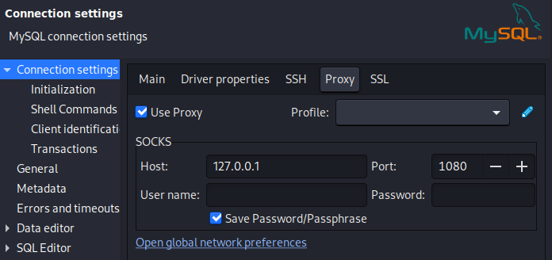

# Port Forwarding with Chisel


## Config

Edit `/etc/proxychains4.conf` file
```
[ProxyList]
# add proxy here ...
# meanwile
# defaults set to "tor"
#socks4         127.0.0.1 9050
socks5          127.0.0.1 1080
```
Comment `socks4` line and add `socks5` line.

## Kali <==> Windows JumpBox <==> Target

Kali - server
```
./chisel server -p 8000 --reverse
```

Windows JumpBox - client
```
.\chisel.exe client <Kali IP>:8000 R:socks
```

---

Access with nmap
- -Pn: Treat all hosts as online -- skip host discovery
- -n: Never do DNS resolution
- -sS/sT/sA/sW/sM: TCP SYN/Connect()/ACK/Window/Maimon scans
```
proxychains nmap -sT -p <Target Ports> -Pn -n <Target IP>
```

Access with mysql
```
proxychains mysql -h <Target IP> -u <user> -p
```

Access with ssh
```
proxychains ssh <user>@<Target IP>
```

Access with dbeaver




## Download

- [Chisel - releases](https://github.com/jpillora/chisel/releases)


## Links

- [YouTube - Elevate Cyber - Chisel](https://www.youtube.com/watch?v=dIqoULXmhXg/_blank)
- [Port Forwarding with Chisel](https://notes.benheater.com/books/network-pivoting/page/port-forwarding-with-chisel)