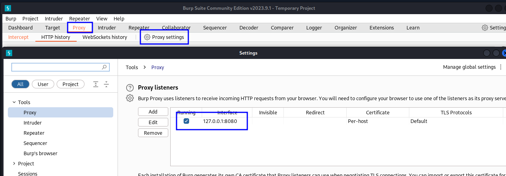
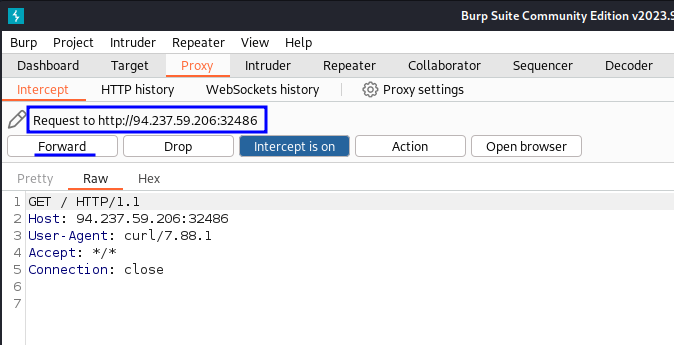

# Web Proxy

## Redirect to proxy using `proxychains`

Edit `/etc/proxychains4.conf` to point to `Burp/ZAP` proxy IP.

```bash

# Quiet mode (no output from library)
quiet_mode

...

[ProxyList]
# add proxy here ...
# meanwile
# defaults set to "tor"
#socks4         127.0.0.1 9050
#socks5         127.0.0.1 1080
http            127.0.0.1 8080

```




Now you can make requests using tools like `curl` via `proxychains` sending the request to your web proxy tool (ex. `Burp`).

```bash
┌──(kali㉿kali)-[~/Projects]
└─$ proxychains curl http://94.237.59.206:32486
[proxychains] config file found: /etc/proxychains4.conf
[proxychains] preloading /usr/lib/x86_64-linux-gnu/libproxychains.so.4

```



```bash
┌──(kali㉿kali)-[~/Projects]
└─$ proxychains curl http://94.237.59.206:32486
[proxychains] config file found: /etc/proxychains4.conf
[proxychains] preloading /usr/lib/x86_64-linux-gnu/libproxychains.so.4
<!DOCTYPE html>
<html lang="en">

<head>
    <meta charset="UTF-8">
    <title>Ping IP</title>
    <link rel="stylesheet" href="./style.css">
</head>

<body>
    <form name='ping' class='form' method='post' id='form1' action='/ping'>
        <center>
            <h1>
                <label for="ip">Ping Your IP:</label>
                <center>127.0.0.
                    <input type="number" id="ip" name="ip" min="1" max="255" maxlength="3"
                        oninput="javascript: if (this.value.length > this.maxLength) this.value = this.value.slice(0, this.maxLength);"
                        required>
            </h1>
        </center>
        <br>
        <button class='btn block-cube block-cube-hover' id='submit' type='submit'>
            <div class='bg-top'>
                <div class='bg-inner'></div>
            </div>
            <div class='bg-right'>
                <div class='bg-inner'></div>
            </div>
            <div class='bg'>
                <div class='bg-inner'></div>
            </div>
            <div class='text'>
                Ping
            </div>
        </button>
    </form>
</body>

</html> 
```
